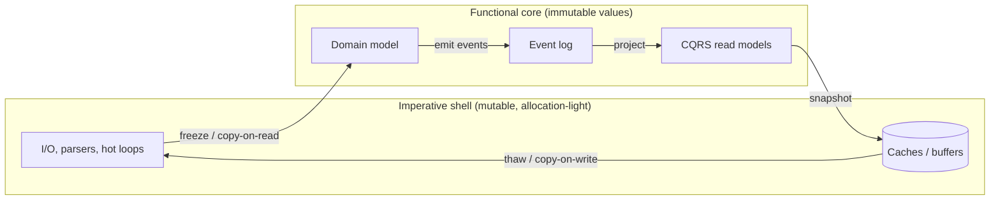
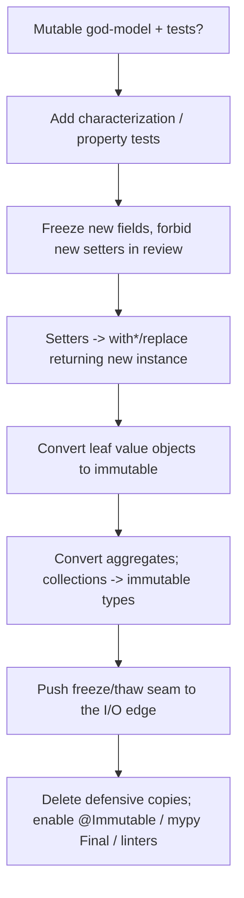

# Immutability — Senior Level

> Focus: "How do we architect for immutability across teams and services?" — immutable domain models, event sourcing / CQRS read models, immutable DTOs at service boundaries, persistent-collection libraries at scale, enforcement in review and tooling, and the migration from a mutable model to an immutable one without a big-bang rewrite.

---

## Table of Contents

1. [Immutability as an architectural choice](#immutability-as-an-architectural-choice)
2. [Immutable domain models, event sourcing, and CQRS read models](#immutable-domain-models-event-sourcing-and-cqrs-read-models)
3. [Immutable DTOs across service boundaries](#immutable-dtos-across-service-boundaries)
4. [Persistent-collection libraries at scale](#persistent-collection-libraries-at-scale)
5. [Enforcing immutability in review and with tooling](#enforcing-immutability-in-review-and-with-tooling)
6. [Immutability for concurrency: lock-free sharing](#immutability-for-concurrency-lock-free-sharing)
7. [Copy-on-write at I/O and cache boundaries](#copy-on-write-at-io-and-cache-boundaries)
8. [Migrating from a mutable to an immutable model](#migrating-from-a-mutable-to-an-immutable-model)
9. [Common Mistakes](#common-mistakes)
10. [Test Yourself](#test-yourself)
11. [Cheat Sheet](#cheat-sheet)
12. [Summary](#summary)
13. [Further Reading](#further-reading)
14. [Related Topics](#related-topics)

---

## Immutability as an architectural choice

At junior scale, immutability is a per-object decision: make `Money` a value object, return a copy instead of the internal list. At team and system scale it becomes an **architectural constraint** that shapes how state flows through the whole system. The payoff is no longer "fewer bugs in this class" — it is *reasoning at the boundary*:

- **A value you receive cannot change underneath you.** No defensive copy on entry, no "did the caller keep a reference?" audit.
- **Identity becomes structural.** Two immutable values are interchangeable if equal; you can cache them, dedupe them, and use them as map keys freely.
- **Concurrency stops being a per-field problem.** An immutable object is thread-safe by construction — no locks, no `volatile`, no happens-before reasoning per access.
- **State transitions become explicit and auditable.** Change is a *new value*, so "what changed and when" is a first-class fact you can log, replay, and diff.

The cost is allocation pressure and a discipline tax: every mutation site becomes a "produce a new value" site, and your collections need structural sharing or you pay O(n) per update. The senior job is to decide **where the immutable boundary sits**: pure-immutable domain core, mutable shell at the I/O edge (parsing, batching, hot loops), with copy-on-write conversions at the seam. This is the "functional core, imperative shell" arrangement.



The boundary is the design. Inside the core, mutation is forbidden; outside, it is allowed but contained; at the seam, you convert deliberately and exactly once.

---

## Immutable domain models, event sourcing, and CQRS read models

An immutable domain model and event sourcing reinforce each other. If state changes are produced by applying immutable **events** to immutable **state**, then the entire history is a fold:

```
state_n = events.fold(initialState, apply)
```

`apply(state, event)` returns a *new* state. Nothing is mutated, so the same event stream always produces the same state — replay is deterministic, and you can rebuild any read model at any version.

**Java — immutable aggregate with records and a pure `apply`:**

```java
public sealed interface AccountEvent
        permits Opened, Deposited, Withdrawn {}

public record Opened(AccountId id, Instant at) implements AccountEvent {}
public record Deposited(Money amount, Instant at) implements AccountEvent {}
public record Withdrawn(Money amount, Instant at) implements AccountEvent {}

public record Account(AccountId id, Money balance, boolean open) {
    public static Account replay(List<AccountEvent> events) {
        Account acc = null;
        for (AccountEvent e : events) acc = apply(acc, e);
        return acc;
    }

    static Account apply(Account s, AccountEvent e) {
        return switch (e) {
            case Opened o     -> new Account(o.id(), Money.ZERO, true);
            case Deposited d  -> s.withBalance(s.balance.plus(d.amount()));
            case Withdrawn w  -> s.withBalance(s.balance.minus(w.amount()));
        };
    }

    // records have no `with`; generate one explicitly or use a builder
    Account withBalance(Money b) { return new Account(id, b, open); }
}
```

Records give you `equals`/`hashCode`/`toString` and final fields for free. Because `apply` never mutates, the read model is just *another fold* over the same events — that is the whole of CQRS read-model construction.

**Python — frozen dataclass aggregate, replace for transitions:**

```python
from dataclasses import dataclass, replace
from decimal import Decimal

@dataclass(frozen=True, slots=True)
class Account:
    id: str
    balance: Decimal
    open: bool

def apply(state: Account | None, event: dict) -> Account:
    match event["type"]:
        case "Opened":
            return Account(event["id"], Decimal(0), True)
        case "Deposited":
            return replace(state, balance=state.balance + event["amount"])
        case "Withdrawn":
            return replace(state, balance=state.balance - event["amount"])
    raise ValueError(event["type"])
```

`frozen=True` blocks attribute assignment (raises `FrozenInstanceError`); `slots=True` removes `__dict__` and shrinks the per-instance footprint, which matters when you hold millions of read-model rows in memory. `replace()` is the idiomatic "produce a new value with one field changed."

**Go — value semantics + functional options for transitions:**

```go
type Account struct {
    ID      string
    Balance int64 // minor units; never a float for money
    Open    bool
}

// apply returns a copy; Account is passed and returned by value.
func apply(s Account, e Event) Account {
    switch e := e.(type) {
    case Opened:
        return Account{ID: e.ID, Open: true}
    case Deposited:
        s.Balance += e.Amount // mutates the *local copy*, not the caller's
        return s
    case Withdrawn:
        s.Balance -= e.Amount
        return s
    }
    return s
}
```

Go has no `final` and no frozen structs. The discipline is **value semantics**: pass and return `Account` by value, keep fields exported only if the package is trusted, and never hand out a pointer to internal state. The `s.Balance += e.Amount` line mutates a *copy local to `apply`* — the caller's value is untouched. This only holds while the struct contains no reference types (slices, maps, pointers); the moment it does, you need an explicit deep copy (see copy-on-write below).

**CQRS read models** are projections: separate, denormalized, *read-optimized* immutable structures rebuilt from events. Because they are derived, they are disposable — drop and rebuild on schema change. Snapshots (a materialized `state_n` plus the events after it) bound replay cost; the snapshot is itself an immutable value.

---

## Immutable DTOs across service boundaries

A DTO that crosses a process boundary should be immutable for the same reason a value crossing a function boundary should be: **the receiver must not be able to mutate it, and the sender must not see mutations the receiver makes.** Across the network this is partly enforced by serialization (you get a fresh object on deserialize), but within a service the DTO is shared by reference, and a mutable DTO is a latent aliasing bug.

- **Java:** prefer `record` for DTOs; use Lombok `@Value` if you cannot use records (it makes the class `final`, fields `private final`, generates `equals`/`hashCode`/`toString` and getters with no setters). For wire types, generate from schema — **Protobuf** generated classes are immutable with `Builder`s; **Avro** `SpecificRecord` and **Immutables** (`@Value.Immutable`) give the same shape. Schema-first means the immutable DTO is the contract.
- **Python:** `@dataclass(frozen=True)` for internal DTOs; **Pydantic v2** with `model_config = ConfigDict(frozen=True)` when you need validation + immutability at the boundary. For generated wire types use `betterproto` (dataclass-based, frozen-friendly) or the standard protobuf runtime.
- **Go:** unexported fields + a constructor + value receivers; expose data through getters or keep the struct in a package whose only writers are the constructors. Generated protobuf structs in Go are technically mutable — treat them as read-only after construction and never share a `*pb.Message` you intend to keep.

```java
// Java DTO with Immutables — immutable, builder, no setters
@Value.Immutable
public interface CreateOrderRequest {
    String customerId();
    List<LineItem> items();          // defensively copied into an ImmutableList
    Optional<String> couponCode();
}
// Generated: ImmutableCreateOrderRequest.builder().customerId("c1")...build();
```

```python
# Python boundary DTO with Pydantic v2 — validated AND frozen
from pydantic import BaseModel, ConfigDict

class CreateOrderRequest(BaseModel):
    model_config = ConfigDict(frozen=True, extra="forbid")
    customer_id: str
    items: tuple[LineItem, ...]      # tuple, not list — immutable container
    coupon_code: str | None = None
```

`extra="forbid"` is the boundary analog of mass-assignment protection: an attacker cannot inject extra fields. Note `tuple[...]` over `list[...]` — Pydantic frozen models still hand back the *same* mutable `list` object otherwise.

**Schema evolution** is where immutable DTOs earn their keep at scale: because the DTO is generated from a versioned `.proto`/`.avsc`/`openapi.yaml`, "add a field" is a compatible change, "change a type" is a breaking one, and the build catches consumers that depend on the old shape. The immutable contract *is* the API version.

---

## Persistent-collection libraries at scale

Naive immutability copies the whole collection on every change: O(n) per update, which dies under load. **Persistent (a.k.a. immutable, functional) collections** use *structural sharing* — a new version shares unchanged subtrees with the old one, giving O(log n) updates and O(1)-ish reads while every version stays valid forever.

| Language | Library | Key types | Update cost | Notes |
|---|---|---|---|---|
| Java | **Vavr** | `io.vavr.collection.List/Map/Set` | O(log n) maps, O(1) prepend | Functional API (`map`, `fold`); also `Tuple`, `Option`, `Either` |
| Java | **Guava** | `ImmutableList/Map/Set` | copy-on-build (no shared updates) | *Defensive* immutability — cheap reads, but `with`-style update copies all |
| Java | **Eclipse Collections** | `ImmutableList`, primitive collections | O(n) update; huge memory wins on primitives | `IntList` avoids boxing — millions of ints without `Integer` overhead |
| Python | **pyrsistent** | `PVector`, `PMap`, `PSet`, `PRecord` | O(log n) | True structural sharing; `pmap().set(k, v)` returns a new map |
| Python | **immutables** | `immutables.Map` (HAMT) | O(log n) | The implementation behind `contextvars`; very fast `.set()` |
| JS/TS | **Immer** | plain objects via `produce()` | structural sharing of unchanged branches | Write "mutating" code in a draft; get a frozen result. Lowest adoption cost |
| JS/TS | **Immutable.js** | `Map`, `List`, `Record` | O(log n) | Heavier API; largely superseded by Immer for app code |

**Choose by access pattern, not dogma:**

- **Read-mostly, built once** (config, a snapshot, a response body): Guava `ImmutableList` / a frozen plain object is simplest and fastest to read. Structural sharing buys nothing if you never produce variants.
- **Update-heavy with many live versions** (undo stacks, event-sourced state, time-travel): persistent collections (Vavr, pyrsistent, Immutable.js) — structural sharing is the whole point.
- **Hot numeric paths**: Eclipse Collections primitive collections to kill boxing, or stay mutable inside the imperative shell.

```python
# pyrsistent — structural sharing; v1 is untouched by the update
from pyrsistent import pmap
v1 = pmap({"a": 1, "b": 2})
v2 = v1.set("b", 99)          # O(log n), shares the "a" subtree
assert v1["b"] == 2 and v2["b"] == 99   # both versions valid forever
```

```typescript
// Immer — "mutating" syntax, immutable result, structural sharing
import { produce } from "immer";
const next = produce(state, (draft) => {
  draft.orders[id].status = "shipped"; // looks mutable; isn't
});
// `state` is unchanged; `next` shares every untouched branch with `state`.
```

> **Scale warning:** persistent collections cost more *per element* (tree nodes, pointers) than arrays. For a 10-element list rebuilt rarely, `ImmutableList.copyOf` beats a HAMT. Profile before reaching for the fancy structure — the win is in *update churn*, not in immutability itself.

---

## Enforcing immutability in review and with tooling

Immutability that is merely *intended* decays. At team scale you enforce it mechanically so a well-meaning teammate cannot add a setter in a hurry.

**Java**

- **Records** (Java 16+) for new value types — final by language rule.
- **Lombok `@Value`** for pre-records code: final class, final fields, no setters.
- **`@Immutable` + Error Prone**: Google's Error Prone ships an `@Immutable` checker (from `com.google.errorprone.annotations`). Annotate a class `@Immutable` and the compiler *fails the build* if it has non-final fields or holds a mutable type without proof of immutability.
- **NullAway / Error Prone** in the build catches the mutable-collection-field smell early.

```java
@Immutable // Error Prone enforces this at compile time
public final class Money {
    private final long minorUnits;
    private final Currency currency;
    Money(long m, Currency c) { this.minorUnits = m; this.currency = c; }
}
```

```xml
<!-- Maven: Error Prone with the Immutable checker enabled -->
<compilerArgs>
  <arg>-XepOpt:Immutable:Disable=false</arg>
  <arg>-Xplugin:ErrorProne</arg>
</compilerArgs>
```

**Python**

- **`@dataclass(frozen=True)`** for runtime enforcement; **mypy** for static enforcement. Declare fields with immutable types (`tuple`, `frozenset`, `Mapping`) and mypy flags reassignment. Mark whole classes/fields `Final` (`from typing import Final`).
- **Pydantic `frozen=True`** at boundaries.
- A small **custom AST / flake8 plugin** can flag `def set_*` methods on classes annotated as value objects, or list-typed fields on frozen dataclasses.

**Go**

- No language-level immutability. Enforce via **unexported fields + constructor-only mutation**, value receivers, and returning copies.
- Linters: **`copylocks`** (vet) catches accidental copies of types with locks; **`exportloopvar`/`revive`** and custom `go/analysis` passes can flag methods that mutate the receiver on a type meant to be a value. The honest answer for Go is *convention + code review + a project-specific analyzer*, not a built-in keyword.

**Review heuristics (all languages):**

- A new **setter** on a type that was a value object → reject; offer a `with*`/`replace`.
- A getter returning the **internal slice/list/map directly** → reject; return a copy or an immutable view.
- A **constructor storing a passed-in mutable collection** without copying → reject; defensive copy or accept an immutable type.
- A field typed `List`/`[]T`/`dict` on a class advertised as immutable → require `ImmutableList`/`tuple`/`Mapping`.
- "We'll make it immutable later" → it never happens; immutability is cheapest at creation.

---

## Immutability for concurrency: lock-free sharing

The single biggest architectural reason to choose immutability at scale is **safe sharing across threads with no synchronization**. An immutable object has no writes after publication, so there is no data race to protect against — every reader sees a fully constructed, never-changing value.

- **Java:** an object whose fields are all `final` and which does not leak `this` during construction is *safely published* and thread-safe per the JMM (Java Memory Model) — no `synchronized`, no `volatile` needed. Share a single `ImmutableMap` config across all request threads; swap the *reference* atomically with an `AtomicReference<ImmutableMap<...>>` when config reloads. Readers never lock; the reference flip is the only synchronization point.
- **Go:** an immutable value can be passed across goroutines and channels freely. The race detector (`go test -race`) will catch any accidental shared mutation, which is exactly why a value-semantics discipline pays off — the moment someone shares a `map` field, `-race` lights up.
- **Python:** the GIL hides many races but does not make compound operations atomic; an immutable value sidesteps the question entirely, and `immutables.Map` (HAMT) is the structure behind `contextvars`, which is the canonical "per-task immutable snapshot" mechanism.

```java
// Lock-free config: readers never block; updates swap the whole immutable map.
private final AtomicReference<ImmutableMap<String, String>> config =
    new AtomicReference<>(ImmutableMap.of());

String get(String key) { return config.get().get(key); }   // no lock

void reload(Map<String, String> fresh) {                    // no lock for readers
    config.set(ImmutableMap.copyOf(fresh));                 // atomic reference swap
}
```

This is **copy-on-write at the reference level**: writers build a new immutable snapshot and publish it atomically; readers always observe a consistent version. It scales because the read path has zero contention.

---

## Copy-on-write at I/O and cache boundaries

The functional core wants immutability; I/O and caches want to avoid allocation. **Copy-on-write (COW)** is the seam discipline that reconciles them: share a read-only structure cheaply, and only allocate a copy *when someone actually mutates*.

- **At the cache boundary:** cache the immutable snapshot, not a mutable structure. A cached `ImmutableList`/frozen object can be handed to every reader without defensive copying, because no reader can corrupt it. If a caller needs to modify, it copies-on-write into its own version, leaving the cached one intact. This is why immutable values make ideal cache entries — the cache never needs to clone on `get`.
- **At the I/O boundary:** parse into a mutable buffer in the imperative shell (fast, allocation-light), then **freeze once** into an immutable value as it crosses into the core. On the way out, **thaw** the immutable value into a mutable buffer for serialization. Convert exactly once per crossing — not per field access.

```go
// COW at a cache boundary: hand out the shared snapshot for reads;
// callers that need to mutate clone first.
type Snapshot struct{ items []Item } // treated as immutable after Build

func (s *Snapshot) Items() []Item { return s.items } // read-only contract

// Caller wanting to modify: copy-on-write into a private slice.
func withExtra(s *Snapshot, extra Item) *Snapshot {
    next := make([]Item, len(s.items), len(s.items)+1)
    copy(next, s.items)              // the copy only happens on write
    return &Snapshot{items: append(next, extra)}
}
```

The cost model: COW makes **reads free and writes pay**. It is the right default when reads vastly outnumber writes (config, reference data, query results). When writes dominate, COW's per-write copy is the bottleneck and a persistent collection's O(log n) structural sharing wins.

---

## Migrating from a mutable to an immutable model

You rarely get to start immutable. The migration from a mutable god-model to immutable values is a multi-step, test-protected refactor — never a big-bang flip.

1. **Pin behavior first.** Add characterization tests around the mutable model so you can detect any behavior change. Property-based tests are ideal here — assert round-trip and invariants that must survive the migration.
2. **Stop the bleeding.** Make new fields final/frozen and forbid new setters in review. The model stops getting *more* mutable while you work.
3. **Make mutation explicit.** Replace in-place setters with `with*`/`replace` methods that return a new instance, *initially still backed by the mutable type*. Callers migrate to the new style without the internals changing yet. (This is **branch by abstraction**: the immutable-style API is the abstraction; the mutable internals are the old implementation behind it.)
4. **Freeze the leaves.** Convert leaf value objects (`Money`, `Address`, IDs) to immutable first — they have the fewest dependents and the clearest semantics.
5. **Work inward.** Convert aggregates that hold those leaves. Replace mutable collection fields with `ImmutableList`/`tuple`/persistent collections. Add defensive copies at constructors as a bridge, then remove them once all callers pass immutable types.
6. **Move the boundary.** Push the freeze/thaw seam outward until the entire domain core is immutable and only the I/O shell mutates.
7. **Delete the bridges.** Remove defensive copies and compatibility setters once nothing depends on them. Turn on `@Immutable`/mypy `Final`/the custom linter to lock the gains in.



> **Strangler-fig variant for services:** when the mutable model spans services, route new write paths through an event-sourced (hence immutable) implementation while old paths keep mutating the legacy store. Project both into the read model. Retire the legacy write path once traffic has moved.

---

## Common Mistakes

- **Shallow freeze over a deep mutable graph.** A frozen dataclass holding a plain `list`, a `record` holding a `java.util.ArrayList`, or a Go struct holding a `map` — the wrapper is immutable but the contents are not. `Object.freeze` in JS is one level deep too. Freeze transitively or use immutable containers all the way down.
- **Trusting `frozen=True` / records to deep-copy.** They do not. A frozen dataclass stores the *same* list object you passed; mutate it elsewhere and the "immutable" value changes. Use `tuple`/`frozenset`/`Mapping`, or copy in `__post_init__` via `object.__setattr__`.
- **Returning the internal collection from a getter.** The classic escape hatch — the object is immutable but its getter leaks a live reference to internal state. Return a copy or an immutable view.
- **Reaching for persistent collections everywhere.** Structural sharing has per-node overhead; for small, build-once collections it is slower and heavier than a plain array or `ImmutableList.copyOf`. Match the structure to the update churn.
- **Treating generated protobuf/Avro structs in Go as immutable.** They are mutable pointers. Sharing a `*pb.Message` you intend to keep is an aliasing bug the type system will not catch.
- **`AtomicReference` to a *mutable* object.** The atomic swap is pointless if the pointed-to object is then mutated by readers. The value behind the reference must itself be immutable.
- **Immutability as religion in hot loops.** Allocating a new value per iteration in a tight numeric loop can dominate runtime and thrash the GC. The imperative shell exists precisely so the hot path can mutate locally; keep the immutable boundary outside it.
- **Migrating big-bang.** Flipping a large mutable model to immutable in one PR breaks callers en masse and has no rollback. Branch by abstraction and convert leaf-first.

---

## Test Yourself

1. **Why does an all-`final`-fields Java object not need `synchronized` to be shared across threads?**

<details><summary>Answer</summary>

The Java Memory Model guarantees that `final` fields are *safely published*: once the constructor completes without leaking `this`, every thread that observes a reference to the object sees the fully initialized final fields, with correct happens-before ordering, even without synchronization. Because the object never changes after construction, there are no writes to race with reads — so no lock, `volatile`, or atomic is needed on the read path. (This breaks if the constructor leaks `this` before completing, or if a field is a mutable object that is later mutated.)

</details>

2. **When is `Guava ImmutableList` the wrong choice and a persistent collection the right one?**

<details><summary>Answer</summary>

`ImmutableList` is *defensively* immutable: cheap to read, but producing a variant copies the whole list (O(n)). It shines for read-mostly, built-once data. When you maintain many live versions with frequent updates — undo stacks, event-sourced state, time-travel debugging — Guava's copy-per-update is O(n) churn. A persistent collection (Vavr, pyrsistent, Immutable.js) uses structural sharing for O(log n) updates while keeping every prior version valid, which is exactly that workload.

</details>

3. **A teammate makes a Python DTO a `frozen=True` dataclass but a field is `list[Item]`. What is still broken, and how do you fix it?**

<details><summary>Answer</summary>

`frozen=True` only blocks *reassigning the attribute* (`dto.items = [...]` raises). It does not stop `dto.items.append(x)` — the field holds a live, mutable `list`, and the dataclass stored the very object the caller passed in (no copy). The value can change underneath everyone. Fix: type the field as `tuple[Item, ...]` (immutable container), or copy into a tuple in `__post_init__` using `object.__setattr__` to bypass the frozen guard during construction.

</details>

4. **How does event sourcing make immutability "free," and what is the cost you pay instead?**

<details><summary>Answer</summary>

State is a fold over immutable events: `state_n = events.fold(initial, apply)`, where `apply` returns a new state. Nothing is mutated, replay is deterministic, and read models are just additional folds over the same events — so immutability falls out of the architecture rather than being bolted on. The cost: storage grows with history, replay cost grows without snapshots, you need an upcasting/versioning strategy for old event shapes, and reads require projecting events into read models rather than querying current state directly.

</details>

5. **Why is `AtomicReference<ImmutableMap<K,V>>` a good lock-free config pattern, and where could it still go wrong?**

<details><summary>Answer</summary>

Readers call `config.get().get(key)` with no lock — the reference points to an immutable snapshot that cannot change, so reads never contend. A reload builds a *new* `ImmutableMap` and publishes it with a single atomic `set`, so readers always observe one consistent version (the old or the new, never a torn mix). It goes wrong if (a) the map is not actually immutable — readers mutate it and corrupt the shared snapshot; (b) callers do read-modify-write across two `get`s expecting atomicity (use `updateAndGet`/`compareAndSet` instead); or (c) values inside the map are themselves mutable objects that get mutated after publication.

</details>

6. **You must migrate a 4,000-line mutable `Order` aggregate to immutable. Outline the first three steps.**

<details><summary>Answer</summary>

(1) Add characterization and property-based tests around the current behavior so any regression is caught — round-trip, invariants, and representative scenarios. (2) Freeze the bleeding: forbid new setters/new mutable fields in review so the model stops getting worse while you work. (3) Branch by abstraction — replace in-place setters with `with*`/`replace` methods that return a new instance, initially still backed by the mutable internals, and migrate callers to the new API. Then convert leaf value objects first and work inward. Never big-bang.

</details>

---

## Cheat Sheet

| Concern | Java | Python | Go |
|---|---|---|---|
| Value type | `record`, Lombok `@Value`, Immutables | `@dataclass(frozen=True, slots=True)` | struct + unexported fields + constructor |
| Boundary DTO | `record` / generated protobuf builders | Pydantic `ConfigDict(frozen=True, extra="forbid")` | unexported fields; treat pb structs read-only |
| Immutable list | Guava `ImmutableList`, Vavr `List` | `tuple`, pyrsistent `PVector` | return copies; never leak internal slice |
| Immutable map (shared updates) | Vavr `Map` (HAMT) | pyrsistent `PMap`, `immutables.Map` | copy-on-write map; no built-in |
| Transition (one field) | builder / explicit `with*` | `dataclasses.replace()` | return modified copy (value receiver) |
| Compile/static enforcement | Error Prone `@Immutable`, `final` | mypy `Final`, frozen dataclass | `go vet copylocks`, custom `go/analysis` |
| Lock-free sharing | `AtomicReference<Immutable…>` | `immutables.Map` / `contextvars` | value across channels; `-race` to verify |
| JS/TS | — | — | Immer `produce()` (lowest-cost adoption) |

**Boundary rule of thumb:** immutable domain core, mutable imperative shell, copy-on-write at the seam, freeze/thaw exactly once per I/O crossing.

**Library choice:** read-mostly built-once → defensive immutable (Guava / frozen object). Update-heavy with many versions → persistent collection (structural sharing). Hot numeric → primitive collections or stay mutable inside the shell.

---

## Summary

At senior scale, immutability is an architectural boundary, not a per-object tactic. You decide where the immutable core ends and the mutable I/O shell begins, then enforce that line with tooling — Error Prone `@Immutable`, mypy `Final`, frozen dataclasses, custom analyzers — and in code review, because intent-only immutability decays. Immutable domain models compose naturally with event sourcing and CQRS: state is a deterministic fold over immutable events, and read models are disposable projections. Across service boundaries, immutable DTOs generated from versioned schemas make the contract and the immutability the same artifact. Persistent-collection libraries (Vavr, pyrsistent, immutables, Immer) buy O(log n) updates with structural sharing when update churn is high; defensive immutables (Guava, frozen objects) win when data is read-mostly. The architectural payoff is lock-free sharing — an immutable value is thread-safe by construction, so config and snapshots can be shared via an atomic reference swap with zero reader contention. Copy-on-write reconciles the immutable core with allocation-sensitive caches and I/O. And the path from a mutable model is always incremental: pin behavior with tests, branch by abstraction, convert leaf-first, push the seam outward, then lock the gains with the linter.

---

## Further Reading

- Eric Evans — *Domain-Driven Design* (value objects, aggregates as the unit of consistency).
- Vaughn Vernon — *Implementing Domain-Driven Design* (event sourcing, CQRS, aggregate design at scale).
- Brian Goetz et al. — *Java Concurrency in Practice*, ch. 3 (safe publication, immutability and the Java Memory Model).
- Martin Fowler — "Event Sourcing", "CQRS", and "Branch By Abstraction" (martinfowler.com).
- Greg Young — talks and notes on CQRS / Event Sourcing.
- Vavr, Guava, Eclipse Collections, pyrsistent, `immutables`, and Immer official documentation (API and performance characteristics).
- Google Error Prone — the `@Immutable` checker documentation.
- Rich Hickey — "The Value of Values" and "Are We There Yet?" (persistent data structures and structural sharing).

---

## Related Topics

- [junior.md](junior.md) — what immutability is and the per-object basics.
- [middle.md](middle.md) — defensive copies, value objects, immutable collections in one codebase.
- [professional.md](professional.md) — allocation cost, GC behavior, and the measured price of immutability.
- [Chapter README](../README.md) — the positive rules of this chapter.
- [Concurrency](../11-concurrency/README.md) — why immutable values are the simplest path to thread safety.
- [Objects and Data Structures](../05-objects-and-data-structures/README.md) — encapsulation, getters, and not leaking internal state.
- [Functional Programming](../../functional-programming/README.md) — pure functions and persistent data structures.
- [Anti-Patterns](../../anti-patterns/README.md) — the aliasing and shared-mutable-state smells immutability removes.
