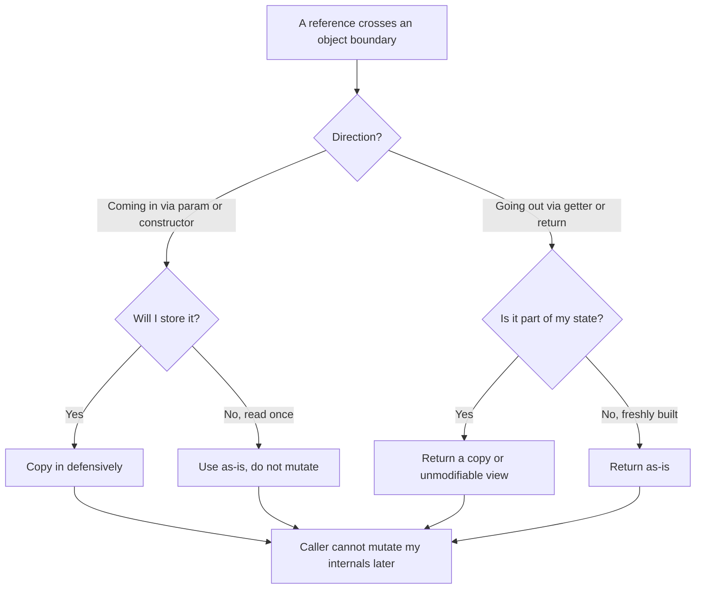

# Immutability — Practice Tasks

> Twelve exercises that turn the chapter's rules into muscle memory. Each task gives you leaky, mutable code in Go, Java, or Python, a clear instruction, and a full solution behind a collapsible block. Read the problem, write your own version, *then* open the solution and compare reasoning — not just syntax. Difficulty climbs from spotting a single mutation to building copy-on-write and map-safe value types.

## Table of Contents

1. [Task 1 — Stop mutating a method argument (Python, Easy)](#task-1--stop-mutating-a-method-argument-python-easy)
2. [Task 2 — Stop returning a mutable reference to internal state (Java, Easy)](#task-2--stop-returning-a-mutable-reference-to-internal-state-java-easy)
3. [Task 3 — Pure normalization without touching the input (Go, Easy)](#task-3--pure-normalization-without-touching-the-input-go-easy)
4. [Task 4 — Fix partial immutability: the leaky inner collection (Java, Medium)](#task-4--fix-partial-immutability-the-leaky-inner-collection-java-medium)
5. [Task 5 — Replace setters with a `with`/copy update (Python, Medium)](#task-5--replace-setters-with-a-withcopy-update-python-medium)
6. [Task 6 — Make a value object a proper immutable type (Go, Medium)](#task-6--make-a-value-object-a-proper-immutable-type-go-medium)
7. [Task 7 — Fix aliasing escape through the constructor (Java, Medium)](#task-7--fix-aliasing-escape-through-the-constructor-java-medium)
8. [Task 8 — Defensive copy out *and* in, for a date range (Java, Medium)](#task-8--defensive-copy-out-and-in-for-a-date-range-java-medium)
9. [Task 9 — Implement copy-on-write for a small collection (Go, Hard)](#task-9--implement-copy-on-write-for-a-small-collection-go-hard)
10. [Task 10 — Make an object safe as a map key (Python, Hard)](#task-10--make-an-object-safe-as-a-map-key-python-hard)
11. [Task 11 — Deep-freeze a nested config tree (Python, Hard)](#task-11--deep-freeze-a-nested-config-tree-python-hard)
12. [Task 12 — Immutability audit (Java — open-ended)](#task-12--immutability-audit-java--open-ended)
- [Self-Assessment](#self-assessment)
- [Related Topics](#related-topics)

## How to Use

1. **Read the problem and the code.** Identify exactly *which* mutation rule is broken before writing anything: an argument being mutated, an internal reference escaping, a setter, or an aliasing leak.
2. **Write your own fix first.** Type it out in a real file and, where possible, run it. The solutions assume you have already struggled with the problem.
3. **Open the solution and compare reasoning, not just code.** The "Why" notes matter more than the exact lines. Two correct solutions can differ in style; the invariant they protect is the same.
4. **Watch the difficulty curve.** Tasks 1–3 isolate one rule each. Tasks 4–8 combine copy-out and copy-in. Tasks 9–12 ask you to design immutable types and reason about deep structure.

The decision each task forces is always the same one:



---

### Task 1 — Stop mutating a method argument (Python, Easy)

**Scenario:** A reporting helper appends a footer row to the rows it is handed before rendering. A caller reuses the same `rows` list for an on-screen table and a PDF export, and is baffled when the PDF footer shows up in the table too.

```python
def render_report(rows: list[dict]) -> str:
    rows.append({"label": "TOTAL", "value": sum(r["value"] for r in rows)})
    return "\n".join(f'{r["label"]}: {r["value"]}' for r in rows)

# Caller:
data = [{"label": "Jan", "value": 10}, {"label": "Feb", "value": 20}]
pdf = render_report(data)
# data now has a phantom TOTAL row the caller never added.
```

**Instruction:** Make `render_report` a pure function of its argument. It must not modify `rows`.

<details><summary>Solution</summary>

```python
def render_report(rows: list[dict]) -> str:
    total = {"label": "TOTAL", "value": sum(r["value"] for r in rows)}
    all_rows = [*rows, total]          # new list; rows is untouched
    return "\n".join(f'{r["label"]}: {r["value"]}' for r in all_rows)
```

**Why:** A function that takes a collection should treat it as read-only unless its name screams otherwise (`append_total_in_place`). The fix builds a *new* list with `[*rows, total]` and leaves the caller's `rows` alone. The phantom-row bug disappears because the only thing that ever held the footer is the local `all_rows`, which dies when the function returns.

Note we still mutate nothing the caller can see, but we did *not* deep-copy the dicts — and we did not need to, because we never write to them. Copy only what you actually modify.

</details>

---

### Task 2 — Stop returning a mutable reference to internal state (Java, Easy)

**Scenario:** A `ShoppingCart` exposes its line items so the UI can render them. A bug report says items vanish from carts at random. The culprit: a view component calls `cart.getItems().clear()` to reset its own display.

```java
class ShoppingCart {
    private final List<Item> items = new ArrayList<>();

    public void add(Item item) { items.add(item); }

    public List<Item> getItems() {
        return items;          // hands out the live internal list
    }
}
```

**Instruction:** Stop leaking the internal list. Callers must be able to read items but must not be able to mutate the cart through the getter.

<details><summary>Solution</summary>

```java
import java.util.Collections;
import java.util.List;

class ShoppingCart {
    private final List<Item> items = new ArrayList<>();

    public void add(Item item) { items.add(item); }

    public List<Item> getItems() {
        return Collections.unmodifiableList(items);   // read-only view
    }
}
```

**Why:** `Collections.unmodifiableList` returns a wrapper that throws `UnsupportedOperationException` on `add`, `remove`, and `clear`. The `view.clear()` call now fails loudly at the offending line instead of silently corrupting a different object.

This is an *unmodifiable view*, not a copy: it is O(1) and still reflects later additions made through `add`. That is usually what you want for a getter. Reach for `List.copyOf(items)` (a true snapshot) only when the caller must see a stable list even as the cart keeps changing.

</details>

---

### Task 3 — Pure normalization without touching the input (Go, Easy)

**Scenario:** A function normalizes tag strings (trim, lowercase) for a search index. It mutates the slice in place, so the original tags shown in the UI silently become lowercased too — slices share their backing array.

```go
package tags

import "strings"

func Normalize(tags []string) []string {
    for i := range tags {
        tags[i] = strings.ToLower(strings.TrimSpace(tags[i])) // mutates caller's slice
    }
    return tags
}
```

**Instruction:** Return a normalized copy and leave the caller's slice element values untouched.

<details><summary>Solution</summary>

```go
package tags

import "strings"

func Normalize(tags []string) []string {
    out := make([]string, len(tags))
    for i, t := range tags {
        out[i] = strings.ToLower(strings.TrimSpace(t))
    }
    return out
}
```

**Why:** In Go a `[]string` is a header pointing at a shared backing array. Writing `tags[i] = ...` reaches through that pointer and changes what the caller sees. Allocating `out := make([]string, len(tags))` and writing into it keeps the input read-only.

`copy(out, tags)` followed by an in-place loop over `out` would work too, but here a single allocating loop is clearer. The rule: if you receive a slice and intend to transform it, transform a copy unless the function name documents in-place mutation.

</details>

---

### Task 4 — Fix partial immutability: the leaky inner collection (Java, Medium)

**Scenario:** A `Team` was "made immutable" — the class is `final`, the field is `final`, there are no setters. Yet a caller still manages to add a member after construction. The immutability is only skin-deep: the *field reference* is final, but the *list it points to* is not.

```java
final class Team {
    private final String name;
    private final List<String> members;

    Team(String name, List<String> members) {
        this.name = name;
        this.members = members;     // stores the caller's list
    }

    public List<String> getMembers() { return members; }  // and hands it back
}

// Caller:
List<String> roster = new ArrayList<>(List.of("Ana"));
Team t = new Team("A", roster);
roster.add("Mallory");          // mutates the team from outside
t.getMembers().add("Eve");      // ...and from the getter
```

**Instruction:** Make `Team` genuinely immutable. Close *both* leaks: the constructor alias and the getter.

<details><summary>Solution</summary>

```java
import java.util.List;

final class Team {
    private final String name;
    private final List<String> members;

    Team(String name, List<String> members) {
        this.name = name;
        this.members = List.copyOf(members);   // copy IN: defensive snapshot
    }

    public List<String> getMembers() {
        return members;        // copyOf already returned an immutable list
    }
}
```

**Why:** `final` on a field freezes only the reference, never the object it points at. Two doors were open:

1. **Constructor aliasing** — the team shared the caller's list, so `roster.add(...)` reached inside. `List.copyOf(members)` takes an unmodifiable snapshot at construction time; later changes to `roster` cannot touch it.
2. **Getter leak** — `getMembers()` handed the same reference out. Because `List.copyOf` already produced an immutable list, returning it directly is now safe; `getMembers().add(...)` throws.

One copy at the boundary defends both directions. This is the canonical fix for partial immutability: deep-freeze the inner collection, do not just `final` the field.

</details>

---

### Task 5 — Replace setters with a `with`/copy update (Python, Medium)

**Scenario:** A `UserProfile` is passed around the app and read from many threads. It exposes setters "for convenience." Now profile fields change under code that assumed a stable snapshot, and there is no audit trail of what changed when.

```python
class UserProfile:
    def __init__(self, name: str, email: str, theme: str):
        self.name = name
        self.email = email
        self.theme = theme

    def set_email(self, email: str) -> None:
        self.email = email

    def set_theme(self, theme: str) -> None:
        self.theme = theme
```

**Instruction:** Make `UserProfile` immutable and replace the setters with copy-on-update (`with_*`) methods that return a new profile, leaving the original unchanged.

<details><summary>Solution</summary>

```python
from dataclasses import dataclass, replace

@dataclass(frozen=True)
class UserProfile:
    name: str
    email: str
    theme: str

    def with_email(self, email: str) -> "UserProfile":
        return replace(self, email=email)

    def with_theme(self, theme: str) -> "UserProfile":
        return replace(self, theme=theme)

# Usage:
p1 = UserProfile("Ana", "ana@old.com", "light")
p2 = p1.with_email("ana@new.com")
# p1 is untouched; p2 is a new object that differs in one field.
assert p1.email == "ana@old.com"
assert p2.email == "ana@new.com"
```

**Why:** `@dataclass(frozen=True)` makes attribute assignment raise `FrozenInstanceError`, so the setters could not exist anyway — that is the point. `dataclasses.replace` builds a new instance copying every field except the ones you override, which is exactly the "structural sharing of unchanged fields" that copy-on-update buys you.

The behavioral win: any code holding `p1` keeps seeing the old value forever, which is what made the snapshot assumption valid in the first place. Mutation now produces a new identity instead of editing shared state, so threads and audit logs can reason about each version independently.

</details>

---

### Task 6 — Make a value object a proper immutable type (Go, Medium)

**Scenario:** `Money` is modeled with exported fields and a mutating `Add`. Two bugs follow: callers mutate `Amount` directly, and `Add` changes the receiver, so `a.Add(b)` silently alters `a`.

```go
package money

type Money struct {
    Amount   int64  // minor units (cents)
    Currency string
}

func (m *Money) Add(other Money) {
    m.Amount += other.Amount   // mutates the receiver in place
}
```

**Instruction:** Turn `Money` into an immutable value type. Operations must return a new `Money`; the receiver must never change. Hide the fields behind a constructor that validates.

<details><summary>Solution</summary>

```go
package money

import "fmt"

// Money is an immutable value type. Fields are unexported, so the only way
// to obtain one is through New, and the only way to "change" it is to derive
// a new value.
type Money struct {
    amount   int64 // minor units
    currency string
}

func New(amount int64, currency string) (Money, error) {
    if currency == "" {
        return Money{}, fmt.Errorf("currency required")
    }
    return Money{amount: amount, currency: currency}, nil
}

func (m Money) Amount() int64    { return m.amount }
func (m Money) Currency() string { return m.currency }

// Add returns a NEW Money; the receiver is a value, not a pointer, so it
// cannot be mutated even by accident.
func (m Money) Add(other Money) (Money, error) {
    if m.currency != other.currency {
        return Money{}, fmt.Errorf("currency mismatch: %s vs %s", m.currency, other.currency)
    }
    return Money{amount: m.amount + other.amount, currency: m.currency}, nil
}
```

**Why:** Three deliberate choices make this immutable:

- **Unexported fields** (`amount`, `currency`) mean no code outside the package can write `m.amount = 0`. Read access goes through accessor methods.
- **Value receivers** (`func (m Money)`, not `func (m *Money)`) mean methods operate on a copy; assigning to `m` inside a method would change nothing visible to the caller. `Add` therefore *must* return a new value.
- **A validating constructor** is the single entry point, so an invalid `Money` (empty currency) cannot be constructed from outside the package.

Go has no `final`/`readonly`, so immutability of a struct is a design contract enforced by unexported fields plus value semantics — not a language keyword.

</details>

---

### Task 7 — Fix aliasing escape through the constructor (Java, Medium)

**Scenario:** An `Order` stores a `Customer` whose internal `tags` set is mutable. The `Order` constructor stores the passed-in `Customer`, but a deeper problem hides: the array of line items handed to the constructor is kept by reference, and the caller keeps mutating it after construction.

```java
final class Order {
    private final String id;
    private final LineItem[] items;

    Order(String id, LineItem[] items) {
        this.id = id;
        this.items = items;        // keeps the caller's array
    }

    public int lineCount() { return items.length; }
}

// Caller:
LineItem[] lines = { new LineItem("A", 1) };
Order order = new Order("o-1", lines);
lines[0] = new LineItem("HACKED", 999);   // reaches inside the order
```

**Instruction:** Stop the aliasing escape. The order must capture the items at construction time so later mutation of the caller's array has no effect.

<details><summary>Solution</summary>

```java
import java.util.Arrays;

final class Order {
    private final String id;
    private final LineItem[] items;

    Order(String id, LineItem[] items) {
        this.id = id;
        this.items = Arrays.copyOf(items, items.length);   // defensive copy IN
    }

    public int lineCount() { return items.length; }

    public LineItem itemAt(int i) { return items[i]; }     // never expose the array itself
}
```

**Why:** Arrays are mutable and shareable. Storing the caller's array means the caller still holds a live handle into the object's state — `lines[0] = ...` rewrites the order's first line. `Arrays.copyOf` makes a fresh array at construction, breaking the alias.

Two caveats worth stating:

- The copy is *shallow*: it copies references to `LineItem` objects. That is sufficient here only because `LineItem` is itself immutable. If `LineItem` had setters, a deep copy would be required.
- Never add a `getItems()` that returns `items` — that would re-open the escape on the way out. Expose `itemAt`/`lineCount`, or return `Arrays.copyOf(...)`/an unmodifiable `List`.

Copy *in* at the constructor and copy *out* at the getter: both ends of the boundary need a guard.

</details>

---

### Task 8 — Defensive copy out *and* in, for a date range (Java, Medium)

**Scenario:** A `DateRange` predates `java.time` and uses the legacy, *mutable* `java.util.Date`. The range stores the dates it is given and returns them through getters. Both ends leak: a caller can mutate a `Date` it passed in, or mutate one it got back.

```java
import java.util.Date;

final class DateRange {
    private final Date start;
    private final Date end;

    DateRange(Date start, Date end) {
        this.start = start;   // stored by reference
        this.end = end;
    }

    public Date getStart() { return start; }   // leaked by reference
    public Date getEnd()   { return end; }
}
```

**Instruction:** Make `DateRange` immutable even though `Date` is mutable. Defend both the constructor and the getters.

<details><summary>Solution</summary>

```java
import java.util.Date;

final class DateRange {
    private final Date start;
    private final Date end;

    DateRange(Date start, Date end) {
        if (end.before(start)) {
            throw new IllegalArgumentException("end before start");
        }
        this.start = new Date(start.getTime());   // copy IN
        this.end   = new Date(end.getTime());
    }

    public Date getStart() { return new Date(start.getTime()); }   // copy OUT
    public Date getEnd()   { return new Date(end.getTime()); }
}
```

**Why:** This is the textbook "defensive copy on both boundaries" case from *Effective Java*. With a mutable element type you cannot share references in *either* direction:

- **Copy in** so that mutating the original `start` after construction does not change the range.
- **Copy out** so that mutating the `Date` returned by `getStart()` does not change the range either.

A subtlety: validate (`end.before(start)`) *after* copying in, using the copies — not the originals. Otherwise a malicious caller could pass valid dates, let the check pass, then mutate them through the still-shared reference (a time-of-check/time-of-use hole). The modern fix is of course to use the immutable `java.time.LocalDate`/`Instant`, which makes all of this copying unnecessary — but the technique is what you reach for whenever you are stuck wrapping a mutable type.

</details>

---

### Task 9 — Implement copy-on-write for a small collection (Go, Hard)

**Scenario:** A `Registry` holds a small set of feature flags read on every request and updated rarely. Reads vastly outnumber writes. You want readers to never see a half-applied update and never need a lock, while writes stay correct.

```go
package registry

// Naive: every read and write touches the same map, so concurrent access
// races and a reader can observe a partially mutated map.
type Registry struct {
    flags map[string]bool
}

func (r *Registry) Get(name string) bool { return r.flags[name] }
func (r *Registry) Set(name string, on bool) { r.flags[name] = on }
```

**Instruction:** Implement copy-on-write: `Set` produces a brand-new map and swaps it in atomically; readers operate on an immutable snapshot. Each `Set` returns a new `Registry` so callers can keep an old snapshot if they want.

<details><summary>Solution</summary>

```go
package registry

// Registry is immutable. The map it points to is never mutated after a
// Registry is constructed; Set returns a new Registry with a new map.
type Registry struct {
    flags map[string]bool // treated as read-only once stored
}

func New(initial map[string]bool) *Registry {
    cp := make(map[string]bool, len(initial))
    for k, v := range initial {
        cp[k] = v // copy IN so the caller's map cannot mutate ours
    }
    return &Registry{flags: cp}
}

func (r *Registry) Get(name string) bool {
    return r.flags[name] // safe: the map is never written after construction
}

// Set is copy-on-write: build a full new map, change one entry, return a new
// Registry. The old Registry and its map are untouched, so any reader holding
// the old *Registry continues to see a consistent snapshot.
func (r *Registry) Set(name string, on bool) *Registry {
    next := make(map[string]bool, len(r.flags)+1)
    for k, v := range r.flags {
        next[k] = v
    }
    next[name] = on
    return &Registry{flags: next}
}
```

**Why:** Copy-on-write trades cheap reads for expensive writes. Because the stored map is *never mutated in place*, a reader holding a `*Registry` needs no lock — the snapshot it sees can never change underneath it. A writer pays O(n) to clone the map but never blocks a reader.

The key invariant is "the map is write-once": `New` copies the caller's map in so external mutation cannot violate it, and `Set` allocates a fresh map rather than editing `r.flags`. To share one *current* registry across goroutines, store the `*Registry` in an `atomic.Pointer[Registry]` and have writers `CompareAndSwap` the new snapshot in; readers `Load()` a consistent pointer. The pattern only pays off when reads dominate writes, since each write copies everything.

</details>

---

### Task 10 — Make an object safe as a map key (Python, Hard)

**Scenario:** A pathfinding cache keys results by a `Point`. The current `Point` is a plain mutable class, so it is unhashable — and even after someone bolts on `__hash__`, a `Point` whose coordinates are mutated after insertion becomes unfindable in the dict (its hash no longer matches its bucket).

```python
class Point:
    def __init__(self, x: int, y: int):
        self.x = x
        self.y = y

# Desired but broken:
cache: dict[Point, list] = {}
p = Point(1, 2)
cache[p] = ["route..."]   # TypeError: unhashable type: 'Point'
```

**Instruction:** Make `Point` usable as a dictionary key. It must be hashable, compare by value, and be immutable so its hash can never drift after insertion.

<details><summary>Solution</summary>

```python
from dataclasses import dataclass

@dataclass(frozen=True)
class Point:
    x: int
    y: int

# Now this works and stays correct:
cache: dict[Point, list] = {}
p = Point(1, 2)
cache[p] = ["route..."]

assert cache[Point(1, 2)] == ["route..."]   # value equality finds it
# p.x = 9  -> raises FrozenInstanceError: hash can never drift
```

**Why:** A dictionary places a key in a bucket chosen from `hash(key)`, then confirms matches with `__eq__`. Two requirements follow, and `frozen=True` satisfies both:

1. **A stable hash.** `@dataclass(frozen=True)` auto-generates `__hash__` from the fields *and* blocks attribute assignment. Because the fields cannot change, the hash cannot change, so a key never gets "lost" in the wrong bucket. A mutable object used as a key is a latent corruption bug.
2. **Value equality.** The dataclass also generates `__eq__` over the fields, so a freshly built `Point(1, 2)` is equal to — and hashes the same as — the one used to insert. Lookups by value succeed.

The contract is iron: objects that are equal must have equal hashes, and the hash must not change while the object is in the map. Immutability is the simplest way to guarantee the "must not change" half. (If you write `__eq__`/`__hash__` by hand, base both on the *same* fields, and on a tuple of them, e.g. `hash((self.x, self.y))`.)

</details>

---

### Task 11 — Deep-freeze a nested config tree (Python, Hard)

**Scenario:** A configuration is loaded once at startup and shared globally. It is a nested structure of dicts and lists. A `@dataclass(frozen=True)` wrapper protects the *top level*, but the nested `dict`/`list` values stay mutable — any module can reach in and rewrite the live config (`config.values["db"]["pool"] = 999`).

```python
from dataclasses import dataclass

@dataclass(frozen=True)
class Config:
    values: dict   # frozen reference, but the dict itself is mutable!

cfg = Config({"db": {"pool": 10}, "features": ["a", "b"]})
cfg.values["db"]["pool"] = 999   # mutates global config; no error
```

**Instruction:** Deep-freeze the config so the *entire tree* is immutable — nested dicts become read-only mappings and nested lists become tuples — while top-level access stays ergonomic.

<details><summary>Solution</summary>

```python
from dataclasses import dataclass
from types import MappingProxyType
from typing import Any, Mapping

def deep_freeze(value: Any) -> Any:
    if isinstance(value, Mapping):
        return MappingProxyType({k: deep_freeze(v) for k, v in value.items()})
    if isinstance(value, (list, tuple)):
        return tuple(deep_freeze(v) for v in value)
    if isinstance(value, set):
        return frozenset(deep_freeze(v) for v in value)
    return value  # str/int/float/bool/None are already immutable

@dataclass(frozen=True)
class Config:
    values: Mapping

    def __init__(self, values: Mapping):
        object.__setattr__(self, "values", deep_freeze(values))

cfg = Config({"db": {"pool": 10}, "features": ["a", "b"]})
assert cfg.values["db"]["pool"] == 10
assert cfg.values["features"] == ("a", "b")

# cfg.values["db"]["pool"] = 999
#   -> TypeError: 'mappingproxy' object does not support item assignment
```

**Why:** `frozen=True` freezes only the reference held in `values`; the dict it points at is fully mutable. `deep_freeze` walks the structure recursively, wrapping every `Mapping` in `MappingProxyType` (a read-only view) and converting every `list`/`set` into an immutable `tuple`/`frozenset`. The recursion bottoms out on scalars, which are already immutable.

Two notes on technique:

- We call `deep_freeze` in `__init__` and assign through `object.__setattr__` because a frozen dataclass blocks normal assignment even inside its own constructor.
- `MappingProxyType` is a *view*, not a copy, so this is cheap — but the input dict must not be retained and mutated elsewhere. If that risk exists, deep-*copy* the structure during the freeze (`{k: deep_freeze(v) for ...}` already builds new dicts, so only externally-aliased sub-objects are a concern).

This is the standard cure for "partial immutability": freeze the whole tree, not just the handle to its root.

</details>

---

### Task 12 — Immutability audit (Java — open-ended)

**Scenario:** Below is a class that was reviewed as "immutable enough." It is not. Find **every** way its internal state can be mutated from outside, and state the fix for each.

```java
import java.util.Date;
import java.util.List;
import java.util.Map;

final class Account {
    private final String id;
    private Date openedOn;                       // (a)
    private final List<String> roles;            // (b)
    private final Map<String, String> metadata;  // (c)
    private final int[] dailyLimits;             // (d)

    Account(String id, Date openedOn, List<String> roles,
            Map<String, String> metadata, int[] dailyLimits) {
        this.id = id;
        this.openedOn = openedOn;        // stored by reference
        this.roles = roles;              // stored by reference
        this.metadata = metadata;        // stored by reference
        this.dailyLimits = dailyLimits;  // stored by reference
    }

    public Date getOpenedOn()           { return openedOn; }   // leaked
    public List<String> getRoles()      { return roles; }      // leaked
    public Map<String, String> getMeta(){ return metadata; }   // leaked
    public int[] getDailyLimits()       { return dailyLimits; }// leaked

    public void setOpenedOn(Date d)     { this.openedOn = d; } // setter!
}
```

<details><summary>Solution</summary>

| # | Leak | Fix |
|---|------|-----|
| (a) | `openedOn` is non-`final` and has a `setOpenedOn` setter; also it is a mutable `Date`. | Make the field `final`, delete the setter, and either copy in/out (`new Date(d.getTime())`) or switch to `java.time.Instant`, which is immutable and needs no copying. |
| (b) | `roles` is stored and returned by reference, so callers mutate the list both ways. | Copy in with `List.copyOf(roles)` in the constructor; return it directly (it is already unmodifiable). |
| (c) | `metadata` is stored and returned by reference. | Copy in with `Map.copyOf(metadata)`; return the immutable copy from `getMeta()`. |
| (d) | `dailyLimits` is a mutable array, aliased on the way in and leaked on the way out. | `this.dailyLimits = Arrays.copyOf(dailyLimits, dailyLimits.length)` in the constructor; `return Arrays.copyOf(dailyLimits, dailyLimits.length)` (or expose an accessor like `limitAt(int)`) from the getter. |
| general | The class is `final` (good) but leaks through every reference field. | After the per-field fixes, no setter remains, every field is `final`, every mutable component is copied in and copied out (or replaced with an immutable type). |

**Corrected version:**

```java
import java.time.Instant;
import java.util.Arrays;
import java.util.List;
import java.util.Map;

final class Account {
    private final String id;
    private final Instant openedOn;              // immutable type, no copying
    private final List<String> roles;            // unmodifiable snapshot
    private final Map<String, String> metadata;  // unmodifiable snapshot
    private final int[] dailyLimits;             // copied in; copied out below

    Account(String id, Instant openedOn, List<String> roles,
            Map<String, String> metadata, int[] dailyLimits) {
        this.id = id;
        this.openedOn = openedOn;
        this.roles = List.copyOf(roles);
        this.metadata = Map.copyOf(metadata);
        this.dailyLimits = Arrays.copyOf(dailyLimits, dailyLimits.length);
    }

    public Instant getOpenedOn()         { return openedOn; }
    public List<String> getRoles()       { return roles; }
    public Map<String, String> getMeta() { return metadata; }
    public int[] getDailyLimits()        { return Arrays.copyOf(dailyLimits, dailyLimits.length); }
    // no setter; to "change" an account, build a new one (see with-style updates, Task 5)
}
```

**Order of attack:**

1. Delete the setter and make every field `final` — this surfaces the remaining leaks as design questions, not afterthoughts.
2. Replace mutable types with immutable ones where you can (`Date` → `Instant`); that erases whole classes of copying.
3. For the rest, copy *in* at the constructor and copy *out* at the getter — both boundaries, every time.
4. Where a field is a collection, prefer `List.copyOf`/`Map.copyOf`, which give you copy-in and an unmodifiable result in one call.

</details>

---

## Self-Assessment

Rate yourself honestly. You have internalized this chapter when you can:

- [ ] Spot an argument-mutating function on sight and rewrite it to return a new value (Tasks 1, 3).
- [ ] Explain why `final`/`readonly` on a field does **not** make the referenced object immutable (Tasks 4, 12).
- [ ] Close *both* boundaries — copy in at the constructor and copy out at the getter — and say which mutable types force you to do both (Tasks 7, 8).
- [ ] Choose correctly between an *unmodifiable view* (`Collections.unmodifiableList`) and a *true copy* (`List.copyOf`), and justify the choice (Tasks 2, 4).
- [ ] Replace setters with `with`/copy-update methods and explain the snapshot guarantee that buys callers (Task 5).
- [ ] Design a value type with no language `final` keyword available, using unexported fields and value receivers (Task 6).
- [ ] Implement copy-on-write and state the read/write cost trade-off it makes (Task 9).
- [ ] List the two requirements for a safe map key and connect them to immutability (Task 10).
- [ ] Deep-freeze a nested structure and explain why a top-level freeze is not enough (Task 11).

If any box is unchecked, redo that task from scratch without looking at the solution.

## Related Topics

- [Immutability — chapter README](../README.md) — the positive rules these tasks invert.
- [junior.md](junior.md) — beginner-level definitions and the harm each anti-pattern causes.
- [find-bug.md](find-bug.md) — buggy snippets where mutation issues hide.
- [optimize.md](optimize.md) — when defensive copying costs too much and what to do about it.
- [Functional Programming](../../functional-programming/README.md) — immutability is the backbone of pure functions and persistent data structures.
- [Refactoring](../../refactoring/README.md) — techniques such as *Encapsulate Collection* and *Change Reference to Value* that get you to immutability safely.
