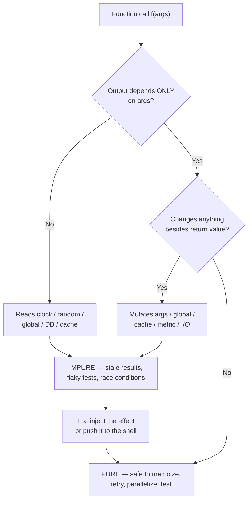

# Pure Functions — Find the Bug

> 12 snippets that *look* pure — same name, same arguments, surely the same answer — but hide a side effect, a clock read, a shared mutation, or a global dependency. Each impurity is the root of a real, shipped-to-production bug. Find the hidden effect first, then read the fix: in almost every case the cure is the same shape — **push the effect to the edge, keep the core pure.**

---

## Table of Contents

- [How to Use](#how-to-use)
- [The Mental Model](#the-mental-model)
- [Snippet 1 — Memoized rate that reads the clock (Python)](#snippet-1--memoized-rate-that-reads-the-clock-python)
- [Snippet 2 — "Pure" mapper mutates a shared cache (Go)](#snippet-2--pure-mapper-mutates-a-shared-cache-go)
- [Snippet 3 — Output depends on a mutable global (Python)](#snippet-3--output-depends-on-a-mutable-global-python)
- [Snippet 4 — Transform mutates its input list (Java)](#snippet-4--transform-mutates-its-input-list-java)
- [Snippet 5 — Calc double-counts via a side metric (Go)](#snippet-5--calc-double-counts-via-a-side-metric-go)
- [Snippet 6 — Lazy cached value computed from now-stale inputs (Python)](#snippet-6--lazy-cached-value-computed-from-now-stale-inputs-python)
- [Snippet 7 — Retry runs a non-idempotent "calculation" twice (Go)](#snippet-7--retry-runs-a-non-idempotent-calculation-twice-go)
- [Snippet 8 — `time.Now()` makes a test flaky and an invoice wrong (Go)](#snippet-8--timenow-makes-a-test-flaky-and-an-invoice-wrong-go)
- [Snippet 9 — Memoization keyed on a mutable argument (Python)](#snippet-9--memoization-keyed-on-a-mutable-argument-python)
- [Snippet 10 — `random` inside a "deterministic" scorer (Python)](#snippet-10--random-inside-a-deterministic-scorer-python)
- [Snippet 11 — Default argument shares state across calls (Python)](#snippet-11--default-argument-shares-state-across-calls-python)
- [Snippet 12 — "Pure" formatter depends on the locale singleton (Java)](#snippet-12--pure-formatter-depends-on-the-locale-singleton-java)
- [Scorecard](#scorecard)
- [Related Topics](#related-topics)

---

## How to Use

Each snippet is code that a reviewer would wave through: it has no obvious `print`, no obvious file write, no obvious mutation. The bug is that it is **not actually pure** — its output depends on something other than its arguments, or it changes something other than its return value.

1. Read the snippet and the **Usage / Test** block under it.
2. Ask the two purity questions:
   - *Same inputs → same output?* (no clock, no random, no global, no DB)
   - *No observable effect besides the return value?* (no mutation of args/globals, no I/O, no counter bumps)
3. Predict what goes wrong on the **second call**, **under concurrency**, **in a different test order**, or **on retry** — those four are where false purity detonates.
4. Open the answer. Note the fix pattern: the effect is **injected** (clock, RNG, cache passed in) or **moved to the shell** (the impure orchestration layer) so the core stays a true function.

Difficulty: ⭐ spot it in 30s · ⭐⭐ needs the usage block · ⭐⭐⭐ only fails on the 2nd call / under load / on retry.

---

## The Mental Model

A pure function is a closed box: same inputs, same output, and nothing changes outside the box. The bugs below all come from a leak in one of those two walls.



The recurring cure is **functional core, imperative shell**: the calculation is a pure function; the clock, RNG, cache, logging, and persistence live in a thin outer layer that calls it.

---

## Snippet 1 — Memoized rate that reads the clock (Python)

⭐⭐ — Looks pure, gets memoized, returns a stale answer forever.

```python
from functools import lru_cache
from datetime import date

EFFECTIVE_RATES = {
    date(2024, 1, 1): 0.21,
    date(2025, 1, 1): 0.23,
    date(2026, 1, 1): 0.25,
}

@lru_cache(maxsize=None)
def current_tax_rate(country: str) -> float:
    today = date.today()
    applicable = max(d for d in EFFECTIVE_RATES if d <= today)
    return EFFECTIVE_RATES[applicable]

# Usage — a long-running web worker:
def quote(amount: float, country: str) -> float:
    return amount * (1 + current_tax_rate(country))
```

**What's wrong?**

<details><summary>Answer</summary>

`current_tax_rate("US")` is decorated with `@lru_cache`, which assumes the function is pure: same argument → same result, cache it forever. But the function **reads `date.today()`** — its output depends on the clock, not just on `country`.

On a long-running worker started on 2025-12-31, the first call caches `0.23` keyed on `"US"`. When the clock rolls over to 2026-01-01, the new `0.25` rate is *never seen* — the cache returns the stale `0.23` until the process restarts. Every invoice issued in 2026 by that worker undercharges tax. The bug is invisible in tests (single short-lived run) and only appears at a year boundary in production.

**Why it hid:** the function takes one argument and returns a number — it *looks* memoizable. The clock dependency is buried in line 1 of the body.

**Fix — make the time an explicit input, then the cache key is honest:**

```python
@lru_cache(maxsize=None)
def tax_rate_on(country: str, on: date) -> float:
    applicable = max(d for d in EFFECTIVE_RATES if d <= on)
    return EFFECTIVE_RATES[applicable]   # truly pure: (country, on) -> rate

# Shell reads the clock; core stays pure:
def quote(amount: float, country: str, today: date | None = None) -> float:
    today = today or date.today()
    return amount * (1 + tax_rate_on(country, today))
```

Now the cache key includes `on`, so a new day is a new key. The clock read moved to the shell (`quote`), and `tax_rate_on` is safe to memoize, test, and reason about. **Rule: never memoize a function that reads the clock — memoization is only valid for pure functions.**
</details>

---

## Snippet 2 — "Pure" mapper mutates a shared cache (Go)

⭐⭐⭐ — Correct single-threaded; wrong answers under concurrency.

```go
package pricing

import "strings"

// normalizeCache speeds up repeated normalization.
var normalizeCache = map[string]string{}

// Normalize looks pure: same SKU in, same canonical SKU out.
func Normalize(sku string) string {
	if v, ok := normalizeCache[sku]; ok {
		return v
	}
	v := strings.ToUpper(strings.TrimSpace(sku))
	normalizeCache[sku] = v
	return v
}

// Usage: many goroutines normalize SKUs from an incoming order stream.
func NormalizeAll(skus []string) []string {
	out := make([]string, len(skus))
	for i, s := range skus {
		out[i] = Normalize(s) // called concurrently across requests
	}
	return out
}
```

**What's wrong?**

<details><summary>Answer</summary>

`Normalize` advertises purity (`string -> string`, deterministic), but it **writes to a package-global `map`** as a side effect. Two problems:

1. **Data race / crash.** Go maps are not safe for concurrent read+write. Under load, two goroutines writing `normalizeCache` simultaneously trigger `fatal error: concurrent map writes` and kill the process — not a panic you can recover, an immediate crash. The race detector flags it; production discovers it during a traffic spike.
2. **Hidden shared state.** Even single-threaded, the function is impure: its *observable effect* is mutating a global. A "pure" function should change nothing but its return value.

**Why it hid:** the cache is an optimization, mentally filed as "doesn't affect correctness." But a cache that's read and written by a function makes that function stateful.

**Fix — make the core pure, and if you must cache, own the cache behind a lock (push the effect to a dedicated type):**

```go
// Pure core — no globals, trivially concurrent-safe and testable.
func Normalize(sku string) string {
	return strings.ToUpper(strings.TrimSpace(sku))
}

// If profiling proves caching helps, the cache is an explicit, synchronized object —
// not a hidden side effect of a "pure" function.
type Normalizer struct {
	mu    sync.Mutex
	cache map[string]string
}

func (n *Normalizer) Normalize(sku string) string {
	n.mu.Lock()
	defer n.mu.Unlock()
	if v, ok := n.cache[sku]; ok {
		return v
	}
	v := Normalize(sku)
	n.cache[sku] = v
	return v
}
```

The pure `Normalize` is the source of truth; the optional cache is a stateful component you can see, lock, and reason about. Better still: `sync.Map` or per-request caches avoid the global entirely.
</details>

---

## Snippet 3 — Output depends on a mutable global (Python)

⭐⭐ — Tests pass alone, fail when the suite reorders.

```python
# config.py
ROUNDING = "half_up"   # module-level, mutated by admin endpoints at runtime

# billing.py
from decimal import Decimal, ROUND_HALF_UP, ROUND_HALF_EVEN
import config

def round_money(value: Decimal) -> Decimal:
    if config.ROUNDING == "half_up":
        return value.quantize(Decimal("0.01"), rounding=ROUND_HALF_UP)
    return value.quantize(Decimal("0.01"), rounding=ROUND_HALF_EVEN)

# tests
def test_rounds_half_up():
    config.ROUNDING = "half_up"
    assert round_money(Decimal("2.005")) == Decimal("2.01")

def test_rounds_banker():
    config.ROUNDING = "half_even"
    assert round_money(Decimal("2.005")) == Decimal("2.00")
```

**What's wrong?**

<details><summary>Answer</summary>

`round_money` takes a `Decimal` and returns a `Decimal` — it *looks* pure. But its result depends on the **mutable module global `config.ROUNDING`**, which is read inside the function and written from elsewhere (admin endpoints, and the tests).

The leak shows up as **test-order dependence**. `test_rounds_banker` sets `config.ROUNDING = "half_even"` and never resets it. If pytest runs `test_rounds_banker` before some *other* test that calls `round_money` and expects the default `"half_up"`, that other test now fails — for a reason that has nothing to do with what it's testing. Run the suite in a different order (pytest-randomly, parallel xdist) and tests flicker. Worse, in production the rounding mode is a global the whole process shares, so one admin toggling it changes billing for every concurrent request mid-flight.

**Why it hid:** the dependency is a plain `import config; config.ROUNDING`, not a parameter. Each test "works" because it sets the global first — masking that the function isn't a function of its argument alone.

**Fix — make the dependency an explicit parameter (the global becomes data you pass in):**

```python
from enum import Enum

class Rounding(Enum):
    HALF_UP = ROUND_HALF_UP
    BANKERS = ROUND_HALF_EVEN

def round_money(value: Decimal, mode: Rounding) -> Decimal:
    return value.quantize(Decimal("0.01"), rounding=mode.value)

# tests are now isolated and order-independent — no shared global to leak:
def test_rounds_half_up():
    assert round_money(Decimal("2.005"), Rounding.HALF_UP) == Decimal("2.01")

def test_rounds_banker():
    assert round_money(Decimal("2.005"), Rounding.BANKERS) == Decimal("2.00")
```

The shell decides which mode to use (from config, request, tenant) and passes it in. The core depends only on its arguments — order-independent tests, no cross-request bleed.
</details>

---

## Snippet 4 — Transform mutates its input list (Java)

⭐⭐ — The caller's original data silently changes.

```java
public final class Discounts {

    /** Returns the lines with a 10% discount applied to electronics. */
    public static List<OrderLine> applyElectronicsDiscount(List<OrderLine> lines) {
        for (OrderLine line : lines) {
            if (line.getCategory() == Category.ELECTRONICS) {
                line.setUnitPrice(line.getUnitPrice().multiply(new BigDecimal("0.90")));
            }
        }
        return lines;
    }
}

// Usage:
List<OrderLine> original = cart.getLines();
List<OrderLine> discounted = Discounts.applyElectronicsDiscount(original);

BigDecimal youSave = totalOf(original).subtract(totalOf(discounted));
System.out.println("You save: " + youSave);   // always 0.00
auditService.record(original);                 // records the DISCOUNTED prices
```

**What's wrong?**

<details><summary>Answer</summary>

The method name and signature promise a *transform*: take lines, return discounted lines. But it **mutates the `OrderLine` objects in place** (`line.setUnitPrice(...)`) and returns the *same list*. `original` and `discounted` are two references to the one mutated list — they are identical.

The two consequences in the usage block:
- `totalOf(original) - totalOf(discounted)` is `0.00`, because `original` was mutated too. The "You save" line always prints zero.
- `auditService.record(original)` is supposed to log the *pre-discount* cart for compliance, but it now logs the discounted prices — a data-integrity bug that an auditor finds months later.

**Why it hid:** the method *returns* a list, which signals "I produce a new value." Returning the input after mutating it is the classic false-purity trap.

**Fix — build and return a new list; never touch the input (treat inputs as immutable):**

```java
public static List<OrderLine> applyElectronicsDiscount(List<OrderLine> lines) {
    return lines.stream()
        .map(line -> line.getCategory() == Category.ELECTRONICS
            ? line.withUnitPrice(line.getUnitPrice().multiply(new BigDecimal("0.90")))
            : line)                       // unchanged lines reused; electronics replaced
        .toList();                        // a brand-new immutable list
}
```

This requires `OrderLine` to expose a copy-with method (`withUnitPrice`) instead of a setter — i.e., make `OrderLine` immutable (a `record` is ideal). Now `original` is untouched, "You save" is correct, and the audit log captures the real pre-discount cart. **Rule: a pure transform returns new data and leaves its arguments exactly as it found them.**
</details>

---

## Snippet 5 — Calc double-counts via a side metric (Go)

⭐⭐⭐ — The number is right; the dashboard isn't, and a refactor makes it worse.

```go
package shipping

var quotesIssued = expvar.NewInt("quotes_issued") // exported metric

// QuoteCost looks like a pure pricing function.
func QuoteCost(weightKg float64, zone int) float64 {
	quotesIssued.Add(1) // "track how many quotes we give"
	base := 4.0 + 1.5*weightKg
	switch zone {
	case 1:
		return base
	case 2:
		return base * 1.4
	default:
		return base * 2.2
	}
}

// Usage in the checkout flow:
func CheapestZone(weightKg float64) (bestZone int, cost float64) {
	cost = math.MaxFloat64
	for z := 1; z <= 3; z++ {
		c := QuoteCost(weightKg, z) // called 3x just to compare
		if c < cost {
			cost, bestZone = c, z
		}
	}
	return
}
```

**What's wrong?**

<details><summary>Answer</summary>

`QuoteCost` does two things: it computes a price (its advertised job) **and** it increments the `quotesIssued` metric (a hidden side effect). Because the effect rides inside the "calculation," it fires every time the function is *called*, not every time a quote is actually *issued to a customer*.

`CheapestZone` calls `QuoteCost` three times to *compare* zones, then returns one. Each comparison bumps `quotesIssued`, so every single checkout records **3 quotes** instead of 1. The business dashboard reports 3× the real quote volume — capacity planning and conversion math are all off, and nobody suspects the pricing function because the *price it returns* is correct.

It gets worse under maintenance: a sensible optimization ("memoize `QuoteCost`, it's pure") would now *under*-count, because cached calls skip the counter. The side effect and the calculation have incompatible caching semantics — a tell-tale sign they don't belong in the same function.

**Why it hid:** the metric line looks like harmless observability, and the function's *return value* is never wrong. Only the counter is wrong.

**Fix — separate the pure calculation from the effect; count where the business event happens (the shell):**

```go
// Pure: same (weight, zone) -> same cost, no effects. Safe to call N times.
func QuoteCost(weightKg float64, zone int) float64 {
	base := 4.0 + 1.5*weightKg
	switch zone {
	case 1:
		return base
	case 2:
		return base * 1.4
	default:
		return base * 2.2
	}
}

// Shell: increment once, at the real business moment.
func IssueQuoteToCustomer(weightKg float64) Quote {
	zone, cost := CheapestZone(weightKg) // CheapestZone now calls a pure func freely
	quotesIssued.Add(1)                  // exactly one issued quote
	return Quote{Zone: zone, Cost: cost}
}
```

`CheapestZone` can call the pure `QuoteCost` as many times as it likes with zero metric impact, and `quotesIssued` finally measures issued quotes. **Rule: counters, logs, and metrics are effects — keep them out of functions whose value others compute with.**
</details>

---

## Snippet 6 — Lazy cached value computed from now-stale inputs (Python)

⭐⭐⭐ — First access wins forever; later changes are ignored.

```python
from functools import cached_property

class Invoice:
    def __init__(self, line_items: list[float], tax_rate: float):
        self.line_items = line_items
        self.tax_rate = tax_rate

    @cached_property
    def total(self) -> float:
        subtotal = sum(self.line_items)
        return subtotal * (1 + self.tax_rate)

# Usage:
inv = Invoice([100.0, 50.0], tax_rate=0.10)
print(inv.total)          # 165.0

inv.line_items.append(30.0)   # customer adds an item
inv.tax_rate = 0.20           # tax bracket recalculated
print(inv.total)          # still 165.0  (!)
```

**What's wrong?**

<details><summary>Answer</summary>

`total` is wrapped in `@cached_property`: it runs **once**, on first access, and the result is stored on the instance. `cached_property` is only correct when the computation is a *pure function of state that never changes after first access* — effectively, when the inputs are immutable.

Here the inputs are mutable: `line_items` is a list the caller keeps appending to, and `tax_rate` is reassigned. After the first `inv.total` read locks in `165.0`, adding a line item and changing the tax rate have **no effect** — `inv.total` returns the stale `165.0` forever. The customer is billed for a cart and a tax rate that no longer exist.

**Why it hid:** `cached_property` reads exactly like a normal computed property at the call site (`inv.total`); the "compute once and freeze" semantics are invisible unless you know the decorator. It "works" in every test that reads `total` only after the object is fully built.

**Fix — either make the inputs immutable (so caching is valid) or don't cache a value derived from mutable state:**

```python
# Option A: immutable inputs make cached_property legitimate.
from dataclasses import dataclass

@dataclass(frozen=True)
class Invoice:
    line_items: tuple[float, ...]   # tuple, not list — can't be appended to
    tax_rate: float

    @cached_property
    def total(self) -> float:       # safe: nothing can change after construction
        return sum(self.line_items) * (1 + self.tax_rate)

# Option B: keep mutability, recompute every time (a plain method/property).
class Invoice:
    def __init__(self, line_items, tax_rate):
        self.line_items = line_items
        self.tax_rate = tax_rate

    @property
    def total(self) -> float:       # pure function of current state, evaluated now
        return sum(self.line_items) * (1 + self.tax_rate)
```

Caching is only sound when "the inputs can't have changed since we cached." If they can, recompute. **Rule: lazy caching assumes purity over the lifetime of the cache — prove the inputs are frozen before you cache.**
</details>

---

## Snippet 7 — Retry runs a non-idempotent "calculation" twice (Go)

⭐⭐⭐ — Succeeds normally; charges twice on a transient blip.

```go
// ApplyLoyaltyCredit looks like it computes a new balance.
func ApplyLoyaltyCredit(ctx context.Context, userID string, spend float64) (float64, error) {
	points := int(spend / 10) // 1 point per $10 — pure math, right?
	// ...but it also persists the points as a side effect:
	if err := db.Exec(ctx,
		"UPDATE accounts SET points = points + $1 WHERE id = $2", points, userID,
	); err != nil {
		return 0, err
	}
	return spend - float64(points), nil
}

// Caller wraps everything in a generic retry, assuming the func is safe to re-run:
func withRetry(fn func() (float64, error)) (float64, error) {
	var err error
	for attempt := 0; attempt < 3; attempt++ {
		var v float64
		if v, err = fn(); err == nil {
			return v, nil
		}
	}
	return 0, err
}

// result, _ := withRetry(func() (float64, error) { return ApplyLoyaltyCredit(ctx, "u1", 200) })
```

**What's wrong?**

<details><summary>Answer</summary>

`ApplyLoyaltyCredit` is named and shaped like a calculation (`spend -> new balance`), so the caller reasonably wraps it in a generic `withRetry`. But the function is **not pure and not idempotent**: it performs a `points = points + N` database mutation.

When the network blips and the `UPDATE` *commits* but the response is lost, `fn()` returns an error, `withRetry` calls it again, and the points are added a **second time**. A transient failure silently double-credits the account. The "calculation" has a side effect, and retrying a side effect that isn't idempotent corrupts data.

**Why it hid:** retry wrappers are written assuming the wrapped function is safe to re-run — which is true only for pure or idempotent operations. The mutation is buried between the "pure math" line and the return.

**Fix — separate the pure computation from the effect, and make the effect idempotent (push it to the shell):**

```go
// Pure: same spend -> same points & balance. Re-run a million times, no harm.
func LoyaltyCredit(spend float64) (points int, newBalance float64) {
	points = int(spend / 10)
	return points, spend - float64(points)
}

// Effect, made idempotent with a dedup key so a retry is a no-op.
func RecordLoyaltyCredit(ctx context.Context, userID, txnID string, points int) error {
	return db.Exec(ctx, `
		INSERT INTO loyalty_credits (txn_id, user_id, points) VALUES ($1, $2, $3)
		ON CONFLICT (txn_id) DO NOTHING`, // 2nd attempt with same txnID does nothing
		txnID, userID, points)
}
```

Now `withRetry` can wrap `RecordLoyaltyCredit` safely: the dedup key (`txn_id`) makes a re-run a no-op, and `LoyaltyCredit` is a pure function you can test and reuse anywhere. **Rule: only pure or idempotent operations are safe to retry — never retry a bare side effect.**
</details>

---

## Snippet 8 — `time.Now()` makes a test flaky and an invoice wrong (Go)

⭐⭐ — Passes today, fails on the 1st of the month, flaky near midnight.

```go
package billing

import "time"

// ProrationFactor returns the fraction of the month remaining — looks pure.
func ProrationFactor(monthlyPrice float64) float64 {
	now := time.Now()
	daysInMonth := time.Date(now.Year(), now.Month()+1, 0, 0, 0, 0, 0, now.Location()).Day()
	daysRemaining := daysInMonth - now.Day() + 1
	return float64(daysRemaining) / float64(daysInMonth)
}

func ProratedCharge(monthlyPrice float64) float64 {
	return monthlyPrice * ProrationFactor(monthlyPrice)
}

// Test:
func TestProration(t *testing.T) {
	got := ProrationFactor(100) // expecting "half the month left"?
	if got != 0.5 {
		t.Fatalf("want 0.5, got %v", got)
	}
}
```

**What's wrong?**

<details><summary>Answer</summary>

`ProrationFactor` takes a price and returns a fraction — it reads like a pure formula. But it calls **`time.Now()`** internally, so its output depends on *when you run it*, not on its argument. Two failures:

1. **Flaky / impossible test.** `TestProration` expects `0.5`, which is only true on roughly the 15th of a 30-day month. Run the suite any other day and it fails; run it across a midnight boundary and it's non-deterministic. The test can never be both correct and stable, because the function isn't a function of its inputs.
2. **Non-reproducible billing.** Re-running the same charge computation at a different moment yields a different number. You can't replay or audit a charge, because the inputs that produced it (the wall clock) weren't recorded.

**Why it hid:** `time.Now()` is one innocuous line; the signature gives no hint that the result varies with the clock.

**Fix — inject the clock as an explicit input; the core becomes pure and the test trivial:**

```go
// Pure: (price, at) -> factor. Same inputs, same output, fully testable.
func ProrationFactor(at time.Time) float64 {
	daysInMonth := time.Date(at.Year(), at.Month()+1, 0, 0, 0, 0, 0, at.Location()).Day()
	daysRemaining := daysInMonth - at.Day() + 1
	return float64(daysRemaining) / float64(daysInMonth)
}

// Shell reads the real clock and passes it down.
func ProratedCharge(monthlyPrice float64, at time.Time) float64 {
	return monthlyPrice * ProrationFactor(at)
}

// Test pins an exact instant — deterministic forever:
func TestProration(t *testing.T) {
	at := time.Date(2025, 4, 16, 0, 0, 0, 0, time.UTC) // 15 of 30 days remain
	if got := ProrationFactor(at); got != 0.5 {
		t.Fatalf("want 0.5, got %v", got)
	}
}
```

The clock is now data flowing through the signature. The production caller passes `time.Now()`; tests pass a fixed instant; audits replay the recorded instant. **Rule: a function that reads the clock isn't pure — pass the time in.**
</details>

---

## Snippet 9 — Memoization keyed on a mutable argument (Python)

⭐⭐⭐ — Returns the cached answer for a key whose contents changed.

```python
def memoize(fn):
    cache = {}
    def wrapper(items):
        key = id(items)            # cache by the object's identity — fast!
        if key not in cache:
            cache[key] = fn(items)
        return cache[key]
    return wrapper

@memoize
def total_weight(items: list[dict]) -> float:
    return sum(i["weight"] for i in items)

# Usage:
cart = [{"weight": 1.0}, {"weight": 2.0}]
print(total_weight(cart))   # 3.0
cart.append({"weight": 5.0})
print(total_weight(cart))   # 3.0  (!)  expected 8.0
```

**What's wrong?**

<details><summary>Answer</summary>

Two impurity bugs compound here:

1. **`total_weight` is pure, but the argument it's keyed on is mutable.** The `memoize` wrapper keys the cache on `id(items)` — the object's memory address. When the caller appends to the *same* `cart` list, the contents change but `id(cart)` does not, so the cache happily returns the stale `3.0`. Memoization assumes that "same key ⇒ same inputs," which only holds for immutable (or value-keyed) arguments.
2. **`id()` reuse.** Even worse: once `cart` is garbage-collected, Python can reuse its `id` for a brand-new object, so a *different* list could hit the old cache entry and get a wildly wrong answer.

`total_weight` itself is a fine pure function. The bug is that it's memoized over a mutable, identity-keyed argument — a contract violation in the *caching layer*, not the function.

**Why it hid:** the function looks like a textbook memoization candidate (deterministic, expensive-ish). The mutability of the list argument is the trap.

**Fix — key on the value, not identity, and prefer immutable arguments:**

```python
from functools import lru_cache

@lru_cache(maxsize=None)
def total_weight(items: tuple[float, ...]) -> float:  # hashable, immutable key
    return sum(items)

# Caller passes an immutable snapshot; a different cart is a different key:
cart = [{"weight": 1.0}, {"weight": 2.0}]
weights = tuple(i["weight"] for i in cart)
print(total_weight(weights))      # 3.0
cart.append({"weight": 5.0})
weights = tuple(i["weight"] for i in cart)
print(total_weight(weights))      # 8.0 — new value, new key, correct
```

`lru_cache` requires hashable arguments precisely so the key reflects the *value*. **Rule: only memoize pure functions, and only over immutable (value-equal) arguments — never over object identity.**
</details>

---

## Snippet 10 — `random` inside a "deterministic" scorer (Python)

⭐⭐ — Same input, different output; A/B results irreproducible.

```python
import random

def rank_score(relevance: float, freshness: float) -> float:
    """Deterministic ranking score from two features."""
    jitter = random.uniform(-0.01, 0.01)   # "tie-breaker so equal items shuffle"
    return 0.7 * relevance + 0.3 * freshness + jitter

# Usage: sort search results, and snapshot-test the ranking.
def test_ranking_stable():
    a = rank_score(0.9, 0.5)
    b = rank_score(0.9, 0.5)
    assert a == b   # flaky: fails ~always
```

**What's wrong?**

<details><summary>Answer</summary>

`rank_score` is documented as "deterministic" and has a clean `(float, float) -> float` signature, but it calls **`random.uniform`** from the global RNG. Its output is not a function of its arguments:

- `test_ranking_stable` fails almost every run — `a != b` for identical inputs.
- In production, re-ranking the same result set twice produces different orders, so pagination jumps and "why did result #3 move?" bug reports pile up.
- A/B experiments are unreproducible: you can't replay a ranking to explain it, because the randomness wasn't recorded.

**Why it hid:** the jitter has a plausible-sounding purpose (tie-breaking), and `random` reads from a hidden global generator that no parameter reveals.

**Fix — inject the source of randomness (or derive deterministic jitter from the inputs):**

```python
# Option A: inject a seeded RNG — pure given the rng, reproducible, testable.
def rank_score(relevance: float, freshness: float, rng: random.Random) -> float:
    jitter = rng.uniform(-0.01, 0.01)
    return 0.7 * relevance + 0.3 * freshness + jitter

def test_ranking_stable():
    rng = random.Random(42)        # fixed seed
    assert rank_score(0.9, 0.5, random.Random(42)) == rank_score(0.9, 0.5, random.Random(42))

# Option B: deterministic tie-break derived from a stable item key — no RNG at all.
def rank_score(relevance: float, freshness: float, item_id: str) -> float:
    jitter = (hash(item_id) % 1000) / 1000 * 0.02 - 0.01  # stable per item
    return 0.7 * relevance + 0.3 * freshness + jitter
```

The RNG (or the seed) is now an explicit input; the shell creates it and can record the seed for replay. **Rule: randomness is an effect — pass the generator in, or remove the need for it.**
</details>

---

## Snippet 11 — Default argument shares state across calls (Python)

⭐ — The classic; the "fresh" container isn't fresh.

```python
def build_event(name: str, tags: list[str] = []) -> dict:
    tags.append("auto")          # always stamp an auto tag
    return {"name": name, "tags": tags}

# Usage:
e1 = build_event("login")
e2 = build_event("logout")
print(e1["tags"])   # ['auto', 'auto']   (!)
print(e2["tags"])   # ['auto', 'auto']   (!)
```

**What's wrong?**

<details><summary>Answer</summary>

`build_event` looks pure: name in, event dict out, default tags empty. But the default `tags=[]` is **evaluated once, at function-definition time**, and that single list object is reused for every call that omits `tags`. The function then **mutates** that shared default with `tags.append("auto")`.

So the "empty" default accumulates across calls: `e1` and `e2` share the same list, and both end up `['auto', 'auto']`. Same arguments (`build_event("login")` twice) produce *different* results depending on how many times the function was called before — the textbook symptom of hidden mutable state.

**Why it hid:** the mutable-default-argument trap is invisible unless you know Python evaluates defaults once. The function reads as obviously pure.

**Fix — use an immutable sentinel default and never mutate the argument:**

```python
def build_event(name: str, tags: list[str] | None = None) -> dict:
    tags = [*(tags or []), "auto"]   # fresh list each call; input untouched
    return {"name": name, "tags": tags}

e1 = build_event("login")
e2 = build_event("logout")
print(e1["tags"])   # ['auto']
print(e2["tags"])   # ['auto']
```

The default is the immutable `None`; a new list is built inside the function each call; the caller's `tags` is never mutated. The function is now genuinely pure. **Rule: never use a mutable default argument, and never mutate an argument you were handed.**
</details>

---

## Snippet 12 — "Pure" formatter depends on the locale singleton (Java)

⭐⭐⭐ — Correct in CI, wrong on a server in another region.

```java
public final class Money {

    /** Formats cents as a currency string — surely deterministic. */
    public static String format(long cents) {
        double dollars = cents / 100.0;
        return NumberFormat.getCurrencyInstance().format(dollars); // default locale
    }
}

// Test (runs on a US-locale CI box):
@Test
void formatsCurrency() {
    assertEquals("$12.34", Money.format(1234));   // passes in CI
}

// Production server is started with -Duser.language=de -Duser.country=DE
// Money.format(1234) -> "12,34 €"  — written into a JSON API contract.
```

**What's wrong?**

<details><summary>Answer</summary>

`Money.format` takes a `long` and returns a `String`, advertising determinism. But `NumberFormat.getCurrencyInstance()` (no argument) reads the **JVM default locale** — a process-wide mutable global set by `-Duser.*` flags, the OS, or `Locale.setDefault()` called anywhere in the app.

Same input `1234` produces `"$12.34"` on the US-locale CI box but `"12,34 €"` on a German-locale production server. The output depends on hidden global state, not on the argument. The test passes in CI and the bug ships: the API now emits `"12,34 €"` (wrong currency symbol *and* comma decimal separator) into a JSON contract that consumers parse as USD with a dot — silent data corruption downstream. Worse, any code that calls `Locale.setDefault(...)` mid-process can flip the output for all subsequent calls.

**Why it hid:** the locale dependency is implicit in the no-arg `getCurrencyInstance()`. Nothing in the signature warns that the result depends on a global.

**Fix — pass the locale and currency explicitly; the core becomes a true function of its inputs:**

```java
public static String format(long cents, Currency currency, Locale locale) {
    BigDecimal amount = BigDecimal.valueOf(cents, 2);   // exact, no double
    NumberFormat fmt = NumberFormat.getCurrencyInstance(locale);
    fmt.setCurrency(currency);
    return fmt.format(amount);
}

@Test
void formatsCurrency() {
    // Pinned inputs -> same output on every machine, every locale.
    assertEquals("$12.34", Money.format(1234, Currency.getInstance("USD"), Locale.US));
}
```

The shell decides which locale/currency to use (from the request, the tenant, the account) and passes them in; the formatter depends only on its arguments. **Rule: implicit dependence on a process-wide default (locale, timezone, default charset) is hidden global state — make it a parameter.**
</details>

---

## Scorecard

Track how you did. The skill isn't spotting a `print` — it's noticing the *invisible* dependency or effect.

| # | Snippet | Hidden impurity | Detonates on | Difficulty |
|---|---------|-----------------|--------------|:----------:|
| 1 | Memoized tax rate | Reads `date.today()`, then cached | Year boundary, long-lived process | ⭐⭐ |
| 2 | Normalize mapper | Mutates global cache map | Concurrency (map race / crash) | ⭐⭐⭐ |
| 3 | round_money | Reads mutable global config | Different test order / concurrent request | ⭐⭐ |
| 4 | applyElectronicsDiscount | Mutates input list & objects | Caller reuses "original" | ⭐⭐ |
| 5 | QuoteCost | Bumps a metric counter | Called N times to compare | ⭐⭐⭐ |
| 6 | Invoice.total | cached_property over mutable state | Inputs change after first read | ⭐⭐⭐ |
| 7 | ApplyLoyaltyCredit | Non-idempotent DB write | Retry after a transient failure | ⭐⭐⭐ |
| 8 | ProrationFactor | Reads `time.Now()` | Any day but the 15th; midnight | ⭐⭐ |
| 9 | memoize(total_weight) | Keyed on mutable `id()` | Argument mutated in place | ⭐⭐⭐ |
| 10 | rank_score | Global `random` | Every repeated call | ⭐⭐ |
| 11 | build_event | Mutable default argument | 2nd call onward | ⭐ |
| 12 | Money.format | Reads JVM default locale | Server in another region | ⭐⭐⭐ |

**0–4 found:** You read for syntax, not for effects. Re-scan each snippet asking only "same inputs → same output?" and "does anything outside change?" — ignore everything else.

**5–8 found:** Solid. You catch the clock/random reads. Push on the subtle ones: caching over mutable state (6, 9) and effects that only hurt under retry or concurrency (2, 5, 7).

**9–12 found:** You think in functional-core / imperative-shell. You'd have caught these in review by asking where the effect lives — and moved it to the edge.

**The single question that finds all twelve:** *"If I called this twice with the same arguments — on a different day, in a different test order, on a retry, or from two threads — would I get the same answer and change nothing else?"* If the answer is "it depends," the function is impure, and the fix is to make the dependency an argument or move the effect to the shell.

---

## Related Topics

- [README.md](README.md) — the positive rules for Pure Functions: referential transparency, functional core / imperative shell, why purity buys you testability, caching, and parallelism.
- [junior.md](junior.md) — the junior-level introduction with the definition and a first worked example.
- [tasks.md](tasks.md) — practice exercises: take an impure function and make it pure by injecting effects.
- [../README.md](../README.md) — the Clean Code chapter index; pure functions sit alongside naming, function design, and error handling.
- [../../anti-patterns/README.md](../../anti-patterns/README.md) — hidden side effects and shared mutable state are anti-patterns in their own right; this connects the smell to its catalog entry.
- [../../refactoring/README.md](../../refactoring/README.md) — the mechanical refactorings (Introduce Parameter, Extract Function, Replace Global with Parameter) that turn an impure function into a pure core plus a thin shell.
