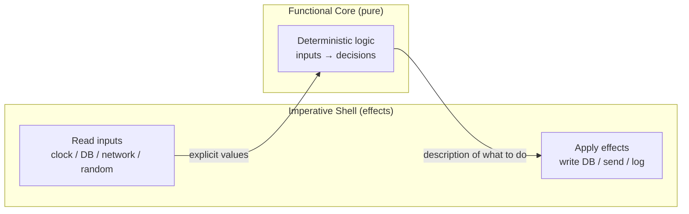

# Pure Functions — Interview Questions

> 50+ questions across all tiers (Junior → Staff). Each harder question notes **what the interviewer is really checking**. Use as self-review or interview prep.

---

## Table of Contents

- [Junior (15 questions)](#junior-15-questions)
- [Mid (15 questions)](#mid-15-questions)
- [Senior (12 questions)](#senior-12-questions)
- [Staff (8 questions)](#staff-8-questions)
- [Trick Questions (8)](#trick-questions-8)
- [Rapid-Fire](#rapid-fire)
- [Summary](#summary)
- [Further Reading](#further-reading)
- [Related Topics](#related-topics)

---

## Junior (15 questions)

### J1. What is a pure function?

<details><summary>Answer</summary>

A function that (1) returns the same output for the same input every time, and (2) has no observable side effects. Its result depends only on its arguments, and calling it changes nothing outside itself.

</details>

### J2. What is a side effect?

<details><summary>Answer</summary>

Any observable interaction with the world outside the function's return value: mutating a global or an argument, writing to disk/network/console, reading the clock or a random source, throwing based on external state, or modifying a field. If removing the call would change anything besides the value you used, it had a side effect.

</details>

### J3. Give an example of a pure function.

<details><summary>Answer</summary>

```python
def add(a, b):
    return a + b
```

Same inputs → same output, touches nothing external.

</details>

### J4. Give an example of an impure function and say why.

<details><summary>Answer</summary>

```python
total = 0
def add_to_total(x):
    global total
    total += x      # mutates external state
    return total    # output depends on call history
```

It mutates a global and its output depends on prior calls, not just `x`.

</details>

### J5. Is `Math.random()` pure?

<details><summary>Answer</summary>

**No.** Same inputs (none) produce different outputs. It reads a hidden, mutating PRNG seed — a side effect. Purity requires a deterministic mapping from input to output.

</details>

### J6. Is a function that reads the current time pure?

<details><summary>Answer</summary>

**No.** `now()` returns different values on different calls with the same (empty) input. The clock is hidden, mutable global state.

</details>

### J7. Why are pure functions easy to test?

<details><summary>Answer</summary>

No setup, no mocks, no teardown. You call with inputs and assert on outputs. There's no hidden state to arrange or clean up, and tests can't interfere with each other.

</details>

### J8. What does "deterministic" mean?

<details><summary>Answer</summary>

Same input always yields the same output. Determinism is necessary for purity but not sufficient — a function can be deterministic yet still write to a log (a side effect), making it impure.

</details>

### J9. Can a pure function call another function?

<details><summary>Answer</summary>

Yes — as long as the callee is also pure. Purity composes: a function built only from pure parts is pure. One impure call anywhere in the chain contaminates the whole.

</details>

### J10. Does a pure function have to be small?

<details><summary>Answer</summary>

No. Purity is about effects and determinism, not size. A 200-line numeric routine that touches nothing external is pure; a 3-line function that logs is not.

</details>

### J11. Is mutating a local variable a side effect?

<details><summary>Answer</summary>

**No.** Locals are private to the call; they vanish when it returns and no one outside observes them. A function can loop and reassign locals freely and still be pure.

</details>

### J12. Is mutating an argument a side effect?

<details><summary>Answer</summary>

**Yes**, if the argument is shared/mutable (a list, object, slice). The caller observes the change. A pure function treats inputs as read-only and returns new values instead.

</details>

### J13. What's the difference between a pure function and a "helper" function?

<details><summary>Answer</summary>

"Helper" describes role (small, reused); "pure" describes behavior (no effects, deterministic). A helper may or may not be pure. The terms answer different questions.

</details>

### J14. Why do pure functions make code easier to reason about?

<details><summary>Answer</summary>

You only need to read the function's body to know what it does — no hunting for hidden state it might touch or be touched by. The signature tells the whole story: inputs in, output out.

</details>

### J15. Name three things a pure function must NOT do.

<details><summary>Answer</summary>

Mutate shared state (globals, arguments), perform I/O (files, network, console, DB), or read non-deterministic sources (clock, random, environment). Any of these breaks purity.

</details>

---

## Mid (15 questions)

### M1. Define referential transparency.

<details><summary>Answer</summary>

An expression is referentially transparent if you can replace it with its value without changing the program's behavior. `add(2, 3)` can be swapped for `5` anywhere. A call to `now()` cannot be replaced by a single value — so it is *not* referentially transparent. Referential transparency is the precise, expression-level statement of purity.

</details>

### M2. What is the functional core / imperative shell?

<details><summary>Answer</summary>

An architecture where business logic lives in a **pure core** (deterministic, effect-free, heavily tested) and all effects — I/O, time, randomness, DB — live in a thin **imperative shell** at the edges. The shell gathers inputs, calls the core, then performs effects with the core's output. You get a large, trivially testable region and a small, integration-tested boundary.

**What the interviewer is really checking:** whether you can structure a real application so that most of it is pure, not just write toy pure functions.

</details>

### M3. How do you make a function that depends on the current time pure?

<details><summary>Answer</summary>

Inject time as a parameter instead of reading it inside:

```python
# impure
def is_expired(token): return token.exp < now()

# pure
def is_expired(token, current_time): return token.exp < current_time
```

The shell reads the clock once and passes the value in. The core stays pure and you can test expiry at any instant trivially.

</details>

### M4. How do you handle randomness in a pure function?

<details><summary>Answer</summary>

Inject the random source or its result. Either pass the random value in, or thread an explicit PRNG seed/state through and return the next seed alongside the result (the functional approach: `(value, nextSeed) = rng(seed)`). The function becomes deterministic given its seed.

</details>

### M5. Why are pure functions safe to cache (memoize)?

<details><summary>Answer</summary>

Because output is a deterministic function of input, you can store `input → output` and return the cached value on repeat calls with no behavioral difference. **Memoization is only correct for pure functions** — caching an impure function returns stale or wrong results (e.g., memoizing `now()` freezes time).

</details>

### M6. Why are pure functions safe to parallelize?

<details><summary>Answer</summary>

No shared mutable state means no data races, no locks, no ordering constraints. Pure calls can run on any thread, in any order, or be re-run, without changing results. This is why `map`/`filter`/`reduce` over pure functions parallelize for free.

</details>

### M7. Is a function that logs pure?

<details><summary>Answer</summary>

**No.** Logging writes to a file/stdout — an observable side effect. Even if it always returns the same value, the act of logging is an effect, so it isn't referentially transparent (replacing the call with its value loses the log line).

**What the interviewer is really checking:** that you don't equate "returns the same value" with "pure." Determinism ≠ purity.

</details>

### M8. Is reading a config value from a global pure?

<details><summary>Answer</summary>

It depends on mutability. Reading a **truly immutable** constant (set once, never changed) behaves purely — every call sees the same value, so determinism holds. Reading a **mutable** global is impure: the result depends on hidden state that can change between calls. In practice, treat global reads as suspect and prefer passing the value as a parameter, which makes the dependency explicit.

</details>

### M9. Can a pure function throw an exception?

<details><summary>Answer</summary>

Yes, *if* the throw is a deterministic function of the input — e.g., `divide(x, 0)` always throwing for the same args is consistent with purity (some purists prefer returning `Result`/`Either` instead). It becomes impure if the throw depends on **external** state (a missing file, network timeout). The test: does the same input always throw the same way?

</details>

### M10. What is equational reasoning?

<details><summary>Answer</summary>

Reasoning about code by substituting equals for equals, like algebra. If `f` is pure and `x = f(3)`, every `f(3)` in scope equals `x`, so you can factor, inline, or reorder freely. Referential transparency is what makes equational reasoning valid — it's the practical payoff of purity for refactoring and optimization.

</details>

### M11. What are "benign" side effects?

<details><summary>Answer</summary>

Effects that aren't externally observable and don't change semantics — e.g., a memoization cache populated lazily inside a function, or instrumentation that's stripped in production. The function behaves *as if* pure to every caller. They're a pragmatic gray area: acceptable when truly invisible, dangerous when the cache or counter leaks (e.g., affects results or isn't thread-safe).

</details>

### M12. What's the trade-off of returning new objects instead of mutating?

<details><summary>Answer</summary>

Pro: purity, thread-safety, easy reasoning, time-travel/undo. Con: allocation pressure. Mitigated by escape analysis (Java/Go often stack-allocate short-lived values), persistent data structures (structural sharing, O(log n) updates), and the fact that allocation is cheap on modern GCs. Profile before assuming the copy is a bottleneck.

</details>

### M13. A function takes a list and returns its sorted copy without touching the input. Pure?

<details><summary>Answer</summary>

**Yes.** It reads the input (allowed), allocates a new sorted list, mutates only that local, and returns it. No external state changes. `sorted(xs)` in Python is pure; `xs.sort()` (in place) is not.

</details>

### M14. How does purity relate to idempotence?

<details><summary>Answer</summary>

They're different. Pure = no effects + deterministic. Idempotent = applying twice equals applying once (`f(f(x)) == f(x)` for functions, or "repeating a request has the same effect" for operations). A pure function need not be idempotent (`increment` is pure, not idempotent), and an idempotent operation can have effects (a `PUT` writes to a DB).

</details>

### M15. Where must I/O live in a well-structured program?

<details><summary>Answer</summary>

At the edges — the imperative shell, `main`, the controller/handler layer, or repository adapters. The deeper you push effects to the boundary and keep the interior pure, the larger your testable, reusable core becomes. "Effects at the edges, logic in the middle."

</details>

---

## Senior (12 questions)

### S1. Explain "effects as values" / why the IO monad keeps functions pure.

<details><summary>Answer</summary>

Instead of *performing* an effect, you return a **value that describes** the effect — an `IO[A]` is a recipe ("read this file, then print it"), not the act itself. Building and combining these descriptions is pure: `readFile(p)` just constructs a value; nothing happens. The runtime executes the description at the program's edge (e.g., Haskell's `main`). So the entire program stays referentially transparent — the only impure step is the runtime interpreting the final description.

**What the interviewer is really checking:** whether you understand effects can be *first-class data*, decoupling description (pure) from execution (impure), not just the Haskell trivia.

</details>

### S2. How do you test the imperative shell if the logic is in the pure core?

<details><summary>Answer</summary>

The core gets fast, exhaustive unit/property tests with zero mocks. The shell — being thin, mostly wiring — gets a small number of integration tests against real or in-memory dependencies. You don't try to unit-test the shell heavily; its job is plumbing, and there's little branching logic left to cover once the decisions live in the core.

</details>

### S3. How does dependency injection relate to purity?

<details><summary>Answer</summary>

DI is one mechanism for the functional-core/imperative-shell split: instead of a function reaching out to a clock/DB/random source, you inject those as parameters or collaborators. Passing a value (the current time) keeps the function pure; passing an *interface* (a `Clock`) keeps it testable but not strictly pure (it still performs an effect via the collaborator). Pushing all the way to passing plain values is the purest form.

</details>

### S4. What's the difference between a parameterized effect (passing a `Clock`) and true purity?

<details><summary>Answer</summary>

Passing a `Clock` interface makes the function **testable and decoupled** but it still *performs* an effect (calls `clock.now()`), so it isn't referentially transparent — two calls can return different values. Passing the **already-read value** (`currentTime: Instant`) makes it genuinely pure. The interface version is a pragmatic middle ground; the value version is the ideal when feasible.

</details>

### S5. Property-based testing thrives on pure functions. Why?

<details><summary>Answer</summary>

Property tests generate hundreds of random inputs and assert invariants (`reverse(reverse(xs)) == xs`, `decode(encode(x)) == x`). This requires determinism and no side effects — otherwise re-running with the same input could differ, and effects would pollute across cases. Purity makes inputs the only variable, so generated cases are reproducible and isolatable.

</details>

### S6. How do persistent (immutable) data structures make "return a new value" cheap?

<details><summary>Answer</summary>

They share unchanged structure between versions instead of deep-copying. Updating one entry in a HAMT-backed map allocates O(log n) new nodes and reuses the rest; the old version stays valid. This lets pure functions return "modified" collections without O(n) copies — the basis of Clojure's data structures, Scala's `immutable.*`, and Immutable.js.

</details>

### S7. Can a method on a mutable object be pure?

<details><summary>Answer</summary>

A *query* method that reads fields and returns a value without mutating anything is pure **for that call**, but its result depends on the object's current state — so it's only pure relative to `(this, args)` treated as inputs, and only if no other thread mutates the object concurrently. Strictly, a method on shared mutable state is fragile; value objects / immutable types make method purity robust.

</details>

### S8. How do you refactor a tangled impure function toward purity?

<details><summary>Answer</summary>

1. Identify the effects (I/O, time, random, mutation, global reads).
2. Push each effect outward: read inputs *before* the logic, perform writes *after*.
3. Extract the decision-making middle into a pure function taking explicit inputs and returning a description of what to do.
4. The remaining shell does: gather → call pure core → apply effects.

This is "functionalize the core," and it's a standard sequence of Extract Method + parameterize-the-dependency refactors.

</details>

### S9. What's the relationship between purity and concurrency bugs?

<details><summary>Answer</summary>

Most concurrency bugs (races, torn reads, lost updates, deadlocks) arise from **shared mutable state**. Pure functions have none, so they're immune by construction. The discipline of pushing mutation to the edges shrinks the surface where locks and memory-ordering reasoning are needed down to a small, auditable region.

</details>

### S10. Is `printf`-style logging ever acceptable inside otherwise-pure logic? How do you keep it clean?

<details><summary>Answer</summary>

Inline logging breaks purity. Cleaner options: (a) return the log lines / decisions as data and let the shell emit them; (b) use a structured "writer" that accumulates output as a value (the Writer monad idea); (c) accept it as a *benign* effect only when it's compile-stripped instrumentation. The goal is to keep the function's contract "inputs → output," with diagnostics as an explicit output, not a hidden one.

</details>

### S11. How does purity interact with caching layers (HTTP, CDN, memoization)?

<details><summary>Answer</summary>

Caching assumes the cached computation is a pure function of its key. HTTP caching keys on URL + headers and assumes `GET` is effectively pure (safe, no server-state change). Memoization keys on arguments. When the underlying function is impure (depends on time, user, mutable data), you must either include those in the key or set a TTL/invalidation — otherwise you serve stale results. Purity is the precondition that makes caching *correct by default*.

</details>

### S12. What are the limits — what can't be pure?

<details><summary>Answer</summary>

A program that does nothing observable is useless; *somewhere* it must read input and produce output. Effects are essential, not evil. The goal isn't 100% purity but **maximizing the pure region and minimizing/centralizing the impure boundary**. Time, randomness, persistence, and user interaction are irreducibly effectful — you isolate them, you don't eliminate them.

**What the interviewer is really checking:** that you treat purity as an engineering tool with a cost/benefit boundary, not a dogma.

</details>

---

## Staff (8 questions)

### S13. How would you enforce the functional-core/imperative-shell boundary across a large codebase?

<details><summary>Answer</summary>

Architecturally and mechanically: (1) put the pure core in modules/packages that have *no* dependency on I/O, DB, time, or framework libraries; (2) enforce with dependency-direction rules (ArchUnit `core` package may not depend on `io`/`infra`; or a linter / module boundary in Go/Rust); (3) ban clock/random/env access in core via custom lint rules; (4) review for injected values vs. ambient reads. The fitness function fails the build if core imports an effectful package.

**What the interviewer is really checking:** whether you can turn a principle into an *enforced* invariant, not a wiki page everyone ignores.

</details>

### S14. Effect systems (Haskell `IO`, Scala ZIO/Cats Effect, algebraic effects) — what problem do they solve over plain DI?

<details><summary>Answer</summary>

They make effects **visible in the type system** and **composable as values**. A signature `IO[A]` or `ZIO[R, E, A]` tells you the function performs effects, what environment it needs, and how it can fail — checked at compile time. You get cancellation, retries, resource safety, and structured concurrency as combinators over effect values, and you can *interpret* the same description differently (real IO in prod, a test interpreter in tests). Plain DI gives decoupling but no type-level guarantee that a "pure" function stayed pure.

</details>

### S15. What is "free monad" / "tagless final," and why might a Staff engineer choose them?

<details><summary>Answer</summary>

Both separate *describing* a program from *interpreting* it. You write business logic against an abstract algebra of operations (`getUser`, `charge`); a Free monad represents the program as a data structure you fold over, while tagless-final encodes it as polymorphic functions over a type constructor `F[_]`. Benefit: one pure program, multiple interpreters (production, test, logging, dry-run). Cost: significant complexity and onboarding burden — justified only when multi-interpreter flexibility or strong effect-tracking genuinely pays off.

</details>

### S16. Trade-offs of "purity everywhere" in a performance-critical or memory-constrained system.

<parameter name="content">

</details>

### S16. Trade-offs of "purity everywhere" in a performance-critical or memory-constrained system.

<details><summary>Answer</summary>

Returning new values can allocate heavily; in hot loops or embedded/GC-sensitive contexts this matters. Pragmatic stance: keep the *interface* pure (callers see immutability) but allow controlled local mutation inside (a `builder` mutated then frozen, a buffer reused). This is "pure outside, imperative inside" — the function remains referentially transparent to callers while exploiting mutation for speed. Validate with profiling/escape analysis; don't pay for purity where it's invisible to correctness.

</details>

### S17. How do you reason about purity in the presence of laziness or caching of expensive computations?

<details><summary>Answer</summary>

Lazy evaluation and memoized thunks are pure *as long as* the deferred computation is itself pure — the value is the same whenever it's forced, so observers can't tell. This is why Haskell can be lazy and pure simultaneously. The danger is laziness over *impure* computations: deferring an effect changes *when* it happens, which is observable. Keep effects strict and explicit; let only pure computations be lazy/memoized.

</details>

### S18. Map the spectrum from "pure" to "wildly impure" and explain why a spectrum is more useful than a binary.

<details><summary>Answer</summary>

Pure (deterministic, no effects) → pure-but-throws → reads immutable global → reads mutable global → performs benign/invisible effect → mutates argument → does I/O → nondeterministic I/O with retries. Treating purity as a spectrum lets you target effort: push code leftward where it pays (core logic), accept rightward where effects are essential (boundary). A binary view ("pure or not") leads to either dogma or giving up; the spectrum guides where to invest isolation.

</details>

### S19. How does purity enable event sourcing / CQRS-style designs?

<details><summary>Answer</summary>

The state transition `apply(state, event) -> newState` is a **pure fold** over an event log. Determinism means replaying the same events always reconstructs the same state — the foundation of event sourcing, audit, and time-travel debugging. Effects (deciding *which* events to emit from a command) are isolated in the command handler; the projection/reducer stays pure. Purity is what makes "replay the log" a trustworthy operation.

</details>

### S20. When is the discipline of purity *not* worth it?

<details><summary>Answer</summary>

Tiny scripts and glue code that are mostly I/O with negligible logic gain little — the "core" would be almost empty. Throwaway prototypes where speed of iteration beats testability. And teams without the skills to maintain effect systems, where forcing ZIO/Free monads creates more bugs than mutation would. Apply purity proportionally to the logic's complexity and lifespan; it's leverage, not a tax you owe on every line.

</details>

---

## Trick Questions (8)

### T1. Is a function that logs pure?

<details><summary>Answer</summary>

**No.** The log write is an observable side effect, regardless of the return value. Replacing the call with its value would lose the log line — so it isn't referentially transparent.

</details>

### T2. Is reading an immutable config constant pure?

<details><summary>Answer</summary>

**Effectively yes**, if the constant is truly set-once and never mutated — every call sees the same value, preserving determinism. But it's fragile: the moment that "constant" becomes reassignable, purity breaks. Passing it as a parameter is the honest, future-proof form.

</details>

### T3. Can a pure function throw?

<details><summary>Answer</summary>

**Yes**, if the throw is a deterministic function of its inputs (`sqrt(-1)` always throwing). It's impure only if the throw depends on external state. Some FP purists avoid exceptions entirely in favor of `Result`/`Either` so failures are values, but a deterministic throw doesn't violate purity by itself.

</details>

### T4. Is `random()` pure?

<details><summary>Answer</summary>

**No.** Different output for the same (empty) input, and it mutates a hidden PRNG seed. A *seeded* generator `rng(seed) -> (value, nextSeed)` that returns the next seed instead of mutating one *is* pure.

</details>

### T5. A function returns the same value every time but increments a hidden counter. Pure?

<details><summary>Answer</summary>

**No.** Constant return value, but it mutates external state — that's a side effect. Determinism of the *return* doesn't rescue it; purity requires *no effects* too.

</details>

### T6. Is `getCurrentUser()` reading thread-local context pure?

<details><summary>Answer</summary>

**No.** Thread-local context is ambient mutable state; the same call returns different users depending on hidden context. It's the classic "looks pure, reads a global in disguise" trap. Pass the user in explicitly.

</details>

### T7. Two threads call the same pure function simultaneously. Do you need a lock?

<details><summary>Answer</summary>

**No.** A pure function has no shared mutable state, so concurrent calls cannot interfere. That's precisely why purity makes parallelism safe and lock-free.

</details>

### T8. Is `x => x.toUpperCase()` on a string pure in Java/Python?

<details><summary>Answer</summary>

**Yes** — strings are immutable in both, so it returns a new string and the input is untouched. The same operation on a *mutable* buffer/StringBuilder that modifies in place would be impure. Purity depends on whether the receiver is mutated, which depends on the type's mutability.

</details>

---

## Rapid-Fire

| Question | Answer |
|---|---|
| Two requirements for purity? | Deterministic output + no side effects |
| Referential transparency in one line? | Can replace a call with its value, no behavior change |
| Is mutating a local a side effect? | No |
| Is mutating an argument a side effect? | Yes (if shared/mutable) |
| Is `now()` pure? | No |
| Is `random()` pure? | No |
| Is logging pure? | No |
| Does determinism imply purity? | No (could still have effects) |
| Memoization requires what? | Purity |
| Why are pure functions parallel-safe? | No shared mutable state |
| Where do effects belong? | The edges / imperative shell |
| Functional core / imperative shell = ? | Pure logic inside, effects at the boundary |
| Inject time how? | Pass the value as a parameter |
| "Effects as values" = ? | Return a description of the effect; run it at the edge |
| Can a pure function throw? | Yes, if deterministic on input |
| Benign effect = ? | Externally unobservable effect (e.g., internal cache) |
| Persistent data structures help how? | Cheap "new value" via structural sharing |
| Purity goal — 100%? | No: maximize pure region, isolate effects |

---

## Summary

Purity rests on two pillars: **determinism** (same input → same output) and **no side effects** (nothing observable changes). The precise restatement is **referential transparency** — a call can be replaced by its value. The common traps all stem from confusing one pillar for the whole: a logging function is deterministic yet impure; a constant read is effect-free yet fragile if the global mutates.

The payoff is practical: pure functions are **trivially testable** (no mocks), **safely cacheable** (memoization is correct only for pure functions), **freely parallelizable** (no shared state), and amenable to **equational reasoning** (refactor by substitution). The architectural expression is the **functional core / imperative shell**: push time, randomness, I/O, and persistence to a thin boundary, keep the decision-making interior pure. Advanced ecosystems take this further with **effects as values** (IO monad, ZIO, algebraic effects) so even effectful programs stay referentially transparent until the runtime interprets them at the edge.

Purity is a **spectrum and a tool**, not a binary or a dogma. Effects are essential; the engineering goal is to maximize the pure, testable region and centralize the unavoidable impure boundary.



---

## Further Reading

- *Clean Code* (Robert C. Martin) — chapters on functions and side effects.
- *Structure and Interpretation of Computer Programs* — substitution model and referential transparency.
- *Functional Programming in Scala* (Chiusano & Bjarnason) — effects as values, the IO type.
- Gary Bernhardt, "Boundaries" talk — the functional core / imperative shell pattern.
- *Out of the Tar Pit* (Moseley & Marks) — complexity from mutable state.

---

## Related Topics

- [Pure Functions — chapter README](README.md)
- [Junior guide](junior.md) · [Professional guide](professional.md)
- [Clean Code overview](../README.md)
- [Unit Tests](../08-unit-tests/README.md) — why pure functions are trivial to test
- [Functional Programming](../../functional-programming/README.md) — immutability, effects, and equational reasoning at scale
