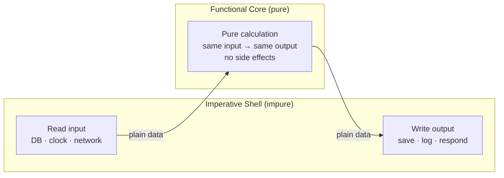

# Pure Functions — Junior Level

> **Level:** Junior — "What's the rule? Show me a clean example."
> You'll learn what makes a function *pure*, why purity buys you free testing and caching, and the one move that turns an impure function pure: **inject the effects**.

---

## Table of Contents

1. [What is a pure function?](#what-is-a-pure-function)
2. [Real-world analogy: the vending machine](#real-world-analogy-the-vending-machine)
3. [Rule 1 — Same input, same output](#rule-1--same-input-same-output)
4. [Rule 2 — No side effects](#rule-2--no-side-effects)
5. [Rule 3 — Referential transparency](#rule-3--referential-transparency)
6. [Rule 4 — Make dependencies explicit (inject `now`, `rand`, config)](#rule-4--make-dependencies-explicit-inject-now-rand-config)
7. [Rule 5 — Don't mutate your arguments](#rule-5--dont-mutate-your-arguments)
8. [The big move: functional core, imperative shell](#the-big-move-functional-core-imperative-shell)
9. [Why purity pays off: test, cache, parallelize](#why-purity-pays-off-test-cache-parallelize)
10. [A taste of Haskell: where purity is enforced](#a-taste-of-haskell-where-purity-is-enforced)
11. [Common Mistakes](#common-mistakes)
12. [Test Yourself](#test-yourself)
13. [Cheat Sheet](#cheat-sheet)
14. [Summary](#summary)
15. [Further Reading](#further-reading)
16. [Related Topics](#related-topics)

---

## What is a pure function?

A **pure function** obeys two rules:

1. **Same input → same output.** Call it with the same arguments and you always get the same result. It never depends on anything outside its parameters.
2. **No side effects.** It doesn't change anything outside itself — no writing to disk, no printing, no mutating a global, no touching the network, no modifying its arguments.

That's it. A pure function is a *calculation*: arguments in, value out, nothing else happens.

```python
# Pure: depends only on its argument, changes nothing.
def square(x):
    return x * x
```

Everything else — clocks, randomness, files, databases, the console — is a **side effect**. Side effects are not evil; a program that has *no* effects does nothing useful. The skill is **quarantine**: keep effects at the edges of your program and keep the middle pure.

> **Key idea:** You can't remove side effects, but you can *push them to the boundary*. The pure core is where the logic lives; the impure shell is a thin wrapper that feeds it data and writes out the result.

---

## Real-world analogy: the vending machine

Think of two machines.

**A pure calculator.** You press `7 × 8`. It returns `56`. Press it again — `56` again. It doesn't matter what time it is, what the weather is, or how many times you've pressed it. The output depends *only* on the buttons you pushed. Nothing about the machine changes. That's a pure function.

**A vending machine.** You insert a coin and press B4. A soda drops, your balance changes, the stock count drops by one, and a log entry is written. Press B4 again with no coin and you get *nothing* — same input, different output, because the machine has hidden *state* (your balance, the stock). That's an impure function.

The trick in good software: build the *decision* ("did the user pay enough for a B4 soda?") as a pure calculator, and let a thin impure layer ("drop the can, decrement stock, write the log") carry out the decision. Test the calculator a thousand ways in milliseconds; keep the messy machine part small.

---

## Rule 1 — Same input, same output

If calling a function twice with identical arguments can give different answers, it is **not** pure. The usual culprits are hidden inputs: the clock, a random source, a global variable, a database.

### Go

```go
// IMPURE: the output depends on time.Now(), a hidden input.
func IsExpired(token Token) bool {
    return token.ExpiresAt.Before(time.Now()) // hidden read of the clock
}

// PURE: the "now" is an explicit argument. Same (token, now) → same answer, always.
func IsExpired(token Token, now time.Time) bool {
    return token.ExpiresAt.Before(now)
}
```

### Java

```java
// IMPURE: reads the system clock.
boolean isExpired(Token token) {
    return token.expiresAt().isBefore(Instant.now());
}

// PURE: clock is passed in.
boolean isExpired(Token token, Instant now) {
    return token.expiresAt().isBefore(now);
}
```

### Python

```python
# IMPURE
def is_expired(token):
    return token.expires_at < datetime.now()

# PURE
def is_expired(token, now):
    return token.expires_at < now
```

Now the function is a true mapping: feed it `(token, now)` and you can *predict* the output without running it. The hidden clock became a visible parameter.

---

## Rule 2 — No side effects

A side effect is anything observable the function does *besides* returning a value: printing, logging, writing a file, sending a request, recording a metric, mutating a shared object.

### Go

```go
// IMPURE: it logs and writes to a global counter on the way out.
var processed int

func Discount(price float64) float64 {
    result := price * 0.9
    log.Printf("discounted %.2f -> %.2f", price, result) // side effect
    processed++                                          // side effect
    return result
}

// PURE: it just computes. The caller decides whether to log or count.
func Discount(price float64) float64 {
    return price * 0.9
}
```

### Java

```java
// IMPURE
double discount(double price) {
    double result = price * 0.9;
    logger.info("discounted {} -> {}", price, result); // side effect
    metrics.increment("discounts");                    // side effect
    return result;
}

// PURE
double discount(double price) {
    return price * 0.9;
}
```

### Python

```python
# IMPURE
def discount(price):
    result = price * 0.9
    print(f"discounted {price} -> {result}")  # side effect
    return result

# PURE
def discount(price):
    return price * 0.9
```

The logging didn't disappear — it moved to the caller, which already knows it's doing impure work. The *calculation* stays clean and testable.

---

## Rule 3 — Referential transparency

**Referential transparency** is the payoff of purity, stated as a rule you can check:

> A function call is referentially transparent if you can replace the call with its result without changing the program's behavior.

If `square(5)` is `25`, then everywhere you wrote `square(5)` you could paste `25` instead and nothing would break. That's only safe because `square` is pure.

```python
# Pure → referentially transparent.
total = square(5) + square(5)
# is identical to:
total = 25 + 25
# is identical to:
s = square(5)
total = s + s
```

Now contrast an impure call:

```python
# IMPURE: next_id() returns a different value each call.
a = next_id()  # 1
b = next_id()  # 2
# You CANNOT replace next_id() with "1" — the two calls differ.
```

Referential transparency is what lets you (and the compiler, and your cache) reason about code by **substitution**. Whenever you find yourself thinking "well, it depends on *when* you call it" — that function is not referentially transparent, and not pure.

---

## Rule 4 — Make dependencies explicit (inject `now`, `rand`, config)

Most impurity sneaks in through three doors: **the clock, randomness, and configuration/globals**. The fix is always the same — stop *reaching out* for the value, and *accept it as a parameter*. This is the single most useful purity technique for a junior to master.

### Time

```go
// IMPURE
func GreetingFor(name string) string {
    h := time.Now().Hour()
    if h < 12 {
        return "Good morning, " + name
    }
    return "Good evening, " + name
}

// PURE: caller passes the hour (or a clock value).
func GreetingFor(name string, hour int) string {
    if hour < 12 {
        return "Good morning, " + name
    }
    return "Good evening, " + name
}
```

### Randomness

```java
// IMPURE: pulls from a global random source.
String pickWinner(List<String> entrants) {
    int i = ThreadLocalRandom.current().nextInt(entrants.size());
    return entrants.get(i);
}

// PURE: the random index is an input. Deterministic and testable.
String pickWinner(List<String> entrants, int index) {
    return entrants.get(index);
}
// The impure shell calls: pickWinner(entrants, rng.nextInt(entrants.size()))
```

### Config / globals

```python
TAX_RATE = 0.08  # module-level global

# IMPURE: reads a mutable global. Change TAX_RATE elsewhere and this changes.
def total_with_tax(amount):
    return amount * (1 + TAX_RATE)

# PURE: the rate is a parameter. Self-contained and predictable.
def total_with_tax(amount, tax_rate):
    return amount * (1 + tax_rate)
```

> **Rule of thumb:** if a function *fetches* something it needs (the time, a random number, a config flag, a row from a DB) instead of *receiving* it, that fetch is a hidden input. Turn it into a parameter and the function becomes pure.

The principle behind this is **dependency injection** — see [`../../anti-patterns/README.md`](../../anti-patterns/README.md) for the impure habits this avoids.

---

## Rule 5 — Don't mutate your arguments

A function that *changes* the object you handed it has a side effect, even if it also returns a value. Returning a *new* value instead keeps it pure. This is purity's close cousin: see [`../14-immutability/README.md`](../14-immutability/README.md).

### Go

```go
// IMPURE: mutates the caller's slice in place.
func AddTax(prices []float64, rate float64) {
    for i := range prices {
        prices[i] *= 1 + rate // caller's data silently changes
    }
}

// PURE: returns a new slice; the input is untouched.
func WithTax(prices []float64, rate float64) []float64 {
    out := make([]float64, len(prices))
    for i, p := range prices {
        out[i] = p * (1 + rate)
    }
    return out
}
```

### Java

```java
// IMPURE: mutates the passed-in list.
void addTax(List<Double> prices, double rate) {
    for (int i = 0; i < prices.size(); i++) {
        prices.set(i, prices.get(i) * (1 + rate));
    }
}

// PURE: builds and returns a new list.
List<Double> withTax(List<Double> prices, double rate) {
    return prices.stream().map(p -> p * (1 + rate)).toList();
}
```

### Python

```python
# IMPURE: mutates the caller's list.
def add_tax(prices, rate):
    for i, p in enumerate(prices):
        prices[i] = p * (1 + rate)

# PURE: returns a new list, leaves the input alone.
def with_tax(prices, rate):
    return [p * (1 + rate) for p in prices]
```

Mutating arguments is sneaky because the function may *look* harmless at the call site. The caller hands over a list and gets back surprise damage. Returning a fresh value makes the data flow obvious.

---

## The big move: functional core, imperative shell

You can't write a useful program with only pure functions — somebody has to read the request, hit the database, and print the result. The architecture that makes purity practical is **functional core, imperative shell**:

- **Functional core** — all your decisions and calculations, written as pure functions. Big, well-tested, boring.
- **Imperative shell** — a thin outer layer that does I/O: reads inputs, calls the core, writes outputs. Small, hard to unit-test, but it has almost no logic to get wrong.



### Dirty → clean: pull the effects out

Here's an impure function that does everything. We'll inject its effects to split a pure core from an impure shell.

**Before — one tangled, impure function (Python):**

```python
def charge_customer(customer_id):
    customer = db.fetch(customer_id)          # I/O (impure)
    now = datetime.now()                       # clock (impure)
    if customer.last_charged.month == now.month:
        return                                 # already charged this month
    amount = customer.plan_price * (1 + 0.08)  # logic
    db.save_charge(customer_id, amount)        # I/O (impure)
    print(f"charged {customer_id}: {amount}")  # side effect
```

You cannot test the "already charged this month?" rule or the tax math without a database and a real clock. Everything is welded together.

**After — pure core, impure shell:**

```python
# PURE CORE: a calculation. No DB, no clock, no print. Trivially testable.
def compute_charge(customer, now, tax_rate):
    if customer.last_charged.month == now.month:
        return None  # nothing to charge
    return customer.plan_price * (1 + tax_rate)

# IMPURE SHELL: does I/O, then delegates the decision to the pure core.
def charge_customer(customer_id):
    customer = db.fetch(customer_id)
    amount = compute_charge(customer, datetime.now(), tax_rate=0.08)
    if amount is None:
        return
    db.save_charge(customer_id, amount)
    print(f"charged {customer_id}: {amount}")
```

Now `compute_charge` is pure: pass a customer, a `now`, and a rate, get a number or `None`. You can test "skip if same month," "applies 8% tax," "charges full price for a new customer" — all without touching a database. The shell shrank to plumbing.

---

## Why purity pays off: test, cache, parallelize

Purity isn't an aesthetic preference. It buys three concrete superpowers.

**1. Trivially testable.** No mocks, no setup, no clock-faking. Arguments in, assert the output:

```python
def test_applies_tax():
    customer = Customer(plan_price=100, last_charged=date(2026, 5, 1))
    now = datetime(2026, 6, 10)
    assert compute_charge(customer, now, tax_rate=0.08) == 108.0
```

That's the whole test. Compare to mocking a database and patching the clock. See [`../08-unit-tests/README.md`](../08-unit-tests/README.md).

**2. Cacheable (memoizable).** Same input always gives the same output, so you can store the result and skip recomputing. Python ships this as a one-line decorator — but **only pure functions may be memoized**:

```python
from functools import lru_cache

@lru_cache(maxsize=None)
def fib(n):              # pure → safe to cache
    return n if n < 2 else fib(n - 1) + fib(n - 2)
```

Memoize an *impure* function (one that reads the clock or a DB) and you'll serve stale answers forever — a classic, painful bug.

**3. Parallel-safe.** A pure function shares no mutable state, so two threads can run it at once with zero locks and zero race conditions. The Go example below sums squares across goroutines safely *because* `square` touches nothing shared:

```go
func square(x int) int { return x * x } // pure → safe to run anywhere
```

---

## A taste of Haskell: where purity is enforced

In Go, Java, and Python, purity is a *discipline* — the compiler won't stop you from sneaking in a `print`. In **Haskell**, purity is enforced by the type system. A function that performs I/O *must* say so in its type (`IO`), so impurity can't hide.

```haskell
-- Pure: the type says "Int to Int, nothing else." No I/O is even possible here.
square :: Int -> Int
square x = x * x

-- Impure: the IO in the type is a visible badge — this one touches the outside world.
getLineUpper :: IO String
getLineUpper = fmap (map toUpper) getLine
```

The lesson for the rest of us: Haskell makes the line between pure and impure *part of the type*. We don't have that safety net, so we draw the line ourselves — pure core, impure shell — and we mark our impure functions clearly.

---

## Common Mistakes

| # | Anti-pattern | Why it bites | Fix |
|---|---|---|---|
| 1 | **Hidden side effects** — logging, metrics, or a cache write tucked inside a "pure" calculation | The function *looks* pure, so a teammate caches it or parallelizes it — and the hidden effect fires too often or races | Return the value only; let the caller log/measure |
| 2 | **Reading mutable globals / singletons** | Output depends on global state, so the same arguments can give different answers; tests interfere with each other | Pass the value in as a parameter |
| 3 | **Clock / random / network inside a "pure" function** | `time.Now()`, `rand`, or an HTTP call makes the function non-deterministic and untestable | Inject `now`, the random value, or the fetched data as arguments |
| 4 | **Mutating an argument while claiming purity** | The caller's data changes behind their back; aliasing bugs appear far away | Build and return a *new* value; leave inputs untouched |
| 5 | **Memoizing a function that isn't actually pure** | Caches a value that should have changed (stale price, expired token) — and the bug is invisible until production | Only memoize functions proven pure; make impure ones obvious |
| 6 | **"It's pure, it just prints once"** | "Just one effect" is still an effect; it breaks substitution and parallel safety | If it does anything besides return a value, it's impure — name it so |

> The thread connecting all six: **a function that lies about being pure is more dangerous than an honestly impure one**, because people optimize, cache, and parallelize based on the lie.

---

## Test Yourself

**1. Is this function pure? Why or why not?**

```python
def discounted(price):
    return round(price * 0.9, 2)
```

<details><summary>Answer</summary>

Yes, it's pure. Its output depends only on `price`, and it has no side effects (no printing, no mutation, no global reads). Call it twice with `100` and you always get `90.0`. `round` is itself pure.
</details>

**2. Why is this function *not* pure, and how would you fix it?**

```go
func DaysUntilExpiry(t Token) int {
    return int(t.ExpiresAt.Sub(time.Now()).Hours() / 24)
}
```

<details><summary>Answer</summary>

It reads `time.Now()` — a hidden input. Same `Token` gives a different answer tomorrow, so it's not referentially transparent and is hard to test. Fix by injecting the clock:

```go
func DaysUntilExpiry(t Token, now time.Time) int {
    return int(t.ExpiresAt.Sub(now).Hours() / 24)
}
```

Now a test can pass a fixed `now` and assert an exact result.
</details>

**3. What does "referential transparency" mean, in one sentence?**

<details><summary>Answer</summary>

You can replace a function call with its result anywhere in the program without changing behavior. It holds only for pure functions — if `f(3)` always equals `9`, you can substitute `9` for `f(3)` everywhere safely.
</details>

**4. Spot the bug:**

```python
from functools import lru_cache

@lru_cache(maxsize=None)
def current_price(symbol):
    return fetch_quote_from_api(symbol)  # live network call
```

<details><summary>Answer</summary>

`current_price` is **not pure** — it makes a network call whose result changes minute to minute. Memoizing it freezes the first quote forever, so every later call returns a stale price. Only pure functions are safe to `lru_cache`. Fix: don't cache this, or cache with a short TTL via a real cache, and keep the *pure* parts (formatting, threshold checks) separate.
</details>

**5. This function returns a value *and* changes the input. Make it pure.**

```java
double normalize(List<Double> xs) {
    double max = Collections.max(xs);
    for (int i = 0; i < xs.size(); i++) {
        xs.set(i, xs.get(i) / max); // mutates the caller's list
    }
    return max;
}
```

<details><summary>Answer</summary>

It mutates `xs`, so it has a side effect. Return a *new* list instead and leave the input alone:

```java
record Normalized(double max, List<Double> values) {}

Normalized normalize(List<Double> xs) {
    double max = Collections.max(xs);
    List<Double> out = xs.stream().map(x -> x / max).toList();
    return new Normalized(max, out);
}
```

Now the caller's list is untouched and the function is pure.
</details>

**6. Sort these into "functional core" (pure) vs "imperative shell" (impure): `validateOrder`, `saveToDatabase`, `calculateTax`, `sendEmail`, `applyDiscountRules`, `readConfigFile`.**

<details><summary>Answer</summary>

- **Functional core (pure):** `validateOrder`, `calculateTax`, `applyDiscountRules` — decisions and calculations over their inputs.
- **Imperative shell (impure):** `saveToDatabase`, `sendEmail`, `readConfigFile` — all perform I/O.

The shell reads config and the order, calls the pure core to decide what to do, then saves and emails the result.
</details>

---

## Cheat Sheet

```text
PURE FUNCTION = same input → same output  +  no side effects

A function is IMPURE if it:
  • reads the clock, randomness, env vars, or globals   → inject them as params
  • does I/O: print, log, file, network, DB, metrics     → move to the shell
  • mutates its arguments                                → return a new value

REFERENTIAL TRANSPARENCY:
  f(x) is pure  ⟺  you can replace f(x) with its result anywhere, safely.

THE MOVE (impure → pure):
  Don't FETCH what you need — RECEIVE it.
  time.Now()  → now  param
  rand()      → value param
  CONFIG      → config param
  db.fetch()  → pass the fetched data in

ARCHITECTURE:
  Functional core (pure, big, tested) + Imperative shell (impure, thin, plumbing)

PURITY BUYS YOU:
  ✓ trivial tests (no mocks)   ✓ safe caching/memoization   ✓ lock-free parallelism

WARNING:
  Only memoize PURE functions. Caching an impure one serves stale lies.
```

---

## Summary

- A **pure function** gives the *same output for the same input* and has *no side effects*. It's a calculation, not an action.
- **Referential transparency** is the test: if you can swap a call for its result without changing the program, the call is pure.
- Impurity sneaks in through **the clock, randomness, globals, I/O, and argument mutation**. The cure is the same every time: **make the dependency explicit** — receive it as a parameter instead of reaching for it.
- Don't mutate arguments; return new values. (See [`../14-immutability/README.md`](../14-immutability/README.md).)
- Structure programs as a **functional core** (pure logic) wrapped in a thin **imperative shell** (I/O). Test the core exhaustively; keep the shell tiny.
- Purity pays off concretely: **easy tests, safe caching, safe parallelism**. But these benefits only hold if the function is *truly* pure — a function that *lies* about being pure is the most dangerous kind.
- **Haskell** enforces this line in the type system (`IO`); in Go, Java, and Python it's a discipline you maintain by hand.

---

## Further Reading

- *Clean Code* (Robert C. Martin), Ch. 3 "Functions" — the case for small, single-purpose, side-effect-free functions.
- *Functional Programming in Scala* (Chiusano & Bjarnason), Ch. 1 — referential transparency and the substitution model, explained precisely.
- Gary Bernhardt, *"Boundaries"* (talk) — the original "functional core, imperative shell" framing.
- Martin Fowler, *"What is Refactoring"* and the "Separate Query from Modifier" refactoring — splitting functions that both compute and mutate.

---

## Related Topics

- [`middle.md`](middle.md) — purity in real systems: I/O monads vs. effect injection, testing strategies, and where the boundary really goes.
- [`senior.md`](senior.md) — designing whole subsystems around a pure core, effect tracking, and performance trade-offs of immutability.
- [`../README.md`](../README.md) — this chapter's overview and the anti-patterns to avoid.
- [`../02-functions/README.md`](../02-functions/README.md) — small, single-responsibility functions; the foundation purity builds on.
- [`../14-immutability/README.md`](../14-immutability/README.md) — not mutating data is half of what makes a function pure.
- [`../08-unit-tests/README.md`](../08-unit-tests/README.md) — why pure functions are the easiest code in the world to test.
- [`../../functional-programming/README.md`](../../functional-programming/README.md) — purity as the cornerstone of the functional paradigm.
- [`../../anti-patterns/README.md`](../../anti-patterns/README.md) — the impure habits (hidden state, globals) that purity replaces.
- [`../../refactoring/README.md`](../../refactoring/README.md) — mechanical steps to extract a pure core from tangled code.
