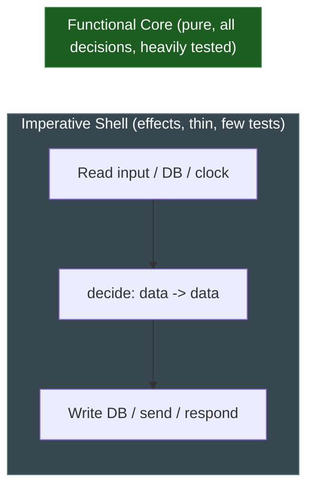

# Pure Functions — Middle Level

> Focus: "Why?" and "When does it bend?" — the architecture that makes purity practical, what actually counts as a side effect, and where you are forced to draw the boundary.

---

## Table of Contents

1. [Why purity pays off](#why-purity-pays-off)
2. [What actually counts as a side effect](#what-actually-counts-as-a-side-effect)
3. [Functional core, imperative shell](#functional-core-imperative-shell)
4. [Injecting effects: clock, RNG, repository](#injecting-effects-clock-rng-repository)
5. [Idempotence is not purity](#idempotence-is-not-purity)
6. [Memoization requires real purity](#memoization-requires-real-purity)
7. [Equational reasoning and substitution](#equational-reasoning-and-substitution)
8. [Where to draw the purity boundary](#where-to-draw-the-purity-boundary)
9. [Purity across languages](#purity-across-languages)
10. [Common Mistakes](#common-mistakes)
11. [Test Yourself](#test-yourself)
12. [Cheat Sheet](#cheat-sheet)
13. [Summary](#summary)
14. [Further Reading](#further-reading)
15. [Related Topics](#related-topics)

---

## Why purity pays off

A pure function has two properties: its result depends only on its arguments, and it produces no observable effect beyond returning that result. Everything else in this chapter follows from those two clauses.

The reason engineers chase purity is not ideological. It is that pure functions are the only functions you can fully understand by reading their signature and body, with no knowledge of *when* they run, *how many times*, *in what order*, or *what else has happened*. That property buys you concrete, daily wins:

- **Testing needs no setup.** No database, no mock clock, no network stub. You pass inputs, assert on outputs. The test is the specification.
- **Concurrency is free.** A pure function has no shared mutable state to race over. You can call it from a thousand goroutines or threads and never reach for a lock.
- **Caching becomes legal.** Same input, same output, forever — so you can memoize, deduplicate, or replay without changing behavior.
- **Reasoning is local.** You never have to ask "what is the state of the world right now?" The world does not enter the function.

> **The core trade-off this whole chapter circles around:** a program that does nothing observable is useless. Purity is therefore never the goal for the *whole* program — it is the goal for the *decision-making part* of the program, with effects pushed to a thin, well-marked edge.

---

## What actually counts as a side effect

Junior-level material says "no side effects." The middle-level question is *which* effects, and the answer is more subtle than "don't write to a file." A side effect is anything that makes the function's output depend on something other than its arguments, **or** anything observable the function does besides return a value.

| Operation | Side effect? | Why |
|---|---|---|
| Mutating an argument | **Yes** | Caller observes the change; output is not the only result. |
| Mutating a local variable, returning a fresh value | No | The mutation is invisible outside the function. |
| Reading a global / singleton | **Yes** | Output now depends on hidden state. |
| Reading a `const`/`final` value defined at module load | No | It is effectively a constant; same every call. |
| I/O: disk, network, stdout | **Yes** | Observable, and often makes output depend on the world. |
| Reading the system clock | **Yes** | `now()` returns a different value each call — output depends on time. |
| Random number generation | **Yes** | Same inputs, different outputs. The defining purity violation. |
| Throwing an exception | **Partial / debated** | A thrown exception is a second exit path. For a *total* function (one that returns for every input) there is no issue; a function that throws on some inputs is still referentially transparent if the throw is deterministic for that input. |
| Logging | **Yes, technically — but special** | It is observable I/O. In practice teams treat *non-functional* logging as a tolerated effect (see boundary section). |

Two of these deserve emphasis because they fool people:

**Time and randomness are inputs in disguise.** `calculatePrice(cart)` looks pure. `calculatePrice(cart)` that internally calls `now()` to check whether a promotion is active is **not** pure — its hidden dependency on the clock means the same cart yields different prices on different days. The fix is to make the hidden input explicit: `calculatePrice(cart, asOf)`.

**Logging is the honest gray area.** A `log.info(...)` call is, strictly, observable I/O. But it carries no business meaning — removing every log line should not change any result the program computes. Most teams therefore accept logging inside otherwise-pure code as a *benign* effect, the way they accept that a function allocates memory. The discipline that matters: logging must never *influence* the return value, and it must never be the thing a test asserts on. If you find yourself testing "did it log X," the log has become a real effect and the function is no longer pure.

---

## Functional core, imperative shell

Gary Bernhardt's "Functional Core, Imperative Shell" is the architecture that makes purity usable in a real, effectful program. The idea:

- **The core** is pure. It holds all decision logic — calculations, validations, state transitions expressed as `oldState -> newState`. It takes data in, returns data out, touches nothing.
- **The shell** is imperative and thin. It does the I/O: read the request, load from the repository, call the pure core, write the result, return the response. It contains almost no branching of its own.

The slogan is **"isolate decisions from effects."** The shell gathers all the facts the core needs, hands them over as plain values, gets back a decision (also a plain value), and carries out whatever effects the decision implies.



A worked example — a withdrawal:

```python
# --- CORE: pure. No I/O, no clock, no globals. ---
from dataclasses import dataclass

@dataclass(frozen=True)
class Account:
    balance: int
    daily_withdrawn: int
    daily_limit: int

@dataclass(frozen=True)
class Withdrawal:
    new_balance: int
    new_daily_withdrawn: int

def decide_withdrawal(account: Account, amount: int) -> Withdrawal:
    if amount <= 0:
        raise ValueError("amount must be positive")          # deterministic: pure
    if amount > account.balance:
        raise InsufficientFunds(account.balance, amount)
    if account.daily_withdrawn + amount > account.daily_limit:
        raise DailyLimitExceeded()
    return Withdrawal(
        new_balance=account.balance - amount,
        new_daily_withdrawn=account.daily_withdrawn + amount,
    )

# --- SHELL: imperative. All the effects live here. ---
def withdraw_handler(account_id: str, amount: int, repo, clock) -> dict:
    account = repo.load(account_id)                          # effect: read
    if clock.is_new_day(account.last_reset):                 # effect: time
        account = account.reset_daily()
    result = decide_withdrawal(account, amount)              # pure call
    repo.save(account_id, result)                            # effect: write
    return {"balance": result.new_balance}
```

Notice the asymmetry: the core has every interesting branch and is trivial to test exhaustively; the shell is a straight line and barely needs unit tests (you cover it with a few integration tests). You have concentrated complexity where it is cheap to verify and pushed the hard-to-test parts into a place that contains no logic worth getting wrong.

---

## Injecting effects: clock, RNG, repository

The recurring tactic above is **dependency injection of effects**: anything non-deterministic or effectful is passed in, never reached for. This is how you keep a function *testable* even when it sits in the shell, and how you keep the core pure by handing it values instead of capabilities.

There are two levels of this, and choosing between them is a real design decision.

**Level 1 — Pass the resolved value (preferred for the core).** The cleanest move is to resolve the effect *before* the pure function and pass the result as a plain argument. The core never sees a clock; it sees a timestamp.

```go
// Impure: hidden dependency on the wall clock.
func IsExpired(token Token) bool {
    return token.ExpiresAt.Before(time.Now())   // not pure: depends on now()
}

// Pure: time is an explicit input. Trivially testable.
func IsExpired(token Token, now time.Time) bool {
    return token.ExpiresAt.Before(now)
}
```

**Level 2 — Inject the capability (for the shell).** When a function genuinely needs to *perform* effects repeatedly, inject an interface instead of calling the global. This is dependency injection in the OO sense: a `Clock`, a `RandomSource`, a `Repository`.

```java
interface Clock { Instant now(); }
interface RandomSource { long nextLong(); }

// Production wiring uses the real ones; tests pass deterministic fakes.
final class TokenService {
    private final Clock clock;
    private final RandomSource rng;

    TokenService(Clock clock, RandomSource rng) {
        this.clock = clock;
        this.rng = rng;
    }

    Token issue(UserId user) {
        long id = rng.nextLong();                  // effect, but injected
        Instant exp = clock.now().plus(TTL);       // effect, but injected
        return new Token(id, user, exp);           // the assembly is otherwise pure
    }
}
```

In a test you supply a `Clock` fixed at `2026-01-01T00:00:00Z` and a `RandomSource` that returns `42`. The method is now fully deterministic without `issue` itself being pure. The lesson: **injection does not make a function pure — it makes an impure function deterministic and testable**, which is the next best thing. Reserve true purity for the core; use injection to tame the shell.

The same pattern covers the repository. A pure core cannot call `repo.load()` (that is I/O). So the shell loads the data, passes the plain entity to the core, takes back the decision, and the shell persists it. The repository is injected into the shell, not the core.

---

## Idempotence is not purity

These two words get swapped constantly. They are different guarantees.

- **Purity:** no effects, output depends only on input. Calling it changes nothing.
- **Idempotence:** calling it *N* times has the same *effect on the world* as calling it once. It is about effects being safe to repeat — it says nothing about determinism or return values.

`HTTP PUT /users/5 {name: "Ana"}` is idempotent: send it once or five times, the user's name ends up "Ana." It is emphatically **not** pure — it writes to a database. `DELETE /users/5` is idempotent (after the first call the user is gone and further calls are no-ops) but performs a destructive effect.

Why the distinction matters in practice: idempotence is the property you design effectful shell operations *toward* (so retries are safe), while purity is the property you design the core *for* (so reasoning and caching are safe). A retrying message consumer wants idempotent handlers; a memoized pricing rule wants pure functions. Confusing them leads to either caching something that should not be cached, or assuming a retry is safe when the operation is not idempotent.

| | Pure | Idempotent |
|---|---|---|
| Has effects? | No | Usually yes |
| Output deterministic? | Yes | Not required |
| Safe to call zero times? | Yes (no effect lost) | Yes |
| Safe to call many times? | Yes (cacheable) | Yes (same world state) |
| Example | `tax(price, rate)` | `PUT /resource`, `set(key, value)` |

---

## Memoization requires real purity

Memoization — caching `f(x)` so the second call with the same `x` returns the stored result — is *only valid if `f` is genuinely pure*. This is the place where a "looks pure" function bites hardest, because the bug is silent and time-delayed.

Consider a function that fetches a config value and looks pure because it takes a key and returns a value:

```python
@functools.cache               # memoizes on the argument `key`
def get_feature_flag(key: str) -> bool:
    return _flags_table.lookup(key)     # reads MUTABLE external state!
```

The first call caches the answer. When ops flip the flag in the database, `get_feature_flag` keeps returning the stale cached value forever. The decorator did exactly what it promises; the function lied about being pure. The dependency on mutable external state means same-input-different-output is possible, which is the precise condition memoization is not allowed to assume.

The rule is symmetric and worth memorizing: **if you want to memoize a function, you must first prove it is pure; if a function is impure, memoizing it is a correctness bug, not an optimization.** This is one of the strongest practical reasons to keep your expensive logic in the pure core — only there is caching unconditionally safe.

(Note: memoization itself is implemented with a mutable cache, so the *memoized wrapper* is impure even though it preserves the *observable* result of a pure function. The purity contract holds at the boundary: callers cannot tell the cache exists.)

---

## Equational reasoning and substitution

Pure functions give you **referential transparency**: any call `f(x)` can be replaced by its result, and vice versa, without changing the program's meaning. This is not academic. It is the property your brain, your compiler, and your refactoring tools all rely on.

```python
# If `discount` is pure, these three are interchangeable:
total = price - discount(price) - discount(price)   # called twice
# ==>
d = discount(price)
total = price - d - d                                # called once, substituted
# ==>
total = price - 2 * discount(price)                  # algebra on the result
```

Every one of those rewrites is a refactoring you do without fear, *because* `discount` is pure. The moment `discount` reads a clock or mutates a counter, none of these rewrites are safe — calling it twice differs from calling it once, and the compiler can no longer hoist, cache, reorder, or eliminate the call.

This is why pure code is the substrate for nearly every automatic optimization: common-subexpression elimination, loop-invariant hoisting, parallel `map`, lazy evaluation. The compiler is doing equational reasoning on your behalf, and it can only do it where purity guarantees the equations hold. When you make a function pure, you are not just helping the next human reader — you are unlocking the machine's ability to transform your code safely.

---

## Where to draw the purity boundary

The hard engineering question is never "should this function be pure?" — it is "where is the line between the pure core and the effectful shell, and how thick is the shell?" Some guidance:

1. **Push effects outward, pull decisions inward.** When you discover an effect buried in core logic (a `now()`, a DB read, a log line that drives a branch), the refactor is almost always "lift it to the caller." The caller resolves the effect and passes a value down.

2. **The shell should branch as little as possible.** If your shell is full of `if`/`else`, the decisions have leaked out of the core. Move them back. The ideal shell reads like a recipe: load, decide, save, respond.

3. **Don't purify across an API you don't own.** If a function's whole job is to wrap a third-party SDK call, making it "pure" is impossible and pretending otherwise is worse. Mark it as part of the shell and inject it.

4. **A small amount of pragmatic impurity is fine — name it.** Logging, metrics, and tracing are tolerated effects in otherwise-pure code *as long as they never affect the return value and tests never assert on them*. Be honest in the function's documentation: "pure except for logging."

5. **The boundary moves with the cost of testing.** The whole point is testability and reasoning. If a chunk of logic is painful to test because of an effect, that is the signal to push the effect outward and grow the pure core. If purifying something costs more than it saves (a one-line wrapper over a network call), leave it in the shell.

> **Honest distinction:** "make everything pure" is as wrong as "purity doesn't matter." The right framing: maximize the fraction of your logic that is pure, keep the impure part thin and obvious, and inject every effect you cannot eliminate.

---

## Purity across languages

### Java

No compiler enforcement. `final` fields and immutable records (`record Money(long cents, Currency ccy) {}`) keep arguments unmutated. `java.time.Clock` is a standard injectable clock — use it instead of `Instant.now()`. The repository/clock injection pattern is idiomatic Spring. Streams encourage pure lambdas, but the language lets you write a side-effecting `map`, so discipline is on you.

### Python

No enforcement either, and the dynamic, mutable-by-default culture makes accidental impurity easy. `@dataclass(frozen=True)` gives immutable inputs. `functools.cache`/`lru_cache` are the memoization tools — and the loaded gun from the section above; only decorate provably pure functions. Inject `datetime`-providing callables and `random.Random` instances rather than calling module-level `datetime.now()` / `random.random()`. The `freezegun` library exists precisely because so much code reaches for the global clock.

### Go

No purity in the type system, but Go's culture of explicit dependencies fits the pattern well. Pass `time.Time` as an argument, or inject a `func() time.Time` (commonly a `Clock` interface) — never sprinkle `time.Now()` through logic. Value semantics (structs copied by default) mean a function that takes a struct *by value* cannot mutate the caller's copy, which makes accidental argument mutation harder than in Java/Python — though slices and maps are reference-like and remain mutable through a copy, a classic trap. Inject `*rand.Rand` rather than calling the package-level `rand`.

---

## Common Mistakes

1. **Treating "no `return` of state" as proof of purity.** A function can return cleanly and still be impure — it mutated an argument, wrote a log line that a test depends on, or read a global. Purity is about *dependencies and effects*, not about whether you assigned the result.

2. **Hiding the clock or RNG inside "calculation" code.** `priceFor(item)` that internally checks `now()` for a sale window is the single most common fake-pure function. Make time and randomness explicit inputs.

3. **Memoizing an impure function.** Caching a function that reads mutable state produces stale results that no test catches until production. Prove purity first.

4. **Mutating a passed-in slice/map/list and calling it pure.** In Go a slice, in Python a list/dict, in Java a passed collection — all are shared references. Mutating them is a side effect the caller observes. Return a new value instead.

5. **Confusing idempotence with purity.** Designing a `PUT` handler and calling it "pure" because it is safe to retry. It writes to the world; it is idempotent, not pure.

6. **Letting the shell grow logic.** When `if`s migrate from core to shell, you lose the testability you bought. The shell should be boring.

7. **Purity zealotry.** Wrapping `log.info` in elaborate effect-tracking machinery in a plain CRUD service. The cost exceeds the benefit. Tolerate benign logging; spend the discipline on the decision logic.

---

## Test Yourself

1. **Is a function that takes a `userId` and returns the user's name from a database pure? Why does it matter for caching?**

<details><summary>Answer</summary>

No. It reads mutable external state (the database), so the same `userId` can yield different names over time (the user renames). It matters for caching because memoizing it would return the stale name after a rename. To make the *logic* around it cacheable, the shell should load the user and pass the plain value into a pure core function.

</details>

2. **`generateToken()` calls `now()` and `random()` internally. List two ways to make it deterministic for tests, and say which (if either) makes it pure.**

<details><summary>Answer</summary>

(a) Pass the timestamp and a random seed/value as arguments — this makes the function *pure*. (b) Inject a `Clock` and a `RandomSource` interface and call them — this makes the function *deterministic and testable* but still impure (it invokes injected effects). Use (a) for the pure core; use (b) for the shell when the effect must actually be performed.

</details>

3. **Is `PUT /accounts/5 {balance: 100}` pure? Is it idempotent? Are these the same question?**

<details><summary>Answer</summary>

Not pure — it writes to persistent state. Idempotent — sending it repeatedly leaves the balance at 100, the same as sending it once. They are different questions: purity is about effects + determinism; idempotence is about whether repeating the effect changes the world beyond the first call.

</details>

4. **A teammate says "this function is pure" but it contains `logger.debug("computing %s", x)`. Are they wrong?**

<details><summary>Answer</summary>

Strictly, yes — logging is observable I/O. Pragmatically, most teams accept logging as a benign effect *provided* it never influences the return value and no test asserts on it. The honest description is "pure except for logging." It becomes a real problem only if the log line is load-bearing — e.g., a test checks it, or the return value depends on whether logging succeeded.

</details>

5. **Why does referential transparency let a compiler parallelize `map(f, items)` but not `map(g, items)` where `g` increments a global counter?**

<details><summary>Answer</summary>

If `f` is pure, each `f(item)` is independent — order and concurrency cannot change any result, so the calls can run on different cores. `g` mutates shared global state, so running the calls concurrently introduces a data race and running them in a different order changes the counter's final value. The shared effect destroys the independence that parallelism relies on.

</details>

6. **You have an expensive, frequently-called function in your imperative shell that reads from a cache, the clock, and a config service. A colleague wants to memoize it. What do you tell them, and what do you do instead?**

<details><summary>Answer</summary>

Don't memoize it — it depends on mutable external state, so cached results will go stale. Instead, refactor: have the shell resolve the cache value, the timestamp, and the config into plain arguments, and move the expensive computation into a pure core function. *That* function can be safely memoized on its arguments, and the shell stays a thin, un-cached coordinator.

</details>

---

## Cheat Sheet

| Concept | One-line rule |
|---|---|
| Pure function | Output depends only on inputs; no observable effects. |
| Side effect | Mutating args/globals, I/O, clock, RNG, throwing on some inputs, logging. |
| Functional core | Pure decision logic; data in, data out; heavily tested. |
| Imperative shell | Thin, effectful edge; loads, calls core, persists; few branches. |
| Resolve-then-pass | Compute time/random/IO *before* the core, pass as plain values. |
| Inject the effect | For the shell: pass `Clock`/`RandomSource`/`Repository` interfaces. |
| Idempotence ≠ purity | Idempotent = safe to repeat the effect; pure = no effect at all. |
| Memoization rule | Only memoize provably pure functions; else stale-result bug. |
| Referential transparency | `f(x)` ⇄ its result; enables substitution, hoisting, caching, parallelism. |
| Boundary heuristic | Push effects out, pull decisions in; grow the core, shrink the shell. |
| Benign logging | Tolerated if it never affects output and no test asserts on it. |

---

## Summary

Purity is a means, not an end. The valuable property is that pure functions can be understood, tested, cached, and parallelized in complete isolation from the rest of the program — and that property survives only as long as the function depends on nothing but its arguments and does nothing but return a value. Because a useful program *must* perform I/O somewhere, the practical architecture is **functional core, imperative shell**: concentrate all decision logic in a pure core, and push every effect — mutation, I/O, time, randomness — to a thin imperative edge, either by resolving the effect and passing the value inward or by injecting the capability into the shell. Keep purity and idempotence distinct (one forbids effects, the other makes them safe to repeat), and never memoize a function you have not proven pure. The middle-level skill is knowing exactly where that core/shell boundary belongs and keeping the shell honest and thin.

---

## Further Reading

- Gary Bernhardt, *Boundaries* (talk) and *Functional Core, Imperative Shell* — the source of the architecture in this chapter.
- Michael Feathers, *Working Effectively with Legacy Code* — characterization tests and seams for isolating effects in existing code.
- *Out of the Tar Pit* (Moseley & Marks) — why incidental state and effects drive complexity, and the case for shrinking them.
- Scott Wlaschin, *Domain Modeling Made Functional* — making effects explicit and pushing them to the edges in a typed language.

---

## Related Topics

- [`junior.md`](junior.md) — what a pure function is and how to spot a side effect.
- [`senior.md`](senior.md) — effect systems, monadic IO, architectural enforcement at scale.
- [`../README.md`](../README.md) — the Pure Functions chapter overview.
- [`../14-immutability/README.md`](../14-immutability/README.md) — immutable data is the precondition that keeps arguments un-mutated.
- [`../08-unit-tests/README.md`](../08-unit-tests/README.md) — why pure functions are the easiest things in a codebase to test.
- [`../../functional-programming/README.md`](../../functional-programming/README.md) — purity, referential transparency, and effects as first-class FP concepts.
- [`../../refactoring/README.md`](../../refactoring/README.md) — mechanical refactorings for extracting effects and growing a pure core.
