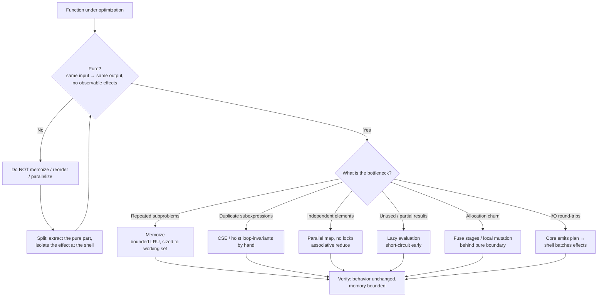

# Pure Functions — Optimize & Reconcile

> Purity is usually framed as a correctness and testability property. It is also a *performance* property. A pure function — same inputs produce the same output, no observable side effects — is precisely the contract that lets a compiler, a cache, or a thread pool reorder, skip, share, or duplicate work without changing the result. This file works both directions: where purity *costs* (extra allocations, indirection through a functional core, injected clocks), and where purity *buys* you speed for free (memoization, common-subexpression elimination, lock-free parallelism, lazy evaluation). Each scenario gives a concrete setup, a measurement or a reasoned estimate with real numbers, and a principled resolution that keeps the function pure without paying a tax you don't need to.

---

## Table of Contents

1. [Scenario 1 — Memoization is only safe on pure functions (Fibonacci)](#scenario-1)
2. [Scenario 2 — Bounded-size memo cache and the eviction trap](#scenario-2)
3. [Scenario 3 — Common-subexpression elimination the compiler does for you](#scenario-3)
4. [Scenario 4 — Parallel map for free: no locks because no shared mutation](#scenario-4)
5. [Scenario 5 — The immutable-intermediate allocation tax](#scenario-5)
6. [Scenario 6 — Local mutation behind a pure boundary](#scenario-6)
7. [Scenario 7 — Functional-core / imperative-shell indirection cost](#scenario-7)
8. [Scenario 8 — Lazy evaluation needs purity to be safe](#scenario-8)
9. [Scenario 9 — Injecting the clock/RNG: overhead vs. testability](#scenario-9)
10. [Scenario 10 — Batching effects at the shell to amortize I/O](#scenario-10)
11. [Scenario 11 — Memoizing an impure function silently caches stale data](#scenario-11)
12. [Scenario 12 — Idempotent vs. pure: when caching is still wrong](#scenario-12)
13. [Scenario 13 — Loop-invariant pure calls hoisted by hand](#scenario-13)
- [Rules of Thumb](#rules-of-thumb)
- [Related Topics](#related-topics)

---

<a name="scenario-1"></a>
### Scenario 1 — Memoization is only safe on pure functions (Fibonacci)

**Scenario.** Naïve recursive Fibonacci recomputes the same subproblems exponentially. The function is pure (`fib(n)` depends only on `n`), which is exactly why memoization is sound: caching `fib(n)` by `n` can never return a wrong answer.

```python
def fib(n: int) -> int:
    if n < 2:
        return n
    return fib(n - 1) + fib(n - 2)
```

**Measurement.** `fib(n)` makes `2*fib(n) - 1` calls. The call count *is* the Fibonacci number, so it grows as φ^n (φ ≈ 1.618):

| n  | calls (naïve)        | calls (memoized) |
|----|----------------------|------------------|
| 10 | 177                  | 19               |
| 30 | 2,692,537            | 59               |
| 40 | 331,160,281          | 79               |
| 50 | ~40.7 billion        | 99               |

At `n=40` the naïve version takes ~30–60 s in CPython; memoized returns in microseconds. The speedup is not constant-factor — it is exponential → linear, the single largest category of algorithmic win in this file.

<details><summary>Resolution</summary>

Memoize, and lean on the fact that purity guarantees the cache key (`n`) fully determines the value.

```python
from functools import lru_cache

@lru_cache(maxsize=None)
def fib(n: int) -> int:
    if n < 2:
        return n
    return fib(n - 1) + fib(n - 2)
```

```go
func memoFib() func(int) int {
    cache := map[int]int{0: 0, 1: 1}
    var fib func(int) int
    fib = func(n int) int {
        if v, ok := cache[n]; ok {
            return v
        }
        v := fib(n-1) + fib(n-2)
        cache[n] = v
        return v
    }
    return fib
}
```

```java
class Fib {
    private final Map<Integer, Long> cache = new HashMap<>();
    long fib(int n) {
        if (n < 2) return n;
        return cache.computeIfAbsent(n, k -> fib(k - 1) + fib(k - 2));
    }
}
```

The principle: **memoization is a behavior-preserving transformation if and only if the function is referentially transparent.** If `fib` read a global counter or logged a line per call, the cache would silently drop those effects on the second call — the optimization would change observable behavior. Purity is the precondition that makes the optimization free of correctness risk.

</details>

---

<a name="scenario-2"></a>
### Scenario 2 — Bounded-size memo cache and the eviction trap

**Scenario.** You memoize a pure but high-cardinality function — e.g. `renderThumbnail(imageHash, width, height)`. `maxsize=None` (unbounded) means the cache grows without limit. With 5M distinct keys at ~2 KB each, that's ~10 GB resident — an OOM, not a speedup.

**Measurement.** Hit rate determines value. If 95% of requests hit a hot set of 10k keys, a 10k-entry LRU captures nearly all the benefit at ~20 MB. Going from 10k → 5M entries buys the last ~5% of hits for 500× the memory. The marginal return collapses.

<details><summary>Resolution</summary>

Bound the cache and accept that purity still holds — eviction never returns a *wrong* answer, only a recomputed one.

```python
from functools import lru_cache

@lru_cache(maxsize=10_000)        # LRU eviction; pure → recompute is always correct
def render_thumbnail(image_hash: str, width: int, height: int) -> bytes:
    ...
```

```java
// Guava: size-bounded, eviction safe because the function is pure
LoadingCache<Key, byte[]> cache = CacheBuilder.newBuilder()
    .maximumSize(10_000)
    .build(CacheLoader.from(Renderer::render));
```

The key insight tying back to purity: **for a pure function, the cache is a pure performance knob.** You can flush it, shrink it, or warm it across machines and never affect correctness — only latency. An impure function's "cache" is part of its semantics and cannot be safely evicted. Size the cache to the working set (measure hit rate), not the key space.

</details>

---

<a name="scenario-3"></a>
### Scenario 3 — Common-subexpression elimination the compiler does for you

**Scenario.** Code computes the same pure expression twice in one block:

```c
y1 = a * Math.sin(theta) + b;
y2 = c * Math.sin(theta) + d;   // sin(theta) recomputed
```

`Math.sin` is pure (no JLS side effect; deterministic for a given input). A compiler is *allowed* to compute `sin(theta)` once and reuse it — **common-subexpression elimination (CSE)** — only because it can prove the call has no side effects and returns the same value both times.

**Measurement.** A `sin` is ~20–40 ns; calling it twice in a loop body that runs 10^8 times wastes ~2–4 seconds of pointless work. With CSE the JIT folds it to one call.

<details><summary>Resolution</summary>

For functions the runtime *knows* are pure (intrinsics like `Math.sin`, `Math.sqrt`), CSE happens automatically. For *your own* pure functions the compiler usually cannot prove purity across a call boundary, so help it: hoist the subexpression yourself.

```java
double s = Math.sin(theta);     // explicit CSE; also documents intent
double y1 = a * s + b;
double y2 = c * s + d;
```

```python
s = math.sin(theta)
y1 = a * s + b
y2 = c * s + d
```

```go
s := math.Sin(theta)
y1 := a*s + b
y2 := c*s + d
```

The reconciliation: **purity is what authorizes CSE — manual or compiler-driven.** If `compute(theta)` mutated a field or appended to a log, eliminating the second call would drop an effect and be illegal. Keeping helpers pure is what lets you (and the optimizer) deduplicate them without thinking. Conversely, if you annotate a method `@Contract(pure = true)` (or mark it `const`/`pure` in languages that support it), you give the optimizer the proof it needs.

</details>

---

<a name="scenario-4"></a>
### Scenario 4 — Parallel map for free: no locks because no shared mutation

**Scenario.** You transform 10M records with a pure function `score(record) -> float`. Because `score` reads only its argument and writes nothing shared, the mapping has **no data dependencies between elements** — it parallelizes with zero synchronization.

**Measurement.** On an 8-core machine, an embarrassingly parallel pure map approaches an 8× wall-clock speedup (minus scheduling overhead, typically 6–7× real). The same loop with a shared mutable accumulator behind a lock serializes on that lock — contention can make 8 threads *slower* than 1 due to cache-line ping-pong on the mutex.

<details><summary>Resolution</summary>

Map a pure function in parallel; reduce with an associative combine. No locks, because nothing is shared-mutable.

```java
double[] scores = records.parallelStream()   // pure score → safe to fan out
                         .mapToDouble(Scorer::score)
                         .toArray();
double total = Arrays.stream(scores).sum();   // associative reduce
```

```go
func parScore(records []Record) []float64 {
    out := make([]float64, len(records)) // each goroutine writes a disjoint index
    var wg sync.WaitGroup
    chunk := (len(records) + runtime.NumCPU() - 1) / runtime.NumCPU()
    for start := 0; start < len(records); start += chunk {
        end := min(start+chunk, len(records))
        wg.Add(1)
        go func(s, e int) {
            defer wg.Done()
            for i := s; i < e; i++ {
                out[i] = score(records[i]) // pure; no shared write
            }
        }(start, end)
    }
    wg.Wait()
    return out
}
```

```python
from concurrent.futures import ProcessPoolExecutor
with ProcessPoolExecutor() as ex:
    scores = list(ex.map(score, records))  # processes sidestep the GIL for CPU-bound pure work
```

The principle: **purity removes the shared-state hazard that forces locking.** Locks exist to serialize access to mutable shared state; a pure function has none, so the parallelism is *correct by construction*. Note the Go version writes to disjoint indices of a preallocated slice — that is still "no shared mutation" because no two goroutines touch the same memory. The moment `score` writes a shared counter, you are back to locks and the free speedup evaporates.

</details>

---

<a name="scenario-5"></a>
### Scenario 5 — The immutable-intermediate allocation tax

**Scenario.** A pure pipeline over a 1M-element list, each stage returning a fresh immutable collection:

```python
result = (
    [x * 2 for x in data]          # alloc list #1 (1M)
    )
result = [x + 1 for x in result]   # alloc list #2 (1M)
result = [x for x in result if x % 3 == 0]  # alloc list #3
```

Each stage is pure, but each materializes a full intermediate collection. Three passes, three 1M-element allocations, plus GC pressure.

**Measurement.** For 1M ints in CPython, each intermediate list is ~8 MB of pointers plus boxed ints. Three intermediates ≈ 24 MB of churn and ~3 full traversals (3M element visits) before the first useful result. Fusing to one pass cuts allocation to near zero and traversals to 1M.

<details><summary>Resolution</summary>

Keep the *boundary* pure, but fuse the stages so no intermediate is materialized. Generators/lazy streams do this without giving up purity.

```python
def pipeline(data):
    return [x * 2 + 1 for x in data if (x * 2 + 1) % 3 == 0]
# or lazily, allocation-free until consumed:
def pipeline_lazy(data):
    return (y for x in data if (y := x * 2 + 1) % 3 == 0)
```

```java
// Stream fusion: filter+map are lazy; only ONE pass, no intermediate list
int[] result = IntStream.of(data)
    .map(x -> x * 2 + 1)
    .filter(x -> x % 3 == 0)
    .toArray();
```

```go
// Manual fusion — one pass, one preallocated output
func pipeline(data []int) []int {
    out := make([]int, 0, len(data)/3) // estimate survivors
    for _, x := range data {
        y := x*2 + 1
        if y%3 == 0 {
            out = append(out, y)
        }
    }
    return out
}
```

The reconciliation: the *cost* of purity here is not purity itself — it is **eager materialization** of immutable intermediates. The fix is stream fusion (lazy stages) or hand-fusing the loop, neither of which reintroduces a side effect. The function stays pure: same input → same output, no external state touched. You traded N allocations for 1, not purity for speed.

</details>

---

<a name="scenario-6"></a>
### Scenario 6 — Local mutation behind a pure boundary

**Scenario.** A "purely functional" sum that rebuilds an immutable accumulator each step looks elegant but allocates per element. The honest move: mutate *locally*, expose nothing.

```scala
// Allocates a new total object per element (illustrative)
data.foldLeft(BigSum.zero)((acc, x) => acc.plus(x))
```

**Measurement.** A loop with a local mutable `long` accumulator runs at ~1–2 ns/element. A version that allocates an immutable wrapper per step is dominated by allocation + GC, often 10–50× slower for primitive accumulation.

<details><summary>Resolution</summary>

Mutate freely *inside* the function; the function is still pure because the mutation is unobservable from outside. This is the "**functional on the outside, imperative on the inside**" pattern.

```go
// Pure signature; local mutation is invisible to callers
func sum(data []int) int {
    total := 0          // local, never escapes
    for _, x := range data {
        total += x      // mutation confined to the stack frame
    }
    return total        // same input → same output, no external effect
}
```

```java
static long sum(long[] data) {
    long total = 0;          // local mutation, hidden behind a pure signature
    for (long x : data) total += x;
    return total;
}
```

```python
def sum_pure(data: list[int]) -> int:
    total = 0            # local; caller cannot observe the mutation
    for x in data:
        total += x
    return total
```

The principle: **purity is about observable behavior, not implementation.** A function is pure if it has no externally visible side effects and is deterministic — it may mutate local variables, scratch buffers, or freshly allocated objects all it wants, as long as none of that escapes. Don't pay the immutable-data tax for state that never leaves the stack frame. (Contrast with mutating an *argument* or a *global*, which breaks purity — see [find-bug.md](find-bug.md).)

</details>

---

<a name="scenario-7"></a>
### Scenario 7 — Functional-core / imperative-shell indirection cost

**Scenario.** The functional-core/imperative-shell architecture pulls all I/O to the edges and keeps the core pure. Sometimes this means materializing a large data structure to hand to the pure core, then writing it back at the shell — an extra copy versus streaming records straight through.

```text
Shell:  read 2M rows  →  build immutable snapshot (copy)  →  call pure core  →  write results
Core:   pure transform over the snapshot
```

**Measurement.** Building a 2M-row immutable snapshot before calling the core can add ~200–400 ms and a transient 2× memory spike versus a streaming loop that processes each row and discards it. Whether that matters depends on dataset size relative to RAM and on latency budget.

<details><summary>Resolution</summary>

Keep the architectural boundary, but **stream the data into the pure core in chunks** rather than snapshotting the whole input. The core stays pure (per-chunk it is a pure function of its input); the shell handles iteration and I/O.

```python
def imperative_shell(source, sink):           # impure: does I/O
    for batch in source.read_batches(size=10_000):
        results = pure_core(batch)             # pure: batch -> results, no I/O
        sink.write(results)                    # impure: I/O at the edge

def pure_core(batch: list[Row]) -> list[Result]:
    return [transform(r) for r in batch]       # deterministic, no side effects
```

```go
func shell(src Source, dst Sink) error {
    for batch := range src.Batches(10_000) { // shell owns iteration + I/O
        dst.Write(pureCore(batch))            // core stays pure per batch
    }
    return nil
}
```

The reconciliation: the *indirection* the architecture adds is cheap (a function call); the expensive part is **over-eager materialization** of the whole input as one immutable blob. Chunking preserves the clean separation — testable pure core, thin I/O shell — while bounding memory to one batch. You keep the testability win (the core is trivially unit-testable with literal inputs) and drop the snapshot cost. See [../README.md](../README.md) for the core/shell split, and [../../functional-programming/README.md](../../functional-programming/README.md) for the broader pattern.

</details>

---

<a name="scenario-8"></a>
### Scenario 8 — Lazy evaluation needs purity to be safe

**Scenario.** You want to compute only the first 5 results that pass an expensive filter over a 10M-element source, without processing all 10M. Lazy evaluation (compute-on-demand) does this — but reordering/skipping work is only safe if the per-element function is pure.

```python
# Eager: filters ALL 10M, then slices — wasted work
first5 = [f(x) for x in data if pred(x)][:5]
```

**Measurement.** If matches are common (1 in 100), eager does 10M `f` calls; lazy does ~500. If `f` costs 1 µs, that's 10 s vs. 0.5 ms — a 20,000× reduction in work, purely from not evaluating what you don't consume.

<details><summary>Resolution</summary>

Use lazy streams/generators; stop at the 5th result.

```python
from itertools import islice
first5 = list(islice((f(x) for x in data if pred(x)), 5))  # stops after 5 matches
```

```java
List<R> first5 = data.stream()      // lazy: short-circuits at limit(5)
    .filter(P::pred)
    .map(F::apply)
    .limit(5)
    .toList();
```

```go
func first5(data []X) []R {
    out := make([]R, 0, 5)
    for _, x := range data {
        if pred(x) {
            out = append(out, f(x))
            if len(out) == 5 { break } // manual short-circuit
        }
    }
    return out
}
```

The principle: **laziness reorders and elides evaluation; that is only behavior-preserving if each step is pure.** If `f` or `pred` logged, incremented a metric, or wrote to a DB, then *not evaluating* element #6..#10M would drop 9,999,994 effects — a correctness change disguised as an optimization. Pure steps make `limit(5)` mean "stop early" instead of "silently skip side effects." Laziness and purity are co-dependent: each makes the other safe and useful.

</details>

---

<a name="scenario-9"></a>
### Scenario 9 — Injecting the clock/RNG: overhead vs. testability

**Scenario.** To keep a function pure you inject its sources of nondeterminism — the clock and the RNG — instead of calling `time.now()` / `rand()` directly:

```go
// Impure: hidden dependency on wall clock and global RNG
func token() string { return fmt.Sprint(time.Now().UnixNano(), rand.Int63()) }

// Pure: dependencies passed in
func token(now time.Time, r *rand.Rand) string { ... }
```

The injected version is deterministic and testable, but adds parameter passing and an indirected call through an interface/pointer instead of a direct intrinsic.

**Measurement.** A direct `time.Now()` is ~25–50 ns; reading an injected `time.Time` field is ~1 ns. So injection is usually *cheaper* per call for the clock. For RNG, an interface-dispatched `r.Int63()` adds ~1–3 ns of indirection vs. a devirtualized direct call — negligible unless you're in a 10^9/s inner loop. The real cost is one extra parameter, not CPU time.

<details><summary>Resolution</summary>

Inject the clock and RNG. The testability gain (deterministic, no flaky time/random tests) overwhelmingly justifies the ~1–3 ns indirection; for ultra-hot paths, devirtualize by passing a concrete type.

```go
type Clock interface{ Now() time.Time }
func token(c Clock, r *rand.Rand) string {            // pure wrt its inputs
    return fmt.Sprint(c.Now().UnixNano(), r.Int63())
}
```

```java
// java.time.Clock is the canonical injected clock
String token(Clock clock, RandomGenerator rng) {
    return clock.instant().toEpochMilli() + ":" + rng.nextLong();
}
```

```python
def token(now: datetime, rng: random.Random) -> str:   # deterministic in tests
    return f"{now.timestamp()}:{rng.random()}"
```

The reconciliation: injecting effects does add a *parameter* and sometimes a *virtual call*, but rarely measurable cost — and it converts a flaky, time-dependent test into a fast deterministic one (no `sleep`, no retry-on-clock-skew). When the indirection genuinely shows up in a profile, pass a concrete `final` type so the JIT/compiler devirtualizes and inlines it, recovering the direct-call speed while keeping the seam. The overhead is real but small; the testability is large — this trade almost always favors injection. See [../14-immutability/README.md](../14-immutability/README.md) for why injected values should themselves be immutable.

</details>

---

<a name="scenario-10"></a>
### Scenario 10 — Batching effects at the shell to amortize I/O

**Scenario.** A pure core decides *what* writes to make; the impure shell performs them. Naïvely the shell writes one row per decision — 100k individual `INSERT`s. Each round-trip to the DB is ~1 ms, so 100k writes = ~100 s of mostly network latency.

**Measurement.** Batching 1,000 rows per round-trip cuts 100k trips → 100 trips. At ~5 ms per batched insert, total ≈ 0.5 s — a ~200× wall-clock improvement, entirely from amortizing fixed per-call I/O overhead. The pure core didn't change at all.

<details><summary>Resolution</summary>

Let the pure core return a *plan* (a list of intended effects); the shell groups them and flushes in batches.

```python
# Pure core: returns intended writes, performs none
def plan_writes(orders: list[Order]) -> list[Write]:
    return [Write(o.id, o.total) for o in orders if o.total > 0]

# Imperative shell: batches the I/O
def apply(writes: list[Write], db) -> None:
    for chunk in batched(writes, 1_000):     # amortize round-trips
        db.bulk_insert(chunk)
```

```go
func apply(writes []Write, db *sql.DB) error {
    const batch = 1000
    for i := 0; i < len(writes); i += batch {
        end := min(i+batch, len(writes))
        if err := db.BulkInsert(writes[i:end]); err != nil { // one round-trip per 1000
            return err
        }
    }
    return nil
}
```

```java
void apply(List<Write> writes, JdbcTemplate jdbc) {
    for (List<Write> chunk : Lists.partition(writes, 1000)) {
        jdbc.batchUpdate("INSERT ...", chunk);  // JDBC batch = one network round-trip
    }
}
```

The principle: **separating "decide" (pure) from "perform" (impure) is what makes batching trivial.** Because the core emits a *description* of effects rather than performing them inline, the shell is free to reorder, deduplicate, coalesce, and batch them — optimizations that would be impossible if the writes were scattered through the logic as side effects. Purity in the core buys you a global view of all pending I/O, and that view is where the 200× lives.

</details>

---

<a name="scenario-11"></a>
### Scenario 11 — Memoizing an impure function silently caches stale data

**Scenario.** A teammate adds `@lru_cache` to speed up a "lookup" function — but the function reads a file/DB that changes over time. It *looks* pure (one argument in, one value out) but is not referentially transparent.

```python
@lru_cache(maxsize=None)
def exchange_rate(currency: str) -> float:
    return db.query("SELECT rate FROM fx WHERE ccy=?", currency)  # changes hourly!
```

**Measurement.** The cache "works" — first call ~5 ms, later calls ~0.1 µs. But after the first call the rate is frozen forever. A 2% intraday FX move silently misprices every subsequent trade. The optimization is fast *and wrong*.

<details><summary>Resolution</summary>

Memoization requires purity. Either make the function pure (cache only the genuinely-constant part), or use a TTL cache that re-reads on expiry — never a plain memo on a function whose output depends on external mutable state.

```python
# Separate the pure transform (memoizable) from the impure read (not)
@lru_cache(maxsize=None)
def convert(amount_cents: int, rate_milli: int) -> int:  # pure: math only
    return amount_cents * rate_milli // 1000

def price(amount_cents: int, ccy: str) -> int:
    rate = fetch_rate(ccy)            # impure read, NOT memoized (or TTL-cached)
    return convert(amount_cents, rate)
```

```java
// TTL cache for the impure read — eviction by time, not by purity
LoadingCache<String, Double> rates = CacheBuilder.newBuilder()
    .expireAfterWrite(Duration.ofSeconds(30))   // bounded staleness, on purpose
    .build(CacheLoader.from(db::fetchRate));
```

The principle: **memoization is sound only for referentially transparent functions.** The fix is to split the pure part (the arithmetic, memoizable forever) from the impure part (the DB read, cacheable only with an explicit, bounded staleness policy). A plain memo on an impure function isn't an optimization — it's a correctness bug that happens to be fast. This is the inverse anti-pattern flagged in [find-bug.md](find-bug.md).

</details>

---

<a name="scenario-12"></a>
### Scenario 12 — Idempotent vs. pure: when caching is still wrong

**Scenario.** `createUserIfAbsent(email)` is *idempotent* — calling it twice leaves the system in the same state — and a developer reasons "idempotent ≈ pure, so I can cache the result and skip the second call." But idempotent ≠ pure: the function still performs an effect (a DB write) the first time, and the *return value* may differ (created vs. already-existed).

**Measurement.** Caching the result skips the DB round-trip (~2 ms saved) but also skips re-asserting the invariant. If another process deleted the user between calls, the cached "exists" answer is now false — a subtle data-integrity bug for a 2 ms saving.

<details><summary>Resolution</summary>

Only *pure* functions are safe to cache by their inputs. Idempotent effectful operations may be *retried* safely but not *elided* via a result cache.

```go
// Pure check is cacheable; the effectful upsert is not
func normalizeEmail(raw string) string { ... } // pure → memoizable

func ensureUser(db DB, email string) (User, error) {
    return db.Upsert(normalizeEmail(email)) // idempotent effect: safe to RETRY, not to CACHE
}
```

```python
@lru_cache(maxsize=10_000)
def normalize_email(raw: str) -> str:        # pure: cache freely
    return raw.strip().lower()

def ensure_user(db, raw):                    # idempotent, not pure: do NOT cache
    return db.upsert(normalize_email(raw))
```

The reconciliation: distinguish three properties. **Pure** → cacheable and reorderable. **Idempotent** → safe to retry (good for at-least-once delivery), but the effect still happens and the result can change. **Deterministic** → same output, but maybe with effects. Caching keys off *pure*, not *idempotent*. Cache the pure `normalize_email`; never cache the upsert. Conflating the two trades correctness for a couple of milliseconds.

</details>

---

<a name="scenario-13"></a>
### Scenario 13 — Loop-invariant pure calls hoisted by hand

**Scenario.** A pure function is called inside a loop with arguments that don't change across iterations:

```java
for (int i = 0; i < n; i++) {
    out[i] = data[i] * scale(config);   // scale(config) identical every iteration
}
```

`scale(config)` is pure and loop-invariant, but because it's a call across a method boundary the JIT often can't prove it has no side effects, so it won't hoist it. The loop pays the call cost `n` times.

**Measurement.** If `scale` costs 50 ns and `n = 10^7`, the loop wastes 0.5 s recomputing an invariant. Hoisting it once drops that to 50 ns total — the loop body then does only the multiply (~1 ns × 10^7 = 10 ms).

<details><summary>Resolution</summary>

Hoist the loop-invariant pure call by hand. Purity is what makes the transformation valid — the value can't change and there's no effect to lose by calling it once.

```java
double k = scale(config);            // hoisted: pure + invariant ⇒ safe
for (int i = 0; i < n; i++) {
    out[i] = data[i] * k;
}
```

```go
k := scale(config)                   // one call, not n
for i := range data {
    out[i] = data[i] * k
}
```

```python
k = scale(config)                    # hoist invariant pure call out of the loop
out = [x * k for x in data]
```

The principle: **loop-invariant code motion is the loop-level cousin of CSE (Scenario 3), and purity is again the enabling precondition.** The compiler may do it for known-pure intrinsics; for your own functions it usually can't prove safety, so you hoist manually. This is exactly the "hoist invariant out of the loop" move from the Bloaters [optimize](../../refactoring/01-code-smells/01-bloaters/optimize.md) file — here justified by purity rather than just by value-identity.

</details>

---

## Rules of Thumb

- **Cache by purity, not by hope.** Memoize a function only if it is referentially transparent. Idempotent or "looks like one input → one output" is not enough (Scenarios 11, 12).
- **Bound every cache; eviction is free for pure functions.** A pure function's cache is a performance knob you can flush, shrink, or warm without affecting correctness. Size it to the working set, not the key space (Scenario 2).
- **Purity authorizes the compiler's best tricks.** CSE, loop-invariant code motion, devirtualization, and reordering are all legal *only* across calls with no side effects. Mark functions pure (or keep them obviously so) to unlock them (Scenarios 3, 13).
- **Parallelize pure maps without locks.** No shared mutation ⇒ no synchronization ⇒ near-linear speedup. The first thing that breaks free parallelism is a shared mutable accumulator (Scenario 4).
- **The cost of "functional" is eager materialization, not purity.** Fuse stages (lazy streams / hand-fused loops) to kill intermediate allocations while keeping the boundary pure (Scenarios 5, 8).
- **Mutate locally, expose nothing.** A function that mutates only stack-local or freshly-allocated state is still pure. Don't pay the immutable-data tax for state that never escapes (Scenario 6).
- **Stream, don't snapshot, into the pure core.** Keep functional-core/imperative-shell, but feed the core in batches to bound memory (Scenario 7).
- **Inject the clock and RNG.** ~1–3 ns of indirection (often *negative* cost for the clock) in exchange for deterministic, fast, non-flaky tests. Devirtualize only if a profile demands it (Scenario 9).
- **Let the pure core emit a plan; batch effects at the shell.** Deciding effects without performing them gives the shell a global view to coalesce and batch I/O — often a 100×+ win on round-trip-bound work (Scenario 10).
- **Measure before optimizing the core.** Purity makes the core trivially benchmarkable (deterministic, no setup). Profile, find the real hot path, and prefer algorithmic wins (memoization, fusion) over micro-tuning.

---

## Related Topics

- [README.md](../README.md) — the positive rules for writing pure functions and the functional-core / imperative-shell split.
- [find-bug.md](find-bug.md) — spotting hidden side effects (logging, globals, clock/RNG, argument mutation) that *break* the purity these optimizations rely on.
- [professional.md](professional.md) — applying purity and these performance trade-offs in production code review and design discussions.
- [../14-immutability/README.md](../14-immutability/README.md) — immutability as the companion property; why injected dependencies and cached values should be immutable.
- [../../functional-programming/README.md](../../functional-programming/README.md) — the broader functional toolkit (laziness, composition, effect tracking) that these scenarios draw on.
- [../../refactoring/01-code-smells/01-bloaters/optimize.md](../../refactoring/01-code-smells/01-bloaters/optimize.md) — loop-invariant hoisting and allocation-pressure trade-offs in a refactoring context.

---


