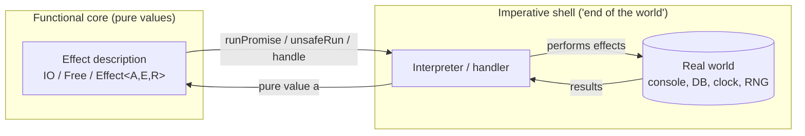
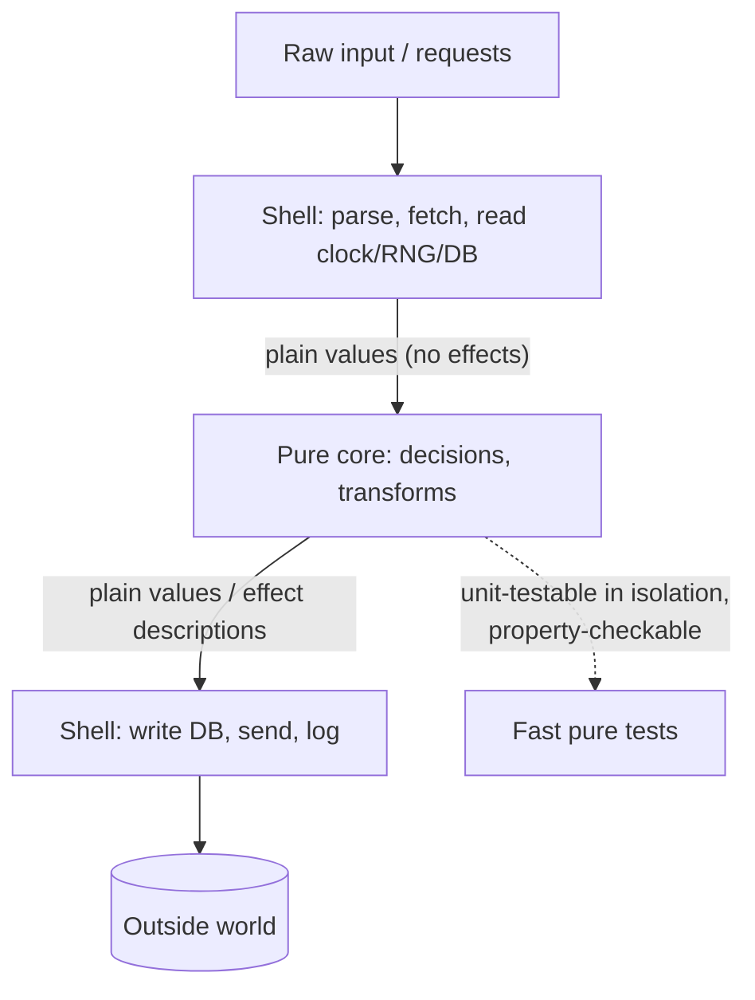

# Pure Functions — Professional Level

> Focus: the formal core — referential transparency as the substitution model, effects reified as values (IO/free/algebraic effects/tagless-final), purity-enabled compiler optimizations, the measured cost of the functional core, and the precise boundary of what "pure" excludes.

---

## Table of Contents

1. [Referential transparency, formally](#referential-transparency-formally)
2. [Effects as first-class values](#effects-as-first-class-values)
3. [Purity and the compiler](#purity-and-the-compiler)
4. [What "pure" really excludes](#what-pure-really-excludes)
5. [Benign effects: observable vs unobservable](#benign-effects-observable-vs-unobservable)
6. [The cost of functional-core / imperative-shell](#the-cost-of-functional-core--imperative-shell)
7. [Laziness and pure pipelines](#laziness-and-pure-pipelines)
8. [Cross-language reality check](#cross-language-reality-check)
9. [Common Mistakes](#common-mistakes)
10. [Test Yourself](#test-yourself)
11. [Cheat Sheet](#cheat-sheet)
12. [Summary](#summary)
13. [Further Reading](#further-reading)
14. [Related Topics](#related-topics)

---

## Referential transparency, formally

A function is **pure** when the call expression is *referentially transparent*: replacing the call with its result (or vice versa) leaves the program's meaning unchanged. This is the **substitution model** of evaluation — the same model the λ-calculus uses for β-reduction. If `f(x)` is referentially transparent, then in any context `C[·]`, `C[f(x)]` and `C[v]` (where `v` is the value `f(x)` denotes) are interchangeable.

Two equivalent statements of the property:

- **Equational reasoning.** `let y = f(x) in (y, y)` must equal `(f(x), f(x))`. If they can differ, `f` is not pure. This is exactly the law that lets you `let`-float, common-subexpression-eliminate, and reorder independent computations.
- **Denotational.** `f` denotes a mathematical function from its argument's value to its result's value — no dependence on time, heap, or evaluation order.

The λ-calculus is the canonical pure language: β-reduction `(λx. e) v → e[x := v]` is *confluent* (Church–Rosser, 1936). Confluence means the order in which you reduce redexes does not change the final normal form. Purity is what buys you confluence in a real language: independent subexpressions can be evaluated in any order, in parallel, or not at all.

```
-- equational reasoning: these rewrites are valid ONLY for pure f, g
let a = f x          let a = f x
    b = f x    ≡         b = a          -- CSE: f referentially transparent
in g a b             in g a a

g (f x) (f x)  ≡  let a = f x in g a a   -- let-floating / sharing
```

Crucially, referential transparency is a property of **expressions in a language**, not of functions in the abstract. `rand()` is impure in C because the *expression* `rand()` denotes different values on different evaluations. `getLine` in Haskell is *pure as a value* — it is the same `IO String` action every time — even though *running* it does I/O. That distinction is the whole game (next section).

> **Precise definition for review:** `f` is pure iff (1) its result depends only on its arguments (no hidden inputs), and (2) evaluating it produces no observable effect beyond computing the result (no hidden outputs). "Observable" is doing real work in clause (2) — see [Benign effects](#benign-effects-observable-vs-unobservable).

---

## Effects as first-class values

How can a *pure* language do I/O? The answer that unifies Haskell, ZIO, Cats Effect, and effect-ts: **don't perform the effect — describe it.** A pure program is a value that *denotes* an effectful computation; a separate, impure runtime (the "end of the world") interprets that value.

### The IO monad

In Haskell, `IO a` is an opaque value representing "a recipe that, when run, may interact with the world and yields an `a`." Building an `IO` value is pure; `main :: IO ()` is just the one value the runtime executes.

```haskell
-- Pure VALUE describing two effects, sequenced. Constructing this does nothing.
greet :: IO ()
greet = do
  name <- getLine          -- IO String
  putStrLn ("Hi " ++ name) -- IO ()

-- `getLine` is referentially transparent: it is the SAME value at each occurrence.
-- `let x = getLine in (x, x)`  ==  `(getLine, getLine)`  -- two descriptions, run twice
```

`>>=` (bind) sequences descriptions; `do` is sugar for it. The monad laws (left identity, right identity, associativity) are precisely what make refactoring `do`-blocks behavior-preserving — they are the equational-reasoning rules for effectful code.

The model GHC actually uses is "world-passing": `IO a ≈ State# RealWorld -> (# State# RealWorld, a #)`. The `RealWorld` token threads a data dependency through every effect, forcing an evaluation order without a side effect ever escaping the type. Purity is preserved because the token is never duplicated.

### Free monads

The IO monad bakes in one interpreter. A **free monad** separates the *program* (a data structure of operations) from its *interpretation* (a fold over that structure), so you can run the same pure description against a real interpreter in prod and a pure/in-memory one in tests.

```scala
// Cats Free: describe a key-value program as DATA, interpret it later.
sealed trait KVStore[A]
case class Get(k: String) extends KVStore[Option[String]]
case class Put(k: String, v: String) extends KVStore[Unit]

type Program[A] = Free[KVStore, A]
def get(k: String): Program[Option[String]] = Free.liftF(Get(k))
def put(k: String, v: String): Program[Unit]   = Free.liftF(Put(k, v))

val prog: Program[Option[String]] =
  for { _ <- put("a", "1"); v <- get("a") } yield v   // pure value, no effect yet

// Two interpreters (natural transformations KVStore ~> F):
val pureInterp: KVStore ~> State[Map[String, String], *] = ???  // test
val ioInterp:   KVStore ~> IO                            = ???  // prod
```

### Algebraic effects and handlers

Algebraic effects (Plotkin & Pretnar) generalize this: an effectful operation is an *abstract request* and a **handler** supplies its meaning, with the handler able to resume the suspended computation via a delimited continuation. This is what ZIO's environment/`ZLayer`, effect-ts (`Effect<A, E, R>`), Unison's abilities, and OCaml 5's effect handlers all express. The pure program *names* the effects it needs (`R`); the handler provides them — testing swaps the handler, not the program.

```typescript
// effect-ts: the Effect VALUE tracks success A, failure E, and required env R.
const program: Effect.Effect<User, DbError, Database> =
  Effect.gen(function* () {
    const db = yield* Database          // declares a requirement, performs nothing
    return yield* db.findUser("42")
  })
// Pure until `Effect.runPromise(program.pipe(Effect.provide(LiveDb)))`.
```

### Tagless-final

Instead of a concrete effect data type, **tagless-final** parameterizes the program over an abstract effect constructor `F[_]` constrained by capability type classes. No intermediate AST is allocated (unlike free), yet interpretation is still swappable by choosing the instance.

```scala
trait Kv[F[_]] { def get(k: String): F[Option[String]]; def put(k: String, v: String): F[Unit] }

def prog[F[_]: Monad](kv: Kv[F]): F[Option[String]] =
  for { _ <- kv.put("a", "1"); v <- kv.get("a") } yield v
// Instantiate F = IO in prod, F = State[Map, *] or Id in tests.
```

The common thread across all four techniques: **a pure description is a value; the impure interpreter sits at the program's edge.** This is the rigorous version of "functional core, imperative shell."



---

## Purity and the compiler

Purity is not merely a discipline — when the *language* can prove it, the compiler unlocks optimizations that are unsound in an effectful setting.

- **Common subexpression elimination (CSE).** `g (f x) (f x)` → `let a = f x in g a a`. Sound only if `f x` is referentially transparent; otherwise you'd drop a side effect.
- **Let-floating and code motion.** GHC hoists a pure binding out of a loop because re-evaluating it cannot matter (full laziness; Peyton Jones, Partain & Santos, "Let-floating: moving bindings to give faster programs," ICFP 1996).
- **Free memoization / sharing.** A pure thunk evaluated once can be cached forever; an impure one cannot.
- **Parallelization for free.** Independent pure subexpressions have no data race because there is no shared mutable state and no ordering constraint (`par`/`pseq` in Haskell, ZIO `zipPar`, Rust `rayon`).
- **Dead-code elimination.** A pure result never consumed can be deleted wholesale; an impure call cannot — its effect is observable.

### Parametricity (free theorems)

Wadler's "Theorems for Free!" (1989) shows that in a pure, parametrically-polymorphic language a function's *type alone* implies theorems about its behavior. The only total function `forall a. a -> a` is the identity. Any `forall a. [a] -> [a]` is some fixed permutation/deletion independent of the elements, so `f . map g == map g . f` for it. These free theorems hold *because* the function cannot inspect or side-effect on the abstract type. Side effects break parametricity, and with it these guarantees.

### GHC specifics

GHC encodes "this is pure" by the absence of `IO`, and exploits it via rewrite `RULES`. **List fusion** (`foldr`/`build`; stream fusion — Coutts, Leshchinsky & Stewart, ICFP 2007) fuses `map f . map g` into `map (f . g)` and eliminates intermediate lists entirely — a transformation that would change observable behavior if `f` or `g` had effects.

```haskell
{-# RULES "map/map" forall f g xs. map f (map g xs) = map (f . g) xs #-}
-- Legal because map is pure: no intermediate list is observable.
```

### What about Go / Java / Python?

These compilers cannot *prove* purity, so they apply these optimizations only where escape/alias analysis locally establishes the preconditions:

- **Java/HotSpot:** CSE and loop-invariant code motion apply to expressions the JIT can prove side-effect-free (no field writes, no volatile reads, no calls it cannot see through). It cannot hoist a call it cannot inline and prove pure.
- **Go:** the compiler hoists provably side-effect-free loop invariants and inlines pure helpers, but conservatively — any call to an opaque function blocks it.
- **Python (CPython):** essentially no such optimization; every `LOAD_GLOBAL`/`CALL` is dynamic. Purity buys you *reasoning* and *manual* memoization (`functools.cache`), not compiler help.

> **Takeaway:** in Haskell purity is a *type-checked theorem* the optimizer exploits aggressively; in mainstream languages it is a *local property* the optimizer rediscovers per call site, if it can.

---

## What "pure" really excludes

"Pure" is stricter than "no side effects." A fully pure (referentially transparent, *total*) function also excludes the following — each silently breaks the substitution model:

| Hazard | Why it breaks purity | Notes |
|---|---|---|
| **Nontermination** | `f x` may diverge; `⊥` (bottom) is not a value, so substituting "the value" is wrong | Haskell is *not* total; `undefined` and infinite loops inhabit every type. Total languages (Agda, Idris with totality checking) exclude this |
| **Exceptions** | `f x` throws vs. returns — replacing the call with "a value" is wrong when there is no value | Pure code should return `Either`/`Maybe`/`Option`, not throw. Java unchecked exceptions and Python `raise` are impure escapes |
| **`unsafePerformIO`** | Launders an `IO` action into a pure value, defeating the type system | Legitimate only when the effect is provably unobservable and the result deterministic; otherwise a soundness hole |
| **Reading clock / RNG / env** | Hidden input; same args, different result | `time.Now()`, `Math.random()`, `os.Getenv` |
| **Observable mutation of arguments** | Hidden output; caller sees a changed object | Mutating a passed slice/list/array |
| **Lazy `IO` (`hGetContents`)** | Effects fire during *evaluation*, not at a defined point — ordering becomes observable and nondeterministic | The classic Haskell footgun; prefer strict/streaming I/O |

A useful slogan: **partiality and exceptions are effects on the "value" axis; I/O and mutation are effects on the "world" axis.** A function honest about *both* — total and effect-free — is what the math means by "pure." Most production "pure" functions accept partiality (they may throw on genuinely impossible input) while rigorously excluding world effects; know which guarantee you actually have.

---

## Benign effects: observable vs unobservable

The operational definition of purity hinges on **observability**, not on "the CPU did nothing." An effect is *benign* (and the function stays referentially transparent) iff no client can write a program that distinguishes "effect happened" from "effect didn't." Two canonical cases:

### Memoization / caching

A pure function may cache its results. The cache mutates memory — an effect — but it is **unobservable**: the same input still yields the same output, and the only difference is timing. Referential transparency is preserved.

```python
from functools import cache

@cache                      # mutates an internal dict — benign, unobservable
def fib(n: int) -> int:
    return n if n < 2 else fib(n - 1) + fib(n - 2)
# fib(30) == fib(30) always; the cache only changes how long the second call takes.
```

Haskell's CAF (constant applicative form) sharing and Scala's `lazy val` are the language-level version of this benign mutation.

### Lazy initialization

```java
// Idempotent, deterministic lazy init: the mutation (null -> value) is unobservable
// because every call returns the same value.
private volatile Config config;
public Config config() {
    Config c = config;
    if (c == null) { c = loadDefaults(); config = c; } // benign: loadDefaults is pure & deterministic
    return c;
}
```

The line where benign turns malign: the moment timing, ordering, allocation count, or thread interleaving becomes part of the function's *contract* (a "cache" whose eviction changes results, or memoizing an *impure* function so callers get a stale clock/RNG value), the effect is observable and the function is no longer pure.

> **Pitfall:** memoizing a non-pure function is a category error. `@cache` on `now()` freezes time; `@cache` on a function reading a mutable global returns stale data. The decorator *assumes* a purity it cannot check — exactly the "Memoisation on functions that aren't actually pure" anti-pattern in the [chapter README](../README.md).

---

## The cost of functional-core / imperative-shell

The pure-core architecture is not free. Its costs are real but usually dominated by its payoff.

**Direct costs**

- **Extra allocation.** Returning new values instead of mutating in place allocates. A pure `update` on a 1M-element collection naively copies; persistent data structures (HAMT, RRB-trees, Clojure's vectors) reduce this to O(log₃₂ n) via structural sharing, but you still pay pointer-chasing and indirection vs. an in-place array write.
- **Indirection.** Effect descriptions (free-monad ASTs, tagless `F[_]` dictionaries, ZIO fibers) add boxing, megamorphic dispatch, and trampolining. A free-monad interpreter loop is a heap-allocated AST walk; tagless-final avoids the AST but still passes type-class dictionaries.
- **Lost in-place optimizations.** A mutable accumulator in a tight loop beats a fold that allocates per step — unless fusion (Haskell) or escape analysis (JVM/Go) recovers it.

**The payoff**

- **Testability.** A pure core needs no mocks, no clock injection, no DB — just `assertEquals(expected, f(input))`. This is where [property-based testing](#related-topics) shines: invariants over a pure function are cheap to check across thousands of inputs.
- **Reasoning.** Equational reasoning + parametricity let you refactor with the type checker as a proof assistant.
- **Concurrency.** No shared mutable state in the core ⇒ trivially parallelizable, no data races by construction.



The engineering judgment: **push effects to the edges so the *interesting* logic is pure, but don't ideologically purify hot inner loops where a local mutation is unobservable and measurably faster.** A locally-mutating function whose mutation never escapes (a Go stack-allocated struct, a Java EA-scalar-replaced object, a `let mut` in Rust scoped to the body) is *externally* pure — that is the correct compromise, and it is the "benign, unobservable effect" rule applied to performance.

---

## Laziness and pure pipelines

Purity and laziness reinforce each other: laziness is *only* sound in a pure setting, because deferring an evaluation is observable the moment it carries a side effect.

- **Haskell (non-strict by default).** `take 5 (map f [1..])` evaluates `f` exactly five times; the infinite list costs nothing un-demanded. Fusion may eliminate the list entirely. This composability is why pure pipelines read as data transformations.
- **The space-leak hazard.** Lazy `foldl (+) 0 xs` builds a thunk chain `(((0+x1)+x2)+...)` that blows the stack; the cure is strictness (`foldl'`, bang patterns, `seq`). Purity does not absolve you from *space* reasoning — only from *effect* reasoning.
- **Lazy I/O is a trap.** `readFile` + lazy `hGetContents` interleaves effects with demand, so the *order* of reads depends on the *order* of forcing — nondeterministic and impure in practice. Streaming libraries (`conduit`, `pipes`, `fs2`, a Java `Stream` over a closed resource) restore deterministic, resource-safe effect ordering.

In strict languages, the analog is **lazy/iterator pipelines**: Java `Stream`, Go `iter.Seq` (1.23+), Python generators, Rust iterators. They are pure precisely as long as the per-element function is pure — a `peek(System.out::println)` or a generator that mutates a closed-over list reintroduces effects and destroys the ability to reorder, parallelize, or short-circuit safely.

```java
// Pure, lazy, fusible — the terminal op pulls exactly what it needs:
int firstBig = nums.stream().map(n -> n * n).filter(n -> n > 100).findFirst().orElse(-1);
// .peek(System.out::println) here would make element ORDER and COUNT observable: no longer pure.
```

---

## Cross-language reality check

| Language | Purity status | How effects are kept out | Compiler exploits purity? |
|---|---|---|---|
| Haskell / PureScript | Effects in the type (`IO`, effect rows) | IO monad / free / effect system; `unsafePerformIO` as escape | Yes — CSE, fusion, parametricity, free parallelism |
| Scala (Cats Effect / ZIO) | Library-enforced (`IO`, `ZIO`, tagless-final) | Effect values + interpreters at `main`; convention, not language-checked | Partly (JVM JIT does local CSE/EA) |
| Rust | Not enforced, but ownership makes effects *visible* | `fn` with `&self` + no interior mutability ≈ pure; `const fn` is checkable-pure | Yes for `const fn`; LLVM CSE on provably-pure regions |
| Go | Not enforced | Discipline + escape analysis; named types; closures must not capture mutably | Local hoisting/inlining only |
| Java | Not enforced | Discipline; `record` + final fields; effects pushed to the shell | JIT: local CSE, EA, scalar replacement |
| Python | Not enforced | Discipline; `@cache` assumes (cannot check) purity | None meaningful in CPython |

> The spectrum runs from **type-checked purity** (Haskell) through **make-effects-visible** (Rust ownership) to **purely conventional** (Go/Java/Python). Knowing where your language sits tells you whether the compiler is your ally or whether purity is a discipline you alone must enforce.

---

## Common Mistakes

1. **Confusing "constructs an effect" with "performs an effect."** Building an `IO`/`Effect`/`Free` value is pure; only the runtime performs it. Reviewers who call `IO` "impure" misunderstand the design.
2. **Memoizing an impure function.** `@cache` / `lazy val` / `memoize` silently freezes hidden inputs (clock, RNG, mutable globals), returning stale or wrong results. Memoization assumes a referential transparency it cannot verify.
3. **Treating "no I/O" as "pure" while ignoring partiality.** A function that throws on some inputs is not referentially transparent on the value axis. Return `Either`/`Option`/error values from the core.
4. **`unsafePerformIO` for an observable effect.** Legitimate only for deterministic, unobservable effects (one-time global init). Using it for logging or randomness corrupts evaluation order under GHC's optimizer.
5. **Lazy I/O.** Interleaving effects with demand makes ordering nondeterministic; use streaming abstractions with explicit resource scoping.
6. **Ideologically purifying hot loops.** Refusing a stack-local mutation that never escapes trades a measurable speedup for zero correctness gain. Externally-pure-but-internally-mutable is the right call there.
7. **Assuming purity gives you compiler optimization in Go/Java/Python.** It only does where local escape/alias analysis can re-prove the preconditions per call site. You get *reasoning*, not *fusion*, for free.
8. **Forgetting space cost.** Pure + lazy can leak space via thunk chains; pure + persistent structures add indirection. Purity removes effect bugs, not performance reasoning.

---

## Test Yourself

**1. Why is `getLine :: IO String` referentially transparent even though it reads the console?**

<details><summary>Answer</summary>

Because `getLine` is a *value* — a description of an action — and it is the *same* value at every occurrence. `let x = getLine in (x, x)` equals `(getLine, getLine)`: two copies of the same description. Referential transparency is a property of the *expression* `getLine`, which always denotes the identical `IO String`. The effect happens only when the runtime *runs* the action, a separate, single, impure step at `main`. Substituting the description for itself never changes meaning; the program stays pure up to the edge.

</details>

**2. A teammate wraps `now()` (returns current time) with `functools.cache` "to speed it up." What breaks, and why is it a category error?**

<details><summary>Answer</summary>

`now()` is impure — same call, different result (hidden input: the clock). `@cache` keys on arguments only; with no arguments it stores the *first* result and returns it forever, freezing time. It is a category error because memoization is *only* sound for referentially-transparent functions: its correctness theorem is "f(x) always equals f(x)," which `now()` violates. The decorator cannot check purity, so it silently produces wrong values. Fix: pass time in as an argument (push the effect to the shell), keeping the consuming logic pure and trivially cacheable/testable.

</details>

**3. Which compiler optimizations does referential transparency enable, and which is *unsound* without it?**

<details><summary>Answer</summary>

Enabled: common-subexpression elimination, let-floating / loop-invariant code motion, memoization/sharing, dead-code elimination of unused results, fusion (`map/map`, stream fusion), and free parallelization of independent subexpressions. Each is unsound for impure code: CSE would drop a side effect (`f x; f x` ≠ `let a = f x in (a, a)` if `f` prints); DCE would delete an observable effect; parallelization would introduce races; fusion would remove an intermediate whose effects were observable. GHC applies these aggressively because the *type system proves* purity (Wadler's parametricity / free theorems back the type-driven ones).

</details>

**4. Distinguish the four "effects-as-values" techniques: IO monad, free monad, algebraic effects, tagless-final.**

<details><summary>Answer</summary>

- **IO monad:** one opaque effect type with one built-in interpreter (the runtime). Simple, fast, but interpretation is fixed.
- **Free monad:** effects reified as a *data structure* (AST of operations); interpretation is a separate fold (`~>`), so you can swap prod/test interpreters. Cost: AST allocation + trampolining.
- **Algebraic effects + handlers:** operations are abstract requests; a handler supplies meaning and can resume via a delimited continuation. Composable effect *rows*; OCaml 5, Unison, effect-ts, ZIO environment.
- **Tagless-final:** parameterize the program over `F[_]` constrained by capability type classes — no AST allocated, interpretation chosen by instance.

The unifying idea: the program is a pure value/description; the impure interpreter sits at the edge.

</details>

**5. Give a precise account of "benign effect" and the line where it becomes malign.**

<details><summary>Answer</summary>

A benign effect is one no client can *observe* — no program can distinguish "effect happened" from "didn't." Memoization (mutating a cache) and idempotent lazy init are benign: same input → same output, only timing differs, so referential transparency holds. It turns malign the moment the effect becomes observable in the function's contract: timing/allocation/order/thread-interleaving affecting results, a cache whose eviction changes outputs, or memoizing an impure function so callers see stale clock/RNG/global state. The test is observability, not whether the CPU mutated memory.

</details>

**6. Why is laziness sound only in a pure language, and what hazard does it add even there?**

<details><summary>Answer</summary>

Laziness defers evaluation until a value is demanded and reorders when work happens. If a deferred computation had a side effect, *when* (or whether) it runs would become observable and nondeterministic — exactly the lazy-I/O footgun (`hGetContents` interleaving reads with forcing). In a pure language there is no observable effect, so deferral/reordering/sharing are all sound; that is why Haskell can be non-strict by default. The remaining hazard is **space**: thunk chains (e.g., lazy `foldl`) accumulate unevaluated work and blow the heap/stack. Purity removes effect reasoning, not space reasoning — cure with strictness (`foldl'`, `seq`, bang patterns).

</details>

**7. Your "pure" Java method returns `int` and does no I/O, but a colleague says it isn't truly pure. Name two ways it could still violate referential transparency.**

<details><summary>Answer</summary>

(1) **Partiality/exceptions:** it throws on some inputs (e.g., `ArithmeticException` on divide-by-zero, NPE). Then `f(x)` doesn't denote a value for those inputs, so substituting "the value" is invalid — it's impure on the value axis. (2) **Hidden input:** it reads a mutable static/`System.currentTimeMillis()`/`ThreadLocalRandom`, so the same arguments yield different results. (Also: mutating a passed-in array/collection — a hidden output — even though the return is an `int`.) "Returns `int`, no I/O" guarantees neither totality nor freedom from hidden state.

</details>

---

## Cheat Sheet

| Concept | One-line truth |
|---|---|
| Referential transparency | `f(x)` interchangeable with its value in any context (substitution model) |
| Pure = | deterministic on args **and** no observable effect (and ideally total) |
| Constructing an effect | pure; only *running* it (at `main`) is impure |
| IO monad | one opaque effect type, one built-in interpreter |
| Free monad | effects as data (AST), interpretation as a swappable fold |
| Algebraic effects | abstract request + handler that resumes via continuation |
| Tagless-final | program over `F[_]` + capability type classes, no AST |
| Compiler wins | CSE, let-float, fusion, free parallelism, DCE, memoization |
| Free theorems | type implies behavior under parametricity (Wadler 1989) |
| Pure excludes | nontermination, exceptions, `unsafePerformIO`, clock/RNG/env, arg mutation |
| Benign effect | unobservable mutation (memoize, idempotent lazy init) |
| Functional core | push effects to the shell; keep decisions pure & testable |
| Laziness | sound only when pure; watch for space leaks (thunk chains) |
| Purity in Go/Java/Py | discipline + local analysis; not a type-checked theorem |

---

## Summary

Purity is **referential transparency**: a call is interchangeable with its value under the substitution model the λ-calculus formalizes. The defining trick of "pure" languages is to **reify effects as values** — `IO`, free monads, algebraic effects, tagless-final all describe effects as data and let an impure interpreter at the program's edge perform them, which is the rigorous form of functional-core/imperative-shell. When the *language* can prove purity, the compiler cashes it in: CSE, let-floating, list/stream fusion, free parallelization, and the free theorems of parametricity. "Pure" excludes more than I/O — nontermination, exceptions, and `unsafePerformIO` all break the substitution model — while *benign, unobservable* effects (memoization, idempotent lazy init) preserve it. The architecture has real costs (allocation, indirection, lost in-place mutation) repaid in testability, equational reasoning, and race-free concurrency; the senior move is to purify the *interesting* logic and tolerate stack-local, externally-invisible mutation in hot loops. In Haskell purity is a type-checked theorem; in Go/Java/Python it is a discipline the optimizer can only locally rediscover.

---

## Further Reading

- Wadler, "Theorems for Free!" (FPCA 1989) — parametricity and free theorems.
- Peyton Jones & Wadler, "Imperative Functional Programming" (POPL 1993) — the IO monad's design.
- Peyton Jones, Partain & Santos, "Let-floating: moving bindings to give faster programs" (ICFP 1996).
- Coutts, Leshchinsky & Stewart, "Stream Fusion: From Lists to Streams to Nothing at All" (ICFP 2007).
- Plotkin & Pretnar, "Handlers of Algebraic Effects" (ESOP 2009) — algebraic effects and handlers.
- Kiselyov, Sabry & Swords, "Extensible Effects" / Kiselyov & Ishii, "Freer Monads, More Extensible Effects."
- "Functional Programming in Scala" (Chiusano & Bjarnason) — IO, free, effect interpreters.
- ZIO docs (zio.dev) and Effect-TS docs (effect.website) — environment/handler-based effects in practice.
- Bernhardt, "Boundaries" (talk) and Feathers' "functional core, imperative shell" framing.

---

## Related Topics

- [senior.md](senior.md) — applied purity: dependency injection of effects, testing the pure core, refactoring toward it.
- [interview.md](interview.md) — Q&A on purity, side effects, and referential transparency.
- [Chapter README](../README.md) — the positive rules and the anti-patterns to avoid.
- [Immutability](../14-immutability/README.md) — the data-side companion to pure functions.
- [Functions](../02-functions/README.md) — small, single-purpose functions as the substrate for purity.
- [Functional Programming](../../functional-programming/README.md) — monads, functors, and effect systems in depth.
