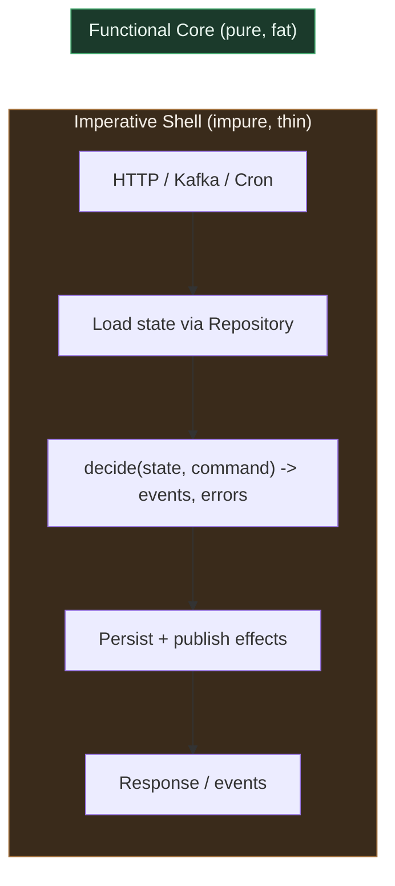
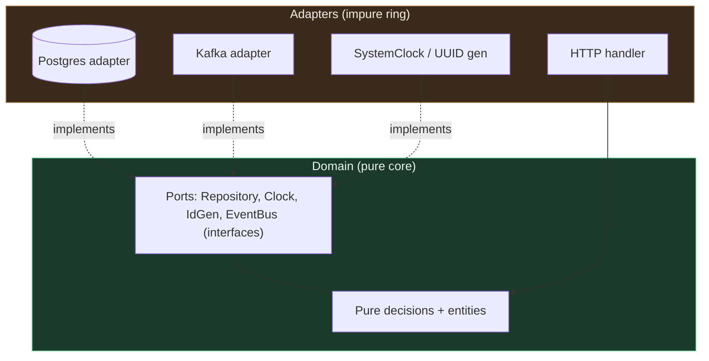
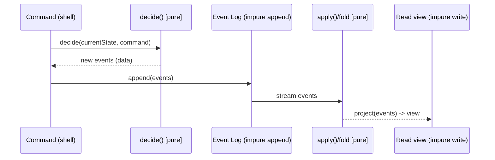

# Pure Functions — Senior Level

> Focus: "How do I architect a system around purity?" — purity as a module/service-level discipline, not a per-function trick. Functional core / imperative shell, ports-and-adapters keeping the domain deterministic, injected effects (Clock/RNG/ID/Repository), safe memoization, event sourcing as a pure fold, and enforcing "no I/O in the domain" with ArchUnit / import-linter / depguard.

---

## Table of Contents

1. [Purity is an architectural property, not a function decorator](#purity-is-an-architectural-property-not-a-function-decorator)
2. [Functional core, imperative shell](#functional-core-imperative-shell)
3. [Injecting the four impure dependencies: Clock, RNG, ID, Repository](#injecting-the-four-impure-dependencies-clock-rng-id-repository)
4. [Ports and adapters: keeping the domain pure](#ports-and-adapters-keeping-the-domain-pure)
5. [Enforcing purity with architecture tests](#enforcing-purity-with-architecture-tests)
6. [Pure logic, property-based tests](#pure-logic-property-based-tests)
7. [Safe memoization and caching](#safe-memoization-and-caching)
8. [Event sourcing and CQRS: purity at the system level](#event-sourcing-and-cqrs-purity-at-the-system-level)
9. [Observability without breaking purity](#observability-without-breaking-purity)
10. [Migration: extracting a pure core from a tangled service](#migration-extracting-a-pure-core-from-a-tangled-service)
11. [Common Mistakes](#common-mistakes)
12. [Test Yourself](#test-yourself)
13. [Cheat Sheet](#cheat-sheet)
14. [Summary](#summary)
15. [Further Reading](#further-reading)
16. [Related Topics](#related-topics)

---

## Purity is an architectural property, not a function decorator

A junior makes one function pure. A senior makes a *layer* pure and proves the boundary holds under team pressure for years.

The economic argument: every impure dependency a function reaches — wall-clock time, a random source, the database, an HTTP client, a global mutable cache — is a thing your tests must *set up*, *isolate*, and *tear down*. The cost of impurity is not paid once; it is paid by every test, every retry, every replay, every audit, and every engineer who has to reason about "what state was the world in when this ran?"

The senior move is to **push effects to the edges** so that the bulk of the system — the part that encodes business rules and changes most often — is a referentially transparent function:

```
output = f(input)
```

No `f(input, now())`. No `f(input)` that also writes a row. Just data in, data out. Everything that *cannot* be pure (the database read, the clock tick, the Kafka publish) lives in a thin shell that the core never imports.



The shell does I/O and decides *when*. The core decides *what*. The arrow into the core carries plain data; the arrow out carries plain data. The core has no knowledge that a database, a clock, or a network exists.

---

## Functional core, imperative shell

Gary Bernhardt's "Functional Core, Imperative Shell" is the load-bearing pattern. The rule: **decisions are pure; actions are impure, few, and at the top.**

A decision function takes the current state and an intent, and returns *what should happen* as data — it does not make it happen.

**Go — the core decides, the shell acts:**

```go
package billing

import "time"

// ---- Functional core: no clock, no DB, no logger. Pure. ----

type Subscription struct {
	PlanCents   int
	RenewsAt    time.Time
	Cancelled   bool
}

type Decision struct {
	ChargeCents int
	NewRenewsAt time.Time
	EmitEvent   string // "" means none
}

// Renew is pure: (state, now) -> decision. `now` is data, passed in.
func Renew(sub Subscription, now time.Time) (Decision, error) {
	if sub.Cancelled {
		return Decision{}, ErrCancelled
	}
	if now.Before(sub.RenewsAt) {
		return Decision{EmitEvent: ""}, nil // not due yet
	}
	return Decision{
		ChargeCents: sub.PlanCents,
		NewRenewsAt: sub.RenewsAt.AddDate(0, 1, 0),
		EmitEvent:   "subscription.renewed",
	}, nil
}
```

```go
// ---- Imperative shell: thin, impure, untested-by-property. ----

func (s *Service) RenewSubscription(ctx context.Context, id SubID) error {
	sub, err := s.repo.Load(ctx, id)        // effect: read
	if err != nil {
		return err
	}
	dec, err := Renew(sub, s.clock.Now())   // pure call
	if err != nil {
		return err
	}
	if dec.ChargeCents > 0 {
		if err := s.gateway.Charge(ctx, id, dec.ChargeCents); err != nil { // effect: charge
			return err
		}
		sub.RenewsAt = dec.NewRenewsAt
		if err := s.repo.Save(ctx, sub); err != nil { // effect: write
			return err
		}
		s.bus.Publish(ctx, dec.EmitEvent)     // effect: publish
	}
	return nil
}
```

The 95% of code that encodes "what does renewal mean?" is pure and trivially testable. The 5% that touches the world is mechanical glue with almost no branching. Bugs hide in branches; the shell has almost none.

> **Key inversion:** the shell calls the core, never the reverse. If your domain object reaches up to call `repository.save()`, the dependency arrow points the wrong way and purity is gone.

---

## Injecting the four impure dependencies: Clock, RNG, ID, Repository

Almost all hidden impurity reduces to four sources. Make each one an injected interface so the core sees *data* or a *seam*, never the live resource.

| Source | Naive (impure) | Pure-friendly |
|---|---|---|
| Time | `time.Now()` / `datetime.now()` / `System.currentTimeMillis()` | pass `now` as a parameter, or inject a `Clock` |
| Randomness | `rand.Int()` / `random.random()` / `Math.random()` | inject a seeded `RNG` / pass the value in |
| Identity | `uuid.New()` inside the domain | inject an `IDGenerator`, or pass the ID in |
| Persistence | direct SQL inside business logic | inject a `Repository` port; load before, save after |

**Java — a `Clock` is a first-class JDK abstraction; use it.** `java.time.Clock` exists precisely for this.

```java
public final class TrialPolicy {
    private final Clock clock;                 // injected; never Clock.systemUTC() inline

    public TrialPolicy(Clock clock) { this.clock = clock; }

    // Pure given the injected clock; deterministic in tests via Clock.fixed(...)
    public boolean isExpired(Instant startedAt, Duration trialLength) {
        return Instant.now(clock).isAfter(startedAt.plus(trialLength));
    }
}
```

```java
// Test: time is now data, not a global.
TrialPolicy policy = new TrialPolicy(
    Clock.fixed(Instant.parse("2026-01-15T00:00:00Z"), ZoneOffset.UTC));
assertTrue(policy.isExpired(Instant.parse("2026-01-01T00:00:00Z"), Duration.ofDays(7)));
```

**Python — protocols for the seams, the live impl wired at the edge.**

```python
from typing import Protocol
from datetime import datetime, timezone

class Clock(Protocol):
    def now(self) -> datetime: ...

class SystemClock:                     # impure, lives in the shell
    def now(self) -> datetime:
        return datetime.now(timezone.utc)

class FixedClock:                      # for tests
    def __init__(self, t: datetime): self._t = t
    def now(self) -> datetime: return self._t

def quote_expired(quoted_at: datetime, ttl_seconds: int, clock: Clock) -> bool:
    # pure given the clock; no module-level datetime.now() anywhere
    return (clock.now() - quoted_at).total_seconds() > ttl_seconds
```

The discipline scales: a function with `Clock`, `RNG`, and `IDGenerator` injected is *deterministic* — feed it the same fakes and inputs, get the same output every run. That is the whole point. Determinism is the dividend purity pays.

---

## Ports and adapters: keeping the domain pure

Hexagonal architecture (ports & adapters) and "functional core / imperative shell" are the same idea viewed from two angles. The **domain** defines *ports* (interfaces it needs); *adapters* in the outer ring implement them with real I/O. The dependency rule: **the domain depends on nothing; everything depends on the domain.**



The port is defined *in the domain package*, in the domain's vocabulary. The adapter that implements it lives outside and is free to be as impure as it needs. The core imports the port interface; it never imports `database/sql`, `net/http`, `boto3`, or `org.apache.kafka`. That import boundary is the thing you will enforce mechanically (next section).

A common mistake here is letting the *port* leak impurity: a `Repository` interface that returns a `*sql.Rows` or a JPA-managed entity drags the database back into the core. The port must speak in domain types only.

---

## Enforcing purity with architecture tests

Conventions decay. A new hire writes `time.Now()` in a domain function during a Friday hotfix and nobody catches it in review. The fix is to make the build fail. Each language has a tool to assert "the domain layer imports nothing impure."

**Java — ArchUnit.** Run as a normal JUnit test in CI.

```java
@AnalyzeClasses(packages = "com.acme.billing")
class PurityRulesTest {

    @ArchTest
    static final ArchRule domain_is_isolated_from_io =
        noClasses().that().resideInAPackage("..domain..")
            .should().dependOnClassesThat().resideInAnyPackage(
                "java.sql..", "javax.persistence..",
                "org.springframework..", "java.net..", "java.io..");

    @ArchTest
    static final ArchRule domain_must_not_read_the_wall_clock =
        noClasses().that().resideInAPackage("..domain..")
            .should().callMethod(Instant.class, "now")        // forbid Instant.now()
            .orShould().callMethod(System.class, "currentTimeMillis");
}
```

**Python — import-linter.** Declare layers in `pyproject.toml`/`setup.cfg`; CI runs `lint-imports`.

```ini
# .importlinter
[importlinter]
root_package = acme

[importlinter:contract:domain-purity]
name = Domain must not import infrastructure
type = forbidden
source_modules =
    acme.domain
forbidden_modules =
    acme.infrastructure
    sqlalchemy
    requests
    httpx
    boto3
```

**Go — depguard (via golangci-lint).** Forbid impure packages from the domain.

```yaml
# .golangci.yml
linters-settings:
  depguard:
    rules:
      domain:
        files: ["**/internal/domain/**"]
        deny:
          - pkg: "database/sql"
            desc: "domain must not touch the DB; use a Repository port"
          - pkg: "net/http"
            desc: "domain must not do I/O; inject a port"
          - pkg: "time"
            desc: "inject a Clock; do not call time.Now() in the domain"
```

> **The forbidden-`time` rule is the highest-value single line of config you can add.** Wall-clock reads are the most common purity leak and the hardest to spot in review, because `time.Now()` looks innocent. Banning it in the domain forces every time-dependent decision to take `now` as data — which is exactly what makes those decisions testable.

These tests are *cheap to write and impossible to circumvent silently*. They turn "we agreed not to do I/O in the domain" into a build-breaking invariant.

---

## Pure logic, property-based tests

The payoff of a pure core is that you can hammer it with property-based testing: instead of asserting one example, you assert an *invariant* over thousands of generated inputs. This only works because the function is deterministic and side-effect-free — the framework reruns it freely, shrinks failing cases, and there is no DB to reset between runs.

**Go — `testing/quick` (or `pgregory.net/rapid` for shrinking):**

```go
func TestRenew_NeverChargesACancelledSub(t *testing.T) {
	f := func(plan int, days int) bool {
		sub := Subscription{PlanCents: plan, Cancelled: true,
			RenewsAt: time.Unix(0, 0)}
		dec, err := Renew(sub, time.Unix(int64(days)*86400, 0))
		return err == ErrCancelled && dec.ChargeCents == 0
	}
	if err := quick.Check(f, nil); err != nil {
		t.Fatal(err)
	}
}
```

**Python — Hypothesis:**

```python
from hypothesis import given, strategies as st

@given(quoted=st.integers(0, 10**9), ttl=st.integers(1, 3600), elapsed=st.integers(0, 10**6))
def test_expiry_is_monotonic(quoted, ttl, elapsed):
    base = datetime.fromtimestamp(quoted, timezone.utc)
    clock = FixedClock(base + timedelta(seconds=elapsed))
    # Property: if expired at elapsed, still expired at elapsed+1.
    if quote_expired(base, ttl, clock):
        later = FixedClock(base + timedelta(seconds=elapsed + 1))
        assert quote_expired(base, ttl, later)
```

You cannot do this against an impure function: you would need to mock the clock, the DB, and the bus on every one of the thousand generated runs, and the test would be slow and flaky. Property-based testing is *only practical* on a pure core — it is one of the strongest reasons to build one. See [`../08-unit-tests/README.md`](../08-unit-tests/README.md) for the broader testing discipline.

---

## Safe memoization and caching

Memoization replaces a function call with a cached result keyed on the arguments. This is **sound only for pure functions**: same input → same output, forever, so caching never observes stale data.

```python
from functools import lru_cache

@lru_cache(maxsize=10_000)
def tax_bracket(income_cents: int, year: int) -> int:   # pure: tax tables are fixed per year
    ...
```

The reason this is safe: `tax_bracket(5_000_00, 2025)` is the same value in every universe. The cache is just a faster way to recompute the same thing. There is no invalidation problem because nothing the function reads can change.

Contrast a tempting-but-wrong memoization:

```python
@lru_cache(maxsize=10_000)            # WRONG
def user_tier(user_id: int) -> str:   # reads a mutable DB row -> not pure
    return db.fetch_tier(user_id)
```

A user upgrades; the cache still returns `"free"`. Now you need TTLs, invalidation events, cache busting on writes — an entire subsystem of complexity. **That complexity is the bill for caching an impure function.** The clean design caches the *pure* computation and treats the mutable read as a separate, explicitly-invalidated concern.

> **Diagnostic heuristic:** if your cache needs an invalidation strategy, you are caching something impure. Hidden state has leaked into a "pure" function. A genuinely pure function's cache only ever needs *eviction* (for memory), never *invalidation* (for correctness). Treat the appearance of an invalidation bug as a smell pointing at a purity violation upstream.

**Go — sound memoization on a pure mapping:**

```go
type Memo struct {
	mu sync.RWMutex
	m  map[int]int
}

// pure(n) must be referentially transparent for this to be correct.
func (memo *Memo) Get(n int, pure func(int) int) int {
	memo.mu.RLock()
	if v, ok := memo.m[n]; ok {
		memo.mu.RUnlock()
		return v
	}
	memo.mu.RUnlock()
	v := pure(n)
	memo.mu.Lock()
	memo.m[n] = v
	memo.mu.Unlock()
	return v
}
```

The correctness of this entire cache rests on a one-word precondition in the parameter name: `pure`. Document it; enforce it in review.

---

## Event sourcing and CQRS: purity at the system level

Event sourcing is the architectural apotheosis of purity. Instead of storing current state and mutating it, you store an append-only log of events and **derive state by folding a pure reducer over them**:

```
state = fold(applyEvent, initialState, events)
```

`applyEvent(state, event) -> state` is pure. Replay the same events, get the same state — on any machine, at any time, forever. The event log is the single impure thing (an append); everything downstream is a deterministic function of it.

**Java — a pure aggregate fold:**

```java
public final class Account {
    public static Account replay(List<Event> events) {       // pure
        Account acc = Account.empty();
        for (Event e : events) acc = apply(acc, e);
        return acc;
    }

    static Account apply(Account acc, Event e) {              // pure: no I/O, no clock
        return switch (e) {
            case Opened o      -> acc.withBalance(0);
            case Deposited d   -> acc.withBalance(acc.balance + d.cents());
            case Withdrawn w   -> acc.withBalance(acc.balance - w.cents());
        };
    }
}
```

This is why event sourcing gives you free time-travel, free audit, and free debugging: state is a *pure projection* of the log. CQRS extends it — the **write side** is a pure `decide(state, command) -> events`, the **read side** is a pure `project(events) -> view`. Impurity is confined to the log append and the view store write, both in the shell.



The crucial property: **both `decide` and `apply` are pure functions you can unit-test and property-test with zero infrastructure.** The entire correctness of an event-sourced system reduces to testing two pure functions. Note the timestamp problem this forces into the open: an event's `occurredAt` must be set in the shell (from the injected clock) and *baked into the event data* before append — never read inside `apply`, or replay would be non-deterministic. Purity discipline makes that mistake structurally impossible to hide.

---

## Observability without breaking purity

"But I need to log inside my domain logic." No — logging is an effect, and effects belong in the shell. There are three clean ways to keep observability without poisoning the core.

**1. Return diagnostics as data; the shell emits them.** The pure function includes *what it decided and why* in its return value; the shell logs it.

```go
type Decision struct {
	ChargeCents int
	Reasons     []string // "trial expired", "plan=pro" — data, not log lines
}
// shell: for _, r := range dec.Reasons { logger.Info(ctx, r) }
```

**2. Wrap the pure call in the shell with timing/tracing.** The span starts and ends around the *call*, not inside it.

```python
with tracer.start_as_current_span("renew"):   # in the shell
    decision = renew(state, now)               # pure, untraced, fast
persist(decision)                              # in the shell
```

**3. Structured events as the audit trail.** In an event-sourced system the events *are* the observability — they record exactly what happened, are queryable, and never required a `log.info` inside the reducer.

The anti-pattern to reject: a metrics counter `metrics.inc("renewals")` buried inside `Renew()`. It makes the function impure (it mutates a global registry), it makes the property test increment a real counter a thousand times, and it couples a business rule to a monitoring library. Move it up: the shell increments the counter *after* the pure decision returns. Observability lives at the edge; the core stays a clean function of its inputs.

---

## Migration: extracting a pure core from a tangled service

You inherit a 1,200-line `OrderService.process()` that reads the DB, calls Stripe, reads `time.Now()`, mutates its arguments, and logs throughout. Extracting a pure core, in safe steps:

1. **Pin behavior with characterization tests.** Capture real inputs/outputs first; you cannot refactor safely without a net. (See the broader technique in [`../../anti-patterns/README.md`](../../anti-patterns/README.md) for the smells you are untangling.)
2. **Lift effects to the top.** Move every `repo.load`, `time.Now()`, and `stripe.charge` to the start (loads) or end (writes) of the method. The middle starts to look like a pure computation surrounded by I/O.
3. **Pass effects as data, not calls.** Replace `time.Now()` with a `now` parameter; replace the in-method DB read with a value loaded by the caller.
4. **Extract the middle into a pure function** that takes loaded state + `now` + command and returns a decision struct. It imports nothing impure.
5. **Add the architecture test** (depguard / import-linter / ArchUnit) so the new boundary cannot regress.
6. **Replace mocks with the pure call.** Tests that mocked the DB, clock, and Stripe to test *business logic* now call the pure function directly — faster, deterministic, no mocks. The remaining (few) shell tests use real fakes.

The order matters: characterization tests first (safety), effects to the edges second (shape), extraction third (purity), enforcement last (durability). Skip step 1 and you are refactoring blind; skip step 5 and the architecture test rots.

---

## Common Mistakes

- **Injecting a `Clock` but then calling `Instant.now()` anyway.** The seam exists but nobody uses it. Enforce with an architecture test that bans the direct call in the domain package.
- **A `Repository` port that returns ORM-managed entities or `*sql.Rows`.** The port leaks the database back into the core. Ports must speak domain types only.
- **Memoizing an impure function and then "fixing" the staleness with TTLs.** You built a cache-invalidation subsystem to paper over a purity violation. Cache the pure computation; handle the mutable read separately.
- **Logging/metrics inside the pure core "just this once."** It makes property tests emit a thousand real log lines and couples business rules to a logging library. Return diagnostics as data; emit in the shell.
- **Putting `occurredAt = now()` inside an event-sourcing `apply()` reducer.** Replay becomes non-deterministic. Stamp the time in the shell and store it in the event.
- **Mutating an argument and calling the function pure.** A function that sorts its input slice in place is not pure even if it returns the slice; the caller's data changed. Return a new value. See [`../14-immutability/README.md`](../14-immutability/README.md).
- **Treating "functional core / imperative shell" as all-or-nothing.** It is a gradient. A service that is 70% pure is dramatically more testable than one that is 0% pure. Push effects out incrementally.
- **Letting the core call the shell.** If a domain entity calls `repository.save()`, the dependency arrow inverted and purity is gone. The shell calls the core; never the reverse.

---

## Test Yourself

**1. Your team agrees "no I/O in the domain layer." Six months later a domain function reads `time.Now()`. Convention failed — what is the durable fix?**

<details><summary>Answer</summary>

Make the build enforce it. Add an architecture test — ArchUnit `noClasses().that().resideInAPackage("..domain..").should().callMethod(Instant.class, "now")` in Java, a depguard rule denying `time` in the domain package for Go, or an import-linter forbidden-modules contract in Python. Conventions decay under deadline pressure; a build-breaking invariant does not. The forbidden-`time` rule specifically forces every time-dependent decision to take `now` as a parameter, which is what makes it testable.
</details>

**2. A colleague memoizes `getUserDiscount(userId)` with an LRU cache and is now chasing a bug where upgraded users keep seeing the old discount. They propose adding a 60-second TTL. Diagnose the real problem.**

<details><summary>Answer</summary>

`getUserDiscount` is not pure — it reads a mutable user record, so its output changes over time for the same input. Memoization is only sound on pure functions. The TTL is a band-aid that trades correctness for a guessed staleness window. The fix: memoize the *pure* part (e.g., `discountForTier(tier)`, which never changes for a given tier) and read the mutable `tier` separately with explicit invalidation on upgrade. The need for an invalidation strategy is itself the signal that something impure was cached.
</details>

**3. Why is property-based testing "only practical" on a pure core, and what does that imply about how you structure a service you want to test thoroughly?**

<details><summary>Answer</summary>

Property-based frameworks generate thousands of inputs and rerun the function on each, shrinking failures. If the function does I/O, every run needs the DB/clock/network mocked and reset — slow, flaky, and the "test" mostly exercises mocks. A pure function reruns freely with zero setup, so the framework can explore the input space cheaply and deterministically. Implication: extract the decision logic into a pure core (`decide(state, command) -> events`) so the part you most want to test exhaustively is the part property testing can actually reach.
</details>

**4. In an event-sourced system, where must the event timestamp be set, and why is setting it inside `apply()` a correctness bug, not just a style issue?**

<details><summary>Answer</summary>

It must be set in the imperative shell (from an injected clock) and stored *in the event data* before the append. `apply(state, event)` must be a pure fold so that replaying the log produces identical state on any machine at any time. If `apply` reads `now()` to stamp a derived field, replaying the same events tomorrow yields different state — the system is no longer a deterministic projection of its log, breaking audit, debugging, and read-model rebuilds. It is a correctness bug because it destroys replay determinism, which is the entire value proposition of event sourcing.
</details>

**5. A reviewer says "we should make the whole service pure." A teammate says "impossible — we have to hit the database." Reconcile these positions.**

<details><summary>Answer</summary>

Both are right about different layers. You cannot make a *system* pure — it must eventually read and write the world. But you can make the *core* pure and confine impurity to a thin shell (functional core / imperative shell, or ports & adapters). The goal is not 100% purity; it is pushing effects to the edges so the fat, frequently-changing, branch-heavy business logic is a deterministic function, while the thin, branch-light glue does the I/O. "Make the service pure" should be read as "make the domain layer pure and keep the shell thin."
</details>

**6. You add `metrics.increment("orders.processed")` inside a pure `decideOrder()` function and your property test starts failing intermittently in CI. What happened and what is the fix?**

<details><summary>Answer</summary>

The metrics call mutates a shared global registry — the function is no longer pure. The property test runs it thousands of times, incrementing a real counter, and likely the metrics client has its own concurrency or initialization behavior that makes the test environment flaky. The fix: return the decision (and any "reasons"/labels) as data and have the shell emit the metric *after* the pure call returns. Observability is an effect; it belongs at the edge, not in the core.
</details>

---

## Cheat Sheet

| Concern | Impure (avoid in core) | Pure-friendly (do this) |
|---|---|---|
| Time | `time.Now()` in domain | inject `Clock`, or pass `now` as data |
| Randomness | `rand` / `random` in domain | inject seeded `RNG` |
| Identity | `uuid.New()` in domain | inject `IDGenerator` / pass ID in |
| Persistence | SQL in business logic | `Repository` port; load before, save after |
| Logging | `log.Info` inside decision | return diagnostics as data; log in shell |
| Metrics | `counter.inc()` inside decision | increment in shell after pure call |
| Caching | memoize a DB-reading fn + TTL | memoize only the pure computation |
| Event time | `now()` inside `apply()` | stamp in shell, store in event |

| Enforcement tool | Language | What it bans |
|---|---|---|
| ArchUnit | Java | domain depending on `java.sql`, Spring, `Instant.now()` |
| import-linter | Python | domain importing infra/`sqlalchemy`/`httpx` |
| depguard (golangci-lint) | Go | domain importing `database/sql`, `net/http`, `time` |

**Litmus test for purity:** can you call the function twice with the same arguments, in any order, on any machine, and get the same result with no observable side effect? If yes, it is pure — memoize it, property-test it, replay it freely.

---

## Summary

Purity at senior scale is not about decorating individual functions — it is about **drawing a boundary** between a fat, deterministic core and a thin, impure shell, and then *defending that boundary with tooling*. The four impurity sources (Clock, RNG, ID, Repository) all reduce to the same move: inject the effect as an interface so the core sees data or a seam, never the live resource. The dividend is determinism: a pure core can be unit-tested without mocks, property-tested across thousands of inputs, memoized without invalidation, and — in event-sourced systems — replayed for free as a pure fold over the log. The failure modes are equally consistent: a leaked import, a wall-clock read, a memoized impure function, a log line in the core. Conventions alone will not hold the boundary; ArchUnit, import-linter, and depguard make "no I/O in the domain" a build-breaking invariant rather than a hope. Build the pure core, keep the shell thin, and enforce the line in CI.

---

## Further Reading

- Gary Bernhardt — *Boundaries* talk and "Functional Core, Imperative Shell" screencast (the canonical statement of the pattern).
- Alistair Cockburn — *Hexagonal Architecture (Ports and Adapters)*.
- Mark Seemann — *Dependency Injection Principles, Practices, and Patterns*; his blog series on functional architecture and "impureim sandwich."
- Vaughn Vernon — *Implementing Domain-Driven Design* (event sourcing, CQRS, aggregates as pure folds).
- Greg Young — talks on Event Sourcing and CQRS.
- ArchUnit User Guide; `import-linter` docs; `golangci-lint` depguard configuration reference.
- *Property-Based Testing with PropEr, Erlang, and Elixir* (Fred Hebert) and the Hypothesis documentation.

---

## Related Topics

- [`junior.md`](junior.md) — what a pure function is and the basic rules.
- [`middle.md`](middle.md) — refactoring impure functions and isolating side effects.
- [`professional.md`](professional.md) — applying purity to whole classes and modules.
- [`../README.md`](../README.md) — the Pure Functions chapter overview.
- [`../08-unit-tests/README.md`](../08-unit-tests/README.md) — testing discipline that purity unlocks.
- [`../14-immutability/README.md`](../14-immutability/README.md) — immutability as the precondition for not mutating arguments.
- [`../../functional-programming/README.md`](../../functional-programming/README.md) — the broader FP foundations behind referential transparency.
- [`../../anti-patterns/README.md`](../../anti-patterns/README.md) — the impurity smells you untangle when extracting a pure core.
