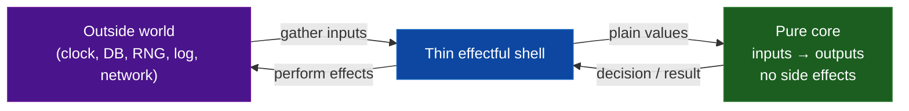

# Pure Functions — Practice Tasks

> Twelve hands-on exercises that turn impure, hard-to-test code into pure cores wrapped by thin effectful shells. Every task gives you a scenario, real impure code (Go / Java / Python — rotated), a precise instruction, and a collapsible full solution with the reasoning behind each move. Work top to bottom: difficulty climbs from "inject one dependency" to "carve a pure decision engine out of an I/O handler and prove it with property tests."

---

## Table of Contents

1. [Inject a Clock to Make a Time-Dependent Function Pure (Go)](#task-1--inject-a-clock-go--easy)
2. [Inject a Seeded RNG (Python)](#task-2--inject-a-seeded-rng-python--easy)
3. [Remove a Hidden Log Side Effect (Java)](#task-3--remove-a-hidden-log-side-effect-java--easy)
4. [Stop Reading a Mutable Global (Go)](#task-4--stop-reading-a-mutable-global-go--easy)
5. [Stop Mutating an Argument (Python)](#task-5--stop-mutating-an-argument-python--medium)
6. [Pure Core + Thin Effectful Shell (Go)](#task-6--pure-core--thin-effectful-shell-go--medium)
7. [Make a Function Safely Memoizable (Java)](#task-7--make-a-function-safely-memoizable-java--medium)
8. [Extract Pure Decision Logic from an I/O Handler (Python)](#task-8--extract-pure-decision-logic-from-an-io-handler-python--medium)
9. [Remove a Hidden Metrics/Counter Side Effect (Go)](#task-9--remove-a-hidden-metricscounter-side-effect-go--medium)
10. [Property-Based Test Enabled by Purity (Python)](#task-10--property-based-test-enabled-by-purity-python--hard)
11. [Purify a Tangled Pricing Engine (Java)](#task-11--purify-a-tangled-pricing-engine-java--hard)
12. [Purity Audit + Refactor Plan (Go — open-ended)](#task-12--purity-audit--refactor-plan-go--hard)

---

## How to Use

- **Read the impure code first and predict the failure.** Before opening the solution, name what makes the function impure: a hidden read (clock, global, RNG), a hidden write (log, metric, mutated argument), or both. The smell *is* the lesson.
- **Try it yourself.** Write your version, then diff it against the solution. The structural shape matters more than identical names.
- **Watch the shell shrink.** Across the medium and hard tasks, the recurring move is the same: push effects (I/O, time, randomness, logging) to the *edges* and leave a deterministic core that takes inputs and returns outputs. The pure core is where the logic lives; the shell is where the world touches it.
- **Verify with a test.** Each solution is testable with no mocks beyond a fake clock or fixed seed. If your refactor still needs a mocking framework to test the logic, the core is not pure yet.

The mental model for the whole set:



---

## Task 1 — Inject a Clock (Go) — Easy

**Scenario.** A subscription check calls `time.Now()` inside the function. Every test that exercises an expiry boundary has to either sleep, freeze the system clock, or accept that it passes today and fails next year.

**Impure code:**

```go
package billing

import "time"

type Subscription struct {
    ExpiresAt time.Time
}

// IsExpired reads the wall clock — impure and untestable at the boundary.
func IsExpired(s Subscription) bool {
    return time.Now().After(s.ExpiresAt)
}
```

**Instruction.** Make `IsExpired` pure by injecting the "current time" as data. Then show a test that pins the boundary without sleeping. Keep a thin convenience wrapper for production callers.

<details>
<summary>Solution</summary>

```go
package billing

import "time"

type Subscription struct {
    ExpiresAt time.Time
}

// IsExpiredAt is PURE: same (sub, now) always yields the same bool.
func IsExpiredAt(s Subscription, now time.Time) bool {
    return now.After(s.ExpiresAt)
}

// IsExpired is the thin shell: it reads the clock once, then delegates.
// The clock read lives here, at the edge — not inside the logic.
func IsExpired(s Subscription) bool {
    return IsExpiredAt(s, time.Now())
}
```

Test — no sleep, no clock mocking, deterministic forever:

```go
func TestIsExpiredAt(t *testing.T) {
    exp := time.Date(2026, 1, 1, 0, 0, 0, 0, time.UTC)
    sub := Subscription{ExpiresAt: exp}

    if IsExpiredAt(sub, exp.Add(-time.Second)) {
        t.Error("one second before expiry must not be expired")
    }
    if !IsExpiredAt(sub, exp.Add(time.Second)) {
        t.Error("one second after expiry must be expired")
    }
    // The exact boundary: After is strict, so now == ExpiresAt is NOT expired.
    if IsExpiredAt(sub, exp) {
        t.Error("exactly at expiry must not be expired (After is exclusive)")
    }
}
```

**Reasoning.** "Now" is an *input*, not an ambient fact the function reaches out and grabs. Passing it as a parameter makes the function deterministic — the defining property of purity. The wall-clock read still has to happen somewhere, so it moves to the shell (`IsExpired`), which production code calls and tests ignore. Note how passing the boundary value `exp` itself documents the exact semantics of `After` (exclusive), something you can only assert cleanly once time is data.

</details>

---

## Task 2 — Inject a Seeded RNG (Python) — Easy

**Scenario.** A token generator calls the module-level `random` functions. Two test runs produce two different tokens, so you can't assert on the output, and a flaky "collision" test occasionally fails for real.

**Impure code:**

```python
import random
import string

def generate_token(length: int = 8) -> str:
    # Reaches into global RNG state — non-deterministic, untestable output.
    return "".join(random.choice(string.ascii_uppercase) for _ in range(length))
```

**Instruction.** Make the function pure with respect to its randomness by injecting a `random.Random` instance (the source of entropy becomes an argument). Show a deterministic test using a fixed seed.

<details>
<summary>Solution</summary>

```python
import random
import string

def generate_token(rng: random.Random, length: int = 8) -> str:
    """Pure relative to `rng`: a given rng-state + length yields a fixed token.

    The function no longer *owns* entropy; the caller supplies it. This is the
    'dependency rejection' move applied to randomness.
    """
    alphabet = string.ascii_uppercase
    return "".join(rng.choice(alphabet) for _ in range(length))


# Thin shell for production: seed from the OS once, then delegate.
def generate_token_secure(length: int = 8) -> str:
    return generate_token(random.Random(), length)
```

Deterministic test — the seed pins the entire sequence:

```python
def test_generate_token_is_deterministic_under_seed():
    rng = random.Random(42)
    assert generate_token(rng, 6) == generate_token(random.Random(42), 6)

def test_generate_token_length_and_alphabet():
    token = generate_token(random.Random(1), 8)
    assert len(token) == 8
    assert all(c in string.ascii_uppercase for c in token)
```

**Reasoning.** Randomness is just another hidden input. `random.choice` without an argument reads *global* RNG state — the same category of impurity as reading a global variable. Injecting a `random.Random` turns "the function is unpredictable" into "the function is a deterministic mapping from `(rng_state, length)` to a string." Tests seed the RNG; production seeds from the OS in the shell. For cryptographic tokens you'd inject `secrets`/`SystemRandom` instead — but the structural point is identical: the entropy source is a parameter.

</details>

---

## Task 3 — Remove a Hidden Log Side Effect (Java) — Easy

**Scenario.** A discount calculator writes to a logger every time it runs. Code review flags it: the method is named like a calculation but secretly performs I/O, so calling it in a tight loop floods the logs, and a unit test for the math has to configure a logging backend.

**Impure code:**

```java
import org.slf4j.Logger;
import org.slf4j.LoggerFactory;

class DiscountCalculator {
    private static final Logger log = LoggerFactory.getLogger(DiscountCalculator.class);

    public double discountFor(double subtotal, boolean isMember) {
        double rate = isMember ? 0.10 : 0.0;
        double discount = subtotal * rate;
        log.info("Computed discount {} for subtotal {} (member={})", discount, subtotal, isMember);
        return discount;
    }
}
```

**Instruction.** Make `discountFor` pure by removing the logging side effect. Move the log to the calling shell so observability is preserved but the math stays a pure function.

<details>
<summary>Solution</summary>

```java
// Pure core: no logger field, no I/O, just arithmetic.
class DiscountCalculator {
    public double discountFor(double subtotal, boolean isMember) {
        double rate = isMember ? 0.10 : 0.0;
        return subtotal * rate;
    }
}
```

```java
// Effectful shell: it owns the logger and logs around the pure call.
class CheckoutService {
    private static final Logger log = LoggerFactory.getLogger(CheckoutService.class);
    private final DiscountCalculator calc = new DiscountCalculator();

    public double applyDiscount(double subtotal, boolean isMember) {
        double discount = calc.discountFor(subtotal, isMember); // pure
        log.info("Computed discount {} for subtotal {} (member={})", discount, subtotal, isMember);
        return discount;
    }
}
```

Test — no logging backend, no appender capture, just values:

```java
@Test
void memberGetsTenPercent() {
    var calc = new DiscountCalculator();
    assertEquals(10.0, calc.discountFor(100.0, true), 1e-9);
    assertEquals(0.0, calc.discountFor(100.0, false), 1e-9);
}
```

**Reasoning.** Logging is a side effect: it writes to the outside world and is invisible in the return value. A function that logs is no longer referentially transparent — you cannot replace `discountFor(100, true)` with `10.0` without losing the log line. The fix is the "functional core, imperative shell" split: the core computes, the shell observes. You keep every log line you had, but now the decision of *whether and how* to log belongs to the layer that orchestrates effects, and the math is trivially testable.

</details>

---

## Task 4 — Stop Reading a Mutable Global (Go) — Easy

**Scenario.** A tax function reads a package-level `TaxRate` variable that some config-loading code mutates at startup. Tests pass or fail depending on import order and on whether a previous test changed the global.

**Impure code:**

```go
package tax

// Mutated at startup by config loading; read by the function below.
var TaxRate = 0.07

// Total is impure: its result depends on hidden global state.
func Total(subtotal float64) float64 {
    return subtotal + subtotal*TaxRate
}
```

**Instruction.** Make `Total` pure by passing the rate in as a parameter instead of reading the global. Keep the global only as a default the shell supplies, if you want backward compatibility.

<details>
<summary>Solution</summary>

```go
package tax

// Pure: result is fully determined by its arguments.
func Total(subtotal, rate float64) float64 {
    return subtotal + subtotal*rate
}
```

```go
// Optional shell that preserves the old single-arg call site using configured state.
// The global lives here, at the edge, not inside the calculation.
var defaultRate = 0.07

func TotalAtDefaultRate(subtotal float64) float64 {
    return Total(subtotal, defaultRate)
}
```

Test — no global setup, no teardown, no inter-test leakage:

```go
func TestTotal(t *testing.T) {
    got := Total(100, 0.07)
    if got != 107 {
        t.Errorf("Total(100, 0.07) = %v, want 107", got)
    }
    // A different jurisdiction in the same test file — no shared mutable state.
    if Total(100, 0.20) != 120 {
        t.Errorf("Total(100, 0.20) = %v, want 120", Total(100, 0.20))
    }
}
```

**Reasoning.** A read of mutable global state is a hidden input. `Total(100)` can return 107 or 120 depending on what some other code did to `TaxRate` first — so it isn't a function of its arguments, and tests become order-dependent. Passing `rate` explicitly makes every dependency visible in the signature ("honest signatures"). The global doesn't have to disappear entirely; it just gets demoted to a default that the shell injects, so the pure core never reaches for ambient state.

</details>

---

## Task 5 — Stop Mutating an Argument (Python) — Medium

**Scenario.** A function "normalizes" a list of line items. It claims to return the normalized list, but it also mutates the caller's list in place. A caller that keeps a reference to the original is surprised when its data changes underneath it, and a "before/after" test can't compare because *before* got clobbered.

**Impure code:**

```python
def normalize_items(items: list[dict]) -> list[dict]:
    for item in items:                 # mutates each dict the caller still holds
        item["name"] = item["name"].strip().title()
        item["qty"] = max(0, item["qty"])
    items.sort(key=lambda i: i["name"])  # mutates the caller's list order too
    return items
```

**Instruction.** Make `normalize_items` pure: it must not touch the input. Return a brand-new normalized list, leaving the argument exactly as it was passed.

<details>
<summary>Solution</summary>

```python
def normalize_items(items: list[dict]) -> list[dict]:
    """Pure: builds and returns new data; the input is never mutated."""
    normalized = [
        {
            **item,
            "name": item["name"].strip().title(),
            "qty": max(0, item["qty"]),
        }
        for item in items
    ]
    # sorted() returns a NEW list; .sort() would mutate in place.
    return sorted(normalized, key=lambda i: i["name"])
```

Test — the original is provably untouched:

```python
def test_normalize_does_not_mutate_input():
    original = [{"name": " banana ", "qty": -3}, {"name": "apple", "qty": 2}]
    snapshot = [dict(i) for i in original]  # deep-ish copy for comparison

    result = normalize_items(original)

    assert original == snapshot                      # input unchanged
    assert result == [{"name": "Apple", "qty": 2},
                      {"name": "Banana", "qty": 0}]   # new, normalized, sorted
    assert result is not original                     # different object
```

**Reasoning.** Mutating an argument is a side effect that leaks out through aliasing: the caller and callee now share state, and the function's behavior depends on whether anyone else holds a reference. Purity demands that inputs are treated as immutable. The fix uses non-mutating operations throughout — a comprehension that builds new dicts (`{**item, ...}`) and `sorted()` instead of `.sort()`. The function becomes a clean value-to-value transform, and the test can assert on both the result *and* the untouched original. If the dicts contained nested mutables you'd reach for `copy.deepcopy` or, better, frozen dataclasses to enforce immutability structurally.

</details>

---

## Task 6 — Pure Core + Thin Effectful Shell (Go) — Medium

**Scenario.** A single function reads a file, parses CSV rows into orders, filters out the cancelled ones, sums the totals, and prints the result. It mixes file I/O, parsing, business logic, and output. You can't test the "sum non-cancelled orders" rule without a real file on disk.

**Impure code:**

```go
package report

import (
    "encoding/csv"
    "fmt"
    "os"
    "strconv"
)

func PrintActiveRevenue(path string) error {
    f, err := os.Open(path)
    if err != nil {
        return err
    }
    defer f.Close()

    rows, err := csv.NewReader(f).ReadAll()
    if err != nil {
        return err
    }

    var total float64
    for _, row := range rows {
        status := row[2]
        if status == "CANCELLED" {
            continue
        }
        amt, _ := strconv.ParseFloat(row[1], 64)
        total += amt
    }
    fmt.Printf("Active revenue: %.2f\n", total)
    return nil
}
```

**Instruction.** Split this into a pure core that takes already-parsed orders and returns the revenue, and a thin shell that does file I/O and printing. Test the core with no files and no stdout capture.

<details>
<summary>Solution</summary>

```go
package report

import (
    "encoding/csv"
    "fmt"
    "os"
    "strconv"
)

type Order struct {
    ID     string
    Amount float64
    Status string
}

// PURE CORE: orders in, number out. No I/O, no clock, no globals.
func ActiveRevenue(orders []Order) float64 {
    var total float64
    for _, o := range orders {
        if o.Status == "CANCELLED" {
            continue
        }
        total += o.Amount
    }
    return total
}

// SHELL: all effects live here — file read, parse, print.
func PrintActiveRevenue(path string) error {
    orders, err := loadOrders(path)
    if err != nil {
        return err
    }
    fmt.Printf("Active revenue: %.2f\n", ActiveRevenue(orders))
    return nil
}

func loadOrders(path string) ([]Order, error) {
    f, err := os.Open(path)
    if err != nil {
        return nil, err
    }
    defer f.Close()

    rows, err := csv.NewReader(f).ReadAll()
    if err != nil {
        return nil, err
    }

    orders := make([]Order, 0, len(rows))
    for _, row := range rows {
        amt, err := strconv.ParseFloat(row[1], 64)
        if err != nil {
            return nil, fmt.Errorf("bad amount %q: %w", row[1], err)
        }
        orders = append(orders, Order{ID: row[0], Amount: amt, Status: row[2]})
    }
    return orders, nil
}
```

Test — the business rule, isolated from disk and stdout:

```go
func TestActiveRevenue(t *testing.T) {
    orders := []Order{
        {"1", 100, "PAID"},
        {"2", 50, "CANCELLED"},
        {"3", 25, "PENDING"},
    }
    if got := ActiveRevenue(orders); got != 125 {
        t.Errorf("ActiveRevenue = %v, want 125", got)
    }
    if got := ActiveRevenue(nil); got != 0 {
        t.Errorf("empty = %v, want 0", got)
    }
}
```

**Reasoning.** The original function had four reasons to change (I/O format, parse format, business rule, output channel) braided into one body, and the only way to test the *rule* was through the *file*. Splitting it yields a pure `ActiveRevenue([]Order) float64` that is trivially testable and a `loadOrders` parser whose error handling actually got better in the process (the silent `_` on `ParseFloat` became a real error). The shell is thin enough to verify with one integration test, while every interesting edge case (cancelled orders, empty input, mixed statuses) is covered against the pure core in microseconds.

</details>

---

## Task 7 — Make a Function Safely Memoizable (Java) — Medium

**Scenario.** Someone wrapped an "expensive" shipping-cost function in a cache to speed it up. The cache returns stale values: the function secretly reads the current date to apply a weekend surcharge, so a value cached on Friday is wrong on Saturday. Memoization is only correct on pure functions, and this one isn't.

**Impure code:**

```java
import java.time.DayOfWeek;
import java.time.LocalDate;
import java.util.HashMap;
import java.util.Map;

class ShippingCalculator {
    private final Map<Double, Double> cache = new HashMap<>();

    // BUG: cached by weight, but the result also depends on today's day-of-week.
    public double cost(double weightKg) {
        return cache.computeIfAbsent(weightKg, this::computeCost);
    }

    private double computeCost(double weightKg) {
        double base = weightKg * 2.5;
        if (LocalDate.now().getDayOfWeek() == DayOfWeek.SATURDAY
                || LocalDate.now().getDayOfWeek() == DayOfWeek.SUNDAY) {
            base *= 1.5; // weekend surcharge — a hidden time-dependent input!
        }
        return base;
    }
}
```

**Instruction.** Make the cost function pure so it becomes legitimately memoizable. The hidden time input must become an explicit parameter, and the cache key must include *every* input the result depends on.

<details>
<summary>Solution</summary>

```java
import java.time.DayOfWeek;
import java.time.LocalDate;
import java.util.Map;
import java.util.concurrent.ConcurrentHashMap;

class ShippingCalculator {
    // PURE: cost is a function of (weight, day). Same inputs -> same output, forever.
    public double cost(double weightKg, DayOfWeek day) {
        double base = weightKg * 2.5;
        boolean weekend = day == DayOfWeek.SATURDAY || day == DayOfWeek.SUNDAY;
        return weekend ? base * 1.5 : base;
    }
}
```

```java
// Memoization is now CORRECT because the key contains all inputs.
class MemoizedShipping {
    private final ShippingCalculator calc = new ShippingCalculator();
    private final Map<Key, Double> cache = new ConcurrentHashMap<>();

    private record Key(double weightKg, DayOfWeek day) {}

    public double cost(double weightKg, DayOfWeek day) {
        return cache.computeIfAbsent(new Key(weightKg, day),
                k -> calc.cost(k.weightKg(), k.day()));
    }
}

// SHELL: reads the clock once, then calls the pure (and now cacheable) function.
class ShippingShell {
    private final MemoizedShipping shipping = new MemoizedShipping();

    public double costToday(double weightKg) {
        return shipping.cost(weightKg, LocalDate.now().getDayOfWeek());
    }
}
```

Test — purity makes the cache provably correct:

```java
@Test
void weekendSurchargeApplies() {
    var calc = new ShippingCalculator();
    assertEquals(25.0, calc.cost(10, DayOfWeek.MONDAY), 1e-9);
    assertEquals(37.5, calc.cost(10, DayOfWeek.SATURDAY), 1e-9);
}

@Test
void cacheKeyDistinguishesDays() {
    var memo = new MemoizedShipping();
    assertEquals(25.0, memo.cost(10, DayOfWeek.MONDAY), 1e-9);
    assertEquals(37.5, memo.cost(10, DayOfWeek.SATURDAY), 1e-9); // not the stale Monday value
}
```

**Reasoning.** Memoization substitutes a stored result for a recomputation; that substitution is only valid when the function is referentially transparent — i.e. pure. The original cached on `weight` alone while the *real* signature was `(weight, dayOfWeek)`, so the cache silently returned wrong answers across a day boundary. The cure is the same as the clock task: make the hidden time input explicit. Once `cost(weight, day)` is pure, the cache key can include *all* inputs, and memoization becomes safe. The clock read retreats to the shell. A pure function is the *precondition* for caching, not an afterthought.

</details>

---

## Task 8 — Extract Pure Decision Logic from an I/O Handler (Python) — Medium

**Scenario.** An HTTP handler decides whether to grant a user access to a resource. The authorization rules — role checks, ownership, account status — are tangled with request parsing, database lookups, logging, and response building. The rules are the part most likely to have bugs, yet they're the hardest to test because every test needs a fake request and a fake database.

**Impure code:**

```python
def handle_access(request, db, logger):
    user_id = request.headers.get("X-User-Id")
    if user_id is None:
        return Response(401, "missing user id")

    user = db.get_user(user_id)
    doc = db.get_document(request.path_params["doc_id"])

    if user is None or doc is None:
        logger.warning("access miss: user=%s", user_id)
        return Response(404, "not found")

    # --- the actual authorization rules, buried in I/O ---
    if user["status"] != "active":
        return Response(403, "account inactive")
    if doc["owner_id"] == user_id:
        granted = True
    elif user["role"] == "admin":
        granted = True
    elif doc["visibility"] == "public":
        granted = True
    else:
        granted = False

    if not granted:
        logger.info("denied user=%s doc=%s", user_id, doc["id"])
        return Response(403, "forbidden")

    db.record_access(user_id, doc["id"])
    return Response(200, doc["body"])
```

**Instruction.** Extract the authorization rules into a pure function `decide_access(user, doc) -> Decision` that takes plain data and returns a decision value (not a `Response`, not a log call). Leave the handler as a thin shell that fetches data, calls the pure decision, and performs effects based on it.

<details>
<summary>Solution</summary>

```python
from dataclasses import dataclass
from enum import Enum, auto

class Access(Enum):
    GRANTED = auto()
    INACTIVE = auto()
    FORBIDDEN = auto()

@dataclass(frozen=True)
class Decision:
    access: Access
    reason: str  # for the shell to log/return; the core just states the verdict


# PURE CORE: (user, doc) -> Decision. No request, no db, no logger, no Response.
def decide_access(user: dict, doc: dict) -> Decision:
    if user["status"] != "active":
        return Decision(Access.INACTIVE, "account inactive")
    if doc["owner_id"] == user["id"]:
        return Decision(Access.GRANTED, "owner")
    if user["role"] == "admin":
        return Decision(Access.GRANTED, "admin")
    if doc["visibility"] == "public":
        return Decision(Access.GRANTED, "public document")
    return Decision(Access.FORBIDDEN, "no matching grant")


# SHELL: parsing, lookups, logging, audit write, response building.
def handle_access(request, db, logger):
    user_id = request.headers.get("X-User-Id")
    if user_id is None:
        return Response(401, "missing user id")

    user = db.get_user(user_id)
    doc = db.get_document(request.path_params["doc_id"])
    if user is None or doc is None:
        logger.warning("access miss: user=%s", user_id)
        return Response(404, "not found")

    decision = decide_access(user, doc)   # the one pure call

    if decision.access is Access.GRANTED:
        db.record_access(user["id"], doc["id"])
        return Response(200, doc["body"])
    if decision.access is Access.INACTIVE:
        return Response(403, decision.reason)

    logger.info("denied user=%s doc=%s reason=%s", user_id, doc["id"], decision.reason)
    return Response(403, decision.reason)
```

Test — every authorization rule, with dictionaries and zero mocks:

```python
def test_decide_access_rules():
    active = {"id": "u1", "status": "active", "role": "user"}
    owned = {"id": "d1", "owner_id": "u1", "visibility": "private"}
    assert decide_access(active, owned).access is Access.GRANTED

    admin = {"id": "u2", "status": "active", "role": "admin"}
    private = {"id": "d2", "owner_id": "other", "visibility": "private"}
    assert decide_access(admin, private).access is Access.GRANTED

    public = {"id": "d3", "owner_id": "other", "visibility": "public"}
    assert decide_access(active, public).access is Access.GRANTED

    secret = {"id": "d4", "owner_id": "other", "visibility": "private"}
    assert decide_access(active, secret).access is Access.FORBIDDEN

    inactive = {"id": "u3", "status": "suspended", "role": "user"}
    assert decide_access(inactive, owned).access is Access.INACTIVE
```

**Reasoning.** The riskiest code here is the policy — the cascade of grant rules — and in the original it could only be reached through HTTP parsing and database stubs. Extracting `decide_access(user, doc) -> Decision` isolates the policy as a pure function over plain data: every branch is a one-line test with literal dicts. Crucially, the core returns a *decision value*, not a `Response` and not a log line; translating that verdict into HTTP status, audit writes, and log messages is the shell's job. This is the functional-core/imperative-shell split applied to a web handler, and it's where property-based and table-driven testing become cheap.

</details>

---

## Task 9 — Remove a Hidden Metrics/Counter Side Effect (Go) — Medium

**Scenario.** A scoring function increments a Prometheus-style counter every time a request is classified as "high risk." Two problems: the function looks pure but mutates a global metric, and a test that calls it 1,000 times to check the math also pollutes the metrics registry, making metric-based assertions in other tests flaky.

**Impure code:**

```go
package risk

var highRiskCounter int // package-global, mutated as a side effect

// Score looks pure but secretly bumps a global counter.
func Score(amount float64, country string, newAccount bool) int {
    score := 0
    if amount > 10000 {
        score += 50
    }
    if country == "XX" {
        score += 30
    }
    if newAccount {
        score += 25
    }
    if score >= 50 {
        highRiskCounter++ // hidden write to global state
    }
    return score
}
```

**Instruction.** Make `Score` pure — it must only compute and return the score. The "high risk" classification can be a pure helper. Move the counter increment into a shell that calls `Score`, inspects the result, and records the metric.

<details>
<summary>Solution</summary>

```go
package risk

// PURE: score is a function of its three inputs, nothing else.
func Score(amount float64, country string, newAccount bool) int {
    score := 0
    if amount > 10000 {
        score += 50
    }
    if country == "XX" {
        score += 30
    }
    if newAccount {
        score += 25
    }
    return score
}

// PURE classification helper — still no side effects.
func IsHighRisk(score int) bool {
    return score >= 50
}
```

```go
package risk

// Shell: depends on a metric sink interface, so even the metric is testable.
type Metrics interface {
    IncHighRisk()
}

func Evaluate(m Metrics, amount float64, country string, newAccount bool) int {
    score := Score(amount, country, newAccount) // pure
    if IsHighRisk(score) {
        m.IncHighRisk() // the side effect lives here, behind an interface
    }
    return score
}
```

Test — math is pure; the metric is asserted via a fake, not a global:

```go
func TestScore(t *testing.T) {
    if got := Score(20000, "US", false); got != 50 {
        t.Errorf("Score = %d, want 50", got)
    }
    if got := Score(100, "US", false); got != 0 {
        t.Errorf("Score = %d, want 0", got)
    }
    // Calling it a million times changes no global state.
    for i := 0; i < 1_000_000; i++ {
        _ = Score(100, "US", false)
    }
}

type fakeMetrics struct{ highRisk int }
func (f *fakeMetrics) IncHighRisk() { f.highRisk++ }

func TestEvaluateRecordsMetric(t *testing.T) {
    m := &fakeMetrics{}
    Evaluate(m, 20000, "XX", true) // score 105 -> high risk
    if m.highRisk != 1 {
        t.Errorf("highRisk = %d, want 1", m.highRisk)
    }
}
```

**Reasoning.** Metrics, like logging, are output side effects — a write to the outside world hidden behind a "calculate" name. The danger is doubled here because the side effect targets *global* state, so tests that hammer `Score` to verify arithmetic corrupt the metric, and metric assertions become order-dependent. Splitting `Score` (pure math) from `Evaluate` (records the metric through an injected `Metrics` interface) lets you test the scoring rules a million times for free and assert the metric behavior precisely with a fake. The general rule: instrumentation belongs in the shell, behind an interface, never baked into the calculation.

</details>

---

## Task 10 — Property-Based Test Enabled by Purity (Python) — Hard

**Scenario.** You've purified a `apply_discount(price_cents, percent)` function. Because it's now pure and deterministic, you can test *properties* that must hold for all inputs, not just a handful of hand-picked examples. The original example-based tests missed a rounding bug at certain percentages.

**Impure-ish starting code (already partly cleaned, but with a lurking bug):**

```python
def apply_discount(price_cents: int, percent: int) -> int:
    # Returns the discounted price in integer cents.
    # BUG: float math + int() truncation can produce off-by-one and even negatives.
    return int(price_cents - price_cents * (percent / 100))
```

**Instruction.** First fix the function so it's pure *and* correct (integer arithmetic, clamped percent, never negative, never above original). Then write property-based tests (using Hypothesis) that exercise invariants across the whole input space — invariants that are only meaningful because the function is pure.

<details>
<summary>Solution</summary>

```python
def apply_discount(price_cents: int, percent: int) -> int:
    """Pure: integer cents in, integer cents out. No floats, no side effects.

    Invariants enforced by construction:
      - percent is clamped to [0, 100]
      - result is in [0, price_cents]
    """
    if price_cents < 0:
        raise ValueError("price_cents must be non-negative")
    p = max(0, min(100, percent))
    # Integer arithmetic: round-half-up without float error.
    discount = (price_cents * p + 50) // 100
    return price_cents - discount
```

Property-based tests — possible *because* the function is pure:

```python
from hypothesis import given, strategies as st

prices = st.integers(min_value=0, max_value=10_000_000)
percents = st.integers(min_value=-50, max_value=200)  # deliberately out of range too

@given(prices, percents)
def test_result_never_exceeds_original(price, percent):
    assert apply_discount(price, percent) <= price

@given(prices, percents)
def test_result_never_negative(price, percent):
    assert apply_discount(price, percent) >= 0

@given(prices)
def test_zero_percent_is_identity(price):
    assert apply_discount(price, 0) == price

@given(prices)
def test_hundred_percent_is_free(price):
    assert apply_discount(price, 100) == 0

@given(prices, st.integers(min_value=0, max_value=100), st.integers(min_value=0, max_value=100))
def test_monotonic_in_percent(price, a, b):
    # A bigger discount percentage never yields a higher final price.
    lo, hi = sorted((a, b))
    assert apply_discount(price, hi) <= apply_discount(price, lo)

@given(prices, percents)
def test_referential_transparency(price, percent):
    # Calling twice with the same inputs yields the same output — the
    # defining property of a pure function, and what makes the cases above
    # safe to generalize across the entire input space.
    assert apply_discount(price, percent) == apply_discount(price, percent)
```

**Reasoning.** Property-based testing asks "what must be true for *every* input?" — monotonicity, bounds, identity at the extremes — and lets the framework hunt for counterexamples. This only works on pure functions: if the function read a clock, a global, or an RNG, "the same input gives the same output" would be false, and the framework's shrinking and replay would be meaningless. The float-based original violated `result >= 0` and `result <= price` at certain percent values; Hypothesis would find a falsifying example in milliseconds. The integer rewrite (`(price*p + 50)//100` for round-half-up) makes every invariant hold by construction. Purity is the enabler: it's what turns a few examples into a proof-shaped statement about the whole domain.

</details>

---

## Task 11 — Purify a Tangled Pricing Engine (Java) — Hard

**Scenario.** An order-pricing method reads the current time (for happy-hour pricing), reads a mutable global feature-flag, calls a live FX-rate service over the network, logs each step, and mutates the incoming `Order` object to stamp the computed total. It is impossible to unit test the pricing rules without a network, a clock, a flag registry, and an appender. Everything that can be wrong with purity is wrong here at once.

**Impure code:**

```java
class PricingEngine {
    static boolean HAPPY_HOUR_ENABLED = true; // mutable global flag

    double priceOrder(Order order, String targetCurrency) {
        double subtotal = 0;
        for (LineItem item : order.getItems()) {
            subtotal += item.getUnitPriceUsd() * item.getQty();
        }

        // happy hour: 10% off between 16:00 and 18:00 local time
        int hour = LocalTime.now().getHour();          // hidden clock read
        if (HAPPY_HOUR_ENABLED && hour >= 16 && hour < 18) { // hidden global read
            subtotal *= 0.90;
        }

        double rate = FxService.liveRate("USD", targetCurrency); // hidden network call
        double total = subtotal * rate;

        Logger.log("priced order " + order.getId() + " = " + total); // hidden I/O
        order.setComputedTotal(total);                  // mutates the argument
        return total;
    }
}
```

**Instruction.** Refactor into (a) a pure pricing core that takes every input explicitly — items, whether happy hour applies, the FX rate — and returns an immutable result without mutating the order; and (b) a thin shell that gathers the clock reading, flag, and FX rate, calls the core, then logs and persists. List each of the five impurities and where it goes.

<details>
<summary>Solution</summary>

```java
import java.time.LocalTime;
import java.util.List;

// Immutable result — the core returns a value, it does not stamp the order.
record PricedOrder(String orderId, double subtotalUsd, double total, String currency) {}

class PricingEngine {

    // PURE CORE: every dependency is an explicit argument.
    // (items, happyHour, fxRate, targetCurrency) -> PricedOrder.
    PricedOrder price(String orderId, List<LineItem> items,
                      boolean happyHour, double fxRate, String targetCurrency) {
        double subtotal = 0;
        for (LineItem item : items) {
            subtotal += item.getUnitPriceUsd() * item.getQty();
        }
        if (happyHour) {
            subtotal *= 0.90;
        }
        double total = subtotal * fxRate;
        return new PricedOrder(orderId, subtotal, total, targetCurrency);
    }

    // PURE helper: the happy-hour rule is itself a deterministic function of time.
    static boolean isHappyHour(LocalTime now, boolean flagEnabled) {
        int hour = now.getHour();
        return flagEnabled && hour >= 16 && hour < 18;
    }
}
```

```java
// SHELL: gathers all effectful inputs, calls the pure core, performs effects.
class PricingService {
    private final PricingEngine engine = new PricingEngine();
    private final FxService fx;
    private final FeatureFlags flags;
    private final Clock clock;       // java.time.Clock — injectable
    private final Logger logger;
    private final OrderRepository repo;

    PricingService(FxService fx, FeatureFlags flags, Clock clock,
                   Logger logger, OrderRepository repo) {
        this.fx = fx; this.flags = flags; this.clock = clock;
        this.logger = logger; this.repo = repo;
    }

    double priceOrder(Order order, String targetCurrency) {
        boolean happyHour = PricingEngine.isHappyHour(
                LocalTime.now(clock), flags.isEnabled("HAPPY_HOUR"));
        double rate = fx.liveRate("USD", targetCurrency);

        PricedOrder result = engine.price(            // the one pure call
                order.getId(), order.getItems(), happyHour, rate, targetCurrency);

        logger.info("priced order {} = {}", result.orderId(), result.total());
        repo.saveComputedTotal(order.getId(), result.total()); // persist, don't mutate caller's object
        return result.total();
    }
}
```

Test — the entire pricing rule set, with no network/clock/flag/log:

```java
@Test
void happyHourAppliesTenPercentThenConvertsCurrency() {
    var engine = new PricingEngine();
    var items = List.of(new LineItem(100.0, 2), new LineItem(50.0, 1)); // 250 USD
    // happyHour=true -> 225 USD; fxRate 0.9 -> 202.5 in EUR
    var result = engine.price("ord-1", items, true, 0.9, "EUR");
    assertEquals(225.0, result.subtotalUsd(), 1e-9);
    assertEquals(202.5, result.total(), 1e-9);
    assertEquals("EUR", result.currency());
}

@Test
void isHappyHourRespectsTimeAndFlag() {
    assertTrue(PricingEngine.isHappyHour(LocalTime.of(16, 30), true));
    assertFalse(PricingEngine.isHappyHour(LocalTime.of(15, 59), true));
    assertFalse(PricingEngine.isHappyHour(LocalTime.of(16, 30), false)); // flag off
}
```

**Where each impurity went:**

| Impurity (original) | Category | Where it lives now |
|---|---|---|
| `LocalTime.now()` | hidden clock read | Shell reads `LocalTime.now(clock)`; core takes the `happyHour` boolean. Injectable `Clock` makes even the shell testable. |
| `HAPPY_HOUR_ENABLED` global | mutable global read | Shell reads `flags.isEnabled(...)`; core receives a plain `boolean`. |
| `FxService.liveRate(...)` | hidden network call | Shell fetches `rate`; core takes `double fxRate` as a parameter. |
| `Logger.log(...)` | hidden output I/O | Moved to shell, around the pure call. |
| `order.setComputedTotal(...)` | argument mutation | Core returns an immutable `PricedOrder`; shell persists via repository instead of mutating the caller's object. |

**Reasoning.** This is every prior task combined. The discipline is mechanical and repeatable: for each impurity, decide whether it's a hidden *input* (clock, flag, FX rate — turn it into a parameter) or a hidden *output* (log, mutation — turn it into a return value the shell acts on). What remains is `price(items, happyHour, fxRate, currency) -> PricedOrder`, a function whose entire behavior is visible in its signature and whose every branch is a one-line, mock-free test. The shell that wires up clock, flags, FX, logging, and persistence is thin enough to cover with a single integration test.

</details>

---

## Task 12 — Purity Audit + Refactor Plan (Go — open-ended)

**Scenario.** Below is a realistic notification function. Identify **every** source of impurity, classify each as a hidden input or a hidden output, and write a one-line plan for making it pure-core + thin-shell. Then sketch the resulting signatures.

```go
package notify

import (
    "fmt"
    "math/rand"
    "time"
)

var SentToday int // package global, mutated below

func SendDigest(userID string, unread []Message) error {
    // throttle: skip if it's the middle of the night
    if time.Now().Hour() < 7 {
        return nil
    }

    // pick a random subject-line variant for A/B testing
    variant := rand.Intn(2)
    subject := "Your daily digest"
    if variant == 1 {
        subject = "You have unread messages"
    }

    body := fmt.Sprintf("Hi %s, you have %d unread messages.", userID, len(unread))

    // sort unread in place, newest first
    for i := 0; i < len(unread); i++ {
        for j := i + 1; j < len(unread); j++ {
            if unread[j].CreatedAt.After(unread[i].CreatedAt) {
                unread[i], unread[j] = unread[j], unread[i]
            }
        }
    }

    if err := smtp.Send(userID, subject, body); err != nil { // network I/O
        return err
    }
    SentToday++ // mutate global counter
    fmt.Printf("sent digest to %s\n", userID) // stdout I/O
    return nil
}
```

<details>
<summary>Solution</summary>

**Impurity audit:**

| # | Source | Category | Why it's impure |
|---|---|---|---|
| 1 | `time.Now().Hour()` | hidden input (clock) | Throttle decision depends on wall-clock time not in the signature. |
| 2 | `rand.Intn(2)` | hidden input (RNG) | A/B variant depends on global RNG state; output is non-deterministic. |
| 3 | in-place sort of `unread` | hidden output (argument mutation) | Reorders the caller's slice via aliasing. |
| 4 | `smtp.Send(...)` | hidden output (network I/O) | Sends an email — the whole point, but it's an effect. |
| 5 | `SentToday++` | hidden output (global mutation) | Writes shared mutable global state. |
| 6 | `fmt.Printf(...)` | hidden output (stdout I/O) | Logging side effect. |

**Refactor plan (one line each):**

1. **Clock** → pass `now time.Time` (or a `shouldSend bool`) into the core; the shell reads `time.Now()`.
2. **RNG** → pass the chosen `variant int` (or a `*rand.Rand`) in; the shell draws it once.
3. **Sort** → return a *new* sorted slice from the core via `slices.Clone` + `slices.SortFunc`; never touch the caller's slice.
4. **smtp.Send** → the core returns a `DigestEmail` value (recipient, subject, body); the shell sends it.
5. **Global counter** → drop the global; the shell increments its own counter or a metrics sink after a successful send.
6. **Printf** → the shell logs after sending; the core stays silent.

**Resulting signatures:**

```go
package notify

import (
    "slices"
    "time"
)

type DigestEmail struct {
    To      string
    Subject string
    Body    string
}

// PURE CORE: all inputs explicit, returns a value, mutates nothing.
// Returns (email, ok) — ok=false means "throttled, nothing to send".
func BuildDigest(userID string, unread []Message, hour, variant int) (DigestEmail, bool) {
    if hour < 7 {
        return DigestEmail{}, false
    }
    subject := "Your daily digest"
    if variant == 1 {
        subject = "You have unread messages"
    }
    sorted := slices.Clone(unread) // copy: never mutate the argument
    slices.SortFunc(sorted, func(a, b Message) int {
        return b.CreatedAt.Compare(a.CreatedAt) // newest first
    })
    body := formatBody(userID, len(sorted))
    return DigestEmail{To: userID, Subject: subject, Body: body}, true
}

func formatBody(userID string, n int) string {
    return fmt.Sprintf("Hi %s, you have %d unread messages.", userID, n)
}
```

```go
// SHELL: gathers clock + RNG, calls the pure core, performs the effects.
type Sender interface{ Send(to, subject, body string) error }

func SendDigest(s Sender, metrics *Counter, now time.Time,
    rng *rand.Rand, userID string, unread []Message) error {

    email, ok := BuildDigest(userID, unread, now.Hour(), rng.Intn(2))
    if !ok {
        return nil // throttled
    }
    if err := s.Send(email.To, email.Subject, email.Body); err != nil {
        return err
    }
    metrics.Inc()
    log.Printf("sent digest to %s", email.To)
    return nil
}
```

**Reasoning.** The audit table is the reusable skill: walk the function line by line and tag each external interaction as a hidden input or a hidden output. Hidden inputs become parameters; hidden outputs become return values (or move to the shell). What's left — `BuildDigest(userID, unread, hour, variant) -> (DigestEmail, bool)` — is a pure function you can test exhaustively: throttling at the 7 a.m. boundary, both A/B variants, the sort order, the empty-inbox body, and the guarantee that the input slice is never reordered. Every genuinely effectful concern (clock, RNG draw, SMTP, counter, log) is concentrated in a shell thin enough to read at a glance.

</details>

---

## Self-Assessment

Rate yourself on each skill. You should be able to do all of these without re-reading the solutions.

- [ ] **Spot a hidden input.** Given a function, can you name every clock read, global read, RNG draw, or service call hiding in its body?
- [ ] **Spot a hidden output.** Can you find the logs, metrics, argument mutations, and global writes that don't appear in the return type?
- [ ] **Turn an input into a parameter.** Inject a clock, a seed/RNG, a feature flag, or a fetched value so the function is deterministic.
- [ ] **Turn an output into a return value.** Replace a log/metric/mutation with a value the shell acts on.
- [ ] **Apply functional core / imperative shell.** Split an I/O-heavy function into a pure core plus a thin effectful shell, and articulate which lines went where and why.
- [ ] **Justify memoization.** Explain why a cache is only correct on a pure function, and build a cache key that includes *all* inputs.
- [ ] **Write a property test.** State an invariant (bounds, monotonicity, identity, round-trip) and test it across the whole input space — and explain why purity is what makes that valid.
- [ ] **Audit and plan.** Walk an unfamiliar function, produce an impurity table (input vs. output), and write the resulting pure-core/shell signatures.

If any box is unchecked, the matching task above (and the in-folder companions below) is where to drill.

---

## Related Topics

- [junior.md](junior.md) — the beginner's definition of a pure function and why determinism + no side effects matters.
- [find-bug.md](find-bug.md) — buggy snippets where a hidden side effect or mutated argument is the root cause.
- [optimize.md](optimize.md) — performance work (memoization, batching) that only becomes safe once a function is pure.
- [Chapter README](../README.md) — the positive rules for writing pure functions in everyday code.
- [Functional Programming](../../functional-programming/README.md) — referential transparency, immutability, and the theory behind functional core / imperative shell.
- [Refactoring](../../refactoring/README.md) — the mechanical moves (Extract Function, Parameterize, Remove Side Effect) used throughout these solutions.
