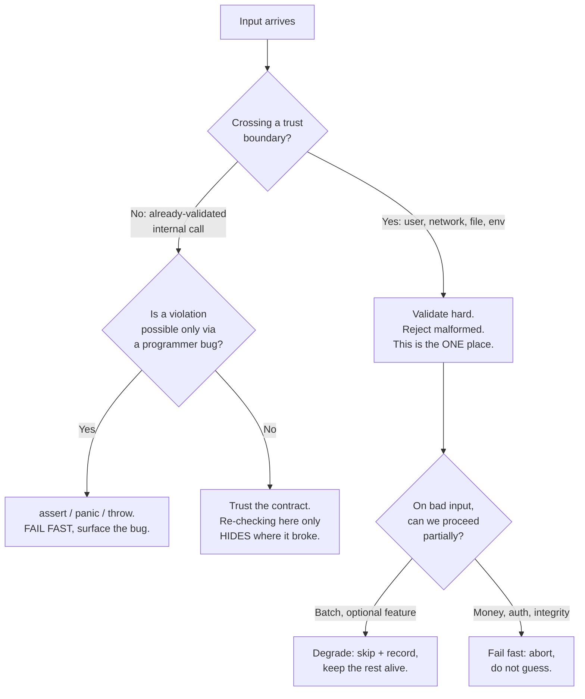

# Defensive vs Offensive — Find the Bug

> 12 buggy snippets where the bug is a *misjudgment about defense*. Either the code defends in the wrong place (so a real bug slips through or hides), or it fails-fast where it should degrade — and degrades where it should fail-fast. Find the wrong call before reading the answer.

The hard part of defensive vs offensive programming is not *whether* to validate — it's *where* and *how loudly*. Validate at the trust boundary and you stay clean. Validate everywhere and you mask the bug's origin. Fail fast on a programmer error and you find it in seconds; "fail safe" on the same error and you ship corruption to production. Each snippet below makes exactly one of these calls wrong.

---

## Table of Contents

1. [Snippet 1 — Assertion as the only validation (Python)](#snippet-1--assertion-as-the-only-validation-python) · *Medium*
2. [Snippet 2 — The catch-all that ate the bug (Java)](#snippet-2--the-catch-all-that-ate-the-bug-java) · *Easy*
3. [Snippet 3 — Trust boundary with no validation (Go)](#snippet-3--trust-boundary-with-no-validation-go) · *Medium*
4. [Snippet 4 — Over-defensive null check returns a lie (Java)](#snippet-4--over-defensive-null-check-returns-a-lie-java) · *Medium*
5. [Snippet 5 — One bad record crashes the whole batch (Python)](#snippet-5--one-bad-record-crashes-the-whole-batch-python) · *Easy*
6. [Snippet 6 — Caller and callee both check, and disagree (Go)](#snippet-6--caller-and-callee-both-check-and-disagree-go) · *Hard*
7. [Snippet 7 — Internal trust applied to external input (Java)](#snippet-7--internal-trust-applied-to-external-input-java) · *Medium*
8. [Snippet 8 — Postel too liberal: lenient parser, broken downstream (Python)](#snippet-8--postel-too-liberal-lenient-parser-broken-downstream-python) · *Hard*
9. [Snippet 9 — Swallowed error leaves a half-written state (Go)](#snippet-9--swallowed-error-leaves-a-half-written-state-go) · *Medium*
10. [Snippet 10 — Defensive default hides a configuration bug (Java)](#snippet-10--defensive-default-hides-a-configuration-bug-java) · *Medium*
11. [Snippet 11 — Negative quantity passes the guard (Go)](#snippet-11--negative-quantity-passes-the-guard-go) · *Hard*
12. [Snippet 12 — Clamping input that should have been rejected (Python)](#snippet-12--clamping-input-that-should-have-been-rejected-python) · *Hard*

---

## How to Use

For each snippet:

1. Read the code and ask the single diagnostic question: **does this code defend in the right place, and does it fail at the right volume?** A guard in the wrong layer is worse than no guard — it hides the bug's origin. A `try`/`catch` that swallows a `NullPointerException` turns a five-minute stack trace into a week of corrupted-data forensics.
2. Decide: should this point **fail fast** (programmer error, broken invariant, corrupt input you can't safely interpret) or **degrade gracefully** (one bad item in a batch, an optional feature, a recoverable transient fault)?
3. Open the answer. Each gives the bug, the *defensive/offensive misjudgment* behind it, and the fix.

The mental model:



---

### Snippet 1 — Assertion as the only validation (Python)

*Difficulty: Medium*

```python
def withdraw(account: Account, amount: int) -> None:
    # amount comes from the public /withdraw HTTP endpoint
    assert amount > 0, "amount must be positive"
    assert amount <= account.balance, "insufficient funds"
    account.balance -= amount
    ledger.record(account.id, -amount)


# Deployed with: python -O server.py   (production runs optimized)
```

**Where is the bug?**

<details><summary>Hint</summary>

What does the `-O` flag do to `assert` statements? And where does `amount` come from?
</details>

<details><summary>Answer</summary>

`assert` statements are **stripped entirely** when Python runs with `-O` (optimized mode), which production deployments commonly enable. In production, both checks vanish. A request with `amount = -1000` then runs `balance -= -1000` — it *credits* the account by $1000 and records a negative-of-negative in the ledger. A request with `amount` exceeding the balance overdraws freely.

**The misjudgment:** `assert` is for *programmer-error* invariants that should be impossible if the code is correct — things you'd want to detect in development and are willing to compile out in production. Here `amount` crosses a **trust boundary** (a public HTTP endpoint). External input must be validated with code that *always runs*, regardless of optimization flags. Using `assert` for boundary validation means the only validation in the system is the one the runtime is allowed to delete.

**Fix** — explicit validation that raises a real, always-present error:

```python
class WithdrawalError(ValueError):
    pass

def withdraw(account: Account, amount: int) -> None:
    if amount <= 0:
        raise WithdrawalError("amount must be positive")
    if amount > account.balance:
        raise WithdrawalError("insufficient funds")
    account.balance -= amount
    ledger.record(account.id, -amount)
```

Keep `assert` for internal invariants ("this list was already sorted by the caller"). Never let it be the sole guard on data from outside.
</details>

---

### Snippet 2 — The catch-all that ate the bug (Java)

*Difficulty: Easy*

```java
public BigDecimal computeInvoiceTotal(Invoice invoice) {
    try {
        BigDecimal total = BigDecimal.ZERO;
        for (LineItem item : invoice.getLineItems()) {
            total = total.add(item.getUnitPrice()
                .multiply(BigDecimal.valueOf(item.getQuantity())));
        }
        return total.add(computeTax(total, invoice.getRegion()));
    } catch (Exception e) {
        log.warn("Could not compute total, defaulting to zero");
        return BigDecimal.ZERO;
    }
}
```

**Where is the bug?**

<details><summary>Answer</summary>

The `catch (Exception e)` swallows **everything**, including `NullPointerException` (a line item with a null `unitPrice`, or `getLineItems()` returning null) and any bug inside `computeTax`. When that happens, the method silently returns **a total of zero**. The invoice ships for $0. Nobody is alerted; the log line is a `warn` buried among thousands.

**The misjudgment:** this is "fail-safe" reasoning applied where the code should **fail fast**. A `NullPointerException` here is a *programmer bug* — a data-model invariant was violated. Defaulting to zero doesn't make the system safer; it converts a loud, debuggable crash into a silent financial loss that surfaces weeks later when someone audits revenue. The catch also discards the exception's stack trace (`e` is logged only as a string), destroying the evidence needed to find the real cause.

**Fix** — don't catch programmer errors; let them propagate. Catch only the specific, *expected* failure you can actually handle:

```java
public BigDecimal computeInvoiceTotal(Invoice invoice) {
    Objects.requireNonNull(invoice, "invoice");
    BigDecimal total = BigDecimal.ZERO;
    for (LineItem item : invoice.getLineItems()) {
        total = total.add(item.getUnitPrice()
            .multiply(BigDecimal.valueOf(item.getQuantity())));
    }
    return total.add(computeTax(total, invoice.getRegion()));
}
```

If a null line item is genuinely possible, validate it explicitly *and throw* — never coerce a broken invoice into a $0 total. The only acceptable catch here would be a narrow one (e.g. `TaxServiceUnavailableException`) with a defined recovery, not a blanket `Exception`.
</details>

---

### Snippet 3 — Trust boundary with no validation (Go)

*Difficulty: Medium*

```go
type CreateOrderRequest struct {
    ProductID string `json:"product_id"`
    Quantity  int    `json:"quantity"`
    Note      string `json:"note"`
}

func handleCreateOrder(w http.ResponseWriter, r *http.Request) {
    var req CreateOrderRequest
    json.NewDecoder(r.Body).Decode(&req)

    // build the SKU lookup and reserve inventory
    sku := fmt.Sprintf("SKU-%s", req.ProductID)
    db.Exec("UPDATE inventory SET reserved = reserved + " +
        strconv.Itoa(req.Quantity) + " WHERE sku = '" + sku + "'")

    saveOrder(req.ProductID, req.Quantity, req.Note)
    w.WriteHeader(http.StatusCreated)
}
```

**Where is the bug?**

<details><summary>Hint</summary>

This handler is the *first* place untrusted bytes become program state. Count how many things it validates. Then look at how the SQL is built.
</details>

<details><summary>Answer</summary>

This is the trust boundary — the exact place that must validate hard — and it validates **nothing**:

1. **`json.Decode`'s error is ignored.** Malformed JSON leaves `req` zero-valued; the handler proceeds with an empty `ProductID` and `Quantity = 0`.
2. **No bounds on `Quantity`.** A negative quantity *decrements* reserved inventory; an enormous one reserves the world.
3. **SQL injection.** `req.ProductID` is concatenated straight into a query. A `ProductID` of `x' WHERE '1'='1` (or worse, a `; DROP TABLE`) executes against the database. This is the textbook trust-boundary failure: external input treated as trusted SQL.

**The misjudgment:** the handler treats network input as if it were already-validated internal data. The trust boundary is precisely where offensive rigor belongs — reject anything that isn't provably well-formed *before* it touches a database or an SKU string.

**Fix** — check the decode error, validate every field, use parameterized queries:

```go
func handleCreateOrder(w http.ResponseWriter, r *http.Request) {
    var req CreateOrderRequest
    if err := json.NewDecoder(r.Body).Decode(&req); err != nil {
        http.Error(w, "invalid JSON", http.StatusBadRequest)
        return
    }
    if !validProductID(req.ProductID) { // e.g. ^[A-Z0-9-]{1,32}$
        http.Error(w, "invalid product_id", http.StatusBadRequest)
        return
    }
    if req.Quantity <= 0 || req.Quantity > maxOrderQuantity {
        http.Error(w, "quantity out of range", http.StatusBadRequest)
        return
    }

    sku := "SKU-" + req.ProductID
    if _, err := db.Exec(
        "UPDATE inventory SET reserved = reserved + $1 WHERE sku = $2",
        req.Quantity, sku,
    ); err != nil {
        http.Error(w, "internal error", http.StatusInternalServerError)
        return
    }
    saveOrder(req.ProductID, req.Quantity, req.Note)
    w.WriteHeader(http.StatusCreated)
}
```

Validate once, hard, at the door. Everything downstream can then trust the data.
</details>

---

### Snippet 4 — Over-defensive null check returns a lie (Java)

*Difficulty: Medium*

```java
public Money priceFor(String productId) {
    Product product = catalog.lookup(productId);
    if (product == null) {
        // be defensive — don't NPE
        return Money.ZERO;
    }
    return product.getPrice();
}

// Caller:
Money price = priceFor(cartItem.getProductId());
cart.addCharge(price);   // adds $0.00 if the product wasn't found
```

**Where is the bug?**

<details><summary>Answer</summary>

The "defensive" null check converts a *missing product* — which should never happen for an item already in a cart — into a **price of zero**. The customer is charged $0.00 for the item and checks out successfully. The bug that produced the null (a stale cart referencing a delisted product, a typo'd product ID, a catalog replication lag) is masked completely. You discover it only when revenue doesn't reconcile.

**The misjudgment:** swallowing a null and returning a default *feels* safe, but it's the opposite. A null `Product` here is a broken invariant — the cart held a product ID that the catalog can't resolve. That is exactly the condition you want to surface loudly, not paper over. The default value silently propagates a wrong answer instead of stopping at the point of failure.

**Fix** — fail fast on the impossible case; reserve defaults for genuinely optional data:

```java
public Money priceFor(String productId) {
    Product product = catalog.lookup(productId);
    if (product == null) {
        throw new ProductNotFoundException(productId); // loud, traceable
    }
    return product.getPrice();
}
```

If a missing product *is* an expected, recoverable situation (e.g. a wishlist that tolerates delisted items), make that explicit with `Optional<Money>` so the caller is forced to decide what "missing" means — never bury it as a silent `ZERO`.
</details>

---

### Snippet 5 — One bad record crashes the whole batch (Python)

*Difficulty: Easy*

```python
def import_users(csv_path: str) -> None:
    imported = 0
    with open(csv_path) as f:
        for line in f:
            name, email, age = line.strip().split(",")
            user = User(name=name, email=email, age=int(age))
            db.save(user)
            imported += 1
    log.info("Imported %d users", imported)


# Nightly job: imports a 500,000-row CSV exported from a partner system.
```

**Where is the bug?**

<details><summary>Hint</summary>

What happens on row 412,003 when `age` is the empty string, or a line has a comma inside a quoted name?
</details>

<details><summary>Answer</summary>

A single malformed row aborts the **entire import**. `int("")` raises `ValueError`; a line with four fields makes `split(",")` fail to unpack into three; either one throws an uncaught exception that kills the loop. Every row before it that was saved stays saved, every row after it is lost, and the job reports nothing useful. A 500,000-row import dies on row 412,003 and the operator wakes up to a half-loaded table with no record of where it stopped.

**The misjudgment:** this is **fail-fast in a place that should degrade gracefully**. Batch processing of independent records from an external partner is the canonical "degrade" scenario — one bad row should not destroy the other 499,999. Fail-fast is right for a broken *program* invariant; it's wrong for one bad *data* item among many independent items.

**Fix** — isolate each record, collect failures, keep going:

```python
def import_users(csv_path: str) -> ImportReport:
    imported, failures = 0, []
    with open(csv_path) as f:
        for lineno, line in enumerate(f, start=1):
            try:
                name, email, age = parse_row(line)   # validates field count + types
                db.save(User(name=name, email=email, age=age))
                imported += 1
            except (ValueError, ValidationError) as e:
                failures.append((lineno, line.strip(), str(e)))
    log.info("Imported %d users, %d failures", imported, len(failures))
    return ImportReport(imported=imported, failures=failures)
```

The caller gets a report of exactly which rows failed and why, while every valid row lands. Note the catch is *narrow* (`ValueError`, `ValidationError`) — a `KeyboardInterrupt` or a programming bug still propagates and aborts, as it should.
</details>

---

### Snippet 6 — Caller and callee both check, and disagree (Go)

*Difficulty: Hard*

```go
// Package contract: callers must ensure offset is within [0, len(data)).
func readChunk(data []byte, offset, size int) []byte {
    // defensive: clamp to avoid panics
    if offset < 0 {
        offset = 0
    }
    if offset+size > len(data) {
        size = len(data) - offset
    }
    return data[offset : offset+size]
}

func streamFile(data []byte, ranges []Range) [][]byte {
    var chunks [][]byte
    for _, rg := range ranges {
        // caller validates per its own contract: offset must be > 0 to skip the header
        if rg.Offset <= 0 {
            continue // skip invalid range
        }
        chunks = append(chunks, readChunk(data, rg.Offset, rg.Size))
    }
    return chunks
}
```

**Where is the bug?**

<details><summary>Hint</summary>

The callee's contract says `offset` may be `0`. The caller's contract says `offset` must be `> 0`. They both "validate." Which one is right, and what slips through the gap between the two disagreeing checks?
</details>

<details><summary>Answer</summary>

Both functions guard `offset`, but they encode **different and incompatible contracts**, and the gap between them swallows real bugs:

- `readChunk` clamps `offset < 0` to `0` and clamps an over-large `size` down. It *defends* against out-of-range input by silently correcting it.
- `streamFile` skips any range with `offset <= 0`.

Two failures hide in the disagreement. First, a `size` that is **negative** (a corrupt range from upstream) passes both checks: `streamFile` only inspects `offset`, and `readChunk` only clamps `size` when `offset+size > len(data)`. A negative `size` produces `data[offset : offset+size]` with the high bound *below* the low bound — a runtime panic, ironically in the function whose clamping was meant to "avoid panics." Second, `readChunk`'s clamping means a genuinely buggy caller passing `offset = -5` gets *data starting at 0* instead of an error — the upstream bug that produced `-5` is silently masked.

**The misjudgment:** the precondition is checked in **both** the caller and the callee, and the two checks **disagree** (`> 0` vs `>= 0`) while *neither* covers `size`. Redundant defensive checks that don't share one authoritative contract create a false sense of safety: each author assumes the other handles the edge, and the union of their assumptions has holes. Clamping (silently correcting bad input) also defeats fail-fast — the caller's bug never surfaces.

**Fix** — one authoritative validation, expressed as an explicit, complete contract that *rejects* rather than *corrects*:

```go
// readChunk validates its full contract and returns an error.
// It is the single source of truth for what a valid (offset, size) is.
func readChunk(data []byte, offset, size int) ([]byte, error) {
    if offset < 0 || size < 0 || offset+size > len(data) {
        return nil, fmt.Errorf("range out of bounds: offset=%d size=%d len=%d",
            offset, size, len(data))
    }
    return data[offset : offset+size], nil
}

func streamFile(data []byte, ranges []Range) ([][]byte, error) {
    var chunks [][]byte
    for _, rg := range ranges {
        chunk, err := readChunk(data, rg.Offset, rg.Size)
        if err != nil {
            return nil, fmt.Errorf("range %+v: %w", rg, err) // fail fast, named cause
        }
        chunks = append(chunks, chunk)
    }
    return chunks, nil
}
```

The callee owns the complete bounds contract (`offset`, `size`, *and* their sum). The caller no longer guesses a partial subset of it. A bad `size` now produces a precise error instead of a panic or a silent clamp.
</details>

---

### Snippet 7 — Internal trust applied to external input (Java)

*Difficulty: Medium*

```java
public class ReportController {

    // Internal admin tool, trusted callers only. Path is safe.
    public byte[] downloadReport(String filename) throws IOException {
        Path path = Paths.get("/var/reports/").resolve(filename);
        return Files.readAllBytes(path);
    }
}

// Six months later, a public endpoint is wired to the same method:
@GetMapping("/api/reports/{filename}")
public ResponseEntity<byte[]> getReport(@PathVariable String filename) throws IOException {
    return ResponseEntity.ok(reportController.downloadReport(filename));
}
```

**Where is the bug?**

<details><summary>Answer</summary>

`downloadReport` was written under the assumption "trusted callers only — the path is safe," so it does no validation. Later it was exposed through a public, unauthenticated HTTP endpoint, but its assumption was never revisited. `Paths.get("/var/reports/").resolve(filename)` with `filename = "../../etc/passwd"` resolves **outside** `/var/reports/` — a classic path-traversal vulnerability. An attacker reads any file the process can.

**The misjudgment:** internal-trust assumptions silently became external-input handling. The code that was safe as an internal helper became a trust boundary the moment a public route called it, but the validation didn't move with it. "Trusted callers only" is a comment, not an enforced contract — and comments don't stop traversal.

**Fix** — validate at the boundary, and make the safe-path guarantee explicit and enforced rather than assumed:

```java
public byte[] downloadReport(String filename) throws IOException {
    Path base = Paths.get("/var/reports/").toAbsolutePath().normalize();
    Path resolved = base.resolve(filename).normalize();
    if (!resolved.startsWith(base)) {
        throw new IllegalArgumentException("invalid report path: " + filename);
    }
    return Files.readAllBytes(resolved);
}
```

`normalize()` collapses `..` segments; `startsWith(base)` confirms the result stays inside the allowed directory. Now the method is safe *regardless* of who calls it — internal or public — because it no longer trusts its input to be internal.
</details>

---

### Snippet 8 — Postel too liberal: lenient parser, broken downstream (Python)

*Difficulty: Hard*

```python
def parse_amount(raw: str) -> float:
    """Parse a monetary amount from a partner feed. Be liberal in what you accept."""
    cleaned = raw.strip().replace("$", "").replace(",", "").replace(" ", "")
    if cleaned == "":
        return 0.0
    try:
        return float(cleaned)
    except ValueError:
        # liberal: pull out whatever digits we can find
        digits = "".join(c for c in cleaned if c.isdigit() or c == ".")
        return float(digits) if digits else 0.0


# Downstream: settlement system sums parsed amounts and wires money to partners.
total = sum(parse_amount(row["amount"]) for row in feed)
```

**Where is the bug?**

<details><summary>Hint</summary>

What does this return for `"1.2.3"`, for `"(45.00)"` (accounting notation for negative), and for `"€50"`? Now remember the result wires real money.
</details>

<details><summary>Answer</summary>

"Be liberal in what you accept" (Postel's Law) is applied far past its safe limit, and the parser confidently returns **wrong numbers** instead of rejecting malformed input:

- `"(45.00)"` is accounting notation for **negative** $45. The fallback strips the parentheses and returns `+45.0` — the sign is silently inverted, a $90 error per row.
- `"1.2.3"` fails `float()`, falls into the digit-scraper, and `float("1.2.3")` *still* raises — except the scraper kept both dots, so it crashes on some inputs and returns garbage on others like `"12.5x"` → `12.5`.
- `"€50"` → strips to `"50"` → `50.0`, but the feed may be in euros while settlement assumes dollars. The lenient parser hides a currency mismatch.
- A truly empty or corrupt field returns `0.0`, which sums in silently as "this partner is owed nothing."

Each malformed value becomes a *plausible* number that flows into a settlement total and wires real money. The liberal parser converts "I can't trust this input" into "here's a confident wrong answer."

**The misjudgment:** Postel's robustness principle ("be liberal in what you accept") is a heuristic for *protocol interoperability*, not a license to coerce arbitrary garbage into financial data. At a trust boundary feeding a money-moving system, the correct stance is **strict**: accept exactly one well-defined format and **reject** everything else loudly, because a wrong number is far worse than a rejected row.

**Fix** — parse strictly, use exact decimal arithmetic, reject anything ambiguous:

```python
from decimal import Decimal, InvalidOperation

class AmountParseError(ValueError):
    pass

_AMOUNT_RE = re.compile(r"^-?\d{1,12}(\.\d{1,2})?$")

def parse_amount(raw: str) -> Decimal:
    cleaned = raw.strip().replace(",", "")
    if not _AMOUNT_RE.match(cleaned):
        raise AmountParseError(f"unrecognized amount: {raw!r}")
    try:
        return Decimal(cleaned)
    except InvalidOperation:
        raise AmountParseError(f"unrecognized amount: {raw!r}")
```

A row the parser can't interpret unambiguously is now surfaced to the caller (route it to a dead-letter queue, alert an operator) instead of being averaged into a wire transfer. Strictness at the boundary is what keeps the downstream sum trustworthy.
</details>

---

### Snippet 9 — Swallowed error leaves a half-written state (Go)

*Difficulty: Medium*

```go
func (s *AccountService) Transfer(from, to string, amount int64) {
    s.debit(from, amount)

    if err := s.credit(to, amount); err != nil {
        // be resilient — log and move on so the request doesn't fail
        log.Printf("credit failed for %s: %v", to, err)
    }
}
```

**Where is the bug?**

<details><summary>Answer</summary>

`debit(from, amount)` runs unconditionally (its error is not even checked), then if `credit(to, amount)` fails, the code **logs and returns as if successful**. The source account has lost the money; the destination never received it. The funds have evaporated, and the caller is told everything is fine. Separately, `debit`'s own error is ignored entirely — if the debit silently failed but the credit succeeded, money is created from nothing.

**The misjudgment:** "be resilient — don't fail the request" is graceful-degradation reasoning applied to an operation that demands **atomicity**. Swallowing the error here doesn't degrade gracefully; it leaves the system in a *corrupted, internally inconsistent state* and hides it. Money movement is exactly the integrity-critical case where the rule is **fail fast and roll back**, not "log and move on." Resilience here means consistency, not pretending the operation succeeded.

**Fix** — make the operation atomic and propagate the error so callers (and any enclosing transaction) react correctly:

```go
func (s *AccountService) Transfer(from, to string, amount int64) error {
    return s.db.WithTx(func(tx *Tx) error {
        if err := s.debit(tx, from, amount); err != nil {
            return fmt.Errorf("debit %s: %w", from, err)
        }
        if err := s.credit(tx, to, amount); err != nil {
            return fmt.Errorf("credit %s: %w", to, err) // tx rolls back the debit
        }
        return nil
    })
}
```

Either both legs commit or neither does. The error reaches the caller, who can retry or surface a failure — never a silent half-transfer.
</details>

---

### Snippet 10 — Defensive default hides a configuration bug (Java)

*Difficulty: Medium*

```java
public class FeatureConfig {

    public int maxConcurrentJobs() {
        String raw = System.getenv("MAX_CONCURRENT_JOBS");
        try {
            return Integer.parseInt(raw);
        } catch (NumberFormatException | NullPointerException e) {
            // defensive: fall back to a safe default
            return 4;
        }
    }
}
```

**Where is the bug?**

<details><summary>Answer</summary>

The `catch` treats two very different situations identically. A *missing* env var (`raw == null`, `NullPointerException`) falling back to `4` is reasonable — that's a legitimate default. But a *misconfigured* var (`MAX_CONCURRENT_JOBS=40O` with a letter O, or `"4 "` with whitespace, or `"forty"`) also falls into the same catch and silently becomes `4`. The operator who set `MAX_CONCURRENT_JOBS=128` for a high-throughput node, but typo'd it, gets `4` with **no error, no warning** — the service runs at a fraction of intended capacity and nobody knows why until a performance investigation traces it back to a swallowed parse error.

**The misjudgment:** a defensive default is appropriate for *absent* optional config, but here it's overloaded to also absorb *invalid* config. A malformed value the operator *did* set is not a "use the default" situation — it's a configuration error that should fail fast at startup, when it's cheap to fix, not degrade silently into wrong behavior in production.

**Fix** — distinguish "unset" (use default) from "set but invalid" (fail loudly):

```java
public int maxConcurrentJobs() {
    String raw = System.getenv("MAX_CONCURRENT_JOBS");
    if (raw == null || raw.isBlank()) {
        return 4; // genuinely unset: default is correct
    }
    try {
        int value = Integer.parseInt(raw.trim());
        if (value < 1) {
            throw new IllegalStateException(
                "MAX_CONCURRENT_JOBS must be >= 1, got: " + value);
        }
        return value;
    } catch (NumberFormatException e) {
        throw new IllegalStateException(
            "MAX_CONCURRENT_JOBS is not a valid integer: '" + raw + "'", e);
    }
}
```

Validate configuration at startup and fail fast on anything malformed. A crash-on-boot with a clear message beats a silently throttled service.
</details>

---

### Snippet 11 — Negative quantity passes the guard (Go)

*Difficulty: Hard*

```go
type CartItem struct {
    SKU      string
    Quantity int
    Price    int64 // cents
}

func validateCart(items []CartItem) error {
    for _, item := range items {
        if item.Quantity == 0 {
            return fmt.Errorf("zero quantity for %s", item.SKU)
        }
        if item.SKU == "" {
            return fmt.Errorf("missing SKU")
        }
    }
    return nil
}

func cartTotal(items []CartItem) int64 {
    var total int64
    for _, item := range items {
        total += item.Price * int64(item.Quantity)
    }
    return total
}
```

**Where is the bug?**

<details><summary>Hint</summary>

The guard rejects `Quantity == 0`. What about `Quantity == -3`? And what does that do to the total when combined with a positive line?
</details>

<details><summary>Answer</summary>

`validateCart` checks for `Quantity == 0` but **not** `Quantity < 0`. A negative quantity sails through. In `cartTotal`, a line of `{SKU: "X", Quantity: -3, Price: 1000}` contributes `-3000` cents — it *subtracts* from the total. An attacker (or a buggy client) adds an expensive item with a positive quantity and a cheap item with a large negative quantity, driving the cart total to near zero or even negative. The "validation" gave a false sense of safety: it guards the obvious edge (`0`) and misses the dangerous one (`< 0`).

**The misjudgment:** the guard checks the wrong predicate. `== 0` is an incomplete expression of the real invariant, which is `Quantity >= 1`. Defensive validation that checks a *sample* of bad values rather than the *complete* valid range is worse than useless at a trust boundary — it looks validated, so reviewers and downstream code trust it, while the genuinely harmful case (negative money via negative quantity) flows straight through.

**Fix** — express the full invariant, and make the type carry it where possible:

```go
const maxLineQuantity = 1000

func validateCart(items []CartItem) error {
    if len(items) == 0 {
        return errors.New("empty cart")
    }
    for _, item := range items {
        if item.SKU == "" {
            return errors.New("missing SKU")
        }
        if item.Quantity < 1 || item.Quantity > maxLineQuantity {
            return fmt.Errorf("quantity out of range for %s: %d", item.SKU, item.Quantity)
        }
        if item.Price < 0 {
            return fmt.Errorf("negative price for %s", item.SKU)
        }
    }
    return nil
}
```

Validate the whole legal range (`1 <= Quantity <= max`), not a single forbidden point. Better still, construct `CartItem` through a factory that rejects invalid quantities so a negative one cannot exist in the first place.
</details>

---

### Snippet 12 — Clamping input that should have been rejected (Python)

*Difficulty: Hard*

```python
def schedule_retry(attempt: int, base_delay: float = 2.0) -> float:
    """Exponential backoff. Clamp to a sane window so callers never get bad delays."""
    delay = base_delay * (2 ** attempt)
    # defensive: keep the delay in a reasonable range
    return max(1.0, min(delay, 300.0))


# Caller, in the retry loop:
attempt = compute_attempt_number(job)   # returns -1 when the job record is corrupt
time.sleep(schedule_retry(attempt))
```

**Where is the bug?**

<details><summary>Hint</summary>

`compute_attempt_number` can return `-1` to signal "corrupt job record." Trace that `-1` through the formula and then through the clamp. What does the corruption turn into?
</details>

<details><summary>Answer</summary>

`compute_attempt_number` uses `-1` as a sentinel for "corrupt job record" — an error signal. But `schedule_retry` doesn't reject it; it computes `2.0 * (2 ** -1) = 1.0`, then the `max(1.0, ...)` clamp turns that into a perfectly ordinary `1.0`-second delay. The corrupt-record signal is **laundered into a valid-looking delay**, and the retry loop happily retries a corrupt job every second, forever. The clamp that was meant to "keep delays sane" is exactly what hid the upstream corruption: an out-of-range value that should have crashed the loop instead looks normal.

**The misjudgment:** clamping (silently correcting out-of-range input) is the wrong defense when the out-of-range value *means something* — here it's an error sentinel, not a delay to be tidied up. Defensive clamping is appropriate for *cosmetic* bounds (e.g. a UI slider), but at a logic boundary it erases the distinction between "valid extreme value" and "invalid value that signals a bug upstream." The right move is to **reject** the invalid input and fail fast, so the corruption surfaces at its source.

**Fix** — validate the input domain explicitly; clamp only the legitimately-computed value, never a sentinel:

```python
def schedule_retry(attempt: int, base_delay: float = 2.0) -> float:
    if attempt < 0:
        raise ValueError(f"attempt must be >= 0, got {attempt}")
    delay = base_delay * (2 ** attempt)
    return min(delay, 300.0)   # cap the legit upper bound; no spurious lower clamp

# Caller handles the corrupt-record signal at its own boundary:
attempt = compute_attempt_number(job)
if attempt < 0:
    move_to_dead_letter(job, reason="corrupt attempt number")
else:
    time.sleep(schedule_retry(attempt))
```

The corrupt record now lands in the dead-letter queue with a reason, instead of being clamped into an innocent-looking one-second retry that loops forever. A clamp is a tool for *valid* ranges; it must never be the thing that swallows an error signal.
</details>

---

## Scorecard

Track which defensive/offensive misjudgment each bug represented. The recurring lesson: the bug is rarely "no check" — it's a check in the **wrong place** or at the **wrong volume**.

| # | Language | Misjudgment | Right call | Difficulty |
|---|----------|-------------|------------|------------|
| 1 | Python | `assert` as boundary validation (stripped by `-O`) | Always-on explicit validation at the boundary | Medium |
| 2 | Java | Catch-all swallows a programmer bug, returns $0 | Let programmer errors fail fast | Easy |
| 3 | Go | Trust boundary with zero validation + SQL injection | Validate hard, parameterize queries | Medium |
| 4 | Java | Over-defensive null check returns silent default | Fail fast on broken invariant; `Optional` for truly optional | Medium |
| 5 | Python | Fail-fast aborts a whole batch on one bad row | Degrade: isolate per-record, collect failures | Easy |
| 6 | Go | Caller and callee checks disagree; gap swallows bugs | One authoritative contract that rejects, not clamps | Hard |
| 7 | Java | Internal-trust assumption exposed as public input | Re-validate at the new trust boundary | Medium |
| 8 | Python | Postel too liberal; coerces garbage into money | Be strict at money-moving boundaries; reject ambiguity | Hard |
| 9 | Go | Swallowed error leaves a half-transfer | Atomicity + propagate; fail fast on integrity ops | Medium |
| 10 | Java | Defensive default also absorbs *invalid* config | Distinguish unset (default) from invalid (fail fast) | Medium |
| 11 | Go | Guard checks `== 0`, misses `< 0` | Validate the full legal range, not a sample point | Hard |
| 12 | Python | Clamping launders an error sentinel into a valid value | Reject out-of-domain input; clamp only valid ranges | Hard |

**Scoring (spotted the bug *and* named the misjudgment):**

- **10–12:** You have the boundary map internalized — you can feel where defense belongs and where it merely hides.
- **7–9:** Strong. Re-read the two you found hardest; the pattern (wrong place / wrong volume) is the same each time.
- **4–6:** You're finding the symptom (wrong output) but not yet the cause (defensive misjudgment). Revisit [junior.md](junior.md).
- **0–3:** Start with [junior.md](junior.md) and the [chapter README](../README.md), then come back.

---

## Related Topics

- [junior.md](junior.md) — the foundational definitions: trust boundary, fail-fast, graceful degradation.
- [tasks.md](tasks.md) — hands-on exercises to convert wrong-place defenses into boundary validation.
- [Chapter README](../README.md) — the positive rules for defensive vs offensive programming.
- [Anti-Patterns](../../anti-patterns/README.md) — many of these bugs are recognized anti-patterns (catch-all, silent default).
- [Refactoring](../../refactoring/README.md) — techniques for moving validation to the boundary and extracting guard clauses.
