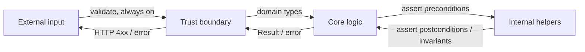
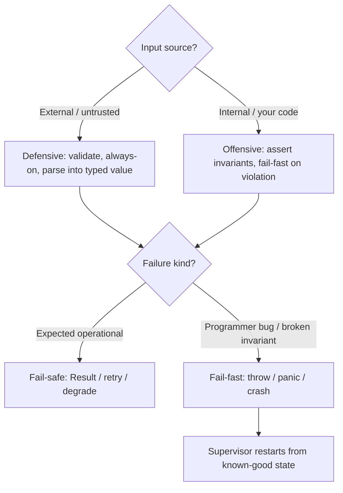

# Defensive vs Offensive — Interview Questions

> 50+ questions across all tiers (Junior → Staff). Defensive programming, offensive programming, trust boundaries, fail-fast vs fail-safe, assertions vs validation, Design by Contract, and "let it crash." Use as self-review or interview prep. Each harder question notes **what the interviewer is really checking**.

---

## Table of Contents

- [Junior](#junior-15-questions)
- [Mid](#mid-15-questions)
- [Senior](#senior-12-questions)
- [Staff](#staff-10-questions)
- [Trick Questions](#trick-questions-8)
- [Rapid-Fire](#rapid-fire)
- [Summary](#summary)
- [Further Reading](#further-reading)
- [Related Topics](#related-topics)

---

## Junior (15 questions)

### J1. What is defensive programming?

<details><summary>Answer</summary>

Writing code that anticipates and tolerates bad input, misuse, and partial failure so the program keeps behaving sensibly. The classic moves: validate inputs, check for `null`, copy mutable data you receive, and degrade gracefully rather than crashing. The risk is over-applying it — checks scattered everywhere that bury the real logic.

</details>

### J2. What is offensive programming?

<details><summary>Answer</summary>

The opposite stance: when a *bug* (not a user error) violates an assumption, make the program fail loudly and immediately rather than limping along. You assert your invariants and let violations crash. The goal is to surface defects during development instead of masking them in production.

</details>

### J3. Are defensive and offensive programming opposites?

<details><summary>Answer</summary>

No — they apply to *different kinds of input*. Be **defensive at the trust boundary** (external, untrusted data: HTTP requests, files, user input). Be **offensive inside the boundary** (internal calls between your own functions: assert invariants, crash on violation). They are complementary, not competing.

</details>

### J4. What is a trust boundary?

<details><summary>Answer</summary>

The line between code/data you don't control and code you do. Outside: browsers, third-party APIs, databases shared with other teams, files, environment variables. Inside: your own modules calling each other. Validation belongs *at* the boundary; everything inside the boundary can trust that validation already happened.

</details>

### J5. What is fail-fast?

<details><summary>Answer</summary>

Detect an error condition at the earliest possible point and stop immediately — throw, panic, or exit — instead of continuing with corrupt state. A constructor that rejects an invalid argument right away is fail-fast; one that stores it and blows up three calls later is not.

</details>

### J6. What is fail-safe?

<details><summary>Answer</summary>

On error, fall back to a safe, known state and keep operating rather than stopping. A thermostat that defaults to "off" when its sensor fails is fail-safe. A circuit breaker that returns a cached/default response when a dependency is down is fail-safe.

</details>

### J7. When do you want fail-fast vs fail-safe?

<details><summary>Answer</summary>

- **Fail-fast** during development, in internal logic, and whenever continuing risks data corruption. You *want* the crash because it exposes the bug.
- **Fail-safe** at runtime in user-facing or safety-critical systems where staying available matters more than perfect correctness (elevators, payment retries, streaming).

A common split: fail-fast on programmer errors, fail-safe on expected operational failures.

</details>

### J8. What is an assertion?

<details><summary>Answer</summary>

A statement that a condition *must* be true at a given point because the surrounding code guarantees it. If it's false, the program has a bug. `assert balance >= 0` says "I, the author, claim this can never be negative here." It documents and checks an invariant.

</details>

### J9. What is input validation?

<details><summary>Answer</summary>

Checking that *external* data meets your requirements before you use it — and handling the failure gracefully (error message, 400 response, default). Unlike an assertion, a validation failure is *expected*: users send bad data all the time. Validation is part of normal control flow.

</details>

### J10. Assertion vs validation — what's the core difference?

<details><summary>Answer</summary>

- **Assertion**: checks something that should be *impossible* to be false (a bug if it is). For *you*, the developer. May be disabled in production.
- **Validation**: checks something that's *expected* to sometimes be false (bad user input). For your *users*. Never disabled.

Rule of thumb: assert the things you control; validate the things you don't.

</details>

### J11. What's a null check, and where should it live?

<details><summary>Answer</summary>

A guard against a `null`/`nil`/`None` value. It should live **at the trust boundary** — validate once when data enters, then pass non-null values inward. Sprinkling `if (x != null)` at every layer is a smell: it means no layer trusts any other, and the real question ("can this ever be null here?") is never answered.

</details>

### J12. What does "let it crash" mean?

<details><summary>Answer</summary>

A philosophy (popularized by Erlang/OTP) where you *don't* defensively guard every operation. If a process hits an unexpected state, you let it die, and a supervisor restarts it from a known-good state. Errors are isolated to small processes; the system as a whole stays up. It's offensive programming at the process level plus fail-safe at the system level.

</details>

### J13. Why can defensive copying be expensive?

<details><summary>Answer</summary>

Copying a collection or array on every method call allocates memory and burns CPU proportional to size. If a hot path receives a 10,000-element list and copies it on each of a million calls, you've turned a constant-time handoff into gigabytes of garbage. Copy only when you actually retain a reference to mutable shared state.

</details>

### J14. Is more defensive code always safer?

<details><summary>Answer</summary>

No. Excess defensiveness hides bugs (a swallowed `null` makes a defect silent), adds noise that obscures real logic, and creates false confidence. A check that "handles" an impossible case often just papers over the real problem instead of fixing it. Defensiveness has a cost; spend it at the boundary.

</details>

### J15. Give a one-line example of fail-fast in a constructor.

<details><summary>Answer</summary>

```java
public Account(BigDecimal balance) {
    if (balance == null || balance.signum() < 0)
        throw new IllegalArgumentException("balance must be non-negative");
    this.balance = balance;
}
```

The object can never exist in an invalid state — the failure happens at construction, not later.

</details>

---

## Mid (15 questions)

### M16. Why can assertions be disabled, and how?

<details><summary>Answer</summary>

Because they're meant to catch *developer* bugs during testing, not guard production input — so most platforms let you strip them for performance:

- **Java**: assertions are *off by default*; you enable with `-ea` (enable assertions) and disable with `-da`. Production JVMs typically run without `-ea`.
- **Python**: `assert` statements are removed entirely when you run with `-O` (optimize).
- **C/C++**: `assert()` becomes a no-op when `NDEBUG` is defined.

The consequence: **never put logic with side effects, or anything you rely on in production, inside an assertion.**

</details>

### M17. Why must you never use assertions for input validation?

<details><summary>Answer</summary>

Because assertions can be disabled (`-da`, `-O`, `NDEBUG`). If you validate user input with `assert username != ""`, then ship with assertions off, the check vanishes and bad data flows straight through. Validation must use real control flow (`if` + throw/return) that's always active.

**What the interviewer is checking:** that you understand assertions are a *development* tool, not a *security/correctness* mechanism.

</details>

### M18. What is Design by Contract?

<details><summary>Answer</summary>

A methodology (Bertrand Meyer, Eiffel) where every routine has a formal contract:

- **Preconditions** — what the *caller* must guarantee before calling.
- **Postconditions** — what the *routine* guarantees on return (if the precondition held).
- **Invariants** — what's always true of an object between public calls.

It's a precise way to assign blame: precondition violated → caller's bug; postcondition violated → callee's bug.

</details>

### M19. How does Design by Contract relate to defensive programming?

<details><summary>Answer</summary>

DbC is the disciplined alternative to blanket defensiveness. Instead of every routine re-checking everything (mutual suspicion), the contract states *who* is responsible for *what*. The caller satisfies preconditions; the callee doesn't re-validate them. You eliminate redundant checks and locate responsibility precisely. Defensive programming without contracts tends toward "everybody checks everything."

</details>

### M20. Where in DbC do you put assertions vs validation?

<details><summary>Answer</summary>

- **Preconditions on internal APIs** → assertions (a violation is a *caller bug*).
- **Preconditions at the trust boundary** (public API receiving external data) → validation that throws a real, always-on exception.
- **Postconditions and invariants** → assertions (a violation is *your* bug).

Internal contracts are enforced offensively; the boundary is enforced defensively.

</details>

### M21. Should you validate arguments in a private method?

<details><summary>Answer</summary>

Generally **no** — at most assert. A private method's callers are all within your own class/module, so its preconditions are *your* responsibility. Validating there duplicates checks the public entry point already did and implies you don't trust your own code. Use an assertion if you want a development-time tripwire; skip full validation.

**What the interviewer is checking:** do you know validation belongs at the boundary, not at every internal hop?

</details>

### M22. What is the "don't validate everywhere" principle?

<details><summary>Answer</summary>

Validate once, at the point data crosses into your trust zone; then carry types/values that *cannot* be invalid. If every layer re-checks `email != null && email.contains("@")`, you have N copies of one rule that drift apart over time. Centralize validation, then make invalid states unrepresentable (a parsed `Email` type) so downstream code can't even ask the question.

</details>

### M23. "Parse, don't validate" — what does it mean?

<details><summary>Answer</summary>

Instead of *validating* a raw value and passing the raw value onward (so the next function must validate again), *parse* it into a type that proves the check already passed. `parseEmail(String) -> Email` returns a value that, by construction, is a valid email. Downstream functions take `Email`, not `String`, so the invariant is captured in the type system — no re-validation possible or needed.

</details>

### M24. When *should* you make a defensive copy?

<details><summary>Answer</summary>

When you **store** a reference to a mutable object passed in (or return a reference to internal mutable state) and the caller could mutate it behind your back. Classic case: a constructor that takes a `Date` or `List` and keeps it as a field — copy on the way in and on the way out. If you only *read* the argument and never retain it, no copy is needed.

</details>

### M25. When should you *not* make a defensive copy?

<details><summary>Answer</summary>

- The object is **immutable** (`String`, `Integer`, a value object, a `record`/frozen dataclass) — nothing to defend against.
- You don't retain it past the call.
- It's a hot path where the copy cost dominates and you control all callers.

The cleanest fix is to make the type immutable so the question disappears entirely.

</details>

### M26. What's the problem with "try/catch around every line" (paranoid code)?

<details><summary>Answer</summary>

It treats every operation as equally likely to fail, which (1) buries the happy path in noise, (2) usually catches too broadly and swallows real errors, (3) tends to "handle" by logging-and-continuing, leaving corrupt state. Group operations that fail together into one `try` at a meaningful boundary, and only catch exceptions you can actually do something about.

</details>

### M27. When should a contract violation throw vs return a `Result`/error?

<details><summary>Answer</summary>

- **Throw / panic** for *programmer errors* — broken invariants, impossible states. These are bugs; you want them loud (offensive).
- **`Result` / error return** for *expected operational failures* — "file not found," "user already exists," "payment declined." These are part of the domain and the caller must handle them (defensive at the boundary).

Don't use exceptions for expected control flow, and don't use `Result` to paper over a genuine bug.

</details>

### M28. What is Postel's Law (the Robustness Principle)?

<details><summary>Answer</summary>

"Be conservative in what you send, be liberal in what you accept." From Jon Postel's TCP spec. The idea: accept slightly malformed input gracefully so the system interoperates with imperfect peers. It made early Internet protocols resilient across buggy implementations.

</details>

### M29. What is the critique of Postel's Law?

<details><summary>Answer</summary>

Being "liberal in what you accept" causes long-term harm: every implementation accepts different deviations, so the *de facto* spec becomes ambiguous, bugs in senders go unnoticed and ossify, and security holes open (lenient parsers are a classic attack surface — request smuggling, XML/JSON quirks). Modern guidance (and IETF drafts) leans toward **strict** acceptance: reject malformed input loudly so senders get fixed. Liberality defers cost; it doesn't remove it.

</details>

### M30. How does "let it crash" differ from swallowing exceptions?

<details><summary>Answer</summary>

Opposite philosophies. "Let it crash" *propagates* the failure to a supervisor that restarts cleanly — the error is visible and the state is reset. Swallowing (`catch {}`) *hides* the failure and continues with possibly-corrupt state. "Let it crash" only works because of the isolation + supervision around it; it is not "ignore errors."

</details>

---

## Senior (12 questions)

### S31. How do you design a trust boundary in a layered web service?

<details><summary>Answer</summary>

Push validation to the **edge** — the controller/handler that deserializes the request. Convert raw DTOs into validated domain types there (parse, don't validate). Below that line, services, repositories, and domain objects take domain types and assert (not validate) preconditions. The boundary is also where you sanitize for security (SQLi/XSS), apply authn/authz, and enforce size/rate limits.

**What the interviewer is checking:** can you articulate *one* clear line and keep redundant checks off the inner layers?

</details>

### S32. A teammate wraps every public method with full argument validation, including deep internal helpers. Critique.

<details><summary>Answer</summary>

It conflates "public" (Java visibility) with "trust boundary" (architectural). An internal service method may be `public` for testing or module reasons but still only ever called by trusted code — its preconditions should be assertions, not always-on validation. The result of over-validating: duplicated rules, performance cost, and the false impression that any layer can receive arbitrary garbage. Define the boundary by *who calls it*, not by the access modifier.

</details>

### S33. How do assertions, validation, and DbC fit together in one codebase?

<details><summary>Answer</summary>



Boundary = defensive (validation, never disabled). Core = offensive (assertions, may be `-ea`/`-O` stripped). Contracts (DbC) assign blame across the arrows.

</details>

### S34. How do you decide fail-fast vs fail-safe in a payment system?

<details><summary>Answer</summary>

Split by failure class. **Programmer/data-integrity errors** (negative amount after our own calculation, a ledger that doesn't balance) → fail-fast: abort the transaction, alert, never persist. **Transient operational errors** (gateway timeout, network blip) → fail-safe: retry with backoff, idempotency keys, and a dead-letter queue. You never "default to a safe value" for money correctness, but you do stay available for transient infra problems.

</details>

### S35. Why does "make invalid states unrepresentable" reduce defensive code?

<details><summary>Answer</summary>

If a type can only hold valid values (a non-empty list type, a sum type that captures every legal state, an `Email` that's validated at construction), then code consuming it doesn't need runtime checks — the compiler enforced the invariant. You move the check from *everywhere it's used* to *once where it's created*. This is the type-system version of "validate at the boundary."

</details>

### S36. How does "let it crash" scale from a process to a distributed system?

<details><summary>Answer</summary>

The pattern generalizes as **crash-only software** (Candea & Fox): components have no separate "graceful shutdown" path — the only way to stop is to crash, and the only way to start is to recover. If start == recover, you exercise the recovery path constantly, so it actually works in a real outage. At the system level this becomes supervised processes (OTP), self-healing pods (Kubernetes restart policies), and stateless services backed by durable stores. The discipline: keep state recoverable and restarts cheap.

</details>

### S37. What's wrong with returning a "safe default" on every error?

<details><summary>Answer</summary>

It's fail-safe applied where fail-fast belongs. Defaulting `getBalance()` to `0` on an error makes a database failure look like an empty account — silent data corruption from the user's view. Safe defaults are appropriate for *non-critical, presentational* data (a missing avatar → placeholder), never for values that drive decisions or money. The interviewer wants to see you distinguish "absence is meaningful" from "absence hides a bug."

</details>

### S38. How do you migrate a codebase riddled with null checks at every layer?

<details><summary>Answer</summary>

1. Identify the real trust boundary; add validation there.
2. Introduce non-null types/annotations (`Optional`, `@NonNull`, Kotlin null-safety, `NewType`) so the compiler tracks nullability.
3. Remove inner null checks as the type system proves they're dead — but do it behind tests; a removed check that *was* live reveals a missing boundary check.
4. Make domain objects reject null at construction (fail-fast), so they can never propagate null inward.

</details>

### S39. How does Design by Contract interact with inheritance (Liskov)?

<details><summary>Answer</summary>

Contracts must respect substitutability: a subclass may **weaken preconditions** (accept more) and **strengthen postconditions** (promise more), but never the reverse. If a subclass demands *more* of callers or delivers *less*, it breaks code written against the base contract — a direct expression of the Liskov Substitution Principle in contract terms.

</details>

### S40. When is Postel's Law the right call today?

<details><summary>Answer</summary>

In *forward-compatible* designs where you must ignore unknown fields to allow evolution — e.g., a JSON API consumer that tolerates new fields it doesn't recognize, or protobuf's unknown-field preservation. That's "liberal" in a *controlled, specified* way. It is **not** a license to silently fix malformed structure. The modern stance: be liberal about *extensions you anticipated*, strict about *violations of the spec*.

</details>

### S41. How do you choose between exceptions and `Result` types at scale?

<details><summary>Answer</summary>

Consider visibility and ergonomics. `Result`/`Either` makes failure part of the signature — callers *must* handle it, great for expected domain errors and for languages without checked exceptions (Rust, Go's `error`, Kotlin `Result`). Exceptions are better for truly exceptional, non-local failures you want to propagate many frames up without threading types. A common rule: `Result` for expected, recoverable, local failures; exceptions/panics for bugs and unrecoverable conditions. Avoid mixing both for the *same* error.

</details>

### S42. A library author asks: should my public API validate inputs even though it's "internal" to one product?

<details><summary>Answer</summary>

A reusable library's public API *is* a trust boundary — its callers are outside the library's control, even if the same org wrote them. Validate and throw documented, always-on exceptions; don't rely on assertions, since consumers may run with `-da`/`-O`. Inside the library, assert. The reach of your callers, not the org chart, defines the boundary.

</details>

---

## Staff (10 questions)

### S43. Your platform serves 200 internal services. How do you set an org-wide policy on defensive vs offensive code?

<details><summary>Answer</summary>

Codify the boundary, not the taste:

- **Edge/gateway services**: strict validation, schema enforcement (OpenAPI/protobuf), reject-on-malformed, security sanitization. Defensive.
- **Internal service-to-service**: typed contracts (protobuf/Avro), assertions for invariants, fail-fast on contract breaches with structured errors and tracing. Offensive inside, with a thin validation shell where untrusted data could leak in.
- **Shared rule**: validate once at ingress; pass typed domain objects; treat assertion failures as alertable defects, not user errors.

Then enforce with lint rules, schema gates in CI, and a "no business validation in assertions" check.

</details>

### S44. How do you make "let it crash" safe when state is involved?

<details><summary>Answer</summary>

Crashing is only safe if recovery restores a consistent state. Techniques: keep processes **stateless** (state in a durable store), make operations **idempotent** (so a retry after crash is harmless), use **write-ahead logs / event sourcing** so state can be rebuilt, and design **supervision trees** with bounded restart intensity (so a crash-loop is detected, not hidden). Without these, "let it crash" just loses data faster.

</details>

### S45. Defensive copying is showing up as 30% of allocations in a profile. How do you reason about removing it?

<details><summary>Answer</summary>

1. Confirm *why* each copy exists: retained mutable state, or cargo-culted?
2. Prefer **immutability** — switch the shared type to an immutable/persistent structure; the copy becomes unnecessary and sharing is safe.
3. Where mutation is real, use **copy-on-write** or pass ownership explicitly (Rust move semantics, documented "you no longer own this") so only one party mutates.
4. For internal-only call paths, drop the copy and rely on a contract ("callers must not mutate") enforced by review/tests.
5. Measure again — escape analysis may already elide small copies; don't optimize what the JIT/compiler removes.

</details>

### S46. Compare the Erlang "let it crash" model with Go's explicit error returns as system philosophies.

<details><summary>Answer</summary>

Erlang/OTP: errors are *not* return values; processes are cheap and isolated; you don't defend, you supervise and restart — resilience comes from the runtime + supervision trees. Go: errors are *values* returned explicitly; the language has no supervisor, so the *programmer* must thread and handle errors at each step (defensive by default), with `panic`/`recover` reserved for truly exceptional cases. Erlang pushes recovery to the architecture; Go pushes it into the call site. Both reject "swallow and continue."

</details>

### S47. How do contracts and validation interact with backward compatibility in a public API?

<details><summary>Answer</summary>

Tightening a precondition (validating something you previously accepted) is a **breaking change** — existing callers that sent the now-rejected input break. Loosening a precondition or strengthening a postcondition is safe. So validation policy is part of your compatibility contract: you can add *new optional* fields liberally (Postel-style, forward-compat) but cannot retroactively make previously-valid requests invalid without a version bump.

</details>

### S48. When does excessive defensiveness become a security liability?

<details><summary>Answer</summary>

When lenient acceptance (Postel-style) creates parser differentials: two components interpret the same bytes differently, enabling request smuggling, auth bypass, or filter evasion. "Be liberal in what you accept" is directly at odds with security, where you want a single, strict, canonical interpretation and rejection of anything ambiguous. Defensive *tolerance* of malformed input is offensive *to your security model*.

</details>

### S49. How do you encode invariants so that they survive serialization boundaries?

<details><summary>Answer</summary>

Types enforce invariants in-process, but serialization erases them — a `record Email` becomes a bare string on the wire. So you must **re-establish the invariant at every deserialization boundary**: validate on parse, reconstruct the typed value, and reject malformed payloads. This is exactly why the trust boundary sits at deserialization. Schema systems (protobuf, JSON Schema, Avro) move part of this enforcement into the format itself, but domain invariants beyond "is an int" still need a parse step.

</details>

### S50. How do you set a team norm on assertions vs exceptions to avoid both paranoia and silent failure?

<details><summary>Answer</summary>

A written policy with three buckets: (1) **External input** → validate, throw documented exceptions, always on; (2) **Internal invariants** → assert; treat assertion failures as P1 bugs with alerting (and decide explicitly whether assertions run in prod — many teams run a subset enabled); (3) **Expected operational outcomes** → `Result`/error returns, handled locally. Forbid: business validation inside asserts, empty catch blocks, and "safe defaults" for decision-driving data. Enforce via lint + code review checklists.

</details>

### S51. Should assertions ever be enabled in production?

<details><summary>Answer</summary>

It's a deliberate trade-off. Enabling them turns latent corruption into a loud crash — valuable for correctness-critical systems where bad state is worse than downtime (financial ledgers, medical). Disabling them maximizes throughput and availability. Many mature systems enable a *cheap subset* of invariant checks in prod (or convert critical ones to always-on `if`/throw guards) and disable expensive ones. The wrong answer is "I don't know if assertions run in prod" — that means you don't know whether your invariant checks exist at runtime.

</details>

### S52. Design a policy for null/None handling across a polyglot platform (Java, Kotlin, Go, Python).

<details><summary>Answer</summary>

Unify on "no null past the boundary." Per language: Java → `Optional` for absence, `@NonNull`/`@Nullable` + a null-checker (NullAway/Checker Framework) in CI; Kotlin → lean on built-in null-safety, no platform types leaking from Java; Go → avoid `nil` maps/slices in returns, use explicit zero values or `(T, bool)`/`(T, error)`; Python → `Optional[T]` with `mypy --strict`. The cross-cutting rule is identical to the single-language one: validate/parse at ingress, carry non-nullable types inward, fail-fast on null in domain constructors.

</details>

---

## Trick Questions (8)

### T53. "Defensive code is always safer than offensive code." True?

<details><summary>Answer</summary>

False. Defensive code can *hide* bugs by tolerating states that should never occur — a swallowed exception or a safe-default turns a crash you'd notice into silent corruption you won't. Offensive code (assertions, fail-fast) is *safer for correctness* during development because it exposes defects immediately. "Safer" depends on whether you optimize for availability or correctness.

</details>

### T54. "Should you check arguments in a private method?"

<details><summary>Answer</summary>

Trap question. The answer is "assert, don't validate" — and for trivial helpers, often neither. Private methods sit inside the trust boundary; their callers are your own code, so full validation is redundant. The interviewer wants you to *not* reflexively answer "always validate inputs."

</details>

### T55. "Are assertions a form of input validation?"

<details><summary>Answer</summary>

No — and treating them as such is a classic security bug. Assertions check *developer assumptions* and can be compiled out (`-da`, `-O`, `NDEBUG`); input validation guards *untrusted data* and must always run. If your only check on a request body is an `assert`, you have no check in production.

</details>

### T56. "Postel's Law made the Internet robust, so I should always be liberal in what I accept." Agree?

<details><summary>Answer</summary>

No. It bought short-term interoperability at long-term cost: ambiguous de-facto specs, undetected sender bugs, and security holes from lenient parsers. Be liberal only about *anticipated extensions* (ignore unknown fields); be strict about spec violations. Many modern protocols explicitly reject Postel-style leniency.

</details>

### T57. "If I add a `try/catch` everywhere, my app can't crash." Right?

<details><summary>Answer</summary>

Wrong, and dangerous. It only converts crashes into *silent corrupt continuation* — the app keeps running with broken state, producing wrong results that are far harder to diagnose than a crash. A crash with a stack trace is a gift; a swallowed error that surfaces three subsystems later is a debugging nightmare. Catch only what you can handle, at a meaningful boundary.

</details>

### T58. "We have a `Result` type, so we never throw." Reasonable?

<details><summary>Answer</summary>

Not as an absolute. `Result` is for *expected, recoverable* failures. But a genuine programmer error or violated invariant should still panic/throw (or `Result::unwrap` deliberately) — wrapping a bug in `Result::Err` and handling it gracefully just hides the defect. Use `Result` for the domain; let bugs be loud.

</details>

### T59. "Immutability eliminates the need for defensive copying." Always?

<details><summary>Answer</summary>

For the immutable object itself, yes — there's nothing to defend. But watch the edges: a "frozen" wrapper around a *mutable* inner collection (a `final List` field that's still a mutable `ArrayList`) is not deeply immutable. You need *deep* immutability (or truly immutable collections) before you can safely drop copies. Shallow immutability still leaks.

</details>

### T60. "Fail-fast and fail-safe are mutually exclusive — pick one for the whole system." True?

<details><summary>Answer</summary>

False. Mature systems use both at different layers: fail-fast on internal invariants (crash the request handler on a broken assumption) while the surrounding system is fail-safe (a supervisor restarts the worker, a load balancer routes around the dead node, a circuit breaker serves degraded responses). "Let it crash" is literally fail-fast *components* inside a fail-safe *system*.

</details>

---

## Rapid-Fire

| Question | Answer |
|---|---|
| Defensive where? | At the **trust boundary** (external/untrusted input). |
| Offensive where? | **Inside** the boundary (your own code calling itself). |
| Assertion is for… | Developer bugs / invariants you control. |
| Validation is for… | Untrusted input you don't control. |
| Why not assert input? | Assertions can be disabled (`-ea`/`-da`, `-O`, `NDEBUG`). |
| Disable Java assertions | `-da` (default off; enable with `-ea`). |
| Disable Python assertions | `python -O`. |
| Disable C `assert` | Define `NDEBUG`. |
| DbC three parts | Preconditions, postconditions, invariants. |
| Precondition violated → blame | The **caller**. |
| Postcondition violated → blame | The **callee**. |
| Fail-fast | Stop immediately on error; surface the bug. |
| Fail-safe | Fall back to a safe state; keep running. |
| Fail-fast for… | Programmer errors, internal logic, dev. |
| Fail-safe for… | Transient ops failures, user-facing availability. |
| "Let it crash" needs… | Isolation + supervision + recoverable state. |
| Crash-only software | Start path == recovery path; no graceful shutdown. |
| Defensive copy when… | You **retain** a mutable reference. |
| Skip defensive copy when… | Type is immutable / not retained. |
| Postel's Law | Conservative in send, liberal in accept. |
| Postel critique | Ambiguous specs, hidden bugs, parser-differential security holes. |
| Null checks belong… | Once, at the boundary; carry non-null types inward. |
| Parse, don't validate | Return a type that proves the check passed. |
| Throw vs Result | Throw for bugs; Result for expected domain failures. |
| Validate in private method? | No — assert at most. |
| LSP + contracts | Subclass weakens preconditions, strengthens postconditions. |

---

## Summary

The whole topic collapses to one decision: **where is the trust boundary, and which side am I on?**



- **Defensive at the edge, offensive in the core.** Validate untrusted input once; assert internal invariants and crash on violation.
- **Assertions are not validation.** They can be compiled out (`-da`/`-O`/`NDEBUG`); never guard untrusted input or production-critical logic with them.
- **Design by Contract** assigns blame precisely: caller owns preconditions, callee owns postconditions and invariants — which lets you delete redundant defensive checks.
- **Fail-fast for bugs, fail-safe for operations.** "Let it crash" is fail-fast components inside a fail-safe, supervised system.
- **Defensive copying and null checks cost something.** Spend them at the boundary; prefer immutability and typed values so the inner code can't ask the question.
- **Postel's Law has a critique:** liberal acceptance defers cost into ambiguous specs and security holes. Be strict by default; be liberal only about anticipated extensions.

---

## Further Reading

- Bertrand Meyer — *Object-Oriented Software Construction* (Design by Contract)
- Steve McConnell — *Code Complete*, ch. 8 "Defensive Programming"
- Andrew Hunt & David Thomas — *The Pragmatic Programmer* ("Dead Programs Tell No Lies," "Assertive Programming," "Design by Contract")
- Joe Armstrong — *Making Reliable Distributed Systems in the Presence of Software Errors* ("let it crash")
- George Candea & Armando Fox — *Crash-Only Software*
- Alexis King — *Parse, Don't Validate*
- IETF — *The Harmful Consequences of the Robustness Principle* (draft-iab-protocol-maintenance), the Postel's Law critique

---

## Related Topics

- [Defensive vs Offensive — Junior](junior.md)
- [Defensive vs Offensive — Professional](professional.md)
- [Chapter README](README.md)
- [Error Handling](../06-error-handling/README.md)
- [Anti-Patterns](../../anti-patterns/README.md)