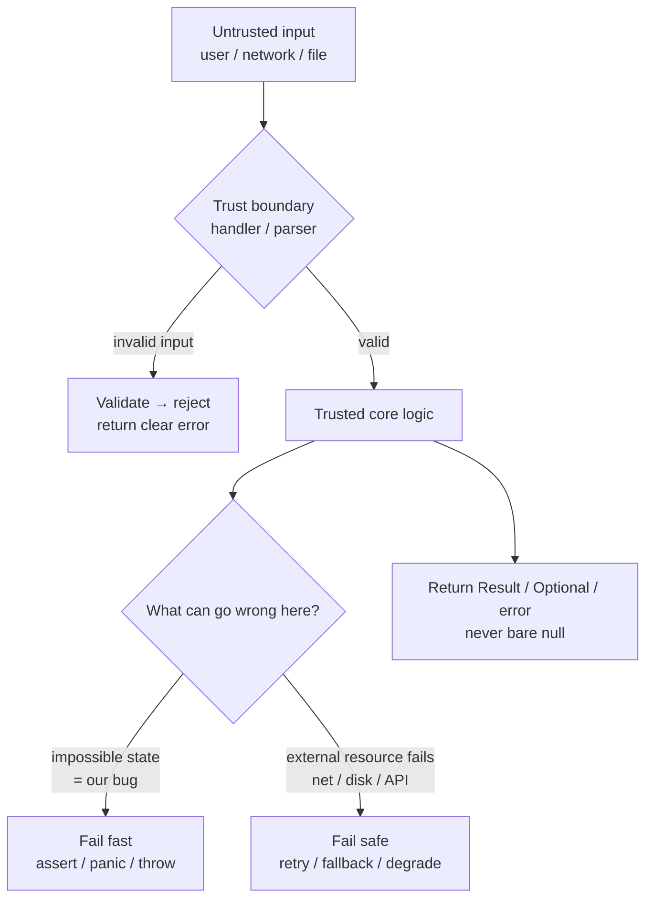
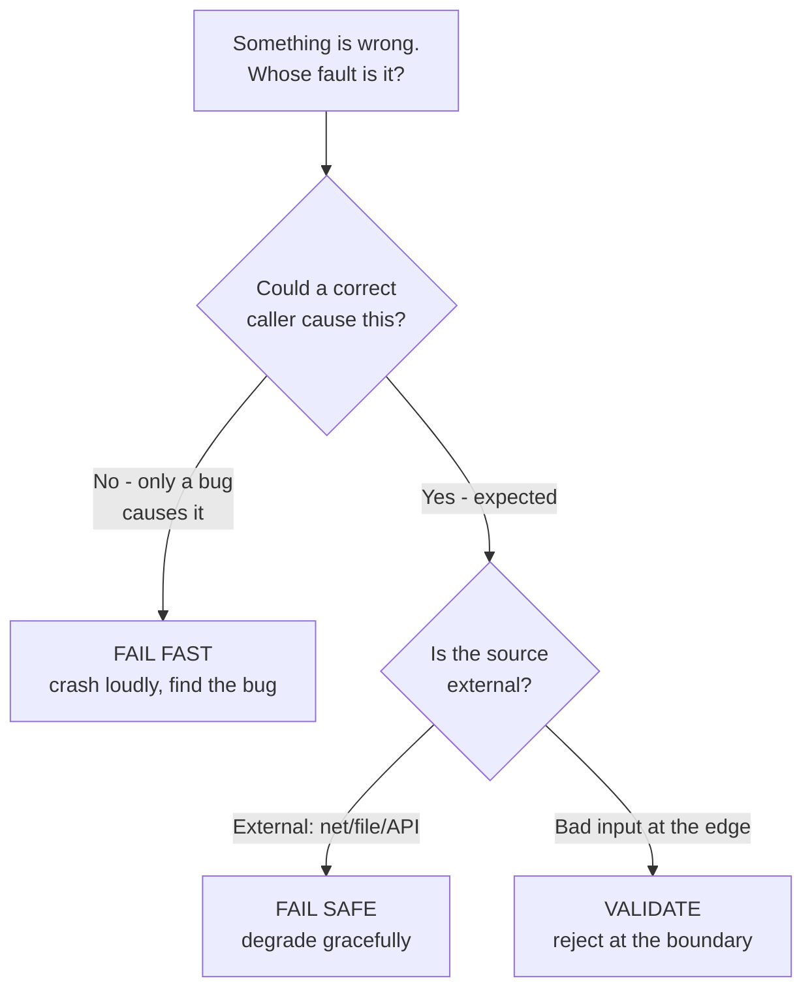

# Defensive vs Offensive — Junior Level

> **Level:** Junior — "What's the rule? Show me a clean example."
> You'll learn *where* to validate, *when* to crash loudly, and *when* to degrade gracefully. The mistake juniors make is checking everything everywhere; the skill is checking the right thing in the right place exactly once.

---

## Table of Contents

1. [The two mindsets](#the-two-mindsets)
2. [Real-world analogy](#real-world-analogy)
3. [Rule 1 — Validate at the trust boundary, once](#rule-1--validate-at-the-trust-boundary-once)
4. [Rule 2 — Fail fast on programmer errors](#rule-2--fail-fast-on-programmer-errors)
5. [Rule 3 — Fail safe on expected external failures](#rule-3--fail-safe-on-expected-external-failures)
6. [Rule 4 — Assertions vs validation: "can't happen" vs "might happen"](#rule-4--assertions-vs-validation-cant-happen-vs-might-happen)
7. [Rule 5 — Design by Contract: preconditions, postconditions, invariants](#rule-5--design-by-contract-preconditions-postconditions-invariants)
8. [Rule 6 — Don't return null; return a Result, Optional, or error](#rule-6--dont-return-null-return-a-result-optional-or-error)
9. [Common Mistakes](#common-mistakes)
10. [Diagrams](#diagrams)
11. [Test Yourself](#test-yourself)
12. [Cheat Sheet](#cheat-sheet)
13. [Summary](#summary)
14. [Further Reading](#further-reading)
15. [Related Topics](#related-topics)

---

## The two mindsets

Every line of code makes an assumption: that the input is valid, the file exists, the pointer isn't nil, the number isn't zero. **Defensive** and **offensive** programming are two answers to "what do I do about those assumptions?"

| | **Defensive** | **Offensive** |
|---|---|---|
| Attitude | "Assume the worst; protect against it." | "Detect violations immediately; crash loudly." |
| Used for | Untrusted, external input (users, network, files) | Internal bugs — states that *should* be impossible |
| On a bad value | Reject it gracefully, return an error, degrade | Stop the program so the bug is found *now* |
| Goal | Keep running for the *user* | Surface the bug for the *developer* |

These are **not** rivals — a good program uses both, but in **different places**. The whole chapter reduces to one sentence:

> **Be defensive at the edges of your system (the trust boundary). Be offensive in the core (where everything has already been checked).**

When you confuse the two — re-validating clean data deep inside the system, or swallowing a genuine bug to "keep running" — you get slow, buggy, hard-to-debug code. The rules below show you where each belongs.

---

## Real-world analogy

### The nightclub door

A nightclub has **one bouncer at the door**. He checks IDs, refuses anyone underage, and turns away troublemakers. Once you're inside, nobody re-checks your ID at the bar, on the dance floor, or by the restrooms — that would be absurd and would grind the whole club to a halt.

- The **door** is the **trust boundary**. Everything outside is untrusted; everything inside has been vetted **once**. → *defensive*
- Inside the club, the staff *trust* that everyone was checked. They don't re-validate. → *offensive / trusting*

Now two different things can go wrong:

- A patron tries to start a fight (an **expected external problem**). Security calmly removes them; the party continues. → **fail safe**.
- The fire alarm system reports a temperature of −300°C, which is physically impossible (an **internal sensor bug**). You don't "handle" that gracefully — you flag it loudly, because something is fundamentally broken. → **fail fast**.

A club that ID-checks you at every doorway inside is doing **defensive copying everywhere** and **null checks at every layer**: paranoid, slow, and still no safer than checking once at the door.

---

## Rule 1 — Validate at the trust boundary, once

**The rule:** Untrusted input — from users, the network, files, environment variables, external APIs — is checked **once, at the edge where it enters your system**. After that point, the data is trusted and internal code does **not** re-check it.

A **trust boundary** is the line between "I don't control this data" and "I do." HTTP handlers, message-queue consumers, CLI argument parsing, file readers, and database deserialization are all trust boundaries. Validation belongs *there* — not scattered across every function the data later touches.

### Dirty — validation smeared across every layer

```python
# Every layer re-checks the same email. Nobody is sure who owns the rule,
# so everybody "defends" — and the rule still drifts out of sync.
def handler(request):
    email = request.json["email"]
    if not email or "@" not in email:
        return error(400)
    return service_create_user(email)

def service_create_user(email):
    if not email or "@" not in email:   # checked again
        raise ValueError("bad email")
    return repo_save(email)

def repo_save(email):
    if "@" not in email:                # and again
        raise ValueError("bad email")
    db.insert(email)
```

### Clean — validate once at the edge, trust inward

```python
from pydantic import BaseModel, EmailStr

# The trust boundary: a pydantic model parses + validates the request body.
# If it constructs successfully, the data is valid. Period.
class CreateUserRequest(BaseModel):
    email: EmailStr          # invalid emails are rejected here, with a clear error

def handler(request):
    req = CreateUserRequest(**request.json)   # validation happens HERE, once
    return service_create_user(req.email)     # everything inward trusts the value

def service_create_user(email: str):          # no re-check — already trusted
    return repo_save(email)

def repo_save(email: str):                    # no re-check
    db.insert(email)
```

In Go, the boundary is the HTTP handler; the validated value flows inward untouched:

```go
// Boundary: decode + validate the incoming JSON once.
func CreateUserHandler(w http.ResponseWriter, r *http.Request) {
    var req struct {
        Email string `json:"email"`
    }
    if err := json.NewDecoder(r.Body).Decode(&req); err != nil {
        http.Error(w, "invalid body", http.StatusBadRequest)
        return
    }
    email, err := NewEmail(req.Email) // the single validation point
    if err != nil {
        http.Error(w, err.Error(), http.StatusBadRequest)
        return
    }
    // email is now a validated value object; inner functions trust it.
    if err := createUser(email); err != nil {
        http.Error(w, "internal error", http.StatusInternalServerError)
        return
    }
    w.WriteHeader(http.StatusCreated)
}

func createUser(email Email) error { // takes Email, not string — type enforces "validated"
    return repo.Save(email)
}
```

Java with Bean Validation does the same at the controller edge:

```java
// The DTO carries the rules. The framework validates it at the boundary.
public record CreateUserRequest(
    @NotBlank @Email String email
) {}

@PostMapping("/users")
public ResponseEntity<Void> create(@Valid @RequestBody CreateUserRequest req) {
    // @Valid ran the checks. Below this line, req.email() is trusted.
    userService.create(req.email());
    return ResponseEntity.status(CREATED).build();
}
```

> **Why "once" matters:** if the rule lives in five places, four of them will eventually disagree with the fifth. One owner = one source of truth.

---

## Rule 2 — Fail fast on programmer errors

**The rule:** When code reaches a state that is **supposed to be impossible** — a `null` where the design guarantees non-null, a negative count, an unreachable `switch` branch — **stop immediately and loudly**. Don't paper over it. A loud crash near the bug is a gift; a silent wrong answer that surfaces three services later is a nightmare.

A **programmer error** is a bug in *your* code, not bad input from a user. The fix is to change the code, not to handle the value. Failing fast turns "mysterious corruption later" into "stack trace right here."

### Dirty — swallow the impossible, corrupt silently

```go
func ApplyDiscount(price, percent float64) float64 {
    if percent < 0 || percent > 100 {
        return price // "handle" it by silently ignoring — now the bug hides
    }
    return price * (1 - percent/100)
}
```

A caller passing `percent = 150` is a *bug*. Returning `price` unchanged hides it; a customer is overcharged and nobody knows why.

### Clean — crash loudly at the bug

```go
func ApplyDiscount(price, percent float64) float64 {
    // This is OUR invariant. A violation means a bug in calling code.
    if percent < 0 || percent > 100 {
        panic(fmt.Sprintf("ApplyDiscount: percent out of range: %v", percent))
    }
    return price * (1 - percent/100)
}
```

> **Go note:** reserve `panic` for genuinely impossible / unrecoverable internal states, not for expected errors. Expected, recoverable problems return `error` (Rule 3). A `panic` says "the program's assumptions are broken."

Python uses an exception (or `assert` for pure invariants — see Rule 4):

```python
def apply_discount(price: float, percent: float) -> float:
    if not 0 <= percent <= 100:
        raise ValueError(f"percent out of range: {percent}")  # fail fast, loud
    return price * (1 - percent / 100)
```

Java does the same — and `Objects.requireNonNull` is the idiomatic fail-fast for "this must never be null":

```java
import static java.util.Objects.requireNonNull;

double applyDiscount(double price, double percent) {
    if (percent < 0 || percent > 100) {
        throw new IllegalArgumentException("percent out of range: " + percent);
    }
    return price * (1 - percent / 100);
}

void register(User user) {
    // If a caller ever passes null, blow up HERE with a clear message,
    // not 200 lines later with an opaque NullPointerException.
    this.user = requireNonNull(user, "user must not be null");
}
```

The principle: **a bug that crashes immediately, near its cause, costs minutes to fix. A bug that silently corrupts state costs days.**

---

## Rule 3 — Fail safe on expected external failures

**The rule:** When something *outside* your control fails in a way you **knew could happen** — the network times out, the file is missing, the third-party API is down, the disk is full — that is **not** a bug. Handle it: retry, fall back, degrade gracefully, or return a clear error to the user. Do **not** crash the whole program over a problem you anticipated.

The test: *could this happen even with perfect code?* If yes, it's an **expected external failure** → fail safe. If no (it can only happen because your code is wrong) → it's a programmer error → fail fast (Rule 2).

### Dirty — crash the app over a routine network blip

```python
def get_user_avatar(user_id):
    # If the avatar service hiccups, the whole page 500s — over a picture.
    resp = requests.get(f"https://avatars.example.com/{user_id}", timeout=2)
    return resp.json()["url"]
```

### Clean — degrade gracefully to a sensible default

```python
import logging
import requests

DEFAULT_AVATAR = "/static/default-avatar.png"

def get_user_avatar(user_id: str) -> str:
    try:
        resp = requests.get(f"https://avatars.example.com/{user_id}", timeout=2)
        resp.raise_for_status()
        return resp.json()["url"]
    except requests.RequestException as exc:
        # Expected: the network/3rd party can fail. Don't crash — degrade.
        logging.warning("avatar service unavailable for %s: %s", user_id, exc)
        return DEFAULT_AVATAR
```

Go returns an `error` and the caller decides on the fallback:

```go
func GetAvatarURL(ctx context.Context, userID string) (string, error) {
    url := "https://avatars.example.com/" + userID
    req, _ := http.NewRequestWithContext(ctx, http.MethodGet, url, nil)
    resp, err := http.DefaultClient.Do(req)
    if err != nil {
        return "", fmt.Errorf("avatar service: %w", err) // expected, recoverable
    }
    defer resp.Body.Close()
    // ... parse resp ...
    return parsedURL, nil
}

// Caller fails safe with a default:
func avatarOrDefault(ctx context.Context, id string) string {
    url, err := GetAvatarURL(ctx, id)
    if err != nil {
        log.Printf("avatar unavailable for %s: %v", id, err)
        return "/static/default-avatar.png"
    }
    return url
}
```

Java with a checked/runtime exception caught at the right layer:

```java
String avatarOrDefault(String userId) {
    try {
        return avatarClient.fetchUrl(userId);
    } catch (AvatarServiceException e) {     // an EXPECTED failure type
        log.warn("avatar service unavailable for {}: {}", userId, e.getMessage());
        return "/static/default-avatar.png";  // degrade gracefully
    }
}
```

> **Fail fast vs fail safe is about the *source*, not severity.** Bad internal state → fail fast (it's a bug, find it). Bad external reality → fail safe (it's life, cope with it).

---

## Rule 4 — Assertions vs validation: "can't happen" vs "might happen"

**The rule:** Use an **assertion** (`assert`) to document a fact you believe is *always* true — a sanity check on your own logic. Use **validation** (an `if` + thrown error / returned error) for conditions that *can* legitimately occur at runtime, especially from outside input.

The critical reason they're different:

> **Assertions can be turned OFF.** Python's `assert` vanishes under `python -O`. Java's `assert` is disabled unless you pass `-ea`. Therefore **never use an assertion to validate untrusted input or enforce security** — if it's compiled out, your check disappears and the bad value sails through.

| | **Assertion** (`assert`) | **Validation** (`if` + error) |
|---|---|---|
| Meaning | "This is impossible if my code is correct." | "This can happen at runtime; handle it." |
| Source of the bad value | A bug in *our* code | External input, or expected runtime condition |
| If it fails | Crash — we have a bug (fail fast) | Return/raise an error (defensive or fail safe) |
| Can it be disabled? | **Yes** — so never rely on it for input/security | No — always runs |

### Dirty — assert used to validate user input (disappears in production!)

```python
def withdraw(account, amount):
    assert amount > 0, "amount must be positive"   # BUG: this is USER input
    assert account.balance >= amount, "insufficient funds"
    account.balance -= amount
```

Run this with `python -O` (common in production) and **both checks vanish**. Now a user can withdraw a negative amount and *increase* their balance, or overdraw freely. An assertion was the wrong tool for an *external* rule.

### Clean — validate input with a real check; assert only your own invariant

```python
def withdraw(account: "Account", amount: float) -> None:
    # External rules → real validation that ALWAYS runs.
    if amount <= 0:
        raise ValueError(f"amount must be positive: {amount}")
    if account.balance < amount:
        raise InsufficientFundsError(account.id, amount)

    account.balance -= amount

    # Internal invariant → assertion. "If my arithmetic is right, this holds."
    # Safe to compile out because it only catches OUR bugs, never bad input.
    assert account.balance >= 0, "balance went negative — accounting bug"
```

Java draws the same line:

```java
void withdraw(Account account, BigDecimal amount) {
    // Validation: always-on, for external rules.
    if (amount.signum() <= 0) {
        throw new IllegalArgumentException("amount must be positive: " + amount);
    }
    if (account.balance().compareTo(amount) < 0) {
        throw new InsufficientFundsException(account.id());
    }

    account.debit(amount);

    // Assertion: only enabled with -ea; catches OUR logic bugs, not user input.
    assert account.balance().signum() >= 0 : "balance negative — internal bug";
}
```

Go has **no `assert`** keyword, and idiomatic Go avoids one. Validate with an `if`/error; for true internal invariants, `panic` (it can't be silently disabled):

```go
func Withdraw(acc *Account, amount int64) error {
    if amount <= 0 {
        return fmt.Errorf("amount must be positive: %d", amount) // validation
    }
    if acc.Balance < amount {
        return ErrInsufficientFunds // expected runtime condition
    }
    acc.Balance -= amount
    if acc.Balance < 0 {
        panic("balance negative — internal accounting bug") // invariant, fail fast
    }
    return nil
}
```

> **One-line test:** *Can a perfectly-behaved caller trigger this?* Yes → validate with an always-on check. No → `assert` (or `panic`) — it's documenting your own logic.

---

## Rule 5 — Design by Contract: preconditions, postconditions, invariants

**Design by Contract (DbC)** is a precise way to think about Rules 1–4. Every function is a contract between caller and callee with three parts:

| Term | Question it answers | Who guarantees it |
|---|---|---|
| **Precondition** | "What must be true *before* I call this?" | The **caller** |
| **Postcondition** | "What will be true *after* it returns?" | The **callee** |
| **Invariant** | "What is *always* true about this object?" | The **object's methods**, between calls |

The power of DbC: it tells you **whose fault** a failure is and therefore which tool to use. A broken **precondition** is the *caller's* bug → fail fast. A broken **postcondition** or **invariant** is *this code's* bug → fail fast. Expected external failures aren't contract violations at all → fail safe.

### Example — a `Stack` with an explicit contract

```python
class Stack:
    """Invariant: 0 <= len(self._items) <= self._capacity, always."""

    def __init__(self, capacity: int):
        if capacity <= 0:                      # validate construction input
            raise ValueError("capacity must be positive")
        self._capacity = capacity
        self._items: list = []

    def push(self, item) -> None:
        # Precondition: caller must not push onto a full stack.
        if len(self._items) >= self._capacity:
            raise OverflowError("stack is full")     # caller's responsibility
        self._items.append(item)
        # Postcondition + invariant hold:
        assert len(self._items) <= self._capacity

    def pop(self):
        # Precondition: caller must not pop from an empty stack.
        if not self._items:
            raise IndexError("pop from empty stack")  # caller's responsibility
        item = self._items.pop()
        assert len(self._items) >= 0                  # invariant
        return item
```

Java expresses the same contract; `requireNonNull` and range checks are precondition enforcement:

```java
final class Stack<T> {
    private final Object[] items;
    private int size = 0;

    Stack(int capacity) {
        if (capacity <= 0) throw new IllegalArgumentException("capacity must be positive");
        this.items = new Object[capacity];
    }

    void push(T item) {
        requireNonNull(item, "item");                 // precondition
        if (size == items.length) throw new IllegalStateException("stack full");
        items[size++] = item;
        assert size <= items.length;                  // invariant (debug builds)
    }
}
```

Go encodes preconditions as returned errors and invariants as `panic`:

```go
type Stack struct {
    items    []int
    capacity int
}

func NewStack(capacity int) (*Stack, error) {
    if capacity <= 0 {
        return nil, errors.New("capacity must be positive")
    }
    return &Stack{capacity: capacity}, nil
}

func (s *Stack) Push(item int) error {
    if len(s.items) >= s.capacity { // precondition violation → caller's problem
        return errors.New("stack is full")
    }
    s.items = append(s.items, item)
    return nil
}
```

> **The contract decides the tool.** Precondition you expect callers to occasionally hit (full stack) → return an error. Precondition that can only break via a coding mistake (negative index you computed) → fail fast. Invariant → fail fast. External resource failure → fail safe.

---

## Rule 6 — Don't return null; return a Result, Optional, or error

**The rule:** "Not found" or "no value" is a normal outcome — express it in the **type**, not with a bare `null`/`nil` that the caller can forget to check. A function that *might* not return a value should say so in its signature, forcing the caller to handle the empty case.

`null` is the classic source of crashes precisely because the type system doesn't warn you about it. `Optional` (Java), `Result`/`error` (Go), and explicit `Optional`/exceptions (Python) make "there might be nothing here" **visible and unforgettable**.

### Dirty — return null, hope the caller checks

```java
// Caller has no hint that this can return null. NullPointerException waiting to happen.
User findUser(String id) {
    User u = db.query(id);
    return u; // might be null
}

// Somewhere far away:
String email = findUser(id).getEmail(); // 💥 NPE when not found
```

### Clean — make absence explicit with `Optional`

```java
Optional<User> findUser(String id) {
    return Optional.ofNullable(db.query(id));
}

// The caller CANNOT forget the empty case — the type forces a decision:
String email = findUser(id)
    .map(User::getEmail)
    .orElse("unknown@example.com");
```

Go uses the comma-ok idiom or an `error`:

```go
// comma-ok: the bool makes "absent" impossible to ignore.
func FindUser(id string) (User, bool) {
    u, exists := store[id]
    return u, exists
}

user, ok := FindUser(id)
if !ok {
    return fmt.Errorf("user %s not found", id) // handle absence explicitly
}
useEmail(user.Email)
```

Python signals "maybe nothing" with `Optional[...]` (and a real type checker), or raises for genuinely exceptional misses:

```python
from typing import Optional

def find_user(user_id: str) -> Optional[User]:
    return _store.get(user_id)   # explicitly may be None

# The annotation tells mypy/readers to handle None; the caller must decide:
user = find_user(uid)
if user is None:
    raise UserNotFoundError(uid)
send_email(user.email)
```

> **Rule of thumb:** if "nothing" is *normal* (a cache miss, an optional field) → `Optional`/comma-ok. If "nothing" means something *went wrong* → an `error`/exception. Either way, the absence is in the type — never a silent `null`.

---

## Common Mistakes

These are the anti-patterns that this chapter exists to kill. Each is *over-applied* defensiveness — well-intentioned, but harmful.

### 1. Null checks at every layer

```python
# Every function re-checks for None. The boundary should own this.
def a(x):
    if x is None: return
    return b(x)
def b(x):
    if x is None: return   # x came from a(), which already checked
    return c(x)
```

**Why it's bad:** noise that buries real logic, and it's still wrong — if `x` could legitimately be `None` here, the *boundary* failed to validate. **Fix:** validate once at the trust boundary; trust the value inward (Rule 1).

### 2. try/catch around every line ("paranoid code")

```java
try { a(); } catch (Exception e) { /* log? swallow? */ }
try { b(); } catch (Exception e) { /* ... */ }
try { c(); } catch (Exception e) { /* ... */ }
```

**Why it's bad:** it hides bugs (programmer errors get swallowed instead of crashing), and a `catch (Exception)` that does nothing turns a loud failure into a silent wrong result. **Fix:** catch *specific*, *expected* exceptions at the layer that can actually do something about them (Rule 3); let programmer errors propagate and crash (Rule 2).

### 3. Asserts used as runtime validation in production

```python
assert user_input > 0   # DISAPPEARS under python -O — the check is gone in prod
```

**Why it's bad:** assertions can be disabled, so your "validation" silently evaporates in production. **Fix:** `if not user_input > 0: raise ValueError(...)` for external rules; reserve `assert` for "this can never happen" internal invariants (Rule 4).

### 4. Defensive copying everywhere

```java
// Copying every collection on every call "just in case" — real GC/CPU cost.
List<Item> getItems() {
    return new ArrayList<>(this.items); // sometimes right...
}
void process(List<Item> items) {
    List<Item> copy = new ArrayList<>(items); // ...but here it's cargo-culted
    // ...read-only loop that never mutates `items`
}
```

**Why it's bad:** copying has a genuine performance cost (allocation, GC pressure) and is pointless when you never mutate the input. **Fix:** copy only when you genuinely need isolation (storing external mutable data, or exposing internal state); prefer **immutability** so copies are unnecessary. (See [immutability-patterns](#related-topics).)

### 5. Throwing on every contract violation instead of returning a Result/error

```go
// Treating an everyday "not found" as an exception-worthy crash.
func GetConfig(key string) string {
    v, ok := cache[key]
    if !ok {
        panic("missing key: " + key) // a missing optional key is NOT a crash
    }
    return v
}
```

**Why it's bad:** expected, recoverable outcomes (missing optional value, not-found, validation failure) become explosions, forcing callers into `try/catch`/`recover` for normal flow. **Fix:** return a `Result`/`error`/`Optional` for *expected* outcomes; reserve crashing for true invariant violations (Rules 4–6).

> **The unifying lesson:** defensiveness is a scalpel, not a fire hose. Apply it precisely at the boundary; trust your validated core.

---

## Diagrams

### Where each technique belongs



### Choosing the right response



---

## Test Yourself

<details>
<summary>1. You're writing a function deep inside the order-processing core. Should it re-validate the customer's email that was already checked by the HTTP handler?</summary>

**No.** The HTTP handler is the trust boundary; it validated the email once. Inner core code should *trust* the value. Re-validating everywhere is the "null checks at every layer" anti-pattern: noisy, slow, and a sign that you don't trust your own boundary. If you feel the need to re-check, the real fix is to make the boundary's validation authoritative (e.g., pass a validated `Email` value object inward, so the type itself proves it was checked).
</details>

<details>
<summary>2. Your code computes an array index that should always be in range, but you want a safety check. Should you use <code>assert</code> or a thrown error?</summary>

Use an **assertion** (or `panic` in Go). An index *you* computed being out of range is a **programmer error** — it can only happen if your logic is wrong, not because of any input. That's exactly what assertions are for: documenting and catching "this can never happen if I'm correct." Use a thrown/returned error only for conditions a correct caller could legitimately trigger.
</details>

<details>
<summary>3. Why is it dangerous to write <code>assert user_age >= 18</code> to enforce an age requirement on signup?</summary>

Because **assertions can be disabled** — Python drops them under `python -O`, Java under default JVM settings without `-ea`. The age requirement is a rule about *external user input*, so it must use an always-on check: `if user_age < 18: raise ValueError(...)`. If you rely on `assert`, the entire age gate silently disappears in production. Assertions are for internal invariants, never for input validation or security.
</details>

<details>
<summary>4. Your service calls a third-party payment API and it times out. Fail fast or fail safe?</summary>

**Fail safe.** A network timeout to a third party is an *expected external failure* — it can happen even with perfect code. Handle it: retry with backoff, queue for later, or return a clear "payment temporarily unavailable" error to the user. Crashing the whole service over a routine timeout would be the wrong response. (Contrast: if *your own* code passed a malformed request the API rejects with "field X is required," that's your bug — fail fast in development.)
</details>

<details>
<summary>5. A function might not find the record you ask for. What should it return instead of <code>null</code>?</summary>

Make absence explicit in the type: `Optional<User>` in Java, `(User, bool)` or `(User, error)` in Go, `Optional[User]` (with a type checker) in Python. This forces the caller to handle the "not found" case and prevents the silent `NullPointerException`/`nil` dereference that bare `null` invites. Choose `Optional`/comma-ok when "nothing" is normal, and an `error`/exception when "nothing" signals something went wrong.
</details>

<details>
<summary>6. In Design by Contract, a function's <em>precondition</em> is violated. Whose bug is it, and how should you respond?</summary>

A broken **precondition** is the **caller's** bug — they didn't satisfy what the function required before calling. If a correct caller could realistically hit it (e.g., "stack is full"), return an error so they can react. If it can only happen via a coding mistake (e.g., a null you guaranteed wouldn't be null), **fail fast** — crash loudly so the caller's bug is found immediately. A broken *postcondition* or *invariant*, by contrast, is *this* function's own bug, and always warrants failing fast.
</details>

<details>
<summary>7. A teammate wraps every single statement in its own try/catch "to be safe." What's wrong with that?</summary>

It's the **paranoid code** anti-pattern. Catching everything (especially `catch (Exception)` with no action) **swallows programmer errors that should crash**, turning loud, findable bugs into silent wrong answers. It also buries the actual logic in boilerplate. The fix: catch *specific, expected* exceptions at the *one* layer that can meaningfully respond (retry, fallback, user message), and let genuine bugs propagate and crash so you can find them.
</details>

---

## Cheat Sheet

| Situation | Technique | Tool (Go / Java / Python) |
|---|---|---|
| Untrusted input arriving at the edge | **Validate at the trust boundary, once** | `NewX()` constructor / `@Valid` + Bean Validation / `pydantic` model |
| Impossible internal state ("can't happen") | **Fail fast** | `panic` / `assert`, `requireNonNull`, `IllegalStateException` / `assert`, `raise` |
| Expected external failure (net, file, API) | **Fail safe** | return `error` + fallback / catch specific exception / `try/except` + default |
| "Must be true if my code is correct" | **Assertion** | `panic` / `assert` (`-ea`) / `assert` (NOT under `-O`) |
| "Could legitimately happen at runtime" | **Validation** | `if` + `error` / `if` + throw / `if` + `raise` |
| Caller's responsibility before calling | **Precondition** | guard clause returning/raising an error |
| Function's guarantee after returning | **Postcondition** | `assert` the result property |
| Always-true property of an object | **Invariant** | `assert`/`panic` after each mutation |
| "Might be no value" | **Result / Optional / error** | `(T, bool)` or `(T, error)` / `Optional<T>` / `Optional[T]` |

**Quick decision:** *Could a correct caller cause this?*
- **No** → it's a bug → **fail fast** (assert/panic/throw).
- **Yes, from outside** → **fail safe** (degrade).
- **Yes, as raw input at the edge** → **validate** (reject at the boundary).

**Never:** validate the same thing at every layer · `try/catch` every line · use `assert` for input/security · copy collections "just in case" · return bare `null` for "not found."

---

## Summary

- **Defensive at the edges, offensive in the core.** Untrusted input is checked **once** at the **trust boundary**; validated data is **trusted** inward. Re-checking everywhere is noise that still doesn't make you safer.
- **Fail fast on programmer errors.** A state that *can't happen* unless your code is wrong should crash loudly *at the bug* — a stack trace now beats silent corruption later.
- **Fail safe on expected external failures.** Network timeouts, missing files, and down APIs are not bugs; retry, fall back, or degrade gracefully. The deciding question is always *"could a correct program cause this?"*
- **Assertions ≠ validation.** `assert` documents "this can never happen" and **can be compiled out** — never use it for input or security. Real validation (`if` + error) always runs.
- **Design by Contract** names the parts: **preconditions** (caller's job), **postconditions** and **invariants** (callee's job) — and tells you whose bug a failure is, hence which tool to reach for.
- **Don't return `null`.** Put "maybe nothing" in the type — `Optional`, comma-ok, or `error` — so the caller can't forget the empty case.
- The anti-patterns — null checks everywhere, paranoid `try/catch`, asserts-as-validation, defensive copying everywhere, throwing on every contract miss — are all **over-applied defensiveness**. Precision beats paranoia.

---

## Further Reading

- Bertrand Meyer, *Object-Oriented Software Construction* — the original, rigorous treatment of Design by Contract.
- Andrew Hunt & David Thomas, *The Pragmatic Programmer* — chapters "Dead Programs Tell No Lies" (fail fast) and "Design by Contract."
- Michael Nygard, *Release It!* — fail-safe patterns for production systems (timeouts, circuit breakers, graceful degradation).
- Joshua Bloch, *Effective Java* — Item "Check parameters for validity" and the `Optional` items.
- John Ousterhout, *A Philosophy of Software Design* — "Define errors out of existence" and where to handle exceptions.

---

## Related Topics

- [middle.md](middle.md) — when and where these rules bend in real systems: validation layering across services, partial failure, idempotency, and the cost of over-defending.
- [senior.md](senior.md) — system-wide trust boundaries, contracts across service edges, and designing for failure at scale.
- [Chapter README](../README.md) — the positive rules this "vs. anti-patterns" file complements.
- [Error Handling](../06-error-handling/README.md) — the mechanics of errors vs. exceptions vs. Result types, in depth.
- [Boundaries](../07-boundaries/README.md) — isolating third-party code and external systems behind clean seams (the trust boundary in practice).
- [Generics and Types](../13-generics-and-types/README.md) — using the type system so "validated" and "maybe nothing" are encoded in types, not comments.
- [Anti-Patterns](../../anti-patterns/README.md) — the broader catalog of over- and under-engineering smells.
- [Refactoring](../../refactoring/README.md) — mechanical techniques (Replace Nested Conditional with Guard Clauses, Introduce Null Object) for cleaning up defensive sprawl.
