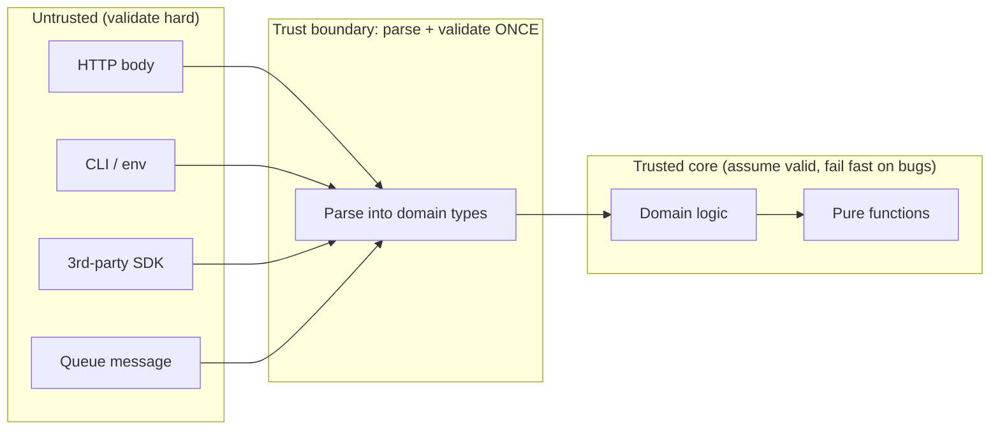
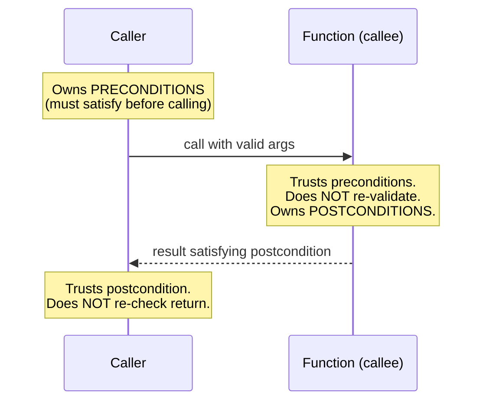
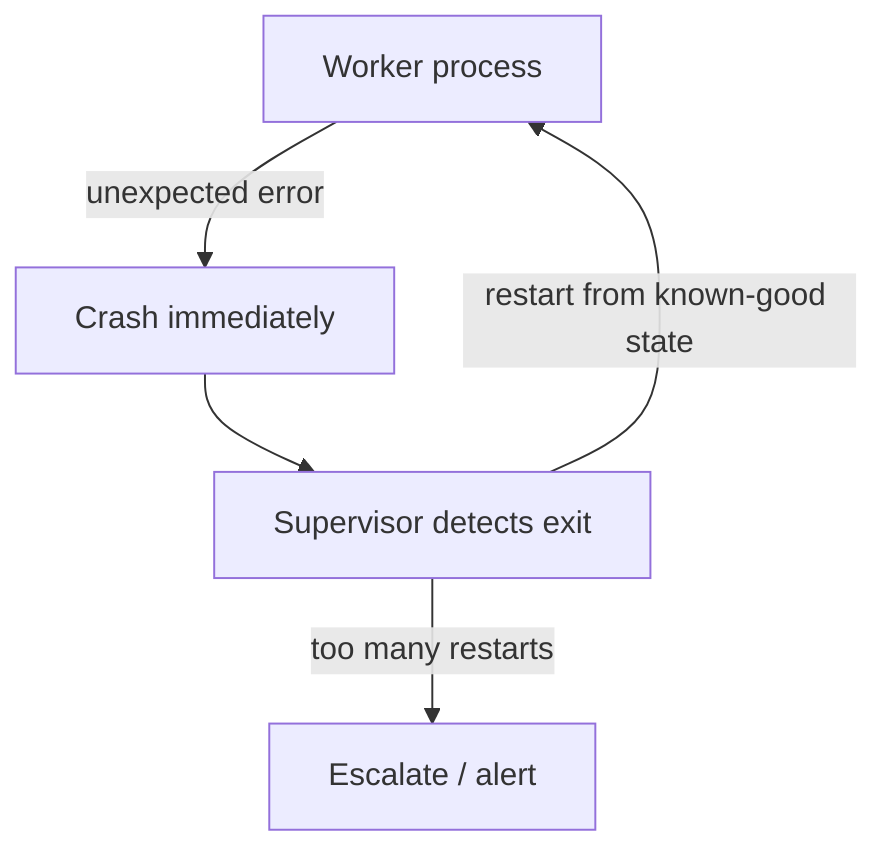

# Defensive vs Offensive — Middle Level

> Focus: "Why?" and "When does it bend?" — where the trust boundary actually lies, when to fail fast versus fail safe, and why over-validation is its own smell.

---

## Table of Contents

1. [The trust boundary is the whole game](#the-trust-boundary-is-the-whole-game)
2. [Fail-fast vs fail-safe is a context decision](#fail-fast-vs-fail-safe-is-a-context-decision)
3. [Assertions vs validation: two different tools](#assertions-vs-validation-two-different-tools)
4. [Design by Contract: who owes what](#design-by-contract-who-owes-what)
5. [Defensive copying: worth it or wasteful](#defensive-copying-worth-it-or-wasteful)
6. ["Let it crash" as principled offensive programming](#let-it-crash-as-principled-offensive-programming)
7. [Defensive vs offensive across languages](#defensive-vs-offensive-across-languages)
8. [Common Mistakes](#common-mistakes)
9. [Test Yourself](#test-yourself)
10. [Cheat Sheet](#cheat-sheet)
11. [Summary](#summary)
12. [Further Reading](#further-reading)
13. [Related Topics](#related-topics)

---

## The trust boundary is the whole game

The single decision that organizes everything in this chapter is: **where does your trusted region begin?** Outside it, you validate ruthlessly (defensive). Inside it, you trust your own types and contracts (offensive). The mistake juniors and paranoid seniors both make is forgetting that the boundary exists at all — they either validate nowhere or validate *everywhere*.

A trust boundary is any point where data crosses from a region you don't control into one you do:

- HTTP request body → your handler
- CLI args / environment variables → your `main`
- A row read from a database written by *another* service → your domain model
- A message pulled off a queue → your consumer
- A return value from a third-party SDK → your call site
- A file/blob uploaded by a user → your parser



Once data has crossed the boundary and been turned into a well-formed domain type (`Email`, `OrderId`, `PositiveQuantity`), every function downstream should **trust** that type. Re-checking `if email == null` in a function that takes a non-null `Email` value object is not "robustness." It is noise that:

- hides the real boundary (now nobody knows which layer is *responsible* for validation),
- produces dead branches that tests can never exercise honestly,
- and trains readers to ignore guard clauses because "they're always there and never fire."

> **Over-validation is a smell.** If a value's type or the contract of the function that produced it already guarantees a property, re-asserting that property in production code is duplication — the same waste that the [DRY principle](../../refactoring/README.md) warns about, applied to invariants instead of logic.

The clean-code formulation is **"parse, don't validate."** Validation answers a yes/no question and throws the answer away. Parsing turns untrusted input into a value whose *type* proves the property, so downstream code can't be wrong. Push parsing to the boundary; trust the parsed types inside.

---

## Fail-fast vs fail-safe is a context decision

"Should I crash on bad input or degrade gracefully?" has no universal answer. It depends entirely on **who is on the other end and what the cost of a wrong answer is.** Three archetypes make the spectrum concrete:

### A batch worker fails fast

A nightly ETL job processing a vendor file should **stop loudly** on the first malformed record (or quarantine it and continue, but never silently coerce). A corrupt row that gets defensively "fixed" into a default poisons every downstream report. Crashing produces a stack trace, an alert, and a human who fixes the feed. Degrading produces wrong numbers nobody notices for a quarter.

```python
def load_row(raw: dict) -> Transaction:
    # Boundary: untrusted vendor data. Fail fast — a bad row is a data bug
    # we want surfaced now, not papered over with defaults.
    amount = raw.get("amount")
    if amount is None:
        raise ValueError(f"missing amount in row {raw!r}")
    return Transaction(amount=Decimal(str(amount)), account=AccountId(raw["account"]))
```

### A user-facing service degrades

A web request handler that can't reach the recommendations service should **not** return a 500 with a stack trace. It returns the page without recommendations. The user's checkout still works. Fail-safe here means *partial functionality beats no functionality* — the blast radius of one dependency is contained.

```go
// User-facing read path: degrade, don't crash. A recommendation outage
// must not take down the product page.
recs, err := s.recs.Fetch(ctx, userID)
if err != nil {
    log.Warn("recs unavailable, serving page without them", "err", err)
    recs = nil // graceful degradation
}
return renderPage(product, recs)
```

### A flight controller does neither naively

Safety-critical software cannot crash (a dead controller is catastrophic) and cannot silently "degrade" by guessing (a wrong actuator command is catastrophic). It uses **redundancy and voting**: multiple independent computations, a majority vote, and a deterministic safe state. The lesson for ordinary engineers is humility — fail-fast and fail-safe are heuristics for *normal* software; high-assurance domains have their own discipline, and you should not cargo-cult either heuristic into them.

| Context | Default posture | Why |
|---|---|---|
| Batch / ETL / migration | **Fail fast** | Wrong data silently propagates; a crash is cheap and surfaces the bug |
| Library / SDK you publish | **Fail fast** on contract violation | The caller's *programming* is wrong; loud failure during their dev is a gift |
| User-facing request handler | **Fail safe** (degrade) | One dependency must not take down the whole experience |
| Background retry-able job | Fail fast, **let the supervisor retry** | Transient faults heal on retry; persistent ones alert |
| Financial posting / ledger | **Fail fast**, never guess | A wrong number is worse than no number |

> The decision is not about your personal taste for robustness. It's about the **cost of a wrong answer versus the cost of no answer** in this specific context.

---

## Assertions vs validation: two different tools

These are constantly confused, and the confusion produces both bugs and security holes. They differ in *who* is at fault, *when* they run, and *whether they survive in production.*

| | Assertion | Validation |
|---|---|---|
| Checks for | A **can't-happen** condition — a bug in *your* code | An **expected** condition — bad input from *outside* |
| If it fires, the fault is | The programmer's | The caller's / the environment's |
| When it should fire | Never, in correct code | Routinely, as normal operation |
| Lives in production? | **May be compiled out** (Java `-ea`, Go build-time, C `NDEBUG`) | **Always on** — it's the actual logic |
| Audience | Developers, during dev/test | End users, attackers, other systems |

The rule that prevents disaster: **never use an assertion to validate untrusted input.** Assertions can be disabled. If your only check that an upload is under 10 MB is `assert size < MAX`, and someone ships with assertions off, the check vanishes and you have a denial-of-service vector.

```java
// CORRECT: assertion guards an internal invariant. If this fires, WE have a bug.
private void applyDiscount(Money subtotal, Percentage rate) {
    assert rate.value() >= 0 && rate.value() <= 100 : "rate normalized at boundary";
    // ... rate is a value type that already enforced this; the assert documents intent
}

// CORRECT: validation guards untrusted input. Always runs, never compiled out.
public Percentage parseRate(String raw) {
    int v = Integer.parseInt(raw);            // throws on garbage — that's fine, it's a boundary
    if (v < 0 || v > 100)                      // expected bad input, not a bug
        throw new BadRequestException("rate must be 0..100, got " + v);
    return new Percentage(v);
}
```

The mental test: *"If this condition is false, is the bug in my code or in the data I was handed?"* My code → assertion. Handed data → validation.

---

## Design by Contract: who owes what

Design by Contract (DbC) assigns responsibility so that **neither side double-checks the other.** Three pieces:

- **Precondition** — what the *caller* must guarantee before calling. (Caller's obligation.)
- **Postcondition** — what the *callee* guarantees on return, *if* the precondition held. (Callee's obligation.)
- **Invariant** — what stays true about an object between method calls.

The payoff is the explicit license to *not* defend. If `sqrt(x: Double)` has the precondition "x ≥ 0," then:

- The **caller** must ensure `x ≥ 0` (validate at the boundary where `x` entered the system).
- The **callee** may *trust* `x ≥ 0` and compute directly — no defensive `if x < 0` branch.



Double-checking — caller validates *and* callee re-validates the same thing — is the contract being honored by nobody and enforced by everybody. It's redundant work and it muddies responsibility: when the value is wrong anyway, which layer was supposed to catch it?

The nuance: contracts only let you skip defense **inside the trust boundary.** A public library function whose callers are the *whole internet* effectively has its precondition crossing a trust boundary, so it validates. A private helper called only by code you control can trust its preconditions and assert (not validate) them. The same function can be defensive or offensive depending on *which side of the boundary its callers are on.*

---

## Defensive copying: worth it or wasteful

Defensive copying means duplicating a mutable input (or output) so external code can't mutate your internal state through a shared reference. It defends against **aliasing bugs**, and it has a real, measurable cost (an allocation + copy per call). So it's a trade-off, not a default.

**Worth it:** untrusted, mutable input that crosses a boundary into long-lived state.

```java
public final class Schedule {
    private final List<LocalDate> dates;

    public Schedule(List<LocalDate> dates) {
        // Untrusted mutable input stored long-term. Copy: caller must not be
        // able to mutate our internals after construction.
        this.dates = List.copyOf(dates);   // immutable copy
    }

    public List<LocalDate> dates() {
        return dates;                       // already immutable — no copy needed on the way out
    }
}
```

**Wasteful:** when any of these already hold, the copy buys nothing:

- The input is **already immutable** (`String`, a value object, a frozen collection, a Go value passed by copy).
- The input is **owned and consumed** — the caller hands it over and never touches it again (document this in the contract).
- The object **never escapes** — it's local and you control every alias.
- You're in a **hot path** and profiling shows the copy dominates; consider an immutable type instead so no copy is *ever* needed.

> The clean version is to make the *type* immutable so the question disappears. If `LocalDate` and `Money` are immutable, you never copy them. Defensive copying is the fallback for when you're forced to accept a mutable type across a boundary — see [Boundaries](../07-boundaries/README.md) for wrapping third-party mutable types.

Language reality check:

- **Go** passes structs by value — accidental sharing happens through slices, maps, and pointers, not plain structs. Copy the slice/map; the struct header is already copied.
- **Python** has no `final`; `tuple`/`frozenset`/`@dataclass(frozen=True)` are your immutable building blocks. A defensive `list(arg)` is the common copy.
- **Java** records and `List.copyOf` make immutability and shallow copies cheap and idiomatic.

---

## "Let it crash" as principled offensive programming

The most aggressive offensive style — **don't write defensive code, let the process die and be restarted clean** — is not recklessness. In Erlang/Elixir's OTP model it is the *foundation* of reliability, and it has spread to Kubernetes pods, serverless functions, and supervised workers everywhere.

The argument: defensive code that tries to recover from an *unexpected* state is the least-tested, least-understood code in the system. You are improvising recovery for a situation you didn't anticipate — by definition you don't know the right action. A clean restart from a known-good state is more predictable than limping forward in a corrupted one.



This only works when the **preconditions** are real:

1. **Supervision** — something is watching and will restart (OTP supervisor, k8s liveness probe, systemd, a job queue with retries).
2. **Small blast radius** — the crashing unit is isolated (one actor, one request, one pod), so its death doesn't corrupt shared state.
3. **Idempotency / safe retry** — restarting and reprocessing doesn't double-charge a card or duplicate an email.
4. **Clean state on restart** — the process boots from a known-good configuration, not from the corrupted in-memory state that caused the crash.

Without those, "let it crash" is just "crash." With them, it's the cleanest possible offensive strategy: push *all* error recovery up to a single supervisory layer that's actually designed and tested for it, and keep the worker code free of defensive clutter. It pairs naturally with fail-fast: the worker fails fast and loud; the supervisor provides the fail-safe at the system level.

---

## Defensive vs offensive across languages

| Concern | Go | Java | Python |
|---|---|---|---|
| Boundary validation | Explicit `if err != nil` after parse; return error | Throw checked/`RuntimeException` or return `Optional`/`Result`-style | Raise `ValueError`/custom exception; or `pydantic` model at the edge |
| Can't-happen check | `panic` (truly unrecoverable) or test-only assert | `assert` (needs `-ea`) | `assert` (stripped under `python -O`) |
| Trusted-core typing | Named types (`type UserID string`) | Value objects / records | `@dataclass(frozen=True)`, `NewType`, mypy strict |
| Defensive copy | Copy slice/map; structs copy by value | `List.copyOf`, defensive constructor copy | `list()`, `dict()`, `copy.deepcopy` (last resort) |
| Let-it-crash | `panic` + supervised process / k8s | Thread dies; container restarts | Unhandled exception → process exit → orchestrator restarts |

The key cross-language point: **`assert` in both Java and Python can be disabled in production** (`-ea` off, `python -O`). Go has no runtime-disabled `assert` at all — which is why idiomatic Go uses explicit error returns at boundaries and reserves `panic` for genuine can't-happens. Never let a disable-able assert be your only line of defense against untrusted input in any of them.

---

## Common Mistakes

1. **Validating the same thing at every layer.** Controller checks non-null, service checks non-null, repository checks non-null. Pick the boundary (the controller), validate once, and let the typed value flow. The inner checks are dead code that lies about where responsibility lives.

2. **Using `assert` to validate user input.** Assertions can be compiled out (`-ea`, `python -O`, `NDEBUG`). If they're your only check, the check disappears in production. Untrusted input is *always* validation, never assertion.

3. **Defensive copying immutable values.** `new ArrayList<>(someImmutableList)` or `list(a_tuple)` "to be safe" allocates for nothing. Immutable in → no copy needed. Know your types.

4. **`try/catch` around every line ("paranoid code").** Wrapping each statement in its own handler hides the real failure mode, swallows stack traces, and makes one logical operation look like ten. Catch at a boundary where you can actually *do* something, not at every call.

5. **Throwing on every contract violation when a `Result`/error return fits better.** If "not found" is an *expected* outcome of a lookup, returning `Optional`/`None`/`(nil, ErrNotFound)` is cleaner than throwing — exceptions are for the exceptional, not the routine. (See [Error Handling](../06-error-handling/README.md).)

6. **Letting it crash without a supervisor.** "Let it crash" minus supervision, isolation, and idempotency is just an outage. The strategy is the *whole* system, not the absence of error handling in one function.

7. **Catching `Exception`/`Throwable`/bare `except` and continuing.** This converts a fail-fast bug into a silent fail-safe guess. You've defended your way into corrupted state that surfaces as a mystery three modules away.

8. **Trusting the boundary, defending the core.** The exact inversion of correct. People sprinkle null checks in pure domain functions while parsing nothing at the actual HTTP/queue edge.

---

## Test Yourself

1. **A private helper takes a `NonEmptyList<Item>` value type but still does `if (items.isEmpty()) throw ...`. Smell or safety?**

<details><summary>Answer</summary>

Smell — over-validation. The type already proves non-emptiness; the helper is inside the trust boundary, so it should trust its types. The check is a dead branch no honest test can exercise. If anything, it should be an `assert` documenting the invariant, not production validation. The right fix is to make the type carry the guarantee (which it does) and delete the check.
</details>

2. **You're writing a published library function. Should it validate its arguments or trust its callers?**

<details><summary>Answer</summary>

Validate — but with a nuance. A public library function's callers are effectively "the whole world," so its preconditions cross a trust boundary; it should validate and fail fast with clear errors (a published function throwing a precise `IllegalArgumentException` during the caller's dev is a feature). A *private* helper called only by code you control can trust its preconditions and use an assert instead. Same code shape, opposite posture, decided by which side of the boundary the callers sit on.
</details>

3. **A nightly batch job hits a malformed record on row 4,000,002 of 10 million. Fail fast or skip and continue?**

<details><summary>Answer</summary>

Default to fail fast (or quarantine the row and continue — but *never* silently coerce it to a default). A bad record usually means the upstream feed is broken; coercing it produces wrong aggregates that nobody catches. Crashing or quarantining surfaces the bug to a human. The only time "skip and continue" is right is when per-record independence is part of the contract and skipped rows are logged and counted, not hidden.
</details>

4. **When is defensive copying genuinely worth its allocation cost?**

<details><summary>Answer</summary>

When you store an *untrusted, mutable* input into *long-lived* state and the caller retains a reference. Then the caller could mutate your internals after the fact. Copy at the boundary (ideally into an immutable type). It's wasteful when the input is already immutable, is consumed/owned by the contract, never escapes, or when profiling shows the copy dominates a hot path — in which case make the type immutable so no copy is ever needed.
</details>

5. **`assert balance >= 0` in a bank's withdrawal code — correct use of assert?**

<details><summary>Answer</summary>

It depends on what produced `balance`. If `balance` came from validated domain logic and a negative value would mean *your code has a bug*, then yes — assert documents a can't-happen invariant. If `balance` could be negative due to *expected* conditions (overdraft, untrusted input, a race with another withdrawal), it must be *validation* that's always on, never an assert that can be compiled out. In a bank, lean toward real validation — the cost of a disabled check is too high.
</details>

6. **"Let it crash" is offered as a reason to delete all error handling from a payment worker. Sound?**

<details><summary>Answer</summary>

Not as stated. "Let it crash" requires supervision (a restarter), isolation (small blast radius), and especially **idempotency** for a payment worker — restarting and reprocessing must not double-charge. Deleting handling without those is just an outage and possibly duplicate charges. With idempotent operations and a supervisor, pushing recovery up to the supervisory layer and keeping the worker clean is exactly right.
</details>

7. **A lookup that frequently returns "no match" throws `NotFoundException`. Defensive, offensive, or wrong?**

<details><summary>Answer</summary>

Wrong tool. Exceptions are for the *exceptional*; a routinely-empty lookup is expected, so model it as `Optional`/`None`/`(nil, ErrNotFound)`. Throwing on a normal outcome is expensive, surprising, and forces callers into `try/catch` for control flow. Reserve throwing for genuine contract violations or truly unexpected failures.
</details>

8. **Where exactly should the single null/format check for an incoming JSON field live in a layered app?**

<details><summary>Answer</summary>

At the boundary where the JSON enters — the deserialization/parse step at the controller or edge. Parse it into a domain type (`Email`, `Quantity`) once; every layer below receives the typed, guaranteed-valid value and must trust it. "Parse, don't validate": the type carries the proof, so inner layers have nothing left to check.
</details>

---

## Cheat Sheet

| Situation | Posture | Concrete move |
|---|---|---|
| Data entering from outside (HTTP, CLI, queue, file, 3rd-party SDK) | **Defensive** | Parse into a domain type at the boundary; validate once |
| Function inside the trusted core | **Offensive** | Trust your types; no re-validation; assert invariants if anything |
| Can't-happen condition (your bug) | Assertion | `assert` — may be compiled out; never guards untrusted input |
| Expected bad input (their fault) | Validation | Always-on check; clear error; lives in production |
| Caller-vs-callee duplicate checks | Pick one | Caller owns preconditions, callee owns postconditions — don't double-check |
| Untrusted mutable input → long-lived state | Defensive copy | Copy into an immutable type at the boundary |
| Already-immutable input | No copy | Trust it; copying is waste |
| User-facing dependency fails | Fail safe | Degrade: serve partial result, log, continue |
| Batch/ledger/migration hits bad data | Fail fast | Stop or quarantine; never coerce to a default |
| Supervised, isolated, idempotent worker | Let it crash | Push recovery to the supervisor; keep worker code clean |
| Routine "not found" / "empty" outcome | Result return | `Optional`/`None`/error value, not an exception |

**One-line test for assert vs validate:** *If this is false, is the bug in my code (→ assert) or in the data I was handed (→ validate)?*

---

## Summary

Defensive vs offensive is not a personality (cautious vs bold) — it's a **map with a boundary drawn on it.** Outside the trust boundary you are uncompromisingly defensive: parse untrusted input into domain types, validate once, fail fast (or fail safe) according to context. Inside the boundary you are deliberately offensive: trust your types and contracts, skip the re-checks, and let assertions document — not enforce — the can't-happens.

The four decisions that follow from the boundary:

- **Fail-fast vs fail-safe** is chosen by *cost of a wrong answer vs cost of no answer*: batch jobs and ledgers fail fast, user-facing reads degrade, safety-critical systems do neither naively.
- **Assertions vs validation** is chosen by *whose fault it is*: your bug → assert (may be compiled out); their data → validation (always on).
- **Design by Contract** assigns ownership so neither side double-checks: caller satisfies preconditions, callee guarantees postconditions.
- **Defensive copying** is justified only for untrusted *mutable* input crossing into long-lived state; immutable types make the question vanish.

And the most aggressive offensive style — **let it crash** — is principled *only* with supervision, isolation, and idempotency, at which point it's the cleanest way to keep recovery in one tested place.

---

## Further Reading

- *The Pragmatic Programmer* (Hunt & Thomas) — "Dead Programs Tell No Lies," "Design by Contract," and "Assertive Programming."
- *Code Complete* (McConnell), Ch. 8 "Defensive Programming" — the assertions-vs-validation distinction in depth.
- Alexis King, *"Parse, Don't Validate"* — the type-driven boundary argument.
- Joe Armstrong, *"Making Reliable Distributed Systems in the Presence of Software Errors"* — the original "let it crash" / supervision thesis.
- Bertrand Meyer, *Object-Oriented Software Construction* — the canonical treatment of Design by Contract.

---

## Related Topics

- [junior.md](junior.md) — the definitions: what defensive and offensive programming each mean, with first examples.
- [senior.md](senior.md) — boundary architecture at scale, contract testing, observability, and the failure-recovery layer.
- [Chapter README](../README.md) — the positive rules this chapter's anti-patterns invert.
- [Error Handling](../06-error-handling/README.md) — exceptions vs result types, where throwing is and isn't appropriate.
- [Boundaries](../07-boundaries/README.md) — wrapping third-party and untrusted code, the home of the trust boundary.
- [Anti-Patterns](../../anti-patterns/README.md) — over-validation and paranoid `try/catch` as recognizable smells.
- [Refactoring](../../refactoring/README.md) — extracting boundary validation and removing duplicated guard clauses safely.
