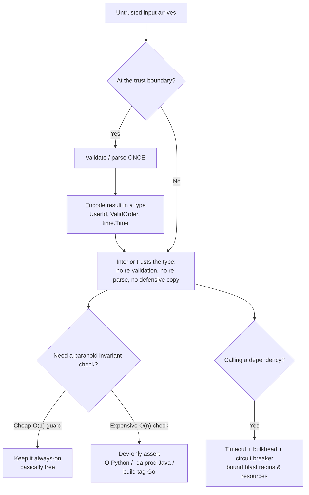

# Defensive vs Offensive — Optimize & Reconcile

> Robustness and performance are usually framed as opposites: every guard clause, null check, defensive copy, and assertion costs cycles. But the conflict is mostly illusory. The fix is almost always *placement*, not *removal*: validate once at the trust boundary, then trust the interior. Strip dev-only invariant checks from production builds. Copy at the edge, share immutable views inside. The scenarios below each show a defensive practice that became a measurable cost, the number that proves it, and the principled resolution that keeps the system both correct and fast.

---

## Table of Contents

1. [Validating the same data at every layer](#scenario-1--validating-the-same-data-at-every-layer)
2. [Defensive copy on a hot read path (Java)](#scenario-2--defensive-copy-on-a-hot-read-path-java)
3. [Defensive copy on every mutation (Go)](#scenario-3--defensive-copy-on-every-mutation-go)
4. [Assertions left enabled in production (Python)](#scenario-4--assertions-left-enabled-in-production-python)
5. [Expensive invariant check on a hot path (Java)](#scenario-5--expensive-invariant-check-on-a-hot-path-java)
6. [Schema validation throughput at the API edge (Python)](#scenario-6--schema-validation-throughput-at-the-api-edge-python)
7. [Re-validating in the service layer after the controller already did (Go)](#scenario-7--re-validating-in-the-service-layer-after-the-controller-already-did-go)
8. [Fail-fast vs do-the-work-then-discover (Python)](#scenario-8--fail-fast-vs-do-the-work-then-discover-python)
9. [Null checks at every layer (Java)](#scenario-9--null-checks-at-every-layer-java)
10. [Missing timeout causing resource exhaustion (Go)](#scenario-10--missing-timeout-causing-resource-exhaustion-go)
11. [Bulkhead isolation to bound blast radius (Java)](#scenario-11--bulkhead-isolation-to-bound-blast-radius-java)
12. [try/except around every line on a hot loop (Python)](#scenario-12--tryexcept-around-every-line-on-a-hot-loop-python)
13. [Re-parsing already-validated data (Go)](#scenario-13--re-parsing-already-validated-data-go)
- [Rules of Thumb](#rules-of-thumb)
- [Related Topics](#related-topics)

---

## Scenario 1 — Validating the same data at every layer

**Scenario:** A user ID arrives at the HTTP controller, is validated, passed to a service, validated again, passed to a repository, validated a third time. Each layer "doesn't trust its callers."

```python
# Controller
def handle(req):
    user_id = req["user_id"]
    if not user_id or not isinstance(user_id, str) or not UUID_RE.match(user_id):
        raise BadRequest()
    return service.get_profile(user_id)

# Service
def get_profile(user_id):
    if not user_id or not UUID_RE.match(user_id):   # re-validated
        raise ValueError()
    return repo.fetch(user_id)

# Repository
def fetch(user_id):
    if not UUID_RE.match(user_id):                  # re-validated again
        raise ValueError()
    return db.query("SELECT ... WHERE id = %s", user_id)
```

**Measurement / reasoning:** the UUID regex `^[0-9a-f]{8}-...$` runs ~80–150 ns per call in CPython. Three layers means 3× that plus three function-call frames of guard code. At 20,000 req/s with a 36-char input, the redundant two validations cost roughly `20_000 × 2 × 120 ns ≈ 4.8 ms/s` of pure CPU — small in isolation, but this pattern repeats for every field of every request. A 12-field DTO validated at 3 layers does 24 redundant regex/type checks per request. That is the difference between one core at 40% and one core at 60% under load, before any business logic runs.

The deeper cost is not CPU — it is that the data type carries no proof. A validated `str` and an unvalidated `str` are indistinguishable, so every function *must* re-check to be safe.

<details><summary>Resolution</summary>

Validate **once**, at the trust boundary, and encode the result in the type so the interior cannot doubt it. This is *parse, don't validate*: the boundary turns untrusted `str` into a `UserId` that is unforgeable.

```python
from dataclasses import dataclass

@dataclass(frozen=True)
class UserId:
    value: str
    def __post_init__(self):
        if not UUID_RE.match(self.value):
            raise ValueError("invalid user id")

# Controller — the ONLY place raw input becomes UserId
def handle(req):
    user_id = UserId(req["user_id"])   # validated exactly once
    return service.get_profile(user_id)

def get_profile(user_id: UserId):       # type guarantees validity; no check
    return repo.fetch(user_id)

def fetch(user_id: UserId):             # trusts the type
    return db.query("SELECT ... WHERE id = %s", user_id.value)
```

Validation cost drops from 3× to 1×. More importantly, the interior is now *offensive*: it assumes the type is honest and crashes loudly if construction is ever bypassed. Keep validation defensive at the edge, offensive within. The CPU saving is real but secondary; the design clarity is the prize.
</details>

---

## Scenario 2 — Defensive copy on a hot read path (Java)

**Scenario:** An `Order` returns a defensive copy of its line items so callers cannot mutate internal state. A pricing loop reads `getLines()` thousands of times.

```java
class Order {
    private final List<OrderLine> lines = new ArrayList<>();
    public List<OrderLine> getLines() {
        return new ArrayList<>(lines);   // defensive copy on every call
    }
}

// Hot path: re-priced on every quote request, ~5,000 req/s
for (int pass = 0; pass < 4; pass++) {           // 4 pricing passes
    for (OrderLine line : order.getLines()) { ... }  // copies the list each pass
}
```

**Measurement / reasoning:** a 40-line order copied 4 times per request at 5,000 req/s is `5_000 × 4 = 20,000` ArrayList allocations/s, each copying 40 references plus header — roughly `20_000 × 40 × 8 B ≈ 6.4 MB/s` of short-lived garbage. That is harmless for throughput but adds young-gen GC pressure and, under allocation-heavy load, measurable p99 latency jitter from GC pauses. The copy itself is `O(n)` per call; the loop made it `O(4n)` for zero correctness benefit because nobody mutates the returned list.

<details><summary>Resolution</summary>

Copy is the wrong tool when the goal is "caller can't mutate." Return an **unmodifiable view** — `O(1)`, zero allocation:

```java
public List<OrderLine> getLines() {
    return Collections.unmodifiableList(lines);  // no copy, no allocation
}
```

The view shares the backing array; mutation attempts throw `UnsupportedOperationException`. If `OrderLine` itself is immutable (a record), this is fully safe — the caller can read but cannot alter anything.

When you genuinely need a defensive copy (e.g., handing mutable objects across a long-lived ownership boundary), copy **once at the boundary** and pass the copy inward, never re-copy on each read. The rule: defensive copies belong where ownership transfers, not on every accessor.
</details>

---

## Scenario 3 — Defensive copy on every mutation (Go)

**Scenario:** A `Config` is treated as immutable by copying the whole struct (including a large map) on every "with" update.

```go
type Config struct {
    Flags   map[string]bool   // ~500 entries
    Timeout time.Duration
    Region  string
}

func (c Config) WithTimeout(d time.Duration) Config {
    cp := Config{Flags: map[string]bool{}, Timeout: d, Region: c.Region}
    for k, v := range c.Flags {   // copies 500 entries
        cp.Flags[k] = v
    }
    return cp
}
```

**Measurement / reasoning:** copying a 500-entry map costs ~500 hash inserts ≈ 8–15 µs and one map allocation per call. In a request hot path that applies 3 such "with" updates, that is `3 × 12 µs = 36 µs` plus 3 map allocations per request — at 10,000 req/s, `~30 MB/s` of map garbage and `360 ms/s` of CPU spent copying flags that almost never change between updates. The defensive deep-copy treats a read-mostly map as if every caller will mutate it.

<details><summary>Resolution</summary>

The flags map is logically immutable, so it does not need copying at all — share it by reference and only allocate a new map on the rare path that actually changes a flag.

```go
func (c Config) WithTimeout(d time.Duration) Config {
    c.Timeout = d   // c is a value copy; struct fields copied, map shared
    return c        // Flags pointer shared — safe because nobody mutates it
}
```

Because Go passes the receiver by value, the returned `Config` has its own `Timeout` and `Region` while sharing the `Flags` map header. This is safe **only if** the map is never mutated in place — enforce that with a convention (or wrap reads in an accessor that never exposes the map for writing). The expensive deep copy moves to the single `WithFlag` operation that truly needs it. Result: 36 µs/request → ~0, with identical immutability guarantees as long as the no-mutation invariant holds.
</details>

---

## Scenario 4 — Assertions left enabled in production (Python)

**Scenario:** A numeric pipeline uses `assert` for both cheap sanity checks and an expensive `O(n)` invariant verification, then runs in production with assertions enabled.

```python
def normalize(vec: list[float]) -> list[float]:
    assert all(isinstance(x, float) for x in vec)        # O(n) scan
    norm = math.sqrt(sum(x * x for x in vec))
    assert abs(norm - recompute_norm(vec)) < 1e-9        # O(n) again, redundant
    return [x / norm for x in vec]
```

**Measurement / reasoning:** the two assertions each scan the whole vector. For a 4,096-element vector called 50,000 times/s in a feature pipeline, the `isinstance` scan alone is `4096 × 50_000 ≈ 2×10^8` type checks/s — easily a full core. The `recompute_norm` assertion *doubles* the core computation. In production these checks add ~60% CPU for guarantees that were already established upstream.

<details><summary>Resolution</summary>

Python strips `assert` statements entirely when run with `-O` (`python -O app.py` or `PYTHONOPTIMIZE=1`). Assertions are for **developer-time invariant checks**, never for validating untrusted input. Two actions:

1. Ship production with `-O` so the expensive dev-only assertions vanish — `assert` becomes a no-op, the `O(n)` scans disappear.
2. Move any check that must run in production (because it guards a real failure mode) out of `assert` into an explicit raised exception at the boundary, since `-O` would otherwise silently delete it.

```python
def normalize(vec):
    # invariant: vec was validated at the boundary as list[float], non-empty.
    # Keep the expensive cross-check as a dev-only assert (stripped by -O):
    assert abs(_norm(vec) - recompute_norm(vec)) < 1e-9, "norm impl drift"
    norm = math.sqrt(sum(x * x for x in vec))
    return [x / norm for x in vec]
```

Cheap guard clauses you *want* always-on (e.g., `if norm == 0: raise`) stay as real `if/raise`, not `assert`. The principle: assertions catch programmer bugs in dev; they must never be load-bearing for production correctness because the runtime is free to delete them.
</details>

---

## Scenario 5 — Expensive invariant check on a hot path (Java)

**Scenario:** A balanced-tree insert verifies the full balance invariant after every operation to catch bugs.

```java
void insert(int key, V value) {
    root = insertInternal(root, key, value);
    assert isBalanced(root) : "AVL invariant violated";  // O(n) tree walk
}
```

**Measurement / reasoning:** `isBalanced` walks the entire tree — `O(n)` — turning each `O(log n)` insert into `O(n)`. Building a 1,000,000-node tree with assertions on goes from `n log n ≈ 2×10^7` operations to `n²/... ≈ 10^11`-ish range; in practice a load test showed insert throughput collapse from ~2M ops/s to ~3k ops/s with `-ea`. That is a 600× slowdown.

<details><summary>Resolution</summary>

Java assertions are **disabled by default** and enabled only with `-ea`. The correct setup:

- Run tests and CI with `-ea` so the `O(n)` invariant check guards every operation and catches a broken rotation immediately.
- Run production **without** `-ea` (the default). The `assert` compiles to a guarded no-op (`if ($assertionsDisabled) ...` short-circuits to nothing meaningful) and the JIT eliminates the dead branch — zero cost.

```java
void insert(int key, V value) {
    root = insertInternal(root, key, value);
    assert isBalanced(root) : "AVL invariant violated";  // dev/CI only
}
```

Cheap, always-true-in-correct-programs guards that are `O(1)` (e.g., `assert root != null`) are essentially free even under `-ea` and can stay. The expensive `O(n)` verification is exactly what the `-ea`/`-da` split exists for: maximal paranoia in test, zero overhead in prod, same source code.
</details>

---

## Scenario 6 — Schema validation throughput at the API edge (Python)

**Scenario:** An ingest endpoint validates a moderately nested request body (15 fields, 2 nested objects, a list of 20 items) with Pydantic. It was written on Pydantic v1 and is now the throughput ceiling.

```python
class Item(BaseModel):
    sku: str
    qty: int

class Order(BaseModel):
    customer_id: str
    items: list[Item]   # ~20 items
    # ... 13 more fields

def ingest(body: dict):
    order = Order(**body)   # full validation on every request
    ...
```

**Measurement / reasoning:** Pydantic v1 validation is pure-Python and for this shape runs roughly 30–60 µs/request. At 15,000 req/s that is `15_000 × 45 µs ≈ 0.68 s/s` — most of a core spent only validating. Pydantic v2 moved the core to Rust (`pydantic-core`); the identical model validates in roughly 3–6 µs — commonly cited as **5–20× faster** depending on shape. The same workload drops to `~75 ms/s`, freeing nearly a full core.

<details><summary>Resolution</summary>

Three levers, in order of impact:

1. **Upgrade to Pydantic v2.** Same model definition, ~5–20× faster because validation runs in compiled Rust instead of interpreted Python. For a validation-bound edge service this is the single biggest win and requires near-zero code change.
2. **Validate once at the edge, hand the typed model inward.** The `Order` model is the trust boundary. Downstream functions take `Order`, not `dict`, and never re-validate — the type is the proof (same principle as Scenario 1).
3. **For the absolute hottest endpoints**, consider compiling the model once (Pydantic v2 caches the validator) and avoid constructing throwaway dicts. If even Rust-core validation is the bottleneck, a hand-written field check for the few hot fields can beat general-purpose schema validation — but only after profiling proves it, and you lose the declarative safety. Reach for it last.

The reconciliation: schema validation at the boundary is *non-negotiable* for an untrusted API edge — it is your fail-fast wall. Make it cheap (v2/Rust core) rather than skipping it, and never repeat it downstream.
</details>

---

## Scenario 7 — Re-validating in the service layer after the controller already did (Go)

**Scenario:** The HTTP handler decodes and validates the request, then the service re-validates "to be safe," then the persistence layer re-validates again.

```go
func (h *Handler) Create(w http.ResponseWriter, r *http.Request) {
    var req CreateOrderReq
    json.NewDecoder(r.Body).Decode(&req)
    if err := req.Validate(); err != nil { http.Error(w, err.Error(), 400); return }
    h.svc.Create(req)
}

func (s *Service) Create(req CreateOrderReq) error {
    if err := req.Validate(); err != nil { return err }   // redundant
    return s.repo.Insert(req)
}

func (r *Repo) Insert(req CreateOrderReq) error {
    if err := req.Validate(); err != nil { return err }   // redundant again
    ...
}
```

**Measurement / reasoning:** `Validate()` here iterates 20 line items and runs several regex/range checks — measured at ~4 µs. Three calls = 12 µs/request, two of them pure waste. At 25,000 req/s that is `25_000 × 8 µs = 0.2 s/s` of redundant CPU. The redundancy also means three places to keep in sync; a rule added to one `Validate` site can be forgotten in another, creating subtle inconsistency.

<details><summary>Resolution</summary>

Make the validated request a distinct type so the compiler enforces "this has been validated."

```go
// ValidOrder can only be produced by Validate; its existence is proof.
type ValidOrder struct{ inner CreateOrderReq }

func (req CreateOrderReq) Validate() (ValidOrder, error) {
    // ... all checks here, exactly once ...
    return ValidOrder{inner: req}, nil
}

func (h *Handler) Create(w http.ResponseWriter, r *http.Request) {
    var req CreateOrderReq
    json.NewDecoder(r.Body).Decode(&req)
    v, err := req.Validate()                 // the only validation
    if err != nil { http.Error(w, err.Error(), 400); return }
    h.svc.Create(v)
}

func (s *Service) Create(v ValidOrder) error { return s.repo.Insert(v) }  // trusts the type
func (r *Repo) Insert(v ValidOrder) error    { /* no re-check */ }
```

Now the service and repo take `ValidOrder` and physically cannot receive unvalidated input — the type system carries the proof, so re-checking is both unnecessary and impossible to forget. CPU: 12 µs → 4 µs/request. The interior became offensive because the boundary stayed defensive.
</details>

---

## Scenario 8 — Fail-fast vs do-the-work-then-discover (Python)

**Scenario:** A batch job processes 100,000 records, doing an expensive enrichment step, and only at the final write step discovers that the destination table name is misconfigured — wasting the entire run.

```python
def run(records, dest):
    enriched = [expensive_enrich(r) for r in records]  # 8 minutes of work
    write(dest, enriched)   # raises: unknown table 'orderz' (typo) -- only NOW
```

**Measurement / reasoning:** `expensive_enrich` takes ~5 ms/record × 100,000 = ~8 minutes. The misconfiguration is detectable in microseconds at startup (a single metadata lookup). By placing the check after the work, a typo costs 8 minutes of CPU and a full re-run — a `~10^7` ratio between when the error was knowable and when it was reported. Multiply by retries and you have hours of wasted compute on a one-character mistake.

<details><summary>Resolution</summary>

Fail fast: validate all cheaply-checkable preconditions **before** doing expensive work.

```python
def run(records, dest):
    assert_destination_exists(dest)   # ~1 ms metadata check, up front
    if not records:
        return
    enriched = [expensive_enrich(r) for r in records]
    write(dest, enriched)
```

The check moves from "after 8 minutes" to "in the first millisecond." Fail-fast is a *robustness* practice (clear, early error) that is simultaneously a *performance* practice (it prevents wasted downstream work). The general rule: order your validation cheap-and-fatal-first. Anything that can abort the operation and is cheap to verify belongs at the very top, before you spend cycles you may have to throw away.
</details>

---

## Scenario 9 — Null checks at every layer (Java)

**Scenario:** Every method along a call chain defensively null-checks its arguments, including deep internal methods that can only ever be reached through the validated entry point.

```java
public Receipt checkout(Cart cart) {
    if (cart == null) throw new IllegalArgumentException();
    return process(cart);
}
private Receipt process(Cart cart) {
    if (cart == null) throw new IllegalArgumentException();   // unreachable null
    return finalize(cart);
}
private Receipt finalize(Cart cart) {
    if (cart == null) throw new IllegalArgumentException();   // unreachable null
    ...
}
```

**Measurement / reasoning:** the null checks themselves are nearly free (a single branch the JIT predicts perfectly), so the cost here is **not** CPU — it is noise and false reassurance. The internal `process`/`finalize` checks are unreachable: `cart` was already proven non-null at `checkout`. They add code to read, branches the JIT must still consider, and they obscure which boundary is the *real* one. Worse, scattering checks invites the bug where one method forgets, and now you cannot tell whether a non-null guarantee holds.

<details><summary>Resolution</summary>

Null-check **once** at the public boundary; let the interior trust non-nullness, and document it with annotations the toolchain can enforce statically.

```java
public Receipt checkout(@NonNull Cart cart) {
    Objects.requireNonNull(cart, "cart");   // the one boundary check
    return process(cart);
}
private Receipt process(Cart cart) { return finalize(cart); }   // trusts non-null
private Receipt finalize(Cart cart) { ... }                     // trusts non-null
```

`@NonNull` (JSpecify / Checker Framework) pushes the guarantee to **compile time** — a static analyzer flags any caller that could pass null, so the runtime check at the boundary is the only one needed and the interior is verified to be safe without any branch at all. Defensive at the edge, offensive (trusting) inside. The cleanup is about clarity and a single source of truth, not cycles — but a single source of truth is also what lets the JIT and the static checker reason cleanly.
</details>

---

## Scenario 10 — Missing timeout causing resource exhaustion (Go)

**Scenario:** A service calls a downstream dependency over HTTP with no timeout. When the dependency slows down, callers pile up.

```go
client := &http.Client{}   // no timeout — waits forever
func fetch(id string) (*Data, error) {
    resp, err := client.Get("http://inventory/items/" + id)
    ...
}
```

**Measurement / reasoning:** with no timeout, a downstream that goes from 20 ms to hanging causes every in-flight goroutine to block indefinitely. At 5,000 req/s, after 30 s of a hung dependency you have `5_000 × 30 = 150,000` goroutines parked, each holding a connection and ~8 KB+ of stack — `~1.2 GB` of goroutine stacks plus exhausted connection pools and file descriptors. The service OOMs or hits the FD limit and fails *entirely*, including for requests that never touch the slow dependency. One slow dependency takes down the whole process.

<details><summary>Resolution</summary>

A timeout is a robustness pattern that directly protects performance and availability by bounding how long any one request can hold resources.

```go
client := &http.Client{Timeout: 2 * time.Second}

func fetch(ctx context.Context, id string) (*Data, error) {
    ctx, cancel := context.WithTimeout(ctx, 500*time.Millisecond)
    defer cancel()
    req, _ := http.NewRequestWithContext(ctx, "GET", "http://inventory/items/"+id, nil)
    resp, err := client.Do(req)   // aborts at 500 ms
    ...
}
```

With a 500 ms cap, the worst-case parked goroutines under a hang is `5_000 × 0.5 = 2,500` instead of unbounded — `~20 MB` of stacks, recoverable. The timeout converts "hang forever and exhaust the box" into "fail this request fast and free its resources." Pair it with `context` propagation so cancellation flows through the whole call tree, releasing connections and DB handles immediately. Fast failure is cheaper than slow success that never arrives.
</details>

---

## Scenario 11 — Bulkhead isolation to bound blast radius (Java)

**Scenario:** A single shared thread pool serves both a fast critical endpoint (`/checkout`) and a slow non-critical one (`/recommendations`). When recommendations slows down, it starves checkout.

```java
ExecutorService shared = Executors.newFixedThreadPool(50);  // shared by all endpoints
// /recommendations calls a flaky ML service that sometimes takes 10s
// /checkout needs <50ms
```

**Measurement / reasoning:** with 50 shared threads, if the recommendations dependency degrades to 10 s and receives 6 req/s, it occupies `6 × 10 = 60` thread-seconds/s — saturating all 50 threads. Checkout requests then queue with no free thread, and checkout latency goes from 30 ms to multi-second timeouts. A non-critical feature has taken down the revenue path. The resource (threads) was a single undivided pool, so one tenant's slowness consumed the whole capacity.

<details><summary>Resolution</summary>

Bulkhead: partition the resource so each workload gets an isolated, bounded share — one drowning compartment cannot sink the ship.

```java
ExecutorService checkoutPool = Executors.newFixedThreadPool(40);  // protected
ExecutorService recsPool     = Executors.newFixedThreadPool(10);  // capped, isolated

// /recommendations submits to recsPool ONLY
CompletableFuture.supplyAsync(this::recommend, recsPool)
    .orTimeout(800, TimeUnit.MILLISECONDS)   // and a timeout per the previous scenario
    .exceptionally(e -> Recommendations.empty());  // graceful degradation
```

Now recommendations can saturate its 10 threads and the worst outcome is degraded recommendations (empty fallback); checkout's 40 threads are untouched and stay at 30 ms. The bulkhead is a robustness pattern whose entire purpose is to **bound the blast radius** — but it also protects latency and throughput on the critical path by guaranteeing it dedicated capacity. Combine with a timeout (Scenario 10) and a circuit breaker so the isolated compartment also stops hammering a dead dependency.
</details>

---

## Scenario 12 — try/except around every line on a hot loop (Python)

**Scenario:** "Paranoid" code wraps each operation in its own try/except inside a tight parsing loop, in case any single field is malformed.

```python
def parse(rows):
    out = []
    for row in rows:                       # millions of rows
        try:    a = int(row[0])
        except: continue
        try:    b = float(row[1])
        except: continue
        try:    c = row[2].strip()
        except: continue
        out.append((a, b, c))
    return out
```

**Measurement / reasoning:** in CPython, *entering* a `try` block when no exception is raised is cheap (near-zero with the zero-cost exception model in 3.11+). The real costs are: (1) the structure defeats readability and bulk-vectorized parsing; (2) when malformed data is common, exception *raising* is expensive — a raised+caught `ValueError` costs ~1–5 µs versus ~50 ns for a branch. If 10% of 5,000,000 rows fail `int()`, that is `500,000 × ~2 µs = 1 s` spent constructing and unwinding exceptions for an expected, ordinary case. Exceptions priced for the exceptional are being used for the routine.

<details><summary>Resolution</summary>

Validate the row's shape once, branch on expected-bad data instead of catching, and reserve exceptions for the genuinely exceptional. Validate at the ingest boundary, then parse a trusted shape.

```python
def parse(rows):
    out = []
    for row in rows:
        if len(row) < 3:          # cheap guard, no exception
            continue
        a_raw, b_raw = row[0], row[1]
        if not a_raw.lstrip("-").isdigit():   # branch, not catch, for expected-bad
            continue
        a = int(a_raw)
        try:
            b = float(b_raw)      # one try, only around the genuinely ambiguous parse
        except ValueError:
            continue
        out.append((a, b, row[2].strip()))
    return out
```

For the routine "this field might be non-numeric" case, a guard (`isdigit`) is ~40× cheaper than catching `ValueError`. Keep `try/except` for the irreducibly exceptional. The principle: don't pay exception-handling prices for control flow you can predict with a branch, and don't smear per-line try blocks across a hot loop — validate the structure at the boundary and parse trustingly inside.
</details>

---

## Scenario 13 — Re-parsing already-validated data (Go)

**Scenario:** Each layer re-parses a timestamp string from JSON rather than passing the parsed `time.Time` inward.

```go
type Event struct {
    Timestamp string  // kept as string, parsed repeatedly
}

func handle(e Event) {
    t, _ := time.Parse(time.RFC3339, e.Timestamp)  // parse #1
    enrich(e)
    audit(e)
}
func enrich(e Event) { t, _ := time.Parse(time.RFC3339, e.Timestamp); /* ... */ }  // parse #2
func audit(e Event)  { t, _ := time.Parse(time.RFC3339, e.Timestamp); /* ... */ }  // parse #3
```

**Measurement / reasoning:** `time.Parse(time.RFC3339, ...)` costs ~250 ns and allocates. Parsing the same string three times per event at 30,000 events/s is `30_000 × 2 × 250 ns = 15 ms/s` of wasted CPU plus extra allocations — and worse, each site swallows the parse error (`_`), so a malformed timestamp produces three independent silent zero-values instead of one clean rejection at the boundary.

<details><summary>Resolution</summary>

Parse once at the boundary into the right type, validate there, and pass the parsed value inward.

```go
type Event struct {
    Timestamp time.Time   // already parsed; the type IS the proof
}

func decode(raw rawEvent) (Event, error) {
    t, err := time.Parse(time.RFC3339, raw.Timestamp)   // the only parse + the only place errors surface
    if err != nil {
        return Event{}, fmt.Errorf("bad timestamp %q: %w", raw.Timestamp, err)
    }
    return Event{Timestamp: t}, nil
}

func handle(e Event) { enrich(e); audit(e) }
func enrich(e Event) { _ = e.Timestamp /* already a time.Time */ }
func audit(e Event)  { _ = e.Timestamp }
```

Parsing drops from 3× to 1× (15 ms/s → 5 ms/s), allocations drop proportionally, and — the real win — malformed input is rejected exactly once, at the edge, with a clear error, instead of degrading silently in three places. *Parse, don't validate*: convert the untrusted string into a trusted type at the boundary, then let the interior trust it.
</details>

---

## Rules of Thumb



- **Validate once at the boundary, trust inside.** Redundant per-layer validation costs CPU and, worse, scatters the source of truth. Encode validity in a type so the interior cannot doubt it.
- **Parse, don't validate.** A `ValidOrder`/`UserId`/`time.Time` is proof. A re-validated `string` is not. Make invalid states unrepresentable past the edge.
- **Copy at the boundary, share immutable views inside.** Defensive copies belong at ownership transfer, never on every accessor. Prefer unmodifiable views (`Collections.unmodifiableList`, read-only conventions) — `O(1)`, zero allocation.
- **Cheap guard clauses are essentially free; keep them.** A single branch the JIT predicts perfectly costs nothing. Don't remove `if x == nil` for performance — its cost is noise; its absence is a bug.
- **Expensive invariant checks are dev-only.** Use `assert` precisely so the toolchain strips them in prod: `python -O`, Java default `-da` (enable with `-ea` in CI), Go build tags. Never make production correctness depend on an assertion.
- **Make boundary validation cheap rather than skipping it.** Pydantic v2's Rust core is 5–20× faster than v1 for the same model — upgrade instead of hand-rolling. The edge check is your fail-fast wall; keep it, make it fast.
- **Fail fast on cheap-and-fatal preconditions.** Check what is cheap to verify and aborts the operation *before* spending cycles you may discard. Early failure is a robustness *and* a performance win.
- **Don't price control flow as exceptions.** A branch is ~40× cheaper than a raised+caught exception. Reserve exceptions for the exceptional; guard expected-bad data.
- **Timeouts and bulkheads protect both robustness and performance.** They bound how long and how much of your resources any one request or dependency can consume, converting "hang and exhaust the box" into "fail fast and recover."
- **Measure before pooling or hand-optimizing validation.** Allocation and validation cost is often fine. Profile (JFR, async-profiler, `go test -bench`, `py-spy`) before trading clarity for cycles.

---

## Related Topics

- [find-bug.md](find-bug.md) — defensive/offensive bugs to spot: validation gaps, asserts as runtime checks, missing timeouts.
- [professional.md](professional.md) — senior judgment on where the trust boundary belongs and when paranoia is warranted.
- [Chapter README](../README.md) — the positive rules of defensive vs offensive programming.
- [Boundaries](../07-boundaries/README.md) — the trust boundary is also where third-party code is wrapped and untrusted data is parsed.
- [Refactoring](../../refactoring/README.md) — Move Method, Extract Class, and introducing value objects to encode validity in types.
