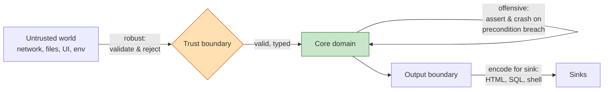
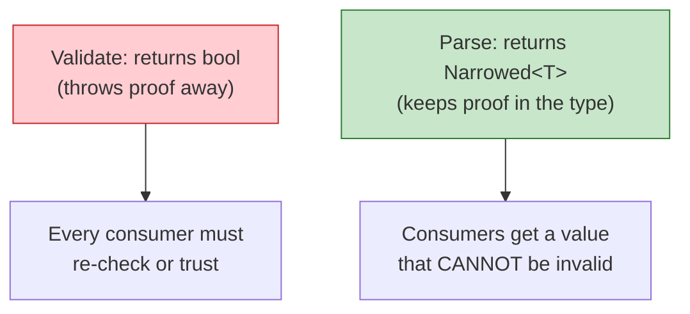

# Defensive vs Offensive — Professional Level

> Focus: the theory underneath the practice. Design by Contract as a *specification*, who is to blame when a contract breaks, fail-fast and crash-only systems, the modern case against Postel's Law, making illegal states unrepresentable, executable contracts (assertions, JML, property tests), and where input validation stops being a style choice and becomes a security boundary.

---

## Table of Contents

1. [The vocabulary: defensive, offensive, robust, correct](#the-vocabulary-defensive-offensive-robust-correct)
2. [Design by Contract: the specification view](#design-by-contract-the-specification-view)
3. [Blame assignment: who broke the contract](#blame-assignment-who-broke-the-contract)
4. [Fail fast and crash-only software](#fail-fast-and-crash-only-software)
5. [Offensive programming vs the robustness principle](#offensive-programming-vs-the-robustness-principle)
6. [Making illegal states unrepresentable](#making-illegal-states-unrepresentable)
7. [Executable contracts: assertions, JML, property tests](#executable-contracts-assertions-jml-property-tests)
8. [The cost and coverage of defensive code](#the-cost-and-coverage-of-defensive-code)
9. [Security: trust boundaries, taint, validation vs encoding](#security-trust-boundaries-taint-validation-vs-encoding)
10. [Common Mistakes](#common-mistakes)
11. [Test Yourself](#test-yourself)
12. [Cheat Sheet](#cheat-sheet)
13. [Summary](#summary)
14. [Further Reading](#further-reading)
15. [Related Topics](#related-topics)

---

## The vocabulary: defensive, offensive, robust, correct

These four words get used loosely. Precision matters because they prescribe *opposite* actions at a contract violation.

- **Defensive programming** — code that anticipates *misuse by its caller* and copes with it (null guards, defensive copies, swallowing exceptions). It optimizes for *the program continuing to run* even when its preconditions are violated.
- **Offensive programming** — code that *refuses to continue* on a violated precondition. It optimizes for *bugs surfacing immediately and loudly* at the point of corruption. "Fail fast" is its operational slogan.
- **Robustness** — the system tolerates malformed *external* input without crashing. This is a property you want at the *trust boundary*, not in the interior.
- **Correctness** — the system computes the specified result, or signals that it cannot. This is what offensive programming buys you: it trades availability against the certainty that a running program is in a defined state.

The thesis of this chapter — held by Meyer, Hunt & Thomas, Shore, and the Midori/F#/Rust type-driven school alike — is:

> Be **offensive at internal boundaries** (a violated precondition is a *bug*, crash on it) and **robust at the external boundary** (malformed input is *expected*, validate and reject it cleanly). Defensive code sprinkled uniformly everywhere is the anti-pattern: it converts bugs into silent corruption and hides the trust boundary.



The single most common production mistake is putting *defensive* code where *offensive* belongs and *no* code where *robust* belongs.

---

## Design by Contract: the specification view

Design by Contract (DbC) was introduced by **Bertrand Meyer** in Eiffel (*Object-Oriented Software Construction*, 1988/1997). The metaphor is a commercial contract between a *client* (caller) and a *supplier* (the routine).

| Clause | Obligation on | Benefit to | Eiffel keyword |
|---|---|---|---|
| **Precondition** | client must establish it | supplier may assume it | `require` |
| **Postcondition** | supplier must establish it | client may assume it | `ensure` |
| **Class invariant** | supplier maintains across calls | client always observes it | `invariant` |

The contract is a *specification*, not validation code. It states what is true, formally, so that a reader (and ideally a tool) can reason about the routine without reading its body.

```eiffel
class ACCOUNT
feature
    balance: INTEGER

    withdraw (amount: INTEGER)
        require
            positive: amount > 0
            sufficient_funds: amount <= balance
        do
            balance := balance - amount
        ensure
            decreased: balance = old balance - amount
            non_negative: balance >= 0
        end
invariant
    never_overdrawn: balance >= 0
end
```

The decisive Meyer insight is **non-redundancy** (*OOSC2*, §11.8): a precondition is checked by **exactly one** party — the supplier *assumes* it, so the supplier does **not** re-validate it. The classic "double-check" (caller checks `amount <= balance`, then `withdraw` checks it again) is a contract smell. It means neither party owns the responsibility, the check is duplicated, and the duplicate will drift.

A precondition is therefore the precise documentation of *what defensive checks the routine does NOT do*. `withdraw` is entitled to corrupt `balance` if you call it with `amount > balance`; that's not a withdraw bug, it's your bug. This is liberating: the supplier's body is *smaller and provably correct under its assumptions*, instead of a pile of guards each handling a case that "can't happen."

Languages without native contracts encode the same structure differently. Go and Java preconditions on **public, boundary-facing** methods become explicit checks that throw; on **internal** methods they become assertions (see below). The DbC discipline tells you *which* — boundary or internal — and therefore which mechanism.

---

## Blame assignment: who broke the contract

Meyer's framework gives a crisp answer to the question every on-call engineer asks at 3 a.m.: *whose fault is this?*

- A **precondition violation** is *always the client's fault*. The supplier was promised something that did not hold.
- A **postcondition or invariant violation** is *always the supplier's fault*. The routine accepted valid input and produced an invalid result.

This is not pedantry — it drives the *exception type* and the *log severity*. A precondition failure should surface as a programming-error signal (`IllegalArgumentException`, Go `panic`, Python `assert`/`ValueError`) attributed to the *caller's* stack frame. A postcondition failure is an *internal* defect signal and may warrant a different alert because it means a routine you trusted is lying.

```java
// Public boundary method: precondition is part of the contract surface.
// Violation = caller bug => IllegalArgumentException (an offensive throw).
public Money withdraw(Money amount) {
    if (amount.isNegativeOrZero())                 // precondition: positive
        throw new IllegalArgumentException("amount must be positive: " + amount);
    if (amount.greaterThan(balance))               // precondition: sufficient funds
        throw new InsufficientFundsException(accountId, amount, balance);
    Money result = balance.minus(amount);
    assert result.isNonNegative()                  // postcondition: my fault if false
        : "invariant breach: negative balance for " + accountId;
    this.balance = result;
    return result;
}
```

Note `InsufficientFundsException` versus `IllegalArgumentException`. "Sufficient funds" looks like a precondition, but for a *user-facing* operation, insufficient funds is an **expected domain outcome**, not a programming bug — so it is a *checked, recoverable* error, not an offensive crash. The same predicate is offensive at an internal layer and robust-recoverable at the boundary. Choosing correctly is the whole skill, and it ties directly into [error-handling](../06-error-handling/README.md): contract violations vs domain errors get *different* signalling.

---

## Fail fast and crash-only software

### Fail fast

**Jim Shore**, "Fail Fast" (*IEEE Software*, 2004): "A system that fails fast does not try to continue processing in a corrupted state. ... The longer it takes for a bug to appear on the surface, the longer it takes to fix and the greater it costs." Failing fast means the *distance* (in code, time, and stack frames) between the defect and the observed symptom is minimized. Defensive code that swallows a null and substitutes a default *maximizes* that distance — the corruption surfaces three subsystems and ten minutes later, with no link back to the cause.

Fail-fast is offensive programming applied temporally: crash *at the moment of corruption*, where the stack trace still points at the bug.

### Crash-only software

**Candea & Fox**, "Crash-Only Software" (HotOS IX, 2003) push this to the system level. Their argument: if the only way to *stop* a component is to crash it, and the only way to *start* it is to recover, then *crash equals safe shutdown* and *recovery is the only startup path*. Consequences:

- There is no separate, rarely-exercised "clean shutdown" code path to rot and fail when you finally need it. Recovery is exercised on *every* start, so it is always tested.
- State that must survive a crash is pushed into dedicated crash-safe stores (a database with a write-ahead log, a durable queue). Components hold only soft state.
- "Microreboots" — restarting the smallest faulty component instead of the whole process — become a *first-class recovery primitive* (the broader program: **Recovery-Oriented Computing**, Patterson, Fox, et al., 2002, which argues MTTR matters as much as MTBF: `availability ≈ MTTF / (MTTF + MTTR)`, so halving recovery time buys as much availability as doubling time-between-failures).

This is the *systems* justification for offensive programming: a process that panics on a corrupted invariant is *cheaper and safer* than one that limps on, **provided** the supervisor restarts it and durable state lives elsewhere. Erlang/OTP's "let it crash" and Kubernetes liveness-probe-driven pod restarts are crash-only in practice.

```go
// Offensive at an internal invariant: this state is impossible if our code is
// correct. Continuing would corrupt every downstream consumer. Crash; the
// supervisor (k8s, systemd) restarts us clean. Durable state is in Postgres.
func (c *Cache) evict(key string) {
    e, ok := c.entries[key]
    if !ok {
        // We just looked this up under the same lock. Its absence means our
        // own invariant is broken, not a caller error. Do NOT "handle" it.
        panic(fmt.Sprintf("evict: key %q vanished under lock — cache invariant violated", key))
    }
    c.size -= e.size
    delete(c.entries, key)
}
```

The contrast with defensive code: a defensive version would `if !ok { return }`, "tolerate" the impossible, and let `c.size` silently drift wrong forever.

---

## Offensive programming vs the robustness principle

**Postel's Law** / the **robustness principle** (Jon Postel, RFC 760/761, 1980): *"Be conservative in what you do, be liberal in what you accept from others."* For decades this was treated as unassailable wisdom.

The modern critique is sharp and now semi-official. **Eric Allman**, "The Robustness Principle Reconsidered" (*ACM Queue*, 2011), and the IETF draft **draft-iab-protocol-maintenance** ("The Harmful Consequences of the Robustness Principle," Thomson, eventually RFC 9413) argue:

1. **Liberal acceptance causes protocol rot.** If receivers accept malformed input, senders that emit it are never punished, so the malformation spreads. Over time the *de facto* protocol is the union of every bug ever tolerated, and no two implementations agree on what is legal. (HTML parsing and email address handling are the canonical graveyards.)
2. **Liberal acceptance creates security holes.** Lenient, "guess what they meant" parsers are exactly where **parser differentials** live: a WAF parses a request one way, the origin server another, and the attacker smuggles a payload through the gap (HTTP request smuggling, the classic example). Being liberal in what you accept means being liberal in what an attacker can inject.
3. **The cure is strictness plus active maintenance.** Reject nonconforming input *loudly* (so senders get fixed), and evolve the spec deliberately rather than by accretion of tolerated bugs.

The synthesis with this chapter: **robustness ≠ leniency.** A robust boundary is one that does not *crash* on bad input — but it should *reject* bad input, not silently repair it. "Be liberal in what you accept" was reinterpreted, correctly, as "do not be brittle," **not** "accept garbage." Offensive programming at the boundary means: parse strictly, reject explicitly, and the moment input crosses the boundary it is *typed and valid* — never "probably fine."

> **LangSec** (Sassaman, Patterson, Bratus) formalizes this: treat your input language as a formal grammar, generate a recognizer for *exactly* that grammar, and reject everything else before any processing. "Input handling should be a recognizer, not an interpreter." Shotgun parsing — validating bits of input scattered through business logic — is the vulnerability.

---

## Making illegal states unrepresentable

The strongest form of defense is the one you cannot write a bug against: push the invariant *into the type* so the illegal state has no runtime representation and the *compiler* rejects it. This is the type-driven school (Yaron Minsky, "Effective ML"; Scott Wlaschin, *Domain Modeling Made Functional*; Alexis King, "Parse, Don't Validate"). A precondition checked at runtime is a defensive check that *can* be skipped; a precondition encoded in a type *cannot* be reached.

```rust
// Rust newtype: a SafeEmail value can only be constructed via parse(), which is
// the ONE place validation lives. Anywhere a SafeEmail is in scope, the rest of
// the code KNOWS — by type, not by guard — that it is valid. No re-checking.
pub struct SafeEmail(String);

impl SafeEmail {
    pub fn parse(raw: &str) -> Result<SafeEmail, EmailError> {
        if raw.contains('@') && raw.len() <= 254 {
            Ok(SafeEmail(raw.to_owned()))
        } else {
            Err(EmailError::Malformed)
        }
    }
    pub fn as_str(&self) -> &str { &self.0 }
}
// fn send(to: SafeEmail) — the signature is the contract; an unvalidated
// String literally does not type-check as an argument.
```

The principle generalizes through type-system features:

- **Sum types / tagged unions** make "this object is in state A *or* B" exact, instead of "object has nullable fields, some combinations are illegal." A `enum Connection { Disconnected, Connected{socket} }` cannot represent "connected but no socket."
- **Non-empty collections** (`NonEmptyList`) remove the `if list.isEmpty()` guard from every consumer.
- **Smart constructors / "Parse, Don't Validate"** — validation happens once, at parse time, and returns a *narrower type* that carries the proof. A function returning `bool` (validate) throws the information away; a function returning `Option<Positive>` (parse) keeps it.
- **Phantom types / typestate** encode *which operations are legal in which state* (`File<Open>` vs `File<Closed>`) so calling `read` on a closed file is a compile error.

This is the apex of the defensive/offensive spectrum: there is *no* runtime check because there is *no* illegal value. It connects directly to [generics and types](../13-generics-and-types/README.md) — a rich type system is a *defense mechanism*, not just an abstraction tool.



Trade-off, stated honestly: not every invariant is cheaply expressible in every type system. "Balance never negative across two coupled accounts" is awkward in Go's structural types and natural in a refinement-typed or dependently-typed language. The professional move is to encode what the type system makes *cheap*, and fall back to assertions for the rest — never to abandon the principle because it is not 100% achievable.

---

## Executable contracts: assertions, JML, property tests

A contract that is only a comment rots. The professional spectrum, from cheapest to strongest:

### `assert` semantics — and the cardinal rule

`assert` checks a **postcondition or internal invariant** — never a precondition on untrusted input, and never something with side effects you need.

- **Java** `assert` is disabled by default; enabled with `-ea`. Therefore an `assert` **must never** perform validation that production correctness depends on. Using `assert` to validate request bodies is a security bug: in production with assertions off, the check vanishes.
- **Python** `assert` is stripped entirely under `-O`. Same rule: `assert user.is_admin` as an authorization check is a *removable* authorization check. Use `if not …: raise`.
- **Go** has no `assert`; the idiom is an explicit `if cond { panic(...) }` for invariants, kept in production.
- **C** `assert` is removed under `NDEBUG`.

```python
def merge_sorted(a: list[int], b: list[int]) -> list[int]:
    result = _merge(a, b)
    # Postcondition (my correctness, removable in -O is fine — it's not a
    # security or input check, just a self-test that the merge is right):
    assert result == sorted(result), "merge produced unsorted output"
    assert len(result) == len(a) + len(b), "merge lost or duplicated elements"
    return result
```

### JML — formal contracts for Java

The **Java Modeling Language** (Leavens et al.) lets you write Eiffel-style contracts as structured comments that tools check statically (OpenJML) or at runtime:

```java
//@ requires amount > 0 && amount <= balance;
//@ ensures balance == \old(balance) - amount;
//@ ensures \result == balance;
public int withdraw(int amount) { ... }
```

JML's `\old`, `\result`, quantifiers (`\forall`, `\exists`), and `invariant`/`assignable` clauses make the contract *machine-checkable*. Most teams will not run a verifier, but JML's value is that it forces the contract to be *precise enough to check* — which is exactly the discipline DbC demands.

### Property-based tests as executable contracts

This is the practical bridge between DbC and the test suite most teams actually run. A property test asserts the *postcondition and invariant for a generated universe of inputs that satisfy the precondition* — i.e., it is the contract, executed thousands of times against random data.

```python
from hypothesis import given, strategies as st

# Contract for withdraw: precondition encoded as the input filter (assume),
# postcondition encoded as the property.
@given(balance=st.integers(min_value=0, max_value=10**9),
       amount=st.integers(min_value=1, max_value=10**9))
def test_withdraw_contract(balance, amount):
    acct = Account(balance)
    if amount > balance:                       # precondition NOT met
        with pytest.raises(InsufficientFunds): # supplier must reject, not corrupt
            acct.withdraw(amount)
    else:                                       # precondition met
        acct.withdraw(amount)
        assert acct.balance == balance - amount # postcondition
        assert acct.balance >= 0                # invariant
```

The mapping is exact: *generator + assume* = precondition, *the asserted property* = postcondition/invariant. Property testing is how you make a contract executable without a verifier. (See `property-based-testing` for shrinking, stateful/model-based testing, and metamorphic properties.)

---

## The cost and coverage of defensive code

The hard engineering question: defensive checks have a *coverage* benefit and a *cost*. Both are measurable; neither is free.

### Coverage is not uniform

A null check at *every layer* does not multiply safety — it multiplies *the same* check. If the value entered through one boundary, one validated narrowing type (above) removes the need for the check at all subsequent layers. N redundant checks give you the coverage of *one* check plus N−1 maintenance liabilities plus N places to drift out of sync. This is Meyer's non-redundancy principle restated as a cost argument.

### Direct runtime cost

- **Defensive copies** are the expensive case. `return new ArrayList<>(internal)` on every getter, called in a hot loop, is real allocation and GC pressure (this is *exactly* the Bloater cost model — see [Bloaters professional](../../refactoring/01-code-smells/01-bloaters/professional.md)). The cure is immutability (`List.copyOf` / `Collections.unmodifiableList`, or genuinely immutable types) so *no* copy is needed: an immutable object is safe to share, so the defensive copy disappears entirely.
- **Per-call validation** is usually cheap relative to the work, but in tight loops it can dominate. The fix is structural: validate once at the boundary, then operate on the typed-valid value (zero per-call cost) — not "remove the check."
- **try/catch around every line** ("paranoid code") has both a readability cost (the happy path is invisible) and, on the JVM, a real cost: exception *table* entries are cheap, but *throwing* and capturing stack traces is expensive, and a catch block can inhibit some JIT optimizations across its boundary.

### The asymmetry that decides it

The cost of an *unhandled* corrupted-state bug in production — silent data corruption, a security breach, a 4 a.m. page with a useless stack trace — dwarfs the cost of a strict check. So the economic argument *favors* offensive checks at internal boundaries (cheap, catch real bugs early) and *favors removing* redundant defensive checks (pure cost, zero marginal coverage). The defensible position is **not** "fewer checks" or "more checks" but **checks in the right place, exactly once**.

---

## Security: trust boundaries, taint, validation vs encoding

This is where the chapter stops being about style and becomes about whether you get breached. The OWASP and security-engineering framing maps cleanly onto the defensive/offensive model.

### The trust boundary is the unit of analysis

A **trust boundary** is any line data crosses where its trustworthiness changes: network → process, process → database, one tenant → another. *Every* untrusted input must be validated **at** the boundary, and the result of validation is a *typed, trusted* value (the "Parse, Don't Validate" / make-illegal-states-unrepresentable move, now load-bearing for security). Validation scattered *inside* the boundary is LangSec's "shotgun parsing" — the source of parser-differential vulnerabilities.

### Taint tracking

The mental (and sometimes automated) model: every value from an untrusted source is **tainted**; it stays tainted until it passes through a *sanitizer* appropriate to its *sink*; only untainted-for-this-sink values may reach a sink. Perl's taint mode, Ruby's historical `$SAFE`, and modern static analyzers (CodeQL, Semgrep) implement exactly this dataflow. The defensive discipline is: *no tainted value reaches a sink without passing the right sanitizer.*

### Input validation vs output encoding — the most-confused distinction

These solve *different* problems and are **not** substitutes:

- **Input validation** (at the *input* boundary): "is this a well-formed value of the type I expect?" — reject early, fail loud. It is *allowlist-shaped* (accept what matches the spec) and it protects your *domain logic* from garbage.
- **Output encoding / escaping** (at the *output* boundary): "render this value safely *for the specific sink it is going into*." The same string is encoded differently for HTML body, HTML attribute, JS context, URL, SQL, or shell.

The cardinal rule: **input validation is not sufficient to prevent injection; output encoding is.** A name like `O'Brien` is *valid input* but breaks a naïvely-built SQL string; the cure is a parameterized query (encoding at the SQL sink), not rejecting the apostrophe. Conversely, encoding does not replace validation — an attacker-controlled but well-encoded value can still be a logically invalid request. You need *both*, *at their respective boundaries*.

```go
// WRONG — "defensive" string mangling at the input boundary, hoping to make it
// SQL-safe. This is offensive programming pointed at the wrong target: it
// corrupts valid names AND still loses to clever payloads.
name = strings.ReplaceAll(name, "'", "''")
db.Exec("INSERT INTO users(name) VALUES ('" + name + "')")

// RIGHT — validate the VALUE at input (length, charset for a name), encode at
// the SINK with a parameterized query. The driver handles SQL encoding; the
// value is never concatenated into the statement.
if err := validateName(name); err != nil {      // input validation (allowlist)
    return fmt.Errorf("invalid name: %w", err)   // robust boundary: reject loudly
}
db.Exec("INSERT INTO users(name) VALUES ($1)", name) // output encoding at SQL sink
```

The same value, two boundaries, two distinct defenses. Confusing them — "I escaped the apostrophe so I'm safe" — is the single most common injection root cause. (See `input-validation`, `sql-injection-prevention`, and `xss-prevention` for the per-sink encoding rules.)

> **Fail-safe defaults** (Saltzer & Schroeder, "The Protection of Information in Computer Systems," 1975): base access decisions on the *absence* of permission, not the presence of denial. An *allowlist* fails safe (unknown input is rejected); a *denylist* fails open (unknown attack is accepted). Offensive validation at the boundary is an allowlist by construction.

---

## Common Mistakes

- **`assert` for production validation.** Java `-ea` off / Python `-O` strips it. An `assert`-based auth or input check *does not exist* in production. Use `if … raise/return error`; reserve `assert` for removable self-tests of internal invariants.
- **Redundant null/precondition checks at every layer.** Violates Meyer's non-redundancy. Validate once at the boundary, narrow to a non-null/typed value, and let the interior assume it. N copies = 1 check's coverage + N−1 liabilities.
- **Defensive copies on hot getters.** Pure allocation cost with no benefit once the object is immutable. Make it immutable and share it; the copy vanishes.
- **try/catch around every statement ("paranoid code").** Buries the happy path, swallows the diagnostic stack trace, and can inhibit JIT optimization. Catch where you can *act*, at the layer that owns recovery — not everywhere.
- **Treating "be liberal in what you accept" as license to repair garbage.** Postel reconsidered: lenient acceptance breeds protocol rot and parser-differential vulnerabilities. Robust ≠ lenient. Reject malformed input loudly.
- **Confusing input validation with output encoding.** Escaping at the input boundary corrupts valid data and still loses to injection. Validate the *value* at input; encode for the *sink* at output. You need both.
- **Throwing on a recoverable domain condition (or returning an error for a programming bug).** "Insufficient funds" is a domain `Result`, not a panic; "internal invariant violated" is a panic, not a `Result`. Mixing these makes callers handle bugs and ignore real outcomes.
- **Catching `Exception`/`panic` and continuing.** This is defensive programming defeating fail-fast: it converts a crash-and-recover into limp-along-corrupted, maximizing the distance between defect and symptom.

---

## Test Yourself

<details>
<summary>1. In Design by Contract, a routine's body re-checks its own precondition. Why is this a smell, and what does Meyer call the principle it violates?</summary>

It violates **non-redundancy** (*OOSC2* §11.8). A precondition is checked by exactly **one** party: the supplier *assumes* it and therefore does not validate it; the client *guarantees* it. Re-checking inside the body means responsibility is split, the check is duplicated (and will drift), and the precondition no longer documents what the routine *doesn't* do. The fix is to decide who owns the check — if callers are trusted internal code, the supplier assumes (assert at most); if the input is untrusted/external, this isn't really a precondition, it's boundary validation, and it belongs at the trust boundary with an explicit thrown/returned error.
</details>

<details>
<summary>2. A postcondition fails in production. Whose bug is it, and why does that differ from a precondition failure?</summary>

A **postcondition** (or invariant) failure is the **supplier's** bug: the routine received valid input and produced an invalid result. A **precondition** failure is the **client's** bug: the routine was promised something that didn't hold. This drives different responses — precondition violations surface as caller-attributed programming-error signals (`IllegalArgumentException`, `ValueError`, caller's stack frame); postcondition violations mean a routine you *trusted is lying* and may warrant a higher-severity alert and a different remediation path.
</details>

<details>
<summary>3. State the crash-only software thesis and explain why it makes recovery code more reliable than clean-shutdown code.</summary>

Candea & Fox (HotOS IX, 2003): if the only way to stop a component is to crash it and the only way to start it is to recover, then crash *is* safe shutdown and recovery *is* the sole startup path. Clean-shutdown code is rarely exercised, so it rots and fails exactly when you finally need it. Recovery code runs on *every* start, so it is continuously tested and trusted. The corollary: durable state must live in crash-safe stores (WAL'd DB, durable queue); components hold only soft state, so a crash loses nothing important. This is the systems-level justification for panicking on a broken invariant — the supervisor restarts you clean.
</details>

<details>
<summary>4. The robustness principle says "be liberal in what you accept." Give the two modern arguments against taking this literally.</summary>

(1) **Protocol rot** — if receivers tolerate malformed input, the senders that emit it are never corrected, the malformation spreads, and the de facto protocol becomes the union of every tolerated bug, with no two implementations agreeing on what's legal (Allman, *ACM Queue* 2011; draft-iab-protocol-maintenance / RFC 9413). (2) **Security** — lenient "guess what they meant" parsers create **parser differentials**: two components interpret the same bytes differently and an attacker smuggles a payload through the gap (HTTP request smuggling). The reinterpretation: robust means *not brittle*, not *accept garbage* — reject malformed input loudly so senders get fixed.
</details>

<details>
<summary>5. Contrast "Parse, Don't Validate" with "validate." Why is parsing the stronger defense?</summary>

A *validate* function returns `bool` and throws the proof away: every downstream consumer must either re-check or trust on faith, and a check can always be skipped. A *parse* function returns a **narrowed type** (`Option<Positive>`, `SafeEmail`, `NonEmptyList`) that carries the proof of validity *in the type*. Once you hold that type, the illegal state is unrepresentable — the compiler, not a runtime guard, enforces it, so there is *nothing left to check*. It pushes the invariant from "checked, possibly skipped, at runtime" to "unreachable, enforced, at compile time" (King, "Parse, Don't Validate"; Wlaschin, *DMMF*).
</details>

<details>
<summary>6. Why is using Python `assert` (or Java `assert`) to validate an incoming HTTP request body a security bug?</summary>

Python strips `assert` under `-O`; Java disables `assert` unless run with `-ea`. Production deployments commonly run optimized/assertions-off. So an `assert`-based input or authorization check **does not execute in production** — the validation silently vanishes and unvalidated/untrusted data flows into your domain. `assert` is for *removable* self-tests of internal invariants (postconditions you trust your own code to satisfy), never for checks that production correctness or security depends on. Use `if not cond: raise`.
</details>

<details>
<summary>7. A reviewer says "we already validate the email at input, so the SQL layer's parameterization is redundant — remove it." Refute this.</summary>

They are conflating **input validation** with **output encoding**, which solve different problems at different boundaries. Input validation answers "is this a well-formed email?" and protects your *domain logic*. Parameterization (output encoding at the SQL sink) answers "is this value safely embedded *in a SQL statement*?" A perfectly valid email containing `'` is *valid input* yet breaks naïve string-built SQL; conversely, validation can't anticipate every sink's escaping rules. They are not substitutes — you need validation at the input boundary *and* encoding at every output sink (SQL, HTML, shell, …). Removing parameterization reintroduces SQL injection.
</details>

<details>
<summary>8. When should a contract violation be an offensive crash/panic, and when should it be a recoverable Result/error? Give the rule and an example where the same predicate goes both ways.</summary>

Rule: a violated **internal precondition or invariant** = a *programming bug* = crash/panic (fail fast, supervisor recovers). An **expected outcome at the external boundary** = a *domain error* = recoverable `Result`/checked exception. Same predicate, both ways: `amount > balance`. At an *internal* ledger layer that should only ever receive vetted amounts, exceeding balance is an impossible state — panic. At the *user-facing* withdraw endpoint, "insufficient funds" is a normal, expected user outcome — return a typed `InsufficientFundsError` the caller can render. Choosing wrong makes callers either handle bugs they can't fix or ignore real outcomes they must surface.
</details>

---

## Cheat Sheet

| Situation | Be… | Mechanism |
|---|---|---|
| Untrusted external input (network, file, UI, env) | **Robust + offensive at boundary** | Validate strictly, reject loudly; narrow to a typed value |
| Internal precondition (trusted caller) | **Offensive** | `assert` / `panic` / `IllegalArgumentException` — caller's bug |
| Postcondition / class invariant | **Offensive (self-test)** | `assert` (removable OK); high-severity if it fires |
| Expected domain outcome (insufficient funds, not found) | **Recoverable** | `Result` / checked exception, not a crash |
| Invariant expressible in a type | **Make illegal states unrepresentable** | Newtype, sum type, NonEmpty, smart constructor |
| Value heading to a sink (SQL, HTML, shell) | **Encode at the sink** | Parameterized query, context-aware escaping |
| Same check appears at N layers | **Remove N−1** | Validate once at boundary (non-redundancy) |
| Component hits a corrupted invariant | **Crash, let supervisor restart** | Crash-only; durable state external |

| Concept | Source |
|---|---|
| Design by Contract, non-redundancy, blame | Meyer, *OOSC2* (1997) |
| Fail fast | Shore, *IEEE Software* (2004) |
| Crash-only / recovery-oriented computing | Candea & Fox (2003); Patterson et al. (2002) |
| Robustness principle reconsidered | Allman, *ACM Queue* (2011); RFC 9413 |
| Parse, don't validate | King (2019); Wlaschin, *DMMF* (2018) |
| Fail-safe defaults, allowlist | Saltzer & Schroeder (1975) |
| Input as formal language | LangSec — Sassaman, Bratus, Patterson |

---

## Summary

The defensive/offensive question has one professional answer: **be robust and offensive at the trust boundary, offensive at internal boundaries, and recoverable for expected domain outcomes — never uniformly defensive everywhere.** Design by Contract gives the vocabulary (preconditions/postconditions/invariants) and the blame calculus (precondition = caller's bug, postcondition = supplier's bug), with non-redundancy forbidding the duplicate checks that defensive-everywhere produces. Fail-fast and crash-only software supply the operational and systems justification: crash *at* the corruption, where the stack trace is useful, and let a supervisor recover from durable state. The robustness principle, reconsidered, warns that leniency is not robustness — it breeds protocol rot and parser-differential security holes. The strongest defense is to make illegal states unrepresentable so the check moves from runtime (skippable) to the type system (unreachable), with assertions, JML, and property-based tests as the executable expression of contracts where types fall short. And at the security boundary, never confuse input validation (the value's well-formedness, allowlist, at input) with output encoding (sink-specific escaping, at output) — you need both, exactly where each belongs.

---

## Further Reading

- Bertrand Meyer — *Object-Oriented Software Construction*, 2nd ed. (1997), ch. 11 "Design by Contract."
- James Shore — "Fail Fast," *IEEE Software* 21(5), 2004.
- George Candea & Armando Fox — "Crash-Only Software," HotOS IX, 2003.
- David Patterson et al. — "Recovery-Oriented Computing (ROC): Motivation, Definition, Techniques," UC Berkeley TR, 2002.
- Eric Allman — "The Robustness Principle Reconsidered," *ACM Queue* 9(6), 2011; Martin Thomson — RFC 9413 "Maintaining Protocols" (formerly draft-iab-protocol-maintenance).
- Alexis King — "Parse, Don't Validate" (2019); Scott Wlaschin — *Domain Modeling Made Functional* (2018).
- Andrew Hunt & David Thomas — *The Pragmatic Programmer*, "Dead Programs Tell No Lies," "Design by Contract," "Assertive Programming."
- Saltzer & Schroeder — "The Protection of Information in Computer Systems," *Proc. IEEE*, 1975 (fail-safe defaults, economy of mechanism).
- Gary Leavens et al. — "JML Reference Manual"; OpenJML.
- LangSec — Sassaman, Patterson, Bratus, "The Halting Problems of Network Stack Insecurity," *;login:*, 2011.
- OWASP — Input Validation Cheat Sheet; Injection Prevention Cheat Sheet.

---

## Related Topics

- [senior.md](senior.md) — applying the boundary/interior split in real codebases and reviews.
- [interview.md](interview.md) — defensive vs offensive across all levels, Q&A.
- [Chapter README](../README.md) — the positive rules for defensive vs offensive code.
- [Error Handling](../06-error-handling/README.md) — contract violations vs domain errors get different signalling.
- [Generics and Types](../13-generics-and-types/README.md) — the type system as a defense mechanism; making illegal states unrepresentable.
- [Anti-Patterns](../../anti-patterns/README.md) — paranoid code, shotgun parsing, and other defensive-gone-wrong smells.
- Skills: `input-validation`, `sql-injection-prevention`, `xss-prevention`, `error-handling-patterns`, `property-based-testing`, `immutability-patterns`.
