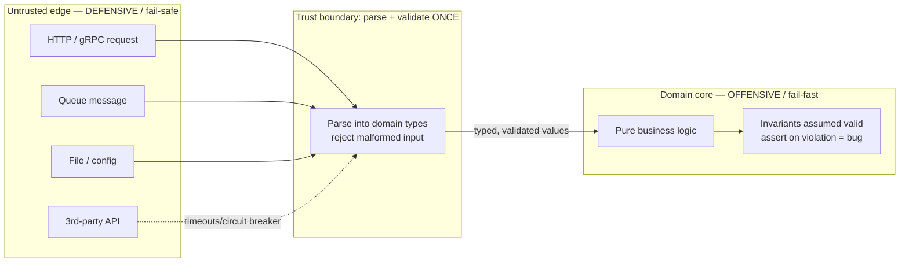
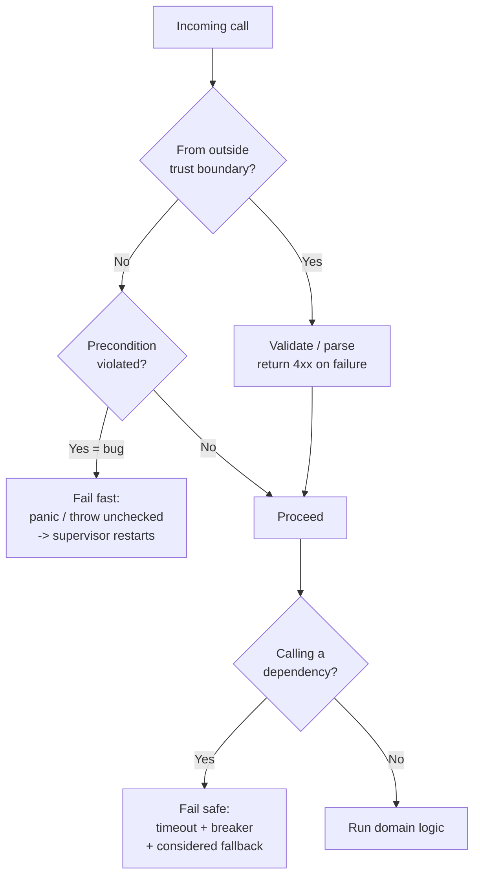

# Defensive vs Offensive — Senior Level

> Focus: "How do we make robustness a system-wide property?" — defining trust boundaries explicitly, choosing fail-fast vs fail-safe per failure class, validation frameworks at the edge, contracts enforced in tests, and team conventions that keep defensive noise out of the domain.

---

## Table of Contents

1. [The senior reframing: robustness is a topology, not a habit](#the-senior-reframing-robustness-is-a-topology-not-a-habit)
2. [Defining trust boundaries explicitly](#defining-trust-boundaries-explicitly)
3. [Parse, don't validate — at the edge](#parse-dont-validate--at-the-edge)
4. [Fail-fast for bugs, fail-safe for dependencies](#fail-fast-for-bugs-fail-safe-for-dependencies)
5. [Validation frameworks at the boundary](#validation-frameworks-at-the-boundary)
6. [Crash-only design under a supervisor](#crash-only-design-under-a-supervisor)
7. [Fail-safe toolkit: timeouts, fallbacks, circuit breakers, bulkheads](#fail-safe-toolkit-timeouts-fallbacks-circuit-breakers-bulkheads)
8. [Contracts and invariants: assert in dev, enforce in tests](#contracts-and-invariants-assert-in-dev-enforce-in-tests)
9. [The security angle: untrusted input is hostile input](#the-security-angle-untrusted-input-is-hostile-input)
10. [Team conventions: assert vs validate vs return-error](#team-conventions-assert-vs-validate-vs-return-error)
11. [Common Mistakes](#common-mistakes)
12. [Test Yourself](#test-yourself)
13. [Cheat Sheet](#cheat-sheet)
14. [Summary](#summary)
15. [Further Reading](#further-reading)
16. [Related Topics](#related-topics)

---

## The senior reframing: robustness is a topology, not a habit

Junior engineers ask "should this function be defensive?" Senior engineers ask "where is the trust boundary, and what failure class crosses it here?" The two strategies are not opposites you choose per-line — they are assigned per **zone**:

- **Offensive (fail-fast):** the call came from *our own code*. A violated precondition is a **programmer bug**. The cheapest, safest response is to crash loudly so the bug is found in CI or staging, not silently corrupting data in production.
- **Defensive (fail-safe):** the call came from *outside our trust boundary* — a user, another service, a queue, a file, a third-party API. The input is untrusted and the dependency is unreliable. We validate, time out, retry, fall back, and degrade.

The senior job is to draw the boundary, decide which zone each piece of code lives in, and stop defensive checks from metastasizing into the domain core. A codebase where *every* layer null-checks *every* argument is not robust — it is one where nobody knows where the boundary is, so everyone defends everywhere. That is a topology failure.



Everything left of the boundary is hostile and unreliable; everything right of it is trusted by construction. The boundary is where defensiveness is concentrated — and where it stays.

---

## Defining trust boundaries explicitly

A trust boundary is any place data crosses from a context you do not control into one you do. Name them explicitly in your architecture, because *implicit* boundaries are where validation gets duplicated or skipped entirely.

| Boundary | Threat | Defensive obligation |
|---|---|---|
| HTTP/REST handler | malformed body, injection, oversized payload | schema-validate, size-limit, authenticate, authorize |
| gRPC endpoint | proto is well-typed but values can still be out of range | validate semantic constraints (proto types ≠ business rules) |
| Message-queue consumer | poison messages, duplicates, replays | validate, idempotency keys, dead-letter queue |
| File / config load | corrupt, partial, attacker-supplied | parse-and-validate, fail closed |
| Third-party API client | downtime, slow responses, schema drift | timeout, retry, circuit breaker, response validation |
| Database read | schema drift, NULLs you didn't expect | tolerant reads at the edge of the persistence layer |
| Internal service-to-service | *partially* trusted — same org, still a process boundary | authenticate (mTLS), validate, but lighter than public edge |

The senior insight: **internal service calls are still a network boundary**. mTLS and schema validation belong there even if the caller is "your" team — but the *intensity* of defense can be lower than the public edge. Treat trust as a gradient, not a binary.

A useful team artifact is a one-page "trust map" of the system that marks every ingress point and its owning validation layer. New endpoints get reviewed against it: *where is this on the map, and who validates?*

---

## Parse, don't validate — at the edge

Alexis King's "Parse, don't validate" is the single most leverage-heavy idea here. *Validation* checks a value and returns a boolean, leaving you with the same loosely-typed value and the obligation to re-check it later. *Parsing* consumes untrusted input and produces a **value of a more precise type** that makes the invalid state unrepresentable. Once parsed, the rest of the system cannot receive a bad value because the type system forbids it.

The boundary parses once into domain types; the core never re-checks because the type *is* the proof.

```go
// Go — parse at the edge into a domain type; the core trusts the type.
package billing

import (
	"errors"
	"fmt"
)

// EmailAddress is a parsed domain type. Its existence is proof of validity.
type EmailAddress struct{ value string }

func ParseEmail(raw string) (EmailAddress, error) {
	if len(raw) == 0 || len(raw) > 254 {
		return EmailAddress{}, errors.New("email: length out of range")
	}
	if !emailRe.MatchString(raw) {
		return EmailAddress{}, fmt.Errorf("email: malformed %q", raw)
	}
	return EmailAddress{value: raw}, nil
}

func (e EmailAddress) String() string { return e.value }

// Core function: no validation, no error return. The type guarantees validity.
func sendInvoice(to EmailAddress, amount Money) {
	// `to` is a valid email by construction. Re-checking here would be noise.
}
```

```python
# Python — pydantic v2 parses the edge payload into a typed, validated model.
from pydantic import BaseModel, EmailStr, Field, field_validator

class CreateOrder(BaseModel):
    email: EmailStr                              # parsed: invalid email never constructs
    quantity: int = Field(gt=0, le=1000)         # parsed: range enforced at construction
    sku: str = Field(min_length=1, max_length=64)

    @field_validator("sku")
    @classmethod
    def sku_uppercase(cls, v: str) -> str:
        return v.upper()

# Edge handler: parsing IS the validation. Failure -> 422 before any domain code runs.
def handle(raw: dict) -> None:
    order = CreateOrder.model_validate(raw)   # raises ValidationError on bad input
    place_order(order)                         # domain code receives only valid orders
```

The downstream win is enormous: `sendInvoice` and `place_order` have **zero defensive code**. They cannot be called with garbage because garbage cannot reach them as the right type. This is how you keep the domain core clean while remaining bulletproof at the edge.

---

## Fail-fast for bugs, fail-safe for dependencies

The core taxonomy a senior must internalize and teach:

| Failure class | Example | Strategy | Rationale |
|---|---|---|---|
| **Programmer error (bug)** | nil map write, index out of range, broken invariant, impossible enum value | **Fail fast** — crash/panic | The state is already corrupt. Continuing risks data corruption. Crash → restart from a known-good state. |
| **Expected operational failure** | downstream timeout, 503, connection reset, queue full | **Fail safe** — handle gracefully | This is the *normal* behavior of a distributed system. It is not a bug; it is Tuesday. |
| **Invalid external input** | bad request body, malformed file | **Fail fast for the request, safe for the process** — reject with 4xx, process keeps serving | One bad request must not take down the service for everyone. |

The classic mistake is treating these as one category. Wrapping a nil-pointer dereference (a bug) in a retry loop hides the bug and burns CPU. Letting a downstream timeout (operational) crash the whole process turns one slow dependency into a total outage.

```java
// Java — distinguish bug from dependency failure.
public Order placeOrder(OrderRequest req) {
    // Precondition violated by OUR code = bug. Fail fast.
    // (req was already validated at the controller; if it's null here, a refactor broke an invariant.)
    Objects.requireNonNull(req, "placeOrder: req must be non-null (programmer error)");

    try {
        return paymentClient.charge(req);          // DEPENDENCY call
    } catch (TimeoutException | ServiceUnavailableException e) {
        // Operational failure — expected. Fail SAFE: degrade, don't crash.
        return Order.pendingManualReview(req, e);
    }
    // Note: we do NOT catch RuntimeException broadly here. A NullPointerException
    // from inside charge() is a bug and SHOULD propagate to crash + restart.
}
```

The discipline: **catch the exceptions you expect from dependencies by their specific types; let bugs propagate.** A blanket `catch (Exception)` at the wrong layer is how teams turn fail-fast into fail-silent.

---

## Validation frameworks at the boundary

Hand-rolled `if` chains for edge validation are a smell at team scale — they drift, get skipped, and produce inconsistent error shapes. Use the platform's validation framework and concentrate it at the boundary.

**Java — Bean Validation (Jakarta) + Hibernate Validator, wired into Spring controllers:**

```java
public record CreateUserRequest(
    @NotBlank @Size(max = 100) String name,
    @Email @NotNull String email,
    @Min(18) @Max(120) int age,
    @Pattern(regexp = "^[A-Z]{2}$") String countryCode
) {}

@RestController
class UserController {
    @PostMapping("/users")
    ResponseEntity<UserView> create(@Valid @RequestBody CreateUserRequest req) {
        // @Valid triggers Hibernate Validator BEFORE the method body runs.
        // A violation -> MethodArgumentNotValidException -> 400 via @ControllerAdvice.
        return ResponseEntity.ok(userService.create(req));
    }
}
```

**Python — pydantic for API models (FastAPI does this automatically); marshmallow where you need schema/object separation:**

```python
from fastapi import FastAPI
# FastAPI runs pydantic validation on the request body automatically;
# a ValidationError becomes a 422 with a structured error list — no manual checks.

app = FastAPI()

@app.post("/orders")
def create(order: CreateOrder):       # CreateOrder is the pydantic model above
    return place_order(order)          # body only runs on valid input
```

**Go — `go-playground/validator`, the de-facto standard, driven by struct tags:**

```go
import "github.com/go-playground/validator/v10"

type CreateUser struct {
	Name        string `json:"name"        validate:"required,max=100"`
	Email       string `json:"email"       validate:"required,email"`
	Age         int    `json:"age"         validate:"gte=18,lte=120"`
	CountryCode string `json:"countryCode" validate:"len=2,alpha,uppercase"`
}

var validate = validator.New(validator.WithRequiredStructEnabled())

func handleCreateUser(w http.ResponseWriter, r *http.Request) {
	var in CreateUser
	if err := json.NewDecoder(io.LimitReader(r.Body, 1<<20)).Decode(&in); err != nil {
		http.Error(w, "malformed json", http.StatusBadRequest) // size-limited, fail fast on bad input
		return
	}
	if err := validate.Struct(in); err != nil {
		writeValidationError(w, err) // structured 400, never reaches domain
		return
	}
	createUser(in) // domain code: input is valid
}
```

Three rules for framework validation at scale:
1. **One validation layer per ingress**, owned and tested. Not scattered re-validation.
2. **Structured error responses** (RFC 9457 `application/problem+json` is the standard). Consistent shape across all endpoints.
3. **Validation lives at the edge type**, not the domain type. The domain type is the *parsed result*; it doesn't carry validation annotations into the core.

---

## Crash-only design under a supervisor

Fail-fast only works as a *system* strategy if something restarts the crashed unit cleanly. "Crash-only software" (Candea & Fox, 2003) says: the only way to stop a component is to crash it, and the only way to start it is to recover — so the recovery path is exercised constantly and is therefore reliable. This is the modern reason fail-fast is safe in production: the supervisor makes the crash cheap.

**Kubernetes liveness probe** — the supervisor for a containerized service. If the process wedges (deadlock, corrupted internal state), the liveness probe fails and the kubelet restarts the pod:

```yaml
livenessProbe:
  httpGet:
    path: /healthz        # MUST reflect real health, not just "process is up"
    port: 8080
  initialDelaySeconds: 10
  periodSeconds: 10
  failureThreshold: 3     # 3 consecutive failures -> restart
# Readiness is separate: stop routing traffic without killing the pod.
readinessProbe:
  httpGet:
    path: /readyz
    port: 8080
  periodSeconds: 5
```

**Go — `panic` + `recover` policy.** The team convention: panic only for programmer errors and truly unrecoverable state; recover only at the top of a goroutine to convert a panic into a 500 + log + (optionally) controlled crash — never to swallow bugs silently:

```go
// Per-request recover: one bad request must not kill the server, but the
// panic is a BUG — log it loudly and surface it, do not pretend it didn't happen.
func recoverMiddleware(next http.Handler) http.Handler {
	return http.HandlerFunc(func(w http.ResponseWriter, r *http.Request) {
		defer func() {
			if v := recover(); v != nil {
				log.Error("panic in handler", "err", v, "stack", string(debug.Stack()))
				metrics.PanicCounter.Inc()                  // alert if this spikes
				http.Error(w, "internal error", http.StatusInternalServerError)
			}
		}()
		next.ServeHTTP(w, r)
	})
}
```

Erlang/OTP's "let it crash" is the same philosophy with first-class supervisors: don't write defensive code for impossible states inside a process; let the process die and let its supervisor restart it from a clean slate. The lesson translates: **the supervisor (k8s, systemd, an actor framework) is your recovery mechanism; lean on it instead of paranoid in-process error handling for bugs.**

---

## Fail-safe toolkit: timeouts, fallbacks, circuit breakers, bulkheads

For the *dependency* zone, fail-safe is implemented with a small standard toolkit. At team scale, standardize the library so every service behaves consistently.

| Pattern | Prevents | Library (Java) | Library (Go) | Library (Python) |
|---|---|---|---|---|
| **Timeout** | unbounded waits | `resilience4j-timelimiter` | `context.WithTimeout` | `httpx` timeouts, `asyncio.wait_for` |
| **Retry (w/ backoff+jitter)** | transient blips | `resilience4j-retry` | `cenkalti/backoff` | `tenacity` |
| **Circuit breaker** | cascading failure, hammering a dead dependency | `resilience4j-circuitbreaker` | `sony/gobreaker` | `pybreaker` |
| **Bulkhead** | one slow dependency exhausting all threads | `resilience4j-bulkhead` | bounded worker pool / semaphore | bounded `asyncio.Semaphore` |
| **Fallback** | hard failure when a degraded answer is acceptable | resilience4j `fallback` | wrap call, return cached/default | `try/except` → cached value |

```java
// Java — resilience4j: timeout + circuit breaker + fallback composed.
CircuitBreaker cb = CircuitBreaker.of("pricing", CircuitBreakerConfig.custom()
        .failureRateThreshold(50)                       // open if >50% of calls fail
        .slowCallDurationThreshold(Duration.ofSeconds(2))
        .waitDurationInOpenState(Duration.ofSeconds(30)) // probe again after 30s
        .build());

Supplier<Price> guarded = CircuitBreaker.decorateSupplier(cb, () -> pricingClient.fetch(sku));

Price price = Try.ofSupplier(guarded)
        .recover(ex -> Price.cachedOrDefault(sku))      // fail SAFE: degrade gracefully
        .get();
```

```go
// Go — context timeout + circuit breaker (sony/gobreaker) + fallback.
cb := gobreaker.NewCircuitBreaker(gobreaker.Settings{
	Name:        "pricing",
	MaxRequests: 5,
	Interval:    10 * time.Second,
	Timeout:     30 * time.Second, // stay open 30s before half-open probe
	ReadyToTrip: func(c gobreaker.Counts) bool {
		return c.ConsecutiveFailures > 5
	},
})

func priceFor(ctx context.Context, sku string) Price {
	ctx, cancel := context.WithTimeout(ctx, 2*time.Second) // bound the wait
	defer cancel()
	v, err := cb.Execute(func() (any, error) { return pricingClient.Fetch(ctx, sku) })
	if err != nil {
		return cachedOrDefault(sku) // fail safe — never block the whole request on pricing
	}
	return v.(Price)
}
```

The senior decision is **per-dependency**: not every call deserves a fallback. A fallback that returns stale prices may be fine; a fallback that returns a stale *balance* is a correctness bug. Graceful degradation is a product decision, not a default — decide it with the domain owner.

---

## Contracts and invariants: assert in dev, enforce in tests

Design-by-Contract (Meyer, Eiffel) gives a clean mental model: **preconditions** (caller's obligation), **postconditions** (callee's guarantee), **invariants** (always true between operations). The senior question is *where each is checked*, because checking everything everywhere at runtime is the paranoid-code anti-pattern.

The rule of thumb:

- **Preconditions on public/edge APIs** → validate at runtime (untrusted caller).
- **Preconditions on internal APIs** → assert in dev/test; let it crash in prod if violated (caller is our code; violation is a bug).
- **Postconditions and invariants** → encode as **property-based tests** and contract tests; assert in dev builds; trust in prod.

```python
# Python — assertions express invariants; they are stripped under `python -O`.
# So: assert = developer-time contract check, NOT production input validation.
def merge_sorted(a: list[int], b: list[int]) -> list[int]:
    assert a == sorted(a), "precondition: a must be sorted"   # bug-catcher, dev only
    out = _merge(a, b)
    assert out == sorted(out), "postcondition: result sorted"  # invariant, dev only
    return out
```

The most common production incident from this topic: **using `assert` for input validation.** In Python, `-O` strips asserts; in Java, `-ea` is off by default. So `assert userIsAuthenticated()` silently becomes a no-op in production — a security hole. The convention must be ironclad: **assertions catch *our* bugs; never use them to validate untrusted input or enforce security.**

Enforce contracts where they belong instead:

```java
// Java — Guava preconditions throw on EVERY run (not stripped). Use for real validation.
import static com.google.common.base.Preconditions.checkArgument;

void withdraw(Account a, long cents) {
    checkArgument(cents > 0, "amount must be positive: %s", cents); // always runs
    // 'assert a.balance() >= 0' would be a dev-only invariant check, a different thing.
}
```

Pair this with **property-based tests** (jqwik/Java, Hypothesis/Python, gopter/Go) to enforce postconditions and invariants across thousands of generated inputs in CI — that is where invariants get *proven*, not asserted in prod.

---

## The security angle: untrusted input is hostile input

Defensiveness at the boundary is not just about correctness — it is the first line of security. Every trust boundary is an attack surface. "Validate untrusted input" and "prevent injection" are the same instruction.

- **SQL injection** → never string-concatenate input into queries; parameterize. The trust boundary parses input into typed values; the persistence layer uses prepared statements.
- **Command injection** → never pass untrusted input to a shell; use argument arrays (`exec.Command("cmd", arg1, arg2)` in Go, `subprocess.run([...], shell=False)` in Python).
- **Path traversal** → canonicalize and verify the resolved path stays within an allowed root before any file op.
- **Deserialization attacks** → never deserialize untrusted data into arbitrary types (Java native serialization, Python `pickle`, `yaml.load`). Use safe parsers (`yaml.safe_load`, schema-bound JSON).
- **Mass assignment / over-posting** → bind input only to an explicit allow-list of fields (a DTO), never directly to the persistence entity.

```python
# Allow-list binding stops mass assignment: the edge model can't set `is_admin`.
class UserUpdate(BaseModel):           # ONLY these fields are accepted
    display_name: str = Field(max_length=80)
    bio: str | None = Field(default=None, max_length=500)

def update_profile(user_id: UserId, patch: UserUpdate):
    # patch CANNOT carry is_admin / balance / role — they aren't on the model.
    repo.apply(user_id, patch.model_dump(exclude_unset=True))
```

The senior framing: **a trust boundary that validates for correctness but not for malice is half a boundary.** Threat-model each ingress point alongside its validation layer — they are the same review.

---

## Team conventions: assert vs validate vs return-error

Robustness fails at team scale when ten engineers each pick a strategy. Write the convention down. A workable house style:

| Situation | Convention | Mechanism |
|---|---|---|
| Untrusted input at an ingress | **Validate, return 4xx** | validation framework, structured error |
| Caller is internal code, broken invariant | **Fail fast** (panic/throw unchecked) | `Objects.requireNonNull`, `panic`, raise |
| Dev-time invariant/postcondition | **Assert** (stripped in prod) | `assert`, `-ea`, Hypothesis/jqwik |
| Expected, recoverable, business-meaningful outcome | **Return `Result`/error, not exception** | Go `error`, `Result<T,E>`, typed exception |
| Dependency call that can time out/fail | **Fail safe** | timeout + breaker + considered fallback |

The Go/Rust idiom — *errors are values, returned not thrown* — matters here: a "user not found" is an expected outcome, not an exception. Throwing on every contract violation, including expected ones, produces control flow that hides the happy path and trains the team to wrap everything in `try/catch`. Reserve exceptions/panics for the truly exceptional (bugs, unrecoverable state); return errors for the expected.

A good team artifact: a short "error policy" page plus a lint rule. Examples enforceable in CI:
- `errcheck` (Go) — fail the build on ignored errors.
- A custom check that flags `assert` referencing security predicates (`assert.*[Aa]uth`, `assert.*permission`).
- ArchUnit rule: classes in `..domain..` may not depend on validation-annotation packages (keeps validation at the edge).



---

## Common Mistakes

- **Defending everywhere instead of at the boundary.** Null checks at every layer signal that nobody trusts the boundary — because there isn't one. Fix the topology, not the symptom.
- **Using `assert` for production validation.** Asserts are stripped (`python -O`, Java `-ea` off by default). A stripped `assert authorized()` is a security hole. Asserts catch *our* bugs only.
- **Blanket `catch (Exception)` / `recover()` that swallows bugs.** This converts fail-fast into fail-silent. Catch *specific* dependency exceptions; let bugs propagate to the supervisor.
- **Retrying programmer errors.** A retry loop around a nil-pointer dereference burns CPU and hides the bug. Retry only transient *operational* failures.
- **Defensive copying everywhere "to be safe."** Real allocation/GC cost. Copy at the boundary where ownership transfers; trust immutability/types inside.
- **Throwing on every contract violation, including expected outcomes.** "User not found" is a value, not an exception. Reserve exceptions for the truly exceptional; return errors otherwise.
- **Leaking validation annotations into domain types.** The domain type should be the *parsed result*. Keep `@NotNull`/`validate:""` tags on edge DTOs, not core entities.
- **One slow dependency taking down the whole service.** No bulkhead/timeout means a hung downstream exhausts the thread/connection pool. Isolate dependencies.
- **Fallbacks that return wrong data silently.** A cached *balance* fallback is a correctness bug. Decide each fallback with the domain owner; degrade only where stale/default is acceptable.

---

## Test Yourself

<details>
<summary>1. A teammate adds <code>assert user.is_authenticated</code> at the top of an internal helper to "make it secure." What's wrong, and what should they do?</summary>

Asserts are stripped under `python -O` (and Java assertions are off unless `-ea` is set), so in production the check vanishes — a silent authorization bypass. Authentication/authorization is *security validation of untrusted context*, not a developer-time invariant. It must be an always-on check at the trust boundary (middleware/guard) that returns 401/403, never an `assert`. Asserts are exclusively for catching *our own* bugs in dev/test.
</details>

<details>
<summary>2. Your service wraps every downstream call and every internal helper in a generic <code>catch (Exception)</code>. Why is this dangerous?</summary>

It collapses two failure classes into one. Operational failures (timeouts, 503s) *should* be caught and handled gracefully, but programmer bugs (NPE, illegal state) *should* propagate to crash + restart. A blanket catch converts fail-fast into fail-silent: the bug is swallowed, data may be corrupted, and the only evidence is subtly wrong output. Catch *specific* dependency exception types; let unexpected runtime exceptions propagate.
</details>

<details>
<summary>3. "Parse, don't validate" — restate it and explain why it reduces defensive code in the core.</summary>

Validation returns a boolean and leaves you holding the same loosely-typed value, so you (or someone downstream) must re-check it. Parsing consumes untrusted input and produces a *more precisely typed* value where invalid states are unrepresentable. Once parsed at the boundary, the core receives only valid values *by type* — it cannot be called with garbage, so it needs zero defensive checks. The type is the proof of validity.
</details>

<details>
<summary>4. When is fail-fast (crash) the <em>safe</em> choice in production, and what makes it safe?</summary>

When a programmer-error precondition is violated, the process state is already inconsistent; continuing risks corrupting data. Crashing stops the damage and restarts from known-good state. It is safe only because a *supervisor* (Kubernetes liveness probe, systemd, an actor supervisor) restarts the unit cheaply — "crash-only" design ensures the recovery path is well-exercised and reliable. Without a supervisor, fail-fast is just an outage.
</details>

<details>
<summary>5. Why isn't a fallback always the right answer for a failing dependency?</summary>

A fallback trades correctness for availability, and that trade is domain-specific. Returning a cached *price* on a pricing outage may be acceptable; returning a cached *account balance* or skipping a *fraud check* is a correctness/security defect dressed up as resilience. Graceful degradation is a product decision made with the domain owner, not a default applied uniformly.
</details>

<details>
<summary>6. An internal microservice call — is it inside or outside the trust boundary? How does that change your defensiveness?</summary>

It's a gradient. Same-org services are *more* trusted than the public internet but still cross a process/network boundary, so they get authentication (mTLS) and schema validation — but at lower intensity than the public edge (e.g., you may skip rate-limiting an internal caller you control). Treating internal calls as fully trusted invites supply-chain and lateral-movement risk; treating them as fully hostile adds latency and noise. Calibrate to the gradient.
</details>

<details>
<summary>7. Your team uses Go. Where do you place <code>recover()</code>, and what is the policy?</summary>

Place `recover()` only at the top of a goroutine's stack — typically a per-request middleware — to keep one panicking request from killing the whole server. The policy: log the panic loudly with a stack trace, increment a metric (alert if it spikes), return 500, and treat it as a *bug to fix*, never a normal control-flow path. `recover()` is a blast-radius limiter, not an error-handling mechanism. Use returned `error` values for expected failures.
</details>

---

## Cheat Sheet

| Question | Answer |
|---|---|
| Where do I validate untrusted input? | Once, at the trust boundary; parse into domain types |
| What strategy for a programmer bug? | Fail fast — crash/panic, let the supervisor restart |
| What strategy for a dependency failure? | Fail safe — timeout, circuit breaker, considered fallback |
| Can I use `assert` to validate user input? | No — stripped in prod; asserts catch *our* bugs only |
| Where do contracts/invariants get enforced? | Asserts in dev + property-based tests in CI; trusted in prod |
| Validation framework — Java / Python / Go? | Bean Validation+Hibernate Validator / pydantic+marshmallow / go-playground/validator |
| Circuit breaker — Java / Python / Go? | resilience4j / pybreaker / sony/gobreaker |
| Expected business outcome (e.g. "not found")? | Return `Result`/error value, don't throw |
| How do I stop one dependency from sinking the service? | Bulkhead + timeout per dependency |
| Error response format? | RFC 9457 `application/problem+json`, consistent across endpoints |
| What's the supervisor in k8s? | Liveness probe (restart) + readiness probe (drain traffic) |
| Security check I must never `assert`? | Anything authn/authz/permission related |

---

## Summary

At senior level, defensive vs offensive stops being a per-function instinct and becomes a **system topology decision**. You draw explicit trust boundaries, parse untrusted input into domain types at the edge (so the core needs no defensive code), and assign a failure strategy per *class*: **fail fast** for programmer bugs (crash under a supervisor that restarts cleanly) and **fail safe** for dependency failures (timeouts, circuit breakers, bulkheads, considered fallbacks). Validation lives in frameworks at the boundary, never scattered or leaked into the domain. Contracts and invariants are asserted in dev and *proven* by property-based and contract tests in CI — never enforced by production asserts, which are stripped and create silent security holes. Every trust boundary is also an attack surface, so validation and threat-modeling are the same review. Finally, you write the conventions down — assert vs validate vs return-error — and enforce them with lint rules and architecture tests, so robustness is a property of the system, not a habit of whoever wrote the line.

---

## Further Reading

- Alexis King — *Parse, Don't Validate* (the foundational essay for edge-typing)
- Bertrand Meyer — *Object-Oriented Software Construction* (Design by Contract)
- Candea & Fox — *Crash-Only Software* (USENIX HotOS, 2003)
- Michael Nygard — *Release It!* (circuit breaker, bulkhead, timeout patterns)
- Joe Armstrong — *Making reliable distributed systems in the presence of software errors* (Erlang "let it crash")
- OWASP — *Input Validation Cheat Sheet* and *API Security Top 10*
- IETF RFC 9457 — *Problem Details for HTTP APIs*

---

## Related Topics

- [junior.md](junior.md) — what defensive vs offensive means, with simple examples
- [middle.md](middle.md) — choosing per-function and avoiding paranoid code
- [professional.md](professional.md) — measured cost of defensive copying, allocation, and validation overhead
- [Chapter README](../README.md) — the positive rules and anti-patterns to avoid
- [Error Handling](../06-error-handling/README.md) — exceptions vs error values, where this strategy is implemented
- [Boundaries](../07-boundaries/README.md) — isolating third-party code, the place trust boundaries get drawn
- [Anti-Patterns](../../anti-patterns/README.md) — paranoid code and fail-silent as recognized anti-patterns
- [Refactoring](../../refactoring/README.md) — refactoring sprawling defensive checks toward boundary parsing
