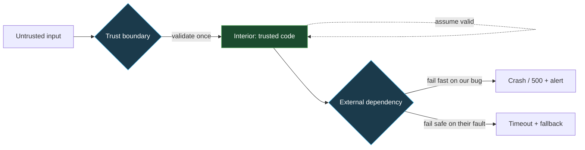
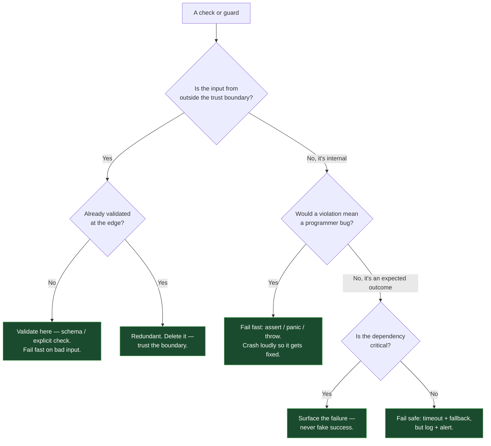

# Defensive vs Offensive — Practice Tasks

> 12 hands-on exercises on balancing defensive and offensive programming. Each task gives a scenario, code that is either over-defended (paranoid) or under-defended (naive), an instruction, and a collapsible full solution with reasoning. Languages vary across Go, Java, and Python. Ordered easy → hard.

The single idea underneath every task: **defend at the boundary, trust the interior, fail fast on bugs, fail safe on the world.** Validate untrusted input once, at the edge where it enters your system. Inside that boundary, code is allowed to assume its inputs are already valid — re-checking them everywhere is noise that hides the one check that matters. Programmer mistakes (broken invariants, impossible states) should crash loudly so they get fixed; unreliable external systems (networks, disks, third parties) should degrade gracefully so users do not.



---

## Table of Contents

1. [Task 1 — Consolidate scattered null checks to one boundary (Java)](#task-1--consolidate-scattered-null-checks-to-one-boundary-java) · *Easy*
2. [Task 2 — Replace a production `assert` with real validation (Python)](#task-2--replace-a-production-assert-with-real-validation-python) · *Easy*
3. [Task 3 — Remove paranoid per-line try/except (Python)](#task-3--remove-paranoid-per-line-tryexcept-python) · *Easy*
4. [Task 4 — Add a precondition guard + fail fast on a programmer bug (Go)](#task-4--add-a-precondition-guard--fail-fast-on-a-programmer-bug-go) · *Easy*
5. [Task 5 — Validate at the API edge with a schema (Python / Pydantic)](#task-5--validate-at-the-api-edge-with-a-schema-python--pydantic) · *Medium*
6. [Task 6 — Stop unnecessary defensive copying inside the boundary (Java)](#task-6--stop-unnecessary-defensive-copying-inside-the-boundary-java) · *Medium*
7. [Task 7 — Fail-safe degradation: timeout + fallback for a flaky dependency (Go)](#task-7--fail-safe-degradation-timeout--fallback-for-a-flaky-dependency-go) · *Medium*
8. [Task 8 — Validation at the API edge with Bean Validation (Java)](#task-8--validation-at-the-api-edge-with-bean-validation-java) · *Medium*
9. [Task 9 — Convert a contract-violation exception to a `Result` (Go)](#task-9--convert-a-contract-violation-exception-to-a-result-go) · *Hard*
10. [Task 10 — Push a runtime check into the type system (Python)](#task-10--push-a-runtime-check-into-the-type-system-python) · *Hard*
11. [Task 11 — Push a runtime check into the type system (Java)](#task-11--push-a-runtime-check-into-the-type-system-java) · *Hard*
12. [Task 12 — Audit: classify every check as fail-fast vs fail-safe (Python — open-ended)](#task-12--audit-classify-every-check-as-fail-fast-vs-fail-safe-python--open-ended) · *Hard*

---

## How to Use

- Read the scenario, then look at the code and decide: is it **over-defended** (paranoid, redundant, hiding bugs) or **under-defended** (trusting input it should not)?
- Try the instruction before expanding the solution. Write the corrected version on paper or in an editor.
- Each solution explains *why* the change is correct, not just *what* changed. The reasoning is the point — the same judgment transfers to your own code.
- The fix is almost never "add more checks" or "remove all checks." It is "move the check to the one place it belongs, and decide whether to fail fast or fail safe."

---

## Task 1 — Consolidate scattered null checks to one boundary (Java)

*Difficulty: Easy*

**Scenario:** A `ShippingService` receives an `Order` from the HTTP layer. Defensive null checks have accreted in every method, because nobody trusts that the order is well-formed.

```java
class ShippingService {
    BigDecimal quote(Order order) {
        if (order == null) return BigDecimal.ZERO;
        if (order.address() == null) return BigDecimal.ZERO;
        BigDecimal base = baseRate(order);
        return base.add(surcharge(order));
    }

    BigDecimal baseRate(Order order) {
        if (order == null || order.address() == null) return BigDecimal.ZERO;
        if (order.address().country() == null) return BigDecimal.ZERO;
        return rateTable.get(order.address().country());
    }

    BigDecimal surcharge(Order order) {
        if (order == null) return BigDecimal.ZERO;
        if (order.address() == null) return BigDecimal.ZERO;
        return order.isExpress() ? new BigDecimal("9.99") : BigDecimal.ZERO;
    }
}
```

**Instruction:** Move validation to a single trust boundary at the entry point. Inside the service, methods should assume the order is valid. Note the silent `return ZERO` is a separate bug — a malformed order should not quietly produce a free shipment.

<details><summary>Solution</summary>

```java
class ShippingService {
    // Trust boundary: the ONE place we check. After this, order and its
    // address are guaranteed non-null for the rest of this call tree.
    BigDecimal quote(Order order) {
        Objects.requireNonNull(order, "order");
        Objects.requireNonNull(order.address(), "order.address");
        Objects.requireNonNull(order.address().country(), "order.address.country");
        return baseRate(order).add(surcharge(order));
    }

    // Interior: trusted. No null checks — they would be dead code, because
    // quote() already guaranteed the invariant.
    private BigDecimal baseRate(Order order) {
        return rateTable.get(order.address().country());
    }

    private BigDecimal surcharge(Order order) {
        return order.isExpress() ? new BigDecimal("9.99") : BigDecimal.ZERO;
    }
}
```

**Reasoning:** The original repeated the same three null checks in three methods — and still missed `country()` in two of them, which is exactly how scattered defense leaks bugs: there is no single source of truth for "what does valid mean here." Consolidating to `quote()` makes the contract explicit and lets the private helpers be straight-line code.

The silent `return ZERO` was worse than the duplication: a null address would have shipped the order for free instead of surfacing the problem. Replacing it with `requireNonNull` is the fail-fast move — a null `Order` reaching this service is a programmer bug (the HTTP layer should have rejected the request), so it should throw immediately and loudly, not be papered over. Validation that *should* be user-facing belongs even further out, at the request edge (see [Task 8](#task-8--validation-at-the-api-edge-with-bean-validation-java)).

</details>

---

## Task 2 — Replace a production `assert` with real validation (Python)

*Difficulty: Easy*

**Scenario:** A payment endpoint guards the charge amount with `assert`. The author thought this validated user input.

```python
def charge(account_id: str, amount_cents: int) -> Receipt:
    assert amount_cents > 0, "amount must be positive"
    assert amount_cents <= 1_000_000, "amount exceeds limit"
    account = repo.load(account_id)
    account.debit(amount_cents)
    return Receipt(account_id, amount_cents)
```

**Instruction:** Explain why these asserts are dangerous here, then rewrite so the checks are real, unconditional validation. Keep `assert` only for things that would be a genuine programmer bug, if any.

<details><summary>Solution</summary>

```python
class InvalidAmountError(ValueError):
    pass

MAX_CHARGE_CENTS = 1_000_000

def charge(account_id: str, amount_cents: int) -> Receipt:
    # amount_cents crosses the trust boundary from the caller/network,
    # so it gets real validation that cannot be disabled.
    if amount_cents <= 0:
        raise InvalidAmountError("amount must be positive")
    if amount_cents > MAX_CHARGE_CENTS:
        raise InvalidAmountError(f"amount exceeds limit of {MAX_CHARGE_CENTS}")

    account = repo.load(account_id)
    account.debit(amount_cents)
    return Receipt(account_id, amount_cents)
```

**Reasoning:** Python's `assert` statements are removed entirely when the interpreter runs with `-O` (optimized mode), which production deployments commonly use. So in production, both guards vanish — a request for `amount_cents = -500` would sail through and *credit* the account, and a request for ten million would charge it. `assert` is the single most dangerous way to validate untrusted input, precisely because it looks like validation but is conditionally compiled out.

The rule: `assert` is for **internal invariants that should be impossible if your code is correct** — a fail-fast sanity check during development. Anything that depends on values from outside the trust boundary (user input, network, files, other services) must be validated with code that always runs and raises a real, typed exception. Here, `amount_cents` comes from the caller, so it gets unconditional checks and a domain-specific `InvalidAmountError`.

</details>

---

## Task 3 — Remove paranoid per-line try/except (Python)

*Difficulty: Easy*

**Scenario:** A function parses a config dict. Someone wrapped every single line in `try/except` "to be safe."

```python
def parse_config(raw: dict) -> Config:
    try:
        host = raw["host"]
    except Exception:
        host = "localhost"
    try:
        port = int(raw["port"])
    except Exception:
        port = 8080
    try:
        timeout = float(raw["timeout"])
    except Exception:
        timeout = 30.0
    try:
        retries = int(raw["retries"])
    except Exception:
        retries = 3
    return Config(host, port, timeout, retries)
```

**Instruction:** Remove the paranoid per-line handling. Decide which fields have real defaults (genuinely optional) and which are misconfigurations that should fail fast. Catch only specific exceptions.

<details><summary>Solution</summary>

```python
class ConfigError(ValueError):
    pass

def parse_config(raw: dict) -> Config:
    # `host` is required: a config file without a host is a misconfiguration,
    # not something we should silently paper over with "localhost".
    if "host" not in raw:
        raise ConfigError("missing required field: host")
    host = raw["host"]

    # port/timeout/retries are genuinely optional with sane defaults,
    # but a *present-but-malformed* value is an error, not a fallback.
    port = _as_int(raw, "port", default=8080)
    timeout = _as_float(raw, "timeout", default=30.0)
    retries = _as_int(raw, "retries", default=3)

    return Config(host, port, timeout, retries)


def _as_int(raw: dict, key: str, *, default: int) -> int:
    if key not in raw:
        return default
    try:
        return int(raw[key])
    except (ValueError, TypeError) as e:
        raise ConfigError(f"{key} must be an integer, got {raw[key]!r}") from e


def _as_float(raw: dict, key: str, *, default: float) -> float:
    if key not in raw:
        return default
    try:
        return float(raw[key])
    except (ValueError, TypeError) as e:
        raise ConfigError(f"{key} must be a number, got {raw[key]!r}") from e
```

**Reasoning:** Three things were wrong with the paranoid version. First, `except Exception` is a sledgehammer — it swallows `KeyboardInterrupt`-adjacent issues, typos, and bugs in code you have not even seen yet, turning every failure into a silent default. Second, it conflated two different cases: a *missing* key (legitimately optional) and a *present-but-garbage* key (a misconfiguration the operator wants to know about). `port = "banana"` should not silently become `8080` — that hides the operator's mistake and makes debugging a production outage miserable. Third, `host` was treated as optional when it almost certainly is not.

The clean version draws a line: missing optional fields get defaults; malformed values raise a `ConfigError` with the offending value in the message (fail fast on bad config so it is caught at startup, not at 3am). The `try/except` is narrowed to `(ValueError, TypeError)` — exactly the exceptions `int()`/`float()` raise — so a real bug in this function still propagates instead of being masked.

</details>

---

## Task 4 — Add a precondition guard + fail fast on a programmer bug (Go)

*Difficulty: Easy*

**Scenario:** A ring buffer's `Get` indexes into a slice. There is no guard. A caller bug passing an out-of-range index produces a confusing panic deep in the stdlib, or worse, silently wraps.

```go
type RingBuffer struct {
    data []int
    head int
    size int
}

// Get returns the i-th element from the head (0 = oldest).
func (r *RingBuffer) Get(i int) int {
    return r.data[(r.head+i)%len(r.data)]
}
```

**Instruction:** Add a precondition guard clause that fails fast on a programmer error. This index is supplied by *our own* calling code (not an end user), so decide between returning an error and panicking, and justify the choice.

<details><summary>Solution</summary>

```go
// Get returns the i-th element from the head (0 = oldest).
//
// Precondition: 0 <= i < r.size. Violating it is a programmer bug
// (an internal indexing mistake), so Get panics rather than returning
// an error — there is no sensible value to return, and a silent wrap
// would corrupt data and hide the bug.
func (r *RingBuffer) Get(i int) int {
    if i < 0 || i >= r.size {
        panic(fmt.Sprintf("RingBuffer.Get: index %d out of range [0, %d)", i, r.size))
    }
    return r.data[(r.head+i)%len(r.data)]
}
```

**Reasoning:** The key decision is *who* supplies `i`. If it came from outside the trust boundary (an HTTP query param, a config value), the answer would be to return an `error` and let the boundary translate it into a 400. But here `i` is an index into our own data structure, used by our own code — passing `5` when `size` is `3` is an internal logic bug. The right response to a bug is to **fail fast and loudly** so it is caught in tests or in the first staging run, never papered over.

`panic` is appropriate because (a) there is no meaningful `int` to return for an invalid index — returning `0` would silently corrupt the caller's logic, and (b) the original code's `% len(r.data)` would *wrap* an out-of-range index into a valid-looking-but-wrong slot, which is the worst outcome: no crash, just quietly incorrect data. The guard converts a subtle data-corruption bug into an immediate, located panic with a message that names the offending value. This is offensive programming: assert your invariants and blow up the moment one is violated.

</details>

---

## Task 5 — Validate at the API edge with a schema (Python / Pydantic)

*Difficulty: Medium*

**Scenario:** A FastAPI handler accepts a raw `dict` and hand-validates fields. Validation logic is tangled into the handler and the same checks are partially repeated in the service layer below it.

```python
@app.post("/signup")
async def signup(payload: dict):
    email = payload.get("email")
    if not email or "@" not in email:
        raise HTTPException(400, "invalid email")
    age = payload.get("age")
    if age is None or not isinstance(age, int) or age < 13 or age > 120:
        raise HTTPException(400, "invalid age")
    username = payload.get("username")
    if not username or len(username) < 3 or len(username) > 20:
        raise HTTPException(400, "invalid username")
    return await user_service.create(email=email, age=age, username=username)
```

**Instruction:** Replace the imperative validation with a Pydantic model so validation happens declaratively at the API edge. The handler and the service below it should then trust the data.

<details><summary>Solution</summary>

```python
from pydantic import BaseModel, EmailStr, Field, field_validator

class SignupRequest(BaseModel):
    # The schema IS the trust boundary. Anything that constructs without
    # raising is, by definition, valid for every layer downstream.
    email: EmailStr
    age: int = Field(ge=13, le=120)
    username: str = Field(min_length=3, max_length=20)

    @field_validator("username")
    @classmethod
    def no_spaces(cls, v: str) -> str:
        if " " in v:
            raise ValueError("username must not contain spaces")
        return v


@app.post("/signup")
async def signup(req: SignupRequest):
    # No validation here. req is guaranteed valid — FastAPI returned a
    # structured 422 before this body ever ran if it was not.
    return await user_service.create(
        email=req.email, age=req.age, username=req.username
    )
```

```python
# Service layer, below the boundary — also trusts the data.
async def create(*, email: str, age: int, username: str) -> User:
    # No re-validation of format/range. If you find yourself re-checking
    # `age >= 13` here, your boundary is in the wrong place.
    return await repo.insert(User(email=email, age=age, username=username))
```

**Reasoning:** The original mixed three concerns in the handler: parsing, validation, and dispatch. Worse, the service layer re-checked some of the same things, so the rules lived in two places and could drift apart. Pydantic collapses validation into a declarative schema that runs automatically at the edge. `EmailStr`, `Field(ge=..., le=...)`, and `min_length` express the rules once; FastAPI turns a violation into a structured `422` with field-level detail before the handler body executes.

This is the trust-boundary principle applied at the system's outermost layer. The boundary is the request model; everything inside it — handler, service, repository — receives data that is already valid and is free to trust it. The payoff is not just less code: it is that there is exactly one definition of "valid signup," it is machine-readable (and shows up in the OpenAPI docs), and the layers below cannot accidentally disagree about it. Re-validating downstream is the same over-defense smell as Task 1, just spread across layers.

</details>

---

## Task 6 — Stop unnecessary defensive copying inside the boundary (Java)

*Difficulty: Medium*

**Scenario:** A hot path computes a risk score over a list of trades. The author defensively copies the list at every method hop "in case someone mutates it." Profiling shows the copies dominate the call.

```java
class RiskEngine {
    double score(List<Trade> trades) {
        List<Trade> safe = new ArrayList<>(trades);   // copy 1
        return exposure(safe) * volatility(safe);
    }

    double exposure(List<Trade> trades) {
        List<Trade> safe = new ArrayList<>(trades);   // copy 2
        return safe.stream().mapToDouble(Trade::notional).sum();
    }

    double volatility(List<Trade> trades) {
        List<Trade> safe = new ArrayList<>(trades);   // copy 3
        return computeStdDev(safe);
    }
}
```

**Instruction:** Eliminate the redundant copies. Keep a defensive copy *only* where it actually protects an invariant — i.e. at the boundary where untrusted, possibly-mutable input enters and is *retained*. The interior should pass the data freely.

<details><summary>Solution</summary>

```java
class RiskEngine {
    // ONE defensive copy at the boundary, made immutable so the interior
    // physically cannot mutate it. Inside, no further copies are needed.
    double score(List<Trade> trades) {
        List<Trade> snapshot = List.copyOf(trades);   // single copy, unmodifiable
        return exposure(snapshot) * volatility(snapshot);
    }

    // Interior methods receive a trusted, immutable list. No copies.
    private double exposure(List<Trade> trades) {
        return trades.stream().mapToDouble(Trade::notional).sum();
    }

    private double volatility(List<Trade> trades) {
        return computeStdDev(trades);
    }
}
```

**Reasoning:** Defensive copying exists to protect against *aliasing* surprises — the caller mutating a collection you are still using, or you mutating a collection the caller still owns. That risk is real exactly **once**: at the boundary where external input crosses into your code and you retain or iterate it. Copying again on every internal hop protects nothing — `exposure` and `volatility` are private, called only by `score`, and they never mutate the list. Those copies are pure overhead, and on a hot path they showed up in the profile.

The fix makes the single boundary copy *immutable* with `List.copyOf`. This is strictly better than `new ArrayList<>(...)`: it both snapshots the input (defending against caller mutation) and makes the snapshot unmodifiable (statically guaranteeing the interior cannot mutate it, so no interior method ever *needs* to copy defensively). The interior is now trusted code passing a trusted, frozen value. This is the same "trust the interior" principle as Task 1, applied to mutability instead of nullity: defend once at the edge, then relax.

</details>

---

## Task 7 — Fail-safe degradation: timeout + fallback for a flaky dependency (Go)

*Difficulty: Medium*

**Scenario:** A product page calls a recommendations microservice. That service is occasionally slow or down. Right now a single slow call blocks the whole page render with no timeout.

```go
func (h *Handler) ProductPage(ctx context.Context, id string) (Page, error) {
    product, err := h.products.Get(ctx, id)
    if err != nil {
        return Page{}, err
    }
    // Blocks indefinitely if recs service hangs; fails the whole page if it errors.
    recs, err := h.recs.For(ctx, id)
    if err != nil {
        return Page{}, err
    }
    return Page{Product: product, Recommendations: recs}, nil
}
```

**Instruction:** Make the recommendations call **fail safe**: bound it with a timeout and fall back to an empty/cached set on error or timeout, so a recs outage degrades the page instead of breaking it. The core product fetch stays fail-fast (without a product there is no page).

<details><summary>Solution</summary>

```go
const recsTimeout = 200 * time.Millisecond

func (h *Handler) ProductPage(ctx context.Context, id string) (Page, error) {
    // Core dependency: fail fast. No product, no page — propagate the error.
    product, err := h.products.Get(ctx, id)
    if err != nil {
        return Page{}, err
    }

    // Non-critical dependency: fail safe. The page is useful without recs,
    // so a slow or broken recs service must NOT take the page down.
    recs := h.recommendationsOrFallback(ctx, id)

    return Page{Product: product, Recommendations: recs}, nil
}

func (h *Handler) recommendationsOrFallback(ctx context.Context, id string) []Rec {
    // Bound the call so a hung dependency cannot block the render.
    rctx, cancel := context.WithTimeout(ctx, recsTimeout)
    defer cancel()

    recs, err := h.recs.For(rctx, id)
    if err != nil {
        // Timeout or error: degrade gracefully. Log + metric so the outage
        // is visible, but serve the page with a sensible fallback.
        h.log.Warn("recs unavailable, degrading", "id", id, "err", err)
        h.metrics.Inc("recs.fallback")
        return h.fallbackRecs(id) // e.g. cached popular items, or nil
    }
    return recs
}
```

**Reasoning:** The two dependencies have different criticality, so they get opposite policies. The product fetch is **essential** — there is no meaningful page without it — so it stays fail-fast and propagates its error. Recommendations are **enhancement** — the page is perfectly usable without them — so they get fail-safe treatment: a tight `context.WithTimeout` caps the blast radius of a hung dependency, and any error or timeout falls back to cached popular items (or simply nothing) rather than failing the whole request.

Two details matter. First, the timeout is *per-dependency*, not the request's overall deadline; a 200ms cap means a recs outage costs every visitor at most 200ms, not an indefinite hang. Second, degrading is not the same as ignoring: the fallback path logs and emits a metric, so the outage is observable and pages someone, even though users never see an error. This is the defensive-against-the-world half of the discipline — you cannot make a third party reliable, so you make *your* system resilient to its failures. (In a larger system the next step is a [circuit breaker](../../refactoring/README.md) so you stop hammering a service that is already down.)

</details>

---

## Task 8 — Validation at the API edge with Bean Validation (Java)

*Difficulty: Medium*

**Scenario:** A Spring controller accepts a transfer request and validates it manually, with the same checks duplicated in the service.

```java
@PostMapping("/transfers")
public ResponseEntity<?> transfer(@RequestBody TransferRequest req) {
    if (req.getFromAccount() == null || req.getFromAccount().isBlank())
        return ResponseEntity.badRequest().body("fromAccount required");
    if (req.getToAccount() == null || req.getToAccount().isBlank())
        return ResponseEntity.badRequest().body("toAccount required");
    if (req.getAmount() == null || req.getAmount().signum() <= 0)
        return ResponseEntity.badRequest().body("amount must be positive");
    if (req.getFromAccount().equals(req.getToAccount()))
        return ResponseEntity.badRequest().body("cannot transfer to same account");
    return ResponseEntity.ok(transferService.execute(req));
}
```

**Instruction:** Move validation into declarative Bean Validation annotations plus a class-level constraint, so the edge validates once and the controller and service trust the request.

<details><summary>Solution</summary>

```java
@DifferentAccounts // class-level cross-field constraint, defined below
public class TransferRequest {

    @NotBlank(message = "fromAccount required")
    private String fromAccount;

    @NotBlank(message = "toAccount required")
    private String toAccount;

    @NotNull(message = "amount required")
    @Positive(message = "amount must be positive")
    private BigDecimal amount;

    // getters...
}
```

```java
// Cross-field rule: from != to. Lives with the data it constrains.
@Constraint(validatedBy = DifferentAccountsValidator.class)
@Target(ElementType.TYPE)
@Retention(RetentionPolicy.RUNTIME)
public @interface DifferentAccounts {
    String message() default "cannot transfer to the same account";
    Class<?>[] groups() default {};
    Class<? extends Payload>[] payload() default {};
}

public class DifferentAccountsValidator
        implements ConstraintValidator<DifferentAccounts, TransferRequest> {
    @Override
    public boolean isValid(TransferRequest r, ConstraintValidatorContext ctx) {
        if (r.getFromAccount() == null || r.getToAccount() == null) {
            return true; // field-level @NotBlank reports the null; don't double-report
        }
        return !r.getFromAccount().equals(r.getToAccount());
    }
}
```

```java
@PostMapping("/transfers")
public ResponseEntity<?> transfer(@Valid @RequestBody TransferRequest req) {
    // @Valid runs all constraints at the boundary. If we reach this line,
    // req is valid. No manual checks; the service below trusts req too.
    return ResponseEntity.ok(transferService.execute(req));
}
```

**Reasoning:** `@Valid` makes the request object the trust boundary: Spring runs every constraint before the controller body executes, and a violation produces a `MethodArgumentNotValidException` that a single `@ControllerAdvice` can map to a uniform `400` payload — so error formatting also stops being duplicated per-check. Field-level rules (`@NotBlank`, `@Positive`) and the cross-field rule (`@DifferentAccounts`) all live *with the data*, which means the service layer no longer needs to re-validate and the two copies can no longer drift apart.

The subtle correctness point is the class-level validator returning `true` when a field is null: that avoids double-reporting (`@NotBlank` already owns the null case), so the client gets one clean message per actual problem instead of cascading noise. This is the Java counterpart to Task 5 — declarative validation at the edge, trusted data within — and it composes with type-system pushes like [Task 11](#task-11--push-a-runtime-check-into-the-type-system-java) for the rules that can be encoded in types rather than annotations.

</details>

---

## Task 9 — Convert a contract-violation exception to a `Result` (Go)

*Difficulty: Hard*

**Scenario:** A username lookup throws (panics) when the user is not found. But "not found" is an *expected, routine* outcome of a lookup — callers constantly need to handle it — not a broken contract.

```go
type ErrNotFound struct{ ID string }

func (e ErrNotFound) Error() string { return "not found: " + e.ID }

// FindUser panics on a missing user, forcing callers into defensive recover().
func (s *Store) FindUser(id string) User {
    u, ok := s.users[id]
    if !ok {
        panic(ErrNotFound{ID: id})
    }
    return u
}

// Caller is forced into awkward defense:
func greet(s *Store, id string) string {
    defer func() { _ = recover() }() // paranoid, swallows everything
    return "Hello, " + s.FindUser(id).Name
}
```

**Instruction:** A missing user is an expected case, not a programmer bug — so it should be an ordinary return value the caller is *forced by the type signature* to handle, not a panic. Convert `FindUser` to return an explicit result. Keep `panic` only for genuine "this should be impossible" bugs.

<details><summary>Solution</summary>

```go
// Idiomatic Go: the (value, error) pair IS the Result. "Not found" is a
// normal, expected outcome, so it is a returned error the caller must handle —
// not a panic that forces defensive recover().
var ErrNotFound = errors.New("user not found")

func (s *Store) FindUser(id string) (User, error) {
    u, ok := s.users[id]
    if !ok {
        return User{}, fmt.Errorf("FindUser %q: %w", id, ErrNotFound)
    }
    return u, nil
}

// Caller handles the expected case explicitly and cleanly. No recover().
func greet(s *Store, id string) string {
    u, err := s.FindUser(id)
    if errors.Is(err, ErrNotFound) {
        return "Hello, stranger"
    }
    if err != nil {
        return "Hello" // or propagate; depends on context
    }
    return "Hello, " + u.Name
}
```

If a generic `Result` type is preferred (e.g. for a fluent API or to mirror Rust/`Either`), the same idea with an explicit type:

```go
type Result[T any] struct {
    value T
    err   error
}

func Ok[T any](v T) Result[T]      { return Result[T]{value: v} }
func Err[T any](e error) Result[T] { return Result[T]{err: e} }

func (r Result[T]) Unwrap() (T, error) { return r.value, r.err }

func (s *Store) FindUserR(id string) Result[User] {
    if u, ok := s.users[id]; ok {
        return Ok(u)
    }
    return Err[User](fmt.Errorf("FindUser %q: %w", id, ErrNotFound))
}
```

**Reasoning:** The decision rule is: **is this outcome expected and recoverable, or is it a violated invariant / programmer bug?** A missing user from a lookup is squarely the former — callers query for users that may not exist all the time; it is the *normal* operation of a key-value lookup. Modeling it as a panic forces every caller into a `recover()`, and `recover()` is a blunt instrument: the version above swallows *every* panic, including real bugs like a nil-map dereference, hiding them behind a cheerful greeting.

Returning `(User, error)` makes "not found" a first-class value the compiler nudges the caller to handle, lets them branch with `errors.Is(err, ErrNotFound)`, and leaves real panics (true "impossible state" bugs) to crash as they should. Wrapping with `%w` preserves the sentinel for `errors.Is` while adding context. The generic `Result[T]` is the same philosophy with an explicit type — useful when you want to thread results through combinators — but in idiomatic Go the `(value, error)` pair already *is* the Result type. The throughline with Task 4: panic for bugs, return errors for expected failures. Task 4 kept a panic because an out-of-range internal index *is* a bug; this task removes one because "not found" is not.

</details>

---

## Task 10 — Push a runtime check into the type system (Python)

*Difficulty: Hard*

**Scenario:** An email-sending function defends itself at runtime against unverified addresses. The same `if not email.is_verified` guard appears in five places, and one place forgot it — leaking mail to unverified users.

```python
@dataclass
class Email:
    address: str
    is_verified: bool

def send_receipt(email: Email, receipt: Receipt) -> None:
    if not email.is_verified:                 # repeated everywhere...
        raise ValueError("cannot send to unverified email")
    smtp.send(email.address, render(receipt))

def send_newsletter(email: Email, issue: Issue) -> None:
    if not email.is_verified:                 # ...and one caller forgot it
        raise ValueError("cannot send to unverified email")
    smtp.send(email.address, render(issue))
```

**Instruction:** Push the "must be verified" check into the type system so the *type* of the argument guarantees the invariant and the runtime checks become impossible to forget — because forgetting one is a compile/type error, not a latent bug.

<details><summary>Solution</summary>

```python
from typing import NewType, NoReturn

class UnverifiedEmail:
    """An email address that has NOT been verified. Cannot be sent to."""
    def __init__(self, address: str) -> None:
        self.address = address

class VerifiedEmail:
    """An email address proven verified. Existence of this object IS the proof."""
    def __init__(self, address: str) -> None:
        # private-by-convention; only `verify` should construct one
        self.address = address

def verify(email: UnverifiedEmail, token: str) -> VerifiedEmail:
    # The ONE place the runtime check lives — the boundary that mints proof.
    if not _check_token(email.address, token):
        raise ValueError("verification failed")
    return VerifiedEmail(email.address)

# Senders now DEMAND a VerifiedEmail. There is no `is_verified` check because
# an UnverifiedEmail cannot even be passed — the type checker rejects it.
def send_receipt(email: VerifiedEmail, receipt: Receipt) -> None:
    smtp.send(email.address, render(receipt))

def send_newsletter(email: VerifiedEmail, issue: Issue) -> None:
    smtp.send(email.address, render(issue))
```

```python
# Caller, checked by mypy/pyright:
unverified = UnverifiedEmail("a@b.com")
send_receipt(unverified, r)          # type error: expected VerifiedEmail
verified = verify(unverified, token) # must pass through the boundary
send_receipt(verified, r)            # OK
```

**Reasoning:** The original encoded the invariant as *data* (`is_verified: bool`) and re-asserted it with a *runtime check* at every use site. That pattern guarantees two problems: the check is duplicated (Task 1's smell), and because it is duplicated by hand, someone eventually forgets a copy — exactly the bug described, where unverified mail leaked. A boolean flag is a promise nobody enforces.

Pushing the invariant into the type system changes "verified" from a runtime fact you must remember to check into a *static fact the checker enforces*. A `VerifiedEmail` can only be produced by `verify()`, so its mere existence is a proof of verification — this is the "parse, don't validate" / "make illegal states unrepresentable" idea. The runtime check now lives in exactly one place (the `verify` boundary that mints the proof), and the five-times-repeated guard disappears entirely: senders demand a `VerifiedEmail`, and the type checker rejects any attempt to pass an `UnverifiedEmail`. The forgotten check is no longer possible to forget, because forgetting it is now a type error caught before the code runs. This is offensive programming at its strongest — instead of defending against bad input at runtime, you make bad input inexpressible.

</details>

---

## Task 11 — Push a runtime check into the type system (Java)

*Difficulty: Hard*

**Scenario:** A workflow tracks order state as a `String`. Methods defensively check the current state string before acting, and the legal-transition rules are scattered across `if` statements that disagree with each other.

```java
class Order {
    private String state = "CREATED"; // "CREATED" | "PAID" | "SHIPPED" | "CANCELLED"

    void pay() {
        if (!state.equals("CREATED")) throw new IllegalStateException("cannot pay");
        state = "PAID";
    }
    void ship() {
        if (!state.equals("PAID")) throw new IllegalStateException("cannot ship");
        state = "SHIPPED";
    }
    void cancel() {
        // bug: forgot to forbid cancelling a SHIPPED order
        state = "CANCELLED";
    }
}
```

**Instruction:** Replace the stringly-typed state and scattered runtime checks with a type-safe state machine, so illegal states and illegal transitions are caught by the compiler / a single authority rather than ad-hoc string comparisons.

<details><summary>Solution</summary>

```java
enum OrderState {
    CREATED, PAID, SHIPPED, CANCELLED;

    // The legal-transition table lives in ONE place, as data — not scattered
    // across if-statements that can silently disagree.
    private static final Map<OrderState, Set<OrderState>> ALLOWED = Map.of(
        CREATED,   EnumSet.of(PAID, CANCELLED),
        PAID,      EnumSet.of(SHIPPED, CANCELLED),
        SHIPPED,   EnumSet.noneOf(OrderState.class),   // terminal
        CANCELLED, EnumSet.noneOf(OrderState.class)    // terminal
    );

    boolean canTransitionTo(OrderState next) {
        return ALLOWED.get(this).contains(next);
    }
}

class Order {
    private OrderState state = OrderState.CREATED;

    void pay()    { transition(OrderState.PAID); }
    void ship()   { transition(OrderState.SHIPPED); }
    void cancel() { transition(OrderState.CANCELLED); }

    // ONE guarded transition method. Every state change goes through it,
    // so no transition can be added that bypasses the rules.
    private void transition(OrderState next) {
        if (!state.canTransitionTo(next)) {
            throw new IllegalStateException(
                "illegal transition: " + state + " -> " + next);
        }
        state = next;
    }
}
```

**Reasoning:** Two distinct problems come from the `String` state. First, the *type* is wrong: a `String` can hold `"SHPPED"` or `"created"` or `""`, none of which are legal states, so every method must defensively guess at the current value. Replacing it with an `enum` makes the set of states closed and the compiler enforce it — illegal *states* become unrepresentable. Second, the *transition rules* were duplicated as ad-hoc `if` checks that fell out of sync: `cancel()` simply forgot to forbid cancelling a shipped order, a bug that is invisible because there is no single place that defines the legal transitions.

Centralizing the transition table as data (`ALLOWED`) gives one authority for "what moves are legal," and routing every mutation through a single `transition()` method makes it structurally impossible to add a state change that skips the check — the same "one boundary" discipline as Task 1, applied to state transitions. The remaining runtime check (`canTransitionTo`) is legitimate and lives in exactly one place; it guards against *runtime* sequencing (you genuinely cannot know at compile time whether `ship()` is called before `pay()`), while the enum handles everything that *can* be pushed to compile time. That division — encode in types what you can, guard at one runtime boundary what you cannot — is the whole craft of this chapter.

</details>

---

## Task 12 — Audit: classify every check as fail-fast vs fail-safe (Python — open-ended)

*Difficulty: Hard*

**Scenario:** Below is a payment-processing function that has accumulated defensive code over years. Some checks are correct, some are over-defense, some are dangerously under-defended, and some are in the wrong place. Audit it.

```python
def process_payment(request: dict) -> dict:
    # 1
    assert request is not None
    # 2
    try:
        amount = request["amount"]
    except Exception:
        amount = 0
    # 3
    if not isinstance(amount, (int, float)):
        amount = float(amount)
    # 4
    account_id = request.get("account_id", "")
    # 5
    account = db.get_account(account_id)  # returns None if missing
    # 6
    balance = account.balance  # AttributeError if account is None
    # 7
    if balance >= amount:
        try:
            gateway.charge(account_id, amount)  # flaky third-party, no timeout
        except Exception:
            pass  # swallow
    # 8
    return {"status": "ok"}
```

**Instruction:** For each numbered point, classify it as **over-defended**, **under-defended**, **wrong placement**, or **correct**, and state the fix. Then write the corrected function.

<details><summary>Solution</summary>

| # | Verdict | Problem & Fix |
|---|---|---|
| 1 | **Wrong tool** | `assert request is not None` is removed under `python -O`, so in production this guard vanishes. `request` crosses the trust boundary — use real validation (or a schema, as in [Task 5](#task-5--validate-at-the-api-edge-with-a-schema-python--pydantic)). |
| 2 | **Under-defended (silent default)** | A missing `amount` silently becomes `0` — a malformed request is treated as a valid zero-charge. Missing required field should raise, not default. Also `except Exception` is too broad. |
| 3 | **Over-defended / unsafe coercion** | Blindly `float(amount)` on whatever was sent will coerce `"abc"` into a crash anyway, or `"1e9"` into a giant charge. Validate type and range explicitly instead of silently coercing. |
| 4 | **Under-defended** | Defaulting `account_id` to `""` pushes a guaranteed-bad lookup downstream. A missing account id is a bad request — reject it at the boundary. |
| 5–6 | **Under-defended (silent → crash)** | `db.get_account` returns `None` for a missing account, then `account.balance` raises a raw `AttributeError` deep in the function. Handle the expected "account not found" case explicitly (a `Result`/error, per [Task 9](#task-9--convert-a-contract-violation-exception-to-a-result-go)). |
| 7 | **Dangerously under-defended** | The flaky gateway call has **no timeout** (can hang forever) and `except Exception: pass` swallows the failure — so a charge that *failed* still returns `{"status": "ok"}`. This is a fail-safe done catastrophically wrong: it hides money-losing failures. Add a timeout, and surface failures. |
| 8 | **Under-defended** | Returns `ok` unconditionally, even when no charge happened (insufficient balance) or the charge errored. The result must reflect what actually occurred. |

```python
class PaymentError(Exception): ...
class InvalidRequest(PaymentError): ...
class AccountNotFound(PaymentError): ...
class InsufficientFunds(PaymentError): ...
class GatewayError(PaymentError): ...

GATEWAY_TIMEOUT = 5.0  # seconds

def process_payment(request: dict) -> dict:
    # --- Boundary: validate untrusted input once, fail fast on bad input ---
    if "amount" not in request:
        raise InvalidRequest("amount is required")
    amount = request["amount"]
    if not isinstance(amount, (int, float)) or isinstance(amount, bool) or amount <= 0:
        raise InvalidRequest(f"amount must be a positive number, got {amount!r}")

    account_id = request.get("account_id")
    if not account_id:
        raise InvalidRequest("account_id is required")

    # --- Expected case: account may not exist. Handle explicitly, not via crash ---
    account = db.get_account(account_id)
    if account is None:
        raise AccountNotFound(account_id)

    # --- Business rule ---
    if account.balance < amount:
        raise InsufficientFunds(f"balance {account.balance} < amount {amount}")

    # --- External dependency: fail safe (bounded), but NEVER swallow silently ---
    try:
        receipt = gateway.charge(account_id, amount, timeout=GATEWAY_TIMEOUT)
    except TimeoutError as e:
        # Outcome genuinely unknown — surface it, do not claim success.
        log.error("gateway timeout", extra={"account_id": account_id})
        raise GatewayError("payment gateway timed out") from e
    except gateway.ChargeDeclined as e:
        raise GatewayError(f"charge declined: {e}") from e

    # Result reflects what actually happened.
    return {"status": "ok", "receipt_id": receipt.id}
```

**Reasoning:** The audit forces the central distinction of the chapter. Points 1–4 are **boundary failures**: input from outside is either checked with the wrong (disableable) tool, silently defaulted into something dangerous, or coerced blindly. The fix is the same each time — validate once at the boundary, fail fast and explicitly on bad input, never paper over it with a default. Points 5–6 confuse an *expected* outcome (account not found) with a crash; the fix is to model it as an explicit error the caller can handle.

Point 7 is the most dangerous line in the function and the clearest illustration of fail-safe done wrong. Graceful degradation means *serving a sensible fallback when a non-critical thing fails* — it does **not** mean swallowing the failure of the one operation that moves money and then reporting success. A payment is critical: if the gateway times out, the outcome is genuinely unknown, and the only safe thing is to surface that, never to return `ok`. Note the contrast with Task 7: recommendations could fail safe to an empty list because they are non-essential; a charge cannot, because lying about it loses money or double-charges customers. Knowing *which* failures may be absorbed and which must be surfaced is the judgment this whole chapter is training.

</details>

---

## Self-Assessment

Rate yourself on each. If you cannot do one without looking, revisit the linked task.

- [ ] I can identify scattered validation and consolidate it to a single trust boundary, then delete the now-redundant interior checks. *(Tasks 1, 6)*
- [ ] I know why `assert` must never validate untrusted input in Python or be relied on for production checks in Java/Go, and what to use instead. *(Task 2)*
- [ ] I can spot paranoid per-line `try/except`/`try/catch` and narrow it to specific exceptions, distinguishing "missing optional" from "present but malformed." *(Task 3)*
- [ ] I can decide between returning an error and panicking based on whether a failure is an expected case or a programmer bug. *(Tasks 4, 9)*
- [ ] I can add fail-safe degradation (timeout + fallback) for a non-critical dependency, and explain why a *critical* dependency must not be treated the same way. *(Tasks 7, 12)*
- [ ] I can move validation to the API edge with a schema or declarative constraints (Pydantic / Bean Validation). *(Tasks 5, 8)*
- [ ] I can recognize defensive copying that protects nothing and reduce it to a single immutable snapshot at the boundary. *(Task 6)*
- [ ] I can push a runtime invariant into the type system so the check becomes impossible to forget. *(Tasks 10, 11)*
- [ ] Given an unfamiliar function, I can audit every check and label it over-defended / under-defended / wrong-placement / correct. *(Task 12)*



---

## Related Topics

- [README.md](../README.md) — the positive rules of Defensive vs Offensive programming this chapter teaches.
- [junior.md](junior.md) — the beginner-level definitions and first examples.
- [find-bug.md](find-bug.md) — buggy snippets where over/under-defense hides a defect.
- [optimize.md](optimize.md) — performance angle, including the real cost of defensive copying.
- [../../refactoring/README.md](../../refactoring/README.md) — refactoring techniques (guard clauses, replace-conditional-with-polymorphism) that support these moves.
