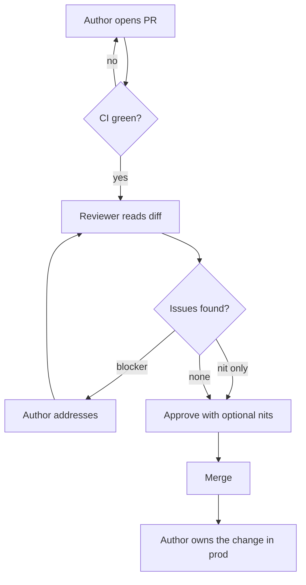

# Code Reviews — Interview Questions

> 50+ questions across all tiers (Junior → Staff). Code review is the most-discussed engineering ritual in interviews because it reveals how you think about collaboration, quality, and risk — not just code. Many of these are behavioral; answer them like a leadership signal, not a trivia quiz.

---

## Table of Contents

- [Junior (12 questions)](#junior-12-questions)
- [Mid (14 questions)](#mid-14-questions)
- [Senior (16 questions)](#senior-16-questions)
- [Staff (10 questions)](#staff-10-questions)
- [Rapid-Fire](#rapid-fire)
- [Summary](#summary)
- [Further Reading](#further-reading)
- [Related Topics](#related-topics)

---

## The review loop at a glance

The loop has one job: **catch problems while they are cheap to fix.** Everything below is in service of keeping this loop fast, kind, and effective.

---

## Junior (12 questions)

### J1. What is the purpose of code review?

Answer

To improve the change and the codebase before it ships. Concretely: catch defects, ensure the design fits the system, keep the code readable for the next person, and spread knowledge across the team. Quality assurance is only one of several goals — and, per the research, not even the dominant one in practice.

### J2. Name three things a reviewer should look for.

Answer

Correctness (does it do what it claims, including edge cases?), design (does it fit the existing architecture and not add needless coupling?), and readability (will someone unfamiliar understand it in six months?). Tests, security, and clear naming round out the list.

### J3. What is one thing a reviewer should *not* spend time on?

Answer

Style that a formatter or linter already enforces — indentation, brace placement, import order. If a machine can decide it, a human should not argue about it. Reviewer attention is the scarce resource; spend it on things only a human can judge.

### J4. What is the difference between a nit and a blocker?

Answer

A **blocker** must be resolved before merge — a bug, a security hole, a broken contract, a design choice that will hurt later. A **nit** is a minor, optional suggestion (a clearer variable name, a tidier helper). Prefix nits explicitly (`nit:`) so the author knows they can merge without addressing them.

### J5. Why are small PRs better?

Answer

Small PRs get reviewed faster, get reviewed *better* (a reviewer can actually hold 50 lines in their head, not 1,500), merge sooner, and are easier to revert. Review quality drops sharply as size grows — past a few hundred lines, defect-finding collapses toward rubber-stamping.

### J6. What should a good PR description contain?

Answer

What changed and **why**, how to test it, any risk or rollout concern, and links to the ticket or design doc. The diff shows *what*; the description must supply the *why* and the context the reviewer cannot infer from code alone.

### J7. As an author, what should you do before requesting review?

Answer

Review your own diff first. Ensure CI is green, remove debug code and stray comments, keep the PR focused on one concern, and write a description that answers the questions a reviewer would ask. Self-review catches roughly half the comments you would otherwise receive.

### J8. Is "LGTM" alone an acceptable review?

Answer

Only if you actually read and understood the change. "LGTM" as a reflex on a diff you skimmed is rubber-stamping — it provides false assurance. A real approval means "I read this, I understand it, and I would be comfortable owning it."

### J9. How should you phrase review feedback?

Answer

Critique the code, not the person: "this function does X" not "you wrote bad code." Prefer questions over commands ("could this NPE if `list` is empty?"), explain the *why*, and acknowledge good work. Tone determines whether the author engages or gets defensive.

### J10. What do you do when you do not understand part of a PR?

Answer

Ask. "I don't follow why we need this lock here — can you explain?" An honest question is a legitimate review comment; if *you* can't follow it after genuine effort, that itself is a readability signal worth surfacing.

### J11. Should the author or the reviewer have the final say?

Answer

The author owns the change and is accountable for it, so they make the final call on non-blocking points. The reviewer is a gatekeeper for blockers but a collaborator, not a boss. Most healthy teams resolve disagreements by discussion, escalating to a third person only when stuck.

### J12. What is the first thing you check in a PR?

Answer

The description and the scope: do I understand what this is trying to do and why? Then I confirm CI is green so I am not reviewing broken code. Only then do I read the diff — starting with the core logic, not the top of the file.

---

## Mid (14 questions)

### M1. What is the ideal PR size, and why does it matter?

Answer

Aim for roughly 200–400 lines of meaningful change; under 200 is even better. The reason isn't arbitrary — reviewer comprehension and defect detection both degrade past a few hundred lines. Beyond that, reviewers stop hunting for bugs and start scanning for surface issues. Small PRs are the single highest-leverage habit for review quality.

### M2. How do you keep PRs small when the feature is large?

Answer

Split along seams: separate refactors from behavior changes; land the interface before the implementation; use feature flags so half-finished work can merge dark; stack PRs so each builds on the last. "Refactor + feature in one PR" is the classic reason a PR balloons — separate them.

### M3. What should be automated rather than reviewed by hand?

Answer

Formatting, lint rules, import ordering, type checks, test execution, coverage thresholds, dependency/vulnerability scanning, and commit-message format. Anything deterministic belongs in CI. Humans should review only what requires judgment — design, naming, correctness of intent, security reasoning.

### M4. What is the "ship / show / ask" model?

Answer

A spectrum of review rigor by risk. **Ship**: merge directly (trivial, low-risk — typo fixes, docs). **Show**: merge immediately but open a PR for visibility and post-hoc comment. **Ask**: open a PR and wait for approval before merging (the default for non-trivial change). It lets teams match ceremony to risk instead of forcing every one-line change through a full review.

### M5. What is a review SLA and why have one?

Answer

A team agreement on turnaround — e.g., "first response within 4 business hours." Reviews are the most common bottleneck in cycle time; a blocked PR blocks the author, who context-switches and loses momentum. An SLA makes review a first-class priority, not something done "when I get to it."

### M6. The Bacchelli & Bird study found the top motivation for code review wasn't finding defects. What was it, and what does that change?

Answer

Their study of Microsoft developers (*Expectations, Outcomes, and Challenges of Modern Code Review*, ICSE 2013) found that while developers *expected* defect-finding to be the main outcome, the actual top outcomes were **knowledge transfer, increased team awareness, and finding alternative solutions** — and that defect-finding was less effective than expected because reviewers often lacked the context to spot deep bugs. This reframes review as primarily a *communication and learning* mechanism. It argues for investing in reviewer context (good descriptions, smaller PRs) and not treating review as a substitute for tests.

### M7. Is code review a substitute for tests?

Answer

No. They catch different things. Tests catch behavioral regressions repeatably and on every future change; review catches design problems, missing edge cases, and readability — once. A reviewer who reasons through logic by hand is slower and less reliable than a test. The strongest signal in a review is often "where are the tests for this?"

### M8. How do you handle a disagreement with the author?

Answer

Separate facts from preferences. If it's a fact (this *will* deadlock), show it — ideally with a failing test. If it's a preference, state it once, label it as such, and defer to the author. When genuinely stuck, ask "what would convince you?" or pull in a third person. Never block a PR over taste.

### M9. When is pair programming a better choice than asynchronous review?

Answer

When the work is exploratory, the design is unsettled, the domain is unfamiliar to one party, or the cost of a wrong direction is high. Pairing is review compressed to zero latency — feedback happens as the code is written. Some teams treat pairing as *satisfying* the review requirement, since two people already saw every line.

### M10. How do you review a PR that touches code you don't know well?

Answer

Be honest about the limits of your review. Review what you *can* judge (the interface, the tests, the readability) and explicitly flag what you cannot ("I'm not familiar with the payment flow — someone from that team should look at the reconciliation logic"). A partial review honestly labeled beats a confident rubber stamp.

### M11. What is review ping-pong and how do you avoid it?

Answer

Endless rounds where each review surfaces new issues the previous round didn't, dragging a PR over days. Avoid it by doing a *complete* first pass (don't dribble feedback), batching comments, distinguishing must-fix from optional up front, and — when it's clearly going sideways — jumping on a five-minute call. Async is great until it isn't.

### M12. Should every line of a PR be reviewed?

Answer

Every line should be *seen*, but not every line deserves equal scrutiny. Generated code, vendored dependencies, lockfiles, and mechanical renames warrant a glance, not a line-by-line audit. The reviewer's judgment is in allocating attention: dwell on the risky core, skim the boilerplate.

### M13. How do you give feedback that the author will actually act on?

Answer

Be specific and actionable, explain the consequence, and propose a direction. "This could be clearer" is noise; "extracting lines 40–60 into `validateOrder()` would make the happy path readable, and it isolates the retry logic for testing" is something the author can do. Link to a standard or doc when one exists, so it's the team's rule, not your opinion.

### M14. What does a healthy review *cycle time* look like, and how do you measure it?

Answer

Measure time-to-first-review and time-to-merge. Healthy teams keep time-to-first-review in hours and time-to-merge in a day or two for normal PRs. Track the distribution, not just the mean — a long tail of week-old PRs signals a process problem (PRs too big, reviewers overloaded, or no SLA). It's a DORA-adjacent flow metric: review latency directly throttles lead time for changes.

---

## Senior (16 questions)

### S1. How do you review AI-generated code differently from human-written code?

Answer

**What the interviewer is checking:** that you treat AI output as an unverified draft, not a trusted colleague's work.

The failure modes differ. AI code is often *plausible-looking but subtly wrong*: hallucinated APIs, fabricated library functions, confident-but-incorrect edge-case handling, and security anti-patterns copied from its training data. It also tends to be verbose and to invent abstractions that don't fit your codebase. So you scrutinize correctness and security *harder*, not softer, because the surface polish lowers the reviewer's guard. The author — human or AI-assisted — remains fully accountable; "the model wrote it" is not a defense. Practically: demand tests, verify every external API actually exists, and watch for code that "looks done" but was never run.

### S2. A reviewer is blocking a PR purely over a style preference the formatter doesn't enforce. How do you resolve it?

Answer

First, decide whether it's truly preference or a hidden correctness/maintainability concern. If it's genuinely taste, the reviewer should not block — state it as a nit and approve. The durable fix is to *promote the preference to a rule*: if it matters, add it to the style guide and enforce it with a linter so it never costs human review time again. Unwritten preferences enforced by individual reviewers are how teams accumulate friction.

### S3. How do you handle a mega-PR you're asked to review?

Answer

Push back before reviewing: a 2,000-line PR cannot be reviewed well, and approving it is a quality lie. Ask the author to split it — by layer, by commit, by independent concern. If splitting is genuinely impossible (a framework migration, a generated change), set expectations explicitly: review the architecture and the risky parts deeply, sample the mechanical parts, and *say so in the approval* so the record is honest. Never let PR size silently degrade your standard into a rubber stamp.

### S4. How do you build a review culture on a new team?

Answer

**What the interviewer is checking:** leadership and the ability to change behavior, not just personal habits.

Set norms explicitly: small PRs, fast turnaround (an SLA), code-focused tone, automate everything mechanical, separate nits from blockers. Model it yourself — your reviews set the tone. Make review *visible* (dashboards for cycle time and PR size), and frame it as collective ownership and learning, not gatekeeping. Most importantly, remove the friction: a fast, kind review loop is self-reinforcing; a slow, harsh one teaches people to route around it.

### S5. What is the danger of treating review purely as defect-finding?

Answer

It sets the wrong success metric and the wrong tone. If review is "catch bugs," then a clean PR feels like a failed review, reviewers over-comment to justify themselves, and the knowledge-transfer and design benefits — which the research shows are the *bigger* payoff — get ignored. It also breeds false confidence that review will catch what only tests can. Frame review as improving the change and the team, with defect-catching as one outcome among several.

### S6. How do you prevent reviews from becoming a bottleneck?

Answer

Attack both supply and demand. Demand: keep PRs small and CI-gated so reviews are quick. Supply: an SLA, a rotation or round-robin so load is shared, and a norm that reviewing is part of the job, not an interruption. Use ship/show/ask to take trivial changes off the queue entirely. Track time-to-first-review and make the long tail visible. If a single person is the bottleneck (the only reviewer who knows a module), that's a bus-factor problem to fix, not a review problem.

### S7. When should you approve a PR you have minor concerns about?

Answer

When the concerns are non-blocking and waiting costs more than they're worth. "Approve with comments" or "approve, optional nits" keeps the author moving while recording your suggestions. Reserve hard blocks for things that must not ship: bugs, security, broken contracts, design that will be expensive to undo. Blocking on optional improvements is how reviews become adversarial and slow.

### S8. How do you review for security specifically?

Answer

Look where untrusted data enters and where privileged operations happen: input validation, injection (SQL, command, template), authn/authz checks, secrets in code, unsafe deserialization, and dependency changes. Automate what you can (SAST, dependency scanning) so human review focuses on logic — e.g., "this endpoint checks the user is logged in but not that they own the resource." For high-risk areas, route to a security specialist rather than relying on a generalist reviewer.

### S9. The author keeps arguing every comment instead of addressing them. How do you handle it?

Answer

**What the interviewer is checking:** conflict handling and emotional maturity under friction.

Separate the relationship from the issue. Acknowledge their reasoning, restate the underlying concern, and shift from positions to interests: "what we both want is X — does your approach get us there?" For factual disputes, move to evidence (a failing test ends the argument fast). If it's a pattern across many PRs, it's a culture conversation to have offline, 1:1, not in PR comments — and possibly a sign the team needs clearer written standards so debates aren't relitigated per PR.

### S10. How do you onboard a junior engineer through code review?

Answer

Use review as teaching, not just gating. Explain the *why* behind every non-trivial comment, link to docs and examples, distinguish "this is wrong" from "here's a pattern we prefer," and praise good decisions explicitly. Calibrate volume — twenty comments on a first PR overwhelms; pick the highest-leverage few and let the rest go. Pairing on the first few PRs often teaches faster than async comments ever will.

### S11. What metrics would you track for code review health, and which would you avoid?

Answer

Track flow and quality: time-to-first-review, time-to-merge, PR size distribution, and review coverage (are PRs getting a real second pair of eyes). Avoid individual productivity metrics — comments-per-review, lines-reviewed-per-day, approval counts. They're trivially gamed and corrosive: they incentivize nitpicking, rubber-stamping, and PR-size gaming. Measure the *system's* health, not individuals' output.

### S12. How do you handle reviewing a hotfix during an incident?

Answer

Match rigor to urgency, but don't skip review entirely — that's when mistakes are most likely. A fast synchronous review (over the shoulder or a quick call) is appropriate; a second person should still see the change. Keep the fix minimal and reversible, and schedule a proper follow-up review and any cleanup once the fire is out. The post-incident review of the fix is non-negotiable.

### S13. Two senior reviewers give contradictory feedback on the same PR. What do you do?

Answer

Surface it openly rather than letting the author pick one and anger the other. Get the two reviewers in a short conversation to align — the disagreement is usually a missing shared standard. Whatever they decide, capture it as a written guideline so the next PR doesn't replay the same debate. The author shouldn't be caught arbitrating between two seniors.

### S14. How does code review interact with continuous integration and trunk-based development?

Answer

Trunk-based development depends on small, frequent merges, which depends on fast review. CI is the prerequisite: machines verify correctness mechanically so review can focus on judgment, and a green build is the entry condition for human review. The tighter this loop, the smaller PRs become and the more review shifts from defect-hunting to design and knowledge-sharing. Slow review is the thing that kills trunk-based flow.

### S15. When is *not* requiring review the right call?

Answer

For genuinely trivial, low-risk, easily-reverted changes — a typo in a doc, a config value bump behind a flag — the "ship" tier of ship/show/ask is reasonable, especially for experienced engineers on code they own. The cost of review (latency, reviewer time) can exceed its value. The judgment is risk-based: review where a mistake is expensive or hard to undo; relax where it's cheap and visible. Blanket "every change needs two approvals" regardless of risk is process for its own sake.

### S16. How do you review tests, not just production code?

Answer

Tests are first-class code and deserve equal scrutiny — arguably more, since a bad test gives false confidence forever. Check that they test behavior not implementation, that they'd actually fail if the code broke (assert something meaningful, not just "no exception"), that names describe the scenario, and that they're deterministic and fast. A common review miss: approving a PR whose tests pass but assert nothing useful.

---

## Staff (10 questions)

### S17. Microsoft's research found defect-finding was less effective than developers expected. As a staff engineer, how do you act on that?

Answer

**What the interviewer is checking:** whether you make process decisions from evidence rather than ritual.

I treat review as a *context-and-communication* mechanism and put my weight behind the things that actually move defect-finding: shrink PRs (the biggest lever), invest in descriptions and design docs so reviewers have context, and route deep-correctness questions to people who own the code. Crucially, I don't ask review to do tests' job — I push correctness verification into automated tests, contracts, and type systems, and let review focus on design, security reasoning, and spreading knowledge. The research says review's durable value is awareness and alternatives; I optimize for that and stop pretending a human re-reading a diff is a reliable bug filter.

### S18. How do you scale code review across hundreds of engineers without it becoming a bottleneck or a rubber-stamp factory?

Answer

Codeownership and routing: `CODEOWNERS`-style automatic reviewer assignment so PRs reach people with context. Heavy automation so humans never review what a machine can decide. Clear, written standards so reviews don't relitigate the same debates org-wide. Risk-tiered process (ship/show/ask) so trivial changes don't consume reviewer attention. And org-level visibility into cycle time and PR size so degradation is caught early. The anti-pattern at scale is mandating uniform heavy process everywhere — it produces rubber-stamping precisely because reviewers are overloaded.

### S19. How do you decide what belongs in automated tooling versus human review at an org level?

Answer

Anything deterministic and objective goes to tooling — formatting, lint, types, complexity thresholds, security scans, dependency policy, commit conventions. The test: "could two competent engineers disagree about the right answer?" If no, automate it and stop spending human time on it. If yes, it needs human judgment. Over time I push the boundary toward automation: every recurring nit is a candidate for a lint rule. The goal is that human review *only* ever discusses things that genuinely require taste and context.

### S20. A team's reviews are thorough but their cycle time is terrible. How do you diagnose and fix it?

Answer

Instrument first: time-to-first-review, time-to-merge, PR size, number of review rounds. Common root causes and fixes: PRs too big (split them), no SLA (set one), reviewer overload or bus factor (broaden the reviewer pool, add CODEOWNERS), review ping-pong (complete first passes, sync on calls), or CI too slow (so review starts late). "Thorough but slow" often means thoroughness is misallocated — auditing boilerplate line-by-line while the design question waits. The fix is rarely "review less"; it's "review the right things and remove the structural friction."

### S21. How do you handle the organizational risk of AI-generated code at review time?

Answer

Set policy, not vibes. Require that AI-assisted code be tested and that the human author take full accountability for it. Strengthen the automated gates that catch what reviewers miss under polish: security scanning, dependency verification (to catch hallucinated/typosquatted packages), and tests as a merge gate. Educate reviewers that AI output lowers their guard precisely when it shouldn't. And watch volume — if AI lets people *produce* faster than the team can *review* well, review becomes the bottleneck or the rubber stamp; capacity has to scale with output or quality silently erodes.

### S22. When is pair (or mob) programming the right org-level investment versus asynchronous review?

Answer

Pairing trades throughput for latency and learning. I invest in it where its strengths pay off: high-uncertainty design work, onboarding, critical/high-blast-radius code, and breaking down knowledge silos. For most steady-state feature work, async review scales better — it doesn't require two calendars to align and it leaves a written record. Many teams blend them: pair on the hard parts, async-review the rest, and let "we paired on this" satisfy the review requirement since two people already owned every line.

### S23. How do you prevent rubber-stamping systemically (not just by asking people to try harder)?

Answer

Remove the conditions that cause it. Rubber-stamping is rational when PRs are too big to review, reviewers are overloaded, or there's no accountability for what ships. So: enforce small PRs, balance reviewer load, make authors and reviewers jointly own production outcomes (the reviewer's name is on it), and surface escaped-defect data in retros without blame. Crucially, *don't* measure individuals on review volume — that manufactures rubber-stamping. Culture follows incentives; fix the incentives.

### S24. How do you design a review process that survives both growth and turnover?

Answer

Encode it, don't tribal-knowledge it. Written, living standards; automated enforcement so the rules don't depend on who's reviewing; CODEOWNERS so context routing survives people leaving; and review-as-teaching so knowledge spreads rather than concentrating. The test of resilience: a new senior hire should be able to give and receive good reviews in week one by reading the docs and the linter config — not by absorbing six months of unwritten norms.

### S25. Is high review coverage always good? When is mandatory review counterproductive?

Answer

No. Mandatory review on trivial, low-risk, reversible changes is pure latency with no quality return, and it trains people to rubber-stamp (because most reviews are pointless, *all* reviews start feeling pointless). It can also create a false sense of safety — "everything is reviewed" — that masks the fact that reviews of huge PRs catch nothing. Better: risk-tier the process so scrutiny concentrates where mistakes are expensive, and let the cheap, visible, reversible stuff flow.

### S26. How would you justify the cost of code review to a skeptical VP focused on velocity?

Answer

Reframe it as velocity insurance, with evidence. Defects found in review are orders of magnitude cheaper than in production; review spreads context so the team isn't blocked by single points of knowledge (which *kills* velocity when someone's on leave); and it keeps the codebase changeable, which is what sustains velocity over quarters. Then I show the data: cycle time stays low because we keep PRs small and fast, not because we skip review. The honest framing is that *slow* review hurts velocity — so we optimize the loop, we don't remove it.

---

## Rapid-Fire

| Question | Answer |
|---|---|
| Is LGTM enough? | Only if you read and understood the diff. |
| Should every line be reviewed? | Seen, yes; scrutinized equally, no. |
| Is review a substitute for tests? | No — they catch different things. |
| Nit or blocker by default? | Default to non-blocking; block only on real risk. |
| Who has the final say on non-blockers? | The author owns the change. |
| Ideal PR size? | ~200–400 lines; smaller is better. |
| Top *actual* benefit of review (per research)? | Knowledge transfer and awareness. |
| Style debates after a formatter exists? | Don't — automate it, promote it to a rule. |
| Review SLA target for first response? | Hours, not days. |
| Argue style preference how many times? | Once, labeled as preference, then defer. |
| Mega-PR — review it as-is? | No; push to split first. |
| AI code — review more or less carefully? | More; polish lowers your guard. |
| Best way to make reviews faster? | Smaller PRs. |
| Measure reviewers on comment count? | No — it's gamed and corrosive. |
| What does an approval *mean*? | "I'd be comfortable owning this in prod." |

---

## Summary

Code review's real job is communication as much as quality control. The strongest engineers treat it as: keep PRs small, automate everything mechanical, look for correctness/design/readability rather than style, separate nits from blockers, keep the loop fast and kind, and never let it masquerade as a substitute for tests. The Bacchelli & Bird finding — that knowledge transfer and awareness, not defect-finding, are review's dominant outcomes — should shape how you justify and run the process. At the senior and staff level, the questions are mostly about culture and systems: preventing rubber-stamping, killing bottlenecks, tiering by risk, and handling the new reality of AI-generated code, where surface polish makes careful scrutiny *more* important, not less.

The trick questions all have the same shape: any rule taken absolutely (LGTM is fine / every line must be reviewed / review replaces tests / always require two approvals) becomes wrong. Judgment — matching rigor to risk — is the answer the interviewer is listening for.

---

## Further Reading

- Bacchelli & Bird, *Expectations, Outcomes, and Challenges of Modern Code Review* (ICSE 2013) — the empirical foundation for "review is mostly communication."
- Google, *Engineering Practices: How to do a Code Review* — the reviewer's standard; the author's guide is its companion.
- Martin Fowler, *Ship / Show / Ask* — risk-tiered review.
- Forsgren, Humble & Kim, *Accelerate* — review latency as a driver of lead time (DORA metrics).

---

## Related Topics

- [Code Reviews — README](../README.md) — the positive rules this interview tests.
- [junior.md](junior.md) · [professional.md](professional.md) — same chapter, other depths.
- [Clean Commits & Version Control](../25-clean-commits-and-version-control/README.md) — small, reviewable commits feed small PRs.
- [Refactoring](../../refactoring/README.md) — separating refactors from behavior changes is how PRs stay small.

---

[← Code Reviews README](../README.md) · [Clean Code](../README.md) · **Next:** [professional.md](professional.md)
