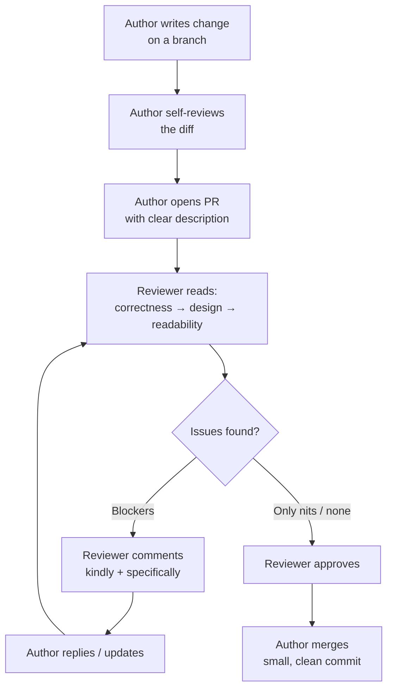

# Code Reviews — Junior Level

> **Level:** Junior — "What's the rule? Show me a clean example."
> A code review is the moment your work meets another human. This file teaches the small, concrete habits that make that meeting fast, kind, and useful — for both the person who wrote the code and the person reading it.

---

## Table of Contents

1. [What is a code review?](#what-is-a-code-review)
2. [Real-world analogy](#real-world-analogy)
3. [The review lifecycle](#the-review-lifecycle)
4. [Rule 1 — Keep the PR small and single-purpose](#rule-1--keep-the-pr-small-and-single-purpose)
5. [Rule 2 — Self-review before you request a review](#rule-2--self-review-before-you-request-a-review)
6. [Rule 3 — Write a clear PR description (what / why / how to test)](#rule-3--write-a-clear-pr-description-what--why--how-to-test)
7. [Rule 4 — Review in priority order: correctness → design → readability](#rule-4--review-in-priority-order-correctness--design--readability)
8. [Rule 5 — Let the formatter and linter own style](#rule-5--let-the-formatter-and-linter-own-style)
9. [Rule 6 — Be kind and specific; ask, don't command](#rule-6--be-kind-and-specific-ask-dont-command)
10. [Rule 7 — Label every comment: nit / suggestion / blocker](#rule-7--label-every-comment-nit--suggestion--blocker)
11. [Rule 8 — Respond promptly to keep the flow](#rule-8--respond-promptly-to-keep-the-flow)
12. [Rule 9 — As the author, don't take it personally](#rule-9--as-the-author-dont-take-it-personally)
13. [Common Mistakes](#common-mistakes)
14. [Test Yourself](#test-yourself)
15. [Cheat Sheet](#cheat-sheet)
16. [Summary](#summary)
17. [Further Reading](#further-reading)
18. [Related Topics](#related-topics)

---

## What is a code review?

A **code review** is a step in the workflow where one engineer (the **author**) proposes a change — usually as a **pull request (PR)** or **merge request** — and another engineer (the **reviewer**) reads it before it merges into the shared branch.

The goal is **not** to prove the author wrong. The goal is shared:

- **Catch bugs** before users do.
- **Spread knowledge** so more than one person understands each part of the system.
- **Keep the codebase consistent** so the next reader isn't surprised.
- **Mentor in both directions** — juniors learn from seniors, and seniors learn the corners of the code that juniors just touched.

A review is a conversation about code, not a judgment of a person. Everything in this file follows from that one sentence.

> **Key idea:** The author and reviewer are on the **same team**, trying to ship correct code quickly. A review that feels like a fight has gone wrong, no matter who "wins."

---

## Real-world analogy

### The proofreader

Imagine you wrote a five-page letter that your whole department will mail to a customer. Before it goes out, a colleague proofreads it.

A **good** proofreader circles the sentence that says the wrong delivery date (a real error), suggests splitting one tangled paragraph (a design note), and ignores your choice between "email" and "e-mail" because the company style guide already settles that.

A **bad** proofreader writes "your writing is sloppy" in the margin (a personal attack), spends twenty minutes arguing that they prefer the Oxford comma even though the style guide bans it (bikeshedding), and never notices the wrong delivery date because they were busy with commas (a nitpick-only review that missed the real bug).

Code review is proofreading for code. The same habits separate the helpful proofreader from the annoying one.

### The pull request that nobody can read

You inherit a PR titled "fixes." It changes 1,400 lines across 38 files. It renames a class, adds a feature, reformats three unrelated files, and bumps a dependency — all at once. You open it, scroll for two minutes, give up, and type `LGTM`.

Three days later that PR causes an outage. Nobody caught the bug because **nobody could**. The diff was too big to review honestly. This is the single most common failure in code review, and the first rule below exists to prevent it.

---

## The review lifecycle

Most reviews follow the same loop. Knowing the shape helps you see where each rule fits.



Small PRs keep this loop short — one or two trips around `D → F → G`. Mega-PRs turn it into endless **review ping-pong**: ten rounds, days of delay, and a tired reviewer who eventually rubber-stamps it.

---

## Rule 1 — Keep the PR small and single-purpose

**One PR should do one thing.** A reviewer can give a 200-line PR real attention. A 1,400-line PR gets skimmed, and skimming means missed bugs.

A good size is roughly **under 400 lines of meaningful change**. That's a soft target, not a law — a mechanical rename across many files is fine because it's easy to scan. The real rule is **single-purpose**: every line in the PR should serve one stated goal.

### Bad — a mega-PR

```
Title: updates

Changes:
- Add coupon support to checkout          (new feature)
- Rename OrderSvc -> OrderService          (refactor)
- Reformat the entire payments package     (style churn)
- Bump postgres driver 4.2 -> 5.0          (dependency)
- Fix a typo in the README                 (docs)

38 files changed, 1,402 insertions(+), 901 deletions(-)
```

The reviewer cannot tell which deletions are the rename and which are the feature. The driver bump might break something, but it's buried. Honestly reviewing this takes hours, so it won't happen.

### Good — split into focused PRs

```
PR #1  Reformat payments package (formatter only, no logic)   — 0 logic changes
PR #2  Rename OrderSvc -> OrderService                         — pure rename
PR #3  Bump postgres driver 4.2 -> 5.0                         — dependency only
PR #4  Add coupon support to checkout                          — the feature
```

Now each PR has one purpose. PR #1 is a 10-second scan ("formatter only"). PR #4 is the one worth careful attention, and the reviewer's attention isn't already spent.

> **Rule of thumb:** If you find yourself typing "and also" in a PR title, you probably have two PRs.

---

## Rule 2 — Self-review before you request a review

Before you click "request review," read your own diff line by line, as if you were the reviewer. You will catch a surprising amount: leftover debug prints, a commented-out block, a `TODO` you meant to delete, a file you didn't intend to touch.

This respects the reviewer's time. Every issue you catch yourself is one the reviewer doesn't have to write up — and one that doesn't add a round-trip.

### What a self-review catches

```python
# You'd catch all of these by reading your own diff first:

def apply_coupon(order, code):
    print("DEBUG order:", order)          # leftover debug print
    discount = lookup_discount(code)
    # discount = 0.10  # old hardcoded value   <- forgotten commented-out line
    order.total -= order.total * discount
    return order
```

Reading your own diff, you delete the `print` and the dead comment in ten seconds. If a reviewer has to flag them instead, that's two comments, a notification, and a wait — for something you could have removed yourself.

> **Habit:** Open the "Files changed" tab and read it top to bottom *before* assigning anyone. If you wouldn't approve it, don't send it.

---

## Rule 3 — Write a clear PR description (what / why / how to test)

The diff shows **what changed**. Only you know **why**, and the reviewer needs the why to judge whether the how is right. A good description answers three questions.

### Bad description

```
Title: fix

fixed the bug
```

The reviewer has to reverse-engineer the intent from the code — which is exactly the thing they're supposed to be checking against. They can't tell whether the code does what you *meant*, only what it *does*.

### Good description

```
Title: Fix double-charge when coupon retried after timeout

## What
Checkout charged the card twice if the payment request timed out and
the user clicked "Pay" again. This adds an idempotency key so a retried
charge with the same key is a no-op.

## Why
Reported in INC-2031. ~12 customers double-charged last week.
Root cause: each click created a fresh PaymentIntent.

## How to test
1. Start checkout, trigger a timeout (set PAYMENT_TIMEOUT_MS=1).
2. Click "Pay" again.
3. Confirm only ONE charge appears in the Stripe test dashboard.

Unit test added: test_retry_is_idempotent
```

Now the reviewer knows the bug, the fix, and exactly how to verify it. The review goes faster and catches more, because the reviewer can check the code *against the stated intent*.

> **Tip:** If your description is hard to write, the change might be doing too much. That's a signal to revisit Rule 1.

---

## Rule 4 — Review in priority order: correctness → design → readability

As a reviewer, attack the most important things first. If you start with variable names, you'll spend your energy on trivia and may never reach the bug.

| Priority | Question | Example |
|---|---|---|
| **1. Correctness** | Does it work? Edge cases? Off-by-one? Null/empty? Concurrency? | "What happens if `items` is empty here?" |
| **2. Design** | Is it in the right place? Does it duplicate existing code? Is the abstraction sound? | "We already have `MoneyFormatter` — can this reuse it?" |
| **3. Readability** | Can the next person understand it? Clear names? Right amount of comments? | "Could `x` be named `remainingBalance`?" |

The deepest value of review is at the top. A typo in a name costs the next reader five seconds; a missed concurrency bug costs an outage.

### Spotting a correctness issue

The code under review:

```go
func averageScore(scores []int) int {
    sum := 0
    for _, s := range scores {
        sum += s
    }
    return sum / len(scores)   // panics on empty slice
}
```

A reviewer who jumped straight to style might suggest renaming `s` to `score`. A reviewer working in priority order catches the real problem first:

> **blocker:** `len(scores)` is 0 when the slice is empty, so this panics with a divide-by-zero. What should `averageScore([])` return — 0, or an error?

That comment is worth more than every style note combined.

---

## Rule 5 — Let the formatter and linter own style

If your project has an autoformatter (`gofmt`, `black`, `prettier`, `google-java-format`) and a linter, **let them decide style**. Do not hand-comment on spacing, brace placement, import order, or quote style. The tool is the source of truth, and arguing about what the tool already enforces is wasted breath.

Hand-reviewing style has two failure modes:

- **Bikeshedding** — long debates about trivial preferences the tool has already settled.
- **Distraction** — every style comment is attention not spent on correctness and design.

### Bad — bikeshedding after a formatter exists

```
Reviewer: I'd put a blank line before the return.
Reviewer: Use single quotes here, not double.
Reviewer: This import should be above that one.
Reviewer: 2 spaces, not 4.
```

Four comments, zero bugs found, and the project already runs `black` on every commit — which means these are either already correct or will be auto-fixed. Pure noise.

### Good — point at the tool, not the preference

```
suggestion: CI should reject this on formatting — did `make fmt` run?
Once the formatter passes, I'll do the real review.
```

One comment, and it moves the style question to the machine where it belongs. Your human attention stays on what humans are good at.

> **Setup beats arguing:** add the formatter to a pre-commit hook and to CI. Then style is never a review topic again. See [Formatting](../04-formatting/README.md).

---

## Rule 6 — Be kind and specific; ask, don't command

Comments are read by a person who worked hard on this code. Tone matters, and it costs nothing to be kind. Two habits do most of the work:

1. **Comment on the code, never the coder.** "This function" — not "you."
2. **Ask a question or make a suggestion** instead of issuing an order. Questions invite the author's knowledge; you might be the one who's wrong.

Also: **be specific**. "This is confusing" gives the author nothing to act on. "This loop mutates `total` and also calls `save()` — splitting them would make it easier to test" is actionable.

### Bad comments

```
- "This is wrong."
- "Why would you do it this way??"
- "Sloppy. Did you even test this?"
- "No."
- "I don't like this."
```

These attack, give no path forward, and put the author on the defensive — which leads straight to arguing instead of fixing.

### Good comments

```
- "What happens if `user` is null here? I think this NPEs on the
   logged-out path — can we guard it?"

- "Could we reuse `parseDate()` from utils instead of re-parsing here?
   It already handles the timezone edge case."

- "nit: `tmp` is hard to follow three screens later — maybe
   `pendingRefund`? Non-blocking."

- "I might be missing context — what drives the choice of a list over
   a set here? Lookups in the loop below look O(n)."
```

Each names the specific code, explains the concern, and either asks a question or proposes a concrete alternative. The author can act immediately and doesn't feel attacked.

> **The magic phrase for disagreements:** *"What would convince you?"* It turns a standoff into a shared search for the right answer.

---

## Rule 7 — Label every comment: nit / suggestion / blocker

Not every comment carries the same weight. Without labels, the author can't tell "must fix before merge" from "tiny preference, ignore if you like." So they either treat everything as blocking (slow) or nothing as blocking (bugs slip through). A one-word label fixes this.

| Label | Meaning | Must the author act? |
|---|---|---|
| **nit:** | Tiny, cosmetic, optional. A naming preference, a wording tweak. | No — author's call. |
| **suggestion:** | A real improvement worth considering, but not a release blocker. | Should consider; can defer. |
| **blocker:** | Must be resolved before merge. A bug, a security hole, a broken contract. | Yes. |
| **question:** | You genuinely don't understand and want context. | Answer it. |

### Labeled comments in practice

```
blocker:   This SQL interpolates `userId` directly into the string —
           that's an injection hole. Use a parameterized query.

suggestion: Extracting these three lines into `normalizeEmail()` would
            let us unit-test them and reuse them in signup.

nit:       `i` could be `rowIndex` for readability. Non-blocking.

question:  Is `retries=5` intentional? The rest of the service uses 3.
```

The author instantly knows the SQL fix is mandatory, the extraction is optional-but-encouraged, the rename is take-it-or-leave-it, and the retry count needs a one-line answer. The review resolves in a single pass.

> **As a reviewer, default to fewer blockers.** If you're blocking on something subjective ("I would have written it differently"), it's a `nit` or a `suggestion`, not a blocker. Blocking on taste is one of the fastest ways to frustrate a teammate.

---

## Rule 8 — Respond promptly to keep the flow

A PR is **work in flight**. While it waits, the author has to keep its context in their head, or hold up other work that depends on it. A review that sits for three days is expensive even if the eventual comments are great.

You don't have to drop everything. The habit is: **respond within a reasonable window** (many teams aim for the same business day), and if the PR is too big to review now, say so — *"I'll get to this after standup"* — so the author isn't guessing.

The same applies to the author: when the reviewer leaves comments, reply or push updates promptly while the change is still fresh, rather than letting it go stale.

> **Why flow matters:** a small PR reviewed within hours might merge the same day. The same PR reviewed in scattered five-minute glances over a week causes merge conflicts, lost context, and re-reviews. Fast loops beat thorough-but-slow.

---

## Rule 9 — As the author, don't take it personally

A comment on your code is not a comment on you. The reviewer is helping the code, which is now shared property. When you get feedback, you have exactly three honest responses:

1. **Agree** → make the change. (Most common.)
2. **Disagree** → explain your reasoning, kindly. The reviewer may have missed context, or may be right anyway.
3. **Unsure** → ask a clarifying question.

What you should **not** do is argue to win, or grudgingly resist every note. That turns a quick review into a fight and burns goodwill you'll want later.

### Bad — defensiveness

```
Reviewer: blocker: this divides by len(scores), which panics on empty input.

Author:   It's never empty in practice.
Author:   Why are you nitpicking my code?
Author:   It worked on my machine.
```

The reviewer raised a real correctness issue. The author argued instead of engaging, and the bug is still there.

### Good — engaging with the feedback

```
Reviewer: blocker: this divides by len(scores), which panics on empty input.

Author:   Good catch — you're right, the caller can pass an empty list
          from the filtered view. I'll return 0 for empty and add a
          test. Pushing in a sec.
```

Or, when you disagree:

```
Reviewer: suggestion: pull this into a shared helper?

Author:   I considered it — the two call sites need slightly different
          rounding, so a shared helper would need a flag and get messier.
          Happy to extract if you feel strongly. What do you think?
```

Both responses keep the conversation collaborative. Disagreement is fine; it just has to come with reasoning and an open door.

> **Reframe:** every comment that catches a bug is a bug your *users* didn't catch. The reviewer just saved you from a worse conversation later.

---

## Common Mistakes

These are the anti-patterns to recognize and avoid — on either side of the review.

### Rubber-stamp `LGTM`

Approving without actually reading the diff. It feels helpful (the author is unblocked!) but it defeats the entire purpose: no bugs caught, no knowledge shared. A fast `LGTM` on a 1,000-line PR is worse than no review, because it creates false confidence. **If you approve it, you co-own it.**

### Bikeshedding on style

Debating trivia — quote style, brace placement, blank lines — especially when a formatter already decides these. Named after a story about a committee that approves a nuclear plant in minutes but argues for hours about the color of the staff bike shed, because everyone has an opinion on bike sheds. Let the tool own style (Rule 5).

### Nitpick-only reviews

Leaving ten `nit:` comments about names and spacing while missing that the PR introduces an N+1 query or a race condition. Lots of comments can *feel* like a thorough review while delivering none of the real value. Review in priority order (Rule 4): correctness first.

### Personal-attack tone

"Sloppy," "did you even test this," "why would anyone do this." Critique the code, never the person (Rule 6). Hostile reviews make people stop asking for reviews — which is how bugs ship.

### Blocking on subjective preference

"I would have used a `switch` here" is a `nit`, not a `blocker`. Blocking a merge over personal taste stalls the team and breeds resentment. Reserve blockers for correctness, security, and broken contracts.

### Mega-PRs (1000+ lines)

The diff is too big to review honestly, so it gets skimmed and rubber-stamped. Keep PRs small and single-purpose (Rule 1). If a PR is already huge, ask the author to split it rather than pretending to review it.

### Author defensiveness

Arguing to win instead of engaging with the feedback. It poisons the relationship and leaves real issues unfixed. Agree, explain-and-disagree, or ask — but don't fight (Rule 9).

### Review ping-pong

Endless rounds because the author and reviewer never actually talk. After two or three back-and-forths on the same thread, **stop typing and have a five-minute call**. Synchronous beats async once a thread gets stuck. Smaller PRs (Rule 1) prevent most ping-pong in the first place.

---

## Test Yourself

<details>
<summary>1. A teammate sends you a PR titled "misc updates" that changes 1,200 lines across 30 files: a new feature, a rename, and a dependency bump. What do you do?</summary>

Don't try to review it as-is, and **don't rubber-stamp it**. Ask the author to split it into focused PRs — feature, rename, and dependency bump separately (Rule 1). Each one then becomes reviewable. A 1,200-line mixed diff can't be reviewed honestly; approving it would be a false `LGTM`.
</details>

<details>
<summary>2. You spot two things in a PR: a SQL query that interpolates user input directly into the string, and a variable named `x` that could be clearer. How do you write these two comments?</summary>

Label them by weight (Rule 7) and lead with correctness (Rule 4):

- `blocker:` the SQL is an injection hole — use a parameterized query.
- `nit:` `x` could be `rowCount` for readability; non-blocking.

The author instantly knows the SQL must be fixed before merge and the rename is optional.
</details>

<details>
<summary>3. A reviewer comments: "This is wrong." What's missing, and how would you rewrite it?</summary>

It's not **specific** and gives no path forward (Rule 6). Rewrite it to name the exact code and the concern, ideally as a question:

> "I think this returns the wrong value when `list` is empty — it'll divide by zero. Should it return 0, or raise? `averageScore([])`."

Now the author knows *what* is wrong, *why*, and what decision is needed.
</details>

<details>
<summary>4. Your reviewer left four comments, all about quote style and blank lines. Your project uses an autoformatter on every commit. What went wrong?</summary>

Bikeshedding (Rule 5). The formatter already owns style, so these comments are noise and likely auto-fixed anyway. Worse, the reviewer's attention went to trivia instead of correctness and design. The fix: run the formatter in CI/pre-commit so style never reaches review, and spend human review on logic. See [Formatting](../04-formatting/README.md).
</details>

<details>
<summary>5. A reviewer raises a correctness bug. You're fairly sure the input is never empty in production. What's the right response?</summary>

Engage, don't dismiss (Rule 9). "Never in practice" is not a guarantee, and inputs change. Either add the guard ("good catch, I'll handle empty and add a test") or, if you truly disagree, explain *why* it can't happen with reasoning — not "it works on my machine." Defensiveness leaves the bug in place.
</details>

<details>
<summary>6. You and a reviewer have gone back and forth four times on the same thread without converging. What now?</summary>

Stop the ping-pong (Common Mistakes). After two or three rounds, switch to a five-minute synchronous call. Text loses nuance; a quick conversation resolves what ten comments can't. Then post a short summary on the thread so the decision is recorded.
</details>

<details>
<summary>7. As an author, what should you do before clicking "request review"?</summary>

Self-review the diff line by line (Rule 2) and write a clear description with what / why / how to test (Rule 3). Reading your own "Files changed" catches debug prints, dead code, and stray files; the description lets the reviewer judge the code against your actual intent.
</details>

<details>
<summary>8. A reviewer writes: "blocker: I would have used a map here instead of a list." Is "blocker" the right label?</summary>

No. That's a personal preference, so it's a `suggestion` or `nit` at most (Rule 7). Blocking a merge on subjective taste stalls the team. If there's a *real* reason — e.g., the list causes an O(n) lookup in a hot loop — then it's about performance, and the comment should say *that*, which may justify a blocker.
</details>

---

## Cheat Sheet

**As the author**

| Do | Don't |
|---|---|
| Keep the PR small and single-purpose (< ~400 lines) | Bundle a feature + rename + reformat + dep bump |
| Self-review the diff before requesting | Send code you haven't re-read |
| Write what / why / how-to-test | Title it "fix" with an empty body |
| Run the formatter before pushing | Make the reviewer flag style |
| Reply promptly; agree, explain, or ask | Argue to win or go silent for days |

**As the reviewer**

| Do | Don't |
|---|---|
| Review correctness → design → readability | Start (and stop) at variable names |
| Let the formatter/linter own style | Bikeshed on quotes and spacing |
| Be kind and specific; ask, don't command | Attack the person; "this is wrong" |
| Label each comment: nit / suggestion / blocker | Block on subjective preference |
| Respond within a reasonable window | Let the PR sit for days |
| Actually read the diff | Rubber-stamp `LGTM` |

**Comment labels:** `nit:` optional · `suggestion:` consider it · `blocker:` must fix · `question:` need context.

**When a thread is stuck:** after 2–3 rounds, have a 5-minute call.

---

## Summary

- A code review is a **collaborative conversation about code**, not a verdict on a person. Author and reviewer share one goal: ship correct code quickly.
- **As the author:** keep PRs small and single-purpose, self-review first, and write a clear what/why/how-to-test description. Don't take feedback personally — agree, explain, or ask.
- **As the reviewer:** review in priority order (correctness → design → readability), let tools own style, label every comment by weight, be kind and specific, and respond promptly.
- The big anti-patterns — rubber-stamp `LGTM`, bikeshedding, nitpick-only reviews, hostile tone, blocking on taste, mega-PRs, defensiveness, and review ping-pong — all come from forgetting that the two people are on the same team.
- Most review pain disappears when PRs are small and tools enforce style, leaving humans free to do what humans do best: catch bugs and share understanding.

---

## Further Reading

- *Clean Code* (Robert C. Martin) — chapters on functions and meaningful names give you the vocabulary to make precise, specific review comments.
- Google's Engineering Practices: "How to do a code review" and "The CL author's guide" — concise, battle-tested, and the source of the correctness-first and small-CL norms.
- *The Pragmatic Programmer* (Hunt & Thomas) — on communicating clearly and treating colleagues with respect.

---

## Related Topics

- [middle.md](middle.md) — review at team scale: review SLAs, ownership, automated checks, and reviewing for the long term.
- [senior.md](senior.md) — designing a healthy review culture, gatekeeping vs. mentoring, and metrics that don't backfire.
- [Chapter README](../README.md) — the full set of code-review rules at a glance.
- [Comments](../03-comments/README.md) — what belongs in a comment vs. a PR description vs. a commit message.
- [Formatting](../04-formatting/README.md) — let the formatter own style so it never reaches review.
- [Clean Commits & Version Control](../25-clean-commits-and-version-control/README.md) — small, single-purpose commits are the unit a small PR is built from.
- [Refactoring](../../refactoring/README.md) — keep refactoring PRs separate from feature PRs (Rule 1).
- [Anti-Patterns](../../anti-patterns/README.md) — many review blockers are anti-patterns you'll learn to name on sight.
