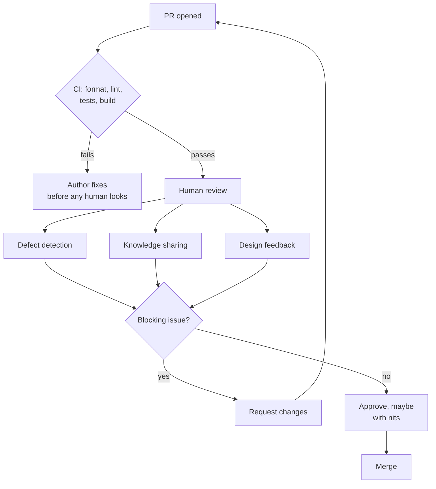
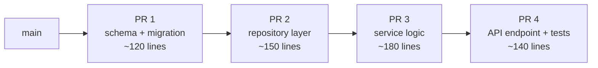

# Code Reviews — Middle Level

> Focus: "Why?" and "When does it bend?" — what review is actually for, the trade-offs behind PR size and tone, and when async review should become a five-minute call.

---

## Table of Contents

1. [What code review is actually for](#what-code-review-is-actually-for)
2. [The data on small PRs](#the-data-on-small-prs)
3. [Async review vs. synchronous pair/mob](#async-review-vs-synchronous-pairmob)
4. [Block vs. approve-with-comments](#block-vs-approve-with-comments)
5. [Review the intent and the tests, not just the code](#review-the-intent-and-the-tests-not-just-the-code)
6. [Conventional comments](#conventional-comments)
7. [Review your own PR first](#review-your-own-pr-first)
8. [Stacked and incremental PRs](#stacked-and-incremental-prs)
9. [Branching strategy shapes review](#branching-strategy-shapes-review)
10. [The review flow](#the-review-flow)
11. [Common Mistakes](#common-mistakes)
12. [Test Yourself](#test-yourself)
13. [Cheat Sheet](#cheat-sheet)
14. [Summary](#summary)
15. [Further Reading](#further-reading)
16. [Related Topics](#related-topics)

---

## What code review is actually for

If you can only remember one thing: **review is not a gate, it is a communication channel.** The gate is a side effect; the channel is the point. When a team treats review purely as "the thing that stands between me and merge," every incentive bends toward minimizing friction — and the minimum-friction move is a fast `LGTM` that catches nothing.

Review delivers four distinct kinds of value, and they don't all matter equally on every PR:

| Purpose | What it buys you | When it dominates |
|---|---|---|
| **Defect detection** | Catch logic, security, and correctness bugs before they ship | Risky changes: auth, money, migrations, concurrency |
| **Knowledge sharing** | Spread context so the bus factor isn't 1 | New subsystem, junior author, area only one person knows |
| **Collective ownership** | Everyone feels responsible for the whole codebase | Always — this is the slow compounding payoff |
| **Design feedback** | Catch the wrong abstraction before it calcifies | New module boundaries, public APIs, schemas |

Studies of large engineering orgs (Google's published data, Microsoft's research) consistently find that **defect detection is *not* the top driver of review value** — knowledge transfer and shared ownership are. A reviewer who learns how a subsystem works has been paid for the review even if they find zero bugs.

What review is **not** for: it is not a gatekeeping ritual to prove the author is worthy, and it is not a substitute for things a machine should do. Formatting, import ordering, and lint rules belong to a formatter and a linter running in CI — never to a human. The moment a person leaves a comment a tool could have left, two people's attention has been wasted and the real issues get buried.



The diagram encodes a rule: **humans never review what a machine can check.** If your team argues about tabs in review threads, the fix is a pre-commit formatter, not a stronger opinion.

---

## The data on small PRs

The most actionable empirical finding in code review is about **size**. The classic source is the SmartBear/Cisco study of a 2,500-developer review program at Cisco: review effectiveness — measured as defects found per hour and as defect density caught — **drops sharply once a change exceeds roughly 200–400 lines.** Beyond ~400 lines, defect-finding ability falls off a cliff; reviewers skim, miss things, and approve from fatigue.

A second finding from the same body of work: reviewer attention is **time-bounded**, not size-bounded. Effectiveness degrades past about **60 minutes** of continuous review regardless of how much code is left. A 1,200-line PR isn't reviewed three times as carefully as a 400-line one; it's reviewed *worse*, because the reviewer hits the attention wall and starts pattern-matching instead of reading.

The practical translation:

- **Target ~200–400 lines of meaningful diff** per PR. (Generated files, lockfiles, and vendored code don't count — exclude them from the mental budget and, where possible, from the diff view.)
- **Cap a review session at ~60 minutes.** If a PR needs longer, that's a signal the PR is too big, not that you need more coffee.
- A 50-line PR that gets a careful read is worth more than a 1,000-line PR that gets `LGTM 🚀`.

> **Why big PRs feel faster but aren't:** a 1,000-line PR gets approved in one round because nobody can see what's wrong with it. The bugs ship and surface in production weeks later, where they cost 10–100× more to fix. The "fast" merge borrowed time from the future at a punishing interest rate.

The hard part is that **small PRs require upfront design work.** You can't slice a change into 200-line pieces if you don't know where the seams are. This is why PR size is a senior skill disguised as a junior rule: keeping PRs small forces you to plan the change as a sequence of independently-reviewable, independently-shippable steps.

---

## Async review vs. synchronous pair/mob

Default review is **asynchronous**: author opens a PR, reviewer reads it on their own schedule, comments flow back and forth in writing. This is the right default because it respects deep work — neither person has to context-switch on the other's clock, and the written trail becomes documentation.

But async has a failure mode: **ping-pong.** Round 1: reviewer asks three clarifying questions. Round 2 (next day): author answers, reviewer realizes the answers imply a different approach. Round 3 (day after): author pushes the new approach, reviewer has new questions. Three days, six context switches, and the PR still isn't merged.

**The rule: when the second round of an async thread is still about *understanding* rather than *polishing*, stop typing and get on a call.** A 15-minute screen-share resolves what a week of comment threads can't, because design disagreements are high-bandwidth and async is low-bandwidth.

| Signal | Mode to switch to |
|---|---|
| 1–2 rounds, comments are nits and small fixes | Stay async |
| Reviewer doesn't understand the *approach* after round 1 | Synchronous: call or pair |
| Fundamental disagreement on design | Synchronous, possibly with a third person |
| Author is junior + change is in a complex area | Pair from the start; skip async entirely |
| Change touches a contentious cross-team boundary | Mob / design review *before* code is written |

The deeper insight: **review is the cheapest place to catch a design problem, but pairing is cheaper still.** Pair-programmed code has been reviewed continuously, in real time, by someone who watched it being written — that's often a legitimate substitute for async review, not a thing that *also* needs async review on top. Some teams formalize this: pair-authored PRs get a lighter or waived review.

---

## Block vs. approve-with-comments

The most consequential decision a reviewer makes is **whether to block.** Block too much and you become a bottleneck who teaches the team that review is an obstacle; block too little and bugs ship.

A useful three-bucket model:

- **Block (request changes):** correctness bugs, security holes, missing tests on risky logic, broken contracts, data-loss risks, anything irreversible. These *must* be fixed before merge.
- **Approve with comments:** the change is shippable, but you have suggestions. The author decides which to take. This is the **most common and most underused** state — it keeps things moving while still surfacing feedback.
- **Approve clean:** ship it.

The principle that makes this work, popularized by Google's engineering practices: **approve once the PR is a strict improvement over the current state, even if it isn't perfect.** Perfection is not the bar; "better than what's on `main` right now, and not introducing a problem" is the bar. A reviewer who blocks until the code matches their personal ideal has confused "different from how I'd write it" with "wrong."

```python
# A reviewer's mental decision tree for a single comment:

def should_i_block(comment):
    if comment.is_correctness_or_security_bug():
        return BLOCK
    if comment.is_missing_test_on_risky_path():
        return BLOCK
    if comment.is_design_choice_that_will_be_expensive_to_change_later():
        return "block, but explain and offer to pair"
    if comment.is_a_genuine_improvement():
        return "approve-with-comment (suggestion:)"
    if comment.is_just_how_i_would_have_done_it():
        return "approve, drop the comment or mark it (nit:)"
```

The last line is the discipline most reviewers lack. "I would have used a `map` here instead of a loop" is, by itself, not a reason to comment at all — and certainly not to block. Save your authority for things that matter; spend it on every preference and the team stops listening when something *does* matter.

---

## Review the intent and the tests, not just the code

Junior reviewers read the diff line by line and check that each line is correct. That misses the two most valuable things to review.

**1. The intent.** Before reading code, read the PR description and the linked issue. Ask: *does this change actually solve the stated problem, and is it the right problem?* The most expensive bugs aren't wrong lines — they're correct implementations of the wrong thing. A diff can be flawless and still be the wrong feature, the wrong abstraction, or a fix to a symptom rather than a cause.

**2. The tests.** Tests are where reviewers under-invest the most, and where review pays off the most. For any non-trivial change:

- **Does a new test actually fail without the production change?** A test that passes whether or not the bug is fixed tests nothing. (Ask the author, or check the commit order in a stacked PR.)
- **Do the tests cover the edge cases, not just the happy path?** Empty input, nulls, boundary values, concurrent access, the error branch.
- **Are the tests testing behavior or implementation?** A test asserting `mock.wasCalledWith(...)` for every internal call is brittle — it'll break on a harmless refactor and won't catch a real behavior change.

```go
// In review, this is the question that matters most about a test:

// PR claims: "Fix: refund fails when order has zero line items."
// The test:
func TestRefund_ZeroLineItems(t *testing.T) {
    order := Order{LineItems: nil}
    got, err := Refund(order)
    require.NoError(t, err)           // <-- reviewer: does this fail on OLD code?
    require.Equal(t, Money{}, got)    // <-- and is Money{} actually correct, or
}                                     //     should a zero-item refund be an error?
```

A reviewer who only checks that `Refund` compiles has reviewed the easy 20%. The hard 80% is: *is the empty refund returning zero the right behavior, or is it papering over an invalid order that should have been rejected upstream?* That question lives in the test, not the implementation.

> **Heuristic:** spend more review time on the test file than the implementation file. The implementation tells you what the code does; the tests tell you what the author *believes* the code should do — and whether they verified it.

---

## Conventional comments

Unstructured review comments create ambiguity about severity. "This could be simpler" — is that a blocker or a passing thought? The author can't tell, so they either over-react (rewrite everything) or under-react (ignore real issues). **Conventional comments** fix this with a labeled prefix that encodes severity and type:

| Prefix | Meaning | Blocking? |
|---|---|---|
| `issue:` | A problem that should be addressed | Usually yes |
| `suggestion:` | A proposed improvement; author decides | No |
| `nit:` | Trivial/preference; ignorable | Never |
| `question:` | Asking for clarification, not requesting a change | No (but answer it) |
| `praise:` | Calling out something done well | No |
| `thought:` | Non-actionable idea for future consideration | No |

Examples in context:

```text
nit: `usr` → `user` for consistency with the rest of the file.

question: Is the retry here safe if the downstream call isn't idempotent?
          If it can charge twice, we have a problem.

suggestion: This could use the existing `parseRange` helper in dates.py
            instead of reimplementing the parse. Not blocking.

issue (blocking): `password` is logged at line 42. This will leak
                  credentials into our log aggregator. Must remove
                  before merge.

praise: Nice — extracting `ReconciliationWindow` makes the invariant
        obvious. I'd been confused by the inline version for months.
```

Two things this format buys you. First, **`praise:` is not optional politeness — it's signal.** Pointing out what's good teaches the team what "good" looks like and makes the blocking comments land without defensiveness. Second, the prefix moves the *tone* problem out of the way: a labeled `nit:` reads as low-stakes even when phrased tersely, so reviewers stop padding every minor comment with apologetic hedging.

The tone rule underneath all of this: **critique the code, never the author.** "This function is confusing" attacks the code. "You always write confusing functions" attacks the person. The first is review; the second is a reason someone updates their résumé.

---

## Review your own PR first

The single highest-leverage habit, and the one most often skipped: **before requesting review, read your own diff in the PR UI as if someone else wrote it.** Not in your editor — in the actual diff view, top to bottom.

You will reliably catch:

- Debug prints, commented-out code, `TODO: remove this`, stray `console.log` / `fmt.Println` / `print()`.
- Files you didn't mean to commit (a `.env`, a renamed binary, a 4,000-line generated lockfile that should've been gitignored).
- The change you *thought* you made vs. the change actually in the diff.
- Places where the diff is confusing — which is exactly where you should add a PR comment *yourself*, pre-empting the reviewer's question.

This is courtesy and efficiency at once. Every issue you catch in self-review is one the reviewer doesn't have to find, comment on, and wait a round for you to fix. **A good PR author leaves inline comments on their own diff** explaining non-obvious decisions: *"Doing this in two queries instead of a join because the join plan regressed under load — see #4412."* That comment saves a `question:` round trip and demonstrates the thinking that knowledge-sharing review is supposed to surface.

---

## Stacked and incremental PRs

The tension is real: small PRs are easier to review, but real features are big. **Stacked PRs** resolve it. Instead of one 800-line PR, you open a chain of dependent PRs, each ~150 lines, each reviewable on its own:



PR 2 branches off PR 1, PR 3 off PR 2, and so on. Reviewers approve them bottom-up; as each merges, the next rebases onto `main`. Each PR has a single, statable purpose — which is also exactly what makes it reviewable in under an hour.

Benefits: each diff fits in the reviewer's attention budget; bugs are localized to the layer that introduced them; the first PRs can merge and ship while later ones are still in review. Costs: rebasing the stack when an early PR changes is fiddly, and not every tool handles stacks gracefully (GitHub's native support is weak; Graphite, `git-spr`, Gerrit, and Phabricator-style tools exist precisely because of this gap).

The mindset shift: **plan the change as a sequence before writing it.** "Migration, then data layer, then logic, then surface" is a stack. If you can't articulate the steps, you don't understand the change well enough to write it small — which is itself worth discovering before you've written 800 lines.

A lighter-weight cousin is **incremental PRs without a formal stack**: merge the refactoring-only PR first (no behavior change, trivial to review), *then* open the behavior-change PR on top. Separating "move code around" from "change what code does" makes both diffs honest — the reviewer can see at a glance that the refactor changed nothing and focus their real attention on the behavior delta.

---

## Branching strategy shapes review

How your team branches determines what review can even do.

**Trunk-based development** (short-lived branches, merged to `main` within a day or two) and **review are mutually reinforcing.** Small, frequent merges *are* small PRs — the branch is too young to have grown big. Review stays fast because there's never much to review, and integration conflicts stay small because everyone's working close to `main`.

**Long-lived feature branches** poison review. A branch that lives for three weeks accumulates a 2,000-line diff that no one can review effectively (see the size data above), drifts far from `main` so the eventual merge is a conflict-resolution nightmare, and tends to get a rubber-stamp approval because by then the work is "done" and blocking it feels obstructive. The review happens too late to change anything.

| | Trunk-based | Long-lived branches |
|---|---|---|
| Typical PR size | Small (forced by short branch life) | Large (grows with branch age) |
| Review effectiveness | High — within attention budget | Low — past the size cliff |
| Merge conflicts | Small and frequent | Large and rare (worse) |
| Review timing | Early, can still change direction | Late, change feels wasteful |
| Feature gating | Feature flags | Branch existence |

The catch with trunk-based: merging unfinished work to `main` requires **feature flags** to hide incomplete features from users, plus a CI suite trustworthy enough that a green build genuinely means "safe to merge." The discipline isn't free — but it's the discipline that makes small, effective reviews possible. Long-lived branches feel safer (nothing half-done reaches `main`) while quietly making review useless.

---

## The review flow

Putting it together, here's what a healthy review cycle looks like end to end:

1. **Author** plans the change as small, sequential PRs (stack if needed).
2. **Author** opens each PR with a description stating *intent* and *why*, and self-reviews the diff in the PR UI, leaving inline notes on non-obvious choices.
3. **CI** runs format, lint, build, and tests before any human looks — humans never review machine-checkable things.
4. **Reviewer** reads the description and tests first, then the implementation, within a ~60-minute / ~400-line budget.
5. **Reviewer** uses conventional-comment prefixes; blocks only on correctness/security/missing-tests/expensive-design; approves-with-comments otherwise.
6. If two rounds pass and understanding is still the problem, **both** hop on a 15-minute call.
7. **Approve once it's a strict improvement** — not once it's perfect.

---

## Common Mistakes

- **Reviewing what CI should check.** Commenting on formatting or lint a tool already enforces (or should). Fix the tooling, not the human.
- **Rubber-stamping big PRs.** A `LGTM` on 1,000 lines isn't a review; it's a signature on something unread. The honest move is to ask for the PR to be split.
- **Blocking on preference.** "I'd write it differently" is not "it's wrong." Mark it `nit:` or drop it.
- **Reading code before intent.** Verifying lines are correct while never asking whether the change solves the right problem — flawless code for the wrong feature.
- **Skipping the test file.** Approving production code while glossing over whether the tests actually fail without it, or only cover the happy path.
- **Letting async ping-pong run for days.** Three rounds of "I still don't understand the approach" is a call you should have made on round two.
- **Personal-tone comments.** "You always..." / "Why would you...". Critique the code; the author is reading and will remember.
- **Author defensiveness.** Arguing every comment instead of asking "what would convince you this is fine?" Treat review as collaboration, not a debate to win.
- **Long-lived branches.** Letting a branch age for weeks guarantees an unreviewable diff and a late, toothless review.
- **No self-review.** Making the reviewer find your debug prints and stray files — work you could have done in two minutes.

---

## Test Yourself

<details>
<summary>Why is a 50-line PR with a careful review worth more than a 1,000-line PR that gets approved in one round?</summary>

Reviewer effectiveness collapses past ~200–400 lines (SmartBear/Cisco data) and past ~60 minutes of attention. The big PR isn't reviewed more thoroughly; it's reviewed *worse* — the reviewer skims and pattern-matches, approving from fatigue. The small PR's bugs get caught now (cheap); the big PR's bugs ship and surface in production weeks later (10–100× more expensive). The fast merge borrowed time from the future at a brutal interest rate.
</details>

<details>
<summary>A reviewer leaves 12 comments, all about variable naming and formatting that a linter could catch. What's the real problem and the fix?</summary>

The problem isn't the reviewer's standards — it's that humans are doing a machine's job, which buries any real issues under noise and trains the team to dread review. The fix is tooling: a formatter (Prettier, gofmt, Black) and linter (ESLint, golangci-lint, Ruff) running in CI before any human looks. Then human attention goes to logic, design, and tests — the things only a human can review.
</details>

<details>
<summary>You've gone three rounds of async comments and the author still doesn't seem to understand the design concern. What do you do?</summary>

Stop typing and get on a call. After round two, when the thread is still about *understanding* the approach rather than *polishing* it, async (low-bandwidth) is the wrong medium for a design disagreement (high-bandwidth). A 15-minute screen-share resolves in minutes what a week of comments won't — and produces a shared understanding the comments never would.
</details>

<details>
<summary>When should you "approve with comments" rather than block?</summary>

Block only for correctness bugs, security holes, missing tests on risky paths, broken contracts, and irreversible/data-loss risks. For everything else — genuine improvements, style preferences, future ideas — approve with comments and let the author decide. The bar for merging is "a strict improvement over what's on `main` now," not "matches my personal ideal." Approve-with-comments is the most common and most underused review state.
</details>

<details>
<summary>You're reviewing a bug-fix PR with a new test. What's the single most important question to ask about that test?</summary>

Does the test actually fail without the production change? A test that passes whether or not the bug is fixed verifies nothing — it's decoration. Beyond that: does it cover edge cases (empty/null/boundary/error branch) or only the happy path, and does it assert *behavior* rather than internal implementation calls (which would make it brittle)? Spend more review time on the test file than the implementation file.
</details>

<details>
<summary>What does the `nit:` prefix accomplish that an unlabeled comment doesn't?</summary>

It encodes severity. Without a prefix, the author can't tell if "this could be simpler" is a blocker or a passing thought, so they either over-react or ignore it. `nit:` explicitly marks the comment as trivial and ignorable, so the author knows they can skip it without risk — and the reviewer can phrase it tersely without it reading as harsh. It separates the severity signal from the tone.
</details>

<details>
<summary>Why do long-lived feature branches make code review ineffective?</summary>

A branch that lives for weeks grows a diff well past the size cliff where review effectiveness collapses, drifts far from `main` so the merge is a conflict nightmare, and arrives "done" — so blocking it feels obstructive and it gets rubber-stamped. The review happens too late to change direction. Trunk-based development keeps branches short-lived, which keeps PRs naturally small and reviews early enough to matter — at the cost of needing feature flags and trustworthy CI.
</details>

<details>
<summary>What's the value of merging a refactoring-only PR before the behavior-change PR, rather than combining them?</summary>

It makes both diffs honest. The refactor PR changes no behavior, so the reviewer can verify at a glance that nothing functional changed and approve quickly. The behavior PR then contains only the real delta, so the reviewer's full attention lands on what actually matters. Combined, the two get tangled — the reviewer can't tell which lines moved code around and which changed what it does, and real behavior changes hide among mechanical ones.
</details>

<details>
<summary>An author responds to every review comment by explaining why their original code was fine. Is this good engineering rigor?</summary>

Not as a default posture. Some pushback is healthy — reviewers are sometimes wrong, and the author has context the reviewer lacks. But reflexively defending every line treats review as a debate to win rather than a collaboration. The productive move is to engage with the *concern* ("what would convince you this is safe?"), separate preference from correctness, and update either the code or the reviewer's understanding. Review is collective ownership, not a contest.
</details>

---

## Cheat Sheet

| Situation | Do this |
|---|---|
| PR exceeds ~400 lines of real diff | Ask to split it; don't pretend to review it |
| Review session hits ~60 minutes | Stop; the PR is too big or needs a call |
| Comment is about formatting/lint | Don't write it — fix the tooling instead |
| Async thread still about *understanding* after 2 rounds | Get on a 15-minute call |
| Found a correctness/security bug, missing test | Block (request changes) |
| Have a genuine improvement, author should choose | `suggestion:` + approve-with-comments |
| Have a preference, code works | `nit:` or drop it; never block |
| Asking, not requesting a change | `question:` |
| Code is genuinely good | `praise:` — it's signal, not flattery |
| PR is better than `main`, not perfect | Approve |
| About to request review | Self-review the diff in the PR UI first |
| Feature is big | Plan a stack of ~150-line PRs |
| Refactor + behavior change together | Split: refactor PR first, then behavior |
| Reviewing a fix | Check the test fails without the fix |
| Tempted to write "you always..." | Rewrite to critique the code, not the person |

---

## Summary

Code review is a **communication channel** whose primary payoffs are knowledge sharing and collective ownership — defect detection is real but not the main prize, and gatekeeping is not a goal at all. The dominant lever is **size**: effectiveness falls off a cliff past ~200–400 lines and ~60 minutes (SmartBear/Cisco), so small PRs — achieved through stacked/incremental changes and trunk-based branching — are the foundation everything else rests on. Keep humans off machine-checkable work (formatters and linters in CI), review **intent and tests before implementation**, and **block only on correctness, security, missing tests, and expensive design** — approve once the change is a strict improvement, not once it's perfect. Use **conventional-comment prefixes** (`nit:` / `suggestion:` / `issue:` / `question:` / `praise:`) to encode severity and keep tone code-focused, **self-review your own diff first**, and recognize when async ping-pong should become a five-minute call. Done well, review compounds: every PR makes the codebase a little more collectively owned and the team a little more able to work in each other's code.

---

## Further Reading

- *Google Engineering Practices — Code Review Developer Guide* — the canonical source for "approve once it's a strict improvement" and the reviewer/author standards.
- SmartBear, *Best Kept Secrets of Peer Code Review* — the Cisco study with the 200–400 line and 60-minute findings.
- *Conventional Comments* (conventionalcomments.org) — the labeled-prefix specification.
- *Trunk Based Development* (trunkbaseddevelopment.com) — short-lived branches, feature flags, and their effect on review.
- *Modern Code Review: A Case Study at Google* (Sadowski et al.) — the empirical finding that knowledge transfer, not defect detection, is the top driver of review value.

---

## Related Topics

- [`junior.md`](junior.md) — the mechanics: what a PR is, how to leave a comment, what to look for as a beginner.
- [`senior.md`](senior.md) — review at scale: org-wide policies, CODEOWNERS, metrics, automated review gates, and review culture.
- [Unit Tests](../08-unit-tests/README.md) — what good tests look like, so you can review them well.
- [Clean Commits and Version Control](../25-clean-commits-and-version-control/README.md) — small, atomic commits that make stacked and incremental PRs possible.
- [Refactoring](../../refactoring/README.md) — separating refactor-only PRs from behavior changes.
- [Anti-Patterns](../../anti-patterns/README.md) — the review smells (rubber-stamping, bikeshedding, mega-PRs) catalogued as things to avoid.
