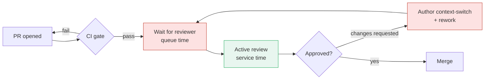

# Code Reviews — Optimize & Reconcile

> There is no CPU to profile in a code review. The thing you optimize is the *process*: the cycle time from "PR opened" to "PR merged," the reviewer-hours spent per defect caught, and the throughput of the team as a whole. Every scenario below is a tension between two real goods — review thoroughness and team velocity — resolved with measurement, not opinion. The recurring trap is treating "more review" as free; it is not. Review is a queue, reviewers are a shared resource, and a PR sitting unreviewed is inventory rotting on a shelf.

---

## Table of Contents

1. [Scenario 1 — Cycle time is the bottleneck, not review depth](#scenario-1--cycle-time-is-the-bottleneck-not-review-depth)
2. [Scenario 2 — The 800-line PR nobody can review](#scenario-2--the-800-line-pr-nobody-can-review)
3. [Scenario 3 — Stacked diffs vs one big branch](#scenario-3--stacked-diffs-vs-one-big-branch)
4. [Scenario 4 — Reviewers waste effort on what CI should catch](#scenario-4--reviewers-waste-effort-on-what-ci-should-catch)
5. [Scenario 5 — One person reviews everything (the bottleneck reviewer)](#scenario-5--one-person-reviews-everything-the-bottleneck-reviewer)
6. [Scenario 6 — Async ping-pong when a 15-minute call would end it](#scenario-6--async-ping-pong-when-a-15-minute-call-would-end-it)
7. [Scenario 7 — Trivial changes blocked behind full review (ship/show/ask)](#scenario-7--trivial-changes-blocked-behind-full-review-shipshowask)
8. [Scenario 8 — Reviewers re-derive the same context every time (checklists)](#scenario-8--reviewers-re-derive-the-same-context-every-time-checklists)
9. [Scenario 9 — Interrupt-driven review destroys maker time (batching)](#scenario-9--interrupt-driven-review-destroys-maker-time-batching)
10. [Scenario 10 — Optimizing the metric instead of the outcome (Goodhart)](#scenario-10--optimizing-the-metric-instead-of-the-outcome-goodhart)
11. [Scenario 11 — WIP cap to break the context-switch tax](#scenario-11--wip-cap-to-break-the-context-switch-tax)
12. [Scenario 12 — Auto-merge and the cost of the final manual click](#scenario-12--auto-merge-and-the-cost-of-the-final-manual-click)
13. [Scenario 13 — Reviewer count: does a third pair of eyes pay for itself?](#scenario-13--reviewer-count-does-a-third-pair-of-eyes-pay-for-itself)

- [Rules of Thumb](#rules-of-thumb)
- [Related Topics](#related-topics)

---

The PR lifecycle, viewed as a queue with a service stage and several wait stages:

The red boxes are where time dies. Active review (green) is the part everyone *thinks* about, but on most teams it is the smallest slice of total cycle time. Optimize the red boxes first.

---

### Scenario 1 — Cycle time is the bottleneck, not review depth

**Scenario.** A team is proud of thorough reviews: every PR gets 30–45 minutes of careful reading. Yet engineers complain they are "always blocked." Leadership asks reviewers to be *faster at reading*. Throughput does not improve.

Resolution

Measure where the time actually goes. Instrument the PR lifecycle with four timestamps: opened, first-review-started, last-approval, merged. On a representative sample (say 200 merged PRs over a month) you almost always find a distribution like this:

| Stage | Median duration | Share of cycle time |
|---|---|---|
| Open → first review starts (queue/wait) | 19 h | 76% |
| First review → last approval (active + rework rounds) | 5 h | 20% |
| Approval → merge | 1 h | 4% |

The active reading — the thing leadership tried to speed up — is 20% of cycle time at most, and the *reading itself* (the green box) is a fraction of that. The bottleneck is the **19-hour wait** for someone to start. Asking reviewers to read faster optimizes a stage that is not the constraint; by Amdahl's law the best possible win is bounded by 20%, and in practice it trades depth for nothing.

DORA research frames this as **lead time for changes** — one of the four key metrics. Elite teams ship change in under a day; low performers take weeks. The difference is rarely reading speed; it is queue time and rework loops.

The cost of a PR sitting is not zero while it waits. A PR open for 2 days vs 2 hours incurs: (a) the author has fully context-switched away and must reload the entire mental model to address feedback — empirical estimates put context reacquisition at 10–23 minutes of ramp plus degraded accuracy; (b) the branch drifts from `main`, raising merge-conflict probability roughly with the square of open duration on an active repo; (c) downstream PRs that depend on this one are themselves blocked, so the wait compounds across the team.

**Principled resolution:** attack queue time first. Set a team SLO — "first review within 4 business hours" — and make it visible (a bot that pings when a PR has waited > 4h with no reviewer activity). This single change typically cuts median cycle time more than any reading-speed intervention, because it shrinks the 76% slice. Only after queue time is under control does reading depth become worth tuning.

---

### Scenario 2 — The 800-line PR nobody can review

**Scenario.** A senior engineer opens an 800-line PR implementing a whole feature. It gets a quick "LGTM" in 20 minutes. Two weeks later a production incident traces to a logic bug squarely inside that diff. The reviewer is blamed for not catching it.

Resolution

The reviewer is not the problem; the PR size is. Defect-detection effectiveness collapses with diff size, and the data is consistent across studies:

- SmartBear's Cisco study (~2,500 reviews) found defect-detection density drops sharply once a review exceeds **200–400 LOC**, and recommended a hard ceiling around 400. Beyond that, reviewers skim.
- Reviewer effectiveness also falls off a cliff past **~60 minutes** of continuous review and past **~500 LOC/hour** of inspection rate. An 800-line PR can't be reviewed well in one sitting by construction.

So a "20-minute LGTM" on 800 lines is not thoroughness lost to laziness — it is the predictable failure mode of an oversized unit of work. The reviewer's attention was rationed across 800 lines; per-line scrutiny was ~1/4 of what a 200-line PR would have received.

**Principled resolution:** make small PRs the default, because small PRs are *faster to review and catch more bugs* — the two goals are aligned, not in tension. Concretely:

- Target **< 200–400 changed lines** per PR. A 200-line PR reviewed at a healthy 300 LOC/hour takes ~40 minutes with high detection; an 800-line PR takes 2.5+ hours done properly, which means it won't be done properly.
- Split by *intent*: one PR for the refactor that makes room for the feature, one for the feature, one for the tests/docs. Each is independently reviewable.
- Smaller PRs also have shorter queue time — a reviewer will grab a 150-line PR between meetings but defer an 800-line one to "when I have a block of time," which may be tomorrow. Small PRs win on both the red (queue) and green (review) boxes.

The objection "splitting takes author effort" is real but cheap relative to the alternative: the author spends 15 extra minutes structuring the split; the team avoids a multi-hour incident and a 3-round review. See [find-bug.md](find-bug.md) for what the missed-bug class looks like in practice.

---

### Scenario 3 — Stacked diffs vs one big branch

**Scenario.** A feature genuinely needs 1,200 lines: a schema migration, a repository layer, a service layer, and an API endpoint. The author wants reviewable units but the layers depend on each other, so they can't be four independent PRs against `main`.

Resolution

This is the case stacked diffs exist for. Instead of one 1,200-line PR (un-reviewable per Scenario 2) or four PRs that can't compile independently, build a *stack*: PR2 branches off PR1, PR3 off PR2, etc. Each PR is small and reviewable on its own diff; tooling (Graphite, `git machete`, Phabricator's arcanist, GitHub's draft-stack workflows) rebases the whole stack when a lower PR merges.

The throughput math:

| Approach | Reviewable units | Per-unit review time | Parallelism | Time-to-first-merge |
|---|---|---|---|---|
| One 1,200-line PR | 1 (poorly) | 3–4 h, low detection | none | only after the whole thing |
| Four-PR stack (4×300) | 4 (well) | ~40 min each | bottom merges while top is still in review | bottom layer ships in hours |

The stack lets the migration (PR1) merge as soon as it's approved, de-risking the riskiest part early, while the API layer (PR4) is still under review. Reviewers also review *deltas* — when PR1 changes, the reviewer of PR3 only re-reads PR3's diff, not the whole feature.

**Trade-off / cost:** stacks add mechanical overhead. Rebasing a stack after a mid-stack change requires tooling discipline; without it, manual rebasing is error-prone and can *cost* more than it saves. Don't adopt stacked diffs for two-PR features — the overhead isn't worth it under ~3 layers. The principled rule: **stack when the work is genuinely large and layered; otherwise just split into independent PRs (Scenario 2).** Reserve the heavy machinery for where it pays.

---

### Scenario 4 — Reviewers waste effort on what CI should catch

**Scenario.** Review comments are dominated by "missing semicolon style," "this isn't formatted," "you didn't add a test," "this import is unused." Reviewers spend 15 of their 30 review minutes on mechanical issues, and authors do 3 round-trips fixing them. Architectural concerns get squeezed out.

Resolution

Every comment a human writes that a machine could have written is pure waste — it consumes scarce reviewer attention, adds a round-trip (each round-trip re-incurs the author's context-switch cost), and crowds out the judgment-level review that only a human can do. The fix is to push every mechanical check left into CI so the reviewer *never sees* a PR with those problems.

Concrete automation tiers and the time they reclaim:

| Check | Tool examples | What it eliminates | Reviewer time saved/PR |
|---|---|---|---|
| Formatting | Prettier, gofmt, Black, clang-format | All style/whitespace debate (and Scenario-style bikeshedding) | 3–5 min |
| Linting | ESLint, golangci-lint, Ruff, RuboCop | Unused vars, shadowing, dead code, anti-patterns | 3–5 min |
| Tests + coverage gate | CI test run, coverage threshold | "Did you test this?" round-trips | 2–4 min + 1 round |
| Static analysis / type check | mypy, TypeScript strict, SpotBugs, staticcheck | Null derefs, type errors, obvious logic faults | 3–6 min |
| Security scanning | Semgrep, CodeQL, Snyk, gitleaks | Injection patterns, leaked secrets, vulnerable deps | catches what humans miss entirely |

A PR that arrives *green* — formatted, linted, tested, type-checked, scanned — lets the reviewer spend 100% of their 30 minutes on the things machines cannot judge: is this the right abstraction, does the API make sense, is the error handling correct, will this scale. That is a strict Pareto improvement: faster reviews *and* better reviews.

**The principle:** a human should never be the linter. If a comment can be expressed as a rule, encode it as a rule. The corollary is that bikeshedding on style is not a discipline problem to nag about — it is an *unconfigured formatter*. Install the formatter, run it in CI, and the debate is structurally impossible. Make the check **blocking** (required status), not advisory; an advisory check that people ignore reclaims nothing.

**Cost to weigh:** CI minutes and pipeline latency. If the full suite takes 25 minutes, authors wait on it — so split into a fast required gate (lint/format/unit, < 3 min) that blocks merge and a slower suite (integration/e2e) that runs in parallel. The goal is to keep the *fast feedback* under a few minutes so it doesn't reintroduce queue time.

---

### Scenario 5 — One person reviews everything (the bottleneck reviewer)

**Scenario.** The team's most senior engineer is requested on 70% of PRs. Their review queue is always 6–8 deep; their own feature work stalls; everyone else's PRs wait on them. Cycle time is dominated by "waiting for Dana."

Resolution

A shared resource at high utilization has explosive wait times — this is queueing theory, not a personality issue. By the M/M/1 approximation, expected wait grows as ρ/(1−ρ) where ρ is utilization. At 50% utilization a reviewer's queue wait is ~1× their service time; at 80% it's 4×; at 90% it's 9×. Dana isn't slow — Dana is *saturated*, and saturation makes wait time blow up nonlinearly. Routing more PRs to the best reviewer makes the team slower, not safer.

**Principled resolution: spread the load and lower ρ for any single reviewer.**

- **CODEOWNERS** to *scope* rather than *centralize*: map directories to teams, not to one person, so GitHub auto-requests from a pool. `/payments/ @team-payments` instead of `@dana`.
- **Round-robin / load-aware auto-assignment** within the pool (GitHub's `load_balance` strategy, or a bot that picks the least-loaded eligible reviewer). This pushes per-reviewer ρ down toward 50%, where waits are short.
- **Deliberately grow the bus factor.** If only Dana *can* review payments, the org has a knowledge-concentration risk, not just a throughput one. Pair a second reviewer with Dana on payments PRs for a few weeks; now the pool has two, ρ halves, and the bus factor doubles. The short-term cost (two reviewers on some PRs) buys long-term throughput and resilience.

Measure per-reviewer review load (PRs/week, queue depth) and rebalance when any one person exceeds ~1.5× the team median. The objective is not equal load for fairness's sake — it is keeping every reviewer's utilization in the regime where queues stay short.

---

### Scenario 6 — Async ping-pong when a 15-minute call would end it

**Scenario.** A PR is on its sixth review round. The reviewer doesn't understand why the author chose an approach; the author doesn't understand the reviewer's objection. Each round takes ~half a day (comment → context-switch → reply → wait). The PR has been open 4 days over a disagreement that is fundamentally about design intent.

Resolution

Async review is the right default — it respects maker time, creates a written record, and lets reviewers work in their own rhythm. But async has a *latency floor per round*: comment, the author switches context away and back, replies, the reviewer does the same. Even with prompt responses, each round is easily a half-day of wall-clock time. Six rounds = 3 days, most of it wait, plus 12 context-switches split between two people.

When the disagreement is about **shared mental model** — "why this approach," "what are we even trying to do," a design fork — async is the wrong tool. Text serializes a conversation that wants to be interactive. A 15-minute synchronous call (or pairing session) collapses six half-day rounds into a quarter-hour, *then* the agreed decision is written back into the PR thread for the record.

**Decision rule — switch to sync when:**

- The thread has exceeded **2–3 rounds** on the *same* point (not progressing).
- The disagreement is about *design/intent*, not a concrete defect (defects resolve cleanly in async: "this is null here," "fixed").
- Either party writes "I don't understand why…" — a direct signal that the model isn't shared.

**Keep it async when:** the comments are independent and concrete (a list of fixable items), the participants are in different timezones (a call would itself incur a day of scheduling latency), or a written record of the reasoning is valuable for future readers.

**The reconciliation:** async-first, sync-on-stall. Set an explicit team norm — "third round on one thread ⇒ hop on a call" — so escalating to sync is a normal, blame-free move, not an admission of failure. The written record still wins: after the call, the *outcome* and *why* go back into the PR so the next engineer who reads it isn't lost. Review ping-pong is a process smell; treat repeated rounds as the trigger, not as something to endure.

---

### Scenario 7 — Trivial changes blocked behind full review (ship/show/ask)

**Scenario.** A one-character typo fix in a log message, a version bump in a config, a comment correction — each waits the full queue time for a reviewer who reads it for 20 seconds and approves. The team mandates "every change reviewed." Trivial changes accumulate the same 19-hour queue tax (Scenario 1) as risky ones.

Resolution

Mandatory review on *every* change applies a fixed cost — the queue wait plus a reviewer interruption — regardless of risk. For a typo fix, that cost vastly exceeds the expected value of the review. You are paying full insurance premiums on something that cannot crash.

Adopt **ship / show / ask** (Rouan Wilsenach's model) to match ceremony to risk:

| Mode | What it means | Use when | Review timing |
|---|---|---|---|
| **Ship** | Merge directly to `main`, no PR | Trivial, low-risk: typos, comments, doc tweaks, copy changes, dependency patch bumps behind a lockfile + green CI | None (CI still gates) |
| **Show** | Open a PR and merge immediately; review happens *after* merge | Self-evidently correct changes you still want eyes on for awareness/learning | Async, post-merge |
| **Ask** | Open a PR and *wait* for approval before merge | Anything with real risk: logic, schema, public API, security, anything you're unsure about | Pre-merge (the normal flow) |

The key insight is that **show** decouples the safety net from the critical path: the change ships at CI speed, and review still happens — just not as a *blocker*. For a healthy team with strong CI (Scenario 4) and trunk-based habits, a large fraction of changes are legitimately ship/show, and only the genuinely risky minority needs blocking review.

**Guardrails (so this isn't a loophole):**
- CI is non-negotiable on *all* modes — ship still means green pipeline.
- The choice of mode is the author's judgment but is *visible* and auditable; abuse (shipping risky changes) is a trust issue surfaced in retro, not prevented by process.
- Revert must be trivial and fast — ship/show only works on a trunk where rolling back is a one-click, low-drama operation.

This isn't "less review" — it's **review proportional to risk**, which frees reviewer attention for the PRs where it actually changes outcomes. See [professional.md](professional.md) for the trust and judgment dimension that makes ship/show viable.

---

### Scenario 8 — Reviewers re-derive the same context every time (checklists)

**Scenario.** Different reviewers catch different things; the same classes of issue (missing error handling, no test for the failure path, an unindexed query, a logged secret) slip through depending on *who* reviewed. Review quality is inconsistent and reviewers report feeling like they're "holding a dozen things in my head at once."

Resolution

Inconsistent reviews are a symptom of unmanaged cognitive load. A reviewer is simultaneously trying to understand the change *and* remember every category of thing to check. Working memory holds ~4 chunks; the checklist of "things that bite us" is far longer than that, so items fall out — and *which* items fall out varies by reviewer, producing the inconsistency.

A **short, team-specific review checklist** offloads the "what to look for" into an external list so the reviewer's working memory is freed for the actual judgment. The aviation/surgery evidence (Gawande's *Checklist Manifesto*: surgical checklists cut complications ~35% and deaths ~47% in the WHO study) generalizes: checklists make experts more consistent, not less expert.

A good review checklist is **short (5–9 items), specific to this codebase's real failure modes, and about judgment-level concerns** (because mechanical concerns are already in CI — Scenario 4):

- Does the error/failure path have a test, not just the happy path?
- Any new DB query — is it indexed? N+1?
- Any secret, token, or PII in logs or responses?
- Are public API / schema changes backward compatible?
- Does this need a feature flag or migration ordering?
- Is the blast radius of a rollback understood?

**Avoid the failure modes:**
- A checklist that duplicates the linter is dead weight — delete those items, let CI own them.
- A 40-item checklist is worse than none: it becomes a ritual people skip or rubber-stamp (which loops back to the LGTM problem in [find-bug.md](find-bug.md)). Keep it scannable in under a minute.
- Tailor it. A generic internet checklist won't reflect *your* incidents. Seed it from your own post-mortems — every recurring incident class earns one line.

The payoff is consistency (any reviewer catches the same categories) and *lower* per-review cognitive cost, which also makes reviews faster. Thoroughness and speed align again.

---

### Scenario 9 — Interrupt-driven review destroys maker time (batching)

**Scenario.** A reviewer wants to be responsive, so they review PRs the instant a notification arrives — mid-function, mid-debugging. They feel helpful. Their own deep work crawls; they ship half as much as before; and rushed reviews (done while mentally still in their own task) miss things.

Resolution

This is the maker-vs-manager schedule tension (Paul Graham). Reviewing is *manager-schedule* work — short, interruptible. Building is *maker-schedule* — it needs uninterrupted blocks, and a single interruption costs far more than its clock time: studies (Mark et al.) put full recovery from an interruption at ~23 minutes on average. A reviewer who handles each PR as it arrives might do 6 reviews/day at ~5 minutes of reading each (30 min) but pay ~6 × 23 = 138 minutes of context-switch tax on their own work. The review *reading* was cheap; the *interruption* was the expense.

**Principled resolution: batch review into dedicated windows.** Two or three fixed slots a day — e.g., start of day, after lunch, end of day — where the reviewer drains the queue in one manager-mode block. Outside those windows, notifications wait. Now the same 6 reviews cost ~30 min of reading + at most 2–3 context-switches instead of 6.

The objection is **latency**: doesn't batching make authors wait? Tune the batch frequency to the team's cycle-time SLO (Scenario 1). With three review windows spread across the day, the *worst-case* wait for a review is ~one-third of a workday (~2.5 h), comfortably inside a "review within 4 hours" SLO. Batching does not mean *slow* — it means *bounded latency for sharply lower interruption cost*. A team of several batching reviewers also has near-continuous coverage in aggregate, because their windows don't all align.

**When to break the batch:** a genuinely blocking PR (someone is fully stalled on it, or it's a production hotfix) is an explicit, rare interrupt — signaled directly ("can you look now, I'm blocked"), not the default for every PR. The norm is batched; the exception is named.

---

### Scenario 10 — Optimizing the metric instead of the outcome (Goodhart)

**Scenario.** Management starts tracking review metrics to "improve quality": comments per PR, review turnaround time, percent of PRs approved within 4 hours. Within a quarter the numbers all look great — and quality is visibly worse.

Resolution

This is **Goodhart's Law**: *when a measure becomes a target, it ceases to be a good measure.* Each well-intentioned metric has a degenerate strategy that optimizes the number while destroying the goal:

| Metric targeted | Degenerate behavior it induces | What's actually lost |
|---|---|---|
| Comments per PR | Reviewers leave trivial nitpicks to hit a count | Bikeshedding rises; signal drowns in noise |
| Turnaround time | Rubber-stamp LGTMs to clear the clock | Defect detection collapses (the Scenario 2 failure, now incentivized) |
| % approved within 4h | Authors pre-arrange friendly reviewers; reviewers skim | Review becomes theater |
| Lines reviewed/hour | Reviewers skim faster | The 500-LOC/hour effectiveness ceiling is blown past deliberately |

The pattern: any *individual-level review activity metric used as a target* gets gamed, because the human optimizing it is smarter than the metric.

**Principled resolution:**

1. **Measure outcomes, not activity.** The thing you care about is delivered quality and flow, so track the DORA four — lead time, deployment frequency, change-failure rate, MTTR — and *escaped-defect rate* (bugs found in production that a review could have caught). These are hard to game without actually improving, because gaming them requires shipping good software.
2. **Use process metrics (cycle time, queue time, PR size) as *diagnostics for the team*, never as *individual targets or performance scores.*** "Our median queue time is 19h, let's fix it" is healthy (Scenario 1). "Bob's turnaround is below team average, that's a ding" is Goodhart bait — it will produce a fast, useless reviewer.
3. **Keep humans in the loop on interpretation.** Metrics flag where to *look*; they don't decide. A spike in review rounds might mean a hard problem, not a bad author.

The meta-rule for this whole document: you optimize the *system*, not the *people*. Cycle time, PR size, automation coverage, reviewer utilization — these are levers on the system. Turn them. Don't turn individuals into metric-chasers.

---

### Scenario 11 — WIP cap to break the context-switch tax

**Scenario.** An engineer has four PRs open at once: one in review, one with changes requested, one they're actively coding, one waiting on CI. They're constantly switching among them, each switch reloading context. Velocity *feels* high (four things in flight!) but throughput — PRs actually merged per week — is low.

Resolution

High WIP (work-in-progress) is the enemy of throughput, by **Little's Law**: average cycle time = WIP / throughput. Hold throughput roughly fixed (reviewer capacity is the real constraint) and *increasing WIP just inflates cycle time linearly* — more things sit in flight, each waiting longer. The "four PRs in flight" feeling is the illusion; the merged-per-week number is the truth, and it's flat or down because each context switch costs ~23 minutes (Scenario 9) and four parallel branches multiply merge-conflict surface.

**Principled resolution: cap WIP per person.** A practical rule is **finish before you start** — drive an open PR to merged (or address its review feedback) *before* opening the next. Concretely, a personal WIP limit of ~2 (one in review, one being worked) is plenty for most engineers.

Why this is faster, not slower:
- Lower WIP ⇒ lower cycle time (Little's Law), so each PR clears quickly and *stops* consuming the author's attention.
- Addressing review feedback *while the PR is still fresh in your head* avoids the full context-reload — directly cutting the rework cost from Scenario 1.
- It pulls the team toward draining queues rather than filling them, which keeps reviewer utilization (Scenario 5) and queue time (Scenario 1) under control.

The cultural shift is valuing **flow over busyness**. An engineer with one PR moving fast through the pipeline delivers more than one juggling four stalled ones. WIP limits make that visible and enforce it gently.

---

### Scenario 12 — Auto-merge and the cost of the final manual click

**Scenario.** A PR is approved at 5pm. CI is still running (a 20-minute suite). The author has gone home. The PR merges the next morning when they return and click the button — adding ~15 hours of pure dead time at the very end of the lifecycle (the "approval → merge" slice from Scenario 1).

Resolution

The approval→merge gap is often invisible because it feels like "the work is done." But cycle time runs until merge, and an approved-but-unmerged PR is still blocking dependents and still drifting from `main`. A manual final click ties merge to *human availability*, which is exactly the wait you're trying to eliminate.

**Principled resolution: auto-merge on green.** GitHub/GitLab auto-merge lets the author enable merge *at approval time*; the platform merges automatically the instant the last required check passes — even at 2am, even after the author logs off. This removes the human from the tail of the pipeline entirely.

Throughput effect: it eliminates the entire "approval → merge" wait (the 4% slice in Scenario 1's table — small per PR, but it's pure waste and it compounds across stacked/dependent PRs). Combined with required-status gates (Scenario 4), it's safe: nothing merges without CI green and approval.

**Guardrails:**
- Only with **required status checks** configured — auto-merge without a CI gate is how broken code reaches `main` unattended.
- Pair with **auto-rebase / merge queue** (e.g., GitHub merge queue, Bors) on busy repos so that "green against an old base" can't merge a logically-broken combination — the merge queue re-tests against the actual merge result. This is the one real risk: two individually-green PRs that conflict semantically. The merge queue closes it.
- Keep a fast required suite (Scenario 4) so auto-merge fires in minutes, not hours.

The principle: a human's job ends at *judgment* (approve/request-changes). The mechanical act of merging on green is the platform's job — never make a person be the cron.

---

### Scenario 13 — Reviewer count: does a third pair of eyes pay for itself?

**Scenario.** A team debates a policy: should PRs require *two* approvals instead of one? The intuition is "more eyes = fewer bugs." But two required approvals doubles the reviewer demand and adds a second queue wait.

Resolution

The value of additional reviewers shows **steeply diminishing returns**, while the cost (reviewer-hours, queue time) is roughly linear in the number required. The inspection literature (Fagan inspections; later studies by Porter/Votta and others) consistently finds:

- The **first reviewer** catches the large majority of defects a review will ever catch.
- A **second reviewer** adds a meaningful but much smaller increment (often catching a different *class* of issue — e.g., the first sees logic, the second sees the missing security check).
- A **third and beyond** add little unique detection and exhibit **social loafing**: each reviewer assumes the others will catch things, so everyone reviews less carefully — the diffusion-of-responsibility effect that turns "three reviewers" into "three half-reviews."

Meanwhile, requiring two approvals roughly *doubles* reviewer demand (raising every reviewer's utilization ρ — Scenario 5) and adds a second serial queue wait (Scenario 1), so cycle time goes up materially for a modest detection gain.

**Principled resolution: match reviewer count to risk, not a blanket policy.**

| Change risk | Required approvals | Rationale |
|---|---|---|
| Routine app code | 1 | First reviewer captures most defects; second is mostly cost |
| Security-sensitive, schema, public API, infra | 2 (incl. a domain owner via CODEOWNERS) | The second *class* of eyes (security/domain) catches what the first structurally can't |
| Trivial (typo/comment/doc) | 0–1 (ship/show, Scenario 7) | Review value below its cost |

So the answer to "should we require two?" is *not globally* — require it precisely where the second reviewer brings a distinct, valuable lens (use [CODEOWNERS to encode "who is the second lens"](#scenario-5--one-person-reviews-everything-the-bottleneck-reviewer)), and require one (or zero) everywhere else. Buying detection you don't need with throughput you do is a bad trade. Quality comes from the *first careful* review plus strong CI (Scenario 4) plus risk-targeted second eyes — not from piling on reviewers.

---

## Rules of Thumb

- **Optimize the wait, not the read.** Queue time (PR opened → review started) usually dwarfs active review time. Set a "first review within 4h" SLO before tuning anything else. (Scenario 1)
- **Small PRs are faster *and* catch more bugs.** Target < 200–400 changed lines; detection density falls off a cliff beyond that and past ~60 min / ~500 LOC of review. (Scenario 2)
- **Stack diffs only for genuinely large, layered work (3+ layers).** Below that, just split into independent PRs — the stacking overhead isn't worth it. (Scenario 3)
- **A human should never be the linter.** Push format/lint/tests/coverage/type-check/security scans into a *blocking, fast* CI gate so reviewers spend 100% of attention on judgment. (Scenario 4)
- **Spread reviewer load to keep utilization under ~50–80%.** Wait time explodes nonlinearly with ρ; use CODEOWNERS pools + round-robin, and grow the bus factor deliberately. (Scenario 5)
- **Async-first, sync-on-stall.** Hop on a 15-minute call by the 2nd–3rd round on the *same* design point; write the outcome back into the thread. (Scenario 6)
- **Match ceremony to risk: ship / show / ask.** Trivial changes don't earn a blocking review; route reviewer attention to the risky minority. CI gates everything regardless. (Scenario 7)
- **Use a short (5–9 item), codebase-specific checklist** seeded from your own post-mortems, covering only judgment-level concerns CI can't. (Scenario 8)
- **Batch reviews into 2–3 daily windows.** The review reading is cheap; the interruption (~23 min recovery) is the cost. Bound latency to your SLO; break the batch only for explicitly-named blockers. (Scenario 9)
- **Measure outcomes (DORA, escaped-defect rate), never individual review-activity targets.** Any activity metric used as a target gets gamed — Goodhart. Process metrics are team diagnostics, not personal scores. (Scenario 10)
- **Cap WIP (~2/person), finish before you start.** Little's Law: high WIP just inflates cycle time. Address feedback while context is fresh. (Scenario 11)
- **Auto-merge on green; never make a human be the cron.** Requires status-check gates; pair with a merge queue on busy repos. (Scenario 12)
- **One careful review + strong CI catches most defects.** Require a second approval only where it adds a distinct lens (security/domain); a third invites social loafing. (Scenario 13)
- **Optimize the system, not the people.** Every lever here — cycle time, PR size, automation, utilization, WIP — acts on the process. Turning people into metric-chasers backfires.

---

## Related Topics

- [find-bug.md](find-bug.md) — the missed-defect failure mode that oversized PRs and rubber-stamp LGTMs produce.
- [professional.md](professional.md) — the trust, tone, and judgment that make ship/show and async-first viable.
- [Chapter README](../README.md) — the positive rules of code review this file optimizes the *process* around.
- [Clean Commits & Version Control](../25-clean-commits-and-version-control/README.md) — small, focused commits are the substrate that makes small, fast-to-review PRs possible.
- [Refactoring](../../refactoring/README.md) — splitting a feature into reviewable units (Scenarios 2–3) is itself a refactoring discipline; the "refactor PR separate from the feature PR" split lives here.
