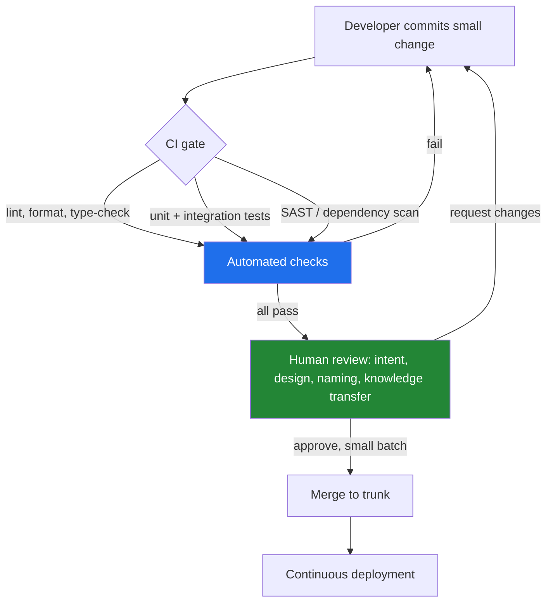

# Code Reviews — Professional Level

> Focus: the evidence. What the empirical literature actually says code review finds, where its ROI is real and where it is folklore, the alternatives (pair/mob programming, trunk-based CI), the sociotechnical failure modes (bias, gatekeeping, power), and the current frontier — reviewing AI-generated code and review at the high-assurance edge.

---

## Table of Contents

1. [The empirical history: Fagan inspections](#the-empirical-history-fagan-inspections)
2. [The SmartBear/Cisco study: the numbers that anchor practice](#the-smartbearcisco-study-the-numbers-that-anchor-practice)
3. ["Modern Code Review": what reviews actually find](#modern-code-review-what-reviews-actually-find)
4. [Where review ROI is real — and where it is folklore](#where-review-roi-is-real--and-where-it-is-folklore)
5. [Pair and mob programming: is review even worth it?](#pair-and-mob-programming-is-review-even-worth-it)
6. [Trunk-based development and CI vs heavy review gates](#trunk-based-development-and-ci-vs-heavy-review-gates)
7. [Pre-commit vs post-commit; ship/show/ask](#pre-commit-vs-post-commit-shipshowask)
8. [The sociotechnical dimension: bias, power, gatekeeping](#the-sociotechnical-dimension-bias-power-gatekeeping)
9. [Reviewing AI-generated code: the current frontier](#reviewing-ai-generated-code-the-current-frontier)
10. [When NOT to review](#when-not-to-review)
11. [Review and formal verification at the high-assurance end](#review-and-formal-verification-at-the-high-assurance-end)
12. [Common Mistakes](#common-mistakes)
13. [Test Yourself](#test-yourself)
14. [Cheat Sheet](#cheat-sheet)
15. [Summary](#summary)
16. [Further Reading](#further-reading)
17. [Related Topics](#related-topics)

---

## The empirical history: Fagan inspections

Modern code review descends from **software inspection**, formalized by Michael Fagan at IBM in 1976 ("Design and Code Inspections to Reduce Errors in Program Development," *IBM Systems Journal* 15(3)). Fagan inspections were heavyweight by today's standards: a defined process with distinct roles (author, reader, tester, moderator), an overview meeting, individual preparation, a logging meeting, rework, and follow-up. Crucially, the inspection meeting's job was to *find* defects, never to *fix* them.

The data was striking for its era. Fagan reported inspections finding **60–90% of defects**, and finding them far earlier than testing — where the cost of a fixed defect grows by roughly an order of magnitude per phase it survives (the "1-10-100" rule, later sharpened by Boehm in *Software Engineering Economics*, 1981).

Subsequent inspection research refined the mechanics:

- **Optimal reading rate.** Inspections degrade sharply when reviewers go fast. The classic guidance (Gilb & Graham, *Software Inspection*, 1993) is roughly **150–200 lines of code per hour**; beyond ~500 LOC/hour, defect-detection effectiveness collapses.
- **Diminishing returns on reviewers.** Porter, Siy, Mockus & Votta ("Understanding the Sources of Variation in Software Inspections," *ACM TOSEM* 1998) found that adding reviewers past **two** yields little additional defect detection but multiplies cost. Two well-prepared reviewers find most of what four will.
- **Meetings add little.** Votta ("Does Every Inspection Need a Meeting?," *ACM SIGSOFT* 1993) showed that synchronous inspection meetings contributed only ~4% of defects over what reviewers found in individual preparation — the prelude to today's asynchronous, tool-mediated review.

These findings still govern modern practice, even when teams have never heard of Fagan. The asynchronous diff review on a pull request is the lineage of Votta's "drop the meeting" result; the "request at most two reviewers" default in tools like Gerrit is Porter et al.'s diminishing-returns curve encoded as policy.

---

## The SmartBear/Cisco study: the numbers that anchor practice

The single most-cited modern dataset is the **Cisco/SmartBear study** (2006, summarized in SmartBear's *Best Kept Secrets of Peer Code Review*). Over ~10 months, the team observed roughly **2,500 reviews of 3.2 million lines** of code at Cisco using the CodeCollaborator tool. Three results became industry rules of thumb:

1. **Defect density vs. review size (LOC).** Defect-detection effectiveness drops sharply once a review exceeds **~200–400 lines of code**. Beyond ~400 LOC the reviewer's ability to find defects falls off a cliff. This is the empirical basis for the "keep PRs small" mantra — and it is *real evidence*, not aesthetic preference.

2. **Defect density vs. inspection rate.** When reviewers exceed roughly **500 LOC/hour**, defect density found drops precipitously. The two findings combine into a single operating limit: **review ≤ ~400 LOC, take ≥ ~60 minutes, and stop after ~60–90 minutes** because attention degrades.

3. **The author-preparation effect.** Reviews where the author had **annotated** their own change before the review ("author preparation") found *dramatically fewer* defects than unannotated ones. The interpretation is debated: either the annotation pass made authors find and fix their own defects first (a genuine win), or self-explanation primed reviewers to rubber-stamp (a bias risk). Either way it confirms that **self-review before requesting review is high-leverage**.

> **Caveat for the specialist.** The Cisco study is observational, single-company, on one toolchain, in 2006-era C/C++/Java. The LOC thresholds are robust because they recur across studies, but treat the exact numbers as order-of-magnitude guidance, not constants of nature. The mechanism — human attention is the bottleneck, not the tool — is what generalizes.

---

## "Modern Code Review": what reviews actually find

The most important shift in our understanding came from **Bacchelli & Bird, "Expectations, Outcomes, and Challenges of Modern Code Review"** (*ICSE 2013*), a mixed-methods study at Microsoft (surveys, interviews, and analysis of CodeFlow review data across thousands of reviews). They asked: when developers say they review for "finding defects," does the data agree?

It does not. The headline finding: **defect-finding is a minority of review's realized value.** When they classified what reviewers actually wrote in comments, the largest categories were:

- **Code improvements / better solutions** — suggesting cleaner or more idiomatic alternatives.
- **Knowledge transfer** — reviewers learning the codebase; authors learning team conventions.
- **Team awareness and transparency** — multiple people now know a change happened.
- Only then: **defect finding** — and the defects found were predominantly *low-level* (naming, edge cases, off-by-one), **not** deep logic or architectural flaws.

This was corroborated and extended by:

- **Rigby & Bird, "Convergent Contemporary Software Peer Review Practices"** (*FSE 2013*), which compared Microsoft, Google, AMD, and several OSS projects (Linux, Apache, KDE) and found practices *converging* independently on the same pattern: small, frequent, asynchronous, lightweight reviews — not heavyweight Fagan inspections.
- Google's account in **"Software Engineering at Google"** (Winters, Manshreck, Wright, 2020), where the *primary* stated purpose of mandatory review is **code health and readability over time**, with defect-catching explicitly framed as secondary. Google's median change is small and the median review latency is hours, not days.
- **Sadowski et al., "Modern Code Review: A Case Study at Google"** (*ICSE-SEIP 2018*): most changes have **one reviewer**, most reviews are small, and the dominant motivation reported by engineers is **education and maintaining norms** — again, not bug-catching.

> **The reframe for a senior engineer.** If you justify review purely as a defect filter, the data will eventually be used against you ("our reviews catch few bugs, so let's drop them"). The defensible justification is that review is primarily a **knowledge-distribution and norm-maintenance mechanism** that *also* catches a class of cheap-to-fix defects early. Optimize the process for *that*, and the bug-catching comes along for free.

---

## Where review ROI is real — and where it is folklore

Putting the evidence together yields a fairly sharp ROI map.

| Outcome | Evidence strength | Notes |
|---|---|---|
| Catches cheap, local defects early | Strong (Fagan, Cisco, Bacchelli) | Off-by-one, null handling, missed edge cases — *if* PR is small |
| Catches deep logic / architecture flaws | Weak | Reviewers rarely have the context to find these in a diff |
| Knowledge transfer / bus-factor reduction | Strong (Bacchelli, Rigby) | Often the dominant realized value |
| Maintains code health & conventions over time | Strong (Google) | The long-horizon payoff; compounds |
| Lowers post-release defect rate | Mixed | McIntosh et al. (below) find *coverage and participation* matter, mere existence does not |
| Improves security | Mixed/weak | Reviewers miss most injected vulnerabilities unless specifically hunting (Edmundson et al., *ESSoS 2013*) |

**McIntosh, Kamei, Adams & Hassan, "The Impact of Code Review Coverage and Code Review Participation on Software Quality"** (*MSR 2014*) studied Qt, VTK, and ITK. Their key result: it is not whether a review *happened* that predicts post-release defects, but **review coverage** (the fraction of a component's changes that were reviewed) **and participation** (reviewers who actually engaged, vs. drive-by LGTMs). A component touched by many lightly-reviewed or unreviewed changes accrues defects. This is the empirical death of the **rubber-stamp**: an LGTM with no engagement provides nominal coverage but near-zero quality signal.

**Folklore to retire:**

- *"Review catches most bugs."* It catches *cheap* bugs early; tests and production catch the expensive ones. Treat review and automated testing as complementary, not redundant.
- *"More reviewers = better."* Porter et al. and Sadowski et al. both say two (often one) is the sweet spot.
- *"A long, thorough review is a good review."* Past ~60–90 minutes / ~400 LOC, you are accumulating fatigue, not findings.

---

## Pair and mob programming: is review even worth it?

The provocative question — *if you pair, do you even need review?* — has real evidence behind it.

**Pair programming** is continuous, synchronous review: the navigator reviews as the driver writes. Williams & Kessler's experiments (*Pair Programming Illuminated*, 2002; the original Nosek 1998 and Williams 2000 studies) reported pairs producing code with **~15% fewer defects** at a cost of roughly **15% more total effort** (not 100% — the pair is faster than two solo developers would be at the same task, just not 2×). The defect reduction is front-loaded: bugs never enter the codebase rather than being caught later.

The trade-off versus asynchronous review:

| Dimension | Pair programming | Async review |
|---|---|---|
| Latency to feedback | Immediate | Hours to days |
| Knowledge transfer | Deep, real-time | Shallower, after-the-fact |
| Cost | High (two people, full-time) | Low (reviewer time-sliced) |
| Catches design issues | Yes (during design) | Rarely (design already done) |
| Independent fresh eyes | No (navigator shares author's blind spots) | Yes |
| Async/distributed teams | Hard | Native |

The honest synthesis (and the position taken in *Software Engineering at Google* and by Martin Fowler in "On Pair Programming," 2020): pairing and review **solve overlapping but non-identical problems**. Pairing gives design-time correction and deep knowledge transfer but loses the *independent fresh reviewer* — the navigator inherits the driver's framing. Many high-functioning teams pair on hard/novel work and use lightweight async review for routine changes; some teams that pair heavily make review optional (XP's original stance) precisely because pairing already supplies continuous review.

**Mob programming** (Marquet/Zuill, *Mob Programming*; popularized at Hunter Industries) extends this to the whole team on one screen. It maximizes shared context and effectively eliminates separate review and most knowledge silos, at the cost of throughput parallelism. It shines for the hardest, highest-stakes, or most onboarding-heavy work — not for clearing a backlog of independent tickets.

---

## Trunk-based development and CI vs heavy review gates

The **DORA / "Accelerate" research** (Forsgren, Humble, Kim, *Accelerate*, 2018; backed by the State of DevOps reports) is the largest dataset bearing on this. Two findings collide with heavyweight review:

1. **Trunk-based development** — short-lived branches merged to trunk at least daily, fewer than ~3 active branches — **predicts higher software delivery performance**. Long-lived feature branches with heavyweight review gates correlate with *lower* performance.
2. DORA explicitly found that **a heavyweight change-approval process (e.g., an external review/change-advisory board) correlated with *worse* stability and speed**, not better. Lightweight, peer-based, in-team review did *not* hurt and is compatible with elite performance.

The reconciliation: the constraint is **batch size and latency**, not review per se. Trunk-based development is not "no review" — it is *small, fast review*, often combined with strong CI (automated tests, static analysis, formatters, security scanners as gates). The automation absorbs the mechanical checks (style, lint, coverage, obvious bugs), freeing human review for the things humans are uniquely good at: intent, design fit, naming, and knowledge transfer. **A formatter and a linter make bikeshedding a configuration question, not a review conversation** — which is the single highest-leverage way to reduce review friction.

> The automation layer (blue) handles what tools do better than people. Human review (green) is reserved for judgment. Heavy review gates fail when they force humans to do the blue layer's job by hand.

---

## Pre-commit vs post-commit; ship/show/ask

**Pre-commit review** (the dominant model: Gerrit, GitHub/GitLab pull requests, Phabricator/Differential at Meta, CodeFlow/Critique at Google, Crucible) blocks code from reaching the mainline until approved. **Post-commit review** (historically common in parts of the Linux kernel, FreeBSD, Apache lazy-consensus) lets the change land and reviews it after, often with a revert as the escape hatch.

| | Pre-commit | Post-commit |
|---|---|---|
| Mainline always reviewed | Yes | No (review trails the commit) |
| Velocity | Lower per-change | Higher; unblocks the author |
| Risk surface | Lower | Higher; bad code is live until caught |
| Best fit | Most product teams, regulated code | High-trust, high-expertise, low-coupling OSS |
| Tooling | Gerrit, GH/GL PRs, Phabricator | Mailing-list patches, "commit then review" (CTR) |

The Apache Software Foundation formalizes the choice as **CTR (Commit-Then-Review)** vs **RTC (Review-Then-Commit)** — chosen per project based on trust and stability needs.

**Martin Fowler & Rouan Wilsenach's "Ship / Show / Ask"** (2021) is the pragmatic decision framework that dissolves the binary:

- **Ship** — merge directly, no review (trivial, low-risk: typos, dependency bumps, well-trodden changes). Trunk-based, post-commit-friendly.
- **Show** — open a PR and merge immediately, but *show* the change to the team for asynchronous, non-blocking feedback. You get awareness and possible improvement without latency.
- **Ask** — open a PR and *wait* for approval before merging (genuinely uncertain, high-risk, or you want a design check).

The skill is **routing each change to the right mode**. Forcing every change through "Ask" is the source of review ping-pong and velocity collapse; allowing everything to "Ship" forfeits the knowledge-transfer value. Mature teams make the mode an explicit, fast judgment.

---

## The sociotechnical dimension: bias, power, gatekeeping

Code review is a **social** process executed by humans with status, history, and bias. Ignoring this is how technically-sound review processes produce toxic teams.

**Bias — empirical findings:**

- **Gender bias.** Terrell et al., "Gender differences and bias in open source: pull request acceptance of women versus men" (*PeerJ CS 2017*), analyzed millions of GitHub pull requests. Women's PRs were accepted at a *higher* rate than men's *when gender was not identifiable* — but *lower* when the contributor's gender was apparent and they were an outsider to the project. The effect is interaction-driven: bias surfaces against perceptible-outsider women specifically.
- **Newcomer bias.** Multiple studies find newcomers face slower, harsher, more-likely-rejected reviews — a self-reinforcing barrier that shrinks the contributor pool. Bosu et al., "Process aspects and social dynamics of contemporary code review" (*IEEE TSE 2017*), found that **author reputation measurably affects review outcomes and reviewer attention**, independent of patch quality.
- **Tone and "contempt culture."** Reviews that critique the *person* ("why would you do this?") rather than the *code* ("this branch can NPE if `x` is null") demonstrably reduce psychological safety and contributor retention. Google's own engineering practices documentation devotes an entire guide ("How to Write Code Review Comments") to keeping critique objective, courteous, and grounded in principles rather than preference.

**Power and gatekeeping:**

Review is where organizational power becomes concrete. A reviewer can *block* — and blocking on **subjective preference** ("I would write it differently") converts review from a quality mechanism into a dominance ritual. Antidotes that the literature and practitioner consensus support:

- **Distinguish blocking from non-blocking comments.** Conventions like `nit:` prefixes (a non-blocking suggestion) make the difference explicit; Conventional Comments (conventionalcomments.org) formalizes labels (`nit`, `suggestion`, `issue`, `question`, `praise`).
- **Author-decides on the un-decidable.** Google's rule: if author and reviewer can't agree on a genuinely subjective point, **default to the author's choice** unless a documented standard says otherwise — and escalate to a written style guide, never to seniority.
- **Standards beat opinions.** Disagreements should be resolvable by pointing to a written, agreed standard. If there's no standard, the answer is to *write one*, not to win the argument.
- **Reciprocity and rotation.** When the same person is always the gatekeeper, knowledge and power centralize. Rotating reviewers and a culture of "review others as you'd want to be reviewed" diffuse both.

> **The reviewer's prime directive (Google):** approve once the change *definitely improves overall code health*, even if it isn't perfect. Perfection is not the bar; **continuous improvement** is. Withholding approval over polish you'd merely *prefer* is gatekeeping, and it is corrosive.

---

## Reviewing AI-generated code: the current frontier

Code generated by LLM assistants (Copilot, Claude, Cursor, and agentic coding tools) has inverted a long-standing assumption: review historically assumed an author who *understood* their own change. With generated code, the "author" may have produced 200 lines they have not deeply read. This reshapes review.

**What the early evidence says:**

- **Volume is up, comprehension is not.** GitHub's own studies report large productivity gains from Copilot, but independent work flags a comprehension gap. GitClear's "Coding on Copilot" (2024) analysis of large volumes of changed code reported rising **code churn** (lines reverted or rewritten shortly after being added) and *more duplicated* code in the AI-assisted era — symptoms of code that was generated, merged, and not fully understood.
- **Plausible-but-wrong is the dominant failure mode.** LLM output is optimized to *look* correct. It produces subtly wrong edge-case handling, hallucinated APIs, and confidently incorrect security assumptions — exactly the deep-logic class that human reviewers were already *worst* at catching (per Bacchelli & Bird). The dangerous interaction: AI shifts the defect distribution *toward* the kind reviewers miss.
- **Security regressions.** Pearce et al., "Asleep at the Keyboard? Assessing the Security of GitHub Copilot's Code Contributions" (*IEEE S&P 2022*), found roughly **40%** of Copilot completions in security-relevant scenarios contained vulnerabilities (evaluated against the MITRE CWE Top 25). Reviewing AI code therefore demands *security-specific* attention, not general skimming.
- **Automation bias.** Humans under-scrutinize machine output they assume is competent — a well-documented effect in aviation and medicine, now arriving in code review. The "the AI wrote it, it's probably fine" reflex is the new rubber stamp.

**Adapted review practices for AI-generated code:**

1. **The author must read and own it first.** Non-negotiable. If the human author can't explain every line, the review hasn't started. AI shifts effort *to* review and self-review, it does not remove it.
2. **Smaller batches, harder.** AI generates large diffs effortlessly; this collides directly with the Cisco ≤400-LOC effectiveness limit. Force AI-generated changes into reviewable chunks.
3. **Test the claims, don't trust them.** Demand tests for the edge cases the model's prose *claims* to handle; generated tests can be as hallucinated as generated code.
4. **Run the security scanners that the model is statistically likely to fail.** SAST and dependency checks are even more valuable when the author is a model.
5. **Watch for churn metrics.** Rising revert/rewrite rates on AI-assisted code are a leading indicator that review (or self-review) is too shallow.

The frontier question is whether **AI reviewers** (LLM-based PR reviewers) close the loop. They are good at the mechanical layer (style, obvious bugs, missing tests) — i.e., they automate the part DORA already says should be automated — but they share the same blind spots on intent and architecture, and they too suffer from confident wrongness. The current consensus: AI review is a *complement* that handles the cheap layer, not a replacement for human judgment on design and intent.

---

## When NOT to review

Mandatory review on *every* change is a cost with diminishing returns. Reviewing where review adds no value is pure tax — and it trains people to rubber-stamp, which then degrades the reviews that *do* matter. Skip or downgrade to "Ship/Show" for:

- **Trivial, mechanical changes** — formatting-only diffs (the formatter already decided), dependency-version bumps verified by CI, generated-code regeneration, typo fixes in comments.
- **Throwaway experiments and spikes** — code explicitly destined for the trash; reviewing a prototype you will delete is theater.
- **Reverts of a known-bad change** — speed matters more than ceremony when restoring a green build.
- **Changes fully covered by stronger gates** — if a change's entire risk surface is caught by types, tests, and a static analyzer, human review adds awareness value (use "Show") but should not *block*.
- **Solo / early-stage / exploratory codebases** — the overhead can exceed the value before there's a team to transfer knowledge to.

Conversely, *escalate* review intensity for: security-sensitive code, public API and data-schema changes (hard to reverse), concurrency, anything touching money/PII/auth, and code that will be load-bearing for years. **The review process should be risk-weighted, not uniform.** A uniform process spends the same scrutiny on a typo fix as on a payment path — which means the payment path is under-reviewed relative to its risk.

---

## Review and formal verification at the high-assurance end

At the top of the assurance spectrum — avionics (DO-178C), rail (EN 50128), medical devices (IEC 62304), nuclear, cryptographic libraries — code review is **necessary but explicitly insufficient**, and the standards say so.

- **DO-178C** (the airborne-software standard) mandates *reviews* of requirements, design, and code as objectives, but at the highest Design Assurance Level (DAL A) it also requires structural coverage up to **MC/DC (Modified Condition/Decision Coverage)** and traceability from requirement to code to test. Review alone cannot discharge those objectives.
- **DO-333**, the Formal Methods supplement to DO-178C, lets formal verification (model checking, theorem proving, abstract interpretation) *substitute* for certain review and test objectives — explicit recognition that for the deepest logic properties, **human review is weaker than proof**.
- **Landmark results** show what proof buys beyond review: the **seL4 microkernel** (Klein et al., *SOSP 2009*) carries a machine-checked proof of functional correctness — a guarantee no amount of human review provides. The **CompCert** verified C compiler (Leroy) is proven to preserve semantics; Yang et al.'s "Finding and Understanding Bugs in C Compilers" (*PLDI 2011*) fuzzed mainstream compilers and found hundreds of bugs in GCC/LLVM but *none* in CompCert's verified core. **Astrée** (abstract interpretation) proves absence of runtime errors in Airbus flight-control code.

The hierarchy a senior engineer should carry: **review catches what a fresh human eye catches on a diff; tests catch what you thought to test; static analysis catches whole classes mechanically; formal verification proves properties for *all* inputs.** They are stacked, not interchangeable. Review's irreplaceable contribution even in this regime is the *human* layer — does the code match *intent*, is the requirement itself right — which no proof checks, because the proof only verifies against a spec that a human still had to write correctly.

---

## Common Mistakes

- **Justifying review solely as a bug filter.** The data (Bacchelli & Bird) says bug-catching is a *minority* of realized value. Defend review as knowledge transfer + norm maintenance + cheap-defect catching, or you'll lose the argument when someone measures the bug-catch rate.
- **Uniform review intensity.** Spending equal scrutiny on a typo and a payment path under-protects the payment path. Risk-weight the process.
- **Treating LGTM as coverage.** McIntosh et al. show *participation*, not the existence of an approval, predicts quality. A rubber stamp provides nominal coverage and near-zero signal.
- **Mega-PRs.** Past ~400 LOC, defect detection collapses (Cisco). A 2,000-line PR isn't reviewed; it's approved.
- **Bikeshedding after a formatter exists.** If a tool can decide it, a human shouldn't be debating it in review. Move style to CI.
- **Blocking on subjective preference.** "I'd write it differently" is gatekeeping unless a written standard backs it. Default to the author on genuinely subjective points.
- **Personal-tone critique.** "Why would you do this?" attacks the person; "this NPEs when `x` is null" critiques the code. The first destroys psychological safety and retention.
- **Trusting AI-generated code by default.** Automation bias is the new rubber stamp; the author must read and own every line, and security scanners matter more, not less.
- **Heavyweight external approval boards.** DORA found these correlate with *worse* speed *and* stability. Keep review peer-based and in-team.
- **Assuming review substitutes for tests or proof.** They're a stacked hierarchy; review is the weakest at deep logic and the only one that checks *intent*.

---

## Test Yourself

1. A manager proposes dropping code review because "our data shows reviews catch very few bugs per hour." How do you respond using the literature?

Answer

The premise misattributes review's value. Bacchelli & Bird (ICSE 2013) at Microsoft and Sadowski et al. (ICSE-SEIP 2018) at Google both found that *defect-finding is a minority* of review's realized value — the dominant value is knowledge transfer, maintaining conventions/code health, and team awareness, plus catching a class of *cheap* defects early. McIntosh et al. (MSR 2014) further show that review *coverage and participation* predict lower post-release defects. Dropping review to save a low bug-per-hour rate forfeits the larger, harder-to-measure benefits — and bus-factor and code-health debt accrue silently. The better move is to *optimize* review (smaller PRs, automate the mechanical layer, route trivial changes to "Ship/Show"), not eliminate it.

2. Why is the ~400-LOC limit on PR size an evidence-based rule rather than an aesthetic preference?

Answer

The Cisco/SmartBear study (~2,500 reviews, 3.2M LOC) found defect-detection effectiveness drops sharply past ~200–400 LOC and past a review rate of ~500 LOC/hour. The bottleneck is human attention, not tooling — a finding that recurs across the inspection literature back to Gilb & Graham's 150–200 LOC/hour guidance. So "keep PRs small" is grounded in measured defect-detection curves, and it generalizes because the mechanism (attention degrades with volume and speed) is human, not tool-specific. Treat the exact number as order-of-magnitude, the mechanism as solid.

3. If a team pairs on all production code, do they still need asynchronous review? Argue both sides.

Answer

*Against needing it:* pairing is continuous synchronous review (the navigator reviews as the driver types), catches design issues at design time, and gives deep real-time knowledge transfer; XP originally treated pairing as a substitute for separate review, and Williams' studies show ~15% fewer defects from pairing. *For still needing it:* the navigator shares the driver's framing and blind spots, so pairing lacks the *independent fresh eyes* that async review provides; async review also leaves a written record (awareness, audit trail) and works for distributed teams. Pragmatic synthesis (Fowler, *SE at Google*): pairing and review overlap but aren't identical; many teams pair on hard/novel work and use lightweight async review for routine changes, or make review optional where pairing already supplies it.

4. DORA/Accelerate found that a "change-approval process" correlated with worse outcomes, yet Google mandates review and is elite-performing. Reconcile.

Answer

DORA's negative finding was specifically about *heavyweight, external* approval (change-advisory boards, approvals by people outside the team). Lightweight, peer-based, in-team review — small diffs reviewed fast by a teammate — did *not* hurt performance and is what Google actually does. The constraint DORA identifies is **batch size and latency**, not review itself. Google keeps changes small, latency low (hours), usually one reviewer, and pushes mechanical checks into CI. So both are consistent: kill the external approval board, keep fast peer review.

5. You're asked to set up review policy for AI-assisted development. What changes from the pre-AI defaults, and why?

Answer

The core risk shifts. AI generates large, plausible-but-possibly-wrong diffs cheaply, and authors may not have read them — so (1) enforce **author ownership**: the human must be able to explain every line; (2) push **smaller batches** harder, since AI makes it trivial to blow past the ~400-LOC effectiveness limit; (3) strengthen **security gates** — Pearce et al. found ~40% of Copilot completions in security-relevant contexts had vulnerabilities, and review is weak at deep logic, exactly where AI errs; (4) require **tests for the edge cases the model claims to handle**, since generated tests can be hallucinated too; (5) **monitor churn** (revert/rewrite rates) as a leading indicator of shallow review. AI reviewers can automate the mechanical layer but don't replace human judgment on intent and design, and they introduce automation bias — the new rubber stamp.

6. When is *not* reviewing the correct engineering decision?

Answer

When review's marginal value is below its cost: trivial mechanical changes a formatter/CI already validates (formatting, dependency bumps, comment typos), throwaway spikes destined for deletion, emergency reverts of a known-bad change where speed restores stability, changes whose entire risk surface is covered by types/tests/static analysis (use non-blocking "Show" for awareness), and very early solo/exploratory codebases with no team to transfer knowledge to. The danger of reviewing everything uniformly is that it trains rubber-stamping, which then erodes the reviews that *do* matter. Review should be risk-weighted: heavy on auth/money/PII/concurrency/public-API changes, light or skipped on the trivial.

7. Why do formal-methods standards (DO-178C/DO-333, and projects like seL4) treat review as insufficient on its own?

Answer

Human review catches what a fresh eye catches on a diff and is the *only* layer that checks whether the code matches *intent* — but it is empirically weakest at deep logic, which is precisely what high-assurance systems must guarantee. Formal verification proves properties for *all* inputs: seL4 has a machine-checked functional-correctness proof; CompCert's verified core had *zero* bugs when Yang et al.'s fuzzer found hundreds in GCC/LLVM; Astrée proves absence of runtime errors in flight code. DO-333 explicitly lets formal methods substitute for some review/test objectives. The layers stack — review, tests, static analysis, proof — each catching what the weaker ones can't; review's irreplaceable role is the human/intent check that no proof can perform, because a human still wrote the spec.

---

## Cheat Sheet

| Principle | Evidence / source | Operating rule |
|---|---|---|
| Keep PRs small | Cisco/SmartBear; Fagan; Gilb & Graham | ≤ ~400 LOC; review < ~500 LOC/hour |
| Cap review session length | Cisco; attention research | Stop at ~60–90 min |
| One or two reviewers, not more | Porter et al. (1998); Sadowski et al. (2018) | Diminishing returns past two |
| Review value is mostly NOT bugs | Bacchelli & Bird (2013) | Frame it as knowledge transfer + norms |
| Participation beats existence | McIntosh et al. (2014) | Engage, don't rubber-stamp; track coverage |
| Automate the mechanical layer | DORA / *Accelerate* | Formatter + linter + SAST in CI; humans judge intent |
| Kill heavyweight external approval | DORA | Lightweight in-team peer review only |
| Route by risk | Fowler — Ship/Show/Ask | Ship trivial, Show low-risk, Ask high-risk |
| Default to author on subjective points | *SE at Google* | Standards over seniority; write the standard |
| Approve on "improves code health" | *SE at Google* | Not perfection; continuous improvement |
| Treat AI code as untrusted | Pearce et al. (2022); GitClear (2024) | Author owns it; smaller batches; security gates |
| Review ≠ proof | DO-178C/DO-333; seL4; CompCert | Stack review + tests + static analysis + formal methods |

---

## Summary

The professional view of code review is fundamentally an *evidence-based* one. The empirical record — Fagan's inspections, the Cisco/SmartBear numbers, Bacchelli & Bird's "Modern Code Review," McIntosh et al. on coverage and participation, and DORA's delivery-performance data — converges on a few hard conclusions. Review's dominant realized value is **knowledge transfer and norm maintenance**, not bug-catching; bug-catching is real but skewed toward *cheap, local* defects, and only when PRs are small (≤ ~400 LOC) and reviewers actually engage. Heavyweight gates and large batches destroy both velocity and effectiveness; the cure is small, fast, peer-based review with the mechanical layer automated in CI.

Review is also irreducibly **social**: bias against newcomers and perceptible outsiders is measurable, gatekeeping on subjective preference is corrosive, and the antidotes are written standards, author-decides defaults, non-blocking conventions, and a "code health over perfection" bar. The current frontier — **AI-generated code** — stresses every weakness at once: high volume, plausible-but-wrong defects in exactly the deep-logic class reviewers miss, security regressions, and automation bias. And at the high-assurance edge, the standards themselves admit review is *insufficient*: it must be stacked with tests, static analysis, and formal verification, each catching what the weaker layers cannot — with review's unique, unautomatable contribution being the check against human *intent*.

---

## Further Reading

- Fagan, M. — "Design and Code Inspections to Reduce Errors in Program Development," *IBM Systems Journal* 15(3), 1976.
- SmartBear — *Best Kept Secrets of Peer Code Review* (the Cisco study).
- Bacchelli, A. & Bird, C. — "Expectations, Outcomes, and Challenges of Modern Code Review," *ICSE 2013*.
- Rigby, P. & Bird, C. — "Convergent Contemporary Software Peer Review Practices," *FSE 2013*.
- Sadowski, C. et al. — "Modern Code Review: A Case Study at Google," *ICSE-SEIP 2018*.
- McIntosh, S., Kamei, Y., Adams, B., Hassan, A. — "The Impact of Code Review Coverage and Participation on Software Quality," *MSR 2014*.
- Porter, A., Siy, H., Mockus, A., Votta, L. — "Understanding the Sources of Variation in Software Inspections," *ACM TOSEM* 1998.
- Winters, Manshreck, Wright — *Software Engineering at Google* (2020), the "Code Review" chapter, plus Google's public *Engineering Practices / Code Review Developer Guide*.
- Forsgren, N., Humble, J., Kim, G. — *Accelerate* (2018) and the State of DevOps reports (DORA).
- Fowler, M. & Wilsenach, R. — "Ship / Show / Ask" (martinfowler.com, 2021); Fowler, "On Pair Programming" (2020).
- Williams, L. & Kessler, R. — *Pair Programming Illuminated* (2002); Zuill, W. — *Mob Programming*.
- Terrell, J. et al. — "Gender differences and bias in open source," *PeerJ CS 2017*.
- Bosu, A. et al. — "Process aspects and social dynamics of contemporary code review," *IEEE TSE 2017*.
- Pearce, H. et al. — "Asleep at the Keyboard? Assessing the Security of GitHub Copilot's Code Contributions," *IEEE S&P 2022*.
- Klein, G. et al. — "seL4: Formal Verification of an OS Kernel," *SOSP 2009*; Leroy, X. — CompCert; Yang, X. et al. — "Finding and Understanding Bugs in C Compilers," *PLDI 2011*.
- *Conventional Comments* — conventionalcomments.org.

---

## Related Topics

- [senior.md](senior.md) — running and scaling a healthy review process day to day.
- [interview.md](interview.md) — code-review questions and model answers across levels.
- [Chapter README](../README.md) — the positive rules of code review and the anti-patterns to avoid.
- [Unit Tests](../08-unit-tests/README.md) — the automated layer that absorbs mechanical checks so review can focus on intent.
- [Emergence](../10-emergence/README.md) — the four rules of simple design that reviewers lean on when judging "does this improve code health?"
- [Refactoring](../../refactoring/README.md) — much of what reviewers suggest ("better solution") is a refactoring move.
