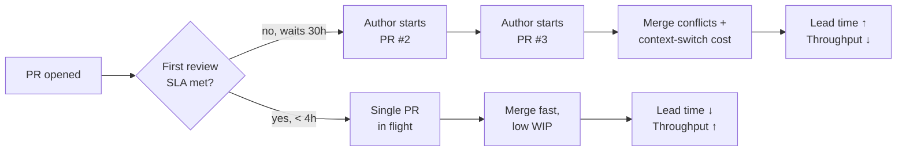
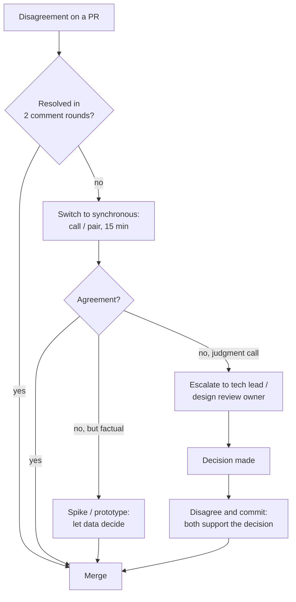

# Code Reviews — Senior Level

> Focus: "How do I design the review *culture* and *process*?" — review as a team-scale system. Latency budgets and SLAs, what to automate vs. what humans judge, routing via CODEOWNERS, the approval standard, psychological safety, mentoring through review, resolving disagreement, and the metrics worth watching (plus the Goodhart traps that ruin them).

At the junior and middle levels, code review is something you *do*: you read a diff, you leave comments, you respond to feedback. At the senior level it becomes something you *design*. You own the answer to questions like: *Why does our median PR sit for 30 hours before first review?* *Why do reviews degrade into style arguments?* *Why are juniors afraid to push back, and seniors rubber-stamping?* These are not individual-skill problems — they are process and culture problems, and they are yours to fix.

---

## Table of Contents

1. [Review as a throughput system, not a gate](#review-as-a-throughput-system-not-a-gate)
2. [Review SLAs and keeping cycle time low](#review-slas-and-keeping-cycle-time-low)
3. [Automate the mechanical, review the meaningful](#automate-the-mechanical-review-the-meaningful)
4. [CODEOWNERS and routing](#codeowners-and-routing)
5. [PR templates and required checks](#pr-templates-and-required-checks)
6. [The approval standard: "improves overall code health"](#the-approval-standard-improves-overall-code-health)
7. [Review checklists that scale](#review-checklists-that-scale)
8. [Psychological safety and blameless tone](#psychological-safety-and-blameless-tone)
9. [Mentoring juniors through review](#mentoring-juniors-through-review)
10. [Handling disagreement: escalation and disagree-and-commit](#handling-disagreement-escalation-and-disagree-and-commit)
11. [Metrics to watch and Goodhart traps](#metrics-to-watch-and-goodhart-traps)
12. [Scaling review in a large org or monorepo](#scaling-review-in-a-large-org-or-monorepo)
13. [Common Mistakes](#common-mistakes)
14. [Test Yourself](#test-yourself)
15. [Cheat Sheet](#cheat-sheet)
16. [Summary](#summary)
17. [Further Reading](#further-reading)
18. [Related Topics](#related-topics)

---

## Review as a throughput system, not a gate

Most teams treat review as a quality gate: code goes in one end, an approval comes out the other. That framing is incomplete. Review is a **queue inside your delivery pipeline**, and like any queue it has arrival rate, service rate, and wait time. When you ignore the queueing dynamics, review latency silently becomes the dominant cost in your lead time.

The DORA research (*Accelerate*, Forsgren/Humble/Kim) measures four delivery metrics: deployment frequency, lead time for changes, change-failure rate, and time to restore. Code review sits squarely on the **lead-time** path. A PR that waits 30 hours for a first look has spent 30 hours as work-in-progress: a branch drifting from main, a context the author has paged out of memory, a feature the business is waiting on.

The non-obvious cost is **WIP multiplication**. When reviews are slow, authors don't sit idle — they start a *second* PR while the first waits, then a third. Now three branches are in flight, each accumulating merge conflicts, each requiring the author to context-switch back when review finally lands. Slow review doesn't just delay one change; it inflates the whole team's WIP, and high WIP is the strongest predictor of low throughput.



The senior's job is to design the system so the green path is the default: **review is a priority, not a chore squeezed between "real work."** Reviewing a teammate's PR *is* real work — it unblocks throughput more reliably than starting yet another task.

---

## Review SLAs and keeping cycle time low

Set an explicit, written **review SLA**. Without one, "I'll get to it after this" compounds into hours of dead time per PR. A workable default:

| Target | Value | Rationale |
|---|---|---|
| Time to **first** review | within 1 business hour of request (≤ 4h hard cap) | Keeps the author in context; prevents WIP multiplication |
| Time to **subsequent** rounds | within 2 business hours | Round-trips dominate cycle time; each idle gap is pure waste |
| PR **size** target | ≤ 200–400 lines of *meaningful* diff | Review effectiveness collapses past ~400 lines |
| Total **cycle time** (open → merge) | < 1 business day for typical PRs | The compounding effect of the above three |

These are *team commitments*, not individual KPIs (see the Goodhart section). The mechanism that makes them work is **small batches**. A 50-line PR is reviewable in minutes and rarely needs a second round. A 1,500-line PR cannot be reviewed well by anyone — the reviewer skims, approves, and misses the real defect. Small PRs are the single highest-leverage change you can make to review cycle time, and they require author discipline: stacked diffs, feature flags to merge incomplete work safely, and splitting refactor-then-feature into two PRs.

Cultural reinforcement that actually moves the SLA:
- **"Review before code."** Start the day by clearing your review queue, not by opening your editor.
- **Pull, don't push.** A review-request notification should interrupt; treat an open review request like a ringing phone, not an email.
- **Make the queue visible.** A dashboard or bot that posts "3 PRs awaiting first review, oldest 6h" turns an invisible queue into a team-owned number.
- **Reviewer-of-the-day rotation.** One person owns the inbound queue each day so no PR falls between two "someone else will get it" assumptions.

---

## Automate the mechanical, review the meaningful

The fastest way to ruin review culture is to let humans do what machines do better. Every comment a reviewer spends on indentation, import ordering, or a missing semicolon is attention *not* spent on the concurrency bug or the wrong abstraction. The principle:

> **Machines enforce consistency. Humans judge design and correctness.**

Push everything mechanical left into CI so it is decided *before* a human looks:

| Concern | Tool (representative) | Outcome at review time |
|---|---|---|
| Formatting | Prettier, gofmt, Black, clang-format, rustfmt | Zero formatting comments — the formatter already decided |
| Linting / style | ESLint, golangci-lint, Ruff, Checkstyle, RuboCop | Style violations block the PR before review |
| Tests | CI test suite, required to pass | Reviewer trusts green; reviews the *test design*, not "does it run" |
| Coverage | Codecov, Coveralls (delta on changed lines) | Flags untested new code; reviewer judges *which* gaps matter |
| Static analysis | SonarQube, CodeQL, Semgrep, Infer | Cognitive complexity, null-deref, taint flow surfaced automatically |
| Security | Dependabot, Snyk, Trivy, secret scanning | Vulnerable deps and committed secrets blocked at the door |
| Type safety | tsc, mypy, the compiler | Type errors never reach a human reviewer |

Once these are in place, the **formatter ends the style debate permanently** (this is why bikeshedding-after-a-formatter is a named anti-pattern — see [../04-formatting/README.md](../04-formatting/README.md)). The human review then concentrates on the four things automation *cannot* judge:

1. **Correctness** — does this actually do what it claims, including edge cases and concurrency?
2. **Design** — is this the right abstraction, in the right place, at the right layer?
3. **Maintainability** — will the next engineer understand it? Are names and tests clear?
4. **Fit** — does it match the codebase's conventions and the system's invariants?

A practical heuristic: **if a reviewer leaves a comment that a linter could have caught, that's a backlog item to add the lint rule — not a habit to repeat.** Each recurring human nit is a missing automation.

---

## CODEOWNERS and routing

At team scale, "who should review this?" must not be a manual decision per PR. GitHub/GitLab `CODEOWNERS` encodes routing as data: path patterns map to the people or teams who must approve changes under them.

```gitignore
# .github/CODEOWNERS
# Last matching pattern wins — order matters.

# Default owner for everything not otherwise matched
*                           @org/platform-team

# Domain ownership by directory
/services/billing/          @org/payments-team
/services/auth/             @org/identity-team @security-reviewers

# Cross-cutting concerns require a specialist regardless of who edits them
/**/migrations/             @org/dba-team
*.proto                     @org/api-guild
/infra/**/*.tf              @org/sre-team
package.json                @org/security-reviewers   # dependency changes

# Docs can be self-reviewed by any maintainer
/docs/                      @org/maintainers
```

Pair `CODEOWNERS` with branch protection so the rule has teeth:

```yaml
# Repository branch protection (conceptual; configured in repo settings / API)
required_pull_request_reviews:
  required_approving_review_count: 1
  require_code_owner_reviews: true        # a CODEOWNERS match must approve
  dismiss_stale_reviews: true             # new commits re-trigger review
required_status_checks:
  strict: true                            # branch must be up to date with base
  contexts: [lint, test, coverage, codeql]
enforce_admins: true                      # no one bypasses the gate
```

Routing principles for scale:
- **Owners are teams, not individuals** — a person on vacation must never block a path. Map paths to GitHub teams; auto-assignment load-balances within the team.
- **Specialist gates for risk concentration** — migrations, IAM/auth, public API schemas, and infra get a mandatory specialist reviewer in addition to the domain owner.
- **Avoid over-broad ownership.** If one team owns 80% of paths, every PR routes to them and they become the bottleneck. Ownership should follow real domain boundaries (this is the org-chart shadow of bounded contexts — see [../../refactoring/README.md](../../refactoring/README.md)).
- **Keep `CODEOWNERS` reviewed like code.** It *is* the routing policy; a stale entry silently misroutes risk.

---

## PR templates and required checks

A PR template turns the implicit "what should I tell my reviewer?" into a structured contract. It reduces back-and-forth (the round-trips that dominate cycle time) by front-loading the context the reviewer needs.

```markdown
<!-- .github/pull_request_template.md -->
## What & why
<!-- One paragraph: the problem this solves and the chosen approach.
     Link the issue/ticket. If this is a refactor, state behavior is unchanged. -->

## How to verify
<!-- Steps a reviewer can run, or the test that proves it. -->

## Scope & risk
- [ ] This PR is < 400 lines of meaningful diff (or explains why it can't be split)
- [ ] Behavior change is feature-flagged / backward compatible
- [ ] DB migration is reversible and reviewed by @org/dba-team
- [ ] No new secrets, PII logging, or auth-boundary changes (or flagged below)

## Reviewer focus
<!-- Direct the reviewer's attention: "Please scrutinize the locking in
     OrderService; the rest is mechanical rename." -->

## Screenshots / logs (if UI or behavior visible)
```

The **"Reviewer focus" section is the highest-value field**: it lets the author spend the reviewer's scarce attention deliberately. A diff is flat; the author's knowledge of *where the risk is* is not.

Required checks (the CI contexts in branch protection) define what "ready for human eyes" means. Order them by speed so feedback is fast: format/lint (seconds) → unit tests (a minute) → integration/e2e and security scans (longer). A PR should not be *requestable for review* until the fast checks are green — humans should never be the linter.

---

## The approval standard: "improves overall code health"

The single most important decision in review culture is **what "approve" means**. Get this wrong and you oscillate between two failure modes: rubber-stamping (LGTM without reading) or perfectionism (blocking on hypothetical ideals that never ship).

Google's published standard (in *Engineering Practices: How to do a code review*) resolves it precisely:

> *A reviewer should approve a CL once it is in a state where it **definitely improves the overall code health** of the system, even if it isn't perfect.*

This is the load-bearing sentence of professional review:

- **It is not "this is how I would have written it."** Blocking on personal preference is a named anti-pattern. If two approaches are roughly equal, the author's choice wins.
- **It is not "this is perfect."** There is no perfect code; demanding it stalls delivery and trains authors to fear review.
- **It is "is the system better with this than without it?"** If yes, and outstanding concerns can be follow-ups, approve.

Two mechanisms operationalize this:

1. **The `Nit:` / `Optional:` prefix.** Reviewers mark non-blocking suggestions explicitly. The author may take them or not; they do not gate the merge. This drains the "is this comment blocking?" ambiguity that drives review ping-pong.
2. **Readability / a second axis of approval.** Google separates *domain* approval (does this code do the right thing?) from *readability* approval (does it meet the language's idiomatic and style standards?). Some orgs encode this as a "Readability" credential a reviewer must hold for a given language. You don't need Google's machinery, but the idea generalizes: distinguish "correct" from "clean," and be explicit about which gate is failing.

> **Standard, in one line:** *Approve when the change definitely improves overall code health — not when it is perfect, and not merely because it compiles.*

---

## Review checklists that scale

A checklist makes review consistent across reviewers of differing experience and prevents the "nitpick-only review that misses the architectural issue." Keep it short — a 40-item checklist is ignored. Prioritize by what automation *can't* catch.

**Correctness**
- Does it handle the empty / null / boundary / concurrent case?
- Are errors handled, or silently swallowed? (see [../../anti-patterns/README.md](../../anti-patterns/README.md))
- Are there race conditions, unbounded retries, or resource leaks?
- Does it preserve invariants the rest of the system relies on?

**Design**
- Is this the right layer/module for this logic? Is the abstraction earning its keep?
- Does it introduce a dependency in the wrong direction?
- Is anything here a smell that will metastasize (god object, duplicated logic)?

**Tests**
- Do tests cover the *behavior change*, not just lines? Do they fail if the logic is wrong?
- Are tests deterministic (no sleeps, no real network, no ordering assumptions)?

**Security & data**
- Untrusted input validated? Secrets out of source? PII out of logs?
- AuthN/AuthZ boundary respected?

**Clarity**
- Will the next engineer understand *why*, not just *what*? Are names honest?
- Is the commit history clean and the change atomic? (see [../25-clean-commits-and-version-control/README.md](../25-clean-commits-and-version-control/README.md))

The checklist is a *floor*, not a script — its purpose is to stop reviewers from drowning in line-level nits while the wrong-abstraction problem sails through.

---

## Psychological safety and blameless tone

Review is the most frequent peer-to-peer feedback in engineering, which makes it the place culture is built or destroyed. The research is unambiguous: **psychological safety** — the shared belief that you won't be punished for speaking up, asking, or being wrong — is the top predictor of high-performing teams (Google's Project Aristotle). Review tone is where that safety is tested daily.

Concrete tone rules, encoded into team norms:

- **Critique the code, never the person.** "This function..." not "You always...". The diff is the subject, never the author's competence. (Personal-attack tone is a named anti-pattern in this chapter.)
- **Ask, don't command.** "What happens if `items` is empty here?" invites reasoning; "This is wrong" invites defensiveness. Questions teach; assertions wound.
- **Explain the *why*.** "Prefer a map here — O(n) → O(1) lookup, and it reads clearer" beats "use a map." The reasoning is the durable lesson.
- **Praise genuinely and specifically.** "Nice — this guard clause makes the happy path much clearer" costs nothing and builds the safety that makes hard feedback land.
- **Prefix non-blocking comments** (`Nit:`/`Optional:`) so the author isn't guessing the severity.
- **Author responses are not arguments.** When a reviewer is wrong, the author's move is *"can you say more about the concern?"* — surfacing the assumption, not defending the ego. (Author defensiveness is a named anti-pattern.)

The deepest reframe for the whole team: **a review comment is a gift of attention, and a merged PR is a shared accomplishment.** Both author and reviewer succeed when the *system* improves. There is no winner of a code review.

---

## Mentoring juniors through review

Review is the highest-bandwidth mentoring channel you have: it is context-specific, just-in-time, and tied to real work. A senior who reviews well multiplies the whole team.

- **Teach the principle, not just the fix.** Don't write the corrected code in the comment. Point at the principle ("this duplicates the validation in `OrderService` — can we share it?") and let the junior do the refactor. They learn; you don't become the bottleneck.
- **Calibrate strictness to the person and the stakes.** A junior's first PR on a low-risk path: be generous, approve with follow-ups, build confidence. A junior's change to the auth boundary: pair on it before it's even a PR.
- **Make reviewing a learnable skill.** Have juniors review too — including senior PRs. Reviewing is how you learn to read code, see design trade-offs, and internalize the bar. A team where only seniors review never grows its reviewer capacity (a scaling failure).
- **Separate "must change" from "consider."** Overwhelming a junior with 40 equal-weight comments teaches nothing; it just signals "you're bad at this." Mark the 3 that matter; let the rest be optional.
- **Close the loop in person for big lessons.** Some feedback (a fundamentally wrong design) is too large for a comment thread. Pull them into a 15-minute call. Async review is for the small; sync is for the structural.

---

## Handling disagreement: escalation and disagree-and-commit

Disagreements are healthy; *unresolved* disagreements are the disease (this is "review ping-pong" — endless rounds where author and reviewer never sync). Senior engineers own a clear escalation ladder:



The tools, in order of preference:

1. **Sync fast.** Two round-trips without convergence means async is the wrong medium. Get on a call. Most "disagreements" are misunderstandings that evaporate in five minutes of talking.
2. **Let data decide.** If the dispute is empirical ("approach A is faster" / "this won't scale"), don't argue — **spike a prototype or benchmark.** Facts end opinion wars. (Profiling and measurement are the relevant skills here.)
3. **Escalate without ego.** If it's a genuine judgment call with no clear winner, escalate to the tech lead, the relevant `CODEOWNERS` owner, or a design review. Escalation is not failure; it is the system working. Don't let a PR rot for a week because two engineers are stubborn.
4. **Disagree and commit.** Once decided — by data or by an owner — *everyone* supports the decision, including the person who lost. Re-litigating a settled call in the next PR poisons the well. This is a borrowed Amazon/Intel principle and it is essential: the team's velocity depends on not re-fighting old battles.

A hard rule worth writing down: **the author does not get to dismiss a reviewer's blocking concern unilaterally, and the reviewer does not get to block indefinitely on a non-blocking opinion.** Both abuses route to escalation.

---

## Metrics to watch and Goodhart traps

You can't improve review without measuring it — but review metrics are *exceptionally* prone to **Goodhart's Law**: *when a measure becomes a target, it ceases to be a good measure.* Every review metric has a degenerate gaming strategy. Treat them as **team-level diagnostics and conversation-starters, never as individual performance targets.**

| Metric | What it tells you | If it's bad | Goodhart trap (what gets gamed) |
|---|---|---|---|
| **Time to first review** | Queue responsiveness | Set/enforce an SLA; rotation | — (relatively safe; team-level) |
| **PR cycle time** (open→merge) | End-to-end review cost | Smaller PRs; faster rounds | — (the outcome you actually want) |
| **PR size** (lines/files) | Reviewability | Coach splitting | Authors split into meaningless micro-PRs to hit a number |
| **Review rounds per PR** | Round-trip waste | Sync sooner; better templates | Authors apply changes blindly to close rounds |
| **Comments per PR** | Engagement (weak) | — | **Rewards nitpicking;** more comments ≠ better review |
| **Approval rate / time-to-approve** | Throughput | — | **Rewards rubber-stamping;** fast approval = unread diff |
| **Change-failure rate** (DORA) | Did review catch defects? | Strengthen checklist/tests | Lagging; needs incident discipline to attribute |
| **% PRs reviewed by ≥1 person** | Coverage of the gate | Enforce branch protection | — |

The cardinal rules:

- **Never tie review metrics to individual performance reviews.** "Reviews completed per week" makes people rubber-stamp; "comments left" makes people nitpick. You will get exactly the behavior you reward, and it will be the wrong behavior.
- **Watch *distributions and trends*, not point values.** A rising p90 cycle time is a real signal; a single slow PR is noise.
- **Triangulate.** Pair a *speed* metric (cycle time) with an *effectiveness* metric (change-failure rate). Optimizing speed alone produces fast rubber-stamps; the failure-rate metric is the counterweight.
- **The best "quality of review" signal isn't a dashboard number** — it's whether defects are caught in review vs. in production. Track *escaped defects* via blameless postmortems, not via comment counts.

---

## Scaling review in a large org or monorepo

What works for a 6-person team breaks at 600. The failure modes change shape:

- **Ownership is the routing layer.** In a monorepo, `CODEOWNERS` is the difference between "every PR pings everyone" and "the right two people see it." Hierarchical ownership (`OWNERS` files per directory, as in Google's and Chromium's model) localizes authority: the owner of `/services/billing/` approves billing changes; a top-level owner is not a bottleneck for the whole repo.
- **Tooling must scale with the codebase, not the diff.** Google's internal Critique, Phabricator, Gerrit, and GitHub's merge queues exist because the tooling itself becomes the constraint at scale. Merge queues (serialize merges, re-test against latest main) prevent the "10 PRs all green, all conflict on merge" thundering herd.
- **Standards must be encoded, not transmitted orally.** A 6-person team can hold the bar in everyone's head. A 600-person org cannot — the bar lives in linters, a written style guide, `CODEOWNERS`, PR templates, and required checks. Anything not encoded *drifts*.
- **Large-scale changes (LSCs) need their own lane.** A 5,000-file rename can't go through normal review. Big orgs use automated, owner-pre-approved LSC tooling (Google's Rosie, codemods) with a lightweight rubber-stamp specifically *because* the change is mechanical and tool-verified — the opposite of a normal review, and deliberately so.
- **Specialist guilds for cross-cutting risk.** API, security, and DB review guilds gate the paths where a single mistake is org-wide. They scale by owning *patterns and policy*, not by reviewing every line.

The throughline: **at scale, you stop relying on individual heroics and start relying on encoded process.** The senior's deliverable is the system — the `CODEOWNERS`, the checks, the SLA, the written standard — not their own heroic reviewing.

---

## Common Mistakes

- **Treating review as lower-priority than "your own" work.** This is the root cause of slow cycle time and WIP multiplication. Reviewing unblocks the team; it *is* the work.
- **Letting humans do the linter's job.** Style comments on a diff mean a missing automation. Encode it once; never type it again.
- **No written approval standard.** Without "improves overall code health," reviewers default to either rubber-stamping or perfectionism, and PRs swing unpredictably between them.
- **Mega-PRs.** A 1,500-line PR cannot be reviewed; it can only be rubber-stamped. The defect *is* in there, and no one will find it.
- **Blocking on personal preference.** "I'd write it differently" is not a defect. If both approaches are sound, the author's choice stands.
- **Tying review metrics to individual performance.** The fastest way to manufacture rubber-stamping (time-to-approve target) or nitpicking (comment-count target). Goodhart guarantees it.
- **Personal-attack or commanding tone.** Destroys the psychological safety that makes the *next* hard review land. Ask questions; critique code, not people.
- **No escalation path.** Disagreements without a ladder become week-long ping-pong that rots branches and morale.
- **Over-broad CODEOWNERS.** One team owning everything becomes the single bottleneck the whole org waits on.
- **Reviewing only "what changed" and missing "what should also have changed."** The bug is often the test that wasn't written or the caller that wasn't updated.

---

## Test Yourself

**1. Your team's median time-to-first-review is 28 hours and people complain throughput is low. What's the likely mechanism, and where do you intervene first?**

<details><summary>Answer</summary>

Slow first review drives **WIP multiplication**: authors start new PRs while old ones wait, inflating in-flight work, merge conflicts, and context-switch cost — which is why throughput drops even though everyone is "busy." Intervene at the queue, not the individuals: set an explicit time-to-first-review SLA (e.g., ≤ 4h), make the review queue visible (a bot posting oldest-waiting PRs), institute a reviewer-of-the-day rotation, and reframe reviewing as first-priority work. Push PR size down in parallel — small PRs cut both review time and round-trips. This is a lead-time (DORA) problem solved at the system level.
</details>

**2. A reviewer leaves 18 comments on a PR; 15 are about naming and formatting, and the PR has a genuine race condition the review never mentions. What two distinct problems do you fix?**

<details><summary>Answer</summary>

Two problems. (a) **Mechanical concerns are reaching humans** — formatting must be a formatter, naming-style a linter; the 15 nits are missing automation. Fix: add/enforce the format and lint checks as required CI so those comments are impossible to need. (b) **The review missed the thing that matters** — a "nitpick-only review that misses the architectural issue." Fix: a short prioritized checklist that puts correctness/concurrency first, and an author PR-template "Reviewer focus" field directing attention to the risky locking code. The deeper cause is attention misallocation: humans spent it on what machines should own.
</details>

**3. What does it mean to approve a PR, exactly — and why is "this is how I would have written it" the wrong bar?**

<details><summary>Answer</summary>

Approve when the change **definitely improves the overall code health of the system**, even if it isn't perfect (Google's standard). "How I would have written it" is wrong for two reasons: it demands the reviewer's *preference* rather than measurable improvement, and it has no stopping condition — there's always a different way to write anything, so this bar never lets code merge. If two approaches are roughly equal, the author's wins; reviewers gate on defects and code health, and mark mere preferences `Nit:`/`Optional:`.
</details>

**4. Leadership wants to reward your "best reviewers" using metrics. They propose comments-per-PR and reviews-completed-per-week. What do you tell them?**

<details><summary>Answer</summary>

Both are textbook Goodhart traps. **Comments-per-PR rewards nitpicking** — reviewers maximize comment count by flagging trivia, which is the opposite of good review. **Reviews-per-week rewards rubber-stamping** — the fastest way to complete many reviews is to not read them. Never tie review activity to individual performance; you get exactly the behavior you reward, and it's the wrong behavior. If they want a signal, use *team-level* outcomes: cycle time (speed) triangulated with change-failure rate (effectiveness), and escaped-defect rate surfaced via blameless postmortems. Watch trends and distributions, not individual point values.
</details>

**5. Two strong engineers have been ping-ponging on a PR for four days over an empirical claim ("approach B won't scale"). As the senior, what do you do?**

<details><summary>Answer</summary>

Stop the async ping-pong immediately — two unresolved rounds already meant async was the wrong medium. Because the dispute is *empirical*, don't argue: **spike a prototype or benchmark and let data decide.** If it remained a judgment call with no clear winner, **escalate** to the tech lead or the relevant CODEOWNERS owner rather than letting the branch rot. Once decided — by data or by an owner — **disagree and commit**: both engineers fully support the outcome and don't re-litigate it on the next PR. A rotting four-day PR is a process failure, not a sign of thoroughness.
</details>

**6. You're rolling code review out to a 400-engineer monorepo. Name the three things that *must* change versus a 6-person team.**

<details><summary>Answer</summary>

(1) **Routing must be encoded in hierarchical CODEOWNERS/OWNERS files** so PRs reach the right local owners instead of pinging everyone — and so no single team is the whole-repo bottleneck. (2) **Standards must be encoded, not held in heads** — linters, a written style guide, required checks, PR templates, and a written approval standard; anything oral drifts at scale. (3) **Tooling must scale to the codebase, not the diff** — merge queues to prevent green-but-conflicting PRs, and a dedicated lane for large-scale mechanical changes (codemods/LSC tooling) that bypass normal line-by-line review precisely because they're tool-verified. The meta-shift: replace individual heroics with encoded process.
</details>

**7. A junior's PR has a fundamentally wrong abstraction plus a dozen small issues. How do you review it without crushing them?**

<details><summary>Answer</summary>

Separate the structural from the trivial. The wrong abstraction is too big for a comment thread — pull them into a 15-minute call and reason through it together (sync for the structural, async for the small). For the rest, mark only the 2–3 that truly matter as blocking and the others `Nit:`/`Optional:`; a wall of 12 equal-weight comments teaches nothing and signals "you're bad at this." Teach the *principle*, not the patch — point at the duplication/layering issue and let them do the fix so they learn and you don't become the bottleneck. Calibrate tone to build confidence: ask questions, critique the code, and name something genuinely good.
</details>

## Cheat Sheet

| Lever | Senior move |
|---|---|
| **Cycle time** | Written first-review SLA (≤ 4h); reviewer-of-the-day rotation; visible queue |
| **PR size** | Coach ≤ 200–400 line meaningful diffs; stacked diffs; feature flags |
| **What humans review** | Correctness, design, maintainability, fit — *not* style |
| **What machines own** | Format, lint, tests, coverage, static analysis, security, types (required CI) |
| **Routing** | Team-based CODEOWNERS + branch protection + specialist gates for risk |
| **Context** | PR template with a "Reviewer focus" field |
| **Approval bar** | "Definitely improves overall code health" — not perfect, not just compiling |
| **Severity clarity** | `Nit:` / `Optional:` for non-blocking; explicit blocking otherwise |
| **Tone** | Ask don't command; critique code not people; praise specifically |
| **Disagreement** | Sync after 2 rounds → spike/data → escalate → disagree-and-commit |
| **Metrics** | Team-level diagnostics only; never individual targets; beware Goodhart |
| **Scale** | Encode standards in tooling; hierarchical ownership; merge queues; LSC lane |

---

## Summary

At the senior level, code review stops being a personal skill and becomes a **system you design**. Treat review as a queue on your delivery lead time: slow reviews multiply WIP and crater throughput (a DORA lead-time problem), so set explicit SLAs and drive PRs small. Push everything mechanical into CI — format, lint, tests, coverage, static analysis, security — so humans spend their scarce attention on the four things machines can't judge: correctness, design, maintainability, and fit. Encode routing in team-based `CODEOWNERS` with branch protection and specialist gates; front-load context with PR templates. Anchor the whole culture on one standard — *approve when the change definitely improves overall code health, even if it isn't perfect* — and protect the psychological safety that makes hard feedback land by critiquing code, not people. Use review as your highest-bandwidth mentoring channel, teaching principles rather than handing out patches. Give disagreement a ladder: sync fast, let data decide, escalate without ego, then disagree and commit. Measure review at the team level for diagnostics only, because every review metric has a Goodhart-degenerate gaming strategy. And at org/monorepo scale, replace individual heroics with encoded process: hierarchical ownership, written standards, merge queues, and a dedicated lane for tool-verified large-scale changes.

---

## Further Reading

- **Google Engineering Practices — *How to do a code review*** and *The CL author's guide* — the canonical source for the "improves overall code health" standard and the readability concept.
- **Forsgren, Humble, Kim — *Accelerate*** — the DORA metrics and the throughput case for fast, small-batch review.
- **Kim, Humble, Debois, Willis — *The DevOps Handbook*** — peer review, small batches, and flow.
- **Google re:Work — Project Aristotle** — psychological safety as the top predictor of team performance.
- **"SmartBear / Cisco code review study"** — the empirical ~200–400 line ceiling on effective review and the defect-detection drop-off beyond it.
- **Karl Wiegers — *Peer Reviews in Software*** — review process design beyond code.
- **GitHub Docs — *About code owners* and *About protected branches*** — the concrete `CODEOWNERS` and required-checks mechanics.

---

## Related Topics

- [junior.md](junior.md) — how to read a diff and leave useful comments
- [middle.md](middle.md) — reviewing for design and tests; being a good author
- [professional.md](professional.md) — review at staff/org scale and as an architecture control
- [Chapter README](../README.md) — the positive rules of code review
- [../25-clean-commits-and-version-control/README.md](../25-clean-commits-and-version-control/README.md) — atomic commits and history that make diffs reviewable
- [../04-formatting/README.md](../04-formatting/README.md) — why a formatter ends the style debate before review
- [../../refactoring/README.md](../../refactoring/README.md) — the refactors reviewers ask for, and bounded-context ownership
- [../../anti-patterns/README.md](../../anti-patterns/README.md) — the smells reviewers exist to catch

---

> **Next:** [professional.md](professional.md) — code review as an architecture-governance control: fitness functions in CI, review as the enforcement layer for system invariants, and review economics across a multi-team org.