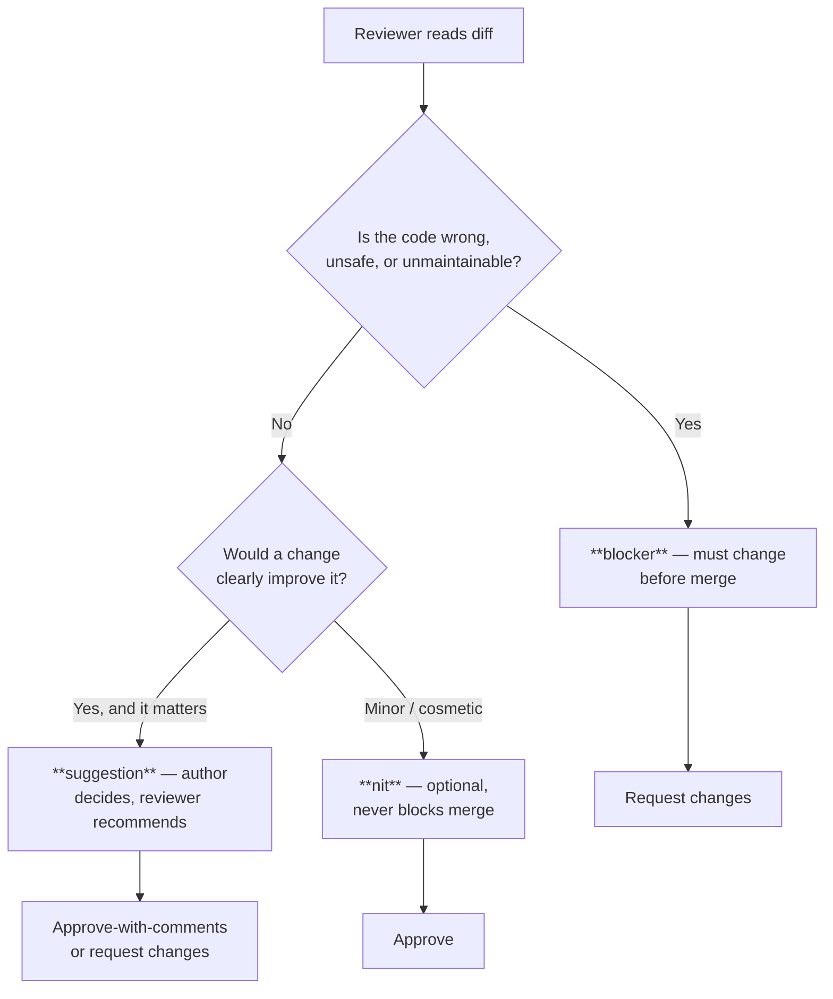
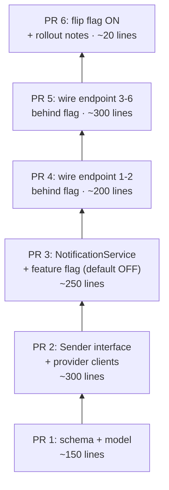

# Code Reviews — Practice Tasks

> 13 review exercises: you are handed a PR, a diff, or a comment thread and asked to review it like a senior engineer would. Every task has a full model answer with reasoning. Difficulty climbs from "label these three comments" to "untangle a four-round review fight." The skill being trained is judgment — knowing what to flag, how to say it, and when to stop typing and start a call.

---

## Table of Contents

1. [Task 1 — Label three review comments (nit / suggestion / blocker)](#task-1--label-three-review-comments-nit--suggestion--blocker) · Easy
2. [Task 2 — Write three good comments on a diff](#task-2--write-three-good-comments-on-a-diff) · Easy
3. [Task 3 — Rewrite a rude comment to be kind and specific](#task-3--rewrite-a-rude-comment-to-be-kind-and-specific) · Easy
4. [Task 4 — Spot the blocker a nitpicky review would miss](#task-4--spot-the-blocker-a-nitpicky-review-would-miss) · Medium
5. [Task 5 — Turn "I'd do it differently" into actionable or approve](#task-5--turn-id-do-it-differently-into-actionable-or-approve) · Medium
6. [Task 6 — Write a clear PR description for a given diff](#task-6--write-a-clear-pr-description-for-a-given-diff) · Medium
7. [Task 7 — Approve / approve-with-nits / request-changes, justified](#task-7--approve--approve-with-nits--request-changes-justified) · Medium
8. [Task 8 — Split a mega-PR into a sensible stack](#task-8--split-a-mega-pr-into-a-sensible-stack) · Hard
9. [Task 9 — De-escalate a review ping-pong](#task-9--de-escalate-a-review-ping-pong) · Hard
10. [Task 10 — The defensive author: respond without arguing](#task-10--the-defensive-author-respond-without-arguing) · Hard
11. [Task 11 — Review a diff with a hidden security blocker](#task-11--review-a-diff-with-a-hidden-security-blocker) · Hard
12. [Task 12 — Bikeshedding after the formatter](#task-12--bikeshedding-after-the-formatter) · Medium
13. [Task 13 — Full review of a real PR (open-ended)](#task-13--full-review-of-a-real-pr-open-ended) · Hard

---

## How to Use

For each task: read the scenario, then write your review **before** opening the solution. A review is not a feeling ("this looks off") — it is a set of concrete comments, each with a severity and a suggested action. Hold yourself to that bar.

Three labels recur throughout. They are the vocabulary of a healthy review culture:



- **blocker** — the PR must not merge as-is. A correctness bug, a security hole, data loss, a broken contract, or code so unclear it will rot. You are saying "no" and you owe a reason.
- **suggestion** — a real improvement the author should weigh. Not merge-blocking on its own; the author may accept, defer, or decline with a reason.
- **nit** — cosmetic or trivial. Prefix it `nit:` so the author knows it is optional. If a formatter or linter could catch it, it should not be a human comment at all.

The golden rule: **review the code, not the coder.** Every comment should survive being read aloud to the author's face.

---

## Task 1 — Label three review comments (nit / suggestion / blocker)

**Difficulty:** Easy

You are skimming a teammate's PR and have drafted three comments. Before posting, label each one `nit`, `suggestion`, or `blocker`, and decide whether the PR can be approved.

The diff (Python):

```python
def parse_config(path: str) -> dict:
    with open(path) as f:
        data = json.load(f)
    timeout = data["timeout"]          # KeyError if missing
    retries = data.get("retries", 3)
    return {"timeout": timeout, "retries": retries}
```

Your draft comments:

1. "`f` is a vague name — call it `config_file`."
2. "`data['timeout']` will raise `KeyError` with no context if the key is absent. A user with a typo in their config gets an opaque stack trace. Can we default it or raise a clear error?"
3. "Could batch these into a single `data.get` helper to reduce repetition."

Label each, then decide: approve, approve-with-nits, or request-changes?

<details><summary>Solution</summary>

| # | Comment | Label | Why |
|---|---|---|---|
| 1 | rename `f` | **nit** | `f` inside a 3-line `with` block is idiomatic and the scope is tiny. Cosmetic at most. Prefix `nit:` and move on. |
| 2 | unhandled `KeyError` | **suggestion** (arguably blocker) | This is a real user-facing failure mode. Whether it blocks depends on context: if config is always machine-generated and validated upstream, it's a suggestion; if humans hand-edit it, it's closer to a blocker. Ask, don't assume. |
| 3 | "batch into a helper" | **nit / drop entirely** | Two `dict` accesses are not duplication worth abstracting. A helper would be *more* code and less clear. This comment adds noise; delete it. |

**Decision: approve-with-nits**, *conditional* on the answer to comment 2. The right move is to post comment 2 as a question ("are these configs hand-edited?"), label comment 1 `nit:`, and drop comment 3. Do not block merge on naming or on a speculative helper.

**Reasoning:** The skill here is calibration. A reviewer who labels everything a blocker trains authors to ignore them; a reviewer who labels everything a nit misses the one comment (2) that actually matters. Most comments are nits or suggestions. Reserve "request-changes" for things that are genuinely wrong.

</details>

---

## Task 2 — Write three good comments on a diff

**Difficulty:** Easy

Write **three** review comments on the diff below — one targeting **correctness**, one targeting **design**, one targeting **readability**. Label each with a severity. Each comment must be specific enough that the author knows exactly what to change.

The diff (Go):

```go
func (s *UserService) GetUsers(ids []int) []*User {
    var users []*User
    for _, id := range ids {
        u, _ := s.repo.FindByID(id)
        users = append(users, u)
    }
    return users
}
```

<details><summary>Solution</summary>

**Correctness — blocker:**
> blocker: `FindByID`'s error is discarded with `_`, and a not-found lookup likely returns a `nil` `*User`. The returned slice can contain `nil` entries, which the caller almost certainly does not expect — this will panic on the first field access downstream. We need to either propagate the error or skip/collect missing IDs explicitly. What should happen when an ID isn't found?

**Design — suggestion:**
> suggestion: This makes one DB round-trip per ID (an N+1 query). For a request with 100 IDs that's 100 queries. If the repo can expose a `FindByIDs(ids []int)` batch method, a single query would be far cheaper. Worth it if this is ever called with more than a handful of IDs.

**Readability — nit:**
> nit: Pre-allocate the slice with `make([]*User, 0, len(ids))` since we know the upper bound. Minor, but it documents intent and avoids repeated re-allocation. Optional.

**Reasoning:** Three lenses, three findings. The correctness comment is the one that matters and is correctly a blocker — it's phrased as a question because the *right* behavior is genuinely the author's call, but the silent `nil` is not acceptable. The design comment names the failure mode by its known name (N+1) and bounds when it matters. The readability comment is explicitly optional. Notice none of the three attacks the author; all three describe the code and its consequences.

</details>

---

## Task 3 — Rewrite a rude comment to be kind and specific

**Difficulty:** Easy

A reviewer left this comment on a PR:

> "This is a mess. Did you even test it? Nobody writes loops like this anymore. Use a map."

The underlying technical point is valid — the code uses a linear scan inside a loop where a lookup map would be O(1). Rewrite the comment so it is **kind, specific, and actionable**, without losing the technical substance.

The code in question (Java):

```java
for (Order order : orders) {
    for (Customer c : customers) {
        if (c.getId().equals(order.getCustomerId())) {
            order.setCustomerName(c.getName());
        }
    }
}
```

<details><summary>Solution</summary>

**Rewritten comment (suggestion):**

> suggestion: This nested loop is O(orders × customers) — for large lists it'll get slow. We could build a `Map<CustomerId, Customer>` once before the loop, then look each customer up in O(1):
>
> ```java
> Map<String, Customer> byId = customers.stream()
>     .collect(toMap(Customer::getId, c -> c));
> for (Order order : orders) {
>     Customer c = byId.get(order.getCustomerId());
>     if (c != null) {
>         order.setCustomerName(c.getName());
>     }
> }
> ```
>
> That also makes the "customer not found" case explicit (the `c != null` check), which the current version silently skips. Want me to pair on this if the order/customer model has edge cases I'm not seeing?

**What changed, and why:**

| Original | Rewrite |
|---|---|
| "This is a mess" | Names the actual problem: O(n·m) complexity. |
| "Did you even test it?" | Removed — it's an accusation, not feedback. |
| "Nobody writes loops like this anymore" | Removed — appeal to fashion, not reasoning. |
| "Use a map." | Shows *how*, with code, and explains the secondary benefit (explicit not-found handling). |
| (tone) | Offers to pair, signaling collaboration not judgment. |

**Reasoning:** The rude version makes the author defensive and teaches them nothing. The rewrite is longer but every added word does work: it states the complexity cost, shows the fix, surfaces a latent bug the author may not know about, and ends with an open hand. Kindness here is not softness — it's *higher information density* delivered without ego. A reviewer's job is to make the code better and keep the author wanting to ship more PRs.

</details>

---

## Task 4 — Spot the blocker a nitpicky review would miss

**Difficulty:** Medium

A junior reviewer left four comments on the PR below, all about style. Read the diff, decide whether their comments are worth posting, and find the **blocker** they missed.

The diff (Python — a money-transfer endpoint):

```python
def transfer(from_acct, to_acct, amount):
    if amount <= 0:
        raise ValueError("amount must be positive")
    from_balance = db.get_balance(from_acct)
    if from_balance < amount:
        raise InsufficientFunds()
    db.set_balance(from_acct, from_balance - amount)
    to_balance = db.get_balance(to_acct)
    db.set_balance(to_acct, to_balance + amount)
    return True
```

The junior's comments:

1. "`from_acct` should be `from_account` — don't abbreviate."
2. "Add a docstring."
3. "`return True` is redundant, the function could return `None`."
4. "Type hints are missing."

<details><summary>Solution</summary>

**The missed blocker — this is not atomic:**

> blocker: This transfer is **not atomic**. Between the debit (`set_balance(from_acct, ...)`) and the credit (`set_balance(to_acct, ...)`) there is no transaction. If the process crashes, the DB connection drops, or a concurrent request interleaves after the debit, money is **destroyed**: it leaves the source account and never arrives at the destination. We must wrap the read-modify-write in a single DB transaction, and the balance reads should lock the rows (`SELECT ... FOR UPDATE`) to prevent two concurrent transfers from racing on a stale balance. As written, two simultaneous transfers from the same account can both pass the `from_balance < amount` check and overdraw it.

> blocker (related): The check-then-act on `from_balance` is a classic TOCTOU race. The balance is read, checked, and written without a lock, so concurrent transfers can drive the account negative.

**On the junior's four comments:**

| # | Comment | Verdict |
|---|---|---|
| 1 | `from_acct` → `from_account` | nit, fine to mention, do not block |
| 2 | add docstring | suggestion, low value here — the names are clear |
| 3 | drop `return True` | nit, debatable; `True` could be a deliberate success signal |
| 4 | add type hints | reasonable suggestion |

None of these are wrong, but **all four together would let a money-losing bug ship.** A review that produces four green nits and zero blockers on a financial transfer is a failed review.

**Reasoning:** Nitpicking is seductive because surface issues are easy to spot and easy to phrase. The hard, valuable work is reasoning about *what the code does under failure and concurrency*. The tell here: any function that does read-modify-write on shared state across two entities, with money involved, must be examined for atomicity first and formatting last. The discipline is to ask "what's the worst thing that can happen at runtime?" before "what would I rename?"

</details>

---

## Task 5 — Turn "I'd do it differently" into actionable or approve

**Difficulty:** Medium

A reviewer left only this comment and selected **Request Changes**:

> "Hmm, I would have used a strategy pattern here instead of the switch statement. I'd do it differently."

The author is now blocked and confused. The diff works, has tests, and ships a feature on a deadline. The code (Java):

```java
double price(PlanType type, int seats) {
    switch (type) {
        case FREE:       return 0;
        case TEAM:       return seats * 8.0;
        case BUSINESS:   return seats * 15.0;
        case ENTERPRISE: return seats * 25.0;
        default: throw new IllegalArgumentException("unknown plan: " + type);
    }
}
```

Your job: as the reviewer, rewrite your own comment. Either make it a concrete, actionable request **or** convert it to an approval. Decide which, and justify it.

<details><summary>Solution</summary>

**Decision: convert to approve (with an optional note).**

> Approving. ✅ The switch is clear, exhaustive, and has a sensible `default`. I had a reflex to reach for a Strategy pattern, but with four fixed plan types and a one-line calculation each, a switch is the *right* amount of structure — Strategy here would add four classes and a registry to avoid a five-line switch, which is over-engineering.
>
> nit (non-blocking, for later): if plan pricing grows complex (proration, regional pricing, add-ons), revisit then. A good trigger to extract Strategy is when a `case` body exceeds a few lines or starts duplicating logic. Not now.

**Why this, not a change request:**

The original comment failed three tests:
1. **It blocked merge on a preference.** "I'd do it differently" is not a defect. A Request Changes must point at something *wrong*, not something *different*.
2. **It was not actionable.** "Use a strategy pattern" with no example leaves the author guessing at the reviewer's mental model.
3. **It ignored context.** A deadline, working tests, and four trivial cases all argue *against* adding abstraction.

If the reviewer genuinely believed Strategy was warranted (say, the switch were 200 lines with duplicated logic), the actionable version would be:

> suggestion: The pricing logic in `BUSINESS` and `ENTERPRISE` now duplicates the volume-discount calculation. Extracting a `PricingStrategy` per plan would let each own its own rules. Sketch: `interface PricingStrategy { double price(int seats); }` with one impl per plan, selected via an `EnumMap<PlanType, PricingStrategy>`. Happy to do this in a follow-up so it doesn't block this PR.

Note even that version is a `suggestion`, offered as a follow-up — not a merge blocker on a working, tested, deadline-bound feature.

**Reasoning:** "I would do it differently" is the single most common form of unhelpful review. The cure is a forcing question the reviewer must answer before posting: *"Is the current code wrong, or just not how I'd write it?"* If it's the latter, you either approve or you make a labeled, exampled suggestion — you never silently block.

</details>

---

## Task 6 — Write a clear PR description for a given diff

**Difficulty:** Medium

You inherited a branch from a teammate who left this PR description:

> "fixes"

The diff does the following (you've read it): it changes the rate limiter from a fixed-window counter to a sliding-window log, adds a Redis-backed store so limits are shared across instances, raises the default limit from 60 to 100 req/min, and adds a `Retry-After` header to 429 responses. There is also a config flag `RATE_LIMIT_STRATEGY` to roll back to the old behavior.

Write a PR description a reviewer can actually use.

<details><summary>Solution</summary>

**Model PR description:**

> ## Switch rate limiter to sliding-window, shared across instances
>
> ### What
> Replaces the per-instance fixed-window rate limiter with a Redis-backed sliding-window log.
>
> ### Why
> The fixed-window counter had two problems in production:
> 1. **Burst at the boundary** — a client could send 60 requests in the last second of one window and 60 in the first second of the next, getting 120 req in ~2s instead of the intended 60/min.
> 2. **Per-instance limits** — each app instance counted independently, so with 4 instances the *effective* limit was 4× the configured value. The Redis store fixes this by sharing state.
>
> ### Changes
> - Sliding-window log algorithm (replaces fixed-window counter).
> - Redis-backed store so limits are enforced cluster-wide.
> - Default limit raised 60 → **100 req/min** (see note below).
> - 429 responses now include a `Retry-After` header so well-behaved clients back off correctly.
>
> ### Rollback
> Set `RATE_LIMIT_STRATEGY=fixed_window` to revert to the previous behavior without a deploy. The Redis store is read either way; deleting it is a separate cleanup PR.
>
> ### Reviewer notes / open questions
> - **The 60 → 100 default change is a behavior change**, not a refactor. I raised it because shared limits made the *effective* limit stricter (no more 4× multiplier) and 60 was tuned around the old per-instance behavior. Please sanity-check this number — happy to split it into its own PR if you'd rather decide separately.
> - Adds a hard dependency on Redis availability for rate limiting. Failure mode if Redis is down: see `limiter.go` — currently **fails open** (allows the request). Flag if you'd prefer fail-closed.
>
> ### Testing
> - Unit tests for window boundary behavior.
> - Load test: 200 req/min against the 100 limit correctly returns 100× 429 with `Retry-After`.

**Why each section earns its place:**

- **What/Why** lets a reviewer judge the change against its *intent*, not guess it. The "Why" includes the concrete bug (boundary burst) that motivated the work.
- **Changes** is a checklist the reviewer can tick off against the diff.
- **Rollback** answers the question every reviewer of infra code asks: "how do I turn this off at 3am?"
- **Reviewer notes** surface the two things that are easy to miss in the diff: the limit change is a *policy* decision smuggled into a *refactor*, and the new Redis dependency introduces a failure mode that needs a decision.
- **Testing** tells the reviewer what's already covered so they review the *gaps*, not the whole space.

**Reasoning:** "fixes" forces the reviewer to reverse-engineer intent from the diff — the most expensive possible way to review. A good description front-loads the author's knowledge: the bug, the trade-offs, the things hiding in plain sight. The single most valuable line above is the open question about the 60→100 change, because it flags a *decision* disguised as code.

</details>

---

## Task 7 — Approve / approve-with-nits / request-changes, justified

**Difficulty:** Medium

For each of the three small diffs below, decide: **approve**, **approve-with-nits**, or **request-changes** — and justify in one or two sentences.

**Diff A (Go):**
```go
func IsEven(n int) bool {
    return n%2 == 0   // negatives: -4 % 2 == 0 in Go, fine
}
```

**Diff B (Python):**
```python
def get_user(user_id):
    return cache.get(user_id) or db.query(User).filter_by(id=user_id).first()
```

**Diff C (Java):**
```java
public void deleteAccount(long userId) {
    auditLog.record("delete", userId);
    accountRepo.deleteById(userId);
}
```

<details><summary>Solution</summary>

**Diff A → approve.**
> Correct for all `int` inputs including negatives (Go's `%` preserves sign but `== 0` is unaffected). Clear, tested-by-inspection. Nothing to add.

**Diff B → request-changes.**
> blocker: This caches falsy-but-valid results incorrectly. If `cache.get` returns a legitimate value that is falsy — `0`, `""`, an empty list, or a `User` object whose `__bool__`/truthiness is `False` — the `or` discards it and falls through to the DB anyway, defeating the cache. Worse, if the cache *and* DB both legitimately return a "falsy" miss, the two are indistinguishable. Use an explicit sentinel:
> ```python
> cached = cache.get(user_id)
> if cached is not None:
>     return cached
> return db.query(User).filter_by(id=user_id).first()
> ```

**Diff C → approve-with-nits.**
> suggestion: The audit log is recorded *before* the delete. If `deleteById` throws, you've logged a deletion that never happened. Consider recording the audit entry after a successful delete, or within the same transaction so they commit or roll back together. Not blocking if the audit log is intentionally an "attempt" log — clarify the semantics in a comment.
> nit: `record("delete", ...)` uses a string literal for the action; an enum would prevent typos across call sites. Optional.

**Reasoning:** The discipline is to match the *verdict* to the *severity of the worst finding*:
- A is clean → approve, and say so without inventing nits (manufacturing comments to look diligent is its own anti-pattern).
- B has a correctness bug that silently breaks the cache → request-changes. The `x or y` idiom is a recurring trap precisely because it reads so naturally.
- C has a sequencing concern that *might* be intentional → approve-with-nits plus a question. You don't block on something that could be a deliberate design choice; you ask.

</details>

---

## Task 8 — Split a mega-PR into a sensible stack

**Difficulty:** Hard

A teammate opens a **1,400-line** PR titled "Add notifications." Reviewing it as one unit is hopeless — no one can hold 1,400 lines in their head and catch real bugs. From the file list and description, it contains:

- A new `notifications` DB table + migration.
- A `Notification` model and repository.
- A generic `Sender` interface with `EmailSender` and `SmsSender` implementations.
- A Twilio client wrapper (for SMS) and a SendGrid client wrapper (for email).
- A `NotificationService` that decides which sender to use.
- Wiring it into 6 existing endpoints (order shipped, password reset, etc.).
- A feature flag `NOTIFICATIONS_ENABLED`.
- Config, secrets handling for the two API keys, and 40 tests.

Propose how to split this into a reviewable stack of PRs. Specify the order and what makes each one independently safe to merge.

<details><summary>Solution</summary>

**Proposed stack (bottom = merges first):**



| PR | Contents | Why it's independently safe |
|----|----------|------------------------------|
| **1** | Migration, `Notification` model + repository, repo tests | Pure additive schema. Nothing reads it yet, so it can't break anything. Merging it early de-risks the migration (the scariest part) on its own. |
| **2** | `Sender` interface, `EmailSender`/`SmsSender`, Twilio + SendGrid wrappers, secrets wiring for the keys, client tests (mocked) | Self-contained adapters. Unused by production code, so reviewable purely on its own correctness. Secrets handling gets focused security review here, not buried in 1,400 lines. |
| **3** | `NotificationService` (sender selection logic), feature flag **defaulting OFF** | Wires 1 and 2 together but is dark — flag off means zero production behavior change. The interesting logic (which sender, retries, failures) gets real attention. |
| **4** | Wire 2 endpoints behind the flag | Small enough to verify the integration pattern once, carefully. If the pattern is wrong, you've only touched 2 call sites. |
| **5** | Wire remaining 4 endpoints, same pattern | Mechanical repetition of the now-reviewed pattern from PR 4 — fast to review. |
| **6** | Flip flag default to ON, rollout/monitoring notes | A ~1-line change that is the *only* PR that changes production behavior. Trivial to review, trivial to revert. |

**Key principles applied:**

1. **Each PR merges to main and is deployable.** No long-lived feature branch; the feature is dark behind a flag until PR 6.
2. **Scariest thing first, in isolation** — the migration (PR 1) and the secrets handling (PR 2) each get a focused review instead of being skimmed past in a mega-diff.
3. **The behavior change is one tiny PR** (6). The thing that needs the most caution is the smallest, most revertible unit.
4. **Order = dependency order.** Each PR only depends on what's already merged, so review can proceed in parallel-ish and main is never broken.

**What to tell the author:**

> This is great work, but at 1,400 lines I can't review it well enough to catch real bugs — and that's a disservice to you, not just me. Can we stack it? I'd start with the migration + model alone, then the sender adapters (I want to look hard at the secrets handling), then the service behind a flag, then wire the endpoints in two batches, then flip the flag last. Each piece merges safely on its own. Happy to pair on slicing the branch.

**Reasoning:** A mega-PR isn't reviewed; it's rubber-stamped, because the reviewer's working memory caps out around a few hundred lines. Splitting isn't busywork — it's what makes review *possible*. The discipline is to find the seams: schema, then dependency-free components, then the integration, then the behavior flip, with risk pushed to the smallest, earliest, most-isolated units.

</details>

---

## Task 9 — De-escalate a review ping-pong

**Difficulty:** Hard

A PR has been open for **5 days** and **four review rounds**. Here is the abridged thread on one comment:

> **Reviewer (round 1):** I don't think this retry logic is right — it'll retry on 4xx errors too, which won't succeed.
>
> **Author (round 1):** It only retries on the errors in `RETRYABLE`. 400 isn't in there.
>
> **Reviewer (round 2):** But `RETRYABLE` includes `ConnectionError`, and our HTTP client raises `ConnectionError` for some 4xx responses behind the proxy. So it can still retry a 400.
>
> **Author (round 2):** That seems like a client bug, not mine. Maybe. I'm not sure that actually happens.
>
> **Reviewer (round 3):** I'm fairly sure it does, I saw it last month. Can you add a check?
>
> **Author (round 3):** Added a status-code check. Does this work?
>
> **Reviewer (round 4):** Now it won't retry on a genuine connection drop that has no status code. Hmm.

It's now round 5 and you are the author. What do you do?

<details><summary>Solution</summary>

**Take it to a 15-minute call (or pairing session). Then write up the outcome in the thread.**

This thread has the unmistakable signature of a discussion that text cannot resolve:
- **Shared uncertainty about facts** — "Maybe," "I'm not sure that actually happens," "I'm fairly sure," "I saw it last month." Neither party *knows* when the client raises `ConnectionError` for a 4xx. You are designing retry logic on top of a guess.
- **Each round introduces a new edge case** rather than converging. Round 4's fix broke round 1's case. That's an oscillation, not progress.
- **Latency cost** — 5 days, 4 rounds, async, with hours between each reply. A call would have resolved this in 15 minutes on day 1.

**The message to send before the call:**

> This is getting hard to resolve in comments — we keep trading edge cases (genuine connection drops vs. proxy-mangled 4xx) and I don't think either of us is *certain* when the client raises `ConnectionError`. Can we grab 15 min today? I want to (a) actually reproduce the proxy-4xx case so we know the real behavior, and (b) agree on the retry policy together. I'll write up whatever we decide back here so the reasoning is on the record.

**On the call, the goal is to establish facts and a decision:**
1. Reproduce (or find logs of) the proxy raising `ConnectionError` on a 4xx — turn "I think" into "here's the trace."
2. Agree the policy: e.g. *retry on `ConnectionError` only when there is no HTTP status, OR when the status is in an explicit retryable set (502/503/504); never on 4xx*. This handles both the genuine-drop case (round 4) and the proxy-4xx case (round 2).
3. Decide whether the real fix belongs in the HTTP client (so every caller benefits) rather than in this PR — a possibility the thread raised but never resolved.

**The write-up afterward (this is mandatory, not optional):**

> Synced with @reviewer offline. Findings: the proxy does raise `ConnectionError` on 407/proxy-auth 4xx (repro'd, see [link]). Decision: retry only when (no status code) OR (status in {502,503,504}); never on other 4xx. Filed [TICKET-123] to push proper status preservation into the shared HTTP client so this stops biting every caller. Pushed the agreed implementation; PTAL.

**Reasoning:** Code review is asynchronous text optimized for *catching* issues, not for *resolving* genuine uncertainty or design disagreement. The trigger to switch channels: **two or more rounds without convergence, especially when the disagreement is about facts no one actually knows, or about subjective design.** Going to a call is not "giving up on review" — it's choosing the right tool. The one rule that keeps synchronous resolution healthy: **always write the outcome back in the thread**, so the decision and its reasoning survive for the next reader (including future-you) and the review record stays complete.

</details>

---

## Task 10 — The defensive author: respond without arguing

**Difficulty:** Hard

You are the **author**. A reviewer left this on your PR:

> blocker: This function mutates the `config` argument in place (`config["debug"] = True`). The caller passes a shared config dict, so this silently changes behavior for every other component reading the same dict. Can we return a modified copy instead?

Your honest first reaction is defensive — you did it in place deliberately to avoid copying a large dict, and you think the reviewer is being paranoid. Write the response that a senior engineer sends. Then write the response to *avoid*.

<details><summary>Solution</summary>

**The response to send:**

> Good catch — you're right that it mutates shared state, and I hadn't fully thought through who else holds that dict. My reasoning was to avoid copying a large config on a hot path, but "silently changes behavior for every other component" is exactly the kind of bug I don't want.
>
> Two options:
> 1. Return a shallow copy with the one override (`{**config, "debug": True}`) — cheap, since it's a shallow copy and the values aren't duplicated.
> 2. If even that copy matters on this path, take an explicit `overrides` dict and resolve at read time, leaving the shared config untouched.
>
> I lean toward (1) unless you know this path is hot enough to care. What's your read?

**The response to avoid:**

> "I did that on purpose for performance. The other components shouldn't be relying on this dict anyway. It's fine."

**Why the first works:**

| Move | Effect |
|------|--------|
| "Good catch — you're right" | Disarms the standoff. The reviewer *is* right about the hazard; conceding the valid point costs nothing and builds trust. |
| "My reasoning was X" | Shares the author's context (performance) so the reviewer understands the original choice without having to *defend* it. |
| Offers two concrete options | Moves from "who's right" to "what do we do" — the only question that ships code. |
| "What's your read?" | Re-engages the reviewer as a collaborator with relevant knowledge (is this path hot?), not an adversary to be defeated. |

**Why the second fails:**

- "I did that on purpose" answers a question no one asked — the reviewer didn't say it was accidental, they said it was *unsafe*.
- "shouldn't be relying on this dict anyway" blames the rest of the codebase for the function's side effect. Even if true, it doesn't make the mutation safe.
- "It's fine" asserts a conclusion without addressing the actual concern (shared mutable state). It forces the reviewer to either escalate or give up — both bad.

**The senior-engineer reframe:** the question is never "am I right?" It's "**what would convince me I'm wrong, and what would convince the reviewer?**" Here the convincing fact is *whether the path is hot enough that even a shallow copy matters* — which is empirical, not a matter of opinion. The defensive author argues from ego; the senior author argues from the missing fact and proposes how to get it.

**Reasoning:** Defensiveness is the author-side mirror of the rude reviewer. It turns a 30-second fix into a multi-round standoff and teaches reviewers to stop flagging things. The antidote is a reflex: when you feel defensive, *concede the valid part first*, share your context as information (not justification), and convert the disagreement into a concrete decision with a falsifiable criterion.

</details>

---

## Task 11 — Review a diff with a hidden security blocker

**Difficulty:** Hard

Review this PR that adds a "search users by name" admin endpoint. Find every issue and assign severity. There is at least one blocker.

The diff (Python / Flask + raw SQL):

```python
@app.route("/admin/users/search")
def search_users():
    name = request.args.get("name", "")
    query = f"SELECT id, email, ssn FROM users WHERE name LIKE '%{name}%'"
    rows = db.execute(query).fetchall()
    return jsonify([dict(r) for r in rows])
```

<details><summary>Solution</summary>

**Blocker 1 — SQL injection:**
> blocker: `name` is interpolated directly into the SQL string, so this is a textbook SQL injection. A request like `?name=' OR '1'='1` dumps every user; `?name='; DROP TABLE users; --` (depending on driver multi-statement support) is catastrophic. Use a parameterized query — never f-string user input into SQL:
> ```python
> query = "SELECT id, email FROM users WHERE name LIKE :pattern"
> rows = db.execute(query, {"pattern": f"%{name}%"}).fetchall()
> ```
> Note the `%` wildcards go in the *parameter value*, not the SQL text.

**Blocker 2 — leaking SSN (excessive data exposure):**
> blocker: The query selects `ssn` and returns it in the JSON response. There is no reason a name-search endpoint should return Social Security Numbers. This is a PII leak and likely a compliance violation. Remove `ssn` from the `SELECT`. If SSN is ever needed, it belongs behind a separate, audited, narrowly-authorized endpoint — never in a list response.

**Blocker 3 — no authentication / authorization:**
> blocker: The route is `/admin/...` but there's no auth check. Any unauthenticated caller can hit it. It needs an auth guard verifying the caller is an authenticated admin (e.g. a `@require_admin` decorator). Right now the "admin" is just a URL prefix.

**Suggestions / nits:**
> suggestion: No pagination — `LIKE '%...%'` with a short or empty `name` returns the entire users table in one response. Add a limit and pagination.
> suggestion: An empty `name` (the default) matches everyone. Decide whether empty search should return nothing or be rejected.
> nit: A leading-wildcard `LIKE '%name%'` can't use a standard index and will table-scan; fine at small scale, worth noting for growth.

**Verdict: request-changes.** Three independent blockers, any one of which is a serious incident on its own.

**Reasoning:** This diff is short and "works," which is exactly when security review matters most — there's no complexity to hide behind, so the issues are about *what the code is allowed to do*, not whether it runs. The reviewer's mental checklist for any endpoint touching a database and user input: (1) is input parameterized? (2) is the caller authorized? (3) does the response expose more than it should? All three fail here. A reviewer who only commented on the leading-wildcard index (the nit) would have approved a data breach.

</details>

---

## Task 12 — Bikeshedding after the formatter

**Difficulty:** Medium

The repo has `gofmt` (or Prettier / Black) running in CI; no PR merges unless it's formatted. On a 3-line bug-fix PR, a reviewer posts six comments:

1. "I prefer `if err != nil { return err }` on one line, not three."
2. "Can we align these struct field comments?"
3. "I'd use `i` instead of `idx` here."
4. "Two blank lines before this function would read better."
5. "Single quotes vs double quotes — pick one." (the formatter already enforces this)
6. "Move the import for `errors` above `fmt`." (the formatter already sorts imports)

The actual bug fix in the PR is correct. As a reviewer or tech lead seeing this thread, what do you do?

<details><summary>Solution</summary>

**Action: approve the PR, and address the *review behavior* separately.**

First, the PR: the bug fix is correct and formatted. **Approve it.** Holding a correct bug fix hostage over brace style is the bikeshedding anti-pattern in its purest form.

**Triage of the six comments:**

| # | Comment | Verdict |
|---|---------|---------|
| 1 | one-line `if err` | Style preference the formatter doesn't mandate → at most a `nit`, and arguably not even that. Drop. |
| 2 | align field comments | Cosmetic; the formatter would undo or ignore it. Drop. |
| 3 | `idx` → `i` | Bikeshed. `idx` is perfectly clear. Drop. |
| 4 | blank lines | The formatter governs this. Drop. |
| 5 | quote style | **Already enforced by the formatter.** Posting it means the reviewer didn't check what CI already does. Drop. |
| 6 | import order | **Already enforced by the formatter.** Same. Drop. |

All six are nits or non-issues; #5 and #6 are *factually redundant* with tooling.

**The systemic fix (more important than the PR):**

The lesson isn't "this reviewer is bad" — it's that **humans should not review what tools enforce.** The fixes:
1. **If the formatter enforces it, never comment on it.** Comments 5 and 6 should be impossible to have an opinion about — the tool decides.
2. **Codify the unsettled preferences** (one-line `if err`, naming) into the linter config or a short style guide, so they stop being per-PR debates. A rule in a config file is debated *once*; a preference in a reviewer's head is debated *every PR*.
3. **Reserve human attention for what tools can't check:** correctness, design, naming *clarity* (not naming *taste*), security, and whether the change does what the PR says.

**What to say to the reviewer (privately, kindly):**

> Quick note on the search PR — the fix looked good and I approved it. A few of the comments (quote style, import order) are things the formatter already enforces, so we don't need to spend review cycles on them; and a couple others (i vs idx, brace style) are preferences we should probably just settle in the linter config so nobody has to relitigate them. Frees us up to focus on the logic. Sound reasonable?

**Reasoning:** Every minute spent debating brace style is a minute not spent finding the next Task-11-style security hole. Bikeshedding is so common because cosmetic issues are *easy and safe to have opinions about*, while substantive review is hard and risks being wrong. The structural defense is automation: push every settle-able preference into a tool, so the only things left for humans are the things that actually require judgment.

</details>

---

## Task 13 — Full review of a real PR (open-ended)

**Difficulty:** Hard

Conduct a complete review of the PR below. Produce: (a) a verdict (approve / approve-with-nits / request-changes), (b) every comment with a severity label, and (c) one sentence of overall feedback to the author. Be thorough but not nitpicky.

**PR title:** "Add endpoint to export user's orders as CSV"

The diff (Python / Flask):

```python
@app.route("/users/<user_id>/orders/export")
def export_orders(user_id):
    orders = db.query(Order).filter_by(user_id=user_id).all()
    output = "id,date,total\n"
    for o in orders:
        output += f"{o.id},{o.date},{o.total}\n"
    resp = make_response(output)
    resp.headers["Content-Type"] = "text/csv"
    return resp
```

<details><summary>Solution</summary>

**(a) Verdict: request-changes.** One authorization blocker and one correctness blocker.

**(b) Comments:**

> **blocker (authz):** There's no check that the caller is allowed to export `user_id`'s orders. As written, any caller can export *any* user's order history by changing the URL (an IDOR / broken object-level authorization bug). Verify the authenticated user *is* `user_id` (or is an admin) before querying.

> **blocker (correctness — CSV injection / escaping):** The CSV is built with raw string interpolation, so any field containing a comma, quote, or newline corrupts the file, and a field beginning with `=`, `+`, `-`, or `@` becomes a formula-injection vector when opened in Excel. Use the stdlib `csv` module, which handles quoting:
> ```python
> import csv, io
> buf = io.StringIO()
> writer = csv.writer(buf)
> writer.writerow(["id", "date", "total"])
> for o in orders:
>     writer.writerow([o.id, o.date.isoformat(), o.total])
> output = buf.getvalue()
> ```

> **suggestion (memory / scalability):** Building the entire CSV in a single `str` (and the `+=` accumulation) holds the whole export in memory and is O(n²) on string concatenation. For a user with many orders this is slow and memory-heavy. Consider streaming the response with a generator so rows flush as they're produced.

> **suggestion (correctness — date format):** `f"{o.date}"` relies on the default `__str__` of whatever `date` is, which may vary by type/locale. Format it explicitly (`.isoformat()`) so the output is stable and parseable.

> **suggestion (UX):** Add a `Content-Disposition: attachment; filename="orders.csv"` header so browsers download the file instead of rendering it inline.

> **nit:** `o` is a terse loop variable; `order` reads slightly better. Optional.

**(c) Overall feedback:**

> Solid, readable first cut — the core shape is right. The two things that block merge are both about *trust boundaries*: who's allowed to call this, and what happens when order data contains CSV-hostile characters. Fix those two and the rest are easy follow-ups; happy to pair on the streaming version if you want it in this PR.

**Reasoning:** A complete review separates the *must-fix* (authz, escaping — security and correctness at the trust boundary) from the *should-fix* (memory, date format, download header) from the *optional* (variable name). The verdict is driven entirely by the blockers; the suggestions and nit don't change it. The overall-feedback sentence does real work: it affirms what's good (so the author isn't demoralized by a list of problems), names the *theme* of the blockers ("trust boundaries") so the lesson generalizes beyond this PR, and offers to collaborate. That is what a review at the top of the craft looks like — precise about defects, generous about the author.

</details>

---

## Self-Assessment

Score yourself after completing the tasks. You're reviewing at a senior level when you can consistently say "yes" to all of these:

- [ ] I label comments `nit` / `suggestion` / `blocker` and I'm calibrated — most comments are nits or suggestions, and I reserve "request-changes" for code that is actually wrong, unsafe, or unmaintainable.
- [ ] I check **correctness, security, and trust boundaries before style.** I find the atomicity bug and the injection hole, not just the variable name.
- [ ] Every comment I write describes the **code and its consequences**, never the coder. My comments would survive being read aloud to the author.
- [ ] I never block a working, tested PR on "I'd do it differently." I either approve or write a labeled, exampled suggestion.
- [ ] When I'm the author, I **concede the valid part first**, share my context as information rather than justification, and convert disagreement into a concrete decision.
- [ ] I recognize a mega-PR as **unreviewable** and propose a dependency-ordered stack with the behavior change isolated in the smallest unit.
- [ ] I switch to a **call** after ~two non-converging rounds — especially when the disagreement is about unknown facts — and I always write the outcome back in the thread.
- [ ] I **never comment on what a formatter or linter already enforces**, and I push settle-able preferences into tool config instead of relitigating them per PR.
- [ ] I can write a PR description that front-loads the *why*, the trade-offs, and the things hiding in the diff — so the reviewer reviews intent, not guesses it.

If any box is unchecked, re-do the matching task and articulate the principle in your own words.

---

## Related Topics

- [junior.md](junior.md) — the foundational definitions of the review anti-patterns practiced here.
- [find-bug.md](find-bug.md) — diffs where a review-relevant bug hides; train the eye that Task 4 and Task 11 demand.
- [optimize.md](optimize.md) — when a review comment is genuinely about performance, not preference.
- [chapter README](../README.md) — the positive rules of code review that these exercises invert and apply.
- [refactoring practice](../../refactoring/README.md) — many review suggestions ("extract this," "this is duplicated") are refactorings; this is the vocabulary to name them precisely.
