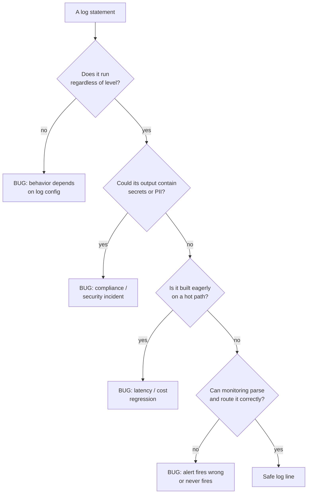
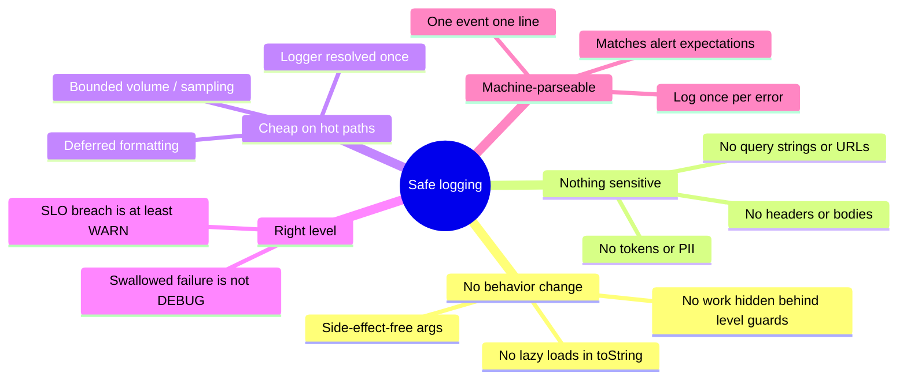

# Logging & Diagnostics — Find the Bug

> 12 buggy snippets where the bug lives inside a logging or diagnostics statement. A log line looks like the safest code in the file — it "just prints." These snippets show how it leaks secrets, changes behavior, pages the wrong person at 3 a.m., or quietly becomes the thing that takes production down. Find the bug first; the fix is usually a rule about *how* to log, not *whether* to.

---

## Table of Contents

1. [Snippet 1 — `log.debug` with a side effect (Java)](#snippet-1--logdebug-with-a-side-effect-java) · Hard
2. [Snippet 2 — Logging the full request, tokens and all (Go)](#snippet-2--logging-the-full-request-tokens-and-all-go)  · Medium
3. [Snippet 3 — Eager string-building on the hot path (Java)](#snippet-3--eager-string-building-on-the-hot-path-java) · Medium
4. [Snippet 4 — The error that's only visible at DEBUG (Python)](#snippet-4--the-error-thats-only-visible-at-debug-python) · Easy
5. [Snippet 5 — Multi-line log breaks the alert regex (Go)](#snippet-5--multi-line-log-breaks-the-alert-regex-go) · Hard
6. [Snippet 6 — Log-and-rethrow pages five times (Java)](#snippet-6--log-and-rethrow-pages-five-times-java) · Medium
7. [Snippet 7 — Format-string argument mismatch (Python)](#snippet-7--format-string-argument-mismatch-python) · Easy
8. [Snippet 8 — Logging inside a tight loop fills the disk (Go)](#snippet-8--logging-inside-a-tight-loop-fills-the-disk-go) · Medium
9. [Snippet 9 — PII in the URL, logged by middleware (Python)](#snippet-9--pii-in-the-url-logged-by-middleware-python) · Hard
10. [Snippet 10 — A logger constructed per request (Java)](#snippet-10--a-logger-constructed-per-request-java) · Medium
11. [Snippet 11 — `toString()` logged, lazy collection exploded (Java)](#snippet-11--tostring-logged-lazy-collection-exploded-java) · Hard
12. [Snippet 12 — Logging at the wrong level hides a SLO breach (Go)](#snippet-12--logging-at-the-wrong-level-hides-a-slo-breach-go) · Medium

[How to Use](#how-to-use) · [Scorecard](#scorecard) · [Related Topics](#related-topics)

---

## How to Use

1. Read the snippet. Assume it compiles and the surrounding code is correct. The bug is in or around a logging/diagnostics statement.
2. Ask the three questions a log line should always survive:
   - **Does it run only when its level is enabled?** If logging changes behavior, you have a bug, not a log.
   - **What does it write, and who can read it?** Secrets and PII in logs are an incident the moment they're written, not when they're exploited.
   - **What does it cost on the hottest path that reaches it?** A log call billed at p99 × QPS is a capacity decision in disguise.
3. Write down your diagnosis before opening the answer. Name the bug, its real-world consequence, and the one-line fix.
4. Score yourself with the [Scorecard](#scorecard).



---

### Snippet 1 — `log.debug` with a side effect (Java)

**Difficulty:** Hard

```java
public class CheckoutService {

    private static final Logger log = LoggerFactory.getLogger(CheckoutService.class);

    public Receipt checkout(Cart cart, Customer customer) {
        validate(cart);

        // reserveInventory decrements stock and returns a reservation token
        log.debug("Reserving inventory for cart " + cart.getId()
                + ", token=" + inventory.reserveInventory(cart));

        Payment payment = paymentGateway.charge(customer, cart.total());
        return new Receipt(cart, payment);
    }
}
```

**Where is the bug?**

<details><summary>Hint</summary>

What does `inventory.reserveInventory(cart)` *do*, and when does that argument get evaluated? Now imagine the production logger is configured at `INFO`.
</details>

<details><summary>Answer</summary>

`reserveInventory` is not a getter — it **mutates state** (decrements stock, allocates a reservation). It is called *inside the argument to* `log.debug`. In Java the argument is evaluated eagerly, before `debug` decides whether the `DEBUG` level is enabled.

In development, logging runs at `DEBUG`, the line executes, inventory is reserved, checkout works. In production, logging runs at `INFO`. The `debug` call still **evaluates its argument** — so `reserveInventory` still runs here. But many engineers, knowing the level is off, will "optimize" by guarding the call:

```java
if (log.isDebugEnabled()) {
    log.debug("Reserving inventory for cart " + cart.getId()
            + ", token=" + inventory.reserveInventory(cart));
}
```

Now the guard makes the bug catastrophic: at `INFO`, `isDebugEnabled()` is false, the block is skipped, **inventory is never reserved**, and the customer is charged for stock that was never set aside. Overselling, double-allocation, and oversold-out-of-stock orders follow — and only in production, never in the dev environment where the bug can be seen.

**Real-world consequence:** behavior of the system depends on the log level. A purely operational config change (lowering verbosity for a noisy service) silently breaks the business logic. This is among the hardest production bugs to diagnose because the code that "works on my machine" is byte-for-byte identical to the code that fails.

**Fix:** logging must be side-effect free. Perform the work first, log the result.

```java
String token = inventory.reserveInventory(cart);   // side effect — always runs
log.debug("Reserved inventory for cart {} token={}", cart.getId(), token);
```

Use parameterized logging (`{}`) so the message string is only assembled when `DEBUG` is enabled — and never put a method that *does* anything inside a log argument.
</details>

---

### Snippet 2 — Logging the full request, tokens and all (Go)

**Difficulty:** Medium

```go
func (s *Server) handleWebhook(w http.ResponseWriter, r *http.Request) {
    body, _ := io.ReadAll(r.Body)

    log.Printf("incoming webhook: headers=%v body=%s", r.Header, string(body))

    if !s.verifySignature(r.Header.Get("X-Signature"), body) {
        http.Error(w, "bad signature", http.StatusUnauthorized)
        return
    }
    s.process(body)
}
```

**Where is the bug?**

<details><summary>Hint</summary>

`r.Header` is a `map`. What standard headers does an authenticated request carry, and where do those log lines end up?
</details>

<details><summary>Answer</summary>

`r.Header` contains `Authorization`, `Cookie`, `X-Api-Key`, and here `X-Signature` — the very credentials that authenticate the caller. Logging `headers=%v` writes **every bearer token, session cookie, and API key in cleartext** to the application log. The webhook body frequently contains PII (emails, payment references, addresses) and is logged in full as well.

**Real-world consequence:** logs flow to centralized aggregation (Splunk, CloudWatch, ELK), are retained for months, replicated to backups, and readable by anyone with log access — a far larger group than those with production-secret access. This is a credential disclosure and a compliance breach (GDPR, PCI-DSS, SOC 2) the instant the line is written, regardless of whether an attacker ever reads it. Auditors treat "secrets found in logs" as a reportable incident; rotating every leaked token and proving the blast radius is expensive.

**Fix:** never log whole header maps or raw bodies. Log a redacted, allow-listed subset and a content hash for correlation.

```go
log.Printf("incoming webhook: event_id=%s content_length=%d sig_present=%t",
    r.Header.Get("X-Event-Id"),
    len(body),
    r.Header.Get("X-Signature") != "")
```

If you must log a body for debugging, route it through a redactor that strips known-sensitive fields, and gate it behind an explicit debug flag that is off in production.
</details>

---

### Snippet 3 — Eager string-building on the hot path (Java)

**Difficulty:** Medium

```java
public class PricingEngine {

    private static final Logger log = LoggerFactory.getLogger(PricingEngine.class);

    public Quote priceAll(List<Order> orders, MarketSnapshot market) {
        Quote quote = new Quote();
        for (Order order : orders) {
            log.debug("pricing order " + order.getId()
                    + " against market " + market.toDetailedString()
                    + " with rules " + ruleEngine.describeActiveRules());
            quote.add(price(order, market));
        }
        return quote;
    }
}
```

**Where is the bug?**

<details><summary>Hint</summary>

Logging is at `DEBUG` and production runs at `INFO`, so this prints nothing. Why is it still a performance bug? Look at what gets computed before `debug` is ever called.</details>

<details><summary>Answer</summary>

The message is built with **string concatenation**, which Java evaluates eagerly. Even though `DEBUG` is disabled in production, `market.toDetailedString()` and `ruleEngine.describeActiveRules()` are invoked on **every iteration of a hot loop**, and the resulting strings are concatenated into a large temporary `String` — only to be thrown away inside `debug` when it discovers the level is off.

`toDetailedString()` might serialize a large market snapshot; `describeActiveRules()` might walk hundreds of rules. On a path that runs millions of times a day, this is wasted CPU, heap churn, and GC pressure that does not appear in any feature — it is pure overhead from a log line that produces zero output.

**Real-world consequence:** p99 latency creeps up, the service needs more instances to hold SLO, and the cloud bill rises — all attributable to logging that nobody can even see. Profilers point at `toDetailedString`, which looks like "real work," masking that it is only ever called by a disabled log.

**Fix:** use parameterized logging so the arguments are still passed but the expensive `toString` work is deferred — and for genuinely expensive arguments, use a guard or a supplier so the work happens only when the level is enabled.

```java
// Parameterized: no concatenation, toString() called only if DEBUG is on.
log.debug("pricing order {} against market {} with rules {}",
        order.getId(), market, ruleEngine);

// Or, for expensive computations, a lambda (SLF4J 2.x fluent API):
log.atDebug()
   .addArgument(order::getId)
   .addArgument(() -> market.toDetailedString())
   .addArgument(ruleEngine::describeActiveRules)
   .log("pricing order {} against market {} with rules {}");
```
</details>

---

### Snippet 4 — The error that's only visible at DEBUG (Python)

**Difficulty:** Easy

```python
import logging

log = logging.getLogger(__name__)

def sync_user_to_crm(user):
    try:
        crm_client.upsert(user.to_payload())
    except CrmError as e:
        log.debug("CRM sync failed for user %s: %s", user.id, e)
        # swallow: CRM is best-effort, don't block the request
```

**Where is the bug?**

<details><summary>Hint</summary>

Production runs at `INFO` or `WARNING`. Six months from now, the CRM sync has been silently failing for weeks. How would anyone find out?
</details>

<details><summary>Answer</summary>

The error is caught and logged at **`DEBUG`**, then swallowed. Production log level is `INFO` (or higher), so the message is never emitted. The failure leaves **no trace at all**: no log line, no metric, no alert. The comment "CRM is best-effort, don't block the request" justifies swallowing the exception, but swallowing is not the same as ignoring observability.

**Real-world consequence:** CRM data silently diverges from the source of truth. Sales sees stale records, marketing emails the wrong segments, and the first signal anyone gets is a human noticing weeks-old data — by which point thousands of records are wrong and the failure window is unknown. The incident is invisible precisely because it was logged at the one level that never reaches production.

**Fix:** a swallowed-but-real failure belongs at `WARNING` (degraded, recoverable) or `ERROR` (needs attention), *and* should increment a metric so it can be alerted on without depending on log volume.

```python
except CrmError as e:
    log.warning("CRM sync failed for user %s: %s", user.id, e)
    metrics.increment("crm.sync.failure", tags={"reason": e.code})
    # still best-effort: do not re-raise, but the failure is now visible
```

Rule of thumb: **the log level encodes who needs to act.** `DEBUG` means "no one, ever, in production." A failure you swallowed is never `DEBUG`.
</details>

---

### Snippet 5 — Multi-line log breaks the alert regex (Go)

**Difficulty:** Hard

```go
func (w *Worker) process(job Job) {
    if err := w.run(job); err != nil {
        log.Printf("job %s failed:\n  error: %v\n  payload: %s\n  retries: %d",
            job.ID, err, job.Payload, job.Retries)
        w.dead(job)
    }
}
```

The on-call alert is configured in the log platform as:

```
ALERT WHEN line matches /^.*job \S+ failed: error=(\S+)/  COUNT > 5 IN 5m
```

**Where is the bug?**

<details><summary>Hint</summary>

How many log lines does a single `\n`-containing message produce in the aggregator, and what does each one look like to the alert's per-line regex?
</details>

<details><summary>Answer</summary>

The log message contains embedded newlines, so a single failure is ingested by the log platform as **four separate log lines**:

```
job abc123 failed:
  error: connection refused
  payload: {"id":42,...}
  retries: 3
```

The alert regex `^.*job \S+ failed: error=(\S+)` runs **per line**. The first line ends at `failed:` — it never contains `error=` on the same line. The structured fields the alert depends on (`error=`) are on *subsequent* lines, with a different shape (`error: connection refused`, not `error=connection refused`). The regex matches **nothing**. The alert never fires, no matter how many jobs fail.

**Real-world consequence:** the dead-letter queue fills, a downstream system starves, and on-call is paged only when a customer escalates — long after the 5-in-5-minutes threshold should have fired. Multi-line logs also corrupt the aggregator's line-counting, splitting one event into many and skewing every dashboard built on log counts. Stack traces (inherently multi-line) cause the same failure and are a classic source of "the alert was configured but never fired" post-mortems.

**Fix:** emit **one structured line per event** so each event is one record and fields are machine-addressable.

```go
log.Printf(`level=error event=job_failed job_id=%s error=%q payload_bytes=%d retries=%d`,
    job.ID, err.Error(), len(job.Payload), job.Retries)
```

Better still, use a structured logger that guarantees one JSON object per line:

```go
logger.Error("job_failed",
    slog.String("job_id", job.ID),
    slog.String("error", err.Error()),
    slog.Int("retries", job.Retries))
```

The alert then matches on the `error` field directly, and multi-line content (like a stack trace) is carried as a single escaped string field rather than splitting the record.
</details>

---

### Snippet 6 — Log-and-rethrow pages five times (Java)

**Difficulty:** Medium

```java
// Repository layer
public Account load(String id) {
    try {
        return jdbc.queryForObject(SQL, mapper, id);
    } catch (DataAccessException e) {
        log.error("failed to load account {}", id, e);
        throw e;
    }
}

// Service layer
public Balance balanceOf(String id) {
    try {
        return new Balance(load(id).getBalance());
    } catch (DataAccessException e) {
        log.error("could not compute balance for {}", id, e);
        throw new BalanceUnavailableException(id, e);
    }
}

// Controller layer
@ExceptionHandler
public ResponseEntity<?> handle(Exception e) {
    log.error("request failed", e);
    return ResponseEntity.status(500).build();
}
```

**Where is the bug?**

<details><summary>Hint</summary>

Follow one failed DB call up the stack. How many `log.error` lines, each with a full stack trace, does that single failure produce?
</details>

<details><summary>Answer</summary>

Every layer **logs the error at `ERROR` and rethrows it**. A single failed database call produces **three `ERROR` lines, each with a full stack trace**, for the *same* underlying fault. This is the "log-and-rethrow" anti-pattern.

**Real-world consequence:** alerting is almost always wired to `ERROR`-log volume. One DB blip now looks like three errors; a brief outage affecting 1,000 requests emits 3,000 `ERROR` lines and pages on-call with a count that overstates the blast radius 3×. Worse, the three stack traces are nearly identical, so triage wastes time confirming they're the same incident, and dashboards that count distinct errors are inflated. The duplicated, repetitive stack traces also balloon log storage during exactly the moment (an outage) when log volume is already spiking.

**Fix:** **log once, at the boundary where the error is handled (not rethrown).** Inner layers either add context without logging, or wrap-and-throw without logging. The outermost handler logs the full trace exactly once.

```java
// Repository: do not log; let it propagate.
public Account load(String id) {
    return jdbc.queryForObject(SQL, mapper, id);
}

// Service: add context by wrapping, still no log.
public Balance balanceOf(String id) {
    try {
        return new Balance(load(id).getBalance());
    } catch (DataAccessException e) {
        throw new BalanceUnavailableException(id, e); // cause preserved
    }
}

// Controller: the single place the error stops — log it once, with the full chain.
@ExceptionHandler
public ResponseEntity<?> handle(Exception e) {
    log.error("request failed", e); // one stack trace, full causal chain
    return ResponseEntity.status(500).build();
}
```

Principle: **either log it or rethrow it, never both.** The cause chain (`new ...Exception(id, e)`) carries the context, so nothing is lost by logging only at the top.
</details>

---

### Snippet 7 — Format-string argument mismatch (Python)

**Difficulty:** Easy

```python
import logging

log = logging.getLogger(__name__)

def record_payment(order_id, amount, currency):
    log.info("payment recorded: order=%s amount=%s", order_id, amount, currency)
    ...

def refund_payment(order_id, amount):
    log.info("refund issued: order=%s amount=%.2f for %s", order_id, amount)
    ...
```

**Where is the bug?**

<details><summary>Hint</summary>

Count the `%` placeholders and count the arguments in each call. They don't match — and the two functions fail in opposite ways.
</details>

<details><summary>Answer</summary>

Both calls have a placeholder/argument count mismatch, and the two failure modes are different:

- `record_payment`: **two** placeholders (`%s`, `%s`), **three** arguments (`order_id`, `amount`, `currency`). Python's `logging` does lazy `%`-formatting; the *extra* `currency` argument is silently dropped. The log line is wrong — `currency` never appears — but nothing raises. The bug is invisible until someone needs the currency during an incident and finds it was never recorded.

- `refund_payment`: **three** placeholders (`%s`, `%.2f`, `%s`), **two** arguments. At emit time, `logging` calls `msg % args`, which raises `TypeError: not enough arguments for format string`. Because the standard library wraps formatting in `logging.Handler.emit`, the exception is **caught and printed to `stderr` as a logging-internal error**, and the actual log record is dropped. So the refund audit line is *silently lost*, and you instead get a confusing `--- Logging error ---` traceback in stderr that points at the logging machinery, not at the bug.

**Real-world consequence:** financial audit logs are either incomplete (missing currency) or missing entirely (dropped record), while the application keeps running as if nothing is wrong. During a reconciliation or a chargeback dispute, the records you need do not exist. Format-string mismatches are the kind of bug that lies dormant until the worst possible moment.

**Fix:** keep placeholders and arguments in lockstep, and prefer structured key-value logging that names each field so a mismatch can't silently misalign.

```python
log.info("payment recorded: order=%s amount=%s currency=%s", order_id, amount, currency)
log.info("refund issued: order=%s amount=%.2f currency=%s", order_id, amount, currency)
```

A linter (`pylint`'s `logging-format-interpolation` / `logging-too-many-args`, or `flake8-logging`) catches both mismatches statically — enable it in CI.
</details>

---

### Snippet 8 — Logging inside a tight loop fills the disk (Go)

**Difficulty:** Medium

```go
func reconcile(ctx context.Context, ledger []Entry, book map[string]int64) {
    for _, e := range ledger {
        expected := book[e.Account]
        if e.Amount != expected {
            log.Printf("mismatch on account=%s expected=%d got=%d entry_id=%s ts=%s",
                e.Account, expected, e.Amount, e.ID, e.Timestamp)
        }
    }
}
```

A nightly reconciliation runs this over ~80 million ledger entries. After a schema change, `book` is populated from a *different* source that is briefly empty, so `expected` is `0` for almost every entry.

**Where is the bug?**

<details><summary>Hint</summary>

How many log lines does this emit when `book` is empty and the ledger has 80 million entries? What is on the other end of `log`'s file descriptor?
</details>

<details><summary>Answer</summary>

The log statement lives **inside a per-entry loop** with no rate limiting, sampling, or aggregation. In the normal case mismatches are rare, so it looks harmless. But the moment `book` is empty, the condition is true for ~80 million entries, and the job emits **80 million log lines** in a tight loop.

Two failures cascade:

1. **The disk fills.** Eighty million lines at ~120 bytes is ~10 GB of logs in minutes. The volume backing `/var/log` fills, and *every other process on the host that writes to disk now fails* — including the database, which can crash or go read-only. A logging line took down services that had nothing to do with reconciliation.
2. **Logging becomes the bottleneck.** `log.Printf` takes a global mutex and does synchronous, blocking I/O. The reconciliation that should take minutes now spends nearly all its time inside the logger, serialized on the lock, and never finishes its window.

**Real-world consequence:** an unbounded log on a hot path is a self-inflicted denial of service and an unbounded cloud bill (ingestion is often priced per GB). The trigger is not the logging code itself but a *data* condition that makes a rare branch suddenly hot — which is exactly the scenario nobody tests.

**Fix:** never emit an unbounded number of identical log lines. Aggregate and emit a bounded summary, optionally sampling individual cases.

```go
func reconcile(ctx context.Context, ledger []Entry, book map[string]int64) {
    mismatches := 0
    var sample []string
    for _, e := range ledger {
        if e.Amount != book[e.Account] {
            mismatches++
            if len(sample) < 20 { // keep a bounded sample for debugging
                sample = append(sample, e.ID)
            }
        }
    }
    if mismatches > 0 {
        log.Printf("reconcile complete: mismatches=%d of %d sample_ids=%v",
            mismatches, len(ledger), sample)
    }
    // A mismatch rate this high is itself an alert condition:
    if mismatches > len(ledger)/2 {
        log.Printf("ALERT reconcile: mismatch_rate=%.2f — likely bad book source",
            float64(mismatches)/float64(len(ledger)))
    }
}
```

If individual lines are genuinely needed, sample (`if rand.Intn(1000) == 0`) or use a rate-limited logger so volume is bounded regardless of the data.
</details>

---

### Snippet 9 — PII in the URL, logged by middleware (Python)

**Difficulty:** Hard

```python
# Access-logging middleware (runs for every request)
class AccessLogMiddleware:
    def __init__(self, app):
        self.app = app

    async def __call__(self, scope, receive, send):
        if scope["type"] == "http":
            log.info("request method=%s path=%s",
                     scope["method"], scope["path"] + "?" + scope["query_string"].decode())
        await self.app(scope, receive, send)


# A route, elsewhere in the codebase
@router.get("/reset-password")
async def reset(token: str, email: str):
    ...

# Called as: GET /reset-password?token=3f9a...&email=alice@example.com
```

**Where is the bug?**

<details><summary>Hint</summary>

The middleware logs the full path *including the query string*, for every request. What ends up in query strings, and who later reads the access log?
</details>

<details><summary>Answer</summary>

The middleware logs the **full URL including the query string**, indiscriminately, for every request. Query strings routinely carry sensitive data: a password-reset `token`, an `email`, a one-time `code`, OAuth `access_token` in legacy flows, search terms that are themselves PII. Here the access log captures `token=3f9a...&email=alice@example.com` — a **valid password-reset token plus the target email**, in plaintext, in a log read by far more people (and systems) than should ever see it.

**Real-world consequence:** anyone with access-log access can take over accounts by replaying logged reset tokens until they expire. Even after expiry, the log is a durable record of who reset what and when, plus their email — a privacy breach. This pattern is insidious because the *route* author and the *middleware* author are different people: the middleware seems generic and safe, the route seems to use HTTPS so "the token is protected in transit" — but TLS protects the wire, not the application's own logs. Cross-cutting logging code is where PII leaks most often, precisely because it can't see what any individual request contains.

**Fix:** never log query strings (or full URLs) raw. Log the route *template*, not the resolved path, and allow-list any query keys you actually need.

```python
async def __call__(self, scope, receive, send):
    if scope["type"] == "http":
        log.info("request method=%s route=%s",
                 scope["method"],
                 scope.get("route_template", scope["path"].split("?")[0]))
    await self.app(scope, receive, send)
```

For routes carrying secrets, prefer POST with a body (bodies are not in the URL and not logged by access middleware) and ensure short token TTLs. The structural rule: **sensitive data belongs in headers or bodies you control, never in URLs that every layer logs by default.**
</details>

---

### Snippet 10 — A logger constructed per request (Java)

**Difficulty:** Medium

```java
@RestController
public class SearchController {

    @GetMapping("/search")
    public Results search(@RequestParam String q) {
        Logger log = LoggerFactory.getLogger(SearchController.class);
        log.info("search q={}", q);
        return engine.query(q);
    }
}
```

**Where is the bug?**

<details><summary>Hint</summary>

Where is `getLogger` called, and how often? Compare with the convention `private static final Logger log = ...`.
</details>

<details><summary>Answer</summary>

`LoggerFactory.getLogger(...)` is invoked **inside the request handler**, so a logger is looked up **on every single request**. `getLogger` is not free: it hits a synchronized lookup in the logger context's map keyed by name, and on a high-QPS endpoint this lock becomes a contention point. The cost is invisible in a microbenchmark of a single request and only emerges under concurrent production load.

**Real-world consequence:** under load, threads serialize on the logger-factory lock, throughput plateaus, and latency rises in a way that doesn't correspond to any business logic. Profiling shows time spent in `getLogger`/`synchronized`, which is baffling until you realize the logger is being re-resolved per request instead of once per class. The same anti-pattern in its worst form — `new` a logging appender or open a file/socket per request — leaks file descriptors and exhausts the system.

**Fix:** loggers are immutable and thread-safe; create one **static final** instance per class, resolved once at class load.

```java
@RestController
public class SearchController {

    private static final Logger log = LoggerFactory.getLogger(SearchController.class);

    @GetMapping("/search")
    public Results search(@RequestParam String q) {
        log.info("search q={}", q);
        return engine.query(q);
    }
}
```

The logger is now resolved exactly once, shared safely across all request threads, with zero per-request overhead.
</details>

---

### Snippet 11 — `toString()` logged, lazy collection exploded (Java)

**Difficulty:** Hard

```java
@Entity
public class Customer {
    @Id private Long id;
    private String name;

    @OneToMany(fetch = FetchType.LAZY, mappedBy = "customer")
    private List<Order> orders; // could be tens of thousands

    @Override
    public String toString() {
        return "Customer{id=" + id + ", name=" + name + ", orders=" + orders + "}";
    }
}

// In a service method, inside an open transaction:
public void onLogin(Customer customer) {
    log.debug("user logged in: {}", customer);
    ...
}
```

**Where is the bug?**

<details><summary>Hint</summary>

`toString()` references the lazy `orders` collection. Even at `DEBUG`-off, is there a problem? And when `DEBUG` is on, what does the ORM do when `orders` is touched?
</details>

<details><summary>Answer</summary>

Two layered bugs:

1. **`toString()` triggers a lazy load.** The entity's `toString` interpolates `orders`, a `LAZY` `@OneToMany`. When the logger actually formats the message (DEBUG enabled), the ORM **initializes the proxy and fires a query that loads every order for the customer** — potentially tens of thousands of rows — purely to build a log string. A debug log line just issued a massive `SELECT` and pulled a huge result set into memory. If thousands of orders each have their own lazy associations referenced by *their* `toString`, you get a cascade (the classic N+1 detonation), all to print a line.

2. **Detached-entity exception when DEBUG is on outside a transaction.** If the same `log.debug` runs after the transaction/session closes, touching `orders` throws `LazyInitializationException`. So enabling `DEBUG` to investigate an issue can itself **crash the request** — the diagnostic changes behavior, the cardinal logging sin.

Because the call is `log.debug` with parameterized `{}`, `toString()` is only invoked when DEBUG is enabled — so in production (INFO) nothing happens and the bug is invisible until someone turns on DEBUG to debug something *else* and either melts the database or triggers `LazyInitializationException`.

**Real-world consequence:** turning up log verbosity during an incident — the exact moment you most need diagnostics — overloads the database or throws, making the incident worse. The behavior of a debug log depends on transaction state and lazy-loading config, neither of which is visible at the call site.

**Fix:** never put lazy/expensive associations in `toString()`, and log explicit, bounded fields rather than whole entities.

```java
@Override
public String toString() {
    return "Customer{id=" + id + ", name=" + name + "}"; // identity only, no associations
}

public void onLogin(Customer customer) {
    log.debug("user logged in: id={} name={}", customer.getId(), customer.getName());
}
```

Log the entity's identity and the specific fields you need. If you need the order count, query it explicitly (`COUNT(*)`) rather than materializing the collection through a `toString`.
</details>

---

### Snippet 12 — Logging at the wrong level hides a SLO breach (Go)

**Difficulty:** Medium

```go
func (c *Client) fetch(ctx context.Context, url string) (*Resp, error) {
    deadline := 200 * time.Millisecond
    ctx, cancel := context.WithTimeout(ctx, deadline)
    defer cancel()

    resp, err := c.do(ctx, url)
    if err != nil {
        if errors.Is(err, context.DeadlineExceeded) {
            log.Printf("debug: upstream %s slow, retrying", url) // exceeded 200ms SLO
            return c.fetchRetry(ctx, url)
        }
        log.Printf("error: upstream %s failed: %v", url, err)
        return nil, err
    }
    return resp, nil
}
```

The team's SLO: the dependency must respond within 200 ms for 99% of calls. Alerts trigger on `level>=warn`.

**Where is the bug?**

<details><summary>Hint</summary>

The deadline is exactly the SLO. When it's exceeded, the SLO is breached — but at what log level is that breach recorded, and does the alert see it?
</details>

<details><summary>Answer</summary>

When `do` exceeds the 200 ms timeout, the call has **breached the SLO** — yet that breach is logged at **`debug`** (and the actual word `error` in the other branch is just text inside a `debug`/`error` *prefix*, not a real structured level, but assume the prefix maps to the level). The deadline-exceeded branch logs `debug:`, then silently retries. Alerts fire on `level>=warn`, so the SLO breach is **invisible to alerting**. Worse, the retry often succeeds on the second attempt, so the *caller* sees success and the latency budget is quietly blown on every slow call with zero signal.

There is a second, compounding bug: the retry is passed the **already-expired `ctx`** (its 200 ms deadline is shared, and `defer cancel()` will cancel it). `fetchRetry` inherits a context that is already past its deadline, so the retry either fails instantly with `DeadlineExceeded` or, if it ignores the deadline, runs unbounded — neither is what "retry" should mean.

**Real-world consequence:** the dependency is chronically violating the 200 ms SLO, the error budget is being consumed every minute, and no alert ever fires because the breach is recorded at `debug`. The team discovers the regression only at the monthly SLO review, weeks late, after the error budget is already exhausted. Logging a meaningful failure below the alert threshold is functionally identical to not logging it at all.

**Fix:** record the SLO-relevant event at a level the alerting can see, emit a metric (the real source of truth for SLOs), and give the retry a fresh deadline.

```go
func (c *Client) fetch(ctx context.Context, url string) (*Resp, error) {
    attemptCtx, cancel := context.WithTimeout(ctx, 200*time.Millisecond)
    defer cancel()

    resp, err := c.do(attemptCtx, url)
    if err != nil {
        if errors.Is(err, context.DeadlineExceeded) {
            metrics.Increment("upstream.slo_breach", "url", url) // the SLO signal
            log.Printf("warn: upstream %s exceeded 200ms SLO, retrying", url) // alertable
            retryCtx, rc := context.WithTimeout(ctx, 200*time.Millisecond)    // fresh deadline
            defer rc()
            return c.fetchRetry(retryCtx, url)
        }
        log.Printf("error: upstream %s failed: %v", url, err)
        return nil, err
    }
    return resp, nil
}
```

Principle: **the log level must match operational severity.** An SLO breach is at least `warn`; alerting and SLO tracking should lean on metrics, with logs carrying the detail for the human who responds.
</details>

---

## Scorecard

Track how many you diagnosed correctly — name the bug, its real-world consequence, *and* the fix.

| Score | Level | Interpretation |
|------:|-------|----------------|
| 11–12 | Staff | You treat log statements as production code with the same scrutiny as business logic. You'd catch these in review. |
| 8–10 | Senior | Strong instincts. You reliably spot security and behavior-change bugs; tighten up on performance and alerting-integration cases. |
| 5–7 | Mid | You catch the obvious leaks and crashes. Study the cases where a log *changes behavior* or *silently fails to alert* — those cause the worst incidents. |
| 2–4 | Junior | You see logs as harmless print statements. Internalize the three questions in [How to Use](#how-to-use): runs-regardless-of-level, what-it-writes, what-it-costs. |
| 0–1 | — | Re-read [junior.md](junior.md) and [tasks.md](tasks.md), then come back. Every snippet here is a real production incident pattern. |

The recurring lessons across all twelve:

- **A log must never change behavior.** No side effects in log arguments; no lazy loads in `toString`; no guards that skip real work. (Snippets 1, 11)
- **A log is read by more people than your secrets are.** Never log headers, bodies, query strings, tokens, or PII. (Snippets 2, 9)
- **On a hot path, a log line is a capacity decision.** Defer formatting, bound the volume, resolve the logger once. (Snippets 3, 8, 10)
- **The level encodes who must act.** A swallowed failure isn't `DEBUG`; an SLO breach isn't below the alert threshold. (Snippets 4, 12)
- **Structure so machines can parse it.** One event = one line; match what your alerts expect; keep placeholders and args in lockstep; log once per error. (Snippets 5, 6, 7)



---

## Related Topics

- [junior.md](junior.md) — the beginner-level definitions of these anti-patterns and their clean alternatives.
- [tasks.md](tasks.md) — hands-on exercises to practice the fixes shown here.
- [Chapter README](../README.md) — the positive rules of logging and diagnostics that these snippets violate.
- [Anti-Patterns](../../anti-patterns/README.md) — broader catalogue of code-level anti-patterns, several of which (swallowed exceptions, magic config) intersect with logging.
- [Refactoring](../../refactoring/README.md) — techniques (Extract Method, Replace Temp with Query) that make side-effect-in-log bugs structurally impossible.
