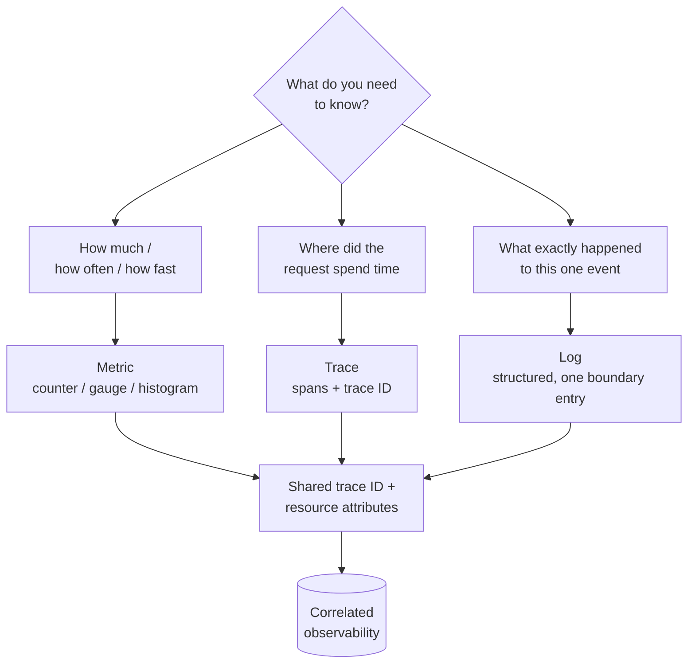

# Logging & Diagnostics — Interview Questions

> 50+ questions across all skill levels (Junior → Staff). Each harder question notes **what the interviewer is really checking**. Use as self-review or interview prep. Answers assume a production distributed system unless stated otherwise.

---

## Table of Contents

- [Junior (15 questions)](#junior-15-questions)
- [Mid (15 questions)](#mid-15-questions)
- [Senior (12 questions)](#senior-12-questions)
- [Staff (10 questions)](#staff-10-questions)
- [Trick Questions (6)](#trick-questions-6)
- [Rapid-Fire](#rapid-fire)
- [Summary](#summary)
- [Further Reading](#further-reading)
- [Related Topics](#related-topics)

---

## Junior (15 questions)

### J1. What is structured logging?

<details><summary>Answer</summary>

Emitting logs as machine-parseable key-value records (usually JSON) instead of free-text strings. `{"level":"error","msg":"payment failed","order_id":"a31","amount_cents":4200}` instead of `"payment failed for order a31, amount $42.00"`. Structured logs are queryable (`order_id="a31"`), aggregatable, and don't break when a field contains a space or comma.
</details>

### J2. Why is free-text logging a problem at scale?

<details><summary>Answer</summary>

You can't query it reliably. Finding "all failed payments over $40" requires regex against prose, which is brittle and breaks the moment someone rewords the message. Free text also loses field types — `amount` is just characters in a sentence, not a number you can filter or sum.
</details>

### J3. List the common log levels.

<details><summary>Answer</summary>

`TRACE` < `DEBUG` < `INFO` < `WARN` < `ERROR` < `FATAL` (names vary; `CRITICAL`/`PANIC` in some stacks). Levels are ordered by severity so you can set a threshold and suppress everything below it.
</details>

### J4. When do you use each level?

<details><summary>Answer</summary>

- **TRACE/DEBUG:** developer detail, off in production by default.
- **INFO:** notable business events ("order placed", "user signed up"). Normal operation.
- **WARN:** something unexpected but recoverable (retry succeeded, fell back to cache, deprecated path hit).
- **ERROR:** an operation failed and a human/automation may need to act.
- **FATAL:** the process cannot continue and is about to exit.
</details>

### J5. What are the three pillars of observability?

<details><summary>Answer</summary>

**Logs** (discrete events with context), **metrics** (numeric aggregates over time — counters, gauges, histograms), and **traces** (the path of a single request across services). Each answers a different question: logs say *what happened*, metrics say *how much / how often*, traces say *where the time went*.
</details>

### J6. What is a correlation ID (trace ID)?

<details><summary>Answer</summary>

A unique identifier attached to a request at its entry point and propagated through every service, log line, and downstream call it touches. It lets you reconstruct the full story of one request by filtering on a single value, even across dozens of services.
</details>

### J7. Why should you never log passwords, tokens, or PII?

<details><summary>Answer</summary>

Logs are widely accessible (devs, ops, SIEM, third-party log vendors), long-lived, and frequently copied. A secret in a log is a secret leaked to everyone with log access and to every backup. PII in logs also violates GDPR/CCPA/HIPAA and can trigger fines and breach-notification obligations.
</details>

### J8. What's wrong with `console.log` / `printf` debugging left in production?

<details><summary>Answer</summary>

It's unleveled (can't be filtered), unstructured, often dumps whole objects (PII risk), and adds I/O cost on hot paths. It's a debugging artifact, not an operational signal. Use a real logger at the right level, or remove it before merge.
</details>

### J9. What is log rotation and why does it matter?

<details><summary>Answer</summary>

Periodically closing the current log file and starting a new one (by size or time), then compressing/deleting old files. Without it, a log file grows until it fills the disk and takes the service down. Handled by `logrotate`, the logging framework, or the log shipper.
</details>

### J10. Should log statements have side effects?

<details><summary>Answer</summary>

No. `log.info("count: " + counter.incrementAndGet())` changes program behavior depending on log level — the increment vanishes when DEBUG is off. Logging must be observational only; never mutate state inside a log call.
</details>

### J11. What's the difference between a log and an exception?

<details><summary>Answer</summary>

An exception is a control-flow mechanism that propagates a failure up the stack; a log is a record of an event. They're related but not the same: you throw an exception to *handle* a failure and log it once where it's actually handled — not at every level it passes through.
</details>

### J12. Why is a single multi-line log entry a problem?

<details><summary>Answer</summary>

Line-based log shippers and `grep` treat each newline as a separate record, so a stack trace split across 30 lines becomes 30 unrelated "events" — breaking parsing, alerting, and correlation. Either serialize multi-line content into one structured field (escaped JSON) or rely on the framework's multi-line handling.
</details>

### J13. What does it mean for a logger to be "leveled"?

<details><summary>Answer</summary>

You can set a runtime threshold (e.g., INFO) and the logger discards anything below it cheaply, ideally before building the message. Lets you run quiet in production and turn up verbosity for a specific component when debugging.
</details>

### J14. Where should logging configuration live?

<details><summary>Answer</summary>

Outside the code — config file or environment variables — so you can change levels without redeploying. Many systems support per-logger levels and runtime reconfiguration (e.g., bump one package to DEBUG for 10 minutes).
</details>

### J15. What timestamp format should logs use?

<details><summary>Answer</summary>

ISO 8601 / RFC 3339 in UTC with millisecond (or finer) precision: `2026-06-10T14:22:05.123Z`. Unambiguous, sortable lexicographically, timezone-safe. Never log local time without an offset.
</details>

---

## Mid (15 questions)

### M1. Log, metric, or trace — for a "number of failed logins" counter?

<details><summary>Answer</summary>

A **metric** (counter). You want the rate/total over time and to alert on it — that's an aggregate, not an event you read individually. Logging each failure and counting log lines is expensive and lossy. You might *also* log a sample for forensic detail, but the counter drives the dashboard and alert.

**What's really being checked:** do you reflexively log everything, or pick the cheapest pillar that answers the question?
</details>

### M2. "Log once at the boundary" — what does it mean?

<details><summary>Answer</summary>

Log a given failure exactly once, at the layer that actually decides what to do about it (usually the request boundary or top-level handler). Inner layers propagate the error (throw/return) with context but don't log it. This avoids the same failure appearing 5 times — once per layer — which inflates volume and makes one bug look like five incidents.
</details>

### M3. What is the "log and rethrow" anti-pattern?

<details><summary>Answer</summary>

```java
catch (IOException e) {
    log.error("failed to read", e);
    throw e;             // or throw new RuntimeException(e);
}
```

The exception is logged here *and* will be logged again wherever it's finally handled — duplicate noise, multiple stack traces for one event. **Either** handle and log it, **or** add context and rethrow without logging. Don't do both.

**What's really being checked:** do you see that logging is a handling decision, not a reflex at every `catch`?
</details>

### M4. Observability vs monitoring — what's the difference?

<details><summary>Answer</summary>

**Monitoring** answers known questions with predefined dashboards/alerts ("is CPU high? is the queue backed up?"). **Observability** is the property that lets you ask *new* questions about novel failures without shipping new code — high-cardinality, richly-attributed telemetry you can slice arbitrarily. Monitoring tells you *something* is wrong; observability lets you figure out *why* the thing you never anticipated is wrong.
</details>

### M5. What is log sampling and when do you use it?

<details><summary>Answer</summary>

Recording only a fraction of high-volume, low-value events (e.g., 1 in 100 successful health checks) while keeping all errors. Used when full logging would be prohibitively expensive or would drown signal in noise. Key rule: **never sample away errors** — sample the happy path, keep the failures.
</details>

### M6. What is rate-limiting in logging?

<details><summary>Answer</summary>

Capping how often a particular log statement can fire (e.g., "this warning at most once per second per host"). Prevents a tight error loop from emitting millions of identical lines, saturating I/O, and blowing up your log bill. Often paired with a "...and N more suppressed" summary.
</details>

### M7. What is cardinality and why does it matter for metrics?

<details><summary>Answer</summary>

Cardinality is the number of distinct label/tag combinations. A metric `http_requests{status, route}` is fine; adding `user_id` or `request_id` as a label explodes cardinality into millions of time series, destroying your metrics backend's memory and cost. **High-cardinality identifiers belong in logs/traces, not metric labels.**

**What's really being checked:** do you know metrics are cheap *only* because they're aggregated, and that misuse turns them into the most expensive thing you run?
</details>

### M8. Is logging free?

<details><summary>Answer</summary>

No. Costs: string formatting and allocation, serialization, I/O (often synchronous), disk, network egress to a log vendor, indexing, and storage/retention. On a hot path, naive logging can dominate CPU and become the bottleneck. "Free" logging is a myth — every line has a marginal cost paid at write, ship, index, and retain.
</details>

### M9. Async vs sync logging — trade-offs?

<details><summary>Answer</summary>

- **Sync:** the calling thread blocks on I/O. Simple, ordering-preserving, but a slow disk or log endpoint stalls request handling.
- **Async:** the log call enqueues a message; a background thread does the I/O. Removes I/O from the hot path but adds a queue (bounded — what happens when full? drop vs block vs grow), risks losing buffered logs on crash, and complicates ordering.

Most high-throughput systems use async with a bounded ring buffer and a documented overflow policy.
</details>

### M10. How do you avoid the cost of building a debug message that won't be logged?

<details><summary>Answer</summary>

Guard expensive construction, or pass a lazy supplier:

```java
if (log.isDebugEnabled()) log.debug("state: " + expensiveDump());
// or
log.debug("state: {}", () -> expensiveDump());   // supplier not called if DEBUG off
```

Parameterized/structured logging (`log.debug("user {}", id)`) also defers formatting until the framework confirms the level is enabled.
</details>

### M11. What is redaction and where should it happen?

<details><summary>Answer</summary>

Stripping or masking sensitive fields (`"card":"****4242"`) before they hit the log sink. Best done as close to the source as possible — typed fields marked sensitive, a serializer that masks tagged fields, or a logging filter. A redaction stage at the shipper is a last-resort safety net, not the primary defense (it relies on pattern-matching prose, which misses things).
</details>

### M12. How do you propagate a correlation ID through async work?

<details><summary>Answer</summary>

Carry it in a context that travels with the work: thread-local / MDC for synchronous code, an explicit context object passed across tasks (Go `context.Context`, OTel `Context`), and inject/extract it across network boundaries via headers (W3C `traceparent`). The hard part is async hops — thread-locals don't follow a task onto a thread-pool worker, so you must explicitly capture and restore context.
</details>

### M13. What goes in a log line besides the message?

<details><summary>Answer</summary>

Timestamp (UTC), level, logger/service name, trace/span ID, and structured context: relevant IDs (order, user — hashed if PII), the operation, outcome, and timing. Aim for self-contained lines you can interpret without the surrounding code.
</details>

### M14. Why log at WARN instead of ERROR for a successful retry?

<details><summary>Answer</summary>

ERROR usually pages someone or feeds an alert. A retry that *succeeded* is not an incident — it's worth noting (WARN) but not worth waking anyone. Misusing ERROR for non-actionable events trains responders to ignore ERROR, which is how real incidents get missed (alert fatigue).
</details>

### M15. How do you test logging?

<details><summary>Answer</summary>

Treat important logs as a contract: capture output with an in-memory appender / test sink and assert that a critical event was logged at the right level with the expected structured fields. Also test that secrets are redacted. Don't over-assert on exact message wording — assert on the structured keys downstream tooling depends on.
</details>

---

## Senior (12 questions)

### S1. Design the logging strategy for a new microservice.

<details><summary>Answer</summary>

- **Structured JSON** to stdout; let the platform (Kubernetes + Fluent Bit/Vector) ship it. Don't manage files in-container.
- **Correlation/trace ID** extracted at ingress, stored in context, on every line, propagated downstream via W3C headers.
- **Levels with a policy:** INFO for business events, WARN for recoverable anomalies, ERROR for actionable failures, DEBUG off by default but runtime-togglable.
- **Log once at the boundary;** inner layers add context and propagate.
- **Redaction** of PII/secrets at the serialization layer via typed sensitive fields.
- **Sampling** on the happy path; full fidelity on errors.
- **Metrics** for rates/latencies (RED/USE), **traces** for cross-service latency. Logs are for forensic detail, not counting.

**What's really being checked:** can you allocate questions to the *right* pillar and keep cost/cardinality/security in view from day one?
</details>

### S2. When is more logging actively harmful?

<details><summary>Answer</summary>

When it drowns signal in noise (the one ERROR that matters is buried in 10k INFO lines), costs more than the insight it provides, leaks PII, stalls hot paths with synchronous I/O, or inflates retention/index bills. More logging is not more observability — it's often *less*, because it degrades signal-to-noise and slows humans at incident time.
</details>

### S3. What is OpenTelemetry and why does it matter?

<details><summary>Answer</summary>

A vendor-neutral standard (and SDKs) for generating and exporting all three signals — traces, metrics, logs — with a shared data model and context propagation (W3C Trace Context). It decouples instrumentation from backend: instrument once, send to Jaeger/Tempo/Datadog/etc. without re-instrumenting. It also unifies correlation — a log emitted inside a span automatically carries the trace/span ID.
</details>

### S4. How do you correlate logs, metrics, and traces?

<details><summary>Answer</summary>

Through shared identifiers and consistent attributes. The trace ID is the spine: stamp it on every log line and use **exemplars** to link a metric data point (e.g., a slow p99 latency bucket) to a representative trace. Consistent resource attributes (`service.name`, `service.version`, `deployment.environment`) let you pivot from a metric spike to the logs and traces of the exact instances involved. OTel makes this automatic when you use its context.
</details>

### S5. A request is slow but no errors are logged. Which pillar do you reach for?

<details><summary>Answer</summary>

**Traces.** Latency is about *where time went* across spans (DB call? downstream service? lock wait?). Logs tell you what happened but not the relative timing of each step; metrics tell you p99 is up but not which span owns it. A distributed trace breaks the request into spans and shows the critical path. Then drill into the slow span's logs for detail.

**What's really being checked:** do you map problem shape → pillar instinctively, instead of grepping logs for everything?
</details>

### S6. How do you control logging cost without losing the ability to debug?

<details><summary>Answer</summary>

- **Sample** the happy path; keep all errors.
- **Tiered retention:** hot/searchable for 7 days, cheap cold storage for the long tail.
- **Dynamic levels:** ship at INFO, raise to DEBUG just-in-time for a specific component during an investigation.
- **Trace-based (tail) sampling:** keep 100% of error/slow traces, sample the rest.
- **Move counting to metrics** so you stop paying log-indexing prices for arithmetic.
- **Cap cardinality** and drop/aggregate noisy fields at the shipper.
</details>

### S7. What is tail-based vs head-based trace sampling?

<details><summary>Answer</summary>

- **Head-based:** the decision is made at the start of the trace (e.g., keep 10%), before you know the outcome. Cheap, but you might discard the interesting ones.
- **Tail-based:** buffer spans and decide *after* the trace completes, so you can keep all errors and slow traces and sample the boring fast ones. More valuable, but requires buffering and a collector with the memory and complexity to match.
</details>

### S8. How do thread-local correlation contexts break, and how do you fix them?

<details><summary>Answer</summary>

Thread-locals (MDC) follow the *thread*, not the *work*. When work hops to a thread-pool worker (async executor, reactive pipeline, `CompletableFuture`), the new thread has the wrong or empty context, so logs lose the trace ID or pick up a neighbor's. Fixes: capture context at submission and restore it in the task (wrap the `Executor`), use framework context propagation (Reactor `Context`, OTel context instrumentation), or pass context explicitly (Go's `context.Context`, which sidesteps the problem).
</details>

### S9. Should you log every incoming request?

<details><summary>Answer</summary>

Usually no full per-request log at high volume. Capture request *metrics* (rate, latency, status) always; emit a structured access log if volume/cost allow, and **sample** it for very high traffic. Always log requests that error or exceed a latency threshold in full. A blanket "log every request body" is a cost, performance, and PII disaster.

**What's really being checked:** do you reach for metrics + sampling instead of logging every request by reflex?
</details>

### S10. How do you handle logging in a high-throughput hot path?

<details><summary>Answer</summary>

Minimize per-call work: leveled guards so disabled logs cost ~nothing, async/non-blocking appenders with a bounded buffer, pre-allocated/zero-allocation encoders (zap, zerolog), avoid string concatenation, and sample aggressively. Often the right answer is *don't log per-iteration at all* — emit a metric and a periodic summary. Verify with a profiler that logging isn't dominating CPU/allocations.
</details>

### S11. What's the relationship between SLOs and logging/telemetry?

<details><summary>Answer</summary>

SLOs are defined on **metrics** (e.g., 99.9% of requests < 300ms, error rate < 0.1%) computed from telemetry, and the error budget drives alerting. Logs and traces are the *diagnostic* layer you reach for when an SLI breaches its objective. Telemetry design should start from "what SLIs do we need?" so you instrument the right signals rather than logging arbitrarily.
</details>

### S12. How do you safely log in a regulated environment (PII/PCI/HIPAA)?

<details><summary>Answer</summary>

Classify data; treat PII/PHI/cardholder data as never-log-in-clear. Use typed sensitive fields with a serializer that masks/tokenizes them, redact at source, restrict log access (RBAC, audit who reads logs), enforce retention limits, encrypt at rest and in transit, and keep regulated logs in a controlled boundary (don't ship cardholder data to a generic SaaS log vendor). Add a CI check / linter that flags logging of fields tagged sensitive.
</details>

---

## Staff (10 questions)

### St1. How do you roll out OpenTelemetry across a large polyglot organization?

<details><summary>Answer</summary>

Standardize on OTel semantic conventions and W3C Trace Context as the propagation contract so heterogeneous services interoperate. Provide language-specific instrumentation wrappers with sane defaults (auto-instrumentation where possible). Deploy a central **OTel Collector** tier so backend choice and sampling policy are config, not code — teams export to the collector, the collector fans out. Migrate incrementally service-by-service; the shared trace context means partially-instrumented systems still produce useful (if gappy) traces.
</details>

### St2. Design a telemetry pipeline that survives a backend outage.

<details><summary>Answer</summary>

Decouple producers from the backend with a collector/agent tier that buffers (memory + disk-backed queue) and applies backpressure. Define overflow behavior explicitly: drop low-value telemetry first (DEBUG logs, sampled traces), preserve ERROR logs and error traces. Make application logging non-blocking so a downstream stall never propagates into request latency. Monitor the pipeline itself (queue depth, drop counts) — your observability system must be observable, without circular dependencies on the thing that's down.
</details>

### St3. How do you govern cardinality and cost across many teams?

<details><summary>Answer</summary>

Treat telemetry as a budgeted resource. Enforce limits at the collector (cardinality caps, label allow-lists, per-team quotas), surface cost back to teams (showback/chargeback) so the spenders feel it, and provide golden instrumentation libraries that make the cheap path the default. Review new high-cardinality labels in design, and run automated detection for cardinality explosions before they hit the backend.
</details>

### St4. When would you choose logs over metrics for the same signal, knowing logs cost more?

<details><summary>Answer</summary>

When you need the *individual events* and their full context, not just aggregates: forensic investigation, audit trails, debugging a specific user's failed request, or any case where the question is "what exactly happened to *this* one" rather than "how many / how fast overall." Metrics can't answer per-event questions; logs (or traces) can. The cost is the price of retaining individuality.
</details>

### St5. How do you design an audit log differently from an operational log?

<details><summary>Answer</summary>

Audit logs are a compliance/security record with stricter requirements: tamper-evidence (append-only, hash-chained or write-once storage), guaranteed delivery (you cannot sample or drop them), defined retention often measured in years, strict access control, and a schema that captures *who did what to what, when, from where*. Operational logs are best-effort, sampleable, and short-lived. Don't conflate the two pipelines — an audit event must never be lost to a log-buffer overflow.
</details>

### St6. How do you instrument a system to debug failures you haven't seen yet?

<details><summary>Answer</summary>

Favor wide, high-cardinality structured events (one rich event per unit of work with dozens of attributes) over many narrow log lines — this is the "observability 2.0 / wide events" idea. With enough attributes per event, you can slice by any dimension after the fact to isolate an unknown failure mode, instead of needing to have predicted it and added a counter in advance. Pair with tracing so you can localize *where*, then explore *why* across attributes.
</details>

### St7. What are the failure modes of async logging, and how do you mitigate them?

<details><summary>Answer</summary>

- **Loss on crash:** buffered logs in memory die with the process → flush on shutdown, use disk-backed queues for critical logs, keep audit logs synchronous.
- **Backpressure / unbounded growth:** queue fills → OOM or unbounded latency. Bound the queue and choose drop-oldest/drop-newest/block deliberately.
- **Reordering:** background flush reorders events → rely on timestamps, not arrival order.
- **Silent drops:** know your drop counters and alert on them.
</details>

### St8. Logs say errors spiked but metrics say error rate is flat. How do you reconcile?

<details><summary>Answer</summary>

They're measuring different things. Likely causes: the metric counts a different population (e.g., HTTP 5xx only, while logs include client 4xx and retries), logs are double-counting due to log-and-rethrow across layers, the metric is sampled/aggregated and smoothing the spike, or the log-based "error" includes WARN-level noise. Resolve by aligning definitions, fixing duplicate logging, and treating the *metric* (well-defined SLI) as the source of truth for "is this an incident," using logs for detail.

**What's really being checked:** can you reason about telemetry as data with definitions, not just trust whatever dashboard is loudest?
</details>

### St9. How do you migrate a legacy codebase from free-text to structured logging safely?

<details><summary>Answer</summary>

Incrementally, behind an adapter. Introduce a structured logging facade and route legacy calls through it, mapping the most-queried events to structured fields first (driven by what dashboards/alerts actually use). Run both formats in parallel during transition; build new dashboards on the structured stream, deprecate the free-text parsers once parity is verified. Add lint/CI rules to block new free-text logs. Don't attempt a big-bang rewrite of every call site.
</details>

### St10. How do you make logging a first-class part of API and error-handling design?

<details><summary>Answer</summary>

Decide *at design time* where each error is handled and therefore logged (the boundary), define the structured schema and trace-context propagation as part of the service contract, classify which fields are sensitive in the type system, and bake redaction + sampling into shared middleware so individual developers can't get it wrong. Logging policy lives with error-handling policy — they're the same conversation: an error is something you propagate, enrich with context, and log exactly once where you decide its fate.
</details>

---

## Trick Questions (6)

### TQ1. Is more logging always better?

<details><summary>Answer</summary>

**No.** Beyond a point it reduces observability: signal drowns in noise, cost balloons, hot paths slow down, and PII risk grows. Quality and the right pillar beat raw volume every time.
</details>

### TQ2. Should you log every request?

<details><summary>Answer</summary>

**Not in full at high volume.** Use metrics for rates/latency, sample access logs, and log in full only the requests that error or are slow. Logging every request body invites cost, latency, and PII problems.
</details>

### TQ3. A counter — log it or make it a metric?

<details><summary>Answer</summary>

**Metric.** Counting by emitting and tallying log lines is expensive and lossy. A counter metric is purpose-built for "how many / how fast." Log only a forensic sample, if anything.
</details>

### TQ4. Is logging free?

<details><summary>Answer</summary>

**No.** You pay in CPU (formatting/serialization), I/O, network egress, indexing, and storage/retention — at write *and* downstream. On hot paths logging can be the bottleneck.
</details>

### TQ5. Should you catch, log, and rethrow?

<details><summary>Answer</summary>

**No.** That double-logs one failure. Either handle and log it, or add context and rethrow *without* logging. Log once, at the boundary that decides the outcome.
</details>

### TQ6. Can you just redact secrets at the log shipper as a safety net?

<details><summary>Answer</summary>

**Only as a net, never as the primary control.** Shipper-side redaction pattern-matches prose and *will* miss things (new formats, encodings, nested fields). Redact at the source with typed sensitive fields; the shipper filter is defense-in-depth, not the plan.
</details>

---

## Rapid-Fire

| Question | Answer |
|---|---|
| Structured or free-text logs? | Structured (JSON / key-value). |
| Default production level? | INFO. |
| Level for a recoverable anomaly? | WARN. |
| Level that should page someone? | ERROR (and only actionable ones). |
| The three pillars? | Logs, metrics, traces. |
| "How much / how often"? | Metric. |
| "Where did the time go"? | Trace. |
| "What exactly happened to this one"? | Log (or trace). |
| Log a failure how many times? | Once, at the boundary. |
| High-cardinality ID as a metric label? | Never — put it in logs/traces. |
| Sample errors away? | Never; sample the happy path only. |
| PII/secrets in logs? | Never; redact at source. |
| Timestamp format? | RFC 3339 / ISO 8601 UTC. |
| Hot-path logging without sampling? | Don't — it becomes the bottleneck. |
| Instrumentation standard? | OpenTelemetry + W3C Trace Context. |
| Audit logs sampleable? | No — guaranteed delivery, append-only. |
| Observability vs monitoring? | Ask new questions vs answer known ones. |
| Async logging risk? | Loss on crash / overflow — bound the queue. |

---

## Summary

Good logging is an exercise in **discipline, not volume**. The strongest candidates show three instincts:

1. **Pick the right pillar.** Aggregates → metrics, latency → traces, individual events → logs. Don't log what a counter should count.
2. **Log once, at the boundary, with structure and context** — never log-and-rethrow, never free text, never PII/secrets, always a correlation ID.
3. **Treat telemetry as a budgeted, costed resource** — sample the happy path, cap cardinality, redact at source, and keep hot paths fast — while preserving the ability to debug the failure you didn't predict.

Logging is inseparable from error handling and observability design: an error is something you propagate, enrich, and record exactly once where you decide its fate.



---

## Further Reading

- *The Twelve-Factor App* — treat logs as event streams to stdout.
- *Distributed Systems Observability* — Cindy Sridharan (the three pillars and their limits).
- *Observability Engineering* — Majors, Fong-Jones, Miranda (wide events, high cardinality).
- OpenTelemetry documentation and W3C Trace Context specification.
- Google SRE Book — chapters on monitoring, SLOs, and alerting philosophy.

---

## Related Topics

- [Logging & Diagnostics — Junior](junior.md)
- [Logging & Diagnostics — Professional](professional.md)
- [Chapter overview](../README.md)
- [Error Handling](../06-error-handling/README.md) — where and how to log a failure once
- [Anti-Patterns](../../anti-patterns/README.md) — the logging smells to recognize and avoid
