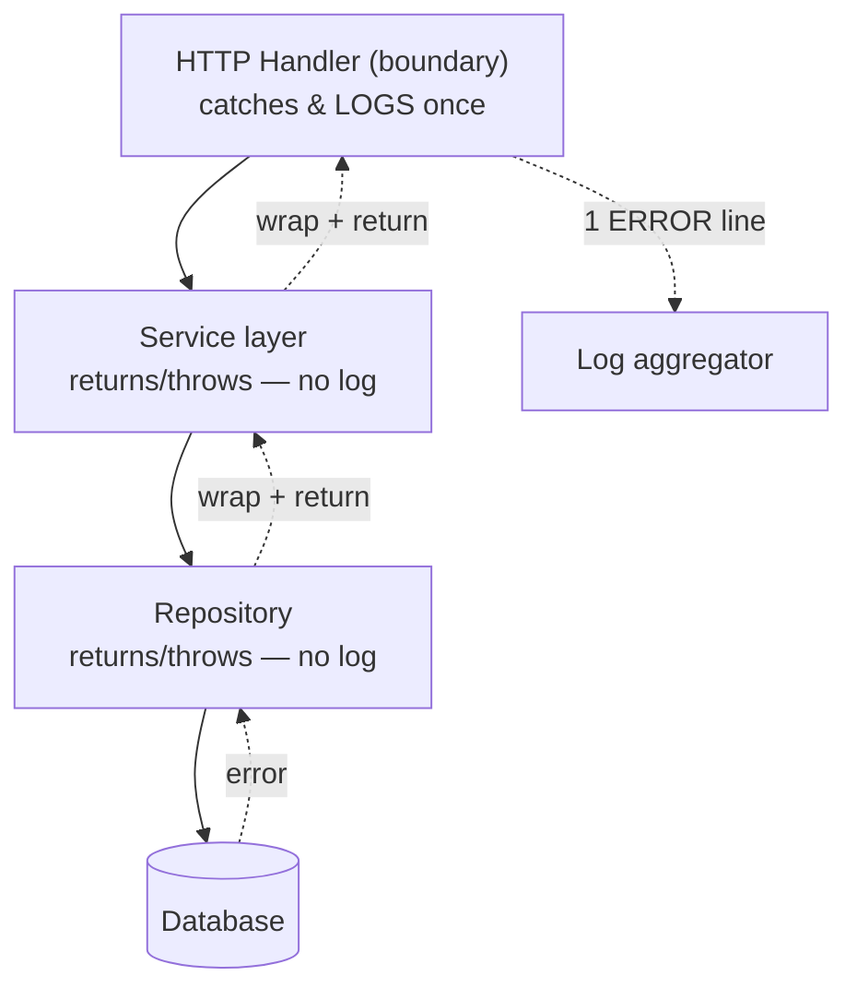

# Logging & Diagnostics — Junior Level

> **Level:** Junior — "What's the rule? Show me a clean example."
> This file teaches the everyday rules: log in **structured** key-value form, use **levels** correctly, log an event **once** at the right layer, attach a **correlation ID**, and **never** log PII or secrets. Examples in Go (`log/slog`), Java (SLF4J + Logback), and Python (`logging`).

---

## Table of Contents

1. [Why logging is a discipline, not a `print`](#why-logging-is-a-discipline-not-a-print)
2. [Real-world analogy](#real-world-analogy)
3. [Rule 1 — Log structured key-value, not free text](#rule-1--log-structured-key-value-not-free-text)
4. [Rule 2 — Use log levels correctly](#rule-2--use-log-levels-correctly)
5. [Rule 3 — Log an event once, at the boundary](#rule-3--log-an-event-once-at-the-boundary)
6. [Rule 4 — Attach context (correlation / request ID)](#rule-4--attach-context-correlation--request-id)
7. [Rule 5 — Never log PII, secrets, or tokens](#rule-5--never-log-pii-secrets-or-tokens)
8. [Rule 6 — An error log must be actionable](#rule-6--an-error-log-must-be-actionable)
9. [Rule 7 — Logs are for diagnosis, not `printf`-debugging in prod](#rule-7--logs-are-for-diagnosis-not-printf-debugging-in-prod)
10. [Common Mistakes](#common-mistakes)
11. [Test Yourself](#test-yourself)
12. [Cheat Sheet](#cheat-sheet)
13. [Summary](#summary)
14. [Further Reading](#further-reading)
15. [Related Topics](#related-topics)

---

## Why logging is a discipline, not a `print`

In a script you wrote yesterday, `print("here")` is fine — you read the output with your own eyes, then delete the line. In a running service, nobody reads logs with their eyes. **Machines** read them: a log aggregator (Loki, Elasticsearch, CloudWatch, Datadog) ingests millions of lines, indexes them, and lets an on-call engineer search them at 3 a.m. during an incident.

That changes everything. A log line is not a message to a human — it is a **data record** that some future query will filter, group, and count. If the line is free-form English, the machine can't filter it. If the level is wrong, it pages someone for nothing. If it contains a password, you have a security incident. If the same event is logged five times across five layers, the on-call engineer wastes ten minutes deciding which one is the "real" one.

> **Key idea:** A good log line answers a question someone will ask *during an incident they haven't had yet.* You write it now so future-you can `query` it later — not so present-you can `read` it now.

The rules in this file all flow from that one idea.

---

## Real-world analogy

### The flight recorder vs. the sticky note

When a pilot scribbles "engine felt weird ~3pm" on a sticky note, it helps no one after the flight. It has no timestamp you can trust, no structured fields, no link to the rest of the flight, and it gets thrown away.

A **flight data recorder** instead writes a continuous stream of *structured* records: `{altitude, airspeed, heading, engine_rpm, timestamp}`, every second, with a flight ID stamped on every record. After an incident, investigators don't *read* the recorder — they *query* it: "show me engine_rpm for flight 447 in the 90 seconds before the alert." Structure plus identity plus correct severity is what makes the data usable under pressure.

`print("here")` is the sticky note. Structured logging with levels and a correlation ID is the flight recorder. Production needs the recorder.

---

## Rule 1 — Log structured key-value, not free text

**The rule:** emit logs as **key-value pairs** (or JSON), with a short stable message and the variable data in named fields. Do *not* glue values into an English sentence with string concatenation.

Why: a log aggregator can index `user_id=4821` and let you query `user_id:4821`. It cannot reliably extract `4821` from the sentence `"User 4821 failed to log in after waiting 30ms"` — and the moment someone rewords that sentence, every dashboard built on it breaks.

### Dirty

```python
# Free text — values baked into a sentence. Ungreppable, unqueryable.
logging.info("User " + str(user_id) + " logged in from " + ip + " in " + str(ms) + "ms")
# -> "User 4821 logged in from 10.0.0.5 in 30ms"
```

You cannot ask "average login latency" or "logins per user" without writing a fragile regex against prose.

### Clean — Go (`log/slog`)

`log/slog` is the standard structured logger in Go 1.21+. The message is a stable constant; everything variable is a typed key-value pair.

```go
package main

import (
	"log/slog"
	"os"
)

func main() {
	// JSON handler: every record is one machine-parseable object.
	logger := slog.New(slog.NewJSONHandler(os.Stdout, nil))

	logger.Info("user login succeeded",
		slog.Int("user_id", 4821),
		slog.String("client_ip", "10.0.0.5"),
		slog.Duration("latency", 30_000_000), // 30ms
	)
}
// {"time":"...","level":"INFO","msg":"user login succeeded",
//  "user_id":4821,"client_ip":"10.0.0.5","latency":30000000}
```

> **Mention:** in high-throughput services many teams reach for `zap` or `zerolog` for their zero-allocation fast paths. The *style* is identical — stable message, typed fields. Start with `slog`; it is the standard and is fast enough for almost everything.

### Clean — Java (SLF4J + Logback)

Use **parameterized messages** (`{}` placeholders), never string concatenation. SLF4J only builds the final string if the level is enabled, and structured backends can capture the arguments as fields.

```java
import org.slf4j.Logger;
import org.slf4j.LoggerFactory;

public class LoginService {
    private static final Logger log = LoggerFactory.getLogger(LoginService.class);

    void onLogin(int userId, String clientIp, long latencyMs) {
        // {} placeholders: no concatenation, lazy formatting.
        log.info("user login succeeded user_id={} client_ip={} latency_ms={}",
                 userId, clientIp, latencyMs);
    }
}
```

With a JSON encoder (`logstash-logback-encoder`) configured in `logback.xml`, each record becomes a JSON object instead of a line of text — same call site, machine-readable output.

### Clean — Python (`logging` with `extra=`)

Pass structured fields via `extra=`; a JSON formatter (e.g. `python-json-logger`) turns them into fields.

```python
import logging

log = logging.getLogger("login")

log.info(
    "user login succeeded",
    extra={"user_id": 4821, "client_ip": "10.0.0.5", "latency_ms": 30},
)
```

> **Mention:** `structlog` makes this ergonomic — `log.info("user login succeeded", user_id=4821, client_ip="10.0.0.5")` — and is the common choice for new Python services. Plain `logging` with a JSON formatter works fine to start.

**Takeaway:** the *message* is a constant you can group by; the *data* lives in fields you can filter by.

---

## Rule 2 — Use log levels correctly

**The rule:** every log line has a **level**, and each level has a job. Choosing the wrong level is not cosmetic — `ERROR` typically pages a human, and `DEBUG` typically gets dropped in production. The level *is* the routing decision.

| Level | Use it for | Who sees it | Example |
|---|---|---|---|
| **ERROR** | Something failed and needs human attention; request couldn't complete | On-call (often alerts) | Payment gateway returned 500; DB connection lost |
| **WARN** | Something unexpected but handled; degraded but working | Reviewed, not paged | Retry succeeded on 2nd attempt; falling back to cache; deprecated API used |
| **INFO** | Normal, noteworthy business events | Sampled/searched later | Order placed; user registered; job completed |
| **DEBUG** | Detailed flow for diagnosing a specific problem | Devs, usually off in prod | Cache key computed; loop iteration values |

### Dirty

```python
# Everything is INFO. There is no strategy.
logging.info("starting request")
logging.info("payment FAILED: gateway timeout")   # this is an ERROR
logging.info("cache miss, key=user:4821")          # this is DEBUG noise
logging.info("retried 3 times before success")     # this is a WARN
```

When everything is `INFO`, you cannot turn down the noise without losing the failures, and you cannot alert on failures without alerting on cache misses. The level has been thrown away.

### Clean — Go

```go
logger.Debug("cache miss", slog.String("key", "user:4821"))
logger.Info("payment captured", slog.Int("order_id", 99), slog.Int("amount_cents", 4999))
logger.Warn("payment retried before success", slog.Int("attempts", 3))
logger.Error("payment failed", slog.String("reason", "gateway timeout"), slog.Int("order_id", 99))
```

### Clean — Java

```java
log.debug("cache miss key={}", "user:4821");
log.info("payment captured order_id={} amount_cents={}", 99, 4999);
log.warn("payment retried before success attempts={}", 3);
log.error("payment failed order_id={} reason={}", 99, "gateway timeout");
```

### Clean — Python

```python
log.debug("cache miss", extra={"key": "user:4821"})
log.info("payment captured", extra={"order_id": 99, "amount_cents": 4999})
log.warning("payment retried before success", extra={"attempts": 3})
log.error("payment failed", extra={"order_id": 99, "reason": "gateway timeout"})
```

> **Anti-pattern — stack traces at INFO.** A stack trace means *something broke*. Logging it at `INFO` (or worse, swallowing it and logging "done" at `INFO`) hides real failures in normal traffic and trains the on-call to ignore the logs. A stack trace belongs at `ERROR` (or `WARN` if you handled it). See [Rule 6](#rule-6--an-error-log-must-be-actionable).

---

## Rule 3 — Log an event once, at the boundary

**The rule:** a single logical event should produce **one** log line, written at the layer that owns the decision — usually the **boundary** (the HTTP handler / RPC entry, or the outermost place that catches the error). Inner layers `return` errors; they do not log them.

Why: if the repository logs "DB insert failed", the service logs "could not save order", and the handler logs "request failed", one failure becomes three lines. The on-call sees triple the volume, can't tell if it's one bug or three, and the dashboards triple-count it.

### Dirty

```python
def save_order(order):
    try:
        db.insert(order)
    except DBError as e:
        log.error("db insert failed", extra={"order_id": order.id})  # log #1
        raise

def place_order(order):
    try:
        save_order(order)
    except DBError as e:
        log.error("could not save order", extra={"order_id": order.id})  # log #2 (same event!)
        raise

# handler
try:
    place_order(order)
except Exception as e:
    log.error("request failed", extra={"order_id": order.id})           # log #3 (same event!)
```

One failed insert → three ERROR lines → the alert fires three times.

### Clean — return errors inward, log once at the edge

```python
def save_order(order):
    db.insert(order)            # raises on failure; does NOT log

def place_order(order):
    save_order(order)           # propagates; does NOT log

# handler — the boundary owns the log
def handle(request):
    try:
        place_order(request.order)
    except DBError as e:
        log.error("order persistence failed",
                  extra={"order_id": request.order.id, "error": str(e)})
        return Response(status=500)
```

The same shape in Go and Java: inner functions return / throw with context, the outermost handler decides the level and writes the single line.

```go
// Inner: wrap with context, do not log.
func saveOrder(o Order) error {
	if err := db.Insert(o); err != nil {
		return fmt.Errorf("insert order %d: %w", o.ID, err) // add context, propagate
	}
	return nil
}

// Boundary (handler): log once, here.
func handle(w http.ResponseWriter, r *http.Request, o Order) {
	if err := saveOrder(o); err != nil {
		logger.Error("order persistence failed", slog.Int("order_id", o.ID), slog.Any("err", err))
		http.Error(w, "internal error", http.StatusInternalServerError)
		return
	}
}
```

```java
// Inner: throw with context, do not log.
Order save(Order o) {
    try { db.insert(o); return o; }
    catch (SQLException e) { throw new PersistenceException("insert order " + o.id(), e); }
}

// Boundary: log once.
@ExceptionHandler(PersistenceException.class)
ResponseEntity<?> onPersistenceError(PersistenceException e) {
    log.error("order persistence failed", e);   // message + the exception (with cause chain)
    return ResponseEntity.status(500).build();
}
```

> **Rule of thumb:** *"Log or throw, not both."* If a layer re-throws (or returns) the error, it should not also log it — the catcher will. The only logging layer is the one that *handles* the error.



---

## Rule 4 — Attach context (correlation / request ID)

**The rule:** every log line for a given request must carry a shared **correlation ID** (a.k.a. request ID / trace ID), so you can retrieve *all* lines for one request with a single query. Set it once at the boundary and propagate it; don't pass it manually into every log call.

Why: in a concurrent service, log lines from hundreds of simultaneous requests are interleaved. Without an ID tying them together, you cannot reconstruct what happened to *one* user. With `request_id:abc-123` you get the whole story in one filter.

### Dirty

```python
# No correlation. These three lines could belong to any of 500 concurrent requests.
log.info("validating order")
log.info("charging card")
log.info("order placed")
```

### Clean — Go (carry it on `context`, bind it to the logger)

```go
func Middleware(next http.Handler) http.Handler {
	return http.HandlerFunc(func(w http.ResponseWriter, r *http.Request) {
		reqID := r.Header.Get("X-Request-Id")
		if reqID == "" {
			reqID = uuid.NewString()
		}
		// Derive a logger that stamps request_id on EVERY line, then stash it on ctx.
		l := slog.With(slog.String("request_id", reqID))
		ctx := context.WithValue(r.Context(), loggerKey{}, l)
		next.ServeHTTP(w, r.WithContext(ctx))
	})
}

// Downstream: pull the bound logger; no need to thread the ID by hand.
func placeOrder(ctx context.Context, o Order) {
	l := ctx.Value(loggerKey{}).(*slog.Logger)
	l.Info("order placed", slog.Int("order_id", o.ID)) // request_id is automatic
}
```

### Clean — Java (SLF4J **MDC**)

MDC (Mapped Diagnostic Context) is thread-local key-value context. Set it in a filter; every subsequent log line on that thread includes it automatically.

```java
public class RequestIdFilter implements Filter {
    public void doFilter(ServletRequest req, ServletResponse res, FilterChain chain)
            throws IOException, ServletException {
        String id = ((HttpServletRequest) req).getHeader("X-Request-Id");
        MDC.put("request_id", id != null ? id : UUID.randomUUID().toString());
        try {
            chain.doFilter(req, res);
        } finally {
            MDC.clear(); // ALWAYS clear — threads are reused across requests
        }
    }
}
// Now log.info("order placed order_id={}", id) automatically carries request_id
// (include %X{request_id} in the Logback pattern, or use the JSON encoder).
```

### Clean — Python (`logging.Filter` injecting context)

```python
import logging, contextvars

request_id_var = contextvars.ContextVar("request_id", default="-")

class RequestIdFilter(logging.Filter):
    def filter(self, record):
        record.request_id = request_id_var.get()
        return True

# Set once at the boundary (e.g. middleware): request_id_var.set("abc-123")
# Then every record gets request_id without passing it explicitly.
```

> **Why this matters:** correlation IDs are the bridge from *logging* to *tracing*. Propagate the same ID across service calls (pass the `X-Request-Id` header downstream) and you can follow one user request across your whole system.

---

## Rule 5 — Never log PII, secrets, or tokens

**The rule:** logs must never contain passwords, API keys, tokens, full credit-card numbers, full emails/phone numbers, government IDs, session cookies, or auth headers. Logs are copied into aggregators, backups, screenshares, and laptops — every place a log goes is a place that secret now lives.

This is the rule with the worst failure mode: a leaked `INFO` line can become a breach, a compliance violation (GDPR/PCI/HIPAA), and a public incident. **When in doubt, leave it out** — log an *identifier* (`user_id`), never the *secret* (`password`).

### Dirty

```python
# Catastrophic: dumps the whole request, which contains a password and a token.
log.info("login attempt", extra={"body": request.json})
# -> {"body": {"email": "ana@acme.com", "password": "hunter2",
#              "card": "4111111111111111", "auth": "Bearer eyJhbGci..."}}
```

That secret is now in your log store, your backups, and possibly a Slack paste of the log. It cannot be un-leaked.

### Clean — log identifiers and redacted/masked values

```python
def mask_email(e: str) -> str:
    name, _, domain = e.partition("@")
    return f"{name[0]}***@{domain}"          # "a***@acme.com"

def last4(card: str) -> str:
    return "****" + card[-4:]                 # "****1111"

log.info("login attempt", extra={
    "user_id": user.id,                       # safe identifier, not the email
    "email_masked": mask_email(user.email),   # masked, not raw
    "card_last4": last4(card),                # never the full PAN
    # NO password, NO token, NO auth header — they are never logged at all.
})
```

### Clean — Go: a redacting type that hides itself

Make the secret *unable* to be logged by giving it a `String()`/`LogValue()` that returns a mask. Then even an accidental `slog.Any("token", tok)` is safe.

```go
type Secret string

// LogValue is what slog prints — the real value never reaches the log.
func (s Secret) LogValue() slog.Value { return slog.StringValue("[REDACTED]") }
func (s Secret) String() string       { return "[REDACTED]" }

token := Secret("eyJhbGci...")
logger.Info("issued token", slog.Any("token", token)) // -> token=[REDACTED]
```

### Clean — Java: redact in the field, never the raw object

```java
// Log a safe identifier and a masked value; never the credential object.
log.info("login attempt user_id={} email_masked={}",
         user.id(), maskEmail(user.email()));
// Do NOT log: request bodies, Authorization headers, password fields,
// session IDs, or full PANs. Configure a logging filter to drop them if needed.
```

> **Defense in depth:** don't rely only on remembering at the call site. Add a redaction layer (a `Secret` type, a logging filter, a serializer that drops `password`/`token` keys) so a forgetful call site still can't leak. The call-site discipline is the rule; the filter is the seatbelt.

This rule connects directly to [error handling](../06-error-handling/README.md) — an exception's message or a serialized request object is a common accidental leak of PII.

---

## Rule 6 — An error log must be actionable

**The rule:** an `ERROR` line should tell whoever reads it **what failed, with what inputs, and why** — enough to start fixing it without re-running anything. If a log line can't help someone act, it shouldn't be `ERROR`.

A useless error log (`log.error("error")` or `log.error(e.getMessage())` with no context) wakes someone up and gives them nothing. Always include: the operation, the relevant identifiers, and the underlying cause (including the stack/cause chain).

### Dirty

```python
try:
    charge(order)
except Exception as e:
    log.error("error")                 # what error? where? on what?
    log.error(str(e))                  # "connection refused" — to what? for whom?
```

### Clean

```python
try:
    charge(order)
except GatewayError as e:
    log.error(
        "payment capture failed",       # WHAT operation
        extra={
            "order_id": order.id,        # WHICH entity (an ID, not PII)
            "gateway": "stripe",         # WHERE
            "amount_cents": order.total, # relevant input
        },
        exc_info=True,                   # WHY — full traceback attached
    )
```

```go
if err := charge(order); err != nil {
	logger.Error("payment capture failed",
		slog.Int("order_id", order.ID),
		slog.String("gateway", "stripe"),
		slog.Int("amount_cents", order.Total),
		slog.Any("err", err)) // err wraps the cause: "capture: post stripe: connection refused"
}
```

```java
try {
    charge(order);
} catch (GatewayException e) {
    // Passing the exception last logs the message AND the full cause chain/stack.
    log.error("payment capture failed order_id={} gateway={} amount_cents={}",
              order.id(), "stripe", order.totalCents(), e);
}
```

> **Test for an error log:** read it cold, with no other context. Can you tell *what* broke and *where to look first*? If not, add fields until you can. The stack trace says *where in the code*; the fields say *which request and which data*. You need both.

---

## Rule 7 — Logs are for diagnosis, not `printf`-debugging in prod

**The rule:** temporary debugging output (`print`, `console.log`, `fmt.Println`, `System.out.println`, `log.info("here1")`) must never ship to production. Use a debugger or `DEBUG`-level logs locally, and remove the scaffolding before merge.

Why: `print`-debugging bypasses your logger entirely — no level, no timestamp, no structure, no correlation ID, no redaction. It goes straight to stdout where it pollutes real logs, can't be filtered, and may leak whatever you dumped to inspect it. And lines like `"here1"`, `"got to checkpoint 2"`, `"x = ..."` are meaningless to anyone but the author at the moment they wrote them.

### Dirty

```go
fmt.Println("here")                 // bypasses logger entirely
fmt.Printf("DEBUG user = %+v\n", u) // dumps the whole struct (PII risk!) to stdout
log.Info("checkpoint 1")            // noise that means nothing to on-call
```

### Clean

```go
// If the detail is genuinely useful for diagnosis, make it a real DEBUG log
// with structure — off in prod, on when you flip the level to investigate.
logger.Debug("resolved user", slog.Int("user_id", u.ID)) // ID, not the whole struct
```

The same applies in Python (`logging.debug(...)` instead of `print`) and Java (`log.debug(...)` instead of `System.out.println`). The discipline:

- **Local debugging** → use a debugger / breakpoints, or temporary `DEBUG` logs you delete before commit.
- **Permanent diagnostics** → a structured `DEBUG`/`INFO` log with named fields, no PII, off in prod by default.
- **Never** → `print`/`console.log`/`Println` left in shipped code.

> **Hot-path note (preview of the middle level):** even a *proper* log statement inside a tight loop or a per-request hot path can become the bottleneck — writing millions of lines a second saturates I/O and the aggregator. The fix is **sampling** (log 1 in N) or aggregating counts, covered in [middle.md](middle.md). For now: don't log inside hot loops.

---

## Common Mistakes

| # | Anti-pattern | Why it hurts | Fix |
|---|---|---|---|
| 1 | `log.info()` for everything | No way to alert on failures or suppress noise — the level is wasted | Assign ERROR/WARN/INFO/DEBUG deliberately ([Rule 2](#rule-2--use-log-levels-correctly)) |
| 2 | Logging PII / tokens / secrets | Breach, compliance violation; can't be un-leaked | Log IDs and masked values; add a redaction layer ([Rule 5](#rule-5--never-log-pii-secrets-or-tokens)) |
| 3 | Multi-line entries (raw stack as text, pretty-printed JSON) | Breaks grep and the parser; one event becomes many "lines" | One structured record per event; attach stack via the logger's field |
| 4 | Logging the same event at every layer | Triple volume, triple alerts, can't tell 1 bug from 3 | Log once at the boundary; inner layers return/throw ([Rule 3](#rule-3--log-an-event-once-at-the-boundary)) |
| 5 | `print` / `console.log` left in prod | No level/structure/redaction; pollutes stdout; may leak data | Use a real DEBUG log, then remove scaffolding ([Rule 7](#rule-7--logs-are-for-diagnosis-not-printf-debugging-in-prod)) |
| 6 | Stack traces at INFO | Hides real failures in normal traffic; trains on-call to ignore logs | Stack traces at ERROR (WARN if handled) ([Rule 6](#rule-6--an-error-log-must-be-actionable)) |
| 7 | Free text instead of structured | Unqueryable; dashboards break on rewording | Key-value / JSON with a stable message ([Rule 1](#rule-1--log-structured-key-value-not-free-text)) |
| 8 | Hot-path logging without sampling | Logs become the bottleneck; cost explodes | Sample or aggregate; don't log inside tight loops ([Rule 7](#rule-7--logs-are-for-diagnosis-not-printf-debugging-in-prod)) |
| 9 | No correlation ID | Can't reconstruct one request from interleaved lines | Set a request ID at the boundary, propagate it ([Rule 4](#rule-4--attach-context-correlation--request-id)) |
| 10 | `log.error("error")` with no context | Wakes someone with nothing to act on | Include operation + IDs + cause ([Rule 6](#rule-6--an-error-log-must-be-actionable)) |

---

## Test Yourself

1. **Why is `log.info("User " + id + " did X")` worse than `log.info("user did X", user_id=id)`?**

<details><summary>Answer</summary>

The first bakes the value into free text. A log aggregator can't reliably extract `id` from prose, so you can't filter `user_id:4821`, group by user, or build a dashboard — and any reword of the sentence breaks whatever fragile regex was scraping it. The second keeps the message stable (groupable) and the value in a named field (filterable). Structure is what makes logs *queryable* instead of merely *readable*.
</details>

2. **A payment fails. The repository, the service, and the handler all log it at ERROR. What's wrong, and what should happen instead?**

<details><summary>Answer</summary>

One logical event produces three ERROR lines: triple the volume, the alert fires three times, and on-call can't tell whether it's one bug or three. Inner layers should **return/throw with added context and not log**; only the **boundary** (the handler that actually handles the failure) logs the single ERROR line. "Log or throw, not both."
</details>

3. **You need to debug a tricky flow in production. Is `print(f"x = {x}")` an acceptable temporary measure?**

<details><summary>Answer</summary>

No. `print` bypasses the logger: no level, no timestamp, no correlation ID, no structure, no redaction — and it may dump PII to stdout. Use a structured `DEBUG` log (toggleable in prod) with named fields and no secrets, or attach a debugger locally. Never ship `print`/`console.log`/`Println` scaffolding.
</details>

4. **Which of these belong in a log, and at what level: (a) a caught-and-retried timeout that then succeeded, (b) a user's password, (c) a DB connection lost mid-request, (d) "entered function foo"?**

<details><summary>Answer</summary>

(a) **WARN** — unexpected but handled/degraded. (b) **Never** — passwords are never logged at any level. (c) **ERROR** — the request can't complete; needs attention. (d) **DEBUG** at most, and usually not worth logging — "entered function" is `printf`-debugging noise.
</details>

5. **What single field makes interleaved logs from 500 concurrent requests usable, and where do you set it?**

<details><summary>Answer</summary>

A **correlation / request ID** (a.k.a. trace ID), set **once at the boundary** (middleware/filter) and propagated automatically — via `context` + a bound logger in Go, **MDC** in Java (SLF4J), a `logging.Filter` + `contextvars` in Python. Then `request_id:abc-123` returns the full story of one request, and forwarding the same ID downstream lets you follow it across services.
</details>

6. **Read this cold: `log.error("error: " + e.getMessage())` → "error: connection refused". Why is it a bad ERROR log?**

<details><summary>Answer</summary>

It isn't actionable. It doesn't say *what operation* failed, *for which entity*, *to what dependency*, or include the *stack/cause chain*. On-call gets paged and has nothing to act on. Fix: `log.error("payment capture failed", order_id, gateway, e)` — operation + identifiers + the exception (so the full cause chain and stack are attached).
</details>

---

## Cheat Sheet

```text
STRUCTURE   Key-value / JSON, stable message + named fields. Never concatenate values into prose.
            Go: slog.Info("msg", slog.Int("k", v))   Java: log.info("msg k={}", v)   Py: log.info("msg", extra={...})

LEVELS      ERROR = failed, needs a human (often pages)
            WARN  = unexpected but handled / degraded
            INFO  = normal noteworthy business event
            DEBUG = detailed flow, off in prod by default
            Stack traces => ERROR (or WARN), never INFO.

ONCE        Log a logical event ONCE, at the boundary (handler/RPC entry).
            Inner layers return/throw with context. "Log OR throw, not both."

CONTEXT     Correlation/request ID on every line. Set at boundary, propagate.
            Go: bound logger on ctx   Java: MDC   Py: Filter + contextvars

PII         Never log passwords, tokens, auth headers, full cards/emails, session IDs.
            Log IDs + masked values. Add a redaction layer as a seatbelt. When in doubt, leave it out.

ACTIONABLE  ERROR = WHAT failed + WHICH ids + WHY (cause/stack). Readable cold.

NO printf   No print/console.log/Println in prod. Use DEBUG logs; remove scaffolding.

HOT PATH    Don't log inside tight loops — sample or aggregate (see middle.md).
```

---

## Summary

Logging in production is a discipline because **machines**, not humans, consume the output. Five rules carry almost all of the value at the junior level:

1. **Structured, not free text** — stable message + named fields, so logs are queryable.
2. **Levels with intent** — ERROR pages, WARN is reviewed, INFO is normal, DEBUG is off in prod; stack traces are never INFO.
3. **Log once, at the boundary** — inner layers return/throw; the handler logs the single line. Log *or* throw, not both.
4. **Carry a correlation ID** — set it at the boundary, propagate it, so one request is one query.
5. **Never log PII/secrets** — IDs and masked values only; add a redaction layer as a backstop.

Plus: every ERROR must be **actionable** (what/which/why), and `print`-debugging never ships. Get these right and your logs become a flight recorder — searchable, safe, and actually useful at 3 a.m.

The [middle level](middle.md) goes deeper on log sampling, log/metric/trace boundaries, cost and cardinality, and structured-logging pitfalls at scale; the [senior level](senior.md) covers observability strategy, retention/compliance, and designing logging as a contract across a system.

---

## Further Reading

- Go: [`log/slog` package documentation](https://pkg.go.dev/log/slog) — the standard structured logger.
- Go: [`zap`](https://github.com/uber-go/zap) and [`zerolog`](https://github.com/rs/zerolog) — high-performance structured loggers.
- Java: [SLF4J manual](https://www.slf4j.org/manual.html) and [Logback documentation](https://logback.qos.ch/documentation.html); [MDC](https://logback.qos.ch/manual/mdc.html).
- Python: [`logging` HOWTO](https://docs.python.org/3/howto/logging.html) and [`structlog`](https://www.structlog.org/).
- OWASP: [Logging Cheat Sheet](https://cheatsheetseries.owasp.org/cheatsheets/Logging_Cheat_Sheet.html) — what (not) to log, securely.
- Google SRE Workbook: [Monitoring distributed systems](https://sre.google/sre-book/monitoring-distributed-systems/).

---

## Related Topics

- [Logging & Diagnostics — chapter overview](../README.md) — the full set of rules and anti-patterns.
- [Logging & Diagnostics — Middle level](middle.md) — sampling, cost/cardinality, logs vs. metrics vs. traces.
- [Logging & Diagnostics — Senior level](senior.md) — observability strategy, retention, compliance.
- [Error Handling](../06-error-handling/README.md) — closely tied: where errors are caught is where they get logged, and a common source of accidental PII leaks.
- [Comments & Documentation](../03-comments/README.md) — a log line is a kind of message to the future; the same "say what matters, no noise" discipline applies.
- [Anti-Patterns](../../anti-patterns/README.md) — `printf`-debugging and over-logging as recurring code smells.
- [Refactoring](../../refactoring/README.md) — extracting a logging boundary is a structural refactor, not a behavior change.
