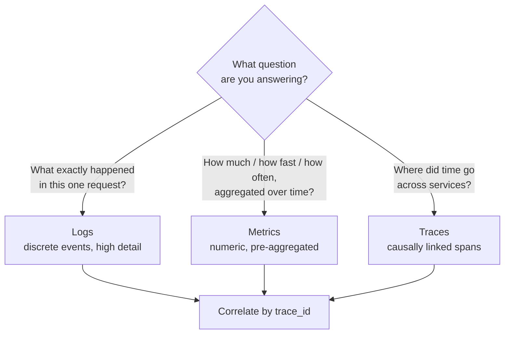
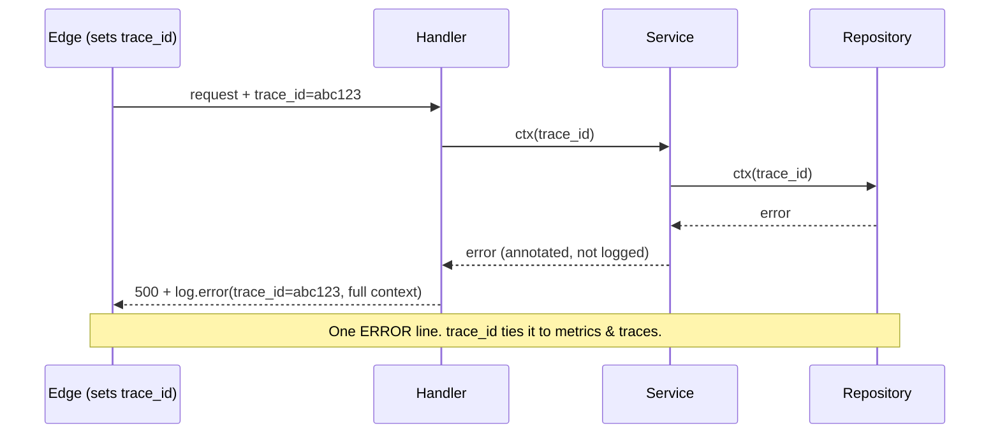

# Logging & Diagnostics — Middle Level

> Focus: "Why?" and "When does it bend?" — the trade-offs behind log levels, the three pillars, context propagation, cardinality cost, and the discipline of logging an error exactly once.

---

## Table of Contents

1. [The three pillars: logs vs. metrics vs. traces](#the-three-pillars-logs-vs-metrics-vs-traces)
2. [Log levels in practice](#log-levels-in-practice)
3. [Log once, carry context everywhere](#log-once-carry-context-everywhere)
4. [The log-and-rethrow trap](#the-log-and-rethrow-trap)
5. [Cardinality and the cost of a log line](#cardinality-and-the-cost-of-a-log-line)
6. [Sampling and rate-limiting noisy logs](#sampling-and-rate-limiting-noisy-logs)
7. [Logging in libraries vs. applications](#logging-in-libraries-vs-applications)
8. [Redaction: what to hide and how](#redaction-what-to-hide-and-how)
9. [Common Mistakes](#common-mistakes)
10. [Test Yourself](#test-yourself)
11. [Cheat Sheet](#cheat-sheet)
12. [Summary](#summary)
13. [Further Reading](#further-reading)
14. [Related Topics](#related-topics)

---

## The three pillars: logs vs. metrics vs. traces

The single most common diagnostics mistake at the 1–3 year mark is using logs for everything. Logs are one of three observability signals, and each answers a different question. Reaching for the wrong one is expensive — sometimes literally.



| Signal | Answers | Storage cost | Cardinality tolerance |
|---|---|---|---|
| **Logs** | "What happened in *this* event?" | High (every line stored) | High — arbitrary fields per line |
| **Metrics** | "How many / how fast, in aggregate?" | Low (pre-aggregated counters) | **Low** — every label combination is a new time series |
| **Traces** | "Where did the latency go across services?" | Medium (sampled spans) | Medium |

**The rule that prevents the most waste:** *don't log what should be a metric.* If you find yourself writing `log.info("request completed in {ms}ms")` so that someone can later `grep | awk` to compute a p99, you've built a metric out of log lines — the most expensive possible way to count something.

```go
// SMELL: a metric disguised as a log line. Now p99 latency requires
// scanning gigabytes of logs and parsing free text.
log.Info("checkout completed", "duration_ms", elapsed.Milliseconds())

// BETTER: emit a metric for the aggregate, a log only for the notable event.
checkoutLatency.Observe(elapsed.Seconds()) // histogram -> p50/p99 for free
if elapsed > slowThreshold {
    log.Warn("slow checkout", "duration_ms", elapsed.Milliseconds(), "order_id", id)
}
```

The decision is about *shape of question*, not importance: counting and timing aggregates → metrics; reconstructing a single incident → logs; following one request across service boundaries → traces. They meet again at the `trace_id`, which is what lets you jump from "p99 spiked" (metric) to "show me the slow requests" (logs/traces).

---

## Log levels in practice

Levels exist so that the *consumer* — an on-call engineer at 3 a.m., or a log-shipping budget — can filter. A level is a promise about who should care and when. The bug is treating levels as a vague "importance dial."

| Level | Promise | "Wakes someone up?" | Typical content |
|---|---|---|---|
| `ERROR` | A request/operation failed and a human or system must act | Often (or feeds an alert) | Unhandled failures, data loss, exhausted retries |
| `WARN` | Something is wrong but the system recovered or degraded | No, but trend matters | Retry succeeded after failure, fallback used, deprecated path hit, near-quota |
| `INFO` | A significant *business* state change happened | No | Order placed, user registered, service started |
| `DEBUG` | Developer detail for diagnosing a specific problem | No | Branch taken, intermediate values, cache hit/miss |
| `TRACE` | Firehose; per-iteration detail | No | Loop bodies, raw payloads |

**WARN vs. ERROR — the line that confuses everyone.** Ask: *did the operation ultimately fail?*

- The DB call failed but the retry succeeded → the user got their answer → **WARN** (or just a metric). Logging this as ERROR is how you get an alert channel nobody trusts.
- The DB call failed, all retries exhausted, the request returned 500 → **ERROR**.

A useful framing: **ERROR means "someone should look at this"; WARN means "if this trends up, someone should look at this."** If an ERROR fires on a perfectly healthy system many times an hour, it is mislabeled.

**When DEBUG is too much.** DEBUG is for *targeted* diagnosis, not a running narration. The failure mode is `log.debug()` on every line "to be safe." Three signs you've gone too far:

1. The DEBUG output is unreadable even *with* DEBUG enabled — it's noise burying signal.
2. Constructing the message is expensive and runs even when DEBUG is off (string concatenation, JSON serialization). Guard it: `if log.DebugEnabled()`.
3. You're logging the same loop body a million times — that's TRACE, and it should be sampled or removed.

```python
# SMELL: expensive serialization runs even when DEBUG is disabled in prod.
log.debug("incoming payload: " + json.dumps(huge_request))

# BETTER: lazy — the f-string / serialization only runs if DEBUG is on.
log.debug("incoming payload: %s", huge_request)        # %-formatting is lazy
if log.isEnabledFor(logging.DEBUG):
    log.debug("incoming payload: %s", json.dumps(huge_request))
```

---

## Log once, carry context everywhere

A request flows through layers: HTTP handler → service → repository → external client. The naive instinct is for each layer to log "I'm doing X." The result is the same logical event recorded three or four times, with none of the lines knowing they belong to the same request.

The professional pattern inverts this: **log the event once, at the layer that has the most context, and propagate a correlation ID so every signal can be stitched together.** The correlation ID (request ID / trace ID) is set once at the entry point and threaded through every call, so a single `grep trace_id=abc123` reconstructs the whole request across layers — and across services.



The mechanism differs per ecosystem, but the principle — *contextual, structured fields carried implicitly* — is identical:

**Go** — context-scoped logger. A `slog.Logger` carrying request fields rides in `context.Context`:

```go
func WithRequestLogger(ctx context.Context, base *slog.Logger) context.Context {
    l := base.With("trace_id", traceID(ctx), "user_id", userID(ctx))
    return context.WithValue(ctx, loggerKey{}, l)
}
// Deep in the repository, no parameter plumbing of fields:
LoggerFrom(ctx).Warn("retrying query", "attempt", n)  // already has trace_id, user_id
```

**Java** — MDC (Mapped Diagnostic Context), a thread-local key/value bag the logging framework injects into every line:

```java
MDC.put("trace_id", traceId);
MDC.put("user_id", userId);
try {
    // any log.* anywhere on this thread now carries trace_id & user_id
    service.process(request);
} finally {
    MDC.clear(); // critical: thread pools reuse threads; stale MDC leaks across requests
}
```

**Python** — `contextvars` + a logging filter that copies them onto each record (works correctly with asyncio, unlike thread-locals):

```python
trace_id_var = contextvars.ContextVar("trace_id", default="-")

class ContextFilter(logging.Filter):
    def filter(self, record):
        record.trace_id = trace_id_var.get()
        return True
```

> **The trade-off:** "log once" assumes the top layer *has* enough context to write a useful line. If your repository swallows the SQL state and the handler only sees a generic exception, the single top-level log is useless. The fix is **error wrapping** (annotate as the error travels up — `fmt.Errorf("query user %d: %w", id, err)` in Go, exception chaining in Java/Python), *not* logging at every layer. Carry context in the error value; log it once at the top.

---

## The log-and-rethrow trap

This is the most common logging anti-pattern in code review, and it directly contradicts "log once."

```java
// SMELL: log-and-rethrow. Logs here...
try {
    repository.save(order);
} catch (SQLException e) {
    log.error("failed to save order", e);   // ...line 1
    throw new OrderException("save failed", e);
}
// ...and the controller's catch block logs it AGAIN. Now one failure
// produces two (or three) ERROR lines with overlapping stack traces.
```

Every layer that logs *and* rethrows multiplies the failure: a single bug becomes N stack traces in the log, N times the alert volume, and an on-call engineer who can't tell whether one thing failed or N things failed.

**The discipline: at each `catch`, do exactly one of two things —**

1. **Handle it** — recover, fall back, or translate it into a user response. *Then* log it (the buck stops here).
2. **Propagate it** — wrap with context and rethrow, but **do not log**. You don't yet know if it's fatal; the layer that decides will log.

```java
// CLEAN: lower layers annotate and propagate without logging.
try {
    repository.save(order);
} catch (SQLException e) {
    throw new OrderException("save order " + order.id(), e); // context, no log
}

// The boundary that owns the response logs once, with full context:
} catch (OrderException e) {
    log.error("order pipeline failed", e);   // single ERROR, full chained trace
    return Response.status(500).build();
}
```

The two legitimate exceptions to "don't log when propagating":

- **A WARN at a retry boundary** — "attempt 2 failed, retrying" is a *different* event from the eventual ERROR, and is genuinely useful. It's WARN, not ERROR, and only fires if the retry eventually fails or is notable.
- **Crossing a boundary that erases the original** — if you hand the error to a framework that will swallow it (a thread-pool task whose exception goes nowhere), log at that frontier because no one downstream will.

---

## Cardinality and the cost of a log line

Cardinality is the number of distinct values a field can take. It is the hidden cost driver in observability, and conflating logs and metrics here is what produces shocking invoices.

**For metrics, high cardinality is catastrophic.** A metric label like `user_id` with a million users creates a million separate time series. Each series consumes memory in the metrics backend and storage forever. This is how `requests_total{user_id="..."}` quietly turns a $200/month bill into a $20,000 one.

```go
// SMELL: unbounded label -> one time series per user_id. Cardinality explosion.
requests.With(prometheus.Labels{"user_id": userID, "path": rawPath}).Inc()

// BETTER: only low-cardinality, bounded labels on metrics.
requests.With(prometheus.Labels{"route": "/users/:id", "status": "200"}).Inc()
// The high-cardinality user_id belongs on a LOG line (or trace), not a metric label.
```

The rule: **metric labels must be bounded and low-cardinality** (route templates, status codes, region, ~tens to hundreds of values). High-cardinality identifiers (`user_id`, `order_id`, `trace_id`, raw URLs with IDs) belong on **log lines and trace spans**, where you pay per stored event rather than per distinct series.

**For logs, the cost is volume × retention.** Every field on every line is stored, indexed, and shipped. A team that adds ten fields "for completeness" to a line emitted 50,000 times per second has multiplied their ingestion bill. Log lines should carry the fields that help *debug an incident*, not every variable in scope.

| Field | Put it on a... | Why |
|---|---|---|
| `route` / `status` / `method` | Metric label | Low cardinality, you aggregate on it |
| `latency_ms` | Metric (histogram) | You want percentiles, not raw values |
| `user_id` / `order_id` | Log field / trace tag | High cardinality, you query it per-incident |
| `error.kind` (bounded enum) | Metric label *and* log field | Aggregate counts + per-event detail |

---

## Sampling and rate-limiting noisy logs

Some events are individually uninteresting but collectively expensive: a hot path that logs per iteration, or an error that fires ten thousand times in a burst when a downstream dependency dies. Logging all of them at full fidelity makes the logs the bottleneck and buries the signal.

Two complementary techniques:

**Sampling** — keep a representative fraction. Useful on hot paths where you want *some* visibility without full volume. Sample at a rate, but keep all errors:

```go
// Keep every ERROR; sample the high-volume INFO/DEBUG firehose.
// (zap's sampler keeps the first N per second per message, then 1-in-M.)
cfg := zap.NewProductionConfig()
cfg.Sampling = &zap.SamplingConfig{Initial: 100, Thereafter: 100}
```

**Rate-limiting / deduplication** — collapse a burst of identical events. When a dependency fails 10,000 times in a second, you want *one* line ("downstream X failing, 10,000 occurrences in 1s"), not 10,000. A counter + periodic flush, or a "log first occurrence then suppress for N seconds" limiter, achieves this.

```python
# Collapse a burst: emit once, count the rest, flush a summary periodically.
class BurstLimiter:
    def __init__(self, window_s): self.window_s, self.seen, self.t0 = window_s, 0, time.monotonic()
    def should_log(self) -> bool:
        now = time.monotonic()
        if now - self.t0 >= self.window_s:
            if self.seen > 1:
                log.warning("suppressed %d duplicate errors in last %.0fs", self.seen - 1, self.window_s)
            self.t0, self.seen = now, 0
        self.seen += 1
        return self.seen == 1
```

> **The trade-off:** sampling means you *will* miss some lines. That is acceptable for DEBUG/INFO firehoses and even for high-volume traces, but **never sample away the only record of a rare error**. The standard policy is "sample the common, keep the rare" — log levels and sampling rates should be inversely correlated with event frequency.

---

## Logging in libraries vs. applications

This distinction is invisible until you publish a library and discover you've forced your logging choices onto every consumer.

**An application owns its observability.** It chooses the framework (zap/slog, Logback, structlog), the output format (JSON to stdout), the sink, the levels. It configures once at startup.

**A library must not.** A library that calls `logback`, picks a format, or writes to a hardcoded file fights its host application — duplicate logging configs, conflicting formats, two log files, version clashes on the logging dependency.

The rule: **a library should accept a logger (or a logging interface), not pick one.** Better still, prefer returning rich errors and exposing hooks/callbacks, so the application decides what and how to log.

```go
// SMELL: library hardcodes a logger and a global.
package payments
func Charge(...) { log.Printf("charging %v", amt) } // whose log? what format?

// BETTER: accept an interface (or slog.Logger via context); default to no-op.
package payments
type Logger interface{ Debug(msg string, kv ...any) }
type Client struct{ log Logger }
func New(opts ...Option) *Client {
    c := &Client{log: noopLogger{}} // silent by default; host opts in
    for _, o := range opts { o(c) }
    return c
}
```

The ecosystem conventions reflect this:

- **Java** — libraries depend on **SLF4J** (a *facade*), never on a concrete backend. The application supplies Logback or Log4j2 at runtime. A library shipping Logback directly is a classic mistake.
- **Python** — a library calls `logging.getLogger(__name__)` and **attaches a `NullHandler`**, emitting nothing until the application configures handlers. It must never call `logging.basicConfig()` (that's the app's job).
- **Go** — accept a `*slog.Logger` (or read one from `context`); default to a discard handler. Never log to the global default from a library.

---

## Redaction: what to hide and how

Logs are read by support engineers, shipped to third-party log vendors, and retained for months. Anything secret or personal that lands in a log line is now in all of those places. The categories to never log in the clear:

- **Credentials & secrets** — passwords, API keys, tokens, session IDs, private keys, connection strings.
- **PII / regulated data** — full payment card numbers (PCI), SSNs, health data (HIPAA), and under GDPR even emails/IPs in many contexts.
- **Whole payloads** — the lazy `log.debug(request)` that dumps an entire object is the most common way secrets leak, because it captures fields nobody audited.

**How to redact — design it in, don't grep it out:**

1. **Redact at the type boundary.** Make sensitive types refuse to print themselves. This is the most robust approach because it can't be forgotten at a call site.

```go
type Password string
func (Password) String() string  { return "[REDACTED]" }
func (Password) LogValue() slog.Value { return slog.StringValue("[REDACTED]") } // slog hook
```

```java
record CardNumber(String value) {
    @Override public String toString() { return "****" + value.substring(value.length() - 4); }
}
```

2. **Allow-list fields for structured logs**, don't deny-list. Log the specific fields you know are safe (`user_id`, `route`), rather than dumping an object and hoping you remembered to strip every secret. Deny-lists fail the moment someone adds a new sensitive field.

3. **Mask, don't drop, when you need correlation.** `user@example.com → u***@example.com`, card → last-4. You keep enough to debug without exposing the value.

> **The trade-off:** redaction reduces debuggability — a fully masked log can be useless during an incident. Resolve it by tier: mask in production sinks, but allow richer (still secret-free) detail behind DEBUG that's off by default. Never resolve it by "we'll just be careful" — that's how the next payload dump leaks tokens.

---

## Common Mistakes

1. **Logging what should be a metric.** Emitting a line per request to later compute rates/percentiles. Counting and timing are metrics; reconstructing one event is a log.
2. **Log-and-rethrow.** Logging an exception and rethrowing it, so every layer logs the same failure. Handle-and-log *or* wrap-and-propagate — never both.
3. **ERROR for recovered failures.** Logging a retry-that-succeeded as ERROR. It's WARN at most, often just a metric. Overusing ERROR destroys trust in alerts.
4. **High-cardinality metric labels.** Putting `user_id`/`order_id`/raw URLs on metric labels, exploding time-series count and the bill. Those go on logs/traces.
5. **Eager DEBUG construction.** Building expensive DEBUG messages (JSON, big string concat) that run even when DEBUG is disabled in prod. Use lazy formatting or a level guard.
6. **Libraries that pick a logger.** A library hardcoding a backend, a format, or a file path, fighting the host app. Accept a logger/facade; default to silent.
7. **MDC/context not cleared.** In thread-pool environments, failing to clear MDC leaks one request's `trace_id`/`user_id` onto the next request's logs.
8. **Dumping whole payloads.** `log.debug(request)` that captures unaudited fields — the #1 path for tokens and PII to leak into logs.
9. **No sampling on hot paths.** Per-iteration logging in a tight loop, or unbounded duplicate-error bursts, making logs the bottleneck and burying signal.
10. **Free-text instead of structured.** `log.info("user " + id + " did " + action)` — ungreppable, unindexable. Use structured key/value fields.

---

## Test Yourself

<details><summary>You see <code>log.info("request took " + ms + "ms")</code> on every request. What's wrong and what's the fix?</summary>

It's a metric disguised as a log line. To compute p99 latency you'd have to scan and parse every log line — the most expensive way to count. Replace it with a **latency histogram metric** (`observe(seconds)`), which gives you percentiles for free at near-zero storage cost. Keep a log line only for the *notable* case (e.g., a slow request over a threshold), tagged with `trace_id` so you can correlate back.
</details>

<details><summary>A teammate logs every caught exception at ERROR and rethrows it. The on-call channel is flooded. Diagnose it.</summary>

This is **log-and-rethrow** combined with **level misuse**. Each layer logging-and-rethrowing turns one failure into multiple ERROR lines with overlapping stack traces. Fix: at each catch, either *handle and log once*, or *wrap with context and propagate without logging*. Only the boundary that decides the failure is fatal logs it — exactly once. Separately, recovered/retried failures should be WARN, not ERROR.
</details>

<details><summary>Why is putting <code>user_id</code> on a Prometheus metric label dangerous, but fine on a log line?</summary>

Metrics are stored as time series, one per unique label-value combination. A high-cardinality label like `user_id` (millions of values) creates millions of series, exhausting backend memory and storage — a cardinality explosion that wrecks performance and cost. Logs are stored per-event, so a high-cardinality field is just another value on a line you were storing anyway. Rule: bounded/low-cardinality fields → metric labels; high-cardinality identifiers → logs and traces.
</details>

<details><summary>You're writing a reusable HTTP client library. How should it log?</summary>

It shouldn't pick a logger. Accept a logging interface (or read a `slog.Logger` from `context`), defaulting to a **no-op/discard** logger so it's silent until the host opts in. In Java, depend on the **SLF4J facade**, never a concrete backend. In Python, use `getLogger(__name__)` + a `NullHandler`, and never call `basicConfig()`. Prefer returning rich, wrapped errors over logging — let the application decide what's worth recording.
</details>

<details><summary>A DEBUG line does <code>log.debug("payload: " + json.dumps(req))</code>. Production runs at INFO. Is there still a cost?</summary>

Yes. The argument is built **before** the call, so `json.dumps(req)` runs on every request even though DEBUG is disabled and the result is discarded. Use lazy formatting (`log.debug("payload: %s", req)`) or guard with a level check (`if log.isEnabledFor(DEBUG)`). Eager construction of disabled-level messages is a silent CPU and allocation tax on the hot path.
</details>

<details><summary>A dependency outage causes the same error to log 10,000 times in a second. What do you do — and what must you <em>not</em> do?</summary>

Apply **rate-limiting/deduplication**: emit the first occurrence, count the rest, and flush a periodic summary ("suppressed N duplicates in last Xs"). This preserves signal without flooding. What you must **not** do is blanket-sample so aggressively that a *rare* error could be dropped — the policy is "sample the common, keep the rare." Sampling rates should be inversely correlated with event frequency.
</details>

<details><summary>Logging "log once at the top layer" assumes the top layer has context. What breaks that, and what's the real fix?</summary>

If lower layers swallow detail (the repo catches the SQL error and the handler only sees a generic exception), the single top-level log is useless. The fix is **not** to log at every layer — it's **error wrapping**: annotate the error with context as it propagates (`fmt.Errorf("...: %w", err)`, exception chaining). The context rides inside the error value; the top boundary unwraps it and logs the full chain once.
</details>

---

## Cheat Sheet

| Situation | Do this |
|---|---|
| Counting / timing / rates | **Metric**, not a log line |
| Reconstructing one request | **Log** with structured fields |
| Following a request across services | **Trace** (+ `trace_id` on logs/metrics) |
| Recovered / retried failure | **WARN** (or a metric) |
| Request ultimately failed | **ERROR**, once, at the deciding boundary |
| Caught an exception | Handle-and-log **OR** wrap-and-propagate — never both |
| High-cardinality id (`user_id`) | Log field / trace tag, **never** a metric label |
| Expensive DEBUG message | Lazy format or guard with level check |
| Library logging | Accept a logger / facade; default silent |
| Secret or PII field | Redact at the type boundary; allow-list log fields |
| Hot path / error burst | Sample the common, rate-limit duplicates, keep the rare |
| Thread-pool + MDC | Always `MDC.clear()` in `finally` |

---

## Summary

At this level the goal is judgment, not rules. The recurring theme is **putting each piece of information in the signal that's cheap to query for the question you'll actually ask**: metrics for aggregates, logs for events, traces for cross-service latency — joined by a correlation ID. Most logging waste comes from category errors: counting with logs, alerting with WARN-grade events at ERROR, exploding metric cardinality with identifiers, and logging the same failure at every layer. The disciplines that prevent this — *log once at the deciding boundary, wrap-and-propagate instead of log-and-rethrow, carry context implicitly, redact at the type boundary, and sample the common while keeping the rare* — all trade a little convenience now for an observability stack that stays affordable, greppable, and trustworthy when an incident actually hits.

---

## Further Reading

- *Site Reliability Engineering* (Google) — chapters on monitoring distinctions and the four golden signals.
- *Observability Engineering* (Majors, Fong-Jones, Miranda) — the three-pillars model and high-cardinality reasoning.
- OpenTelemetry documentation — the standard for correlating logs, metrics, and traces via shared context.
- SLF4J and Go `log/slog` documentation — facade-vs-backend separation and structured logging APIs.

---

## Related Topics

- [junior.md](junior.md) — what each level means, structured vs. free-text, the mechanics of a log line.
- [senior.md](senior.md) — observability architecture, log pipelines, retention/cost governance, SLOs.
- [Chapter README](../README.md) — the positive rules and the anti-patterns this chapter targets.
- [Error Handling](../06-error-handling/README.md) — error wrapping and boundaries, the foundation of "log once."
- [Anti-Patterns](../../anti-patterns/README.md) — broader catalog of harmful practices to recognize.
- [Refactoring](../../refactoring/README.md) — restructuring techniques for cleaning up scattered logging.
