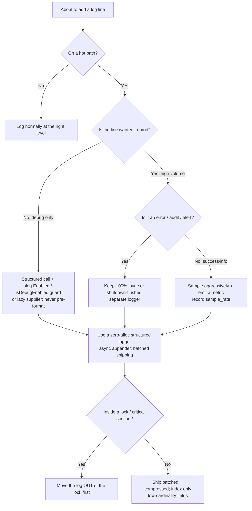

# Logging & Diagnostics — Optimize & Reconcile

> Logging is the one diagnostic that runs in production at full load. Every log line is a tax on the hot path: a string built, a struct serialized, a buffer locked, a syscall issued, garbage left for the collector. The senior skill is not "log less" — it is to pay for the diagnostics that earn their keep and refuse the ones that don't. This file works through concrete scenarios where a reasonable-looking log statement costs throughput, latency, money, or durability, and resolves each with measurement, not taste.

---

## Table of Contents

1. [Scenario 1 — The unguarded debug log on the hot path](#scenario-1--the-unguarded-debug-log-on-the-hot-path)
2. [Scenario 2 — Eager argument evaluation behind a suppressed level](#scenario-2--eager-argument-evaluation-behind-a-suppressed-level)
3. [Scenario 3 — String concatenation vs structured fields (GC pressure)](#scenario-3--string-concatenation-vs-structured-fields-gc-pressure)
4. [Scenario 4 — Zero-allocation loggers vs `fmt`/Logback](#scenario-4--zero-allocation-loggers-vs-fmtlogback)
5. [Scenario 5 — Lock contention on a shared appender](#scenario-5--lock-contention-on-a-shared-appender)
6. [Scenario 6 — Sync vs async appenders and the lost-logs-on-crash trade-off](#scenario-6--sync-vs-async-appenders-and-the-lost-logs-on-crash-trade-off)
7. [Scenario 7 — Sampling success, keeping every error](#scenario-7--sampling-success-keeping-every-error)
8. [Scenario 8 — `INFO` in a tight loop: log volume is money](#scenario-8--info-in-a-tight-loop-log-volume-is-money)
9. [Scenario 9 — High-cardinality fields blow up index cost](#scenario-9--high-cardinality-fields-blow-up-index-cost)
10. [Scenario 10 — Per-line network shipping vs batching](#scenario-10--per-line-network-shipping-vs-batching)
11. [Scenario 11 — Synchronous trace export on the request path](#scenario-11--synchronous-trace-export-on-the-request-path)
12. [Scenario 12 — Trace sampling: head, tail, and the cost of "always on"](#scenario-12--trace-sampling-head-tail-and-the-cost-of-always-on)
13. [Scenario 13 — Logging inside a lock or a deferred close](#scenario-13--logging-inside-a-lock-or-a-deferred-close)
14. [Scenario 14 — Structured serialization format: JSON vs binary vs text](#scenario-14--structured-serialization-format-json-vs-binary-vs-text)
- [Rules of Thumb](#rules-of-thumb)
- [Related Topics](#related-topics)

---

### Scenario 1 — The unguarded debug log on the hot path

A request handler runs 200k times/sec. Someone adds a diagnostic:

```go
log.Debug(fmt.Sprintf("processing order %s for customer %s with %d items", order.ID, order.CustomerID, len(order.Items)))
```

Production runs at `INFO`. The line never appears in any log file. It still costs you on every request.

**Measurement.** `fmt.Sprintf` here allocates the format string's result (one `[]byte`→`string`, ~64 B), boxes three arguments into `[]interface{}` (one slab allocation + 3 interface conversions), and runs the formatter — on a typical machine ~250–400 ns/op and 3–5 allocations *before the logger even decides to discard it*. At 200k/sec that is 50–80 ms of CPU per second per core spent formatting strings that are immediately dropped, plus sustained allocation that shortens GC cycles.

<details><summary>Resolution</summary>

The work happens *outside* the logger, so the level check inside the logger is too late. Two correct shapes:

```go
// 1. Structured call — formatting is deferred into the logger, which
//    short-circuits on level before touching the args in the common case.
log.Debug("processing order", "order_id", order.ID, "customer_id", order.CustomerID, "items", len(order.Items))

// 2. Explicit guard for genuinely expensive arguments.
if log.Enabled(ctx, slog.LevelDebug) {
    log.Debug("order dump", "order", expensiveSnapshot(order))
}
```

With Go's `slog`, a disabled `Debug` call with cheap pre-built args resolves in ~20–40 ns and **zero allocations** because the attributes are passed by value and the handler returns before allocating a record. The `fmt.Sprintf` version cannot reach that — the cost is paid in the caller. Rule: never pre-format a log message; hand the logger raw values and let it decide. Reserve explicit `Enabled` guards for arguments whose *construction* (not formatting) is expensive — a deep clone, a JSON marshal, a DB round-trip.

</details>

---

### Scenario 2 — Eager argument evaluation behind a suppressed level

Java service, SLF4J + Logback at `INFO`:

```java
log.debug("user state: " + buildFullUserGraph(userId));  // builds a 4 KB object graph
```

`buildFullUserGraph` walks the database and assembles a report. The `+` concatenation and the method call both run *before* `debug` is invoked, regardless of level.

**Measurement.** The string concat is the cheap part (~100 ns). `buildFullUserGraph` is the disaster: a few ms and several DB queries, executed on every call, for a line that is discarded. At any meaningful request rate this is a self-inflicted outage.

<details><summary>Resolution</summary>

SLF4J parameterized logging defers *formatting* but **not** argument evaluation — `buildFullUserGraph(userId)` still runs. Three escalating fixes:

```java
// A. Parameterized — fixes formatting cost, NOT evaluation cost.
log.debug("user state: {}", userGraph);   // userGraph already cheap? fine.

// B. Lazy supplier (SLF4J 2.0 fluent API) — body runs only if DEBUG enabled.
log.atDebug().setMessage("user state: {}")
   .addArgument(() -> buildFullUserGraph(userId))
   .log();

// C. Explicit guard — clearest when multiple expensive args.
if (log.isDebugEnabled()) {
    log.debug("user state: {}", buildFullUserGraph(userId));
}
```

The `() -> ...` supplier is the idiomatic answer: the lambda captures `userId` (cheap) and the expensive walk happens only when the level is live. A disabled guarded/supplier path costs ~5–15 ns (a volatile read of the effective level). The unguarded eager version costs the full query budget. Numbers to remember: parameterized `{}` logging fixes the *string-building* tax (~5–10× cheaper than `+` when the level *is* enabled); only a guard or supplier fixes the *argument-evaluation* tax.

</details>

---

### Scenario 3 — String concatenation vs structured fields (GC pressure)

A metrics-adjacent log fires on every cache miss (~50k/sec):

```python
logger.info("cache miss key=" + key + " region=" + region + " latency_ms=" + str(latency))
```

**Measurement.** Each `+` on `str` in CPython builds a new intermediate string; `str(latency)` allocates; the final message is another allocation. Five-ish short-lived objects per call. CPython's allocator is fast, but at 50k/sec that is ~250k allocations/sec feeding the cyclic GC, and the f-string/concat work runs even when an upstream filter would drop the record.

<details><summary>Resolution</summary>

Build the message with `%`-style lazy args (the stdlib `logging` module only formats if a handler accepts the record) and push variable data into structured `extra`/fields rather than the message body:

```python
# Lazy %-formatting: the format string is interpolated ONLY if the record is emitted.
logger.info("cache miss key=%s region=%s latency_ms=%.1f", key, region, latency)

# Structured (structlog / std logging extra) — keeps the message a constant,
# variable data becomes queryable fields, no in-message concatenation.
logger.info("cache miss", key=key, region=region, latency_ms=latency)
```

The constant message string is interned/reused; only the field values (already in hand) are referenced. With `logging.disable()` or a level filter, the lazy form does *no* interpolation. Across languages the principle is identical: **a log message should be a constant template plus a bag of typed fields.** A constant template is cheap to build, trivial to deduplicate downstream, and groupable in a log backend; a concatenated string is none of those and is pure GC fuel.

</details>

---

### Scenario 4 — Zero-allocation loggers vs `fmt`/Logback

A Go ingestion service logs one structured line per accepted event at `INFO` (this line *is* wanted), 300k events/sec. The naive implementation:

```go
log.Printf("accepted event id=%s type=%s size=%d", e.ID, e.Type, e.Size)
```

**Measurement.** `log.Printf` / `fmt` boxes args into `interface{}`, allocates the formatted buffer, and takes the std logger's mutex. Roughly 3–5 allocs/op and ~300–500 ns/op. At 300k/sec the allocations alone (~1M/sec) noticeably raise GC frequency and tail latency.

<details><summary>Resolution</summary>

Use a zero-allocation structured logger. Zap (`zapcore` with the `Encoder` API) and zerolog both encode directly into a reused byte buffer, type-specialized field methods avoid `interface{}` boxing, and they avoid reflection:

```go
// zerolog — encodes fields straight into a pooled buffer, 0 allocs on the hot path.
logger.Info().Str("id", e.ID).Str("type", e.Type).Int("size", e.Size).Msg("accepted event")

// zap (sugared off) — typed fields, no boxing.
logger.Info("accepted event", zap.String("id", e.ID), zap.String("type", e.Type), zap.Int("size", e.Size))
```

Published numbers are stark: zap and zerolog routinely hit **0 allocs/op** and ~100–200 ns/op for a multi-field structured line, versus `fmt`-based logging at 3–5 allocs/op and several hundred ns/op. Java's analog: `fmt`-style Logback `PatternLayout` to a `FileAppender` does string formatting + reflection on each call; switching to **Log4j2 with the async (LMAX Disruptor) appender** can exceed millions of lines/sec with near-zero per-call allocation when configured with a garbage-free layout. The reconciliation: when a structured line is genuinely wanted at high rate, the format library — not the log statement — is the lever. Pick a garbage-free, type-specialized encoder and the line becomes nearly free.

</details>

---

### Scenario 5 — Lock contention on a shared appender

A 32-core Java service routes all logs through a single synchronous `FileAppender`. Under load, profiling shows threads parked in `Logger.callAppenders`.

**Measurement.** Logback's `OutputStreamAppender` synchronizes on the appender during `doAppend` so log lines aren't interleaved. With 32 threads each logging a few lines per request at high QPS, the appender's monitor becomes a serialization point — flame graphs show 15–30% of CPU in lock acquisition / park-unpark, and p99 latency rises even though the *logging work itself* is cheap. The bottleneck is contention, not formatting.

<details><summary>Resolution</summary>

Decouple producers from the I/O thread with a lock-light, multi-producer queue:

- **Log4j2 AsyncLogger (LMAX Disruptor):** a pre-allocated ring buffer; producers do a CAS to claim a slot, a single consumer thread does the I/O. No per-line mutex; throughput scales with cores. Cost: a fixed ring-buffer of memory and the durability trade-off in Scenario 6.
- **Logback `AsyncAppender`:** wraps a sync appender behind a `BlockingQueue`. Cheaper to adopt but the queue's lock still contends under extreme load, and it *drops* lower-priority events when the queue is 80% full by default.

```xml
<!-- Log4j2: AsyncLoggerContextSelector via JVM flag, or per-logger async -->
<AsyncLogger name="com.app" level="info" includeLocation="false"/>
```

Note `includeLocation="false"`: capturing the caller's file/line/method requires walking the stack (`Throwable.getStackTrace`-class cost, ~1–5 µs/line) and is one of the largest hidden logging costs — disable it on hot paths. Go's `slog`/`zap` avoid this class of problem by buffering into per-call byte slices and writing through a single `io.Writer`; wrap the writer in a buffered, periodically-flushed sink (`bufio.Writer` + a flush goroutine) to amortize syscalls. The general resolution: a single mutex-guarded appender does not scale across cores; move to a ring buffer or sharded buffers and pay the I/O on a dedicated thread.

</details>

---

### Scenario 6 — Sync vs async appenders and the lost-logs-on-crash trade-off

After Scenario 5 the team switches everything to async. A week later the process segfaults and the last ~2 seconds of logs — including the lines that would have explained the crash — are gone.

**Measurement.** Async logging buffers records in memory (ring buffer or queue) and flushes on a background thread. If the process dies hard (OOM-kill, `SIGKILL`, native crash) the unflushed buffer is lost. At, say, 200k lines/sec with a 256k-slot ring, up to ~1.3 s of logs can be in flight. Sync logging guarantees the line is at least handed to the OS before the call returns (durability up to the OS page cache), at the cost of putting the I/O latency on the request path: a synchronous disk write is ~1–10 µs to page cache, but a blocked flush under fsync or a slow disk can stall for milliseconds.

<details><summary>Resolution</summary>

This is a deliberate durability/throughput dial, not a default:

| Mode | Throughput | Latency on caller | Crash durability |
|------|-----------|-------------------|------------------|
| Sync, unbuffered | low | high (I/O on path) | strongest |
| Sync, OS-buffered | medium | low | lost on power loss / kernel panic |
| Async ring buffer | highest | lowest | lost on hard crash (last N ms) |

Principled choice:

- **Audit / financial / security events:** synchronous, and `fsync` if regulation demands it. Correctness over throughput. Keep these on a *separate* logger so they don't drag the high-volume logger down.
- **Operational / debug logs:** async ring buffer. Losing the last second on a hard crash is acceptable; the crash itself is usually captured by the supervisor's core dump and the last *flushed* lines.
- **Hybrid:** async for `INFO`/`DEBUG`, but register a shutdown hook / `panic`-recovery flush (Log4j2 does this on JVM shutdown; in Go, `defer logger.Sync()` and a `signal.Notify` flush) so *graceful* termination loses nothing — only ungraceful crashes do.

The mistake is treating "async" as strictly better. It trades a guarantee for speed; make that trade per-log-stream, with eyes open.

</details>

---

### Scenario 7 — Sampling success, keeping every error

A payment gateway logs one line per request at `INFO`, 500k req/sec, ~99.9% success. The success lines are nearly identical and dominate volume and cost; the 0.1% of failures are the ones anyone reads.

**Measurement.** 500k lines/sec × ~400 B ≈ 200 MB/sec ≈ 17 TB/day of mostly redundant success logs. The errors — 500/sec — are ~0.1% of that, the entire diagnostic value, drowned in noise and cost.

<details><summary>Resolution</summary>

Sample the boring path, keep the interesting path whole. zap ships this as a core sampler; the policy is "log the first N of an identical message per interval, then 1 in M":

```go
// zap: log first 100 of a given level+message each second, then 1 in 100.
core := zapcore.NewSamplerWithOptions(baseCore, time.Second, 100, 100)

// Hand-rolled policy that NEVER samples errors:
func logResult(l *zap.Logger, err error, fields ...zap.Field) {
    if err != nil {
        l.Error("request failed", append(fields, zap.Error(err))...)   // 100% kept
        return
    }
    if rand.Intn(1000) == 0 {                                          // 0.1% of successes
        l.Info("request ok", append(fields, zap.Int("sample_rate", 1000))...)
    }
}
```

Always record `sample_rate` so a downstream system can multiply back up for accurate counts (sampled logs lie about volume otherwise). With 1:1000 success sampling, volume drops from 17 TB/day to ~17 GB/day for successes while **every** error is retained — a ~1000× cost cut with zero loss of diagnostic signal. The invariant: errors, security events, and anything that triggers an alert are never sampled; high-volume, low-information success events are sampled aggressively. Push raw success *counts* to a metrics system (a counter is bytes, a log line is hundreds of bytes) so sampling logs doesn't blind your dashboards.

</details>

---

### Scenario 8 — `INFO` in a tight loop: log volume is money

A batch job processes 50M rows. A developer adds, "for visibility":

```python
for row in rows:                      # 50M rows
    logger.info("processing row %s", row.id)
    process(row)
```

**Measurement.** 50M `INFO` lines at ~120 B each ≈ 6 GB per run. If the pipeline ships to a managed log backend at the common ~$0.50–$2.50 per GB ingested, this single line costs **$3–$15 per run** in ingestion alone, before retention. The lines are also useless: nobody reads 50M "processing row X" entries; they exist only to confirm the loop is running.

<details><summary>Resolution</summary>

Per-iteration logging in a hot loop is almost always wrong. Replace it with periodic progress and aggregate metrics:

```python
for i, row in enumerate(rows):
    process(row)
    if i % 100_000 == 0:                          # heartbeat every 100k rows
        logger.info("progress", processed=i, total=len(rows))
logger.info("batch complete", processed=len(rows), errors=err_count, duration_s=elapsed)
```

Now ~500 progress lines + 1 summary instead of 50M — a 100,000× reduction, a few KB instead of 6 GB. For genuine per-row diagnostics, gate behind `DEBUG` (so it's off in production) *and* sample. The cost model to internalize: a log line in a tight loop is multiplied by the loop count, and every multiplier hits CPU (formatting), GC (allocation), I/O (bytes), *and* a monthly bill (ingest + retention). "Visibility" is a metric (a counter, a gauge, a histogram of latencies), not a per-iteration log line.

</details>

---

### Scenario 9 — High-cardinality fields blow up index cost

A structured logger attaches rich context to every line:

```go
logger.Info().
    Str("request_id", reqID).      // unique per request — unbounded cardinality
    Str("user_id", userID).        // millions of distinct values
    Str("trace_id", traceID).      // unique per request
    Str("endpoint", route).        // ~50 values — bounded, fine
    Msg("handled request")
```

**Measurement.** Log backends (Elasticsearch, Loki, Datadog) index fields to make them searchable. Cost scales with *cardinality* — the number of distinct values. `endpoint` has ~50 values; cheap. `request_id`/`trace_id` are unique per request — in Loki, making these *labels* explodes the number of streams (each unique label-set is a separate stream), wrecking ingestion and query performance; in Elasticsearch, high-cardinality keyword fields bloat the index and memory. A cardinality blow-up can multiply storage and degrade query latency by 10–100×.

<details><summary>Resolution</summary>

Distinguish **index keys** (low cardinality — what you *filter/group by*) from **payload fields** (high cardinality — what you *retrieve after filtering*):

```go
// Low-cardinality => labels/indexed keys: level, endpoint, status, region.
// High-cardinality => message body / non-indexed fields: request_id, user_id, trace_id.
logger.Info().
    Str("endpoint", route).        // indexed label
    Int("status", status).         // indexed label
    Str("request_id", reqID).      // searchable payload, NOT a label
    Str("trace_id", traceID).      // join key to traces, NOT a label
    Msg("handled request")
```

In Loki, keep labels to a handful of bounded dimensions and put IDs in the line content (still grep-able via `|=`). In Elasticsearch, map IDs as `keyword` but don't aggregate on them; consider not indexing fields you never filter on (`"index": false`). The reconciliation: rich context is good and cheap to *carry*; it's expensive to *index*. Decide per field whether you filter by it (index) or only read it after filtering (don't). `trace_id` should be a high-cardinality payload field plus a link to the tracing system — not a log label.

</details>

---

### Scenario 10 — Per-line network shipping vs batching

A sidecar ships every log line to a remote collector with one HTTP POST per line.

```go
for line := range logCh {
    http.Post(collectorURL, "application/json", bytes.NewReader(line))  // one request per line
}
```

**Measurement.** Each POST is a full request: TCP/TLS handshake reuse aside, you pay per-request framing, HTTP headers (often larger than a 100 B log line), a server round-trip ack, and goroutine/connection bookkeeping. Per-line shipping at even 10k lines/sec saturates connection pools and the collector's request handler; effective throughput collapses and CPU goes to protocol overhead, not payload.

<details><summary>Resolution</summary>

Batch by size or time, whichever comes first, and compress:

```go
batch := make([][]byte, 0, 1000)
flush := func() {
    if len(batch) == 0 { return }
    body := gzipJSONLines(batch)              // newline-delimited JSON, gzipped
    http.Post(collectorURL, "application/json", body)  // one request per ~1000 lines
    batch = batch[:0]
}
ticker := time.NewTicker(time.Second)
for {
    select {
    case line := <-logCh:
        batch = append(batch, line)
        if len(batch) >= 1000 { flush() }     // size trigger
    case <-ticker.C:
        flush()                               // time trigger bounds latency
    }
}
```

Batches of ~1000 lines amortize per-request overhead by ~1000× and let gzip exploit the high redundancy of log lines (structured logs compress 8–15×). The trade-off is the same durability dial as Scenario 6: a batch buffered in memory is lost if the shipper crashes, and a line waits up to the flush interval before leaving the host. Bound the flush interval (e.g. 1 s) so latency stays predictable, and persist the batch to a local spool file if at-least-once delivery is required. This is exactly how Fluent Bit, Vector, and the OTel collector operate — batch, compress, ship, with a local buffer for resilience.

</details>

---

### Scenario 11 — Synchronous trace export on the request path

A service instrumented with OpenTelemetry exports each span the moment it ends:

```java
SimpleSpanProcessor.create(otlpExporter)   // exports synchronously, on the calling thread, per span
```

**Measurement.** `SimpleSpanProcessor` calls the exporter inline when a span ends — a network round-trip to the collector *on the request thread*. Even a fast OTLP/gRPC export is hundreds of µs to a few ms; placed on the critical path it adds directly to request latency and serializes on the exporter. Under load this is one of the worst self-inflicted latency sources because it looks like "just telemetry."

<details><summary>Resolution</summary>

Always use a batching span processor in production; export off the hot path:

```java
BatchSpanProcessor.builder(otlpExporter)
    .setMaxQueueSize(2048)              // bounded in-memory queue
    .setMaxExportBatchSize(512)         // export 512 spans per network call
    .setScheduleDelay(Duration.ofSeconds(5))
    .build();
```

The request thread does an `O(1)` enqueue (a few ns) and returns; a background thread drains the queue and exports batches. When the queue fills, spans are *dropped* rather than blocking the request — the right default (telemetry must never take down the service). `SimpleSpanProcessor` is for tests only. Same lesson as logging: the instrumentation call on the request path must be near-free; all serialization, batching, and network I/O belong on a background thread, with a bounded queue that sheds load instead of stalling callers.

</details>

---

### Scenario 12 — Trace sampling: head, tail, and the cost of "always on"

A service traces 100% of requests at 100k req/sec, each trace ~20 spans.

**Measurement.** 100k × 20 = 2M spans/sec to serialize, ship, store, and index. At ~1 KB/span that's ~2 GB/sec of trace data — bandwidth, collector CPU, and storage costs that dwarf the application's own resource use. Most of those traces are healthy and identical; their marginal diagnostic value is ~0.

<details><summary>Resolution</summary>

Sample, and choose *where* to sample by what you need:

- **Head-based sampling:** decide at the root span (e.g. 1% probability, propagated via trace context so a trace is sampled all-or-nothing across services). Cheap, simple, decided before any cost is incurred — but you might drop the one slow/erroring trace.

```java
Sampler.parentBased(Sampler.traceIdRatioBased(0.01))   // 1% head sampling, consistent across services
```

- **Tail-based sampling:** buffer complete traces at the collector and decide *after* seeing the outcome — keep 100% of traces with an error or latency over the SLO, sample 1% of the fast/healthy ones. Far better signal, but the collector must buffer every trace until it's complete (memory + latency) and run a decision policy.

Combine with the logging strategy: keep all error traces (like all error logs in Scenario 7), sample healthy ones hard. A 1% head sample cuts trace cost ~100× immediately; tail sampling recovers the rare important traces a flat head sample would lose, at the price of collector buffering. The principle is identical across logs, metrics, and traces: **retain anomalies in full, sample the steady state aggressively, and always record the sample rate so volumes can be reconstructed.**

</details>

---

### Scenario 13 — Logging inside a lock or a deferred close

A subtle one. A line that's individually cheap becomes a throughput killer by *where* it sits:

```go
func (c *Cache) Set(k string, v []byte) {
    c.mu.Lock()
    defer c.mu.Unlock()
    c.m[k] = v
    log.Info().Str("key", k).Int("size", len(v)).Msg("cache set")   // I/O while holding the lock
}
```

**Measurement.** The map write is ~50 ns. The log call — even a fast structured one — may touch a shared appender buffer or, worse, block on a full async queue or a slow disk for microseconds to milliseconds. Because it runs *inside* `c.mu`, every other goroutine contending for the cache lock waits for the log I/O. A 1 µs log stall under a hot lock can collapse a structure that should sustain millions of ops/sec; the critical section's length is now governed by the logger, not the data operation.

<details><summary>Resolution</summary>

Never do I/O — including logging — inside a critical section. Capture the values you need, release the lock, then log:

```go
func (c *Cache) Set(k string, v []byte) {
    c.mu.Lock()
    c.m[k] = v
    n := len(v)
    c.mu.Unlock()                                  // release BEFORE logging
    log.Debug().Str("key", k).Int("size", n).Msg("cache set")
}
```

Better still, this line probably shouldn't exist at `INFO` at all (Scenario 8 — it's per-operation on a hot structure); make it `DEBUG` and sampled, or drop it for a metric. The same trap appears in Java `synchronized` blocks and in `defer`-ed cleanup that logs while a lock or transaction is still open. The rule: a lock protects data, not I/O. Logging is I/O. Get the data out of the critical section first.

</details>

---

### Scenario 14 — Structured serialization format: JSON vs binary vs text

A high-throughput service must emit structured, machine-parseable logs. The instinct is JSON:

```python
logger.info("event", extra={"event": json.dumps(big_dict)})   # JSON-encode a large dict per line
```

**Measurement.** `json.dumps` of a moderate dict is microseconds and allocates a sizeable intermediate string; at high rate the encoding CPU and allocation become the dominant logging cost. Plain text (`PatternLayout`-style) is cheaper to *produce* but expensive to *parse* downstream (regex extraction, fragile, breaks on multi-line content). Binary/columnar formats (protobuf, Avro, the OTLP wire format) are cheapest to parse and most compact but unreadable by `grep` and humans on the box.

<details><summary>Resolution</summary>

Match the format to where the line is consumed, and let the *logger* do the encoding, not hand-rolled `json.dumps`:

| Format | Produce cost | Parse cost | Human/grep | Use when |
|--------|-------------|-----------|------------|----------|
| Plain text | lowest | high (regex) | excellent | local dev, tailing on the box |
| JSON lines | medium | medium | good | the default for shipped structured logs |
| Binary (protobuf/Avro/OTLP) | low–medium | lowest | none | very high volume, machine-only pipeline |

```python
# Let a structured logger encode once, with a fast encoder — not json.dumps in the message.
structlog.configure(processors=[structlog.processors.JSONRenderer()])
log.info("event", **fields)        # fields encoded by the renderer, no double-encoding
```

Two concrete wins: (1) never `json.dumps` *into* a field that the structured logger will JSON-encode again — that double-encodes and embeds escaped JSON-in-JSON, doubling cost and ruining queryability. (2) For the highest-volume machine-only streams, emit a compact binary/OTLP format and keep human-readable JSON/text only for the dev and on-box paths. The reconciliation: structured logging's value (queryable fields) is real, but pick the encoder consciously — JSON is a sensible default, text for humans, binary when volume makes JSON's CPU and bytes the bottleneck.

</details>

---

## Rules of Thumb



- **Never pre-format a log message.** Hand the logger a constant template + typed fields and let it short-circuit on level. `fmt.Sprintf`/string `+` before the call defeats every level check.
- **Defer argument *evaluation*, not just formatting.** Parameterized `{}`/`%s` logging fixes string-building; only a guard (`isDebugEnabled`) or a lazy supplier (`() -> expensive()`) avoids running expensive arguments.
- **Use a zero-allocation structured logger on hot paths.** zap/zerolog hit 0 allocs/op and ~100–200 ns/op; `fmt`/`PatternLayout` are 3–5 allocs and several hundred ns. The library is the lever.
- **Async by default for operational logs, sync for audit/financial.** Async trades crash-durability for throughput — make that trade per stream, and add a graceful-shutdown flush so only hard crashes lose lines.
- **One mutex-guarded appender does not scale across cores.** Move to a ring buffer (Log4j2 Disruptor) or buffered single-writer; disable caller-location capture (`includeLocation=false`) on hot paths.
- **Errors are never sampled; steady-state success is sampled hard.** Record `sample_rate` so volumes reconstruct. Push counts to metrics, not logs.
- **A log line in a loop is multiplied by the loop count** — across CPU, GC, bytes, and the monthly bill. Replace per-iteration logs with periodic heartbeats + a summary + metrics.
- **Index low-cardinality fields; carry high-cardinality ones as payload.** `request_id`/`trace_id` are payload + a join key, not labels.
- **Batch and compress log/trace shipping**; one request per line wastes protocol overhead, structured logs compress 8–15×.
- **Telemetry export goes off the hot path.** `BatchSpanProcessor`, not `SimpleSpanProcessor`; bounded queue that sheds load rather than stalling callers.
- **Never log inside a lock or open transaction.** A lock protects data; logging is I/O. Capture values, release, then log.

---

## Related Topics

- [find-bug.md](find-bug.md) — broken logging code to diagnose (eager evaluation, PII leaks, lost-on-crash async, multi-line breakage).
- [professional.md](professional.md) — production logging judgment: levels, context propagation, PII handling, and what to log at all.
- [README.md](../README.md) — the chapter's positive rules for logging and diagnostics.
- [../11-concurrency/README.md](../11-concurrency/README.md) — async appenders, lock contention, and queue back-pressure are concurrency problems first.
- [../../refactoring/README.md](../../refactoring/README.md) — refactoring techniques for extracting and centralizing logging concerns without re-introducing the costs above.
