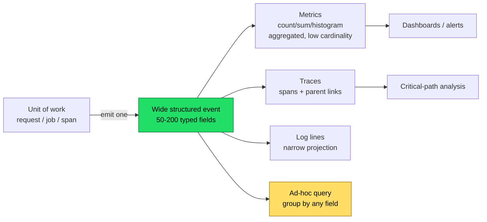

# Logging & Diagnostics — Professional Level

> Focus: "Under the hood" — observability theory, the logs-vs-events distinction, cardinality and sampling statistics, the measured cost of a log line, zero-allocation structured loggers, distributed tracing and causality, and where eBPF/continuous profiling fits.

---

## Table of Contents

1. [Three pillars is the wrong mental model](#three-pillars-is-the-wrong-mental-model)
2. [Logs vs. structured events: the wide-event argument](#logs-vs-structured-events-the-wide-event-argument)
3. [Cardinality, dimensionality, and why metrics lie](#cardinality-dimensionality-and-why-metrics-lie)
4. [Sampling: keeping signal while dropping volume](#sampling-keeping-signal-while-dropping-volume)
5. [The cost of a log line](#the-cost-of-a-log-line)
6. [Zero-allocation structured logging](#zero-allocation-structured-logging)
7. [Causality and distributed tracing](#causality-and-distributed-tracing)
8. [Clock skew and ordering](#clock-skew-and-ordering)
9. [Continuous profiling and eBPF: the emerging pillar](#continuous-profiling-and-ebpf-the-emerging-pillar)
10. [Common Mistakes](#common-mistakes)
11. [Test Yourself](#test-yourself)
12. [Cheat Sheet](#cheat-sheet)
13. [Summary](#summary)
14. [Further Reading](#further-reading)
15. [Related Topics](#related-topics)

---

## Three pillars is the wrong mental model

The popular framing — "observability is metrics, logs, and traces" — is a vendor taxonomy of *data formats*, not a definition. Charity Majors' working definition is sharper and worth memorizing:

> Observability is the ability to ask **new questions** of your system — questions you did not anticipate when you instrumented it — without shipping new code. ([Majors, Fong-Jones, Miranda, *Observability Engineering*, O'Reilly 2022](https://www.oreilly.com/library/view/observability-engineering/9781492076438/))

The control-theory root: a system is *observable* if its internal state can be inferred from its external outputs. The practical test for a service: when a customer reports "checkout is slow for me but not for everyone," can you slice your telemetry by `customer_id`, then by `region`, then by `build_sha`, then by `payment_provider` — arbitrary dimensions, in any order, after the fact? If you have to deploy a new metric or grep for a string you didn't think to log, the system is not observable; it is merely *monitored*.

This reframes the three pillars as an implementation detail. The unit that actually matters is the **arbitrarily-wide structured event**: one record per unit of work, carrying every dimension you might later want to filter or group by. Metrics and traces are derivable *projections* of those events; pre-aggregated metrics are not.



The arrow direction is the whole point: emit the rich event *first*, project down to metrics/logs/traces second. Teams that emit narrow logs first and try to reconstruct events later are fighting entropy.

---

## Logs vs. structured events: the wide-event argument

A traditional log is a sequence of *moments*: "entered handler", "fetched user", "cache miss", "query took 412ms", "returned 200". Each line is narrow (one fact) and there are many per request. To answer "what's slow for customer X," you must `JOIN` lines by request ID, in your head or in a query engine, after the fact.

A **wide event** is a sequence of *units of work*: one record per request that accumulates fields as the request executes, flushed once at the end:

```go
// Go: accumulate a wide event over the request lifetime, emit once.
type Event struct {
    fields map[string]any
    mu     sync.Mutex
}

func (e *Event) Add(k string, v any) {
    e.mu.Lock(); e.fields[k] = v; e.mu.Unlock()
}

func Handler(w http.ResponseWriter, r *http.Request) {
    ev := &Event{fields: map[string]any{}}
    defer logger.EmitEvent(ev) // single structured emit, end of request

    ev.Add("http.route", "/checkout")
    ev.Add("customer.id", r.Header.Get("X-Customer"))
    ev.Add("customer.tier", lookupTier(r))      // a dimension you can slice by

    t := time.Now()
    user, err := fetchUser(r.Context())
    ev.Add("db.fetch_user_ms", time.Since(t).Milliseconds())
    ev.Add("db.cache_hit", err == nil)
    // ... 40 more fields ...
    ev.Add("http.status", 200)
}
```

Why one wide event beats twenty narrow lines:

- **No reconstruction.** Every field shares a row. `GROUP BY customer.tier` is a single query, not a self-join across lines correlated by request ID.
- **Constant emit cost.** One I/O event per request instead of N. The hot path does in-memory `map` writes (cheap) and one flush.
- **The fields you'll wish you had.** Add `build_sha`, `feature_flags`, `db_pool_wait_ms`, `upstream_retry_count` once. They cost almost nothing until the day a regression correlates with exactly one of them.

The cost is field discipline (you need a schema or at least naming conventions; see [OpenTelemetry semantic conventions](https://opentelemetry.io/docs/specs/semconv/)) and a backend that handles high cardinality — which is where metrics traditionally fall over.

---

## Cardinality, dimensionality, and why metrics lie

**Cardinality** = number of distinct values a field can take. `http.status` is low-cardinality (~5 values). `customer.id` is high-cardinality (millions). `trace.id` is unbounded.

**Dimensionality** = number of fields per event. A wide event is high-dimensionality (100+ fields).

A time-series metric is stored as one series *per unique combination of label values*. The storage cost is the product of label cardinalities — a **combinatorial explosion**:

```
requests_total{route, status, region, customer_id}
  = |routes| × |statuses| × |regions| × |customers|
  = 50 × 5 × 10 × 1_000_000 = 2.5 billion series
```

Prometheus, in production, will OOM long before this. Its own guidance: *keep label cardinality under a few hundred per metric, and never use unbounded labels like user ID or full URL* ([Prometheus: instrumentation best practices](https://prometheus.io/docs/practices/instrumentation/#do-not-overuse-labels)). So you drop `customer_id`. Now `requests_total` is cheap — and you have aggregated away the exact dimension you need when one customer is having a bad time.

This is the core failure: **aggregation destroys the outliers.** A p99 latency metric tells you the 99th percentile is 800ms. It cannot tell you *which* requests those were, or what they had in common, because the individual events were summed into a counter at write time. The information is gone — not hidden, gone.

Worse, percentiles do not aggregate. You cannot average two pods' p99s to get the fleet p99; you'd need the underlying distributions ([Gil Tene, "How NOT to Measure Latency"](https://www.youtube.com/watch?v=lJ8ydIuPFeU); coordinated omission is the related sin). HDR histograms (`HdrHistogram`, Prometheus native histograms) merge correctly because they keep buckets, not point estimates — but they still can't tell you the *attributes* of the slow requests.

The resolution: metrics for cheap, low-cardinality SLO tracking and alerting; wide events for arbitrary-cardinality investigation. Do not try to make metrics answer high-cardinality questions — that's what the event store is for.

---

## Sampling: keeping signal while dropping volume

At scale, storing every event is uneconomical. Sampling is mandatory — but naive uniform sampling (keep 1 in N) throws away rare errors, which are the events you most want. Correct sampling is *biased toward signal* while staying *statistically reconstructable*.

### Head vs. tail sampling

- **Head sampling** decides at span/event creation, before the outcome is known. Cheap (no buffering), but blind — you can't "keep all errors" because the error hasn't happened yet. The sampling decision propagates down the trace so the whole trace is kept or dropped consistently.
- **Tail sampling** buffers all spans of a trace until it completes, then decides using the *outcome*: keep if any span errored, latency > threshold, or it hit a rare route. Accurate, but requires holding spans in memory (a collector with a time-window buffer) and breaks if spans of one trace land on different collector instances ([OpenTelemetry: tail sampling processor](https://opentelemetry.io/docs/concepts/sampling/#tail-sampling)).

### Dynamic / priority sampling

Honeycomb's approach: sample *rates per key*, biased so rare-but-interesting traffic survives. Keep 100% of errors and slow requests; keep 1-in-1000 of fast HTTP 200s. Each retained event carries a **sample rate** field so the backend can reweight:

```
true_count = Σ (sample_rate of each retained event)
```

If you keep 1 of 1000 fast requests, each retained fast event "stands for" 1000, so counting it as 1000 reconstructs the true volume — an unbiased estimator of the total even though you stored 0.1% of them. This only works if you *store the rate*; a sample without its weight is statistically useless ([Honeycomb: dynamic sampling](https://docs.honeycomb.io/manage-data-volume/sample/)).

```python
# Python: priority sampling — always keep errors & slow, downsample the rest.
import random

def sample_rate_for(event: dict) -> int:
    if event.get("error"):            return 1     # keep all
    if event["duration_ms"] > 500:    return 1     # keep all slow
    if event["status"] == 200:        return 1000  # keep 1 in 1000
    return 50

def should_keep(event: dict) -> bool:
    rate = sample_rate_for(event)
    if random.random() < 1 / rate:
        event["meta.sample_rate"] = rate   # MUST persist the weight
        return True
    return False
```

Statistical correctness checklist:
- **Consistent trace decision.** Sample by `trace_id` hash so all spans of a trace share the verdict (no orphan spans).
- **Persist the rate.** Reweighting needs it; COUNT/SUM/percentile estimates are otherwise biased low.
- **Bias is fine; silence is not.** It's correct to oversample errors *as long as* the reweighting accounts for the different rates per bucket.

---

## The cost of a log line

A log statement is not free, and the dominant cost is usually not the I/O — it's *building a message that then gets filtered out*.

### The string you built and threw away

```java
// BAD: the message is constructed (concatenation + toString + autoboxing)
// BEFORE isDebugEnabled() is checked. If DEBUG is off, all that work is wasted.
log.debug("processing order " + order.getId() + " for " + customer.toString()
          + " items=" + items.size());
```

If the level is INFO, `order.getId()`, `customer.toString()`, the `+` concatenations, the `StringBuilder` allocation, and the autoboxing of `items.size()` all execute, produce a `String`, and that `String` is then discarded inside `log.debug`. In a hot loop this is pure waste, and `customer.toString()` may itself be expensive.

Three idiomatic fixes:

```java
// 1. Guard (only worth it when arg construction is genuinely expensive)
if (log.isDebugEnabled()) {
    log.debug("processing order {} customer {}", order.getId(), customer);
}

// 2. Parameterized message — slf4j defers the toString() until it knows
//    the level will actually emit. No string built if DEBUG is disabled.
log.debug("processing order {} customer {}", order.getId(), customer);

// 3. Lazy supplier (Log4j2 2.4+, slf4j 2.0 fluent API) — defers the work itself.
log.atDebug().setMessage("expensive {}").addArgument(() -> expensiveDump()).log();
```

Parameterized logging (`{}` placeholders) is the baseline correct form: the format string is a constant, the args are passed by reference, and `toString()`/formatting only happen if the message will be emitted. The guard adds value only when *computing an argument* (not just formatting it) is costly.

### Synchronous vs. asynchronous appenders

A synchronous appender holds a lock and blocks the calling thread on the I/O write. Under load, every logging thread contends on that one lock — the logger becomes a serialization point and a latency tail amplifier. Asynchronous appenders hand the event to a ring buffer and let a background thread drain it:

- **Log4j2 AsyncLogger** uses the LMAX Disruptor (a lock-free ring buffer), achieving ~6-10× the throughput of synchronous logging and far lower latency variance ([Log4j2: Async Loggers](https://logging.apache.org/log4j/2.x/manual/async.html)).
- Trade-off: a full buffer must either **block** (back-pressure, restoring the bottleneck) or **drop** (lose logs). Pick deliberately; for audit logs, block; for debug spew, drop.
- On crash, events still in the buffer are **lost** unless you flush on shutdown.

### The allocation problem

Classic loggers allocate per call: the formatted `String`, the `LogEvent` object, boxed primitives, the `varargs Object[]`. At millions of logs/sec this GC pressure shows up as allocation-rate spikes and longer GC pauses — logging perturbs the very latency you're trying to measure (an observer effect). This is the problem zero-allocation loggers were built to solve.

---

## Zero-allocation structured logging

`zap` (Go) and `zerolog` (Go) are designed around one idea: **never allocate on the logging path, and never format until (and unless) you emit.** They achieve this by writing field values directly into a reused byte buffer as typed key-values, skipping `interface{}` boxing and `fmt`'s reflection.

```go
// zerolog: chained typed methods append directly to a []byte buffer.
// No interface{} boxing, no reflection, no intermediate string.
logger.Info().
    Str("route", "/checkout").
    Int("status", 200).
    Dur("latency", elapsed).
    Str("customer_id", id).
    Msg("request complete")
// If logger level > Info, the whole chain is a no-op on a disabled-event
// sentinel — zero work, zero allocation.
```

How the zero-alloc property is achieved (per [zap's design notes](https://github.com/uber-go/zap#performance) and zerolog's source):

- **No `interface{}`.** `fmt.Sprintf("%v", x)` boxes `x` into an `interface{}` (an allocation) and reflects on it. Typed methods (`.Int`, `.Str`, `.Dur`) know the type statically and call a type-specific encoder — no boxing, no reflection.
- **Buffer pooling.** Encoders use `sync.Pool` to reuse byte buffers across log calls, so the buffer for the JSON line isn't reallocated each time.
- **Disabled-level short circuit.** A log below the configured level returns a no-op event; the field methods on it do nothing. The arguments are still *evaluated* by Go (it's not lazy like a guard), so for truly expensive args you still guard with `if e := logger.Debug(); e.Enabled() { ... }`.

zap's benchmarks show ~0 allocs/op for a typical structured line versus dozens for `logrus`/stdlib with `fmt`. The lesson generalizes: **structured-from-the-source is faster than text**, because text logging's "format a human string then maybe parse it back into fields downstream" does the work twice. JSON/structured output is also what makes the wide-event model practical at volume.

Java's equivalent is Log4j2's **garbage-free mode** (`log4j2.enableThreadlocals=true`, `log4j2.enableDirectEncoders=true`), which reuses `StringBuilder`s and encodes directly to `ByteBuffer`s in a thread-local, avoiding per-log allocation ([Log4j2: garbage-free logging](https://logging.apache.org/log4j/2.x/manual/garbagefree.html)). Python's `structlog` gives structured events but, on CPython, can't escape per-call dict and object allocation — the cost model there is dominated by interpreter overhead, not GC, so the mitigation is *log less on hot paths*, not micro-optimize the logger.

---

## Causality and distributed tracing

In a distributed system, a single user action fans out across services. A log line in service C is meaningless without knowing it was caused by a request that entered at service A. **Tracing** reconstructs that causal tree.

The foundational design is Google's **Dapper** ([Sigelman et al., "Dapper, a Large-Scale Distributed Systems Tracing Infrastructure," Google 2010](https://research.google/pubs/pub36356/)). Its core concepts, now standardized in [OpenTelemetry](https://opentelemetry.io/docs/concepts/signals/traces/) and the [W3C Trace Context](https://www.w3.org/TR/trace-context/) header spec:

- **Trace** — the whole tree for one root request, identified by a `trace_id`.
- **Span** — one operation (an RPC, a DB query), with a `span_id`, a `parent_span_id`, a start time, and a duration. Spans nest to form the causal tree.
- **Context propagation** — the `trace_id` + current `span_id` travel *with the request* across process boundaries, carried in the `traceparent` HTTP header (or message metadata). This is what stitches service C's span to service A's trace.

```mermaid
sequenceDiagram
    participant API as API (root span)
    participant Auth
    participant Pay as Payment
    participant DB
    API->>Auth: traceparent: 00-{trace}-{spanA}-01
    Auth-->>API: 200
    API->>Pay: traceparent: 00-{trace}-{spanB}-01
    Pay->>DB: traceparent: 00-{trace}-{spanC}-01
    DB-->>Pay: rows
    Pay-->>API: charged
    Note over API,DB: All four spans share one trace_id;<br/>parent links rebuild the causal tree
```

The non-obvious engineering points:

- **Propagation is the hard part.** Every hop — HTTP client, message queue producer, goroutine/thread boundary, async callback — must forward the context. A dropped context creates an *orphan trace* (a broken tree). In Go, the context rides in `context.Context`; in Java, an OTel `Context` plus a `ThreadLocal` Scope; in async code you must explicitly re-attach it across the await boundary.
- **Sampling decision must propagate too** (the `traceparent` sampled flag), or you get half-traces.
- **A trace is just a structured event with parent links.** The same wide-event store can hold spans; tracing and high-cardinality querying are the same substrate.

---

## Clock skew and ordering

Spans carry timestamps from *different machines*, whose clocks drift. NTP keeps wall clocks within ~1-10ms of each other in practice — but span durations are often sub-millisecond, so a child span can appear to start *before its parent* or end after a sibling that it actually preceded. You cannot derive causal order from wall-clock timestamps across hosts.

This is why distributed systems use **logical clocks** for ordering, not physical time:

- **Lamport timestamps** ([Lamport, "Time, Clocks, and the Ordering of Events," CACM 1978](https://lamport.azurewebsites.net/pubs/time-clocks.pdf)) give a partial order consistent with causality: if A causally precedes B, then `L(A) < L(B)`.
- **Vector clocks** capture concurrency: they can tell whether two events are causally ordered *or genuinely concurrent*.
- Tracing sidesteps this for the tree structure by relying on **explicit parent links** (the `parent_span_id`), not timestamps — the causal edge is recorded directly, so you don't *infer* causality from clocks. Timestamps are used only for *durations within a single host* (where one clock is consistent) and for rough cross-host alignment, never for cross-host ordering.

Practical rule: trust `parent_span_id` for "what caused what"; treat cross-host timestamp comparisons as approximate (±NTP error); never alert on "span B's start < span A's start" as if it were a bug.

---

## Continuous profiling and eBPF: the emerging pillar

Logs, metrics, and traces tell you *that* a request was slow and *where in the service graph*. They rarely tell you *which line of code* burned the CPU. That gap is filled by **continuous profiling**: sampling stack traces across the whole fleet, all the time, at low overhead, and storing them as queryable data ([Google-Wide Profiling, Ren et al., IEEE Micro 2010](https://research.google/pubs/pub36575/) is the original; [Parca](https://www.parca.dev/), [Pyroscope/Grafana](https://grafana.com/docs/pyroscope/), [Polar Signals](https://www.polarsignals.com/) are modern implementations).

**eBPF** (extended Berkeley Packet Filter) makes this cheap and language-agnostic. eBPF programs run sandboxed in the Linux kernel, attached to events (a timer, a syscall, a network packet). A profiler attaches an eBPF program to a perf timer interrupt, walks the stack of whatever is currently on-CPU, and aggregates — *without modifying or instrumenting the target application at all*. The same mechanism observes syscalls, network flows, and scheduler latency:

- **No code changes, no redeploy** — eBPF reads stacks from the kernel side, so it profiles any process, any language, including third-party binaries.
- **~1-3% overhead** at typical sampling rates (e.g., 19-100 Hz), low enough to run in production continuously.
- Frame-pointer or DWARF-based unwinding rebuilds the stack; the output is a **flame graph** ([Brendan Gregg's flame graphs](https://www.brendangregg.com/flamegraphs.html)) aggregated over time and sliceable by service, version, and node.

Why this is "the next pillar": it's the only signal that ties resource cost back to *source code* across the fleet without instrumentation, and it composes with tracing — you can pivot from a slow span to the on-CPU flame graph for that span's time window. Logs-based debugging ("add a log line, redeploy, wait for it to recur") is the slow loop continuous profiling and high-cardinality events are designed to replace: you ask the question of already-captured data instead of shipping code to capture it.

---

## Common Mistakes

1. **Treating metrics as the investigation tool.** Pre-aggregated metrics answer "is it broken?" not "why, for whom?" High-cardinality questions belong to the event store. Adding `customer_id` as a Prometheus label to "fix" this causes a cardinality explosion and OOM.
2. **Sampling without storing the sample rate.** A retained event with no weight cannot be reweighted; every COUNT/SUM/percentile derived from it is biased low and silently wrong.
3. **Uniform sampling that drops errors.** 1-in-N sampling discards rare errors at the same rate as common successes — exactly inverted from what you want. Use priority/dynamic sampling.
4. **Building the log message before the level check.** String concatenation, `toString()`, and boxing run even when the line is filtered. Use parameterized logging; guard only expensive *argument computation*.
5. **Synchronous logging on the hot path.** A locked, blocking appender turns the logger into a serialization point and a latency-tail amplifier under load. Use async appenders, and decide block-vs-drop deliberately.
6. **Free-text logs at volume.** Text must be parsed back into fields downstream — doing the work twice. Emit structured (JSON / key-value) from the source so it's queryable without regex.
7. **Many narrow log lines per request instead of one wide event.** Forces self-joins by request ID and multiplies emit cost. Accumulate fields, emit one event per unit of work.
8. **Dropping trace context across an async boundary.** A goroutine, thread pool, or `await` that doesn't carry the context produces orphan spans and broken traces.
9. **Inferring cross-host causality from timestamps.** Clock skew makes children appear to precede parents. Trust `parent_span_id`, not wall-clock comparisons.
10. **Logging PII / secrets in events.** High-cardinality wide events are *more* dangerous here because they capture everything — redact tokens, card numbers, and PII at the emit boundary, not in a downstream scrubber you might forget.

---

## Test Yourself

1. **Why can't you average two pods' p99 latencies to get the fleet p99?**

<details><summary>Answer</summary>

Percentiles are not linear and do not compose: the p99 of a union is not the average (or any function) of the components' p99s. To get the true fleet p99 you need the underlying *distributions* — keep histograms (HDR / Prometheus native histograms) whose buckets merge correctly, or query the raw events. Averaging point-estimate percentiles is statistically meaningless and routinely understates the real tail (Gil Tene, "How NOT to Measure Latency").

</details>

2. **A team adds `customer_id` and `url` as Prometheus labels to debug a per-customer slowdown. What happens?**

<details><summary>Answer</summary>

Cardinality explosion. Series count is the *product* of label cardinalities; `customer_id` (millions) × `url` (effectively unbounded) creates millions-to-billions of time series, OOM-ing the TSDB. High-cardinality dimensions belong in a wide-event / columnar store, not metric labels. Prometheus' own guidance caps label cardinality at a few hundred per metric.

</details>

3. **You sample 1-in-1000 fast requests and 1-in-1 errors. How do you get an unbiased total request count?**

<details><summary>Answer</summary>

Store the sample rate on each retained event and sum the rates instead of counting rows: `true_count = Σ sample_rate`. Each retained fast request carries rate 1000 (stands for 1000); each error carries rate 1. Summing the weights is an unbiased estimator of the true volume despite storing a biased subset. Without the persisted rate the reconstruction is impossible.

</details>

4. **`log.debug("x=" + heavyToString(obj))` — why is this wasteful even when DEBUG is off, and what's the fix?**

<details><summary>Answer</summary>

The argument is evaluated *before* `log.debug` is called: `heavyToString(obj)` runs, the `+` allocates a `StringBuilder` and a `String`, all of which are discarded if DEBUG is disabled. Fix: parameterized logging `log.debug("x={}", obj)` defers `toString()` until the logger confirms the level emits; for an expensive *computed* argument, guard with `if (log.isDebugEnabled())` or use a lazy supplier (`log.atDebug().addArgument(() -> heavyToString(obj))`).

</details>

5. **How does zerolog/zap achieve zero allocations per log line, and where does that guarantee break?**

<details><summary>Answer</summary>

Typed field methods (`.Int`, `.Str`, `.Dur`) avoid `interface{}` boxing and `fmt` reflection, writing values directly into a pooled (`sync.Pool`) byte buffer; a disabled-level call returns a no-op event so the field methods do nothing. It breaks when you pass an `interface{}` (e.g., `.Interface()` or `.Msgf` with `%v`), which boxes and reflects, and the *arguments themselves* are still eagerly evaluated by Go — for expensive args you must still guard with `if e := logger.Debug(); e.Enabled()`.

</details>

6. **Two spans in one trace have timestamps suggesting the child started before the parent. Bug?**

<details><summary>Answer</summary>

Almost certainly clock skew, not a bug. Spans timestamp on different hosts whose clocks drift (NTP keeps them within ~ms, but spans are often sub-ms). Cross-host timestamp ordering is unreliable. Causality is encoded by the explicit `parent_span_id` link, not inferred from timestamps — trust the parent link, treat cross-host time comparisons as approximate.

</details>

7. **What can continuous (eBPF) profiling tell you that traces and logs cannot, and at what cost?**

<details><summary>Answer</summary>

It ties CPU/resource cost back to *specific source-code stacks* across the whole fleet, continuously, with no application instrumentation or redeploy — eBPF samples on-CPU stacks from the kernel at ~1-3% overhead. Traces tell you *which service/span* was slow; profiling tells you *which lines of code* burned the time inside it. You pivot from a slow span to the flame graph for its time window.

</details>

8. **Head sampling vs. tail sampling — when must you use tail, and what does it cost?**

<details><summary>Answer</summary>

Use tail sampling when the keep decision depends on the *outcome* — "keep all traces that errored or exceeded a latency threshold" — which isn't known at span creation (head time). Cost: the collector must buffer all spans of a trace until it completes (memory + a time window), and it only works if all spans of a trace reach the same collector instance, otherwise you get partial traces. Head sampling is cheap and stateless but blind to outcomes.

</details>

---

## Cheat Sheet

| Concern | Wrong default | Right default | Why |
|---|---|---|---|
| Per-customer investigation | metric label | wide-event field | cardinality explosion in TSDB |
| High-cardinality store | Prometheus labels | columnar event store (e.g. Honeycomb/ClickHouse) | metrics aggregate away outliers |
| Sampling errors | uniform 1-in-N | priority (keep all errors/slow) + persisted rate | rare events are the signal |
| Reweighting samples | count rows | `Σ sample_rate` | unbiased estimate from biased sample |
| Log message build | concat before call | parameterized `{}` / lazy supplier | avoid work on filtered lines |
| Appender | synchronous + lock | async ring buffer (Disruptor) | logger as serialization point |
| Log format | free text | structured JSON / KV | queryable without regex; no double work |
| Logs per request | many narrow lines | one wide event | no self-join, constant emit cost |
| Go logger | logrus + `fmt` | zap / zerolog (typed, pooled) | ~0 allocs/op |
| Java GC-free | default config | `enableThreadlocals` + `enableDirectEncoders` | reuse buffers, no per-log alloc |
| Cross-host order | timestamp compare | `parent_span_id` link | clock skew breaks time ordering |
| Async context | implicit | explicit propagation across boundary | avoid orphan spans |
| Code-level CPU | add log + redeploy | continuous eBPF profiling | source-level, no instrumentation |

---

## Summary

Observability is the ability to ask new, unanticipated questions of your telemetry without shipping code — a property, not a product. The "three pillars" are projections of a single richer primitive: the arbitrarily-wide structured event, one per unit of work. Emit that event first; derive metrics, traces, and logs from it. Metrics are cheap but aggregate away the outliers and explode combinatorially under high-cardinality labels, so they answer "is it broken?", not "why, for whom?" — that question belongs to a high-cardinality event store. Storing every event doesn't scale, so sample with a bias toward signal (keep all errors and slow requests, downsample the boring successes) and *persist the sample rate* so totals reweight to unbiased estimates. The dominant cost of a log statement is the message you build and then filter out; parameterize, guard expensive argument computation, log asynchronously, and emit structured data from the source — which is exactly what zero-allocation loggers (zap, zerolog, Log4j2 garbage-free) are engineered to do. Causality across services comes from explicitly propagated trace context and `parent_span_id` links, never from cross-host timestamps, which clock skew makes unreliable. And the emerging pillar, continuous eBPF profiling, ties resource cost back to source code across the fleet with no instrumentation — closing the loop that log-then-redeploy debugging left open.

---

## Further Reading

- Majors, Fong-Jones, Miranda — *Observability Engineering* (O'Reilly, 2022) — the wide-event / high-cardinality argument from first principles.
- Sigelman et al. — ["Dapper, a Large-Scale Distributed Systems Tracing Infrastructure"](https://research.google/pubs/pub36356/) (Google, 2010) — the origin of spans, trace context, and sampling.
- Lamport — ["Time, Clocks, and the Ordering of Events in a Distributed System"](https://lamport.azurewebsites.net/pubs/time-clocks.pdf) (CACM, 1978) — why timestamps don't order distributed events.
- [OpenTelemetry: traces, sampling, semantic conventions](https://opentelemetry.io/docs/concepts/) and [W3C Trace Context](https://www.w3.org/TR/trace-context/).
- [Prometheus instrumentation best practices](https://prometheus.io/docs/practices/instrumentation/#do-not-overuse-labels) — the cardinality ceiling.
- [zap performance notes](https://github.com/uber-go/zap#performance) and [Log4j2 garbage-free logging](https://logging.apache.org/log4j/2.x/manual/garbagefree.html) — zero/low-allocation logging design.
- Brendan Gregg — [Flame Graphs](https://www.brendangregg.com/flamegraphs.html) and the [Parca](https://www.parca.dev/) / [Grafana Pyroscope](https://grafana.com/docs/pyroscope/) docs — continuous & eBPF profiling.
- Gil Tene — ["How NOT to Measure Latency"](https://www.youtube.com/watch?v=lJ8ydIuPFeU) — percentiles, coordinated omission, why averaging tails is wrong.

---

## Related Topics

- [senior.md](senior.md) — production logging practices, log levels, structured logging adoption, and operational hygiene.
- [interview.md](interview.md) — logging & observability Q&A across all levels.
- [Chapter README](../README.md) — the positive rules and the anti-patterns to avoid.
- [Error Handling](../06-error-handling/README.md) — what to log when, error context, and stack-trace discipline.
- [Concurrency](../11-concurrency/README.md) — async appenders, lock contention on the logger, and context propagation across goroutines/threads.
- [Refactoring](../../refactoring/README.md) — restructuring code to make it observable and to remove `printf`-debugging cruft.
