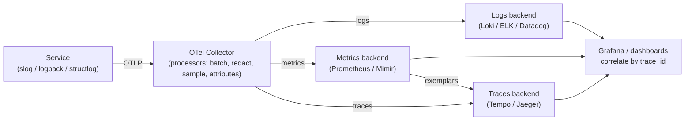
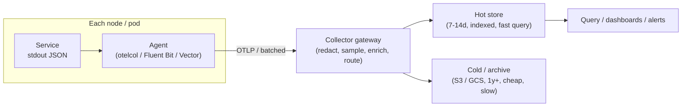

# Logging & Diagnostics — Senior Level

> Focus: "How do we observe a fleet of services?" Logs are one of three pillars — unified with metrics and traces under OpenTelemetry, correlated by IDs, governed for PII, budgeted for cost, and enforced by a shared wrapper so 40 engineers emit the same schema. The unit of work is no longer a log line; it is an *observability strategy*.

---

## Table of Contents

1. [The three pillars, unified](#the-three-pillars-unified)
2. [OpenTelemetry as the standard](#opentelemetry-as-the-standard)
3. [Correlation: trace, span, and request IDs across services](#correlation-trace-span-and-request-ids-across-services)
4. [A log schema that survives 40 engineers](#a-log-schema-that-survives-40-engineers)
5. [The logging pipeline: collect, ship, store, retain](#the-logging-pipeline-collect-ship-store-retain)
6. [Cost control: volume budgets, sampling, retention tiers](#cost-control-volume-budgets-sampling-retention-tiers)
7. [PII governance and redaction at the pipeline](#pii-governance-and-redaction-at-the-pipeline)
8. [Alerting: logs vs. metrics, SLOs, error budgets](#alerting-logs-vs-metrics-slos-error-budgets)
9. [RED and USE: what to actually measure](#red-and-use-what-to-actually-measure)
10. [Correlation across logs ↔ traces ↔ metrics (exemplars)](#correlation-across-logs--traces--metrics-exemplars)
11. [Enforcing conventions: wrapper library + lint](#enforcing-conventions-wrapper-library--lint)
12. [Common Mistakes](#common-mistakes)
13. [Test Yourself](#test-yourself)
14. [Cheat Sheet](#cheat-sheet)
15. [Summary](#summary)
16. [Further Reading](#further-reading)
17. [Related Topics](#related-topics)

---

## The three pillars, unified

A single log line answers "what happened *here*?" At team scale, the questions change:

- *"This request was slow — where did the time go across our 8 services?"* → **traces**
- *"Is the error rate up, and by how much, right now?"* → **metrics**
- *"Why did this specific request fail?"* → **logs**

These are the **three pillars of observability**. None subsumes the others, and the senior mistake is to over-invest in one:

| Pillar | Answers | Cardinality | Cost driver | Retention |
|---|---|---|---|---|
| **Metrics** | "How much / how often / how fast?" (aggregate) | Low (bounded label sets) | Active time series | Long (months/years), cheap |
| **Traces** | "Where did this request go and spend time?" | High (per-request) | Span volume → sampling | Short (days), sampled |
| **Logs** | "What exactly happened in this event?" | Very high (per-event, free text) | Ingest + index bytes | Tiered (hot days, cold months) |

The art is choosing the cheapest pillar that answers the question. Counting failed logins is a **metric**, not a `grep` over logs. Reconstructing one user's checkout is a **trace**. The full payload of the one request that 500'd is a **log**. Pushing aggregate questions into logs is the single largest source of observability cost overruns.



The decisive structural choice: services emit to a **local collector**, never directly to a vendor. The collector owns batching, redaction, sampling, and routing — so changing backends or scrubbing rules is a config rollout, not a code change across 40 repos.

---

## OpenTelemetry as the standard

**OpenTelemetry (OTel)** is the CNCF vendor-neutral standard for generating and shipping all three signals. Adopt it as the org default and you decouple instrumentation from vendor: code emits OTLP; the collector routes to Datadog today, Grafana Cloud tomorrow, with no code change.

What OTel gives you that ad-hoc logging cannot:

- **Context propagation** — `traceparent` (W3C Trace Context) carried automatically across HTTP/gRPC/queue boundaries.
- **Semantic conventions** — agreed attribute names (`http.request.method`, `service.name`, `db.system`, `error.type`). Use these instead of inventing `httpMethod` vs. `method` vs. `verb`.
- **Resource attributes** — `service.name`, `service.version`, `deployment.environment` stamped on every signal, set once.
- **A single SDK surface** per language for logs, metrics, and traces.

Minimal OTel logging wiring in Go (the SDK bridges into `log/slog`):

```go
// otelinit.go — set up once at process start.
func InitObservability(ctx context.Context) (shutdown func(context.Context) error, err error) {
    res, _ := resource.New(ctx,
        resource.WithAttributes(
            semconv.ServiceName("checkout"),
            semconv.ServiceVersion(buildVersion),
            semconv.DeploymentEnvironment(env),
        ),
    )

    // Logs: OTLP exporter feeding an slog handler.
    logExp, err := otlploghttp.New(ctx) // endpoint from OTEL_EXPORTER_OTLP_ENDPOINT
    if err != nil {
        return nil, err
    }
    lp := otellog.NewLoggerProvider(
        otellog.WithResource(res),
        otellog.WithProcessor(otellog.NewBatchProcessor(logExp)),
    )
    global.SetLoggerProvider(lp)

    // Route the stdlib slog through OTel so trace IDs attach automatically.
    slog.SetDefault(slog.New(otelslog.NewHandler("checkout")))

    return lp.Shutdown, nil
}
```

Endpoint, headers, and sampling are configured by **environment variables** (`OTEL_EXPORTER_OTLP_ENDPOINT`, `OTEL_RESOURCE_ATTRIBUTES`, `OTEL_TRACES_SAMPLER`), not code — so SRE owns them in deployment manifests.

---

## Correlation: trace, span, and request IDs across services

A log line is nearly useless in a distributed system unless you can answer "what else happened in this request?" That requires **identifiers propagated across every hop** and stamped on every signal.

- **trace_id** — one per end-to-end request, constant across all services it touches. The join key for everything.
- **span_id** — one per unit of work (a handler, a DB call). Identifies the specific operation that logged.
- **request_id / correlation_id** — a human-facing, often customer-shareable ID for support tickets ("give me the request ID from the error page"). Frequently equal to the trace ID, but kept separate when you need a stable ID even for un-traced requests.

W3C Trace Context (`traceparent: 00-<trace-id>-<span-id>-<flags>`) is the wire format OTel propagates automatically over HTTP and gRPC. The senior responsibilities:

1. **Propagate across non-HTTP boundaries too** — message queues, cron jobs, background workers. Inject `traceparent` into Kafka headers / job payloads on the producer; extract and continue the trace on the consumer. This is the most commonly forgotten edge and it silently breaks traces.
2. **Bind the IDs to the logging context** so every line in that request carries them without the developer remembering.

Python with `structlog` + OTel, binding `trace_id` automatically via a processor:

```python
import structlog
from opentelemetry import trace

def add_trace_context(_, __, event_dict):
    span = trace.get_current_span()
    ctx = span.get_span_context()
    if ctx.is_valid:
        event_dict["trace_id"] = format(ctx.trace_id, "032x")
        event_dict["span_id"] = format(ctx.span_id, "016x")
    return event_dict

structlog.configure(
    processors=[
        structlog.contextvars.merge_contextvars,  # request_id bound per request
        add_trace_context,                          # trace_id / span_id from active span
        structlog.processors.add_log_level,
        structlog.processors.TimeStamper(fmt="iso"),
        structlog.processors.dict_tracebacks,       # structured stack traces
        structlog.processors.JSONRenderer(),
    ],
)
```

In Java, the same is achieved by configuring Logback's MDC (mapped diagnostic context) and letting the OTel Logback appender inject `trace_id`/`span_id`:

```xml
<!-- logback.xml -->
<configuration>
  <appender name="JSON" class="ch.qos.logback.core.ConsoleAppender">
    <encoder class="net.logstash.logback.encoder.LogstashEncoder">
      <includeMdcKeyName>request_id</includeMdcKeyName>
      <fieldNames>
        <timestamp>ts</timestamp>
        <level>level</level>
        <message>msg</message>
        <logger>logger</logger>
      </fieldNames>
    </encoder>
  </appender>

  <!-- OTel appender injects trace_id/span_id into every event automatically -->
  <appender name="OTEL" class="io.opentelemetry.instrumentation.logback.appender.v1_0.OpenTelemetryAppender"/>

  <root level="INFO">
    <appender-ref ref="JSON"/>
    <appender-ref ref="OTEL"/>
  </root>
</configuration>
```

The litmus test: paste a `trace_id` into your logs UI and your traces UI; you should get the same request from both, and they should reconcile.

---

## A log schema that survives 40 engineers

Free text scales to one engineer. A team needs a **log-as-event** schema: every log line is a structured event with a fixed set of well-known fields, so dashboards, alerts, and queries are written against field names, not regexes.

Define and document a small **field dictionary** — the contract every service honors:

| Field | Type | Required | Meaning |
|---|---|---|---|
| `ts` | RFC3339 string | yes | Event timestamp (UTC) |
| `level` | enum | yes | `debug`/`info`/`warn`/`error` — agreed semantics |
| `msg` | string | yes | **Stable, low-cardinality** event name ("order placed"), not an interpolated sentence |
| `service.name` | string | yes | Emitter, from OTel resource |
| `service.version` | string | yes | Build SHA / semver |
| `env` | enum | yes | `prod`/`staging`/`dev` |
| `trace_id` / `span_id` | hex | when traced | Correlation keys |
| `request_id` | string | per request | Customer-shareable ID |
| `error.type` | string | on errors | Exception class / category |
| `error.stack` | string | on errors | Structured trace (multi-line collapsed to one field) |
| `duration_ms` | number | on completion | Operation latency |

Conventions that prevent the schema from rotting:

- **`msg` is a constant**, not `f"order {id} failed"`. Variables go in fields (`order_id`), so `msg` stays groupable and cardinality stays bounded. This is what makes "count of `order placed` events" a cheap metric.
- **One canonical name per concept.** `user_id` everywhere — never `userId`, `uid`, `userID` in different services. Pick `snake_case` *or* `dot.notation` (OTel uses dots) and enforce it.
- **Reserve a namespace** for domain fields (`order.id`, `payment.amount`) so they never collide with infra fields.
- **Multi-line is forbidden** in the wire format. Stack traces become a single string field (`error.stack`) so one event = one line = one parseable record. JSON encoding handles the embedded newlines.

The contract lives in a shared doc/schema and is enforced by the wrapper library (below), not by hope.

---

## The logging pipeline: collect, ship, store, retain

At fleet scale the pipeline is a system you design, not a destination URL:



Key decisions:

- **Agent vs. gateway.** A lightweight agent (Fluent Bit, Vector, otelcol-contrib) runs per node and forwards to a **gateway collector** that does the expensive, centralized work (redaction, sampling, tenant routing). Centralizing redaction is non-negotiable — you cannot trust 40 services to each scrub PII correctly.
- **Backend choice** is a cost/ergonomics trade, not a religion:
  - **ELK (Elasticsearch + Kibana)** — indexes every field; powerful arbitrary search; expensive to store at high volume.
  - **Loki** — indexes only labels, stores log bodies as compressed chunks; cheap; query is `grep`-like over a label-filtered slice. Pairs naturally with Prometheus/Grafana.
  - **Datadog / vendor SaaS** — least ops burden; cost scales aggressively with ingest GB and indexed events; watch the bill.
- **Backpressure.** Decide what happens when the pipeline is down: drop (logs are not your source of truth), buffer to local disk with a cap, or block. **Never block the request path on log shipping** — a logging outage must not become an application outage.

---

## Cost control: volume budgets, sampling, retention tiers

Logging is one of the largest, most surprising cloud bills. Treat log volume as a **budgeted resource**, the same way you budget CPU.

- **Per-service volume budget.** Assign each service a GB/day allowance. Alert when a service exceeds it (usually a `log.info` in a hot loop or a retry storm). The budget makes "add a log line in the request path" a decision with a visible cost.
- **Level discipline at scale.** `INFO` in a 50k-RPS path is a money fire. Default hot paths to `WARN`; emit `INFO`/`DEBUG` only behind sampling or dynamic level controls.
- **Sampling strategies:**
  - **Head sampling** — decide at request start (e.g., keep 1%). Cheap; loses the rare error you most wanted.
  - **Tail sampling** — buffer the full trace, then keep it *if it errored or was slow*. Implemented in the collector. The right default: keep 100% of error/slow traces, ~1% of healthy ones.
  - **Per-route rates** — sample `/healthz` at 0%, checkout at 100%.
- **Retention tiers.** Hot, indexed storage for 7–14 days (incident debugging window); compressed cold archive (S3/GCS) for 1+ year (compliance). Querying cold is slow and rare — that's the point.
- **Dynamic levels.** Ship a runtime knob (slog's `LevelVar`, a config-server-driven level) so on-call can flip one service to `DEBUG` for five minutes during an incident, then back — without a redeploy.

OTel Collector tail-sampling, expressed as config (no code):

```yaml
processors:
  tail_sampling:
    decision_wait: 10s
    policies:
      - name: keep-errors
        type: status_code
        status_code: { status_codes: [ERROR] }
      - name: keep-slow
        type: latency
        latency: { threshold_ms: 500 }
      - name: sample-healthy
        type: probabilistic
        probabilistic: { sampling_percentage: 1 }
```

---

## PII governance and redaction at the pipeline

Under GDPR/CCPA, a log line containing an email or card number is regulated personal data — and logs are notoriously over-retained and over-shared. The governance model:

- **Allowlist, not blocklist.** Blocklists (scrub `password`, `ssn`, …) fail open: the field nobody thought of leaks. The robust model is **structured logging + an allowlist** — only explicitly-permitted fields are emitted; everything else is dropped or hashed. This is only achievable *because* logs are structured.
- **Redact at the pipeline, defense-in-depth at the source.** The collector is the chokepoint where redaction is centrally guaranteed; the wrapper library scrubs at the source as a second layer. Never rely on a single layer.
- **Tokenize / hash for joinability.** When you need to correlate by user without storing the email, log a stable salted hash (`user_hash`) — supports "show me all logs for this user" without storing PII.
- **Right to erasure** is a real engineering requirement: design so a user's events can be deleted or are auto-expired by retention, since per-record deletion across log stores is painful.

Collector-side redaction (the guaranteed layer):

```yaml
processors:
  redaction:
    allow_all_keys: false          # allowlist mode: drop unknown attributes
    allowed_keys: [trace_id, span_id, service.name, level, msg,
                   http.request.method, http.response.status_code,
                   order.id, user_hash, duration_ms]
    blocked_values:                # belt-and-suspenders: mask anything matching
      - "\\b[\\w.+-]+@[\\w-]+\\.[\\w.-]+\\b"     # emails
      - "\\b(?:\\d[ -]*?){13,16}\\b"             # card-like numbers
    summary: debug
```

Source-side scrubbing as a structlog processor (second layer):

```python
SENSITIVE = {"password", "token", "authorization", "ssn", "card_number"}

def redact(_, __, event_dict):
    for k in list(event_dict):
        if k.lower() in SENSITIVE:
            event_dict[k] = "[REDACTED]"
    return event_dict  # inserted before JSONRenderer in the processor chain
```

---

## Alerting: logs vs. metrics, SLOs, error budgets

A senior decision that saves the on-call rotation: **alert on metrics, debug with logs.** Log-based alerts are slow, expensive (they scan ingest), and noisy. Derive a metric from the log stream (a counter of `error.type`) and alert on the metric; then pivot to logs for the specifics.

Define reliability in terms users feel, using **SLOs**:

- **SLI** — a measured ratio, e.g. *fraction of requests served < 300 ms with 2xx/3xx*.
- **SLO** — the target, e.g. *99.9% over 30 days*.
- **Error budget** — the allowed failure: `100% − 99.9% = 0.1%` of requests/month. Spend it on releases and risk; when it's exhausted, freeze risky changes.

This reframes alerting away from "any error" toward **burn-rate alerts**: page when you're consuming the monthly budget too fast (e.g., a fast-burn rule firing if a 1-hour window would exhaust 2% of the budget). Two windows — a fast, short one and a slow, long one — cut false pages dramatically.

Anti-noise rules:

- **Stack traces at `ERROR`, not `INFO`.** A trace at `INFO` either spams or hides; if it's worth a stack trace it's worth an `ERROR` (or it's expected — log it at `WARN` with no trace).
- **Every alert is actionable.** If on-call can't *do* something, it's a dashboard, not a page.
- **Symptom-based, not cause-based.** Page on "checkout success rate dropped," not on each of the 30 internal errors that might cause it.

---

## RED and USE: what to actually measure

Two complementary frameworks decide *which* metrics to derive — including from your log stream.

**RED** — for request-driven services (the API tier):

| Signal | Meaning |
|---|---|
| **Rate** | Requests per second |
| **Errors** | Failed requests per second (and as a ratio) |
| **Duration** | Latency distribution — **percentiles (p50/p95/p99), never the mean** |

**USE** — for resources (queues, DBs, caches, thread pools):

| Signal | Meaning |
|---|---|
| **Utilization** | % time the resource was busy |
| **Saturation** | Queued/waiting work (the leading indicator of trouble) |
| **Errors** | Error events for the resource |

RED tells you the service is unhealthy; USE tells you *which resource* is the bottleneck. Together they cover almost every "is it the service or the infra?" question. Always measure latency as a **histogram** so you can compute true percentiles across instances — averaging pre-aggregated averages is statistically meaningless.

---

## Correlation across logs ↔ traces ↔ metrics (exemplars)

The payoff of unifying the pillars is **one-click pivoting** between them, and the mechanism is shared identity:

- **Logs → Traces:** every log carries `trace_id`; click it to open the full distributed trace.
- **Traces → Logs:** from a slow span, filter logs by its `trace_id`/`span_id` to read exactly what that operation logged.
- **Metrics → Traces (exemplars):** an **exemplar** is a sample `trace_id` attached to a metric data point — so a spike in the p99 latency histogram links directly to an example slow request. This is the bridge that lets aggregate metrics drop you into a concrete trace.

Recording an exemplar in Go (Prometheus client) ties the latency observation to the active trace:

```go
hist.(prometheus.ExemplarObserver).ObserveWithExemplar(
    elapsed.Seconds(),
    prometheus.Labels{"trace_id": traceIDFromContext(ctx)},
)
```

With exemplars wired, the incident workflow becomes: **metric** alert fires → click the spike's **exemplar** → land on the slow **trace** → click a span's `trace_id` → read the **logs**. Three pillars, one investigation, no manual cross-referencing.

---

## Enforcing conventions: wrapper library + lint

Conventions that aren't enforced decay within a quarter. Two mechanisms make the schema real:

**1. A thin internal logging library.** Don't let services call the raw logger. Ship `logging-go` / `logging-py` / a logging `@Slf4j` wrapper that:

- bakes in the JSON encoder, the field dictionary, and resource attributes;
- exposes a `WithRequest(ctx)` that auto-binds `trace_id`, `span_id`, `request_id`;
- applies source-side redaction;
- offers only the agreed levels with documented semantics.

```go
// logging/log.go — the only logger services are allowed to import.
func FromContext(ctx context.Context) *slog.Logger {
    l := slog.Default()
    if sc := trace.SpanContextFromContext(ctx); sc.IsValid() {
        l = l.With(
            slog.String("trace_id", sc.TraceID().String()),
            slog.String("span_id", sc.SpanID().String()),
        )
    }
    if rid, ok := requestID(ctx); ok {
        l = l.With(slog.String("request_id", rid))
    }
    return l
}

// Usage in a handler — correlation IDs attach for free.
logging.FromContext(ctx).Info("order placed",
    slog.String("order.id", order.ID),
    slog.Int("item.count", len(order.Items)),
)
```

**2. Lint that fails the build.** Codify the rules so they can't merge:

- Ban the raw logger and `fmt.Println`/`console.log`/`print` in production code (Go `forbidigo`, ESLint `no-console`, Python `flake8-print`).
- Forbid interpolated `msg` (a custom AST/regex rule rejecting `"%s"`/f-strings in the `msg` position).
- Require known field names (custom check against the dictionary).

```yaml
# .golangci.yml — forbid raw logging in service code.
linters: { enable: [forbidigo] }
linters-settings:
  forbidigo:
    forbid:
      - p: '^fmt\.Print.*$'
        msg: "use logging.FromContext(ctx); structured logs only"
      - p: '^slog\.(Info|Warn|Error|Debug)$'
        msg: "use the logging wrapper so trace_id/redaction are applied"
```

The wrapper makes the right thing *easy*; the linter makes the wrong thing *impossible to merge*. Together they hold the schema across a growing team better than any style guide.

---

## Common Mistakes

- **Treating logs as the primary signal.** Pushing aggregate questions ("error rate", "p99") into log scans instead of metrics — slow, expensive, and the top cause of runaway logging bills.
- **Direct-to-vendor shipping.** Services exporting straight to Datadog/Elastic instead of a collector, so redaction, sampling, and backend changes require touching 40 repos.
- **Forgetting non-HTTP context propagation.** Traces break at the queue/cron boundary because nobody injected `traceparent` into the message headers.
- **Interpolated `msg` strings.** `"order " + id + " failed"` makes `msg` high-cardinality and un-groupable; the ID belongs in a field.
- **Blocklist redaction.** Scrubbing a fixed set of "bad" keys; the next new field leaks PII. Allowlist on structured logs instead.
- **Blocking on log shipping.** A full buffer or a downed pipeline stalls the request path, turning a logging incident into an outage.
- **Inconsistent field names.** `userId` in one service, `user_id` in another, `uid` in a third — every dashboard needs three variants.
- **Stack traces at `INFO`.** Either floods the index or hides real errors; alert fatigue follows.
- **`INFO` in hot paths without sampling.** Logging becomes the bottleneck and the bill.
- **Alerting on causes, not symptoms.** 30 cause-alerts page simultaneously for one user-facing failure.

---

## Test Yourself

**1. A request is slow across 6 services. Which pillar do you reach for first, and why?**

<details><summary>Answer</summary>

**Traces.** A trace shows the per-service, per-span latency breakdown across the whole request, immediately localizing *where* the time went. Metrics tell you the aggregate p99 is up but not which hop; logs tell you what one service did but not the cross-service timing. Once the trace points at the slow span, pivot to that service's logs (by `trace_id`/`span_id`) for the detail.

</details>

**2. Why is a centralized collector strongly preferred over each service exporting directly to the logging vendor?**

<details><summary>Answer</summary>

The collector is the single chokepoint for **redaction** (PII scrubbed in one trusted place, not trusted to 40 services), **sampling** (tail sampling needs to see whole traces), **enrichment** (resource attributes), and **routing** (switch backends via config). Direct-to-vendor means every policy change is a code change across every repo, and PII compliance depends on every team getting scrubbing right — which they won't.

</details>

**3. Your monthly error budget for a 99.9% SLO is 0.1% of requests. A deploy burns 40% of it in two hours. What should happen?**
</invoke>

<details><summary>Answer</summary>

A **fast-burn alert** should fire — that burn rate would exhaust the month's budget in a few hours. Page on-call, likely roll back the deploy, and (per error-budget policy) freeze further risky releases until the budget recovers. The point of error budgets is to make this an automatic, agreed response rather than an ad-hoc judgment call.

</details>

**4. What is an exemplar and what problem does it solve?**

<details><summary>Answer</summary>

An exemplar is a sample `trace_id` attached to a metric data point (e.g., a latency-histogram bucket). It bridges the **metrics → traces** gap: when a metric spikes, you click the exemplar and land on a concrete example trace that contributed to the spike, instead of manually hunting for a matching request. It is the mechanism that turns three separate pillars into one continuous investigation.

</details>

**5. Why is allowlist redaction safer than blocklist, and what makes allowlisting feasible?**

<details><summary>Answer</summary>

A blocklist fails open — any sensitive field nobody anticipated leaks. An allowlist fails closed — only explicitly permitted fields are emitted, so a new field defaults to *not logged*. This is only feasible because logs are **structured** (named fields), so the pipeline can enumerate and filter keys. Free-text logs can't be allowlisted, which is one more reason structured logging is a prerequisite for compliance at scale.

</details>

**6. A service emits `log.info` on every request at 50k RPS and the logging bill triples. Beyond raising the level, name two structural fixes.**

<details><summary>Answer</summary>

(1) **Sampling** — head-sample healthy `INFO` to ~1%, or use collector tail sampling to keep 100% of errors/slow requests and a small fraction of the rest. (2) **A per-service volume budget with an alert**, so the spike is caught the day it ships, plus a **dynamic level knob** so the path can run at `WARN` normally and be flipped to `DEBUG` only during an incident. The metric for "request count" should come from a counter, not from counting log lines.

</details>

---

## Cheat Sheet

| Decision | Senior default |
|---|---|
| Signal for "how often / how fast" | **Metric** (counter/histogram), never log scan |
| Signal for "where did time go" | **Trace** |
| Signal for "what exactly happened" | **Log** (structured) |
| Instrumentation standard | **OpenTelemetry**, OTLP to a collector |
| Export topology | Service → local agent → **gateway collector** → backend |
| Join key across pillars | **trace_id** on every signal; exemplars metrics→traces |
| `msg` field | **Constant** event name; variables go in fields |
| Field naming | One canonical name, one case style, OTel semconv |
| Redaction | **Allowlist** at the collector + source-side scrub |
| User correlation without PII | Salted **hash**, not raw email |
| Hot-path level | `WARN`; `INFO`/`DEBUG` behind sampling + dynamic knob |
| Sampling | **Tail**: 100% errors/slow, ~1% healthy |
| Retention | Hot 7–14d indexed; cold 1y+ in object storage |
| Alert on | **Metrics + SLO burn rate**; debug with logs |
| Latency reporting | **Percentiles** (p95/p99), never the mean |
| Service metrics | **RED**; resource metrics: **USE** |
| Enforcement | Wrapper library (easy) + linter (mandatory) |

---

## Summary

At team scale, logging stops being a `print` statement and becomes one leg of an **observability strategy**. The three pillars — metrics for aggregates, traces for request flow, logs for per-event detail — are unified under **OpenTelemetry**, shipped through a **collector** that owns redaction, sampling, and routing, and stitched together by a **trace_id** present on every signal (with exemplars linking metrics to traces). Logs themselves become **structured events** with a governed field dictionary, an **allowlist** redaction policy for PII compliance, **volume budgets** and **tail sampling** for cost, and **tiered retention**. You **alert on metrics and SLO burn rates**, then pivot into logs for specifics — measuring services with **RED** and resources with **USE**. None of this survives contact with a growing team unless conventions are enforced: a **wrapper library** makes the correct path effortless and a **linter** makes the wrong path unmergeable. The senior skill is choosing the cheapest pillar that answers each question — and never letting logs become the database.

---

## Further Reading

- *Observability Engineering* — Charity Majors, Liz Fong-Jones, George Miranda (O'Reilly)
- *Site Reliability Engineering* and *The SRE Workbook* — Google (SLOs, error budgets, burn-rate alerting)
- OpenTelemetry documentation — specification, semantic conventions, Collector
- W3C Trace Context specification (`traceparent` propagation)
- Tom Wilkie, "The RED Method"; Brendan Gregg, "The USE Method"

---

## Related Topics

- [junior.md](junior.md) — why structured logs, levels, and not logging secrets
- [middle.md](middle.md) — structured logging in one service, log levels, context fields
- [professional.md](professional.md) — async appenders, log throughput, and handler internals
- [Chapter README](../README.md) — the positive logging rules and anti-patterns
- [Error Handling](../06-error-handling/README.md) — what to log when an error crosses a boundary
- [Anti-Patterns](../../anti-patterns/README.md) — `printf`-debugging and logging anti-patterns to avoid
- [Refactoring](../../refactoring/README.md) — extracting a logging wrapper from scattered log calls
