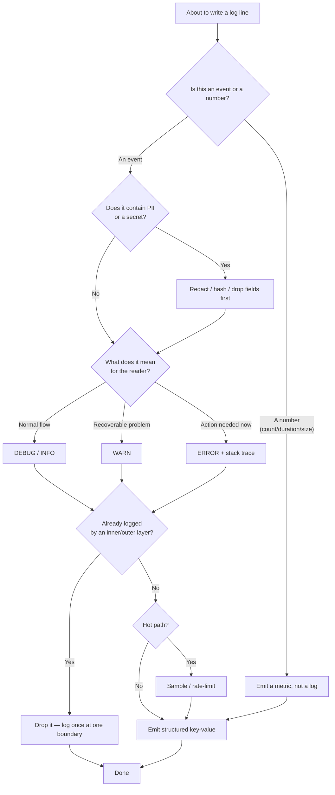

# Logging & Diagnostics — Practice Tasks

> 12 hands-on exercises that turn noisy, leaky, unsearchable logs into structured, leveled, privacy-safe diagnostics. Every task: a realistic scenario, a bad logging snippet (Go / Java / Python — varied), an instruction, then a collapsible solution with the corrected code **and** the reasoning. Ordered easy → hard.

---

## Table of Contents

1. [Task 1 — Free-text → structured key-value (Go)](#task-1--free-text--structured-key-value-go) · _Easy_
2. [Task 2 — Fix the log levels (Python)](#task-2--fix-the-log-levels-python) · _Easy_
3. [Task 3 — Remove `printf`/`console.log` debugging (Go)](#task-3--remove-printfconsolelog-debugging-go) · _Easy_
4. [Task 4 — Guard expensive message construction behind a level check (Java)](#task-4--guard-expensive-message-construction-behind-a-level-check-java) · _Easy_
5. [Task 5 — Redact PII and secrets before logging (Python)](#task-5--redact-pii-and-secrets-before-logging-python) · _Medium_
6. [Task 6 — Stack trace at ERROR, not INFO (Java)](#task-6--stack-trace-at-error-not-info-java) · _Medium_
7. [Task 7 — Add a correlation/request ID via context (Go)](#task-7--add-a-correlationrequest-id-via-context-go) · _Medium_
8. [Task 8 — Eliminate duplicate logging across layers (Java/MDC)](#task-8--eliminate-duplicate-logging-across-layers-javamdc) · _Medium_
9. [Task 9 — Replace a logged counter with a metric (Python)](#task-9--replace-a-logged-counter-with-a-metric-python) · _Medium_
10. [Task 10 — Sampling / rate-limiting on a hot path (Go)](#task-10--sampling--rate-limiting-on-a-hot-path-go) · _Hard_
11. [Task 11 — Inject the logger instead of choosing one (Java)](#task-11--inject-the-logger-instead-of-choosing-one-java) · _Hard_
12. [Task 12 — Logging audit (Python — open-ended)](#task-12--logging-audit-python--open-ended) · _Hard_

---

## How to Use

1. Read the scenario and the bad snippet. **Predict the failure mode** before reading the instruction — at 3 AM, what makes this log useless, expensive, or dangerous?
2. Rewrite the snippet on your own. Treat logs as a queryable data product, not as `print` statements.
3. Expand the solution and compare. The reasoning matters more than the exact API — the same fix applies whether you use `slog`, `logback`, `structlog`, or anything else.

The decision flow most of these tasks exercise:



---

## Task 1 — Free-text → structured key-value (Go)

**Difficulty:** Easy

**Scenario:** A payments service logs each charge as a sentence. The on-call engineer cannot answer "show me every failed charge over $500 for merchant `m_42`" without writing a fragile regex against prose. Worse, the message string changes every time someone edits the wording, silently breaking dashboards.

**Bad code:**

```go
func (s *Service) Charge(ctx context.Context, c Charge) error {
    log.Printf("Charging customer %s amount %.2f %s for merchant %s",
        c.CustomerID, c.Amount, c.Currency, c.MerchantID)

    if err := s.gateway.Submit(ctx, c); err != nil {
        log.Printf("ERROR: charge failed for customer %s amount %.2f: %v",
            c.CustomerID, c.Amount, err)
        return err
    }
    log.Printf("Charge OK for customer %s", c.CustomerID)
    return nil
}
```

**Instruction:** Convert these free-text lines into structured key-value logs (use `log/slog`). The fields must be machine-queryable: a constant message plus typed attributes. Keep the same three events.

<details><summary>Solution</summary>

```go
import "log/slog"

func (s *Service) Charge(ctx context.Context, c Charge) error {
    // Build the attributes once; reuse for every line about this charge.
    attrs := []slog.Attr{
        slog.String("customer_id", c.CustomerID),
        slog.String("merchant_id", c.MerchantID),
        slog.Float64("amount", c.Amount),
        slog.String("currency", c.Currency),
    }

    s.log.LogAttrs(ctx, slog.LevelInfo, "charge.started", attrs...)

    if err := s.gateway.Submit(ctx, c); err != nil {
        s.log.LogAttrs(ctx, slog.LevelError, "charge.failed",
            append(attrs, slog.String("error", err.Error()))...)
        return err
    }

    s.log.LogAttrs(ctx, slog.LevelInfo, "charge.succeeded", attrs...)
    return nil
}
```

**Reasoning:**

- **The message becomes a stable event name**, not a sentence. `charge.failed` never changes, so a query (`event="charge.failed" AND amount>500 AND merchant_id="m_42"`) keeps working even when humans reword nothing — there is nothing to reword.
- **Values are typed attributes**, not interpolated into a string. `amount` is a real number, so the backend can filter `amount > 500` numerically instead of you parsing `"500.00"` out of prose.
- **A constant message string also lets the logging backend group lines** by event for cardinality and rate dashboards — impossible when every line is unique text.
- `LogAttrs` with pre-built `[]slog.Attr` avoids re-allocating the attribute set on every call and is the lowest-overhead `slog` entry point.

</details>

---

## Task 2 — Fix the log levels (Python)

**Difficulty:** Easy

**Scenario:** Every line in this worker is `logger.info`. Production INFO volume is so high that the real signal — a poison message being dropped — is buried, and ops has stopped reading INFO entirely. Meanwhile a genuine config problem is logged at the same level as a routine heartbeat.

**Bad code:**

```python
def process(msg):
    logger.info("entered process()")
    logger.info(f"raw payload: {msg.body!r}")          # huge, every message
    try:
        data = parse(msg.body)
    except ParseError:
        logger.info("could not parse message, dropping")  # data loss, hidden at INFO
        return
    if data.region not in REGIONS:
        logger.info(f"unknown region {data.region}")       # misconfiguration
    save(data)
    logger.info("saved successfully")
```

**Instruction:** Assign each line the correct level (DEBUG / INFO / WARNING / ERROR). State the rule you applied to each.

<details><summary>Solution</summary>

```python
def process(msg):
    logger.debug("process.entered")                       # tracing detail
    logger.debug("process.payload", extra={"body": msg.body})  # dev-only, opt-in
    try:
        data = parse(msg.body)
    except ParseError:
        # A message is being dropped = data loss. Someone must look. ERROR.
        logger.error("process.parse_failed", extra={"len": len(msg.body)},
                     exc_info=True)
        return
    if data.region not in REGIONS:
        # Recoverable but suspicious — likely a config/deploy gap. WARNING.
        logger.warning("process.unknown_region", extra={"region": data.region})
    save(data)
    logger.info("process.saved", extra={"id": data.id})   # one business-meaningful line
```

**Reasoning — the level rubric:**

| Level | Meaning | Who watches it |
|---|---|---|
| `DEBUG` | Tracing / payload dumps useful only while diagnosing | Developers, off in prod |
| `INFO` | A business-meaningful thing happened (record saved, request served) | Sampled / dashboards |
| `WARNING` | Recoverable anomaly that *might* need attention (retry, fallback, unexpected-but-handled input) | Triaged, not paged |
| `ERROR` | Something failed and a human must act (data lost, request not served) | Alerts / paging |

- `"entered process()"` and the raw payload are **DEBUG**: pure tracing, and dumping every body at INFO is the volume problem itself.
- The dropped-message branch was the worst bug: **dropping data is an ERROR**, not INFO, and it carries `exc_info=True` so the parse failure is captured (see Task 6 for why the stack trace belongs at this level, not above).
- Unknown region is **WARNING**: handled here, but it signals a likely misconfiguration worth reviewing.
- Exactly one **INFO** survives — the business event "saved" with an ID — so INFO regains meaning.

</details>

---

## Task 3 — Remove `printf`/`console.log` debugging (Go)

**Difficulty:** Easy

**Scenario:** A bug got fixed last sprint, but the `fmt.Println` breadcrumbs the author sprinkled in to find it were never removed. They now spam stdout in production, bypass the structured logger entirely (so they have no level, timestamp, or correlation ID), and one of them prints a full request struct that happens to include an auth header.

**Bad code:**

```go
func (h *Handler) Update(w http.ResponseWriter, r *http.Request) {
    fmt.Println(">>> Update called")
    var req UpdateRequest
    json.NewDecoder(r.Body).Decode(&req)
    fmt.Printf("DEBUG req = %+v\n", req)   // prints req.AuthHeader too
    user, err := h.svc.Update(r.Context(), req)
    fmt.Println("got user:", user, "err:", err)
    if err != nil {
        http.Error(w, "internal error", 500)
        return
    }
    json.NewEncoder(w).Encode(user)
}
```

**Instruction:** Remove the ad-hoc debugging output. Where a diagnostic genuinely adds value, replace it with a proper structured log at the right level. Drop the rest.

<details><summary>Solution</summary>

```go
func (h *Handler) Update(w http.ResponseWriter, r *http.Request) {
    var req UpdateRequest
    if err := json.NewDecoder(r.Body).Decode(&req); err != nil {
        h.log.WarnContext(r.Context(), "update.bad_request", slog.String("error", err.Error()))
        http.Error(w, "bad request", http.StatusBadRequest)
        return
    }

    user, err := h.svc.Update(r.Context(), req)
    if err != nil {
        // One log at the boundary, with the failure cause — no struct dump.
        h.log.ErrorContext(r.Context(), "update.failed",
            slog.String("user_id", req.UserID),
            slog.String("error", err.Error()))
        http.Error(w, "internal error", http.StatusInternalServerError)
        return
    }
    json.NewEncoder(w).Encode(user)
}
```

**Reasoning:**

- `fmt.Println`/`Printf` write straight to stdout with **no level, timestamp, severity, or correlation ID**, so they cannot be filtered, routed, or correlated — they are invisible to every log query and impossible to silence without a redeploy.
- `fmt.Printf("%+v", req)` is a **PII/secret leak waiting to happen**: it dumps every field, including `AuthHeader`. Never log whole request/response structs.
- The decode error was previously **swallowed** (`json.Decode`'s return ignored); the fix surfaces it as a `WARN` and returns `400` instead of misreporting a client error as a `500`.
- Net result: zero stdout breadcrumbs, two intentional logs at correct levels, no struct dumps. Catch leftover prints in CI with a lint rule (`forbidigo` for `fmt.Print*`, or grep `console.log` in JS).

</details>

---

## Task 4 — Guard expensive message construction behind a level check (Java)

**Difficulty:** Easy

**Scenario:** A DEBUG line serializes the entire order graph to JSON on every request. DEBUG is **off** in production — but the JSON is still built on every call, because the argument is evaluated before `logger.debug` decides to discard it. Profiling shows 8% of CPU spent assembling debug strings that are never written.

**Bad code:**

```java
public void handle(Order order) {
    // expensiveJson() runs even when DEBUG is disabled
    logger.debug("processing order: " + new ObjectMapper().writeValueAsString(order));
    // ... process ...
}
```

**Instruction:** Make the expensive serialization happen only when DEBUG is actually enabled. Show the two idiomatic fixes (guard vs. lazy supplier) and say when to prefer each.

<details><summary>Solution</summary>

```java
// Fix A — explicit guard. Best when building the message is several statements.
if (logger.isDebugEnabled()) {
    logger.debug("order.processing payload={}", mapper.writeValueAsString(order));
}

// Fix B — lazy supplier (SLF4J 2 / Log4j2). Best for a one-liner; the lambda
// is only invoked if DEBUG is enabled.
logger.atDebug()
      .addArgument(() -> mapper.writeValueAsString(order))
      .log("order.processing payload={}");
```

**Reasoning:**

- The original cost is **eager argument evaluation**: Java evaluates `mapper.writeValueAsString(order)` and the `+` concatenation *before* the call to `debug`, regardless of level. The level check inside `debug` happens too late to save the work.
- Note that **parameterized logging alone (`"...{}", order)` does *not* fix this** if you pass the already-serialized string — it only defers `toString()`. Here the serialization is the expensive part, so it must be guarded or deferred explicitly.
- **Fix A (`isDebugEnabled` guard)** is clearest when the message needs multiple statements or temporary variables to build.
- **Fix B (lazy `Supplier`)** keeps a single fluent line; the lambda body runs only if the level is enabled. Prefer it for simple one-expression messages.
- Either way, production CPU drops because the JSON is built only during actual debugging sessions.

</details>

---

## Task 5 — Redact PII and secrets before logging (Python)

**Difficulty:** Medium

**Scenario:** A signup handler logs the full request body to "help debugging." That body contains an email, a plaintext password, a credit-card number, and an API key. These now sit in plaintext in the log store, replicated to three regions and retained for 400 days — a textbook GDPR/PCI violation found in an audit.

**Bad code:**

```python
def signup(request_body: dict):
    logger.info("signup request: %s", request_body)
    # request_body = {
    #   "email": "a@b.com", "password": "hunter2",
    #   "card_number": "4111111111111111", "api_key": "sk_live_abcd1234",
    #   "name": "Ada", "marketing_opt_in": True,
    # }
    ...
```

**Instruction:** Log enough to debug a signup without persisting any secret or sensitive identifier in clear text. Redact, hash, or drop — choose appropriately per field and justify each choice.

<details><summary>Solution</summary>

```python
import hashlib

# Fields that must never reach the log store in clear text.
_SECRETS = {"password", "card_number", "api_key", "cvv", "ssn"}
# Fields we want to *correlate* on but not store raw (PII).
_HASHED = {"email"}

def _scrub(body: dict) -> dict:
    safe = {}
    for k, v in body.items():
        if k in _SECRETS:
            safe[k] = "[REDACTED]"
        elif k in _HASHED:
            safe[k] = "sha256:" + hashlib.sha256(str(v).encode()).hexdigest()[:12]
        else:
            safe[k] = v
    return safe

def signup(request_body: dict):
    logger.info("signup.request", extra={"fields": _scrub(request_body)})
    # logs: {"email": "sha256:9a1c...", "password": "[REDACTED]",
    #        "card_number": "[REDACTED]", "api_key": "[REDACTED]",
    #        "name": "Ada", "marketing_opt_in": True}
    ...
```

**Reasoning — choose the treatment per field, not one blanket rule:**

- **Drop/redact secrets entirely** (`password`, `card_number`, `cvv`, `api_key`): they have *no* diagnostic value worth the risk. There is never a reason to see a plaintext password in a log. `[REDACTED]` (not the masked value) so nobody can partially reconstruct it.
- **Hash identifiers you must correlate on** (`email`): a salted/truncated SHA-256 lets you confirm "the same user signed up twice" without storing the address. It is a stable join key that is not directly PII.
- **Keep non-sensitive fields** (`name` is borderline — your data-classification policy decides; `marketing_opt_in` is fine).
- **Make the allow/deny list the single source of truth.** An explicit `_SECRETS` set fails *closed* for known secrets; pair it with a serializer that redacts unknown fields by default if your data is high-risk. Better still, put the scrubbing in a logging *filter/processor* (e.g. `structlog` processor or a `logging.Filter`) so no caller can forget it — defense in depth beats remembering to call `_scrub` everywhere.

</details>

---

## Task 6 — Stack trace at ERROR, not INFO (Java)

**Difficulty:** Medium

**Scenario:** A `catch` block logs the exception at INFO and then logs a separate "error occurred" line at ERROR — with no stack trace. On-call gets paged by the ERROR line, opens the log, and finds only `"error occurred"` with the actual cause and stack trace sitting unnoticed at INFO. The trace is also concatenated into the message, producing a multi-line entry that breaks the log shipper's line-based parsing.

**Bad code:**

```java
try {
    paymentGateway.capture(orderId);
} catch (GatewayException e) {
    logger.info("capture threw: " + e + "\n" + stackTraceToString(e)); // multi-line, wrong level
    logger.error("error occurred during capture");                     // no cause, no trace
}
```

**Instruction:** Produce a single ERROR log that carries the cause and the stack trace as structured attached data (not concatenated text), at the correct level.

<details><summary>Solution</summary>

```java
try {
    paymentGateway.capture(orderId);
} catch (GatewayException e) {
    // One line, ERROR, exception passed as the LAST argument so the
    // framework attaches the stack trace as a structured field.
    logger.error("payment.capture_failed order_id={} gateway_code={}",
                 orderId, e.getCode(), e);
}
```

**Reasoning:**

- **The stack trace belongs at the level of the failure it describes.** Logging the cause at INFO and the alert at ERROR splits one event into two and guarantees the responder reads the half without the trace. Collapse to a single ERROR.
- **Pass the exception as the final argument**, not via `+ e + stackTraceToString(e)`. SLF4J/Logback treats a trailing `Throwable` specially: it renders the trace through the configured encoder, and a JSON encoder emits it as a structured `stack_trace`/`exception` field rather than embedding newlines in the message.
- **This also fixes the multi-line problem.** A raw multi-line `\n`-joined trace in the *message* breaks line-oriented shippers (one trace becomes 30 "log lines"). Letting the encoder own the exception keeps the event as one record (the JSON encoder escapes the newlines inside a field).
- **Don't double-log.** One `logger.error(..., e)` at the boundary that *handles* the exception is enough — see Task 8 for why re-logging the same exception as it propagates is the real noise source.

</details>

---

## Task 7 — Add a correlation/request ID via context (Go)

**Difficulty:** Medium

**Scenario:** A single user request fans out across an HTTP handler, a service method, and two repository calls. Each logs independently. When something fails, you cannot tell which of 5,000 concurrent requests produced which lines — there is no thread of identity tying them together.

**Bad code:**

```go
func (h *Handler) Get(w http.ResponseWriter, r *http.Request) {
    h.log.Info("get.received")
    item, err := h.svc.Get(r.Context(), id)   // svc and repo log independently, unlinked
    if err != nil {
        h.log.Error("get.failed", slog.String("error", err.Error()))
        http.Error(w, "not found", 404)
        return
    }
    json.NewEncoder(w).Encode(item)
}
```

**Instruction:** Thread a request/correlation ID through `context.Context` so every log line for one request — across all layers — shares the same ID, without passing the ID as an explicit parameter to every function.

<details><summary>Solution</summary>

```go
type ctxKey struct{}

// Middleware: mint or accept a request ID and store it in the context.
func RequestID(next http.Handler) http.Handler {
    return http.HandlerFunc(func(w http.ResponseWriter, r *http.Request) {
        id := r.Header.Get("X-Request-ID")
        if id == "" {
            id = uuid.NewString()
        }
        ctx := context.WithValue(r.Context(), ctxKey{}, id)
        w.Header().Set("X-Request-ID", id)
        next.ServeHTTP(w, r.WithContext(ctx))
    })
}

// A logger that auto-attaches the ID from context to every line.
func logFor(ctx context.Context, base *slog.Logger) *slog.Logger {
    if id, ok := ctx.Value(ctxKey{}).(string); ok {
        return base.With(slog.String("request_id", id))
    }
    return base
}

func (h *Handler) Get(w http.ResponseWriter, r *http.Request) {
    ctx := r.Context()
    log := logFor(ctx, h.log)

    log.InfoContext(ctx, "get.received")
    item, err := h.svc.Get(ctx, id)   // svc/repo also call logFor(ctx, ...) → same request_id
    if err != nil {
        log.ErrorContext(ctx, "get.failed", slog.String("error", err.Error()))
        http.Error(w, "not found", http.StatusNotFound)
        return
    }
    json.NewEncoder(w).Encode(item)
}
```

**Reasoning:**

- **The ID lives in `context.Context`**, which Go already threads through every call as the first parameter — so no function signature gains a `requestID string` argument. Every layer derives its logger with `logFor(ctx, base)` and inherits the same `request_id`.
- **Generate-or-propagate at the edge.** The middleware accepts an inbound `X-Request-ID` (so the ID survives across services in a distributed trace) and mints a UUID otherwise. Echoing it in the response header lets clients report the ID when they file a bug.
- **Now one query — `request_id="..."` — returns the complete, ordered story** of a single request across handler, service, and repository, even under heavy concurrency.
- The Java/MDC analogue is in Task 8; the concept (a per-request context that the logger reads automatically) is identical.

</details>

---

## Task 8 — Eliminate duplicate logging across layers (Java/MDC)

**Difficulty:** Medium

**Scenario:** The same failed order is logged four times: the repository logs the SQL exception, the service catches and logs it, the controller catches and logs it again, and an exception-handler `@ControllerAdvice` logs it a fourth time. One failure = four ERROR lines + four stack traces, so alert volume is 4× reality and the root cause is hard to find among the echoes.

**Bad code:**

```java
// Repository
catch (SQLException e) { log.error("db insert failed", e); throw new DataException(e); }

// Service
catch (DataException e) { log.error("could not save order", e); throw new OrderException(e); }

// Controller
catch (OrderException e) { log.error("order endpoint failed", e); throw e; }

// @ControllerAdvice
@ExceptionHandler(OrderException.class)
ResponseEntity<?> handle(OrderException e) {
    log.error("unhandled order exception", e);
    return ResponseEntity.status(500).build();
}
```

**Instruction:** Log the failure **once**, at the boundary best positioned to add context, and let the exception carry the rest. Use MDC so the single log line still ties back to the request.

<details><summary>Solution</summary>

```java
// Repository — DON'T log. Wrap with context and rethrow.
catch (SQLException e) {
    throw new DataException("insert order id=" + orderId, e);
}

// Service — DON'T log. Add business context to the exception and rethrow.
catch (DataException e) {
    throw new OrderException("save order failed for customer " + customerId, e);
}

// Controller — DON'T log here either; let it propagate to the advice.

// @ControllerAdvice — the ONE place that logs, because it is the boundary
// that decides "this request failed and won't be retried."
@ExceptionHandler(OrderException.class)
ResponseEntity<?> handle(OrderException e) {
    // MDC already carries requestId (set by a servlet filter), so this single
    // line is still correlated to everything else from this request.
    log.error("order.request_failed", e);   // cause chain → full context, logged once
    return ResponseEntity.status(500).body(Map.of("error", "internal"));
}
```

```java
// Servlet filter sets MDC once per request (the Java analogue of Task 7's context).
chain.doFilter(req, res);   // wrapped in:
MDC.put("request_id", requestId);
try { chain.doFilter(req, res); } finally { MDC.clear(); }
```

**Reasoning:**

- **Log once, at the outermost boundary that understands the request's fate.** Lower layers should *enrich the exception* (`new OrderException("...customer " + customerId, e)`) and rethrow, not log. The chained `cause` preserves the full trail (`OrderException → DataException → SQLException`) in a single stack trace.
- **The `@ControllerAdvice` is the right owner** because it is where the request definitively fails and a 500 is returned — exactly the moment worth one ERROR.
- **MDC is "thread-local context"**: set `request_id` once in a filter and every log line on that thread — including the single ERROR — carries it automatically, the Java mirror of Task 7's `context.Context` approach. (Use a `TaskDecorator` to copy MDC across thread pools / `@Async`.)
- **Result: 1 line per failure instead of 4.** Alert volume now matches incident volume, and the cause chain means you lose no detail.

</details>

---

## Task 9 — Replace a logged counter with a metric (Python)

**Difficulty:** Medium

**Scenario:** To know the cache hit rate, someone logs `"cache hit"` / `"cache miss"` on every lookup, then greps and counts the lines in Kibana to compute a ratio. At 20k lookups/second this writes 20k useless log lines per second, dominates the log bill, and the "dashboard" is a manual `grep | wc -l`.

**Bad code:**

```python
def get(self, key):
    val = self._store.get(key)
    if val is not None:
        logger.info("cache hit for key %s", key)     # 20k lines/sec
        return val
    logger.info("cache miss for key %s", key)         # 20k lines/sec
    val = self._load(key)
    self._store.set(key, val)
    return val
```

**Instruction:** Replace the per-event logs with a metric. Logs should record discrete *events you want to read*; counts/rates/latencies are *numbers you want to aggregate* — those are metrics.

<details><summary>Solution</summary>

```python
from prometheus_client import Counter

# A single time series with a label, scraped & aggregated by the metrics backend.
CACHE_LOOKUPS = Counter("cache_lookups_total", "Cache lookups", ["result"])

def get(self, key):
    val = self._store.get(key)
    if val is not None:
        CACHE_LOOKUPS.labels(result="hit").inc()    # cheap in-process increment
        return val
    CACHE_LOOKUPS.labels(result="miss").inc()
    val = self._load(key)
    self._store.set(key, val)
    return val
```

```promql
# Hit rate, computed by the metrics system — no log grepping:
sum(rate(cache_lookups_total{result="hit"}[5m]))
  / sum(rate(cache_lookups_total[5m]))
```

**Reasoning — logs vs. metrics is the core distinction:**

- **A metric is the right tool for "how many / how fast / how big."** It is a compact, pre-aggregated time series: one counter with a `result` label replaces 40k log lines/second with two numbers updated in memory and scraped periodically. Storage is O(time series), not O(events).
- **Logs are for events you want to *read* individually** — the *what happened* of a specific occurrence — not for material you immediately reduce to a count. Counting log lines to get a rate is using a database as a tally counter.
- **Cost and reliability both improve:** the log pipeline stops being the bottleneck, the metrics backend gives you `rate()`, percentiles, and alerting for free, and the hit-rate panel is a real query instead of `grep | wc -l`.
- **Keep logging the rare, readable events** (e.g. a cache *load* that errored) — those still belong in logs. Use a `Histogram` instead of a `Counter` when you need latency distributions.

</details>

---

## Task 10 — Sampling / rate-limiting on a hot path (Go)

**Difficulty:** Hard

**Scenario:** A proxy logs one INFO line per forwarded request. Under a traffic spike (or a retry storm), the log volume explodes to millions of lines/minute. Disk I/O and the log agent saturate, back-pressure stalls request handling, and a single misbehaving client can DoS the service *through its own logs*. You still want enough lines to characterize traffic and a guarantee that errors are never dropped.

**Bad code:**

```go
func (p *Proxy) forward(ctx context.Context, req *Request) {
    p.log.InfoContext(ctx, "request.forwarded",
        slog.String("path", req.Path),
        slog.String("client", req.ClientIP))   // 1 line per request, unbounded
    // ... forward ...
}
```

**Instruction:** Rate-limit the hot INFO path so logging cost stays bounded under any load, while ensuring ERROR lines are **never** sampled away. Note the trade-off you are accepting.

<details><summary>Solution</summary>

```go
import "golang.org/x/time/rate"

// Allow ~100 info lines/sec with a small burst; everything above is dropped.
var infoLimiter = rate.NewLimiter(100, 200)

func (p *Proxy) forward(ctx context.Context, req *Request) {
    // INFO is sampled: log only when the limiter has budget.
    if infoLimiter.Allow() {
        p.log.InfoContext(ctx, "request.forwarded",
            slog.String("path", req.Path),
            slog.String("client", req.ClientIP),
            slog.Bool("sampled", true)) // mark so counts can be scaled back up
    }

    if err := p.do(ctx, req); err != nil {
        // ERRORs bypass the limiter entirely — never sampled away.
        p.log.ErrorContext(ctx, "request.failed",
            slog.String("path", req.Path),
            slog.String("error", err.Error()))
    }
}
```

**Reasoning:**

- **Cap the cost, not the correctness.** A token-bucket `rate.Limiter` bounds INFO to ~100 lines/sec regardless of traffic, so the log pipeline can never become the bottleneck or a self-inflicted DoS vector.
- **Errors must never be sampled.** They are rare, high-value, and the whole reason you log. ERROR (and usually WARN) bypass the limiter; only the high-volume, low-information INFO path is throttled.
- **Mark sampled lines** (`sampled=true`) so downstream you know each surviving line represents many requests; if you need accurate volume, pair it with a metric (Task 9) — the counter is exact even when logs are sampled.
- **The accepted trade-off:** during a spike you lose the *individual* INFO records for most requests. That is acceptable precisely because they are individually uninteresting (the metric still counts them all, and errors are all retained). Tune the rate to your storage budget; prefer per-key limiting (per client/route) if one tenant must not starve another's sampling budget.

</details>

---

## Task 11 — Inject the logger instead of choosing one (Java)

**Difficulty:** Hard

**Scenario:** A reusable `RetryExecutor` library calls `System.out.println` and also `LogManager.getLogger(...)` with a hardcoded config. Applications that depend on it cannot route its output through their own logging stack, cannot silence it in tests, and get duplicate/uncontrolled output. The library has effectively hijacked the host application's logging policy.

**Bad code:**

```java
public class RetryExecutor {
    // Library decides the logging implementation AND the destination.
    private static final Logger log = LogManager.getLogger(RetryExecutor.class);

    public <T> T run(Callable<T> task, int maxAttempts) throws Exception {
        for (int attempt = 1; ; attempt++) {
            try {
                return task.call();
            } catch (Exception e) {
                System.out.println("attempt " + attempt + " failed: " + e); // stdout!
                log.warn("retrying...");
                if (attempt >= maxAttempts) throw e;
            }
        }
    }
}
```

**Instruction:** Refactor so the host application injects the logger (or a no-op). The library must depend only on a logging *facade/abstraction*, never on a concrete backend or stdout.

<details><summary>Solution</summary>

```java
// Depend on the SLF4J facade (an interface), not a concrete backend.
import org.slf4j.Logger;
import org.slf4j.LoggerFactory;
import org.slf4j.helpers.NOPLogger;

public class RetryExecutor {
    private final Logger log;

    // Primary constructor: caller injects whatever logger it wants.
    public RetryExecutor(Logger log) {
        this.log = (log != null) ? log : NOPLogger.NOP_LOGGER;
    }

    // Convenience default for app code that just wants the facade's binding.
    public RetryExecutor() {
        this(LoggerFactory.getLogger(RetryExecutor.class));
    }

    public <T> T run(Callable<T> task, int maxAttempts) throws Exception {
        for (int attempt = 1; ; attempt++) {
            try {
                return task.call();
            } catch (Exception e) {
                if (attempt >= maxAttempts) {
                    log.error("retry.exhausted attempts={}", attempt, e);
                    throw e;
                }
                log.warn("retry.attempt_failed attempt={} error={}", attempt, e.toString());
            }
        }
    }
}
```

```java
// In tests: inject a no-op (silent) or a capturing logger.
var executor = new RetryExecutor(NOPLogger.NOP_LOGGER);

// In an app: inject the app's own configured logger / DI-provided bean.
var executor = new RetryExecutor(appLogger);
```

**Reasoning:**

- **A library must not choose the logging *backend* or the *destination*.** `System.out.println` and a hardcoded `LogManager` (Log4j2) seize control the host application should own — output routing, format, and level are *application* policy, not library policy. This is the Dependency Inversion Principle applied to logging.
- **Depend on the facade (`org.slf4j.Logger`), not an implementation.** SLF4J is an interface with no opinion on where logs go; the *application* supplies the binding (Logback, Log4j2, java.util.logging). Libraries should ship with the `slf4j-api` only, never a backend.
- **Allow injection, default sensibly, support a no-op.** Injecting the `Logger` makes the library testable (assert on a capturing logger) and silenceable (`NOPLogger`); a parameterless constructor keeps the easy path for app code.
- **`System.out` is removed entirely** — it has no level, no routing, and cannot be turned off by the host. Everything now flows through the injected facade. (See the dependency-injection discussion in this chapter's siblings for the general principle.)

</details>

---

## Task 12 — Logging audit (Python — open-ended)

**Difficulty:** Hard

**Scenario:** Below is a realistic request handler. Identify **every logging/diagnostics smell**, name the principle each violates, and write a one-line fix for each. Then list the order in which you would attack them.

```python
import logging
logging.basicConfig(level=logging.DEBUG)   # DEBUG in prod, root logger config in a module

def handle_payment(req):
    print("handle_payment start")                              # 1
    logging.info("request: %s", req)                           # 2  (req has card + token)
    try:
        logging.info("calling gateway with %d retries", count_retries())  # 3 metric-as-log + eager call
        for line in req["items"]:
            logging.info("item %s", line)                      # 4  per-item spam on hot path
        result = gateway.charge(req)
    except GatewayError as e:
        logging.info("gateway error: %s\n%s", e, traceback.format_exc())  # 5  wrong level + multiline
        logging.error("payment failed")                        # 6  duplicate, no cause/no id
        raise
    logging.info("ok")                                         # 7  no context, no correlation id
    return result
```

**Instruction:** Produce the audit table and the attack order.

<details><summary>Solution</summary>

| # | Smell | Principle violated | One-line fix |
|---|---|---|---|
| 1 | `print` debugging in production | No level/timestamp/routing; bypasses the logger | Delete it (or `logger.debug("payment.start")` if genuinely useful) — see Task 3. |
| 2 | Logging the full request (card + token) | PII/secret leakage (PCI/GDPR) | Scrub via a redaction processor before logging; never log raw `req` — see Task 5. |
| 3a | Logging a count instead of emitting a metric | Logs used as a tally counter | Replace with a `Counter`/`Histogram`; `rate()` it in the metrics backend — see Task 9. |
| 3b | `count_retries()` evaluated even if INFO disabled | Eager argument construction | Guard or use lazy logging; better, it becomes a metric anyway (3a). |
| 4 | Per-item log on a hot path | Unbounded hot-path volume | Sample/rate-limit, or aggregate to one line (`item_count=N`) — see Task 10. |
| 5a | Cause + stack trace at INFO | Stack trace at wrong level | Move to `logger.error(..., exc_info=True)` — see Task 6. |
| 5b | `\n` + `traceback.format_exc()` in the message | Multi-line entry breaks line-based parsing | Pass `exc_info=True`; let the formatter own the trace as a field. |
| 6 | Second log line for the same failure | Duplicate logging across statements | One ERROR with the cause; drop the bare `"payment failed"` — see Task 8. |
| 7 | No correlation ID on any line; free-text messages | No request correlation; unstructured | Attach a `request_id` (contextvar / filter) and use stable event names + key-value fields — see Tasks 1 & 7. |
| 0 | `logging.basicConfig(level=DEBUG)` in a module | DEBUG in prod; library configures the root logger | Use `logging.getLogger(__name__)`; let the application own config/levels — see Task 11. |

**Attack order (low-risk → high-leverage):**

1. **Stop the bleeding first — secrets and PII (#2, #0 DEBUG-in-prod).** A plaintext card number in logs is an active compliance incident; redact and drop DEBUG immediately. Add the redaction as a logging *filter* so it cannot be forgotten.
2. **Remove the `print` and the duplicate/wrong-level error logs (#1, #5, #6).** Collapse the failure path to a single `logger.error("payment.failed", exc_info=True)` with context.
3. **Fix configuration ownership (#0).** Switch to a module logger; remove `basicConfig`. Now levels are controllable per environment.
4. **Convert counts to metrics and guard eager work (#3).** The retry count becomes a metric; the eager call disappears with it.
5. **Tame the hot path (#4).** Aggregate per-item lines into one `item_count` field, or sample.
6. **Finally, structure + correlate everything (#7, #1).** Stable event names, key-value fields, and a `request_id` from a contextvar on every line — so the whole handler is queryable and traceable.

The corrected handler ends as: one DEBUG start (optional), zero secrets, one INFO success and one ERROR failure (both carrying `request_id` and structured fields), retry/volume as metrics, and config owned by the application.

</details>

---

## Self-Assessment

Rate yourself 1–5 on each. A "5" means you can do it from memory and explain the trade-off to a teammate.

- [ ] I write logs as **stable event names + typed key-value fields**, never as interpolated prose (Tasks 1, 12).
- [ ] I assign levels by the **reader's required action** — DEBUG/INFO/WARN/ERROR — not by habit (Tasks 2, 6).
- [ ] I **never** log secrets and I redact or hash PII at a choke point, not ad hoc (Tasks 5, 12).
- [ ] I attach a **stack trace at ERROR** as structured data, by passing the exception/`exc_info`, not by concatenating a multi-line string (Task 6).
- [ ] I propagate a **correlation/request ID** through context/MDC so one query reconstructs a whole request (Tasks 7, 8).
- [ ] I **log a failure once**, at the boundary that owns its fate, enriching the exception on the way up (Task 8).
- [ ] I reach for a **metric, not a log**, whenever I want a count, rate, or latency (Task 9).
- [ ] I **sample/rate-limit hot-path** logs while never dropping errors (Task 10).
- [ ] I **guard expensive message construction** behind a level check or lazy supplier (Task 4).
- [ ] I make libraries **accept an injected logger** against a facade, never choosing a backend or writing to stdout (Task 11).
- [ ] I keep `print`/`console.log` debugging **out of committed code**, enforced in CI (Tasks 3, 12).

---

## Related Topics

- [Chapter README](../README.md) — the positive rules these tasks invert.
- [junior.md](junior.md) — the definitions and harm examples for each anti-pattern.
- [find-bug.md](find-bug.md) — buggy snippets where logging issues hide.
- [optimize.md](optimize.md) — performance angle: logging cost, allocation, and hot-path overhead.
- [../../refactoring/README.md](../../refactoring/README.md) — many fixes here (Extract Method, inject dependency, replace conditional) are refactoring moves applied to diagnostics.
- Skills worth a read alongside this chapter: structured logging and SLOs in monitoring/alerting, and the `error-handling-patterns` discipline that decides *what* is worth logging.
