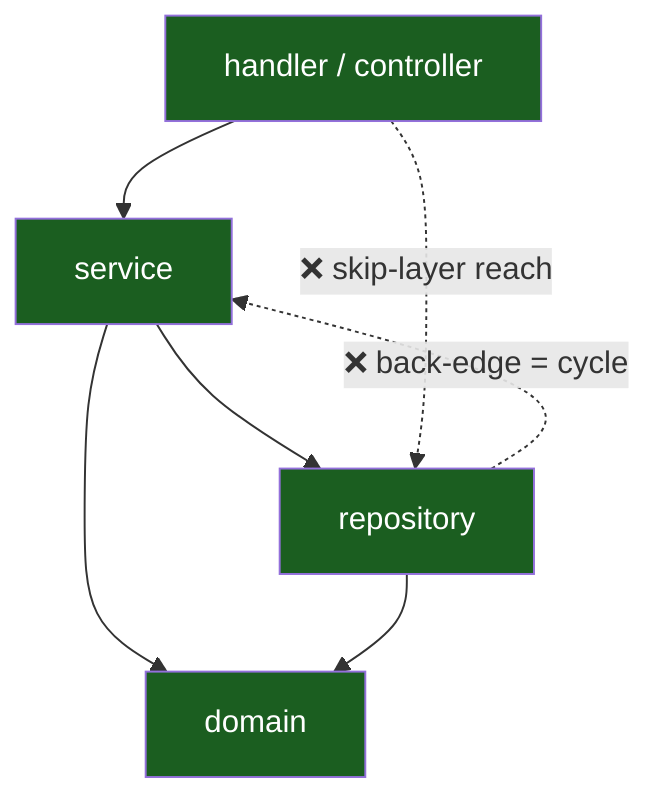
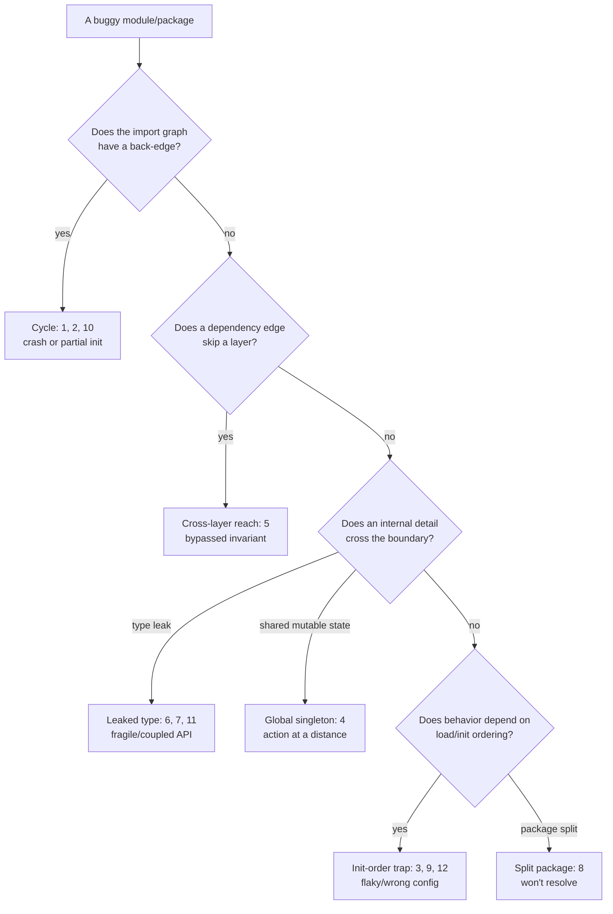

# Modules & Packages — Find the Bug

> 12 buggy snippets where the defect lives in the *packaging structure* — an import cycle, a leaked boundary, a re-export, an init-order trap — not in any single line of logic. Find the structural mistake, name its runtime consequence, then fix the layout.

---

## Table of Contents

1. [Snippet 1 — Circular import crashes at module load (Python)](#snippet-1--circular-import-crashes-at-module-load-python)
2. [Snippet 2 — Import cycle won't compile (Go)](#snippet-2--import-cycle-wont-compile-go)
3. [Snippet 3 — `__init__.py` side effect runs in the wrong order (Python)](#snippet-3--__init__py-side-effect-runs-in-the-wrong-order-python)
4. [Snippet 4 — Package-level singleton leaks mutable state across consumers (Go)](#snippet-4--package-level-singleton-leaks-mutable-state-across-consumers-go)
5. [Snippet 5 — Controller reaches the repository and skips a service invariant (Java)](#snippet-5--controller-reaches-the-repository-and-skips-a-service-invariant-java)
6. [Snippet 6 — Re-exported third-party type breaks on a library upgrade (Python)](#snippet-6--re-exported-third-party-type-breaks-on-a-library-upgrade-python)
7. [Snippet 7 — An internal type escaped the package boundary (Go)](#snippet-7--an-internal-type-escaped-the-package-boundary-go)
8. [Snippet 8 — Java split package across the module path (Java)](#snippet-8--java-split-package-across-the-module-path-java)
9. [Snippet 9 — `init()` order bug from package-level state (Go)](#snippet-9--init-order-bug-from-package-level-state-go)
10. [Snippet 10 — "God" config package import cycle hides a partially-initialized module (Python)](#snippet-10--god-config-package-import-cycle-hides-a-partially-initialized-module-python)
11. [Snippet 11 — Re-exported transitive dependency causes version skew (Go)](#snippet-11--re-exported-transitive-dependency-causes-version-skew-go)
12. [Snippet 12 — Static initialization order across packages (Java)](#snippet-12--static-initialization-order-across-packages-java)
- [Scorecard](#scorecard)
- [Related Topics](#related-topics)

---

## How to Use

For each snippet:

1. Read the **layout** first — the file/package boundaries matter more than any single line. Trace what imports what.
2. Ask: *when does this break — at import/compile time, at first call, or only under a specific load/upgrade?* Structural bugs love to hide until a second consumer, a reorder, or a version bump exposes them.
3. State the **consequence** (crash, silent wrong answer, runtime panic, broken public API) before reading the answer.
4. Open `<details>` and check yourself. The fix is almost always *move a boundary*, not *patch a line*.

The dependency shape that nearly every bug here violates:



Dependencies point one way: down the layers. A back-edge is a cycle. A skip-edge bypasses an invariant. Both are the bugs below.

---

### Snippet 1 — Circular import crashes at module load (Python)

**Difficulty:** 🟢 Junior

```python
# models/user.py
from services.billing import charge_monthly_fee

class User:
    def __init__(self, name):
        self.name = name

    def renew(self, amount):
        return charge_monthly_fee(self, amount)


# services/billing.py
from models.user import User

DEFAULT_PLAN = User("system")   # module-level instance

def charge_monthly_fee(user, amount):
    # ... talk to payment gateway ...
    return f"charged {user.name} {amount}"
```

```python
# app.py
from models.user import User      # <-- first import in the program

u = User("alice")
print(u.renew(9.99))
```

**What's wrong?**

<details><summary>Answer</summary>

**Structural bug:** `models.user` imports `services.billing`, and `services.billing` imports `models.user` — a direct import cycle. Worse, `services.billing` executes `DEFAULT_PLAN = User("system")` *at module load time*, while `models.user` is still half-initialized.

**Consequence (crash at import):** Running `app.py` triggers:

```
Traceback (most recent call last):
  File "app.py", line 1, in <module>
    from models.user import User
  File "models/user.py", line 2, in <module>
    from services.billing import charge_monthly_fee
  File "services/billing.py", line 2, in <module>
    from models.user import User
ImportError: cannot import name 'User' from partially initialized module
'models.user' (most likely due to a circular import)
```

When Python imports `models.user`, it begins executing it, hits `from services.billing import ...`, jumps into `services.billing`, which does `from models.user import User` — but `models.user` has not yet defined `User` (execution is still on line 2). The name doesn't exist in the partially-initialized module, so the import fails. This is not a logic error; the program never reaches `main`.

**Fix:** Break the cycle by direction. `models` is the lower layer and must not import `services`. Invert the dependency — the service depends on the model, never the reverse. Move the call out of the model:

```python
# models/user.py   (no service import)
class User:
    def __init__(self, name):
        self.name = name


# services/billing.py
from models.user import User

def charge_monthly_fee(user, amount):
    return f"charged {user.name} {amount}"

def renew(user, amount):          # behavior moved up to the service layer
    return charge_monthly_fee(user, amount)
```

Now the import graph is acyclic: `services → models`, full stop. If a model truly needs service behavior, pass it in (dependency injection) rather than importing upward.
</details>

---

### Snippet 2 — Import cycle won't compile (Go)

**Difficulty:** 🟢 Junior

```go
// package order
package order

import "shop/payment"

type Order struct {
    ID    string
    Total int
}

func (o *Order) Pay() error {
    return payment.Process(o)
}
```

```go
// package payment
package payment

import "shop/order"   // <-- back-edge

func Process(o *order.Order) error {
    if o.Total <= 0 {
        return fmt.Errorf("order %s has non-positive total", o.ID)
    }
    // ... charge ...
    return nil
}
```

**What's wrong?**

<details><summary>Answer</summary>

**Structural bug:** `order` imports `payment`, `payment` imports `order`. Go forbids import cycles at the language level — there is no partially-initialized fallback as in Python; the build simply fails.

**Consequence (compile error):**

```
package shop/order
        imports shop/payment
        imports shop/order: import cycle not allowed
```

The code never produces a binary. This is a hard stop, which is actually a mercy — the compiler caught the layering mistake for you.

**Fix:** `payment.Process` only needs the order's `ID` and `Total`, not the concrete `order.Order` type. Depend on a small interface defined in the *consumer* package (`payment`), so the dependency points one way:

```go
// package payment   (no import of order)
package payment

type Payable interface {
    Amount() int
    Reference() string
}

func Process(p Payable) error {
    if p.Amount() <= 0 {
        return fmt.Errorf("reference %s has non-positive total", p.Reference())
    }
    return nil
}
```

```go
// package order   (imports payment; payment does NOT import order)
package order

import "shop/payment"

type Order struct {
    ID    string
    Total int
}

func (o *Order) Amount() int       { return o.Total }
func (o *Order) Reference() string { return o.ID }

func (o *Order) Pay() error { return payment.Process(o) }
```

`Order` satisfies `payment.Payable` structurally (Go's implicit interfaces), so the back-edge disappears: `order → payment` only.
</details>

---

### Snippet 3 — `__init__.py` side effect runs in the wrong order (Python)

**Difficulty:** 🟡 Mid

```python
# analytics/__init__.py
from analytics.registry import REGISTRY
from analytics import reports     # importing this registers report handlers

print("analytics ready, handlers:", list(REGISTRY))


# analytics/registry.py
REGISTRY = {}

def register(name):
    def deco(fn):
        REGISTRY[name] = fn
        return fn
    return deco


# analytics/reports.py
from analytics import REGISTRY     # (!) imports from the package, not the module

@register("daily")
def daily_report():
    ...
```

**What's wrong?**

<details><summary>Answer</summary>

**Structural bug:** two intertwined problems, both rooted in *where* names live.

1. `analytics/reports.py` does `from analytics import REGISTRY` — it imports from the **package** `analytics` (i.e. `analytics/__init__.py`), not from the module `analytics.registry`. But `__init__.py` is *mid-execution* when it triggers `import analytics.reports` (line 2). At that point `__init__.py` has run line 1 (`from analytics.registry import REGISTRY`), so the name `REGISTRY` *does* happen to exist on the package — today. It only works by accident of line ordering.

2. `reports.py` also calls `@register(...)`, but it never imports `register` — it imported `REGISTRY`. This raises `NameError: name 'register' is not defined` the moment `reports.py` is loaded.

**Consequence:** import-time `NameError`, and even after you "fix" it by also importing `register`, the design is a time bomb: reordering the two lines in `__init__.py` (a totally innocent edit) makes `REGISTRY` not-yet-defined on the package when `reports` imports it → `ImportError: cannot import name 'REGISTRY' from partially initialized module 'analytics'`.

**Fix:** never import shared state *from a package's `__init__`*; import it from the concrete module that owns it, and don't run registration side effects through `__init__` ordering.

```python
# analytics/reports.py
from analytics.registry import REGISTRY, register   # concrete module, both names

@register("daily")
def daily_report():
    ...
```

```python
# analytics/__init__.py   — keep it dumb; no logic, no ordering dependency
from analytics.registry import REGISTRY
from analytics import reports   # side-effect import last, and it's now safe
```

Better still, replace import-time registration with an explicit `load_reports()` call so the order is visible and testable, instead of hiding it in `__init__` execution order.
</details>

---

### Snippet 4 — Package-level singleton leaks mutable state across consumers (Go)

**Difficulty:** 🟡 Mid

```go
// package httpclient
package httpclient

import "net/http"

// Shared default client, exported for convenience.
var Default = &http.Client{}

func Get(url string) (*http.Response, error) {
    return Default.Get(url)
}
```

```go
// package analytics   (background batch jobs, long timeouts OK)
package analytics

import "myapp/httpclient"

func init() {
    httpclient.Default.Timeout = 5 * time.Minute   // batch jobs are slow
}
```

```go
// package checkout   (user-facing, must be snappy)
package checkout

import "myapp/httpclient"

func Charge(url string) error {
    _, err := httpclient.Get(url)   // expects a fast, ~2s timeout
    return err
}
```

**What's wrong?**

<details><summary>Answer</summary>

**Structural bug:** `httpclient.Default` is an **exported, mutable package-level singleton**. Every importer shares the *same pointer*. `analytics.init()` mutates `Default.Timeout` to 5 minutes for the whole process. `checkout`, which assumed a snappy client, now silently inherits a 5-minute timeout.

**Consequence (silent, action-at-a-distance):** A hung payment endpoint that should fail in ~2 seconds now hangs a user request for up to 5 minutes, because an unrelated batch package reconfigured a shared global. There's no compile error and no obvious link between the two packages — the only connection is the shared mutable variable. Whoever debugs `checkout` will never look in `analytics`.

**Fix:** don't export shared mutable state. Each consumer constructs (or is injected with) the client it needs.

```go
// package httpclient
package httpclient

import (
    "net/http"
    "time"
)

func New(timeout time.Duration) *http.Client {
    return &http.Client{Timeout: timeout}
}
```

```go
// package checkout
package checkout

type Charger struct{ client *http.Client }

func NewCharger(client *http.Client) *Charger { return &Charger{client: client} }

func (c *Charger) Charge(url string) error {
    _, err := c.client.Get(url)
    return err
}

// wired in main():  checkout.NewCharger(httpclient.New(2 * time.Second))
//                    analytics.New(httpclient.New(5 * time.Minute))
```

Each consumer owns its own client. No global pointer, no cross-package mutation, no surprise.
</details>

---

### Snippet 5 — Controller reaches the repository and skips a service invariant (Java)

**Difficulty:** 🟡 Mid

```java
// package com.shop.web
package com.shop.web;

import com.shop.repo.AccountRepository;   // (!) reaching past the service layer
import com.shop.domain.Account;

@RestController
public class TransferController {
    private final AccountRepository repo;   // injected directly

    @PostMapping("/accounts/{id}/balance")
    public void setBalance(@PathVariable String id, @RequestBody long newBalance) {
        Account a = repo.findById(id);
        a.setBalance(newBalance);
        repo.save(a);          // writes straight to persistence
    }
}
```

```java
// package com.shop.service
package com.shop.service;

import com.shop.repo.AccountRepository;
import com.shop.domain.Account;

@Service
public class AccountService {
    private final AccountRepository repo;

    // The invariant lives HERE — and only here.
    public void setBalance(String id, long newBalance) {
        if (newBalance < 0) {
            throw new IllegalArgumentException("balance cannot go negative");
        }
        Account a = repo.findById(id);
        a.setBalance(newBalance);
        repo.save(a);
        auditLog.record("BALANCE_SET", id, newBalance);   // audit invariant
    }
}
```

**What's wrong?**

<details><summary>Answer</summary>

**Structural bug:** `TransferController` (in `com.shop.web`) imports and injects `AccountRepository` (in `com.shop.repo`) **directly**, skipping `AccountService`. The dependency edge `web → repo` jumps over the service layer that owns the business invariants.

**Consequence (silent invariant bypass):** The `< 0` guard and the audit-log write live *only* in `AccountService.setBalance`. The controller's path never executes them. So:

- A client can `POST` a negative balance and it persists — the negative-balance invariant is silently violated.
- No audit record is written, so the change is invisible to compliance.

Both rules were enforced by the service. By reaching the repo, the controller created a second write path that no one remembered to protect. This compiles cleanly and passes any test that only exercises the service.

**Fix:** make the layering a hard rule — the web layer may depend on the service, never on the repository. Remove the repo import from the controller and route through the service.

```java
// package com.shop.web
package com.shop.web;

import com.shop.service.AccountService;   // service ONLY — no repo import

@RestController
public class TransferController {
    private final AccountService service;

    @PostMapping("/accounts/{id}/balance")
    public void setBalance(@PathVariable String id, @RequestBody long newBalance) {
        service.setBalance(id, newBalance);   // invariant + audit guaranteed
    }
}
```

Enforce it structurally so it can't regress: keep `AccountRepository` package-private (or in an `internal`/`impl` package the web layer cannot import), or add an ArchUnit rule:

```java
@ArchTest
static final ArchRule webMustNotTouchRepo =
    noClasses().that().resideInAPackage("..web..")
        .should().dependOnClassesThat().resideInAPackage("..repo..");
```

Now the only way to write a balance is through the service, and the invariant has exactly one enforcement point.
</details>

---

### Snippet 6 — Re-exported third-party type breaks on a library upgrade (Python)

**Difficulty:** 🟡 Mid

```python
# ourlib/__init__.py    — our package's PUBLIC API
from pydantic import BaseModel as Schema      # (!) re-exporting a 3rd-party type
from pydantic import ValidationError          # (!) re-exporting its exception too

__all__ = ["Schema", "ValidationError", "User"]

class User(Schema):
    name: str
    age: int
```

```python
# downstream consumer (a different team's app)
from ourlib import Schema, ValidationError, User

class Account(Schema):                 # they subclass our re-exported Schema
    owner: User
    balance: int

try:
    Account(owner=User(name="a", age=1), balance=-5)
except ValidationError as e:           # they catch our re-exported exception
    handle(e)
```

We pin `pydantic>=1,<3`. Our CI upgrades pydantic 1 → 2.

**What's wrong?**

<details><summary>Answer</summary>

**Structural bug:** `ourlib` **re-exports a third-party type as part of its own public API** (`Schema` is just `pydantic.BaseModel`; `ValidationError` is `pydantic`'s). The library's public surface is now silently coupled to pydantic's internal shape. Downstream code depends on `ourlib.Schema`, believing it's *our* contract — but it's pydantic's, transitively.

**Consequence (silent API break on upgrade):** Pydantic 1 → 2 changed `BaseModel`'s config mechanics, validator decorators, and the *location/semantics* of `ValidationError`. When we bump pydantic:

- Downstream subclasses of `Schema` that used v1-style config or `@validator` break, even though *our* version number didn't change and our changelog says nothing.
- `except ValidationError` may stop catching the errors that are actually raised (v2 can raise a `pydantic_core.ValidationError`), so error handling silently falls through.

We changed our public API by upgrading a dependency — a hidden coupling that violates semver from the consumer's point of view.

**Fix:** don't leak third-party types across your boundary. Own your public types; adapt at the edge.

```python
# ourlib/api.py    — OUR types, OUR exception
class ValidationError(Exception):
    """ourlib's stable validation error — independent of any backend lib."""

class User:
    def __init__(self, name: str, age: int):
        self.name = name
        self.age = age

def parse_user(data: dict) -> User:
    try:
        m = _PydanticUser(**data)        # pydantic stays an INTERNAL detail
    except _pydantic_ValidationError as e:
        raise ValidationError(str(e)) from e
    return User(m.name, m.age)
```

```python
# ourlib/__init__.py
from ourlib.api import User, ValidationError, parse_user
__all__ = ["User", "ValidationError", "parse_user"]   # no pydantic in sight
```

Now upgrading (or replacing) pydantic is an internal change. The public API is ours and stable.
</details>

---

### Snippet 7 — An internal type escaped the package boundary (Go)

**Difficulty:** 🔴 Senior

```go
// package cache
package cache

import "time"

// entry is meant to be private bookkeeping. But it's returned...
type entry struct {
    value     []byte
    expiresAt time.Time
}

// Get returns the raw entry "for efficiency".
func (c *Cache) GetEntry(key string) (*entry, bool) {   // (!) leaks *entry
    e, ok := c.m[key]
    return e, ok
}
```

```go
// package handler   (a different package, a different team)
package handler

import "myapp/cache"

func serve(c *cache.Cache, key string) []byte {
    e, ok := c.GetEntry(key)
    if !ok {
        return nil
    }
    e.expiresAt = e.expiresAt.Add(time.Hour)   // (!) mutates cache internals
    return e.value
}
```

**What's wrong?**

<details><summary>Answer</summary>

**Structural bug:** `entry` is lowercase — *intended* to be unexported and private to `cache`. But `GetEntry` returns `*entry`, so a pointer to the cache's internal bookkeeping escapes the package. Go's export rules stop *other packages from naming* `entry`, but they don't stop them from *holding and mutating a pointer* to it (via `:=` type inference). The boundary leaked.

**Consequence (corrupted internal invariant):** `handler.serve` mutates `e.expiresAt` directly — it's writing into the cache's own storage with no lock, no validation, and no eviction bookkeeping. This causes:

- Data races: the cache may guard `c.m` with a mutex, but `handler` mutates the entry *outside* that lock → `go test -race` fires, or worse, silent corruption in production.
- Broken eviction: extending `expiresAt` behind the cache's back defeats TTL accounting; entries the cache believes are expired stay alive.

The cache can no longer guarantee its own invariants because a pointer to its guts walked out the front door.

**Fix:** never return a pointer to an internal type. Return a copy of a *public, immutable* value, and provide explicit mutating methods that go through the lock.

```go
// package cache
package cache

// Value is the public, copy-out view. No pointer to internals.
type Value struct {
    Data      []byte
    ExpiresAt time.Time
}

func (c *Cache) Get(key string) (Value, bool) {
    c.mu.RLock()
    defer c.mu.RUnlock()
    e, ok := c.m[key]
    if !ok {
        return Value{}, false
    }
    return Value{Data: e.value, ExpiresAt: e.expiresAt}, true   // copy out
}

// Mutation is explicit and goes through the lock.
func (c *Cache) Extend(key string, d time.Duration) {
    c.mu.Lock()
    defer c.mu.Unlock()
    if e, ok := c.m[key]; ok {
        e.expiresAt = e.expiresAt.Add(d)
    }
}
```

Consumers can read a `Value` and call `Extend`, but they can never reach into `entry`. The boundary holds.
</details>

---

### Snippet 8 — Java split package across the module path (Java)

**Difficulty:** 🔴 Senior

```
# Two JARs, both declaring classes in the SAME package com.acme.util:

util-core.jar
└── com/acme/util/Strings.class      (module com.acme.core)

util-extra.jar
└── com/acme/util/Numbers.class      (module com.acme.extra)
```

```java
// module-info.java for com.acme.core
module com.acme.core {
    exports com.acme.util;     // exports package com.acme.util
}

// module-info.java for com.acme.extra
module com.acme.extra {
    exports com.acme.util;     // ALSO exports com.acme.util  (!)
}
```

```java
// app
module com.acme.app {
    requires com.acme.core;
    requires com.acme.extra;
}
```

**What's wrong?**

<details><summary>Answer</summary>

**Structural bug:** the same package, `com.acme.util`, is split across two named modules (`com.acme.core` and `com.acme.extra`). On the classpath this was merely fragile; under the **Java Platform Module System (JPMS)** it is illegal. A package must belong to exactly one module — modules cannot share a package.

**Consequence (won't start / won't build):** when both modules are on the module path, the runtime/compiler rejects it:

```
java.lang.module.ResolutionException: Modules com.acme.extra and com.acme.core
export package com.acme.util to module com.acme.app
```

or at launch:

```
Error occurred during initialization of boot layer
java.lang.LayerInstantiationException: Package com.acme.util in both
module com.acme.extra and module com.acme.core
```

The application doesn't start. (On the legacy classpath the same split causes the subtler bug that only the *first* JAR's classes in that package are visible, so `Numbers` may silently vanish — a `NoClassDefFoundError` at runtime.)

**Fix:** one package, one module. Give each module its own package namespace, and never split a package across module/JAR boundaries.

```java
// com.acme.core exports com.acme.util.strings
module com.acme.core {
    exports com.acme.util.strings;   // Strings lives here
}

// com.acme.extra exports com.acme.util.numbers
module com.acme.extra {
    exports com.acme.util.numbers;   // Numbers lives here
}
```

If the two genuinely belong together, merge them into a single module. The rule is structural: a package is owned by exactly one module, full stop.
</details>

---

### Snippet 9 — `init()` order bug from package-level state (Go)

**Difficulty:** 🔴 Senior

```go
// package config
package config

var Settings = load()   // package-level var initializer

func load() map[string]string {
    return map[string]string{
        "region": os.Getenv("REGION"),   // read at package-init time
    }
}
```

```go
// package metrics
package metrics

import "myapp/config"

// Package-level var: initialized when `metrics` is initialized.
var client = newClient(config.Settings["region"])

func newClient(region string) *Client {
    if region == "" {
        region = "us-east-1"   // fallback baked in at init
    }
    return &Client{region: region}
}
```

```go
// package main
package main

import (
    "os"
    "myapp/metrics"
)

func main() {
    os.Setenv("REGION", "eu-west-1")   // (!) set AFTER imports are initialized
    metrics.Report("startup")          // already pinned to the wrong region
}
```

**What's wrong?**

<details><summary>Answer</summary>

**Structural bug:** initialization happens through **package-level variable initializers**, which Go runs *before* `main` executes, in dependency order. The chain is:

1. `config` initializes first → `load()` reads `os.Getenv("REGION")`, which is empty at that instant.
2. `metrics` initializes next → `client = newClient("")` → falls back to `"us-east-1"`.
3. *Only then* does `main` run and call `os.Setenv("REGION", "eu-west-1")` — far too late.

**Consequence (silent wrong configuration):** the metrics client is permanently pinned to `us-east-1` even though the program sets `eu-west-1`. No error, no panic — metrics just flow to the wrong region forever. The bug is in *when* the code runs, dictated by package-init ordering you don't control, not in any line's logic.

**Fix:** don't do environment-dependent work in package-level initializers. Initialize *explicitly* inside `main` (or via an `Init`/constructor) after the environment is set.

```go
// package config
package config

type Config struct{ Region string }

func Load() Config {                      // explicit, called when YOU choose
    region := os.Getenv("REGION")
    if region == "" {
        region = "us-east-1"
    }
    return Config{Region: region}
}
```

```go
// package metrics
package metrics

func NewClient(cfg config.Config) *Client { return &Client{region: cfg.Region} }
```

```go
// package main
func main() {
    os.Setenv("REGION", "eu-west-1")   // or rely on the real environment
    cfg := config.Load()               // reads env AFTER it's correct
    m := metrics.NewClient(cfg)
    m.Report("startup")                // eu-west-1 ✓
}
```

Now ordering is explicit and visible in `main`, not an emergent property of the import graph.
</details>

---

### Snippet 10 — "God" config package import cycle hides a partially-initialized module (Python)

**Difficulty:** 🔴 Senior

```python
# config.py    — the "god" config everything imports
from db import DB_POOL_SIZE       # config pulls a constant from db
from cache import CACHE_TTL       # ...and from cache

DATABASE_URL = "postgres://localhost/app"
POOL_SIZE = DB_POOL_SIZE
TTL = CACHE_TTL


# db.py
from config import DATABASE_URL   # (!) db imports config, which imports db

DB_POOL_SIZE = 20

def connect():
    return f"connecting to {DATABASE_URL} (pool={DB_POOL_SIZE})"


# cache.py
from config import TTL            # cache imports config too
CACHE_TTL = 300
```

```python
# app.py
import config
print(config.connect_db())
```

**What's wrong?**

<details><summary>Answer</summary>

**Structural bug:** `config` is a **"god" module** that both *provides* settings to everyone and *imports* from the very modules it configures (`db`, `cache`). That creates a cycle: `config → db → config`. Because Python allows partially-initialized modules (unlike Go), this doesn't always crash outright — it produces something worse: **non-deterministic, order-dependent constants**.

**Consequence (partially-initialized module → wrong/missing values):** trace `import config`:

1. Python starts executing `config.py`, hits `from db import DB_POOL_SIZE`.
2. Jumps into `db.py`, which does `from config import DATABASE_URL` — but `config` is mid-execution and `DATABASE_URL` is defined *below* the failing import line, so it doesn't exist yet → `ImportError: cannot import name 'DATABASE_URL' from partially initialized module 'config'`.

If you "fix" it by reordering `config.py` so `DATABASE_URL` is defined first, the crash moves or disappears, but now the *value* depends on import order — a landmine for the next edit. The root issue is that the god config sits in a cycle with its consumers.

**Fix:** invert the dependency. Config must be a **leaf** — it depends on nothing in the app; the app depends on it. Push constants down to the modules that own them, and let config import-only (never be imported-from by its own dependencies).

```python
# config.py    — a LEAF. Imports nothing from the app.
DATABASE_URL = "postgres://localhost/app"
POOL_SIZE = 20
TTL = 300
```

```python
# db.py
from config import DATABASE_URL, POOL_SIZE   # one-way: db → config

def connect():
    return f"connecting to {DATABASE_URL} (pool={POOL_SIZE})"
```

```python
# cache.py
from config import TTL            # one-way: cache → config
```

The import graph is now a tree with `config` at the bottom. No cycle, no partially-initialized module, no order dependence.
</details>

---

### Snippet 11 — Re-exported transitive dependency causes version skew (Go)

**Difficulty:** 🔴 Senior

```go
// module github.com/acme/sdk    (our public SDK)
// go.mod requires github.com/uuid/uuid v1.2.0
package sdk

import "github.com/uuid/uuid"

// We re-export the third-party UUID type in our PUBLIC signature.
type Event struct {
    ID   uuid.UUID   // (!) a transitive dependency's type in our public API
    Name string
}

func NewEvent(name string) Event {
    return Event{ID: uuid.New(), Name: name}
}
```

```go
// downstream app
// go.mod requires:
//   github.com/acme/sdk     v1.0.0   (which needs uuid v1.2.0)
//   github.com/uuid/uuid    v2.0.0   (app uses v2 directly)
package main

import (
    "github.com/acme/sdk"
    "github.com/uuid/uuid"   // app's own, at v2
)

func main() {
    e := sdk.NewEvent("login")
    var id uuid.UUID = e.ID   // (!) assigning sdk's uuid.UUID to app's uuid.UUID
    _ = id
}
```

**What's wrong?**

<details><summary>Answer</summary>

**Structural bug:** the SDK puts a **transitive dependency's type (`uuid.UUID`) in its public API**. The SDK's `Event.ID` is "`uuid.UUID` as defined by uuid `v1.2.0`," but the downstream app imports uuid `v2.0.0` directly. Go modules treat `github.com/uuid/uuid` and `github.com/uuid/uuid/v2` as **different import paths / different types** under semantic import versioning.

**Consequence (compile error / version skew):** the assignment `var id uuid.UUID = e.ID` fails to compile because `e.ID` is the *v1* `uuid.UUID` and the local `uuid.UUID` is *v2* — distinct types with the same name:

```
cannot use e.ID (variable of type "github.com/uuid/uuid".UUID) as
"github.com/uuid/uuid/v2".UUID value in variable declaration
```

Even when major versions match, re-exporting a dependency's type means *your* consumers are forced onto *your* exact version of it — a hidden coupling that turns a transitive dependency into part of your public contract.

**Fix:** don't expose transitive-dependency types across your boundary. Expose a primitive (or your own type) and keep the dependency internal.

```go
// module github.com/acme/sdk
package sdk

import "github.com/uuid/uuid"   // stays an INTERNAL implementation detail

type Event struct {
    ID   string   // public API uses a stable primitive, not uuid.UUID
    Name string
}

func NewEvent(name string) Event {
    return Event{ID: uuid.New().String(), Name: name}
}
```

Now the app can use whatever uuid version it likes; the SDK's API doesn't drag a specific transitive version into the consumer's build.
</details>

---

### Snippet 12 — Static initialization order across packages (Java)

**Difficulty:** 🔴 Senior

```java
// package com.app.flags
package com.app.flags;

public final class FeatureFlags {
    // Static field initialized at class-load time.
    public static final boolean NEW_PRICING =
        Boolean.parseBoolean(System.getProperty("new.pricing", "false"));
}
```

```java
// package com.app.pricing
package com.app.pricing;

import com.app.flags.FeatureFlags;

public final class PricingEngine {
    // Captured ONCE, when PricingEngine is loaded.
    private static final double RATE = FeatureFlags.NEW_PRICING ? 0.8 : 1.0;

    public static double price(double base) { return base * RATE; }
}
```

```java
// package com.app
package com.app;

public class Main {
    public static void main(String[] args) {
        // (!) set the system property AFTER classes may already be loaded
        System.setProperty("new.pricing", "true");
        System.out.println(PricingEngine.price(100));   // expects 80, gets 100?
    }
}
```

**What's wrong?**

<details><summary>Answer</summary>

**Structural bug:** the feature flag's value is captured in a **`static final` field at class-load time**, and `PricingEngine.RATE` freezes that value into *another* static at *its* load time. The actual value depends on *when each class is loaded* relative to `System.setProperty` — an ordering that spans packages and is invisible from any single file.

**Consequence (flaky, environment-dependent wrong answer):** if anything triggers `FeatureFlags`/`PricingEngine` class-loading before `main` sets the property (a static logger, a DI container scanning classes, another `static` reference, a test that touched the class), then `NEW_PRICING` reads `"false"` and `RATE` freezes at `1.0`. `price(100)` returns `100` instead of `80`. Move the `setProperty` line, add an unrelated import, or change JVM class-load timing, and the result flips. It is reproducible only by accident — the worst kind of bug.

**Fix:** don't bind configuration to static initialization order. Read the flag *at use time* (or inject it), so there is no frozen-at-load-time coupling between packages.

```java
// package com.app.flags
package com.app.flags;

public final class FeatureFlags {
    public static boolean newPricing() {                 // evaluated on each call
        return Boolean.parseBoolean(System.getProperty("new.pricing", "false"));
    }
}
```

```java
// package com.app.pricing
package com.app.pricing;

import com.app.flags.FeatureFlags;

public final class PricingEngine {
    public static double price(double base) {
        double rate = FeatureFlags.newPricing() ? 0.8 : 1.0;   // read at use time
        return base * rate;
    }
}
```

Better still, inject a `PricingConfig` constructed after configuration is finalized, so use sites never reach across packages into a static at all. Either way, the answer no longer depends on cross-package class-load ordering.
</details>

---

## Scorecard

Track which structural failure modes you can spot unaided. The skill is recognizing the *category* from the layout before reading any logic.

| # | Snippet | Language | Failure mode | When it breaks | Got it? |
|---|---------|----------|--------------|----------------|---------|
| 1 | Circular import | Python | Import cycle | Import time (`ImportError`) | ☐ |
| 2 | Import cycle won't compile | Go | Import cycle | Compile time | ☐ |
| 3 | `__init__.py` side effect | Python | Init/registration order | Import time (`NameError`/`ImportError`) | ☐ |
| 4 | Mutable package singleton | Go | Shared global state | Runtime, cross-package | ☐ |
| 5 | Controller → repo skip | Java | Cross-layer reach | Runtime (invariant bypass) | ☐ |
| 6 | Re-exported lib type | Python | Leaked public API | Dependency upgrade | ☐ |
| 7 | Internal type escaped | Go | Broken encapsulation | Runtime (race/corruption) | ☐ |
| 8 | Split package | Java | One package, two modules | Build/launch time | ☐ |
| 9 | `init()` order | Go | Package-init ordering | Runtime (wrong config) | ☐ |
| 10 | God config cycle | Python | Cyclic god module | Import time / order-dependent | ☐ |
| 11 | Re-exported transitive dep | Go | Version skew | Build time | ☐ |
| 12 | Static init order | Java | `static final` load order | Flaky runtime | ☐ |

**Scoring:**

- **10–12 correct:** You read dependency graphs, not just lines. You'd catch these in review.
- **6–9 correct:** Solid on cycles; revisit boundary leaks (6, 7, 11) and init-order traps (9, 12).
- **0–5 correct:** Focus on the one repeating lesson: *dependencies must point one way, and a package's internals must not escape it.* Re-read [junior.md](junior.md) and trace every import before reading logic.

The unifying diagnosis across all twelve:



---

## Related Topics

- [junior.md](junior.md) — the beginner-level definitions of each module/packaging anti-pattern shown here.
- [tasks.md](tasks.md) — hands-on exercises: break a cycle, seal a boundary, fix an init-order trap.
- [Chapter README](../README.md) — the positive rules these snippets violate.
- [Anti-Patterns chapter](../../anti-patterns/README.md) — broader catalog of design and structural anti-patterns.
- [Refactoring chapter](../../refactoring/README.md) — techniques (Move Class, Extract Interface, Dependency Inversion) that fix the layouts above.