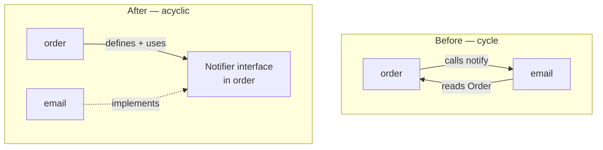
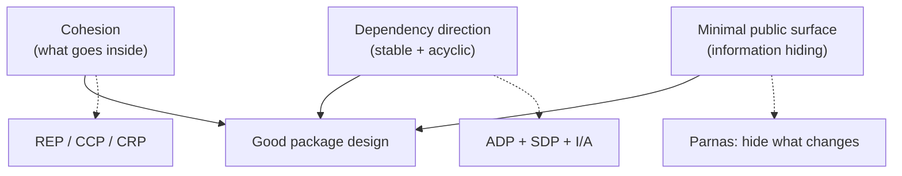

# Modules & Packages — Interview Questions

> 55 questions across four tiers (Junior → Staff). Packages are the unit of *release, reuse, and reasoning* — the interviewer is probing whether you can keep a codebase navigable as it grows past one person's head. Use this as self-review or interview prep.

---

## Table of Contents

- [Junior (15)](#junior-15-questions)
- [Mid (15)](#mid-15-questions)
- [Senior (15)](#senior-15-questions)
- [Staff (10)](#staff-10-questions)
- [Rapid-Fire](#rapid-fire)
- [Summary](#summary)
- [Further Reading](#further-reading)
- [Related Topics](#related-topics)

---

## Junior (15 questions)

### J1. What is a package (or module)?

<details><summary>Answer</summary>

A named grouping of related code that defines a **namespace** and a **visibility boundary**. Inside the boundary, members see each other freely; outside, only the exported surface is reachable. It is the smallest unit you can publish, version, and depend on.

</details>

### J2. What's the difference between package-by-layer and package-by-feature?

<details><summary>Answer</summary>

- **By-layer:** `controllers/`, `services/`, `repositories/` — grouped by technical role.
- **By-feature:** `billing/`, `auth/`, `catalog/` — grouped by business capability, each holding its own controller, service, and repository.

By-feature keeps the things that change together in one place; a feature change touches one folder, not three.

</details>

### J3. Why is package-by-feature usually preferred?

<details><summary>Answer</summary>

Cohesion follows the way the system actually changes. Features get added, modified, and deleted as units. With by-feature, a change is local, the public surface of a feature can be small, and you can even delete a whole feature by deleting one folder. By-layer scatters every feature across all layers.

</details>

### J4. What's the public/private boundary, and why does it matter?

<details><summary>Answer</summary>

It's the line between what callers can depend on (public) and what you're free to change (private). It matters because **you can only refactor what nobody else depends on**. A small public surface means a large private area you can rework without breaking anyone.

</details>

### J5. How does Go control package visibility?

<details><summary>Answer</summary>

By **identifier casing**: capitalized names (`Parse`) are exported; lowercase (`parse`) are package-private. There are no `public`/`private` keywords. The `internal/` directory adds a second rule: code under `.../internal/` is importable only by packages rooted at the parent of `internal`.

</details>

### J6. How does Java control package visibility?

<details><summary>Answer</summary>

Four levels: `public`, `protected`, package-private (the default — no keyword), and `private`. Package-private members are visible only within the same package, making them the natural tool for intra-package helpers. JPMS (Java 9 modules) adds a module layer on top: a package is only reachable from outside the module if module-info `exports` it.

</details>

### J7. How does Python signal a package's public surface?

<details><summary>Answer</summary>

By convention and `__all__`. A leading underscore (`_helper`) signals "private — don't import me." The `__all__` list in a module defines what `from module import *` pulls in and documents the intended public names. Python enforces none of this at runtime; it's a contract, not a wall.

</details>

### J8. What is a circular dependency between packages?

<details><summary>Answer</summary>

Package A imports B, and B (directly or transitively) imports A. The two packages can no longer be understood, compiled, tested, or released independently — they've fused into one unit wearing two names.

</details>

### J9. Why are circular package dependencies bad?

<details><summary>Answer</summary>

- You can't reason about either package alone.
- You can't unit-test one without the other.
- You can't release or reuse one without the other.
- Some languages (Go) refuse to compile them at all.
- They tend to grow: once a cycle exists, more edges get added across it.

</details>

### J10. Name one way to break a circular dependency.

<details><summary>Answer</summary>

**Dependency inversion:** define an interface in the package that *needs* the call, and have the other package implement it. The dependency now points one way (toward the abstraction). Other options: extract the shared piece into a third package both depend on, or merge the two if they're genuinely one concept.

</details>

### J11. What's wrong with a `utils` package?

<details><summary>Answer</summary>

`utils` has no cohesion — it's defined by "stuff that didn't fit elsewhere," so unrelated code (string padding, date math, retry logic) piles into one namespace. Everything imports it, so it becomes a hub that couples the whole system, and its name tells a reader nothing about what's inside.

</details>

### J12. What's the fix for a `utils` package?

<details><summary>Answer</summary>

Distribute its contents by concept. String helpers move next to (or onto) the string types they serve; date helpers form a `dates` or `clock` package; retry logic becomes a `retry` package. Each new home has a name that describes a real responsibility.

</details>

### J13. What does "minimal public surface" mean?

<details><summary>Answer</summary>

Export the fewest names that still let callers do their job. Everything you export is a promise you must keep; everything you keep private is something you can change freely. Start private, promote to public only when a real caller needs it.

</details>

### J14. What is coupling, in one sentence?

<details><summary>Answer</summary>

The degree to which one package must know about another's internals to work. Low coupling means a package depends only on the other's stable public contract — and on as few other packages as possible.

</details>

### J15. What is cohesion, in one sentence?

<details><summary>Answer</summary>

The degree to which the members of a package belong together — serving one clear responsibility. High cohesion means the package has one reason to change and a name that honestly describes everything inside it.

</details>

---

## Mid (15 questions)

### M16. Is package-by-layer ever the right choice?

<details><summary>Answer</summary>

Yes, in narrow cases: a genuinely tiny app (a few endpoints with no real domain), a sample/tutorial codebase where the layering *is* the lesson, or a thin technical library that is itself "the persistence layer." The failure mode is using it as the *default* for a growing business app — it scales into scattered changes and a flat, feature-blind structure. Even by-layer apps usually want a by-feature split *under* each layer once they grow.

> **What the interviewer is checking:** that you hold the principle without being dogmatic — you can name the exceptions and the breaking point.

</details>

### M17. Are circular dependencies *always* bad?

<details><summary>Answer</summary>

At the **package** level, effectively yes — they destroy independent reasoning, testing, and release. *Within* a package, mutual references between types are normal and fine (a `Node` and a `Tree` referencing each other). The rule is about cycles across the units you want to evolve independently, not about every reference in the codebase. Languages also differ: Go forbids package cycles outright; Java and Python permit them and let rot accumulate.

> **What the interviewer is checking:** whether you understand *why* cycles hurt (independent evolution) rather than reciting "cycles bad."

</details>

### M18. State the Acyclic Dependencies Principle (ADP).

<details><summary>Answer</summary>

> The dependency graph of packages must have no cycles.

It must form a **directed acyclic graph (DAG)**. With a DAG you can topologically sort packages, build and test them bottom-up, and release any package once its dependencies are stable. A cycle collapses a whole strongly-connected component into one un-splittable blob.

</details>

### M19. State the Stable Dependencies Principle (SDP).

<details><summary>Answer</summary>

> Depend in the direction of stability.

A package should only depend on packages that are *more* stable (harder to change) than itself. Volatile, frequently-edited packages should sit at the top of the graph depending downward onto stable ones — never the reverse, or every change to the volatile package would ripple into things that are supposed to be solid.

</details>

### M20. What makes a package "stable" in Martin's sense?

<details><summary>Answer</summary>

Stability is about **how hard it is to change**, measured by how many packages depend on it. Instability `I = Ce / (Ca + Ce)`, where `Ca` = afferent couplings (packages that depend on this one) and `Ce` = efferent couplings (packages this one depends on). `I = 0` is maximally stable (many depend on it, it depends on nothing); `I = 1` is maximally unstable.

</details>

### M21. State the three package-cohesion principles (REP, CCP, CRP).

<details><summary>Answer</summary>

- **REP — Reuse/Release Equivalence:** the unit of reuse is the unit of release. Group classes that are reused together and version them together.
- **CCP — Common Closure:** classes that change for the same reason and at the same time belong in the same package (SRP at package scope).
- **CRP — Common Reuse:** classes that are *not* reused together should not be grouped together — don't force a consumer to depend on classes it never uses.

</details>

### M22. REP, CCP, and CRP pull against each other. Explain.

<details><summary>Answer</summary>

REP and CCP are **inclusive** — they push to make packages bigger (group for release, group for co-change). CRP is **exclusive** — it pushes to make packages smaller (don't drag in unused classes). Real design balances them, and the balance *shifts over a project's life*: early on you favor CCP (developability); as it matures and gets reused, you favor REP and CRP. There is no static optimum.

> **What the interviewer is checking:** that you see package design as a moving trade-off, not a fixed recipe.

</details>

### M23. What's the difference between afferent and efferent coupling?

<details><summary>Answer</summary>

- **Afferent (`Ca`):** incoming — the number of packages that depend *on* this package. High `Ca` means many things would break if you change it → it should be stable.
- **Efferent (`Ce`):** outgoing — the number of packages this package depends *on*. High `Ce` means this package is sensitive to others' changes.

Instability `I = Ce / (Ca + Ce)` combines them into a 0–1 score.

</details>

### M24. How do you detect a cycle in a package graph?

<details><summary>Answer</summary>

Build the import graph and run a topological sort / DFS looking for a back edge — any strongly-connected component larger than one node is a cycle. Tooling: Go's compiler errors outright; Java has JDepend / ArchUnit / SonarQube; Python has `import-linter` and `pydeps`; generic tools like `madge` (JS/TS) visualize them. Wire the check into CI so cycles can't be merged.

</details>

### M25. What's "package-private" good for in practice?

<details><summary>Answer</summary>

Keeping helper classes, base implementations, and intra-package wiring out of the public API while still letting the package's own classes collaborate freely. It's the mechanism that makes package-by-feature work: the feature exports one or two facade types and keeps its repositories, mappers, and DTO-builders package-private.

</details>

### M26. What goes wrong when a public API leaks internal types?

<details><summary>Answer</summary>

If a public method returns an internal class (or an internal enum, or a third-party type), callers now depend on that internal type. You can no longer change it without breaking them — your private area has silently shrunk to nothing. Fix: return interfaces or your own stable DTOs at the boundary; never expose internals "just because they're handy."

</details>

### M27. What's a "cross-layer reach" and why is it a smell?

<details><summary>Answer</summary>

A controller importing a repository directly, skipping the service layer. It bypasses the rules the skipped layer enforces (validation, transactions, authorization) and couples the outermost layer to the innermost, so a storage change can break a controller. Enforce the layering with architecture tests, not just convention.

</details>

### M28. Should every class live in its own package?

<details><summary>Answer</summary>

No. One-class-per-package over-fragments: you drown in tiny packages, every collaboration crosses a public boundary (so everything must be public — there's no private area left), and navigation becomes a maze of folders. Package the *cluster* of classes that form one cohesive concept together; the cluster, not the class, is the unit.

> **What the interviewer is checking:** that you don't fetishize granularity — more packages is not more "modular."

</details>

### M29. What is information hiding (Parnas)?

<details><summary>Answer</summary>

David Parnas's 1972 principle: each module hides a **design decision** that is *likely to change* behind a stable interface. Callers depend on the interface, not the decision. The point isn't hiding code for secrecy — it's localizing change, so a decision can be revised without rippling outward.

</details>

### M30. How does Parnas decompose a system into modules?

<details><summary>Answer</summary>

Not by the steps of the algorithm (the obvious flowchart decomposition), but by **what is likely to change**. Each anticipated change becomes a module that hides it. His classic KWIC example: decomposing by *secrets* (storage format, sorting strategy) produced modules far more change-resilient than decomposing by processing stages, even though both "worked."

</details>

---

## Senior (15 questions)

### S31. How do you actually break a stubborn circular dependency? Give the playbook.

<details><summary>Answer</summary>

1. **Find the cycle's weakest edge** — the one call that "doesn't really belong."
2. **Invert it:** define an interface in the dependent package; implement it in the other. Dependency now points to the abstraction.
3. Or **extract** the shared concept both packages reach for into a new, more-stable third package they each depend on (downward).
4. Or **merge** them if analysis shows they're truly one concept that was split prematurely.
5. **Move the misplaced member:** sometimes one class is simply in the wrong package and relocating it dissolves the cycle.

Add a CI cycle-check afterward so it can't come back.

> **What the interviewer is checking:** that you have concrete, ordered moves — not just "use dependency injection."

</details>

### S32. Walk through the Dependency Inversion fix on a diagram.

<details><summary>Answer</summary>



`email` no longer imports `order`'s concrete types; it implements an interface `order` owns. The edge from `email` back to `order` is gone, and `order` depends only on an abstraction it controls.

</details>

### S33. Where should an interface live — with the caller or the implementer?

<details><summary>Answer</summary>

With the **caller** (the package that *uses* it), as a rule. This is the essence of Dependency Inversion: the high-level policy owns the abstraction; low-level details conform to it. Go formalizes this culturally — "accept interfaces, return structs," and define the interface where it's consumed, not where it's implemented. Putting the interface with the implementer often just relocates the coupling.

</details>

### S34. How do you measure and use the I/A (Main Sequence) metric?

<details><summary>Answer</summary>

Plot each package by instability `I` (x-axis) and **abstractness** `A` (y-axis), where `A` = abstract types / total types. The ideal line `A + I = 1` is the **Main Sequence**. Distance from it, `D = |A + I − 1|`, flags trouble:

- **Zone of Pain** (low A, low I): rigid concrete packages that everyone depends on — painful to change.
- **Zone of Uselessness** (high A, high I): abstract packages nobody depends on — dead abstraction.

Use `D` as a code-health signal, not a hard gate.

</details>

### S35. A package has high afferent coupling *and* high instability. What does that tell you?

<details><summary>Answer</summary>

It's a contradiction that signals a design problem: many packages depend on it (high `Ca` → it *should* be stable) yet it itself depends on many volatile things (high `Ce` → it's actually unstable). Every churn in its dependencies ripples out to its many dependents. Fix by splitting out a stable abstract core that the dependents target, pushing the volatile bits behind it.

</details>

### S36. How do you enforce architecture rules so they don't rot?

<details><summary>Answer</summary>

Encode them as **tests**, not wiki pages. ArchUnit (Java), `import-linter` (Python), `depguard`/`go-arch-lint` (Go), `eslint-plugin-boundaries` / `dependency-cruiser` (TS) let you assert "no cycles," "controllers may not import repositories," "domain may not import infrastructure." Run them in CI; a violation fails the build the moment it's introduced, when it's cheapest to fix.

</details>

### S37. Give an ArchUnit-style rule that forbids cross-layer reaches.

<details><summary>Answer</summary>

```java
@ArchTest
static final ArchRule controllers_must_go_through_services =
    noClasses().that().resideInAPackage("..controller..")
               .should().dependOnClassesThat().resideInAPackage("..repository..");
```

This fails the build if any controller imports a repository directly, forcing all access through the service layer.

</details>

### S38. How does Go's `internal/` directory enforce boundaries?

<details><summary>Answer</summary>

A package located at `.../foo/internal/bar` is importable **only** by code whose import path is rooted at `.../foo` (the parent of `internal`). The compiler rejects imports from anywhere else. It's a language-level "this is implementation detail of `foo`" wall, perfect for shipping a clean public API while keeping the guts private to a module subtree.

</details>

### S39. How does JPMS change the package boundary in Java?

<details><summary>Answer</summary>

Pre-modules, any `public` type was reachable by anyone on the classpath. JPMS (Java 9) adds a module layer: in `module-info.java` you `exports` only the packages that form your API, and `requires` your dependencies explicitly. A `public` class in a non-exported package is unreachable from outside the module — *strong* encapsulation the classpath never offered.

</details>

### S40. How do you keep `__all__` and underscore conventions honest in Python without a compiler?

<details><summary>Answer</summary>

Layer the enforcement: define `__all__` to document intent; lint with `import-linter` contracts to forbid imports of `_private` modules and to ban cross-package cycles; gate it in CI. A package `__init__.py` can re-export the public surface so callers import from the package, not from deep internal modules — and a lint rule forbids reaching past `__init__`.

</details>

### S41. What is a "god package" and how do you dismantle one?

<details><summary>Answer</summary>

A package that nearly every other package imports — often `core`, `common`, or `models`. It becomes a single point of coupling: any change there forces a near-global rebuild and risks breaking everything. Dismantle by analyzing *why* each consumer imports it, splitting it along those reasons (CRP), and pushing genuinely-shared, *stable* abstractions into a small interface package while moving volatile bits out to their owners.

</details>

### S42. How do you design the public surface of a library package?

<details><summary>Answer</summary>

- Export a **facade**: a few entry types, factory functions, and interfaces.
- Keep everything else package-private / `internal` / underscore-prefixed.
- Return your own stable types or interfaces, never internal or third-party types.
- Make zero values / defaults useful so callers configure the minimum.
- Treat the surface as a **versioned contract** — additive changes are safe; removals and signature changes are breaking and need a major version.

</details>

### S43. Why is re-exporting a third-party type from your package dangerous?

<details><summary>Answer</summary>

It makes that dependency part of *your* public contract. Now your callers transitively depend on the third party's version and types; you can't swap the dependency without a breaking change, and a security bump in it leaks into your API surface. Wrap it: expose your own type at the boundary and translate internally.

</details>

### S44. How do package boundaries relate to SOLID's SRP and DIP?

<details><summary>Answer</summary>

The Common Closure Principle *is* SRP lifted to package scope: one package, one reason to change. The Stable/Acyclic principles operationalize the Dependency Inversion Principle at scale: dependencies point toward stable abstractions, never from stable code toward volatile details. Package design is SOLID applied to the unit above the class.

</details>

### S45. How do you incrementally migrate a by-layer codebase to by-feature?

<details><summary>Answer</summary>

Strangler-style, feature by feature: pick one feature, create its package, move its controller/service/repository pieces in, make the cross-feature surface a small facade, and point callers at it. Use architecture tests to forbid new code from using the old layout. Repeat per feature; the layered structure shrinks until it's gone. Never big-bang it — that's a rewrite.

> **What the interviewer is checking:** that you migrate safely under tests, not in one heroic refactor.

</details>

---

## Staff (10 questions)

### ST46. Monorepo or multi-repo — how do you decide?

<details><summary>Answer</summary>

It's a *coupling and tooling* decision, not a moral one.

- **Monorepo:** atomic cross-package changes, one source of truth, trivial code sharing and refactoring across boundaries, consistent tooling. Cost: needs serious build tooling (Bazel/Nx/Turborepo) and CI affected-graph computation to stay fast at scale.
- **Multi-repo:** hard ownership boundaries, independent release cadence, smaller blast radius and clone size. Cost: cross-repo changes need versioned releases and coordination; "diamond dependency" version skew appears.

Pick monorepo when teams refactor across boundaries often and you can invest in tooling; multi-repo when boundaries are stable and teams want release independence.

> **What the interviewer is checking:** that you weigh coupling, ownership, release cadence, and tooling cost — not parrot a trend.

</details>

### ST47. Do package principles still apply inside a monorepo?

<details><summary>Answer</summary>

More than ever — the repo boundary no longer protects you, so ADP/SDP/SRP at the *package/target* level are your only guardrails. Monorepos make it trivially easy to add a cross-package import, so cycles and god-packages form faster. You enforce the same DAG, stability, and visibility rules with build-graph tooling (Bazel `visibility`, Nx tags/constraints) instead of repo walls.

</details>

### ST48. How do package boundaries map to organizational boundaries (Conway's Law)?

<details><summary>Answer</summary>

A system's module structure mirrors its teams' communication structure. If two teams own one package, it'll fracture along their seam anyway; if one feature is split across three teams' packages, every change needs three-way coordination. Staff-level design aligns package/service ownership with team boundaries (the **Inverse Conway Maneuver**: shape teams to get the architecture you want) so each team owns a cohesive slice end-to-end.

</details>

### ST49. When does extracting a microservice make package coupling *worse*?

<details><summary>Answer</summary>

When you split along the wrong seam — a network boundary across a high-cohesion cluster. You convert cheap, refactorable in-process calls into versioned, latency-bearing, partially-failing RPCs, and a "circular package dependency" becomes a far nastier **distributed cycle** with deployment-ordering problems. The rule: get the package boundaries clean and stable *first*; only promote a boundary to a service when it's genuinely independent. A bad package split is a bug; a bad service split is an outage.

</details>

### ST50. How do you govern the dependency graph across hundreds of packages?

<details><summary>Answer</summary>

Treat the graph as an asset with rules: an explicit, layered allow-list (which layers may depend on which), CI gates that reject new edges violating it, a no-cycles check, and CODEOWNERS so boundary changes get reviewed by the owning team. Visualize and track metrics over time (cycle count, average fan-in, `D` distance) so erosion is visible before it's structural. Make the *easy path* the *correct path* with templates and scaffolding.

</details>

### ST51. How do you version and evolve a widely-depended-on internal package?

<details><summary>Answer</summary>

Keep its public surface tiny and additive-only; deprecate before you remove (with overlap windows and compiler-visible `@Deprecated`/`Deprecated` markers); ship migration codemods for breaking changes. In a monorepo you can change all callers atomically, which favors a single live version; across repos you need semver discipline and a deprecation policy. The widely-depended-on package is exactly where the Stable Dependencies Principle bites hardest — it must be the *most* stable thing you own.

</details>

### ST52. What's the relationship between a "bounded context" (DDD) and a package boundary?

<details><summary>Answer</summary>

A bounded context is a boundary within which a domain model and its language are consistent; it maps naturally to a top-level package (or service). Cross-context communication should go through an explicit, translated boundary (an anti-corruption layer), never by reaching into another context's internal types. This is information hiding and minimal public surface applied at the domain scale — and it's how you keep one team's model changes from leaking into another's.

</details>

### ST53. A package's instability `I` is high but its `Ca` is also high. How did you let that happen, and how do you unwind it?

<details><summary>Answer</summary>

Usually a `common`/`shared` package that started small and stable, then accreted volatile helpers (so `Ce` climbed) while still being depended on everywhere (so `Ca` stayed high). Unwind by CRP: split it by *who uses what*, leaving behind only a stable, abstract, low-`Ce` core. The volatile bits move out to their true owners or behind interfaces. This is the most common real-world package pathology at scale.

</details>

### ST54. How do you decide what belongs in a shared "platform/common" package versus duplicating?

<details><summary>Answer</summary>

Apply the Rule of Three and the Common Reuse Principle: share only what is *genuinely* used together by multiple consumers *and* is stable. Premature sharing creates coupling worse than the duplication it removes — two features forced to evolve in lockstep through a shared type. Prefer a little duplication of *unstable* code over a shared dependency that handcuffs independent evolution; share *stable* abstractions freely.

> **What the interviewer is checking:** that you treat "shared" as a coupling cost, not a free win.

</details>

### ST55. Is there a single heuristic that drives all good package decisions?

<details><summary>Answer</summary>

**Group by reason-to-change, then make dependencies point toward stability, acyclically.** Cohesion (Common Closure) decides what goes *inside* a package; the Stable + Acyclic principles decide how packages *depend*; minimal public surface and information hiding decide what *crosses* the boundary. Everything else — by-feature, no `utils`, break cycles, minimal exports — is a corollary of those three ideas applied at package scale.

</details>

---

## Rapid-Fire

| Question | Answer |
|---|---|
| Default package layout? | By-feature. |
| When is by-layer OK? | Tiny apps, samples, thin technical libraries. |
| Cycles allowed across packages? | No — keep the graph a DAG (ADP). |
| Depend toward…? | Stability (SDP). |
| `I = ?` | `Ce / (Ca + Ce)`, 0 = stable, 1 = unstable. |
| `A = ?` | abstract types / total types. |
| Main Sequence? | `A + I = 1`; distance `D` flags pain/uselessness. |
| Three cohesion principles? | REP, CCP, CRP. |
| `utils` package? | Smell — no cohesion; split by concept. |
| God package? | Smell — single coupling point; split by CRP. |
| One class per package? | Over-fragmentation; package the cohesive cluster. |
| Interface lives with…? | The caller (Dependency Inversion). |
| Go private mechanism? | Lowercase identifiers + `internal/`. |
| Java private mechanism? | package-private default + JPMS `exports`. |
| Python public surface? | `__all__` + underscore convention. |
| Public API should return…? | Your own stable types/interfaces, never internals. |
| Enforce rules with…? | Architecture tests in CI (ArchUnit, import-linter). |
| Monorepo vs multi? | Coupling + tooling trade-off, not a moral one. |
| Parnas decomposition? | By secrets / likely-to-change decisions. |
| Single heuristic? | Group by reason-to-change; depend toward stability, acyclically. |

---

## Summary

Packages are the unit at which a codebase stays (or stops being) comprehensible. Three ideas drive every decision:



- **Group by reason-to-change** — package-by-feature, high cohesion, one reason to change (CCP = SRP at package scope). Avoid `utils`/god packages (no cohesion, total coupling) and one-class-per-package (over-fragmentation).
- **Make dependencies point toward stability, acyclically** — ADP (no cycles, keep a DAG) and SDP (depend on the more-stable). Break cycles by inverting the weakest edge, extracting a shared package, or relocating a misplaced member. Track instability `I`, abstractness `A`, and distance from the Main Sequence.
- **Keep the public surface minimal and hide what changes** — Parnas's information hiding. Use Go's `internal/`, Java's package-private + JPMS `exports`, and Python's `__all__`. Never leak internal or third-party types across the boundary.

Enforce all of it with architecture tests in CI, and at scale align package boundaries with team and domain boundaries.

---

## Further Reading

- Robert C. Martin, *Clean Architecture* — package principles (REP, CCP, CRP, ADP, SDP, SAP) and the Main Sequence.
- David L. Parnas, *On the Criteria To Be Used in Decomposing Systems into Modules* (1972).
- Eric Evans, *Domain-Driven Design* — bounded contexts and anti-corruption layers.
- *The Go Programming Language* (Donovan & Kernighan) — packages, `internal/`, "accept interfaces, return structs."

---

## Related Topics

- [Modules & Packages — chapter overview](README.md)
- [Junior guide](junior.md) · [Professional guide](professional.md)
- [Classes (clean-code)](../09-classes/README.md)
- [Clean Code — chapter index](../README.md)
- [Design Patterns](../../design-patterns/README.md)
- [Refactoring](../../refactoring/README.md)
