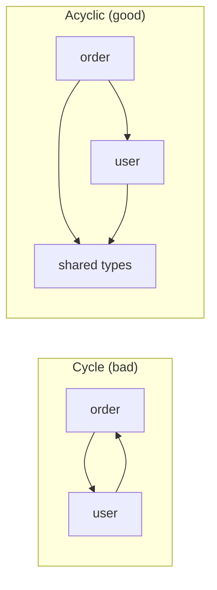
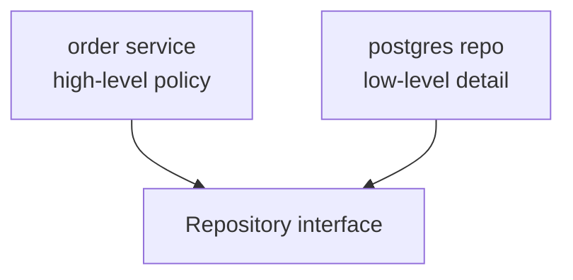
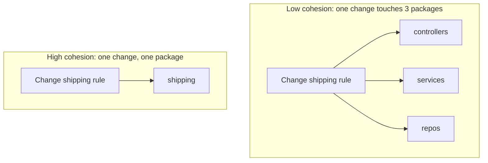
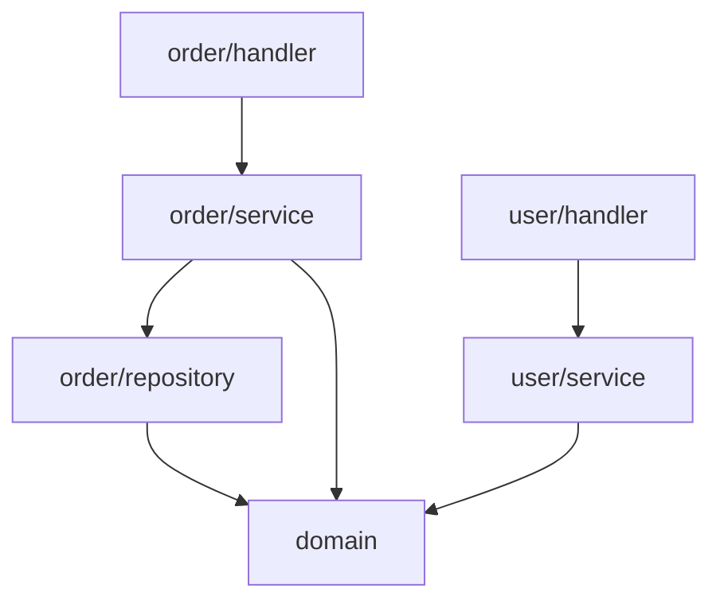

# Modules & Packages — Junior Level

> **Level:** Junior — "What's the rule? Show me a clean example."
> You'll learn how to draw the lines *between* files: which package a thing belongs to, what to expose, what to hide, and why circular dependencies are the first sign your lines are wrong.

---

## Table of Contents

1. [What is a package, really?](#what-is-a-package-really)
2. [Real-world analogy](#real-world-analogy)
3. [Rule 1 — Organize by feature, not by layer](#rule-1--organize-by-feature-not-by-layer)
4. [Rule 2 — Expose the minimum (public/private boundary)](#rule-2--expose-the-minimum-publicprivate-boundary)
5. [Rule 3 — No circular dependencies](#rule-3--no-circular-dependencies)
6. [Rule 4 — Depend in a stable direction](#rule-4--depend-in-a-stable-direction)
7. [Rule 5 — Things that change together live together](#rule-5--things-that-change-together-live-together)
8. [Rule 6 — No Utils / Common / Helpers dumping grounds](#rule-6--no-utils--common--helpers-dumping-grounds)
9. [Putting it together: by-layer → by-feature](#putting-it-together-by-layer--by-feature)
10. [Common Mistakes](#common-mistakes)
11. [Test Yourself](#test-yourself)
12. [Cheat Sheet](#cheat-sheet)
13. [Summary](#summary)
14. [Further Reading](#further-reading)
15. [Related Topics](#related-topics)

---

## What is a package, really?

A **package** (Go), **package/module** (Java), or **package** (Python) is a named box that groups related code. It is the unit at which you decide two things:

1. **What lives inside** — which files, types, and functions belong together.
2. **What crosses the boundary** — which of those are visible to the outside world (the *public API*) and which are hidden implementation detail.

Most junior code is *correct* at the line level and *wrong* at the package level: the functions work, but they live in the wrong box, expose too much, or import each other in a tangle. Those mistakes don't crash anything on day one. They show up months later as "I can't change X without touching twelve files," or "the build won't compile because of an import cycle."

> **Key idea:** Packages are not folders for tidiness. They are *boundaries* that control what code is allowed to know about other code. A good boundary lets you change one side without the other noticing.

The two questions every package must answer clearly:

| Question | Tool in Go | Tool in Java | Tool in Python |
|---|---|---|---|
| What's *inside*? | the package directory | the package declaration | the package directory + `__init__.py` |
| What's *public*? | capitalized identifiers | `public` modifier + JPMS `exports` | `__all__` + no leading underscore |
| What's *hidden*? | lowercase identifiers, `internal/` | package-private (default) | `_name` convention |

---

## Real-world analogy

### A hospital organized by job title vs. by patient

Imagine a hospital where every floor is a *job title*: floor 1 is all the receptionists, floor 2 is all the nurses, floor 3 is all the surgeons, floor 4 is all the pharmacists.

To treat one patient, a doctor walks from floor 3 down to floor 1 to read the intake form, up to floor 4 for medication, back to floor 2 to find the nurse. A single change in how one disease is treated touches every floor. Nobody owns "treating heart patients" — it's smeared across the building.

Now reorganize by *patient need*: a Cardiology wing with its own reception desk, nurses, surgeon, and pharmacy. Everything one heart patient needs is in one wing. To change how cardiology works, you walk into one wing. The wing exposes a front desk (its public API) and hides its supply closet (its internals).

That's **package-by-feature vs. package-by-layer**. The hospital-by-job-title is how most codebases start — `controllers/`, `services/`, `repos/` — and it's exactly the layout that makes every feature change a building-wide tour.

---

## Rule 1 — Organize by feature, not by layer

### The rule

Group code by **what it does for the user** (a feature: `orders`, `billing`, `auth`), not by **its technical role** (a layer: `controllers`, `services`, `repositories`).

### Why

When you add or change a feature, all the code for that feature should be in *one place*. Layered layouts scatter a single feature across three or four sibling folders, so every change is a multi-folder edit and no folder "owns" anything.

### By-layer (avoid) vs. by-feature (prefer) — directory layouts

```
# By layer — a feature is smeared across folders
src/
├── controllers/
│   ├── OrderController
│   ├── UserController
│   └── PaymentController
├── services/
│   ├── OrderService
│   ├── UserService
│   └── PaymentService
└── repositories/
    ├── OrderRepository
    ├── UserRepository
    └── PaymentRepository
```

```
# By feature — a feature is one folder
src/
├── order/        # controller + service + repository for orders
├── user/
└── payment/
```

Adding a field to "order" in the by-layer layout means editing `controllers/OrderController`, `services/OrderService`, and `repositories/OrderRepository` — three folders. In the by-feature layout, you open `order/` and stay there.

### Go

Go packages map to directories. Prefer feature directories; inside each, keep the controller/service/repository as files (Go's flat package keeps them together).

```
# Go — package per feature
internal/
├── order/
│   ├── handler.go      // HTTP layer
│   ├── service.go      // business logic
│   ├── repository.go   // persistence
│   └── order.go        // the Order type
├── user/
│   ├── handler.go
│   ├── service.go
│   └── user.go
└── payment/
    ├── handler.go
    └── service.go
```

```go
// internal/order/order.go
package order

type Order struct {
    ID    string
    Items []Item
    Total Money
}
```

> Note: the package name is `order` — short, lowercase, no underscores, and it matches the directory. Avoid stutter: the type is `order.Order`, not `order.OrderStruct`.

### Java

```
# Java — package per feature
com.shop.order
    OrderController.java
    OrderService.java
    OrderRepository.java
    Order.java
com.shop.user
    UserController.java
    UserService.java
    User.java
com.shop.payment
    PaymentController.java
    PaymentService.java
```

```java
// com/shop/order/Order.java
package com.shop.order;

public class Order {
    private final OrderId id;
    private final List<Item> items;
    // ...
}
```

### Python

```
# Python — package per feature
shop/
├── order/
│   ├── __init__.py     # the feature's public API
│   ├── handler.py
│   ├── service.py
│   └── repository.py
├── user/
│   ├── __init__.py
│   ├── handler.py
│   └── service.py
└── payment/
    ├── __init__.py
    └── service.py
```

```python
# shop/order/__init__.py — curate the public surface
from .service import place_order, cancel_order
from .order import Order

__all__ = ["place_order", "cancel_order", "Order"]
```

---

## Rule 2 — Expose the minimum (public/private boundary)

### The rule

A package should expose **only** what callers genuinely need. Everything else is implementation detail and must be hidden. The smaller the public surface, the more freely you can change the inside.

### Why

Every public symbol is a promise. Once another package imports your `OrderValidator`, you can no longer rename, delete, or change it without breaking them. Hidden symbols cost you nothing — you can refactor them at will.

### Go — capitalization *is* the access modifier, plus `internal/`

Go has no `public`/`private` keywords. **Capitalized = exported, lowercase = package-private.** There is no `protected`.

```go
package order

// Exported: part of the public API.
type Order struct {
    ID    string
    Total Money
}

// Exported function — callers use this.
func Place(items []Item) (*Order, error) {
    if err := validate(items); err != nil { // unexported helper, hidden
        return nil, err
    }
    return &Order{ID: newID(), Total: sum(items)}, nil
}

// unexported: invisible outside package order. Refactor freely.
func validate(items []Item) error { /* ... */ return nil }
func newID() string               { /* ... */ return "" }
```

Go also has a hard, compiler-enforced privacy tool: the **`internal/` directory**. Any package under `internal/` can only be imported by code rooted at `internal/`'s parent. It is impossible for an outside module to import it.

```
myapp/
├── internal/
│   └── order/        // importable only by myapp/... — never by other modules
└── pkg/
    └── client/       // intended for external import
```

### Java — `public` vs. package-private (the default), and JPMS `exports`

In Java, **leaving off `public` makes a class package-private** — visible only within its own package. Junior code over-uses `public`; the cleaner default is to keep helpers package-private.

```java
package com.shop.order;

// Public: the feature's entry point.
public class OrderService {
    private final OrderValidator validator = new OrderValidator();

    public Order place(List<Item> items) {
        validator.check(items);
        return new Order(items);
    }
}

// Package-private (no `public`): hidden from other packages. Refactor freely.
class OrderValidator {
    void check(List<Item> items) { /* ... */ }
}
```

For larger systems, the **Java Platform Module System** (JPMS) hardens this with `module-info.java`. A module exposes only the packages it `exports`; everything else is invisible even if `public`.

```java
// module-info.java
module com.shop {
    exports com.shop.order;   // public API of the module
    // com.shop.order.internal is NOT exported -> hidden from other modules
    requires com.shop.payment;
}
```

### Python — `_private` convention and `__all__`

Python has no enforced privacy. It relies on two conventions:

- A leading underscore (`_helper`, `_Cache`) means "internal — don't touch."
- `__all__` in `__init__.py` declares the public names exported by `from package import *` and signals intent to readers and tooling.

```python
# shop/order/service.py
def place_order(items):          # public
    _validate(items)
    return Order(items)

def _validate(items):            # private by convention — leading underscore
    if not items:
        raise ValueError("empty order")
```

```python
# shop/order/__init__.py — the curated public API
from .service import place_order
from .order import Order

# Only these are "blessed". _validate is deliberately absent.
__all__ = ["place_order", "Order"]
```

> **Anti-pattern to flag — public API leaking internal types.** If a public function returns an object whose *type* is a hidden detail, callers now depend on that hidden type. Example: a public `getOrder()` that returns your internal `OrderRow` database struct. Now you can't change the database mapping without breaking callers. Return a public, stable type (`Order`) instead.

---

## Rule 3 — No circular dependencies

### The rule

Package A must not depend on package B if B (directly or transitively) depends on A. Dependencies must form a **DAG** (directed acyclic graph) — no cycles.

### Why

A cycle means A and B can no longer be understood, tested, built, or deployed independently — they are really *one* tangled unit wearing two names. In Go, an import cycle is a **compile error**, full stop. In Java and Python it compiles but causes initialization-order bugs, untestable units, and fragile builds.

### The shape of the problem



### Go — the compiler refuses to build a cycle

```go
// package order
package order

import "myapp/user" // order -> user

func Place(u user.User) {}
```

```go
// package user
package user

import "myapp/order" // user -> order  ==> import cycle, BUILD FAILS
```

```
$ go build ./...
import cycle not allowed
package myapp/order
        imports myapp/user
        imports myapp/order
```

**How to break it.** Introduce a third package that both depend on, or move the shared type down. If `order` needs a `User` and `user` needs an `OrderID`, extract the truly shared types into a lower package both import:

```
myapp/
├── domain/      // shared value types: UserID, OrderID, Money
├── order/       // imports domain
└── user/        // imports domain  -- no edge between order and user
```

### Java — compiles, but breaks at runtime / in tests

```java
// com.shop.order
package com.shop.order;
import com.shop.user.User;          // order -> user
public class Order { User owner; }
```

```java
// com.shop.user
package com.shop.user;
import com.shop.order.Order;        // user -> order  (cycle: compiles, but a design smell)
public class User { List<Order> orders; }
```

This compiles, but `OrderTest` now drags in `User`, which drags in `Order` — you cannot test either in isolation. **JPMS even forbids cyclic `requires` between modules at the module level.** The fix is the same: extract shared types into a lower package both depend on.

### Python — circular imports cause `ImportError`

```python
# shop/order.py
from shop.user import User      # order -> user
class Order:
    def __init__(self, owner: User): ...
```

```python
# shop/user.py
from shop.order import Order     # user -> order  -> ImportError at import time
class User:
    def __init__(self): self.orders: list[Order] = []
```

```
ImportError: cannot import name 'Order' from partially initialized module
'shop.order' (most likely due to a circular import)
```

The fix mirrors the others: a lower module (`shop/ids.py`) with the shared types, imported by both. (Type-only cycles can sometimes use `from __future__ import annotations` + `TYPE_CHECKING`, but that is a band-aid — restructure if the cycle is real.)

---

## Rule 4 — Depend in a stable direction

### The rule

High-level policy should not depend on low-level details. Dependencies should point toward the things that change least (stable abstractions), not toward volatile implementation.

### Why

If your pricing logic (high-level, business-critical, rarely-changing-in-spirit) directly imports the Postgres driver (low-level, swappable), then every database change threatens your business logic. Point the arrow the other way: the database layer depends on the business layer's interface, not vice versa.



The service depends on an **interface** it owns; the concrete Postgres implementation depends on that same interface. The arrow from "detail" points *up* toward "policy" — this is the core of dependency inversion.

### Go

```go
// package order — high level. Defines the interface it needs.
package order

type Repository interface {
    Save(o *Order) error
    Find(id string) (*Order, error)
}

type Service struct{ repo Repository } // depends on the abstraction, not Postgres
```

```go
// package postgres — low level. Depends on order, implements its interface.
package postgres

import "myapp/order"

type OrderRepo struct{ db *sql.DB }

func (r *OrderRepo) Save(o *order.Order) error { /* ... */ return nil }
```

The arrow runs `postgres → order`, never `order → postgres`. You can swap Postgres for an in-memory fake in tests without touching `order`.

### Java

```java
package com.shop.order;
public interface OrderRepository {      // owned by the high-level package
    void save(Order o);
}

public class OrderService {
    private final OrderRepository repo;  // abstraction, not JdbcOrderRepository
    public OrderService(OrderRepository repo) { this.repo = repo; }
}
```

```java
package com.shop.infra;
import com.shop.order.OrderRepository;   // infra depends on order, not the reverse
public class JdbcOrderRepository implements OrderRepository { /* ... */ }
```

### Python

```python
# shop/order/service.py — high level
from typing import Protocol

class OrderRepository(Protocol):     # the abstraction lives with the policy
    def save(self, order: "Order") -> None: ...

class OrderService:
    def __init__(self, repo: OrderRepository):
        self._repo = repo
```

```python
# shop/infra/pg.py — low level depends on the abstraction
from shop.order.service import OrderRepository
class PostgresOrderRepository:       # structurally satisfies the Protocol
    def save(self, order): ...
```

> **Anti-pattern to flag — cross-layer reaches.** A controller that imports the repository directly, skipping the service, bypasses your business rules and welds two layers that should be swappable. Keep the chain `handler → service → repository`; never let the handler reach past the service.

---

## Rule 5 — Things that change together live together

### The rule

Put code that **changes for the same reason** in the same package; separate code that changes for **different reasons**. (This is the package-level echo of the Single Responsibility Principle, sometimes called the *Common Closure Principle*.)

### Why

A package is well-designed when a typical change touches one package, and a package rarely changes for reasons unrelated to its purpose. If a single feature request forces edits in five packages, your boundaries don't match how the system actually evolves. If one package keeps getting edited for unrelated reasons, it's doing too much.

### A cohesion test you can apply today

Ask: *"When the rule for X changes, how many packages do I edit?"*

- **One** → cohesive. Good.
- **Many** → the feature is scattered (usually a by-layer layout). Pull it together (Rule 1).



### Counter-balance: don't over-fragment

The opposite mistake is **one-class-per-package**: a `validator/` package holding a single `Validator`, an `idgenerator/` package holding one function. This shatters cohesion in the other direction — now a tiny feature spans ten micro-packages, and import lists explode. A package should hold a *cohesive cluster*, typically several related types — not exactly one, and not fifty unrelated ones.

| Layout | Symptom | Verdict |
|---|---|---|
| One giant package | every change collides | too coarse |
| One class per package | trivial features span 10 imports | too fine |
| Package per feature | one change → one package | just right |

---

## Rule 6 — No Utils / Common / Helpers dumping grounds

### The rule

Do not create packages named `utils`, `common`, `helpers`, `misc`, or `shared` as a place to drop "code that didn't fit anywhere." Give code a home named after *what it does*.

### Why

A `utils` package has no cohesion (its only theme is "leftover") and no stable boundary (everyone imports it, so it can never change safely). It quickly becomes a **god package** that every other package depends on — the exact thing that makes a codebase impossible to split or reason about. It also breeds [circular dependencies](#rule-3--no-circular-dependencies): because everything imports `utils` and `utils` grows to import everything, cycles appear.

### Dirty → clean

```
# Dirty: a junk drawer
utils/
    StringUtils      // padding, slugify
    DateUtils        // business calendar logic
    MoneyUtils       // currency formatting + rounding rules
    OrderUtils       // actually core order business logic!
```

```
# Clean: each concept gets a real home
text/            // slugify, padding  (generic, leaf package)
calendar/        // business-calendar rules
money/           // Money type + its own formatting & rounding
order/           // order business logic lives WITH orders
```

### Go

```go
// Dirty
package utils
func FormatMoney(cents int64) string { /* ... */ return "" }
func ValidateOrder(o Order) error    { /* ... */ return nil } // not a "util" at all

// Clean: Money owns its own formatting; order logic lives in order.
package money
type Money struct{ Cents int64 }
func (m Money) String() string { /* ... */ return "" }
```

### Java

```java
// Dirty: a static grab-bag
package com.shop.common;
public final class Utils {
    public static String formatMoney(long cents) { /* ... */ }
    public static void validateOrder(Order o) { /* ... */ }  // business logic in "common"
}

// Clean: behavior on the type that owns it
package com.shop.money;
public record Money(long cents) {
    @Override public String toString() { /* ... */ return ""; }
}
```

### Python

```python
# Dirty: shop/utils.py becomes a magnet for everything
def format_money(cents): ...
def validate_order(order): ...   # belongs in the order package

# Clean: money owns formatting; order owns its validation
# shop/money.py
class Money:
    def __init__(self, cents: int): self.cents = cents
    def __str__(self) -> str: ...
```

> **Anti-pattern to flag — re-exporting third-party types from your own package.** If your package re-exports, say, a third-party HTTP client's `Request` type as part of *your* public API, every caller is now silently coupled to that library's version. Wrap third-party types behind your own; don't pass them through your boundary. (See [boundaries](../07-boundaries/README.md).)

---

## Putting it together: by-layer → by-feature

A worked reorganization. **Before** — a textbook by-layer mess with a `common` dumping ground and a hidden cross-layer reach:

```
src/
├── controllers/
│   ├── OrderController       // imports OrderRepository directly (cross-layer reach!)
│   └── UserController
├── services/
│   ├── OrderService
│   └── UserService
├── repos/
│   ├── OrderRepo
│   └── UserRepo
└── common/
    ├── Utils                 // money formatting + order validation + misc
    └── Models                // every entity, imported by everyone (god package)
```

Problems: a change to "orders" touches four folders; `common` is a god package everyone imports; `OrderController` reaches past `OrderService` straight into `OrderRepo`.

**After** — by feature, with hidden internals, a shared `domain` for genuinely shared types, and a clean dependency direction:

```
src/
├── domain/                   // only truly-shared value types (Money, OrderId, UserId)
├── order/
│   ├── handler              // -> service only (no reach to repo)
│   ├── service              // -> repository interface
│   ├── repository           // implements interface; -> domain
│   └── order                // the Order type (public); validate() is private
└── user/
    ├── handler
    ├── service
    └── user
```



Every arrow points downward toward `domain`; there are no cycles; each feature is one folder; nobody depends on a `common` god package; the handler can't skip the service.

---

## Common Mistakes

1. **Package-by-layer.** `controllers/`, `services/`, `repos/` as top-level folders. Every feature change is a multi-folder tour. **Fix:** package by feature (Rule 1).

2. **Everything `public`.** Marking every Java class `public`, capitalizing every Go identifier, omitting `__all__` in Python. The public surface becomes the whole codebase, so nothing can change safely. **Fix:** default to private; expose the minimum (Rule 2).

3. **Circular dependencies.** A imports B imports A. In Go it won't compile; elsewhere it produces untestable, fragile units. **Fix:** extract shared types into a lower package both depend on (Rule 3).

4. **Cross-layer reaches.** A controller importing a repository, skipping the service — bypassing business rules. **Fix:** respect the chain `handler → service → repository` (Rule 4).

5. **`utils` / `common` / `helpers` dumping grounds.** A junk drawer everyone imports, that grows into a god package and breeds cycles. **Fix:** give code a home named for what it does (Rule 6).

6. **Public API leaking internal types.** A public method returns a database row struct or an internal enum. Callers now depend on your internals. **Fix:** return stable public types.

7. **One-class-per-package over-fragmentation.** A separate package for every single class. Trivial features span ten imports. **Fix:** a package is a cohesive *cluster*, not one class (Rule 5).

8. **Re-exporting third-party types.** Exposing a library's types through your own API, coupling every caller to that library. **Fix:** wrap them behind your own types (Rule 6 note, [boundaries](../07-boundaries/README.md)).

9. **God package.** One package (often `models` or `common`) that every other package imports. It can never be changed or split. **Fix:** split by feature; share only stable value types in a small `domain`.

10. **Misnaming Go packages.** `package orderUtils`, `package OrderPackage`, or names that stutter (`order.OrderService`). **Fix:** short, lowercase, single-word, no underscores; let the qualifier do the work (`order.Service`).

---

## Test Yourself

1. **You're starting a new web service with `orders`, `users`, and `payments`. Top-level folders `controllers/`, `services/`, `repos/` — or `order/`, `user/`, `payment/`? Why?**

<details><summary>Answer</summary>

Package by **feature**: `order/`, `user/`, `payment/`. A change to "orders" then lives in one folder instead of being smeared across three layer-folders. By-layer optimizes for the rare reader who wants "all the controllers" and punishes the common case of changing one feature. Inside each feature package you can still keep `handler`/`service`/`repository` files.

</details>

2. **In Go, how do you make a helper function invisible outside its package? In Java? In Python?**

<details><summary>Answer</summary>

- **Go:** lowercase the first letter (`validate`, not `Validate`). For a whole package no external module may import, put it under `internal/`.
- **Java:** omit `public` — the default is package-private, visible only within the same package. For module-level hiding, don't `exports` the package in `module-info.java`.
- **Python:** prefix with a single underscore (`_validate`) by convention, and leave it out of `__all__`. Python doesn't *enforce* this, but tooling and readers respect it.

</details>

3. **`order` imports `user` and `user` imports `order`. What happens in Go? How do you fix it?**

<details><summary>Answer</summary>

Go refuses to build: `import cycle not allowed`. The fix is to find the *shared* types causing the mutual need (e.g. `UserID`, `OrderID`) and move them into a third, lower package — say `domain` — that both `order` and `user` import. Now the edge between `order` and `user` disappears and the graph is acyclic. The same restructuring fixes the cycle in Java and Python (where it shows up as fragile init order or `ImportError`).

</details>

4. **Your `OrderService` (business logic) imports the Postgres driver directly. Why is that the wrong direction, and how do you flip it?**

<details><summary>Answer</summary>

High-level policy (business rules) should not depend on low-level detail (a swappable database driver). As written, every database change threatens your business logic, and you can't test the service without a real database. Flip it with **dependency inversion**: have `OrderService` depend on a `Repository` *interface* that it owns, and have the Postgres implementation depend on (and implement) that interface. The arrow now points from detail up toward policy, and you can drop in an in-memory fake for tests.

</details>

5. **A teammate proposes a `utils` package "for the formatting and validation helpers." What do you say?**

<details><summary>Answer</summary>

Push back. `utils` has no cohesion (its only theme is "leftover") and becomes a god package everyone imports and that can never change safely — and it breeds circular dependencies. Give each helper a real home named for what it does: money formatting belongs on a `Money` type in a `money` package; order validation belongs in `order`. "It didn't fit anywhere" usually means a concept is missing, not that you need a junk drawer.

</details>

6. **Is a package per single class a good way to keep things "modular"?**

<details><summary>Answer</summary>

No — that's over-fragmentation. A package should hold a *cohesive cluster* of related types, not exactly one. One-class-per-package makes trivial features span ten imports and scatters cohesion just as badly as a single giant package does, only in the opposite direction. Aim for "things that change together live together": one package per feature, several related types inside.

</details>

7. **Your public `getOrder()` returns the internal `OrderRow` struct that mirrors a database table. Why is that a problem?**

<details><summary>Answer</summary>

You've leaked an internal type across your public boundary. Callers now depend on `OrderRow`, so you can no longer change your database mapping (rename a column, split a table) without breaking them. Return a stable, public domain type (`Order`) and keep `OrderRow` private to the persistence code. The public API should expose concepts, not your storage layout.

</details>

8. **In Go, what's wrong with naming a package `orderUtils` with a type `OrderService` inside it (referenced as `orderUtils.OrderService`)?**

<details><summary>Answer</summary>

Two things. First, `orderUtils` is a `utils` dumping-ground name plus a non-idiomatic mixed-case package name — Go packages should be short, lowercase, single words. Second, `orderUtils.OrderService` *stutters*: the package qualifier already says "order," so the type repeats it. Idiomatic Go is `package order` with `order.Service`. The qualifier carries the context.

</details>

---

## Cheat Sheet

| Rule | Do | Don't |
|---|---|---|
| **Organize** | Package by feature (`order/`, `user/`) | Package by layer (`controllers/`, `services/`) |
| **Expose** | Public surface = the minimum callers need | Mark everything public/exported |
| **Hide (Go)** | lowercase identifiers; `internal/` for hard privacy | Capitalize every identifier |
| **Hide (Java)** | package-private default; `exports` only the API | `public` on every class |
| **Hide (Python)** | `_name` + curated `__all__` | Export everything implicitly |
| **Cycles** | Keep dependencies a DAG; extract shared types down | A → B → A (won't even compile in Go) |
| **Direction** | Policy ← detail (depend on abstractions) | Business logic imports the DB driver |
| **Cohesion** | Things that change together live together | One change touches 5 packages |
| **Granularity** | A package = a cohesive cluster | One class per package |
| **Naming (Go)** | short, lowercase, no stutter (`order.Service`) | `orderUtils.OrderService` |
| **Junk** | A real home per concept (`money`, `text`) | `utils` / `common` / `helpers` |
| **Boundary** | Return your own stable types | Leak internal/third-party types |

### Privacy tools at a glance

| Language | Public | Private | Hard module boundary |
|---|---|---|---|
| **Go** | Capitalized name | lowercase name | `internal/` directory (compiler-enforced) |
| **Java** | `public` | package-private (no modifier) / `private` | `exports` in `module-info.java` (JPMS) |
| **Python** | no underscore + in `__all__` | `_name` (convention) | none enforced; convention + `__all__` |

---

## Summary

- A **package is a boundary**, not just a folder. It controls what code may know about other code.
- **Organize by feature, not by layer.** One feature change should touch one package.
- **Expose the minimum.** Every public symbol is a promise you must keep; hidden symbols are free to change. Use Go capitalization + `internal/`, Java package-private + JPMS `exports`, Python `_name` + `__all__`.
- **No circular dependencies.** Keep the dependency graph a DAG; in Go a cycle is a compile error. Break cycles by extracting shared types into a lower package.
- **Depend in a stable direction.** High-level policy depends on abstractions; low-level details implement them. Don't let a controller reach past the service into the repository.
- **Things that change together live together** — cohesive packages — but don't over-fragment into one-class-per-package.
- **No `utils` / `common` / `helpers` god packages.** Give every concept a real, named home, and don't leak internal or third-party types across your boundary.

---

## Further Reading

- Robert C. Martin, *Clean Architecture* — the package-design principles (Common Closure, Stable Dependencies, Acyclic Dependencies) and the Dependency Rule.
- *The Go Programming Language* (Donovan & Kernighan), ch. 10 — packages, naming, and `internal/`.
- Go Blog, "Package names" — naming conventions and avoiding stutter.
- The Java Platform Module System (JPMS) tutorial — `module-info.java`, `exports`, `requires`.
- Python docs, "Modules" and "Packages" — `__init__.py`, `__all__`, the `_private` convention.

---

## Related Topics

- [middle.md](middle.md) — the same rules under real-world pressure: metrics for coupling/cohesion, breaking cycles in a legacy codebase, monorepo vs. multi-module trade-offs.
- [senior.md](senior.md) — package architecture at scale: stability metrics, module boundaries as team boundaries, evolving a public API.
- [Chapter README](../README.md) — overview and the full set of modules-&-packages rules.
- [Classes](../09-classes/README.md) — the class-level version of cohesion and information hiding.
- [Boundaries](../07-boundaries/README.md) — guarding the edges where third-party code enters your system.
- [Abstraction & Information Hiding](../22-abstraction-and-information-hiding/README.md) — why exposing the minimum is the heart of good design.
- [Design Patterns](../../design-patterns/README.md) — patterns (Facade, Adapter) that shape package boundaries.
- [Anti-Patterns](../../anti-patterns/README.md) — the god-package and cyclic-dependency anti-patterns in depth.
- [Refactoring](../../refactoring/README.md) — Move Class / Move Method and the mechanics of reorganizing packages safely.