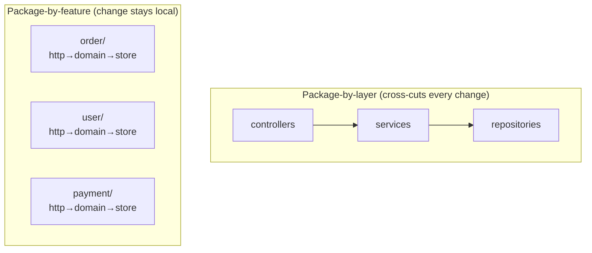
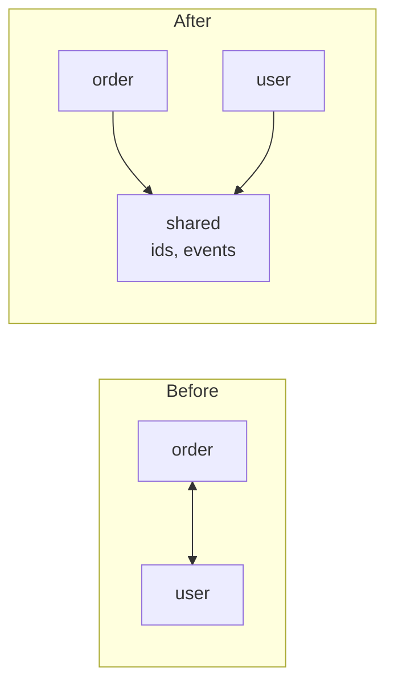

# Modules & Packages — Middle Level

> Focus: "Why?" and "When does it bend?" — the trade-offs behind package structure, the principles that make a decision defensible, and how each language's import system rewards or punishes you.

---

## Table of Contents

1. [Package-by-feature vs package-by-layer](#package-by-feature-vs-package-by-layer)
2. [Cohesion and coupling at package granularity](#cohesion-and-coupling-at-package-granularity)
3. [How big should a package be?](#how-big-should-a-package-be)
4. [Breaking a circular dependency](#breaking-a-circular-dependency)
5. [The stable-dependencies and stable-abstractions principles](#the-stable-dependencies-and-stable-abstractions-principles)
6. [The public API surface as a contract](#the-public-api-surface-as-a-contract)
7. [How each language pushes you](#how-each-language-pushes-you)
8. [Common Mistakes](#common-mistakes)
9. [Test Yourself](#test-yourself)
10. [Cheat Sheet](#cheat-sheet)
11. [Summary](#summary)
12. [Further Reading](#further-reading)
13. [Related Topics](#related-topics)

---

## Package-by-feature vs package-by-layer

This is the single most consequential structural decision you make, and almost everyone gets it wrong on their first project because the layered version *looks* tidier.

**Package-by-layer** groups code by its technical role:

```
src/
  controllers/   OrderController, UserController, PaymentController
  services/      OrderService, UserService, PaymentService
  repositories/  OrderRepo, UserRepo, PaymentRepo
  models/        Order, User, Payment
```

**Package-by-feature** groups code by the slice of the domain it serves:

```
src/
  order/    OrderController, OrderService, OrderRepo, Order
  user/     UserController, UserService, UserRepo, User
  payment/  PaymentController, PaymentService, PaymentRepo, Payment
```

### Why by-feature scales

The decisive question is: **when a real change arrives, how many packages do you touch?** Changes in a business application arrive *by feature*, not by layer. "Add a discount code to orders" touches the order controller, service, repo, and model. In the layered layout that change rakes across all four packages; in the feature layout it stays inside `order/`.

This has three compounding effects:

- **Locality of change.** A pull request that modifies one feature touches one directory. Reviewers, blame, and merge conflicts all stay local.
- **Visible coupling.** If `order/` has to import `payment/`, you *see* it in the import line. In the layered layout, every service imports every repo already, so a new bad coupling is invisible noise against an already-tangled background.
- **Deletability.** Killing a feature means deleting a directory. In the layered layout, a dead feature leaves orphan fragments scattered across four packages that nobody dares remove.

> **Conway's Law angle:** a feature package maps to a team's ownership boundary. A layer package maps to *no one* — three teams all edit `services/`, so it has no owner and rots.

### When by-layer is acceptable

Layering is not wrong; it is wrong *at the wrong granularity*. By-layer is acceptable when:

- **The app is tiny.** Under ~15 files, the indirection of feature folders costs more than it saves. A CRUD prototype with three endpoints is fine as `handlers/`, `db/`, `models/`.
- **The "feature" is genuinely one thing.** A focused library (a JSON parser, a rate limiter) has one feature; internal layering by lexer/parser/emitter is appropriate.
- **You layer *inside* a feature.** The mature pattern is package-by-feature at the top, with layered structure *within* each feature. `order/` may internally separate `order/http`, `order/domain`, `order/store`. You get both locality (across features) and separation of concerns (within a feature).



---

## Cohesion and coupling at package granularity

The same two forces you weigh inside a class — cohesion (do these things belong together?) and coupling (how much does this depend on that?) — apply one level up, and the package is where they matter *most*, because package boundaries are the ones that survive refactoring.

**Cohesion** at package scale means: the things in a package change together and are used together. A high-cohesion package has a *reason to exist* you can state in one sentence ("everything needed to place and track an order"). The classic Robert Martin formulation is the **Common Closure Principle** — classes that change for the same reason belong in the same package — which is just the Single Responsibility Principle lifted from the class to the package.

**Coupling** at package scale is measured by imports. Two metrics make it concrete:

- **Afferent coupling (Ca):** how many other packages import *this* one. High Ca means "many things depend on me; I am load-bearing."
- **Efferent coupling (Ce):** how many other packages *this* one imports. High Ce means "I depend on many things; I am fragile."

The pathologies map cleanly:

| Symptom | Diagnosis |
|---|---|
| Package imports 20 others | High Ce — fragile, breaks whenever anything moves |
| Every package imports this one | High Ca — a [god package](#common-mistakes); change it and the world rebuilds |
| `utils/` imported everywhere, imports everything | High Ca *and* high Ce — a coupling singularity |

> **The `utils` trap is a cohesion failure first.** A `utils` package has no single reason to change because it has no single reason to exist. String helpers, date math, and HTTP retry logic share nothing but the word "util." Because everything imports it, it also acquires maximal afferent coupling. The fix is to move each helper to the feature that owns it, or into a narrowly-named package (`money`, `timeparse`) with real cohesion.

---

## How big should a package be?

There is no line count. The right size is bounded by two failure modes, and you steer between them.

### Over-fragmentation: one class per package

Java teams escaping monoliths sometimes overcorrect into a package per class. Now a single conceptual change spans ten packages, the import section is longer than the code, and you have all the navigation cost of modularity with none of the benefit — because the boundaries don't correspond to anything that changes independently.

**Tell:** packages that are *always* imported together. If `order.validation` is never used without `order.model`, the boundary is fictional. Merge them.

### The god package: everything in one

The opposite failure: a `core/` or `domain/` package that holds 200 types because "it's all domain logic." It has no internal boundaries, so it can't enforce any, and every change risks every other thing in it.

**Tell:** you can't state the package's responsibility without the word "and" three times.

### The steering rule

> Size a package so that its public API is *small relative to its internals*. A healthy package hides a lot and exposes a little — many internal types, few exported ones. If the ratio of exported-to-internal symbols approaches 1:1, the package isn't hiding anything, and the boundary is decorative.

This is the [information-hiding](../22-abstraction-and-information-hiding/README.md) test applied to packages: a good package is mostly secret.

---

## Breaking a circular dependency

A circular dependency (`A` imports `B`, `B` imports `A`) is the defect that package design exists to prevent. It means the two packages are really *one* package wearing two names — you cannot understand, test, build, or deploy either in isolation. Go refuses to compile it. Java and Python allow it, which is worse, because the cycle accretes silently.

There are exactly three ways out, and choosing among them is a design decision, not a mechanical one.

### 1. Move the shared type

Often the cycle exists because one type lives on the wrong side. `order` imports `user` for the `User` type, and `user` imports `order` for `OrderHistory`. If `OrderHistory` actually belongs to the user domain, *move it*, and the cycle vanishes with no abstraction added. **Try this first** — it's the cheapest fix and frequently the correct one. The cycle was a misplacement, not a genuine mutual need.

### 2. Extract a third package

If both packages genuinely share a type that belongs to neither, lift it into a new lower-level package both can depend on.



`order` and `user` both depend on `shared`, and `shared` depends on neither. The cycle is broken because dependencies now flow one way, toward the stable shared core.

### 3. Invert the dependency (DIP at package scope)

When the cycle is caused by a *callback* — `payment` needs to notify `order` when a charge settles — don't import `order` from `payment`. Define an *interface* in `payment` describing what it needs, and let `order` implement it.

```go
// package payment — owns the abstraction it depends on
type SettlementListener interface {
    OnSettled(orderID string)
}

func (p *Processor) Charge(orderID string, l SettlementListener) {
    // ...charge the card...
    l.OnSettled(orderID)
}
```

```go
// package order — depends on payment, implements payment's interface
type Orders struct{ /* ... */ }

func (o *Orders) OnSettled(orderID string) { /* mark paid */ }
```

Now `order` imports `payment` (a stable, abstract package) and `payment` imports *nothing* from `order`. The dependency arrow flipped: the high-level policy (`order`) depends on the abstraction, and the abstraction lives with the low-level mechanism that needs it. This is the **Dependency Inversion Principle** operating between packages rather than classes — and it's the tool you reach for when moving the type isn't possible because the relationship is behavioral, not structural.

> **Which one?** Misplaced type → move it (#1). Genuinely shared data → extract (#2). A "call me back" relationship → invert (#3). If you find yourself extracting a package that only ever holds one interface used by one caller, you wanted #3.

---

## The stable-dependencies and stable-abstractions principles

These two principles from Robert Martin's package design give you a *direction* for every dependency arrow, turning "this feels wrong" into something you can measure and defend.

### Stable-Dependencies Principle (SDP)

> Depend in the direction of stability.

A package is **stable** if many things depend on it (high Ca) and it depends on few things (low Ce) — it's hard to change because changing it ripples outward, and it has little reason to change because it relies on nothing. Martin makes this a number, **Instability**:

```
I = Ce / (Ce + Ca)        // 0 = maximally stable, 1 = maximally unstable
```

SDP says: a package should only depend on packages that are *more stable than itself* (lower `I`). Your volatile, frequently-edited feature code (high `I`) should depend on your rarely-changing core domain types (low `I`) — never the reverse. When you see a stable package importing a volatile one, you've found a future pain point: every churn in the volatile package forces a rebuild and retest of the stable one.

### Stable-Abstractions Principle (SAP)

> A package should be as abstract as it is stable.

A package that everything depends on (stable) had better be made of *abstractions* (interfaces, abstract types), because abstractions can be extended without modification. If a maximally-stable package is full of *concrete* code, you have the worst case: it's painful to change (stable) and you're forced to change it (concrete). That's the **Zone of Pain**. The opposite corner — abstract *and* unstable, an interface nobody implements or uses — is the **Zone of Uselessness**.

> **The practical takeaway:** your foundational packages should be small, abstract, and depended-upon. Your leaf packages should be concrete, volatile, and depend-only. If a package is both heavily depended-upon *and* full of concrete logic that changes often, split it: pull the stable abstractions down into a base package and push the volatile concretions up into leaves.

---

## The public API surface as a contract

Everything a package exports is a *promise*. Consumers will couple to it, and once they have, you cannot change it without breaking them. This reframes a daily decision — "should this be public?" — as "am I willing to support this forever?"

### What to export

Export the *minimum* that lets a consumer accomplish the package's purpose. Concretely:

- **Export behavior, hide data.** Export `func NewClient(cfg Config) *Client` and the methods on `Client`; hide the struct fields. The moment a field is public, a consumer reads it, and now its layout is frozen.
- **Don't export internal helpers.** A helper used by three internal files is not part of the contract. Exporting it because "someone might need it" guarantees someone *will*, and now you maintain it forever.
- **Return interfaces or concrete types deliberately.** Returning a concrete type lets you add methods without breaking callers but exposes the type's shape. Returning an interface hides the shape but freezes the method set. Choose based on which axis you expect to evolve.

### The leakage that bites later

The subtle failure is **leaking internal types through the public surface**. A public method returns an internal type:

```go
func (s *Store) Find(id string) *internalRow { ... }  // internalRow is "private" in spirit
```

Even if `internalRow`'s fields are unexported, the *type itself* is now part of your API — callers write `var r = store.Find(id)` and that variable's type is `*internalRow`. You can't rename or restructure it without breaking them. The contract leaked through the return type. The fix is to map internal types to a deliberate public type (a DTO) at the boundary.

> A package's API is its only contract that survives a rewrite. You can replace every line *inside* a package freely, as long as the exported surface holds. That freedom is the entire point of the boundary — and you forfeit it for every symbol you export beyond the minimum.

---

## How each language pushes you

The same principles apply everywhere, but each language's import system makes good structure either the path of least resistance or an uphill fight.

### Go — the compiler enforces it

Go is the strict parent, and it's a gift:

- **Import cycles are a compile error.** You *cannot* ship `A ↔ B`. This forces you to resolve cycles the day they appear, while they're one edge, instead of after they've metastasized. The error is annoying exactly when it's saving you.
- **`internal/` enforces boundaries.** A package under `internal/` can only be imported by code rooted at `internal/`'s parent. This makes "private to this module" a *compiler-checked* fact, not a naming convention. Put types you refuse to support as public API under `internal/` and the language guarantees no external consumer can couple to them.
- **Capitalization is the API.** Exported identifiers start uppercase; everything else is package-private. The public surface is visible at a glance, with no `public`/`private` keyword to forget.

```
mymodule/
  internal/      ← importable only within mymodule; the compiler enforces it
    store/
  order/         ← public packages
  payment/
```

### Java — explicit but cycle-tolerant

- **`public` / package-private / `protected` / `private`** give you four-level control, and **package-private is the underused default** — a class with no modifier is invisible outside its package, which is exactly the information-hiding you want for internal types.
- **The Java Platform Module System (JPMS, `module-info.java`)** lets a module declare which packages it `exports`. This finally makes "public to the JVM but not to consumers" expressible — a class can be `public` (so other packages *in the module* use it) yet unexported (so consumers can't).
- **But Java tolerates package cycles.** `javac` compiles `A ↔ B` happily. You need a tool — ArchUnit, jdepend, or a Gradle/Maven module split — to catch and forbid them. Make the rule executable in CI; don't rely on review.

### Python — maximum flexibility, maximum footgun

- **Imports are runtime statements.** `import` executes code; nothing is checked ahead of time. This is the loosest system of the three and demands the most discipline.
- **Circular imports fail *at runtime*, partially.** Python doesn't reject a cycle outright — it runs into a half-initialized module and throws `ImportError` or, worse, hands you a module object missing the attribute you wanted. The failure is intermittent and import-order-dependent, which makes it maddening to debug.
- **There is no real `private`.** The leading-underscore convention (`_internal`) and `__all__` (controlling `from module import *`) are *advice*, not enforcement. Anyone can `from yourpkg._internal import Thing`. Your API contract is honored only by convention, so it must be documented and reviewed deliberately — the interpreter won't help you.

> **The asymmetry to remember:** Go makes you fix structure to compile; Java lets you defer it until a tool complains; Python lets you defer it until production. The looser the language, the more the discipline has to live in your head and your CI.

---

## Common Mistakes

- **Defaulting to package-by-layer because it looks organized.** It optimizes for the one view (the layer cake) you never need and scatters every real change. Reach for by-feature first; layer *inside* a feature.
- **The `utils` / `common` / `helpers` dumping ground.** A package named for what it *is* technically (a "utility") rather than what it's *about* (a domain concept) has no cohesion and acquires maximal afferent coupling. Name packages after domains; if a helper has no domain, it probably belongs to the one feature that uses it.
- **Solving a cycle by merging the two packages.** Tempting, because the compiler stops complaining. But you've confirmed the cycle's verdict — these were one package — instead of asking whether they *should* be one. Try moving the shared type or inverting first.
- **Making things public "just in case."** Every exported symbol is a forever-promise. The default should be the most private the language allows; widen only on demonstrated need.
- **Leaking internal types through return values.** A public method returning a private-in-spirit type silently makes that type part of your API. Map to a deliberate boundary type.
- **One class per package as a "best practice."** Modularity isn't a synonym for granularity. Packages that are always imported together aren't separate packages.
- **Re-exporting third-party types from your own package.** When `yourpkg` exposes a `github.com/lib/pq` error or a `requests.Response`, every consumer is now coupled to that dependency through you. Swapping the library becomes a breaking change to *your* API. Wrap third-party types at the boundary.
- **Relying on review to catch cycles and bad imports in Java/Python.** Reviewers miss import edges. Make the architectural rule executable (ArchUnit, import-linter, a CI grep) so the build fails, not the reviewer's patience.

---

## Test Yourself

<details>
<summary>Why does package-by-feature reduce merge conflicts compared to package-by-layer?</summary>

Because changes arrive by feature, and a feature change stays inside one directory. Two engineers working on different features touch different directories, so their diffs don't overlap. In the layered layout, both edit `services/` and `repositories/`, so unrelated work collides in the same files. The conflict rate tracks how well your package boundaries match your change boundaries.
</details>

<details>
<summary>You have a cycle: <code>auth</code> imports <code>user</code> for the <code>User</code> type, and <code>user</code> imports <code>auth</code> to check permissions during login. How do you break it without adding an interface?</summary>

Look at where each type belongs. `User` is plausibly a `user`-domain type that `auth` legitimately consumes — fine, that arrow stays. The problem arrow is `user → auth`. Ask *why* `user` calls into `auth`: if it's checking permissions, that permission check probably belongs in `auth` (or a coordinating caller), not in `user`. Move the permission logic out of `user`, and the back-edge disappears. The cycle was a misplaced responsibility, not a genuine mutual dependency. (If the call were a true callback — "tell auth when a user is deleted" — then you'd invert with an interface; but the question said "without adding an interface," which is the hint that the type/responsibility is simply on the wrong side.)
</details>

<details>
<summary>A package has Instability <code>I = 0.1</code> (very stable) and is full of concrete business logic that changes every sprint. What principle is violated and what's the fix?</summary>

The Stable-Abstractions Principle. A stable package (everyone depends on it) should be abstract, but this one is concrete *and* volatile — Martin's "Zone of Pain." It's painful to change (many dependents) yet forced to change (concrete, churning logic). Fix: split it. Pull the stable abstractions (interfaces, core types) into a base package that dependents rely on, and push the volatile concrete implementations up into leaf packages with high `I` where churn is cheap.
</details>

<details>
<summary>Your Python service works in dev but throws <code>ImportError: cannot import name X</code> intermittently in CI. What's the likely cause and why is it intermittent?</summary>

A circular import. Python executes imports at runtime; when module A imports B while B is still mid-import of A, the partially-initialized module is missing `X`. It's intermittent because the failure depends on *which module gets imported first*, which can vary with test ordering, entry point, or lazy-import timing. The real fix isn't reordering imports — it's breaking the cycle (move the shared symbol, or import lazily inside the function as a stopgap while you restructure).
</details>

<details>
<summary>Why is exporting a struct's fields worse than exporting a constructor and methods?</summary>

A public field freezes the type's memory layout and representation as part of your contract — a consumer reads `client.Timeout` directly, so you can never compute it, validate it, rename it, or change its type without breaking them. A constructor plus methods exposes *behavior* while hiding *representation*: you keep the freedom to change how the value is stored or derived. You're exporting a contract about what the type *does*, not what it *is*.
</details>

<details>
<summary>When is one-class-per-package actually correct rather than over-fragmentation?</summary>

When each class genuinely changes and is used independently — i.e., the boundaries correspond to real, separate reasons to change. A package holding a single, widely-reused, stable abstraction (e.g., a logging interface everyone implements) earns its own package. The test is the import pattern: if the packages are *always* imported together, the boundary is fictional and you're paying navigation cost for nothing. If they're imported independently by different consumers, the granularity is real.
</details>

<details>
<summary>You wrap a third-party HTTP client and your package returns its <code>Response</code> type from a public method. Why is this a hidden coupling, and what breaks later?</summary>

Your consumers now depend on the third-party library *transitively through you*, whether they imported it or not. The moment you want to swap the HTTP library, change its version across a major bump, or stop using it, you can't — the return type is part of your public API, so the swap is a breaking change to *your* contract. You've leaked a dependency you should have hidden. Map the third-party type to your own boundary type so your API stays yours.
</details>

---

## Cheat Sheet

| Decision | Default | When to bend |
|---|---|---|
| Feature vs layer | **By feature** (layer *inside* a feature) | By layer only for tiny apps or single-purpose libraries |
| Export a symbol? | **No** — most private the language allows | Yes only on demonstrated external need |
| Package size | Small public API, large hidden internals | — |
| Cycle: misplaced type | **Move the type** | First thing to try |
| Cycle: genuinely shared data | Extract a lower-level package | When neither side owns it |
| Cycle: callback relationship | **Invert** — interface on the consumer side (DIP) | When the relationship is behavioral |
| Dependency direction | Toward **stability** (low-`I` packages) | Never let stable depend on volatile |
| Stable package contents | **Abstractions** (SAP) | Concrete + stable = Zone of Pain |
| `utils` package | **Don't** — name by domain | — |
| Third-party types in your API | **Wrap at the boundary** | — |

**Instability:** `I = Ce / (Ce + Ca)` — 0 stable, 1 unstable. Depend toward lower `I`.

**Per-language enforcement:**

| | Cycle check | Privacy | "Internal" mechanism |
|---|---|---|---|
| **Go** | Compile error | Capitalization | `internal/` (compiler-enforced) |
| **Java** | Tool (ArchUnit) | 4 access levels | JPMS `exports`, package-private |
| **Python** | Runtime (or import-linter) | Convention (`_`, `__all__`) | None enforced |

---

## Summary

Package design is the same cohesion-and-coupling problem you solve inside classes, applied to the boundaries that outlive every refactoring. **Package by feature** so that real changes stay local and packages have owners; layer *inside* features for separation of concerns. Keep packages **highly cohesive** (one statable reason to exist) and **loosely coupled** (few imports in, fewer out), sized so the public surface is small relative to the hidden internals.

A **circular dependency** means two packages are secretly one; break it by moving the misplaced type, extracting a shared lower-level package, or — for callback relationships — inverting the dependency with an interface owned by the consumer (DIP at package scope). Let every dependency arrow point toward **stability** (SDP), and make your stable, depended-upon packages **abstract** (SAP) so they can be extended without modification.

Treat the **public API as a permanent contract**: export the minimum, hide representation, and never leak internal or third-party types through it. Finally, respect what your language gives you — Go's compiler forbids cycles and enforces `internal/`; Java needs a tool but offers package-private and JPMS; Python enforces nothing, so the discipline must live in your CI and your head.

---

## Further Reading

- *Clean Architecture* (Robert C. Martin) — the package-design chapters defining SDP, SAP, Instability, and the Zones of Pain/Uselessness.
- *Agile Software Development, Principles, Patterns, and Practices* (Robert C. Martin) — the original treatment of the package cohesion/coupling principles.
- *Java Application Architecture* (Kirk Knoernschild) — modularity patterns and anti-patterns, with the dependency metrics worked through.
- The Go Blog, *"Package names"* and the `internal/` package documentation — idiomatic Go package boundaries.

---

## Related Topics

- [`junior.md`](junior.md) — the definitions: what a module, package, and public API are.
- [`senior.md`](senior.md) — module systems at scale: monorepos, build graphs, versioned API evolution, and enforcing architecture in CI.
- [Chapter README](../README.md) — the positive rules and the anti-patterns catalogue.
- [Classes](../09-classes/README.md) — cohesion and coupling one level down, at the class boundary.
- [Abstraction & Information Hiding](../22-abstraction-and-information-hiding/README.md) — the principle behind "a good package is mostly secret."
- [Design Patterns](../../design-patterns/README.md) — Facade and Dependency Inversion as package-boundary tools.
- [Refactoring](../../refactoring/README.md) — Move Method/Field and Extract Class, the mechanics behind breaking package cycles.
