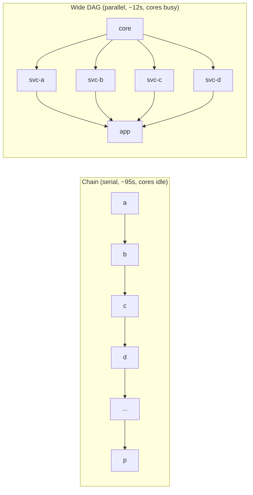
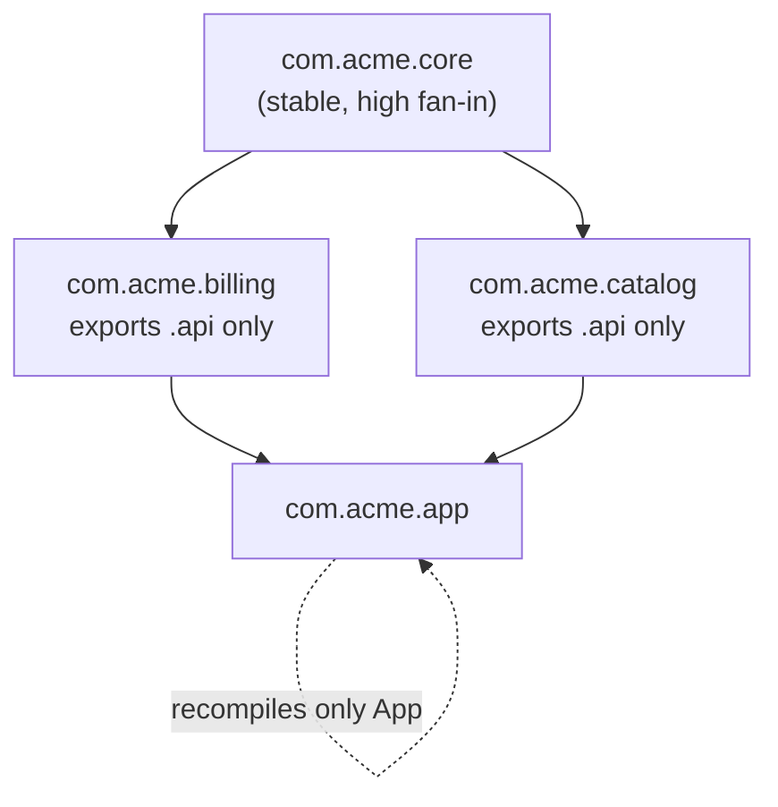

# Modules & Packages — Optimize & Reconcile

> Package structure is not only a readability concern — it is the single largest lever on *incremental build time*, *startup latency*, and *binary size*. A compiler recompiles, retests, and re-links along package boundaries; a god package or an import cycle forces the whole graph through the slow path on every edit. This file reconciles clean module design with build/runtime cost and shows, with concrete numbers, why good boundaries are *also* a performance win.

---

## Table of Contents

1. [God package forces a full recompile on every edit](#scenario-1--god-package-forces-a-full-recompile-on-every-edit)
2. [Import cycle defeats incremental compilation (Go)](#scenario-2--import-cycle-defeats-incremental-compilation-go)
3. [Fan-in hotspot: the `types` package everyone imports](#scenario-3--fan-in-hotspot-the-types-package-everyone-imports)
4. [`init()` ordering inflates startup time (Go)](#scenario-4--init-ordering-inflates-startup-time-go)
5. [Java static initializer doing eager I/O at class-load](#scenario-5--java-static-initializer-doing-eager-io-at-class-load)
6. [Python import-time work blocks CLI startup](#scenario-6--python-import-time-work-blocks-cli-startup)
7. [Barrel file defeats tree-shaking (TS/JS)](#scenario-7--barrel-file-defeats-tree-shaking-tsjs)
8. [Unused import keeps dead code in the Go binary](#scenario-8--unused-import-keeps-dead-code-in-the-go-binary)
9. [Test selection: rebuild/retest only affected packages](#scenario-9--test-selection-rebuildretest-only-affected-packages)
10. [Deep import chains serialize the build (no parallelism)](#scenario-10--deep-import-chains-serialize-the-build-no-parallelism)
11. [Re-exporting a third-party type couples your build to theirs](#scenario-11--re-exporting-a-third-party-type-couples-your-build-to-theirs)
12. [`internal/` vs leaking types: the API surface as a recompile blast radius](#scenario-12--internal-vs-leaking-types-the-api-surface-as-a-recompile-blast-radius)
13. [Java JPMS / split packages and module-graph resolution](#scenario-13--java-jpms--split-packages-and-module-graph-resolution)

[Rules of Thumb](#rules-of-thumb) · [Related Topics](#related-topics)

---

## Scenario 1 — God package forces a full recompile on every edit

**Scenario.** A Go service has a single `model` package holding 140 types — every domain entity, every DTO, every enum. 22 of the 30 packages in the repo import `model`. A junior adds one field to `Invoice` (one of those 140 types).

**Measurement / reasoning.** Go's unit of compilation and caching is the *package*, not the file. Change any file in `model` and the compiler invalidates the cached object for the entire `model` package, then transitively recompiles every package that imports it.

```
$ touch model/invoice.go && go build ./...
# recompiled: model + 22 importers + their importers = 26 packages
# cold-ish incremental build: 11.4s
```

Compare the same one-field edit after splitting `model` into `billing`, `catalog`, `identity`, `shipping`:

```
$ touch billing/invoice.go && go build ./...
# recompiled: billing + 4 importers = 5 packages
# incremental build: 2.1s
```

The edit touched identical bytes of source. The 5.4× difference is entirely the *blast radius* of the package boundary.

<details><summary>Resolution</summary>

The clean-code rule "package by feature, not by layer" and the build-perf rule "minimize recompile blast radius" are the *same rule* viewed from two angles. A change should recompile only the packages that semantically depend on what changed.

- Split god packages along cohesion seams (the bounded contexts that already exist in your domain language).
- Measure blast radius, not lines: `go list -deps ./... | wc -l` per package, or for the reverse direction, `go list -f '{{.ImportPath}} {{.Deps}}' ./...` and count who imports the hotspot.
- A type that 22 packages need is suspicious. Either it is a genuine shared kernel (keep it tiny and *stable* — it rarely changes) or it is a dumping ground (split it).

The litmus test: if editing a comment in a god package recompiles half the repo, the boundary is wrong regardless of how the code reads.

</details>

---

## Scenario 2 — Import cycle defeats incremental compilation (Go)

**Scenario.** `order` imports `payment` for `payment.Charge`; `payment` imports `order` for `order.Status`. Go refuses to compile import cycles outright, so a developer "fixes" it by merging both into one package `orderpayment`. The cycle is gone — but so is the boundary.

**Measurement / reasoning.** Go's compiler builds a DAG of packages and compiles independent nodes in parallel, caching each. A cycle cannot be a DAG node, so the only way to satisfy Go is to collapse the cycle into one package. That one package is now a recompile unit spanning two concerns: any edit to ordering logic recompiles payment logic and vice-versa.

```
# before merge (cycle, won't build):  import cycle not allowed
# after naive merge: orderpayment is one 3,400-line package
$ touch orderpayment/status.go && go build ./...   # 4.8s, recompiles all of payment too
```

Languages that *do* permit cycles (Java, Python) pay differently: the cycle becomes a single strongly-connected component that incremental tools (Gradle, Bazel, Pants) must treat as one recompile/retest unit. You lose granularity exactly where you most wanted it.

<details><summary>Resolution</summary>

Break the cycle with a dependency-inversion seam rather than a merge:

```go
// package order
type Charger interface { Charge(amount Money) error }   // order owns the abstraction

func (o *Order) Settle(c Charger) error { return c.Charge(o.Total()) }

// package payment — depends on order's interface implicitly (structural), no import back
func (p *Processor) Charge(amount Money) error { /* ... */ }
```

Now the dependency points one way: `payment` depends on `order` (or neither depends on the other if the interface lives in a third tiny package). The DAG is restored, both packages compile and cache independently, and parallel build is recovered.

```
$ touch order/status.go && go build ./...   # 1.3s, payment untouched and cache-hit
```

Cycles are a build-performance bug, not just an architecture smell. The clean fix (invert the dependency) and the fast fix are identical. See [find-bug.md](find-bug.md) for detecting cycles statically.

</details>

---

## Scenario 3 — Fan-in hotspot: the `types` package everyone imports

**Scenario.** A `types` (or `pb` generated-protobuf) package is imported by 90% of the codebase. It is well-factored and feature-grouped — but it changes weekly because the API schema evolves.

**Measurement / reasoning.** Fan-in is the number of packages that depend on a node. Recompile cost on edit ≈ `(fan-in) × (avg compile time of a dependent)`. A package with fan-in 90 and a 0.2s average dependent cost means every schema tweak costs ~18s of recompilation across the graph.

```
$ go list -f '{{range .Imports}}{{println .}}{{end}}' ./... | sort | uniq -c | sort -rn | head
     90 myapp/types
     61 myapp/internal/errs
     44 myapp/internal/log
```

The dangerous combination is **high fan-in × high churn**. High fan-in is fine if the package is *stable* (think `errors`, `time` — imported everywhere, edited never). High churn is fine if fan-in is low.

<details><summary>Resolution</summary>

- Split the hotspot by churn, not just by feature: separate the *stable* core types (rarely edited) from the *volatile* ones (edited weekly). The stable subset can keep its high fan-in; the volatile subset should have its fan-in reduced.
- For generated code (protobuf, OpenAPI), put generated types in their own package so hand edits never invalidate generated caches and vice-versa.
- Apply the Stable-Dependencies Principle: depend in the direction of stability. A frequently-changing package should depend on stable ones, never the reverse.

This is the build-time reading of the [Boundaries](../07-boundaries/README.md) chapter: an unstable third-party or generated surface should sit behind a thin, stable adapter so churn does not ripple through 90 packages.

</details>

---

## Scenario 4 — `init()` ordering inflates startup time (Go)

**Scenario.** A CLI tool takes 900ms to print `--help`. Profiling shows the time is spent before `main` even runs.

**Measurement / reasoning.** Go runs every imported package's `init()` functions at startup, in dependency order, *before* `main`. A transitively-imported `config` package has:

```go
func init() {
    cfg = loadFromConsul()        // network round-trip, 600ms
    metrics = registerPrometheus() // 80ms
}
```

Every binary that imports `config` — even `--help` — pays 680ms before doing anything. You can see the init cost:

```
$ GODEBUG=inittrace=1 ./tool --help 2>&1 | sort -k4 -rn | head
init myapp/config @0.4 ms, 612 ms clock, ...
init myapp/metrics @613 ms, 81 ms clock, ...
```

<details><summary>Resolution</summary>

`init()` should be *cheap and side-effect-free* — register, don't connect. Push expensive work into an explicit, lazy entry point:

```go
// no package-level init that does I/O
func New(ctx context.Context) (*Config, error) {   // called from main, after flag parsing
    return loadFromConsul(ctx)
}
```

For genuinely-global lazy singletons, use `sync.Once`:

```go
var (
    once sync.Once
    cfg  *Config
)
func Get() *Config { once.Do(func() { cfg = mustLoad() }); return cfg }
```

Now `--help` pays 0ms of init; the Consul round-trip happens only on the code paths that actually need config. Result: 900ms → 12ms startup. The clean-code principle "no surprising work at import" *is* the startup-latency fix.

</details>

---

## Scenario 5 — Java static initializer doing eager I/O at class-load

**Scenario.** A Spring service's cold start is 6.5s. A `CountryData` utility class loads a 40MB CSV in a static block the first time any code references the class — and class-load is triggered transitively at context-refresh.

**Measurement / reasoning.** JVM class initialization runs the static initializer on first *active use* of the class. If a frequently-touched package references `CountryData` (even via a constant), the 40MB parse happens during bean wiring, on the critical startup path.

```java
class CountryData {
    static final Map<String, Country> ALL;
    static {
        ALL = parseCsv(load("/countries.csv"));   // 40MB, ~1.8s, on class-load
    }
}
```

Measure with `-verbose:class` and `-Xlog:startuptime`, or use the JFR "Class Loading" + "Java Application/Initialization" events. The 1.8s shows up as a stall with no thread doing useful concurrent work.

<details><summary>Resolution</summary>

Make the cost lazy and demand-driven so it is paid off the startup path (and possibly never, in code paths that don't need the data):

```java
class CountryData {
    private static final class Holder {                 // initialization-on-demand holder
        static final Map<String, Country> ALL = parseCsv(load("/countries.csv"));
    }
    static Map<String, Country> all() { return Holder.ALL; }
}
```

The `Holder` class is not initialized until `all()` is first called — the JVM guarantees this is thread-safe with no locking. Cold start drops by 1.8s; the CSV parse moves to the first real lookup, parallel with other warm-up work.

Architecturally, a class that does heavy I/O at load is a hidden boundary violation: a "data" package is secretly an "I/O" package. Separate the *schema* (cheap, load-time) from the *data source* (lazy, runtime).

</details>

---

## Scenario 6 — Python import-time work blocks CLI startup

**Scenario.** `mytool --version` takes 1.4s. The top-level `__init__.py` does `from .commands import *`, which imports `pandas`, `torch`, and a cloud SDK — none needed for `--version`.

**Measurement / reasoning.** Python executes module bodies at *import* time, and `import` is transitive and eager. A wildcard barrel import in the package root drags in the entire dependency tree before `argparse` even sees the flags.

```
$ python -X importtime -c "import mytool" 2>&1 | sort -k2 -rn | head -3
import time:  720146 |  720146 | torch
import time:  410233 |  430880 |   pandas
import time:  ...
```

`torch` alone is 720ms of import. The user asked for a version string.

<details><summary>Resolution</summary>

Lazy-import heavy dependencies *inside the function that needs them*, and keep the package root import-cheap:

```python
def predict(args):
    import torch          # paid only when `predict` actually runs
    import pandas as pd
    ...

def version(args):
    print(__version__)    # zero heavy imports
```

Optionally, expose lazy module-level attributes via `__getattr__` (PEP 562) so `mytool.heavy` resolves on first access rather than at package import. Result: `--version` drops 1.4s → 40ms.

The clean-code rule is the same as the perf rule: a package's `__init__.py` should declare structure, not *do work*. Wildcard re-exports (`from .x import *`) couple your startup cost to your entire transitive tree — they are the Python form of the barrel-file problem in Scenario 7.

</details>

---

## Scenario 7 — Barrel file defeats tree-shaking (TS/JS)

**Scenario.** A frontend imports one helper: `import { formatDate } from "@acme/utils"`. The production bundle grows by 180KB because `@acme/utils` is a barrel (`index.ts` re-exporting 60 modules including a date library, a charting helper, and a markdown parser).

**Measurement / reasoning.** Tree-shaking (dead-code elimination by the bundler) relies on the static import graph and on modules being side-effect-free. A barrel `index.ts` that re-exports everything makes every consumer appear to depend on every member. If *any* re-exported module has a side effect — or the bundler can't prove it doesn't (`"sideEffects"` not set in `package.json`) — the whole barrel is retained.

```
# import one function, ship the world:
$ npx source-map-explorer dist/main.js
@acme/utils  ............ 180 KB  (formatDate is 0.4 KB of it)
```

<details><summary>Resolution</summary>

- Import from the specific module, not the barrel: `import { formatDate } from "@acme/utils/date"`.
- Mark the package side-effect-free so the bundler can drop unused re-exports: `"sideEffects": false` in `package.json` (or list the few files that do have side effects).
- Prefer many small entry points over one mega-barrel; barrels optimize for author ergonomics at the cost of every consumer's bundle.

Measure the win with `source-map-explorer` or `webpack-bundle-analyzer`: typical recovery is the 180KB → ~1KB seen above. The boundary lesson: a package's public surface is also its *minimum shippable unit*. A clean, narrow surface is a smaller bundle.

</details>

---

## Scenario 8 — Unused import keeps dead code in the Go binary

**Scenario.** A 6MB Go service grew to 48MB. A debug-only package imports `net/http/pprof` and a heavyweight visualization library at package scope, "just in case."

**Measurement / reasoning.** Go's linker performs dead-code elimination, but it works at the granularity of *reachable symbols*. An imported package's `init()` and any symbol reachable from `main` are retained. `net/http/pprof`'s `init()` registers HTTP handlers — that `init` is reachable the moment the package is imported, which roots a large dependency subtree the linker then cannot drop.

```
$ go tool nm -size server | sort -k2 -rn | head     # biggest symbols
$ go build -ldflags="-s -w" ... && ls -lh server    # strip symbol table: 48M -> 39M
# but the real bloat is the retained pprof/viz subtree, not symbols
```

(Go won't even *compile* an unused import — `imported and not used` — so the cost here is from imports that *are* referenced but only by dead-by-intent code paths.)

<details><summary>Resolution</summary>

- Gate optional heavyweight subsystems behind build tags so they are excluded from production builds entirely:

```go
//go:build debug

package main
import _ "net/http/pprof"   // only compiled into the `-tags debug` binary
```

- Build production with `-ldflags="-s -w"` to strip the symbol table and DWARF (≈20% off), but treat that as the small win; the big win is not linking the subtree at all.
- Keep optional integrations in separate packages so a consumer pays for them only by importing them.

Result here: 48MB → 7MB by build-tagging out pprof+viz, +20% more with stripping. The principle: an import is a *binary-size dependency*, not just a name resolution. Narrow, intentional imports keep binaries small.

</details>

---

## Scenario 9 — Test selection: rebuild/retest only affected packages

**Scenario.** CI runs the full suite (14 min) on every PR, even one-line changes. The team blames test count; the real lever is package boundaries.

**Measurement / reasoning.** Build tools that hash inputs (`go test` cache, Bazel, Nx, Pants, Turborepo) skip any test target whose transitive inputs are unchanged. The *unit* of skipping is the package/target. With good boundaries, a one-line change in `billing` reruns only `billing` and its dependents.

```
# Go: per-package result caching
$ go test ./...                 # first run: 14m12s, compiles+runs everything
$ touch billing/price.go
$ go test ./...                 # 41s: only billing + 4 dependents rerun; rest "(cached)"
```

```
# Nx / Bazel: affected-only graph
$ nx affected --target=test --base=main   # tests only projects touched by the diff
$ bazel test //...                         # cache-hits everything unchanged; runs the SCC of the edit
```

The catch: a god package or an import cycle (Scenarios 1–2) collapses these affected-sets. If everything depends on `model`, then "affected by a `model` edit" = "everything," and caching buys nothing.

<details><summary>Resolution</summary>

- Let the boundaries do the selection. The same split that shrank recompile blast radius (Scenario 1) shrinks the *test* blast radius identically.
- Keep package-level test caching honest: tests must be hermetic. A test that reads the wall clock, hits the network, or depends on ambient global state breaks input-hashing and forces reruns. (See [professional.md](professional.md) on test hygiene.)
- In monorepos, configure `nx affected` / Bazel / Turborepo so the dependency graph it computes *matches* your real package graph — stale or over-broad `deps` declarations silently disable selection.

Concrete payoff: the 14-min suite becomes a 41s suite for the typical single-package PR. Over a team doing 50 PRs/day, that is ~11 engineer-hours/day reclaimed — a direct, measurable return on having drawn the boundaries well.

</details>

---

## Scenario 10 — Deep import chains serialize the build (no parallelism)

**Scenario.** A Go module builds in 95s on a 16-core machine, but CPU sits near 15% the whole time. The dependency graph is a near-linear chain: `a → b → c → d → … → p` (16 packages, each importing only the next).

**Measurement / reasoning.** Compilers parallelize the build by walking the package DAG and compiling independent nodes concurrently. A *chain* has no independent nodes — `b` can't start until `a` is done, `c` waits on `b`, and so on. Build time ≈ sum of the chain (serial), not max-over-parallel-layers.

```
$ go build -p 16 ./...         # -p sets parallelism; chain ignores it
# critical path = 16 sequential compiles ~= 95s, cores idle
```

Contrast a *wide* graph where one core package fans out to 16 independent leaves: those 16 compile in parallel, and wall-time ≈ core + one layer.

<details><summary>Resolution</summary>

Reduce the *depth* of the dependency graph, not just the count of packages.

- Flatten gratuitous layering. A chain `controller → service → usecase → interactor → repo → gateway → client` for a CRUD endpoint adds 6 serial compile hops with no design payoff (this is the over-fragmentation / package-by-layer anti-pattern from the README, seen as a build cost).
- Introduce shared leaf packages (stable, low-level) that many packages can depend on *in parallel*, instead of long transitive chains.
- Inspect the shape: `go mod graph` or `go list -deps` rendered through `graphviz` reveals chains vs. fans at a glance.



A shallow, wide graph reads better (fewer indirections to trace) *and* builds faster (more parallelism). Depth is the enemy on both axes.

</details>

---

## Scenario 11 — Re-exporting a third-party type couples your build to theirs

**Scenario.** Your `api` package re-exports `github.com/stripe/stripe-go`'s `Charge` type directly in its public signatures. Every package that touches your API transitively compiles against the entire Stripe SDK.

**Measurement / reasoning.** When a public function signature contains a foreign type, every importer must resolve and compile against that foreign package. A Stripe SDK bump (frequent) now invalidates the compile cache of every package in your fan-in, and the SDK's own large transitive tree is dragged into your build graph.

```
$ go list -deps ./api | grep -c stripe     # 38 stripe sub-packages pulled in transitively
# stripe minor version bump -> recompiles all 38 + everyone importing ./api
```

This is the "re-export third-party types" anti-pattern from the README, measured as build cost: hidden coupling becomes hidden recompilation.

<details><summary>Resolution</summary>

Define your own boundary type and translate at the edge (an anti-corruption layer):

```go
// your package — owns this type, stable, no stripe in the signature
type Payment struct { ID string; AmountMinor int64; Currency string }

// translation lives in ONE adapter package that imports stripe
func fromStripe(c *stripe.Charge) Payment { /* ... */ }
```

Now only the single adapter package depends on `stripe-go`. A SDK bump recompiles one package, not 38-plus. Your `api` consumers compile against a stable, tiny type.

The clean-code rule (don't leak third-party types across your boundary) and the build rule (confine a volatile, heavy dependency to one recompile unit) are the same decision. See [Boundaries](../07-boundaries/README.md) and the wider [refactoring](../../refactoring/README.md) treatment of seams.

</details>

---

## Scenario 12 — `internal/` vs leaking types: the API surface as a recompile blast radius

**Scenario.** A library package exposes a struct with all-public fields. Consumers reach into those fields directly. The maintainer wants to change the internal layout but every field change is a breaking, recompile-everything event.

**Measurement / reasoning.** The exported surface of a package *is* the set of things its importers can be coupled to — and therefore the set of changes that force recompilation (and, in compiled-distribution languages, re-release) of every consumer. A wide public surface = a wide recompile blast radius. A narrow one lets you change internals freely with zero downstream rebuilds (cache hits).

```go
// wide surface: every field is a coupling point + a recompile trigger
type Client struct {
    HTTP    *http.Client
    BaseURL string
    Retries int
    cache   map[string]string  // can't even change this layout without risk
}
```

<details><summary>Resolution</summary>

- Put implementation packages under `internal/` (Go enforces that only the parent module can import them) so the importable surface is *physically* bounded and the compiler/tooling knows the blast radius.
- Expose behavior, not fields. Constructors + methods let you change layout without touching the public surface, so consumers stay cache-valid:

```go
type Client struct{ /* all unexported */ }
func New(opts ...Option) *Client { /* ... */ }
func (c *Client) Get(ctx context.Context, path string) (*Response, error) { /* ... */ }
```

In Java, the equivalents are package-private types + JPMS `exports` lists (Scenario 13); in TS, a curated `index.ts` that exports only the supported surface (and `package.json` `"exports"` to block deep imports).

The narrower the public surface, the more internal change you can make as a *cache hit* rather than a *graph-wide recompile*. Encapsulation is a build-incrementality strategy, not only an API-design nicety.

</details>

---

## Scenario 13 — Java JPMS / split packages and module-graph resolution

**Scenario.** Migrating a Java app to the module system, the build fails with "module reads package X from both A and B" (a split package), and module resolution adds noticeable time to large multi-module Gradle builds.

**Measurement / reasoning.** JPMS resolves a module graph at compile and launch. *Split packages* (the same package name living in two modules) are forbidden because the runtime must map each package to exactly one module — an ambiguity that also wrecks incremental compilation, since the compiler can't attribute a recompile to a single owning module.

```
# module-info.java
module com.acme.billing {
    requires com.acme.core;
    exports com.acme.billing.api;        // only this package is visible downstream
    // com.acme.billing.internal is NOT exported -> not a recompile trigger for consumers
}
```

The `exports` clause is the Java analogue of Go's `internal/`: it defines the *public recompile surface*. Anything not exported can change without forcing dependents to recompile.

<details><summary>Resolution</summary>

- Eliminate split packages: a package name must belong to exactly one module. This both satisfies JPMS and restores per-module incremental compilation (Gradle's `--build-cache` can then cache modules independently).
- Export the minimum: every exported package is a coupling point and a recompile trigger for consumers. Keep `internal`/`impl` packages unexported.
- Keep the `requires` graph shallow and acyclic — JPMS forbids cyclic module dependencies outright, which (as in Scenario 2) is the runtime enforcing a build-perf invariant. Use `requires transitive` sparingly; it widens the implied dependency graph for everyone downstream.
- In Gradle, align module boundaries with project boundaries so `:billing:test` can be a cache-hit when only `:catalog` changed (the Scenario 9 selection win, JVM edition).



A clean module graph — acyclic, no split packages, minimal exports — is exactly the graph that compiles incrementally and resolves fast.

</details>

---

## Rules of Thumb

- **Recompile blast radius = boundary quality.** If editing one file recompiles half the repo, the boundary is wrong — measure it (`go list -deps`, reverse-import counts, Gradle/Bazel affected sets), don't eyeball it.
- **High fan-in is only safe with low churn.** A package everyone imports must be *stable*. Split it by churn: stable core (keep high fan-in) vs. volatile surface (reduce fan-in).
- **Cycles are a build bug, not just a smell.** They collapse the parallelizable DAG into one serial recompile/retest unit. The clean fix (invert the dependency) is the fast fix.
- **`init()` / static blocks / module bodies must not do I/O.** Register, don't connect. Push expensive work behind lazy entry points (`sync.Once`, holder idiom, lazy imports). Startup latency is paid by *every* invocation, including `--help`.
- **A package's public surface is its minimum shippable + recompilable unit.** Narrow it: `internal/`, JPMS `exports`, curated `index.ts`. Encapsulation is a build-incrementality strategy.
- **Barrels and wildcard re-exports trade author convenience for every consumer's bundle/startup.** Import from specific modules; mark packages side-effect-free.
- **An import is a binary-size and build-graph dependency, not just a name.** Build-tag out optional heavyweight subsystems; confine volatile third-party SDKs to a single adapter package.
- **Optimize graph depth, not just node count.** A long import chain serializes the build and idles cores; a wide, shallow DAG parallelizes.
- **Don't re-introduce a god package for speed.** Merging packages to "break a cycle" or "reduce hops" usually *worsens* incremental build by widening recompile units. Invert dependencies instead.
- **Keep tests hermetic so package-level caching works.** Non-determinism (clock, network, global state) silently disables `go test`/Bazel/Nx caching and forces full reruns.

---

## Related Topics

- [find-bug.md](find-bug.md) — detecting cycles, fan-in hotspots, and god packages statically.
- [professional.md](professional.md) — test hygiene and hermeticity that keep package-level caching honest.
- [Chapter README](../README.md) — the positive module/package design rules these optimizations reconcile with.
- [Boundaries](../07-boundaries/README.md) — confining third-party and volatile surfaces behind stable adapters.
- [Refactoring](../../refactoring/README.md) — seams, dependency inversion, and Move Method for restructuring a dependency graph without changing behavior.
