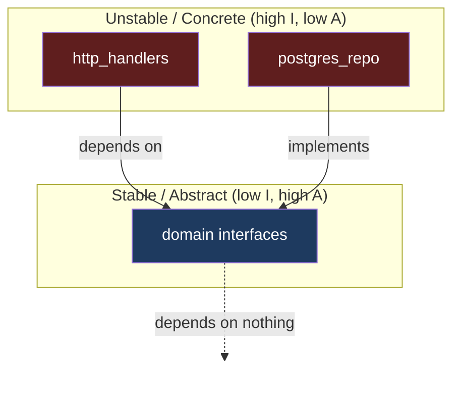
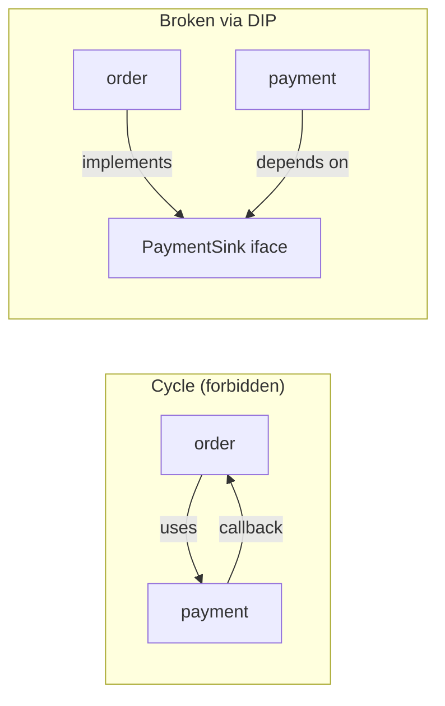

# Modules & Packages — Professional Level

> Focus: the theory beneath the rules. Parnas' decomposition criterion, Martin's package-design metrics, deep-vs-shallow modules at package scale, physical (link/compile-time) design and levelization, monorepo dependency graphs, and how language module systems (Go, Java JPMS, Python, ES) actually enforce — or fail to enforce — boundaries.

---

## Table of Contents

1. [Parnas: decompose by secrets, not by flowchart](#parnas-decompose-by-secrets-not-by-flowchart)
2. [Martin's package-design principles, formally](#martins-package-design-principles-formally)
3. [The main sequence and the distance metric D](#the-main-sequence-and-the-distance-metric-d)
4. [Deep vs. shallow modules at package scale](#deep-vs-shallow-modules-at-package-scale)
5. [Physical design: compile-time and link-time coupling](#physical-design-compile-time-and-link-time-coupling)
6. [The real cost of a cyclic dependency](#the-real-cost-of-a-cyclic-dependency)
7. [Language module systems compared](#language-module-systems-compared)
8. [Monorepo dependency graphs and build systems](#monorepo-dependency-graphs-and-build-systems)
9. [Conway's Law and module boundaries](#conways-law-and-module-boundaries)
10. [Common Mistakes](#common-mistakes)
11. [Test Yourself](#test-yourself)
12. [Cheat Sheet](#cheat-sheet)
13. [Summary](#summary)
14. [Further Reading](#further-reading)
15. [Related Topics](#related-topics)

---

## Parnas: decompose by secrets, not by flowchart

The foundational paper is David Parnas, *"On the Criteria To Be Used in Decomposing Systems into Modules"* (CACM, 1972). Parnas takes one program — a KWIC index — and decomposes it two ways:

- **Decomposition 1 (by flowchart steps):** input → circular-shift → alphabetize → output. Each processing step becomes a module. This is the *intuitive* decomposition: modules mirror the order of execution.
- **Decomposition 2 (by information hiding):** each module *hides a design decision that is likely to change* — the line-storage representation, the index-storage representation, the sorting algorithm, the input format. The flowchart is invisible in the module structure.

His result, which still governs everything in this chapter: **Decomposition 2 is superior**, and the criterion is not "minimize coupling" in the abstract but *encapsulate the decisions likely to change*. A change to the storage format in Decomposition 1 ripples through every module (each one knows the format). In Decomposition 2 it is confined to one module behind an interface.

> "We propose instead that one begins with a list of difficult design decisions or design decisions which are likely to change. Each module is then designed to hide such a decision from the others." — Parnas, 1972

This reframes the entire question. A module boundary is correct not when it produces small files or a tidy folder tree, but when it **aligns with an axis of change**. The "Utils" / "Common" dumping-ground package fails precisely here: it hides no decision, encapsulates no secret, and therefore couples to *everything* that happens to need a free function. `package-by-layer` (`/controllers`, `/services`, `/repos`) fails the same test: a change to one feature touches all three layers, so the layers are not the secrets — the *feature* is.

The modern restatement is "package by feature, not by layer," and Parnas is why it works: a feature is a cluster of decisions that change together.

---

## Martin's package-design principles, formally

Robert C. Martin formalized package design into six principles, split into **cohesion** (what belongs inside a package) and **coupling** (how packages relate). They appear in *Agile Software Development: Principles, Patterns, and Practices* (2002) and *Clean Architecture* (2017).

### Cohesion principles (what goes together)

| Principle | Name | Statement | Tension |
|---|---|---|---|
| **REP** | Reuse/Release Equivalence | The unit of reuse is the unit of release. A package must be releasable, versioned, and tracked as a whole. | Pushes toward *larger* packages (less release overhead). |
| **CCP** | Common Closure | Classes that change together belong together; classes that change for *different reasons* belong apart. (SRP for packages.) | Pushes toward grouping by *reason to change*. |
| **CRP** | Common Reuse | Classes that are used together belong together; don't force a consumer to depend on things it doesn't use. (ISP for packages.) | Pushes toward *smaller* packages (less unwanted coupling). |

REP and CRP pull in opposite directions — REP toward big convenient releases, CRP toward small focused ones. CCP is the tie-breaker: **group by reason to change**, which is Parnas' criterion restated in OO terms. Early in a project CCP/REP dominate (developability matters more than reuse); as a system matures and is reused, CRP becomes more important.

### Coupling principles (how packages relate)

- **ADP — Acyclic Dependencies Principle:** the dependency graph between packages must be a **DAG**. No cycles. This is the single most enforceable, highest-payoff rule in the chapter.
- **SDP — Stable Dependencies Principle:** depend in the direction of stability. A package should only depend on packages *more stable* than itself. Stability is measured by instability:

  $$I = \frac{C_e}{C_a + C_e}$$

  where $C_e$ = efferent couplings (outgoing dependencies — packages this one depends on) and $C_a$ = afferent couplings (incoming — packages that depend on this one). $I = 0$ means maximally stable (many depend on it, it depends on nothing); $I = 1$ means maximally unstable. SDP says: along any dependency edge, $I$ should *decrease*.
- **SAP — Stable Abstractions Principle:** a package should be as abstract as it is stable. Stable packages (everyone depends on them, hard to change) must be abstract (interfaces, abstract types) so they can be *extended* without modification — otherwise they are rigid. Unstable packages should be concrete. This is the package-level analogue of the Dependency Inversion Principle.

SDP + SAP together produce the dependency-inversion architecture: concrete, volatile detail packages point *inward* toward stable, abstract policy packages.



Concrete packages (`http_handlers`, `postgres_repo`) are unstable and may change weekly; they depend on the stable, abstract `domain` package, which depends on nothing. Dependencies flow *down the stability gradient*, satisfying SDP, and the stable target is abstract, satisfying SAP.

---

## The main sequence and the distance metric D

Martin defines **abstractness**:

$$A = \frac{N_a}{N_c}$$

where $N_a$ = abstract classes/interfaces in the package and $N_c$ = total classes. $A = 0$ is fully concrete; $A = 1$ is fully abstract.

Plot every package on the $(I, A)$ plane. Two corners are pathological:

- **(0, 0) — the Zone of Pain:** maximally stable *and* maximally concrete. Everyone depends on it, and it cannot be extended without modification. A rigid, heavily-depended-upon concrete library is here. (A *frozen* package — e.g., `java.lang.String`, `string` in Go — is tolerable in (0,0) only because it never changes.)
- **(1, 1) — the Zone of Uselessness:** maximally abstract *and* nobody depends on it. Dead abstractions: interfaces no one implements or calls.

The healthy region is the line from (0, 1) to (1, 0) — the **Main Sequence**: stable packages are abstract, unstable packages are concrete. The **distance from the main sequence** is:

$$D = |A + I - 1|$$

$D = 0$ means the package sits exactly on the line; $D \to 1$ means it is in a pain/uselessness corner. $D$ is computable in CI. Tools that emit it: **JDepend** and **Structure101** (Java), **NDepend** (.NET), `go-cleanarch` and custom `go/packages` analyzers (Go), `import-linter` contracts and `pydeps` (Python).

> **Engineering use:** track mean $D$ and the worst-offender packages over time. A package drifting toward (0,0) is becoming a chokepoint — a future "god package." This is a *leading* indicator, visible before the pain.

---

## Deep vs. shallow modules at package scale

John Ousterhout's *A Philosophy of Software Design* (2018, 2nd ed. 2021) supplies the metric Parnas implies but never quantifies: a module is **deep** when it offers a *small interface* hiding a *large implementation*. Interface is cost (everything a consumer must learn and couple to); implementation is the functionality delivered. The best modules maximize the ratio implementation : interface.

At package scale:

- A **deep package** exposes a handful of types and functions and hides a substantial body of logic — Go's `net/http` (a few entry points, an enormous implementation), Unix file I/O (`open/read/write/close/lseek` — five calls hiding disk layout, buffering, permissions, device drivers).
- A **shallow package** exposes almost as much as it hides. Two anti-patterns from the README are shallow packages: **one-class-per-package over-fragmentation** (the interface surface equals the implementation; the package adds an import and a directory but hides nothing) and the **"Utils" dumping ground** (every function is public, so nothing is hidden).

Ousterhout names two specific package failures:

- **Classitis / packagitis:** the belief that smaller is always better, driving teams to split until every package is shallow. The aggregate interface area *grows* — more boundaries to cross, more imports, more cognitive load — even though each unit is "small."
- **Information leakage:** the same design decision (a file format, a wire protocol) appears in two packages. Now both must change together — they are coupled through a leaked secret, exactly Parnas' failure. This is the README's "public API leaking internal types" and "re-exporting third-party types": a consumer that depends on your re-exported `github.com/foo/bar.Widget` is now transitively coupled to `foo/bar`'s release cycle.

The deep-module lens and Parnas' lens are the same lens: **a deep module is one that fully encapsulates a likely-to-change secret behind a narrow interface.** Depth is the *symptom*; a well-chosen secret is the *cause*.

---

## Physical design: compile-time and link-time coupling

John Lakos' *Large-Scale C++ Software Design* (1996; *Large-Scale C++ Vol. I*, 2019) draws a distinction most language-level discussions miss: **logical** design (classes, namespaces, interfaces) versus **physical** design (files, libraries, link order, build units). Two classes can be logically decoupled yet physically coupled because they live in the same compilation unit or a header drags in transitive includes.

Lakos' core tools:

- **Levelization.** Assign each physical component a *level* equal to the longest dependency chain below it. Level-0 components depend on nothing in the package; level-N depend only on levels < N. A *levelizable* system has an acyclic physical graph — Martin's ADP, stated physically. Cyclic physical dependencies are *non-levelizable* and cannot be unit-tested, built, or reasoned about in isolation.
- **Insulation vs. encapsulation.** Encapsulation hides *logically* (private members). Insulation hides *physically* — a change to the hidden part forces no recompilation of clients. In C++ this is the *pImpl* / compiler-firewall idiom; in Java/Go/Python it is achieved by depending only on an interface so the implementation's `.class`/`.o`/`.pyc` is not on the client's compile path.

Why this matters beyond C++: **compile-time coupling determines build incrementality.** If module A's public header (`.h`, exported types, `__init__.py` re-exports) transitively pulls in B's internals, then editing B recompiles A. In a large monorepo this is the difference between a 4-second incremental build and a 40-minute one. The README's "public API leaking internal types" is a *physical* sin even when it is logically harmless: leaking a type into your public surface drags that type's compile-time dependencies onto every consumer.

Lakos' practical heuristic: **keep the physical dependency graph a narrow DAG with low fan-out at the top.** A component that everyone `#include`s (or imports) becomes a recompilation bottleneck — the physical analogue of the (0,0) Zone of Pain.

---

## The real cost of a cyclic dependency

A package cycle (`A → B → A`) is the most damaging structural defect because its cost is paid across *every* engineering activity:

| Activity | Cost of a cycle |
|---|---|
| **Build** | The cycle becomes one indivisible compilation unit. Go and Java **refuse to compile** package cycles outright. Build systems (Bazel, Buck) reject cyclic `deps`. Incremental builds degrade: editing any node in the cycle rebuilds the whole cycle. |
| **Test** | You cannot unit-test A without B and B without A. The cycle is the minimum testable unit — integration testing masquerading as unit testing. |
| **Reasoning** | There is no bottom-up reading order. Lakos' levelization is impossible; you cannot understand A "in terms of things already understood." |
| **Release** | REP is violated: A and B can no longer be released independently. They are one release unit with two names. |
| **Deletion / extraction** | Neither node can be removed or extracted to its own library without untangling the other. |

How languages react:

- **Go:** compile error — `import cycle not allowed`. The language *forbids* cycles. This is a deliberate design choice (Pike, Cox) precisely because of the costs above.
- **Java (classes):** the *compiler* permits class-level cycles within a module; **JPMS forbids cycles between modules** (`module-info.java` `requires` graph must be acyclic). Tools like ArchUnit and SonarQube flag package cycles even where javac tolerates them.
- **Python:** circular *imports* are permitted but fail at runtime in many orderings (`ImportError: cannot import name X` / partially-initialized module). Python is the most dangerous case — the cycle is *latent* until an unlucky import order triggers it in production.

The cure is always one of three Dependency Inversion moves: (1) extract the shared abstraction A and B both depend on into a third, more-stable package C; (2) invert one edge with an interface owned by the dependee; (3) merge A and B if they truly change together (CCP says they were one package all along).



---

## Language module systems compared

The *enforcement strength* of the boundary differs enormously by language. A principle that is compiler-enforced costs nothing to maintain; a principle enforced by convention erodes.

### Go — packages and `internal/`

The package is Go's unit of compilation, visibility, and reuse — tightly aligned with Martin's REP. Visibility is by **capitalization**: an exported identifier starts uppercase, everything else is package-private. The killer feature is **`internal/`**: a package under `…/internal/…` is importable *only* by packages rooted at `internal/`'s parent. The compiler enforces it.

```go
// module: github.com/acme/billing
// Path: billing/internal/ledger/ledger.go
package ledger

// Importable by github.com/acme/billing/... only.
// github.com/other/svc importing it => compile error:
//   use of internal package not allowed
func Post(entry Entry) error { /* ... */ }
```

Cycles are a hard compile error. The result: Go's module system mechanically enforces ADP and gives a first-class tool (`internal/`) for the README's "public API leaking internal types." Go's weakness is *granularity* — visibility is binary (package-private or fully exported); there is no `protected`/sub-package sharing without `internal/`.

### Java — JPMS (Java Platform Module System, JSR 376, Java 9+)

Below the module sits the package (`public`/`protected`/package-private/`private`). JPMS adds a layer *above* packages: a **module** (`module-info.java`) declares what it `exports` and what it `requires`.

```java
// module-info.java
module com.acme.billing {
    requires com.acme.domain;          // explicit dependency edge
    exports com.acme.billing.api;      // only this package is visible
    // com.acme.billing.internal is NOT exported -> strongly encapsulated
}
```

Crucially, a non-exported package is **invisible at compile time and runtime**, even to reflection (unless `opens`). This is *strong encapsulation* — far beyond `public`, which leaks across the whole classpath. The `requires` graph must be **acyclic** — JPMS enforces ADP at the module level. Adoption is partial: most applications still run on the unnamed-module classpath where these guarantees vanish, so in practice ArchUnit/Sonar enforce the rules many teams never modularized into JPMS.

### Python — the weak boundary

Python has essentially **no enforced boundary.** A leading underscore (`_internal`) is a *convention*; nothing stops `from pkg._internal import secret`. `__all__` controls only `from pkg import *`, not explicit imports. There is no `internal/`, no `exports`, no compile-time visibility. Circular imports are permitted and fail unpredictably at runtime.

Consequently boundaries in Python are maintained by **tooling, not the language**: `import-linter` lets you declare *contracts* (layered, forbidden, independence) and fail CI on violation:

```ini
# importlinter contract
[importlinter:contract:layers]
name = Layered architecture
type = layers
layers =
    billing.api
    billing.service
    billing.repo
# api may import service may import repo; never the reverse.
```

Without such tooling, Python packages drift toward god-packages and cross-layer reaches because the path of least resistance — a direct import — is always available.

### ES Modules (JavaScript/TypeScript)

ESM has file-level `export`/`import` with static structure (statically analyzable, enabling tree-shaking). There is *no* package-private boundary between files in the same package — `export` is binary, and `package.json` `"exports"` maps (Node 12+) are the only mechanism to hide internal files from external consumers:

```json
{ "exports": { ".": "./dist/index.js", "./feature": "./dist/feature/index.js" } }
```

Anything not listed in `"exports"` is unreachable from outside the package — Node's analogue of Go's `internal/`. ESM permits cyclic imports (resolved via "live bindings"), so cycles fail subtly at runtime like Python.

| System | Visibility unit | `internal` mechanism | Cycles | Enforcement |
|---|---|---|---|---|
| Go | package (capitalization) | `internal/` directory | compile error | compiler |
| Java + JPMS | package + module `exports` | non-exported package | module-graph acyclic | compiler/runtime |
| Java classpath only | package (`public` leaks) | none | tolerated by javac | tooling (ArchUnit) |
| Python | none (`_` convention) | none | runtime failure | tooling (import-linter) |
| ESM/TS | file `export` | `package.json` `"exports"` | runtime live-bindings | bundler/Node |

---

## Monorepo dependency graphs and build systems

At scale, the package dependency DAG *is* the build graph. Modern monorepo build systems (Google's **Bazel**, Meta's **Buck2**, **Nx** for JS/TS, Pants) make Martin's principles operational:

- **Explicit `deps` + visibility.** A Bazel `BUILD` target declares its direct dependencies and a `visibility` list — who is allowed to depend on it. This is `internal/` generalized to arbitrary fine-grained rules:

  ```python
  # BUILD.bazel
  go_library(
      name = "ledger",
      srcs = ["ledger.go"],
      visibility = ["//billing:__subpackages__"],  # internal/ as policy
      deps = ["//domain:money"],                     # explicit edges
  )
  ```

- **Cycles are rejected.** Bazel/Buck build the target graph and *fail* on a cycle — ADP enforced by the build tool, language-independently.
- **Affected-target computation.** Because the DAG is explicit and accurate, the build system computes the *minimal* set of targets affected by a diff (`bazel query`, `nx affected`). A change to a leaf package rebuilds/tests only its reverse-dependency cone. **This is the payoff of a clean DAG: a god-package with a huge reverse-dependency cone means every change to it rebuilds the world.** The structural metric ($C_a$, afferent coupling) becomes a *literal* CI-cost metric.
- **Caching and remote execution.** Content-addressed caching only works because targets are hermetic and the dependency edges are declared. A leaked, undeclared dependency produces cache poisoning — wrong results that "build fine."

The lesson: in a monorepo, package-design hygiene is not aesthetic. A wide, low-DAG with narrow public surfaces directly determines CI wall-clock time and cache hit-rate. The (0,0) Zone of Pain package is, concretely, the package whose edit triggers the longest build.

---

## Conway's Law and module boundaries

Mel Conway (1968): *"Organizations which design systems are constrained to produce designs which are copies of the communication structures of these organizations."* Two teams that must coordinate to ship a change will produce two coupled modules; the module boundary will fall on the team boundary whether you plan it or not.

Two engineering consequences:

- **The Inverse Conway Maneuver:** deliberately structure teams to *induce* the module architecture you want. If you want autonomous, deeply-encapsulated services/packages (low afferent coupling, clean DAG), give each its own team with a stable interface contract. Microservice boundaries that ignore Conway produce a "distributed monolith" — services that must deploy together because their teams change them together, violating CCP across a network boundary (now with added latency).
- **Module boundaries as coordination boundaries.** A clean interface between packages is also a clean interface between the *people* who own them. Parnas' "secret" and the team's "owned decision" should coincide: the team that owns the storage format owns the package that hides it. When ownership and encapsulation disagree, you get the god-package and the cross-layer reach — multiple teams editing the same package because no one decision is cleanly owned.

This closes the loop with Parnas: a module hides a decision, a team owns a decision, and the healthiest architectures make those the *same* decision.

---

## Common Mistakes

- **Decomposing by flowchart step (or by layer) instead of by secret.** `/controllers`, `/services`, `/repos` groups code that changes for *different* reasons together and code that changes *together* apart — the exact inversion of CCP/Parnas. Package by feature.
- **The "Utils"/"Common" god-package.** It hides no secret, is depended on by everything (afferent coupling → ∞, $I \to 0$), and is concrete — it lives in the (0,0) Zone of Pain and becomes the longest-build node in a monorepo.
- **Tolerating cycles in Python/ESM because "it works."** A latent circular import fails at the worst time (a new import added months later changes initialization order). Treat cycles as compile errors via tooling even where the language permits them.
- **Re-exporting third-party types from your public API.** Now your consumers transitively couple to the third party's release cycle and compile-time dependencies (information leakage; physical coupling). Wrap, don't re-export.
- **Confusing logical decoupling with physical decoupling.** Depending on an interface that lives in the *same* compilation unit as its implementation still drags the implementation onto your compile path. Insulate by putting the abstraction in a separate, more-stable package.
- **Packagitis.** One-class-per-package maximizes total interface surface and import noise while hiding nothing. Depth, not count, is the goal.
- **Ignoring the SDP gradient.** A stable, widely-used package depending on a volatile one means the volatile one's churn forces the stable one — and everything above it — to change. Dependencies must flow toward stability.

---

## Test Yourself

1. **Parnas decomposed the KWIC system two ways. Why is "by information hiding" superior to "by flowchart step," and which README anti-pattern does the flowchart decomposition correspond to?**

<details><summary>Answer</summary>

By-flowchart makes each *processing step* a module, so a design decision likely to change (e.g., the line-storage format) is *known to every module* — a change ripples through all of them. By-information-hiding gives each likely-to-change decision its own module behind an interface, confining the change. The flowchart decomposition is the README's **package-by-layer** anti-pattern: layers mirror processing stages, but a feature change crosses all layers, so layers are not the secrets.

</details>

2. **A package has $C_a = 40$ incoming and $C_e = 2$ outgoing dependencies, and $A = 0.05$ (almost entirely concrete classes). Compute $I$ and $D$, and say where it sits.**

<details><summary>Answer</summary>

$I = C_e / (C_a + C_e) = 2/42 \approx 0.048$ — maximally stable. $D = |A + I - 1| = |0.05 + 0.048 - 1| \approx 0.90$. It sits deep in the **(0,0) Zone of Pain**: heavily depended on yet concrete and inextensible. It is a future god-package and the longest-build node. Cure: extract abstract interfaces (raise $A$ toward the main sequence) and/or split by CRP so fewer consumers depend on the whole thing.

</details>

3. **Go and Java refuse to compile a package cycle; Python and ESM permit it. Why is the permissive case more dangerous, not less?**

<details><summary>Answer</summary>

A compile-time rejection surfaces the cycle immediately, at the desk of the engineer who introduced it. Python/ESM resolve imports at runtime, so a cycle is *latent*: it only fails for a particular initialization order. Adding an unrelated import months later can flip that order and produce `ImportError`/partially-initialized-module failures in production — far from the change that "caused" it. Permissiveness defers the cost to the worst possible time and place. Enforce acyclicity with `import-linter` (Python) or the bundler/ArchUnit anyway.

</details>

4. **REP and CRP pull in opposite directions. State each, and explain which dominates early vs. late in a project's life.**

<details><summary>Answer</summary>

**REP** (Reuse/Release Equivalence) pushes toward *larger* packages — fewer release/version units to track. **CRP** (Common Reuse) pushes toward *smaller* packages — don't force a consumer to depend on (and be revalidated against changes to) things it doesn't use. Early, when code is changing fast and reuse is low, REP/CCP dominate: optimize for developability and grouping by reason to change. Late, when the package is widely reused, CRP dominates: unwanted coupling now imposes real revalidation cost on many consumers. The boundary is dynamic, which is why $D$/coupling should be tracked over time.

</details>

5. **Two classes are logically decoupled (neither references the other). Can they still be physically coupled? What's the engineering symptom?**

<details><summary>Answer</summary>

Yes. If they share a compilation unit, or class A's public surface (header / exported package / `__init__.py` re-export) transitively pulls in B's internals, editing B forces A (and A's consumers) to recompile — Lakos' compile-time coupling. The symptom is build incrementality collapse: a small edit triggers a large rebuild cone. The fix is *insulation* — depend only on a stable interface in a separate package so the volatile implementation is off the compile path.

</details>

6. **Your microservices must always deploy together or things break. Which package principle is violated, and what's the root cause per Conway?**

<details><summary>Answer</summary>

CCP across a network boundary: things that change together were split apart (into separate services) without actually decoupling the decisions — a "distributed monolith." Per Conway, the deploy-coupling mirrors *team* coupling: the teams coordinate every change, so their services do too. The fix is the Inverse Conway Maneuver — realign team ownership so each service hides a decision one team fully owns, with a stable contract between them — or recombine the services if they genuinely share one secret.

</details>

7. **Go's `internal/` and Java JPMS's non-exported package both hide internals. How do they differ in enforcement strength, and what does plain classpath Java give you?**

<details><summary>Answer</summary>

`internal/` is a *compiler* rule keyed on directory position: only packages under the parent of `internal/` may import it. JPMS's non-exported package is hidden at *compile and runtime, including from reflection* (strong encapsulation) — stronger than `internal/`. Plain classpath Java (no `module-info.java`) gives essentially nothing beyond `public`/package-private: a `public` type leaks to the entire classpath, so teams fall back to ArchUnit/Sonar to enforce boundaries the language won't.

</details>

8. **In a Bazel monorepo, why is a low-fan-in DAG not just "clean" but a measurable CI cost win?**

<details><summary>Answer</summary>

Because the build system computes affected targets from the explicit DAG: a diff rebuilds and retests only the *reverse-dependency cone* of the changed targets. A package with high afferent coupling ($C_a$) has a huge reverse cone, so any edit to it rebuilds the world. Thus $C_a$ — Martin's structural metric — becomes a literal CI wall-clock and cache-hit-rate metric. A wide, low-fan-in DAG with narrow public surfaces (`visibility` rules, `internal/`) directly minimizes rebuild scope. The (0,0) Zone-of-Pain package is, concretely, the package whose edit triggers the longest build.

</details>

9. **Where do `string` (Go) and `java.lang.String` sit on the $(I, A)$ plane, and why is that tolerable when the same coordinates are pathological for your own packages?**

<details><summary>Answer</summary>

They sit at (0,0) — maximally stable (everything depends on them) and maximally concrete. That is the Zone of Pain in general, because a stable concrete package cannot be extended without modification and everything breaks when it changes. It is tolerable *only* because these types are **frozen**: they effectively never change. The Zone of Pain is dangerous when the (0,0) package is still *volatile*. So the real risk metric is "stable + concrete + still changing," not (0,0) alone.

</details>

---

## Cheat Sheet

| Concept | One-line rule |
|---|---|
| **Parnas (1972)** | Decompose by likely-to-change secret, not by flowchart step. |
| **REP** | Unit of reuse = unit of release; group what's released together. |
| **CCP** | Group what changes together / for the same reason (SRP for packages). |
| **CRP** | Don't make a consumer depend on what it doesn't use (ISP for packages). |
| **ADP** | The package dependency graph must be a DAG — no cycles, ever. |
| **SDP** | Depend toward stability: $I$ decreases along every edge. |
| **SAP** | As abstract as it is stable; stable packages expose abstractions. |
| **Instability** | $I = C_e/(C_a+C_e)$; 0 = stable, 1 = unstable. |
| **Abstractness** | $A = N_a/N_c$; 0 = concrete, 1 = abstract. |
| **Distance** | $D = \lvert A+I-1 \rvert$; 0 = on main sequence, →1 = pain/uselessness. |
| **Deep module** | Small interface, large hidden implementation (Ousterhout). |
| **Insulation (Lakos)** | Hide *physically* so clients don't recompile — interface in a separate, stable package. |
| **Levelization** | Acyclic physical graph; understand each level via levels below it. |
| **Go boundary** | Capitalization + `internal/`; cycles are a compile error. |
| **JPMS** | `exports`/`requires`; non-exported = strongly encapsulated; module graph acyclic. |
| **Python** | No enforced boundary; use `import-linter` contracts in CI. |
| **ESM** | `package.json` `"exports"` = the only `internal/` analogue. |
| **Conway** | Module boundary falls on team boundary; align secret with ownership. |

---

## Summary

Module and package design is not folder organization — it is the discipline of choosing boundaries that align with axes of change. **Parnas** gives the criterion (hide likely-to-change secrets), **Martin** gives the measurable principles (REP/CCP/CRP cohesion, ADP/SDP/SAP coupling, and the $(I, A)$ main sequence with distance metric $D$), and **Ousterhout** gives the shape (deep modules: narrow interface over large hidden implementation). **Lakos** adds the physical dimension most discussions omit — compile-time and link-time coupling determine build incrementality, and levelization is ADP stated physically.

The cost of getting this wrong compounds across every activity: a cycle is forbidden by Go and JPMS precisely because it destroys independent build, test, reasoning, release, and deletion. Language enforcement varies from strong (Go `internal/`, JPMS strong encapsulation) to nonexistent (Python, ESM), so in weakly-enforced languages the boundary survives only through tooling (`import-linter`, ArchUnit) and build-system visibility rules (Bazel/Nx). In a monorepo those rules are not cosmetic — afferent coupling *is* rebuild scope. Finally, **Conway's Law** ties it together: the cleanest architectures make the encapsulated secret and the owning team the same decision.

---

## Further Reading

- David L. Parnas, *On the Criteria To Be Used in Decomposing Systems into Modules*, CACM 15(12), 1972 — the foundational paper.
- Robert C. Martin, *Clean Architecture* (2017), Part IV (Component Principles) and *Agile Software Development: Principles, Patterns, and Practices* (2002).
- John Ousterhout, *A Philosophy of Software Design*, 2nd ed. (2021) — deep vs. shallow modules, information leakage.
- John Lakos, *Large-Scale C++ Software Design* (1996) and *Large-Scale C++ Vol. I: Process and Architecture* (2019) — physical design, levelization, insulation.
- Mel Conway, *How Do Committees Invent?*, Datamation, 1968 — Conway's Law.
- The Go Blog, *Organizing a Go module*, and the `internal/` package mechanism in the Go spec.
- JSR 376 / *The State of the Module System* (Mark Reinhold) — JPMS rationale.
- Bazel documentation: `visibility`, `bazel query`; Nx: `affected` commands.

---

## Related Topics

- [senior.md](senior.md) — applied package boundaries, refactoring toward features, breaking cycles in practice.
- [interview.md](interview.md) — Q&A on cohesion/coupling principles and module-system trivia.
- [Chapter README](../README.md) — the positive rules and the anti-pattern catalog.
- [Abstraction & Information Hiding](../22-abstraction-and-information-hiding/README.md) — the per-type analogue of a package secret.
- Deep Modules & Complexity (chapter 27) — Ousterhout's depth argument at the unit level.
- [Classes](../09-classes/README.md) — SRP and cohesion below the package boundary.
- [Design Patterns](../../design-patterns/README.md) — structural patterns (Facade, Adapter) that create deep package interfaces.
- [Design Principles](../../design-principles/README.md) — SOLID, the class-level source of the package-level SDP/SAP/CRP analogues.