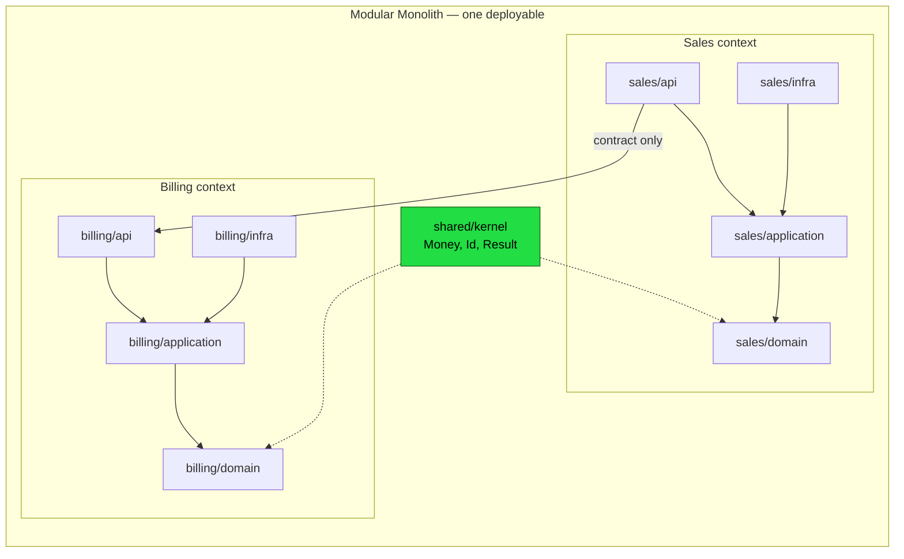

# Modules & Packages — Senior Level

> Focus: structuring a large codebase across a team — module architecture at scale, dependency rules enforced in CI, the acyclic-dependencies principle, public API boundaries and versioning, monorepo vs multi-repo, ownership, and safe large-scale restructuring. Go + Java + Python, with real config.

---

## Table of Contents

1. [Module architecture at scale](#module-architecture-at-scale)
2. [The dependency rules you actually enforce](#the-dependency-rules-you-actually-enforce)
3. [Enforcing dependency rules in CI](#enforcing-dependency-rules-in-ci)
4. [The Acyclic Dependencies Principle](#the-acyclic-dependencies-principle)
5. [Public API boundaries and versioning](#public-api-boundaries-and-versioning)
6. [Monorepo vs multi-repo module boundaries](#monorepo-vs-multi-repo-module-boundaries)
7. [Ownership and build boundaries](#ownership-and-build-boundaries)
8. [The shared kernel without the god package](#the-shared-kernel-without-the-god-package)
9. [Refactoring package structure safely at scale](#refactoring-package-structure-safely-at-scale)
10. [Common Mistakes](#common-mistakes)
11. [Test Yourself](#test-yourself)
12. [Cheat Sheet](#cheat-sheet)
13. [Summary](#summary)
14. [Further Reading](#further-reading)
15. [Related Topics](#related-topics)

---

## Module architecture at scale

At team scale, packages stop being a filing convenience and become the *primary* mechanism for limiting blast radius. The package graph is the architecture. Three patterns dominate, and they compose:

**Modular monolith.** One deployable, many modules with hard internal walls. Each module owns its data, exposes a narrow API, and may not reach into another module's internals. This is the highest-leverage choice for most teams: you get bounded-context isolation without distributed-systems tax (network, partial failure, eventual consistency). When a module genuinely needs independent scaling or release cadence, you carve it out into a service — and because the wall already existed, the carve is mechanical.

**Clean / hexagonal layering.** Dependencies point inward toward the domain. The domain knows nothing about HTTP, SQL, or Kafka; adapters depend on the domain, never the reverse. The rule reduces to one direction: `inbound adapters → application → domain ← outbound adapters`. Infrastructure is replaceable because the domain never names it.

**Bounded contexts → modules.** Each DDD bounded context maps to a top-level module. The context boundary is where the ubiquitous language changes meaning ("Order" in Sales ≠ "Order" in Fulfillment). Cross-context calls go through an explicit contract, never a shared mutable model.



The discipline is the same at every scale: **dependencies flow in one allowed direction, internals stay internal, and the kernel stays tiny.** What changes is only the enforcement cost — which is why CI enforcement is the senior's real job.

---

## The dependency rules you actually enforce

Before tooling, write the rules down as assertions. A useful ruleset for a layered, multi-context codebase:

1. `domain` may not import `application`, `infra`, or any framework.
2. `application` may import `domain` only (plus the kernel).
3. `infra` / adapters may import `application` and `domain`.
4. No context may import another context's non-API package (`*.internal`, `*.domain`).
5. No package may import a package that (transitively) imports it — **no cycles**.
6. No package may import a `_test` / `testing` helper package from production code.

These are *fitness functions*: executable statements about the architecture that fail the build when violated. Without them, the package graph rots within a quarter — every shortcut import is locally rational and globally fatal.

---

## Enforcing dependency rules in CI

A rule nobody can break is an architecture; a rule everyone respects "out of professionalism" is a suggestion that decays. Wire enforcement into the pipeline.

### Java — ArchUnit

ArchUnit runs as plain JUnit tests; failures are build failures.

```java
@AnalyzeClasses(packages = "com.acme.shop", importOptions = ImportOption.DoNotIncludeTests.class)
class ArchitectureTest {

    @ArchTest
    static final ArchRule layers_are_respected = layeredArchitecture()
        .consideringAllDependencies()
        .layer("Domain").definedBy("..domain..")
        .layer("Application").definedBy("..application..")
        .layer("Adapters").definedBy("..adapter..")
        .whereLayer("Adapters").mayNotBeAccessedByAnyLayer()
        .whereLayer("Application").mayOnlyBeAccessedByLayers("Adapters")
        .whereLayer("Domain").mayOnlyBeAccessedByLayers("Application", "Adapters");

    @ArchTest
    static final ArchRule no_cycles =
        slices().matching("com.acme.shop.(*)..").should().beFreeOfCycles();

    @ArchTest
    static final ArchRule domain_is_framework_free =
        noClasses().that().resideInAPackage("..domain..")
            .should().dependOnClassesThat().resideInAnyPackage(
                "org.springframework..", "jakarta.persistence..");

    @ArchTest
    static final ArchRule contexts_talk_only_through_api =
        noClasses().that().resideInAPackage("..sales..")
            .should().dependOnClassesThat().resideInAPackage("..billing.internal..");
}
```

`beFreeOfCycles()` is the one rule most teams forget and most need.

### Go — depguard + go-arch-lint

Go's package system has no `private` across packages, so you lean on `internal/` (compiler-enforced) plus linters for the directional rules.

`go-arch-lint` declares components and allowed edges in YAML:

```yaml
# .go-arch-lint.yml
version: 3
workdir: .
components:
  domain:      { in: internal/sales/domain/** }
  application: { in: internal/sales/application/** }
  adapters:    { in: internal/sales/adapter/** }
  kernel:      { in: internal/kernel/** }
deps:
  domain:
    mayDependOn: [kernel]
  application:
    mayDependOn: [domain, kernel]
  adapters:
    mayDependOn: [application, domain, kernel]
```

`depguard` (shipped in `golangci-lint`) bans specific import edges:

```yaml
# .golangci.yml
linters:
  enable: [depguard]
linters-settings:
  depguard:
    rules:
      domain-is-pure:
        files: ["**/internal/sales/domain/**"]
        deny:
          - { pkg: "net/http", desc: "domain must not depend on transport" }
          - { pkg: "database/sql", desc: "domain must not depend on persistence" }
          - { pkg: "github.com/acme/shop/internal/sales/adapter", desc: "wrong direction" }
```

For cycle detection, the compiler already refuses import cycles within a module — but cross-package *logical* cycles (A→B→A through interfaces) are caught by `go-arch-lint`'s component graph.

### Python — import-linter

Python has no real privacy; `import-linter` is the enforcement layer. Configure contracts in `setup.cfg` / `pyproject.toml` / `.importlinter`:

```ini
# .importlinter
[importlinter]
root_packages =
    shop

[importlinter:contract:layers]
name = Clean architecture layers
type = layers
layers =
    shop.adapter
    shop.application
    shop.domain
containers =
    shop.sales
    shop.billing

[importlinter:contract:contexts-independent]
name = Sales and Billing only touch each other via api
type = forbidden
source_modules =
    shop.sales
forbidden_modules =
    shop.billing.internal

[importlinter:contract:domain-pure]
name = Domain imports no frameworks
type = forbidden
source_modules =
    shop.sales.domain
    shop.billing.domain
forbidden_modules =
    sqlalchemy
    fastapi
    requests
```

Run `lint-imports` in CI; non-zero exit fails the build. The `layers` contract also rejects cycles between the named layers for free.

### The pattern across all three

Same recipe, three syntaxes: **declare components → declare the allowed edges → fail the build on violation.** Add it to the same CI stage as the linter (`/team-lead/...` should never have to ask "did you respect the layering?"). Adopt a **baseline** for legacy violations so you can turn the gate on today and burn down the backlog over time, instead of waiting for a green-field rewrite that never comes.

---

## The Acyclic Dependencies Principle

> *"Allow no cycles in the package dependency graph."* — Robert C. Martin, ADP.

A cycle means the packages in it are no longer independently buildable, testable, deployable, or reasonable-about. They are one unit pretending to be several. In a 400-package codebase, a single cycle can transitively bind a dozen packages into a "morning-after" blob where any change forces a rebuild of everything.

**Detecting cycles in a big graph:**

- Go: `go-arch-lint` + the compiler; for visualization, `goda graph` or `go mod graph | <render>`.
- Java: ArchUnit `slices().should().beFreeOfCycles()`; jdepend / Structure101 for visual.
- Python: `import-linter` layers contract; `pydeps --max-bacon=2 shop` for a graph.
- Language-agnostic: extract the import graph and run Tarjan's SCC algorithm — any strongly-connected component of size > 1 *is* a cycle.

**Breaking a cycle** uses one of three classic moves:

1. **Dependency Inversion (DIP).** A→B and B→A becomes A→B and B→`interface`←A: B depends on an interface that A implements. The interface lives in B (or a neutral package); A's concrete type plugs in via DI. This is the workhorse fix.
2. **Extract a new package.** The mutually-needed code (often a shared type) moves to a new lower-level package C; both A and B depend on C. Beware: do this carelessly often enough and C becomes the god package (see below).
3. **Merge.** If two packages are *genuinely* one concept that was split prematurely (one-class-per-package over-fragmentation), merging them removes the cycle honestly.

The mistake juniors make is reaching for #2 every time; seniors reach for #1 first because it keeps modules genuinely independent.

---

## Public API boundaries and versioning

A module's API is the set of symbols other modules are *allowed* to name. Everything else is internal and free to change. The senior's job is to make "internal" mean something the compiler or linter enforces, then version the public surface honestly.

### Go — `internal/`, modules, and semver

The `internal/` directory is a **compiler-enforced** boundary: code under `.../foo/internal/...` can only be imported by packages rooted at `foo`. This is Go's only true access control and it is excellent — use it aggressively.

```
github.com/acme/shop/
  sales/
    sales.go            // public API of the sales module
    internal/
      order/order.go    // importable only within sales/
```

The module path encodes the major version (SIVV — Semantic Import Versioning): a `v2` is a *new import path* `github.com/acme/shop/v2`, so v1 and v2 coexist. `go.mod`:

```
module github.com/acme/shop/v2
go 1.22
```

Tag `v2.3.1`; consumers `go get github.com/acme/shop/v2@v2.3.1`. Breaking changes *force* a new import path — the language makes "I broke the API" loud rather than silent.

### Java — JPMS `exports`

The Java Platform Module System makes the boundary a first-class declaration. `module-info.java`:

```java
module com.acme.shop.sales {
    requires com.acme.shop.kernel;
    requires transitive com.acme.shop.contracts;   // re-exported to consumers
    exports com.acme.shop.sales.api;                // public
    // com.acme.shop.sales.internal is NOT exported → inaccessible at compile + runtime
    provides com.acme.shop.sales.api.OrderService
        with com.acme.shop.sales.internal.DefaultOrderService;
}
```

Anything not `exports`-ed is inaccessible — even via reflection, unless `opens`. This is stronger than `public`, which only the convention of "don't touch internals" protected before.

### Python — `__all__` and the public-API convention

Python enforces nothing, so the boundary is convention + linter. Define the surface explicitly in `__init__.py`:

```python
# shop/sales/__init__.py
from shop.sales._service import OrderService
from shop.sales._types import OrderId, OrderStatus

__all__ = ["OrderService", "OrderId", "OrderStatus"]
```

Leading-underscore modules (`_service`, `_types`) signal "internal"; `__all__` defines what `from shop.sales import *` and your documented API expose. Pair with `import-linter` `forbidden` contracts so other modules cannot import `shop.sales._service` directly. Version with semver in `pyproject.toml`; deprecate with `warnings.warn(..., DeprecationWarning)` for at least one minor cycle before removal.

### The non-negotiable rule

**Never leak an internal type through a public signature.** The moment `getOrder()` returns your private `OrderEntity`, every consumer depends on your persistence model and you can never change it. Return a DTO / value object that *you* own at the boundary. (See [boundaries](../07-boundaries/README.md) and [abstraction and information hiding](../22-abstraction-and-information-hiding/README.md).)

---

## Monorepo vs multi-repo module boundaries

| Dimension | Monorepo | Multi-repo |
|---|---|---|
| Cross-module refactor | Atomic single commit | Coordinated PRs + version bumps |
| Dependency visibility | Whole graph in one place; enforce with one config | Each repo enforces locally; global graph is implicit |
| Boundary enforcement | Easy to *violate* (everything is reachable) — must enforce with tooling | Physically enforced by repo walls (you literally can't import) |
| Build cost | Needs caching/affected-only (Bazel, Nx, Turborepo, `go test ./...` is too coarse) | Each repo builds itself |
| Versioning | Often one version / "live at HEAD" | Independent semver per module |
| Ownership | CODEOWNERS per directory | Repo = ownership unit |

The key senior insight: **a monorepo does not give you module boundaries — it removes the only thing that was enforcing them (the repo wall).** In a monorepo, every package is one import statement away, so the boundary must be reconstructed with `internal/`, JPMS, import-linter, and visibility rules (Bazel `visibility`, Nx `tags` + `enforce-module-boundaries`). Teams that adopt a monorepo without adopting boundary tooling get a big ball of mud faster than they would have with separate repos.

Conversely, multi-repo gives you boundaries for free but taxes every cross-cutting change. Choose multi-repo when modules have genuinely independent lifecycles and teams; choose monorepo + strong boundary tooling when you value atomic refactors and a single dependency graph.

---

## Ownership and build boundaries

Module boundaries should line up with **team boundaries** (Conway's Law, used deliberately). Encode ownership so the right reviewers are pulled in automatically.

`CODEOWNERS` (GitHub/GitLab), one rule per module:

```
# CODEOWNERS — paths are ownership, not just review
/sales/                 @acme/sales-team
/billing/               @acme/billing-team
/shared/kernel/         @acme/architecture-guild   # kernel changes need extra eyes
/shared/contracts/      @acme/architecture-guild
*.go                    @acme/go-reviewers          # language-level fallback
/.go-arch-lint.yml      @acme/architecture-guild   # rule changes are guarded
```

Two senior moves here:

1. **Guard the rules with the rules.** The `CODEOWNERS` for `.go-arch-lint.yml` / `module-info.java` / `.importlinter` is the architecture guild. Changing the *enforcement* is harder than changing code — otherwise the first deadline crunch deletes the gate.
2. **The kernel needs a strict owner.** A shared package with no owner is a package everyone edits and no one curates — the classic god-package origin story.

Build ownership maps the same way: Bazel `BUILD` files with `visibility = ["//sales:__subpackages__"]`, or a Gradle/Maven multi-module layout where each module is its own artifact with its own owners.

---

## The shared kernel without the god package

Every codebase grows a `shared`/`common`/`core` package. Done right it's a **shared kernel** (DDD): a tiny, stable, heavily-agreed set of types depended on by everyone. Done wrong it's a **god package** that every module imports and the architecture-guild fears to touch.

The difference is discipline, enforced:

**What belongs in the kernel:**
- Foundational value types with no business policy: `Money`, `Id<T>`, `Result/Either`, `DateRange`, `Currency`.
- Truly cross-cutting, dependency-free primitives.

**What must NOT:**
- Anything that imports a framework (drags it into every module's dependency tree).
- Anything owned by a single context (`OrderStatus` belongs to Sales, not the kernel).
- "Utils" / "Helpers" — these are a **dumping ground**, not a concept. A function with no home means the home hasn't been found yet, not that `common.Utils` should adopt it.

**Enforcing the kernel stays small:**

```java
// ArchUnit — the kernel must have zero outbound dependencies on app code or frameworks
@ArchTest
static final ArchRule kernel_is_a_sink =
    classes().that().resideInAPackage("..kernel..")
        .should().onlyDependOnClassesThat()
        .resideInAnyPackage("..kernel..", "java..");   // JDK only
```

```yaml
# go-arch-lint — kernel may depend on nothing internal
components:
  kernel: { in: internal/kernel/** }
deps:
  kernel:
    mayDependOn: []        # leaf node, by decree
```

A kernel that may depend on nothing cannot become a god package, because a god package's defining feature is that it depends on *and is depended on by* everything. Pin it as a graph sink and the worst case is "too many things import a tiny stable thing" — which is fine. Also watch **fan-in growth**: if a kernel type gains a new field every sprint, it's accreting business logic and should be pushed back out to a context. Treat the kernel as append-rarely, owned by the guild, changed by RFC.

---

## Refactoring package structure safely at scale

Moving packages in a 1M-line codebase is risky precisely because imports are everywhere. The safe sequence:

1. **Make the rule before the move.** Add the *target* dependency rule to ArchUnit / go-arch-lint / import-linter in **baseline / report-only** mode. Now you can see every current violation of the structure you want.
2. **Move with tooling, not by hand.** Use the IDE/refactoring engine so import statements update mechanically: IntelliJ "Move Package" (rewrites all imports + `module-info`), `gomvpkg` / `gopls` rename, Python `rope`/`pycharm` move. Hand-editing imports across a big graph guarantees breakage.
3. **Break cycles first, structure second.** Don't attempt the reorg while cycles exist — they will fight every move. Apply DIP to cut them (above), commit, *then* move.
4. **One context at a time.** Migrate the least-coupled context first to prove the pattern, just as you'd extract the least-coupled cluster of a god class first (see bloaters).
5. **Keep the old import path alive temporarily.** Go: a thin alias package re-exporting from the new location. Java: a deprecated facade. Python: `from .new_location import *` in the old module with a `DeprecationWarning`. This decouples "move the code" from "update every caller," so the diff stays reviewable.
6. **Flip the gate from report-only to fail.** Once violations hit zero, turn the rule into a hard build failure so the structure can't regress. The gate is the only thing that makes the refactor *stick*.

This is the same strangler-fig / branch-by-abstraction discipline applied to package topology: introduce the new shape behind a compatibility seam, migrate callers incrementally, delete the seam, lock the result with CI.

---

## Common Mistakes

- **Treating a monorepo as if it provides boundaries.** It removes the repo wall; you must rebuild the wall with `internal/` / JPMS / import-linter / Bazel visibility. No tooling = mud, faster.
- **Package-by-layer instead of package-by-feature.** `/controllers`, `/services`, `/repos` scatters one feature across the whole tree; every change touches three folders, and the layering tells you nothing about *what the system does*. Package by feature/context first, layer *inside* each.
- **Leaking internal types through the public API.** Returning your ORM entity from a public method permanently couples consumers to your persistence schema. Return owned DTOs/value objects at the boundary.
- **The "Utils" / "Common" dumping ground.** A package named for its lack of cohesion. Every homeless function lands there until it depends on everything and is depended on by everything. Find the function's real home.
- **Re-exporting third-party types from your own API.** Now your consumers transitively depend on `com.thirdparty.Foo`; you can't upgrade or swap the library without a breaking change. Wrap it.
- **Cross-layer reaches.** Controller imports repository, skipping the service. The architecture diagram lies; the layering is decorative. Catch with a `depguard`/ArchUnit edge rule.
- **One-class-per-package over-fragmentation.** A package per class produces a graph so fine-grained that cohesion is invisible and cycles proliferate. Package = a *concept*, not a *class*.
- **Enforcement rules nobody owns or can't be changed safely.** Either there's no CI gate (decays in a quarter) or the gate's config has no `CODEOWNERS` (deleted at the first deadline). Guard the rules with the guild.
- **Breaking the API without bumping the major version.** Go forces a new import path; Java/Python don't — so a human must. Silent breaks erode every consumer's trust in your semver.

---

## Test Yourself

1. **Your team moves three repos into a monorepo "to improve modularity." Six months later it's worse. Why, and what was skipped?**

<details><summary>Answer</summary>
A monorepo doesn't create module boundaries — it removes the repo wall that was *physically* enforcing them. Before, you literally couldn't import another repo's internals. After, every package is one import away. Modularity now depends entirely on boundary tooling that was never added: `internal/` / JPMS `exports` / import-linter contracts, plus Bazel/Nx visibility tags and per-directory `CODEOWNERS`. Without that, shortcut imports accumulate and you get a big ball of mud faster than three separate repos ever would.
</details>

2. **`go-arch-lint` reports package A and package B in a cycle. List the three ways to break it and say which you'd reach for first.**

<details><summary>Answer</summary>
(1) **Dependency Inversion** — introduce an interface that B owns and A implements (or vice versa), so the concrete dependency flips direction. (2) **Extract** the mutually-needed code into a new lower-level package C that both depend on. (3) **Merge** A and B if they're genuinely one concept split prematurely. Reach for DIP first: it keeps the modules independently buildable/testable. Extracting is the reflex move that, repeated, breeds the god/`common` package; merging is right only when the split was the actual mistake.
</details>

3. **A public method returns `OrderEntity`, your JPA/SQLAlchemy entity. What's the concrete future cost, and the fix?**

<details><summary>Answer</summary>
Every consumer now compiles against your persistence model. You can't rename a column, change a lazy association, split the table, or switch ORMs without a breaking change rippling through all callers — the persistence layer and the public contract are welded together. Fix: define a DTO / value object you own at the boundary and map to it. The entity stays in `internal`; the API exposes a type whose shape *you* control independently of the database. Enforce with an ArchUnit/import-linter rule banning entity types in the `api` package's signatures.
</details>

4. **Why pin the shared kernel as a graph *sink* (depends on nothing internal), and what does that prevent?**

<details><summary>Answer</summary>
A god package's defining property is that it both depends on and is depended on by everything — a hub. If the kernel may depend on *nothing* internal (only the stdlib), it can never become a hub; the worst case is "many modules import a small, stable, leaf package," which is exactly what a shared kernel should be. The rule (`mayDependOn: []` / ArchUnit `onlyDependOnClassesThat ... java..`) also blocks frameworks from sneaking into the kernel and thus into every module's dependency tree. Pair it with fan-in/field-growth monitoring so business logic doesn't accrete.
</details>

5. **You must break a public API. Show how Go, Java, and Python each make "this is breaking" explicit (or fail to).**

<details><summary>Answer</summary>
Go forces it via Semantic Import Versioning: a v2 is a *new import path* (`github.com/acme/shop/v2`, `module .../v2` in `go.mod`), so v1 and v2 coexist and consumers opt in explicitly — the language makes the break loud. Java/JPMS doesn't version for you, but `exports` controls what can break; a removed export is a compile error for consumers (loud at build). Python enforces nothing — you must bump the major version in `pyproject.toml` and emit `DeprecationWarning` for at least one minor cycle before removal; otherwise the break is silent until runtime. The senior move is to make the breakage detectable in CI regardless of language.
</details>

6. **Package-by-layer vs package-by-feature: when, if ever, is package-by-layer acceptable?**

<details><summary>Answer</summary>
Package-by-feature (or by bounded context) should be the top-level structure: it co-locates everything that changes together and makes the codebase's purpose legible from the directory tree. Layering belongs *inside* each feature/context (`sales/domain`, `sales/application`, `sales/adapter`). Top-level package-by-layer is acceptable only for a genuinely tiny app (a few features) where the overhead of contexts isn't worth it — and even then it ages badly. At team scale it's an anti-pattern: every feature change fans out across `controllers/`, `services/`, `repos/`, and the structure tells you nothing about the domain.
</details>

---

## Cheat Sheet

| Concern | Go | Java | Python |
|---|---|---|---|
| Enforced privacy | `internal/` (compiler) | JPMS `exports` / not-exported | `_module` + `__all__` (convention) |
| Dependency-rule CI | `go-arch-lint`, `depguard` | ArchUnit | `import-linter` |
| Cycle detection | compiler + `go-arch-lint`, `goda` | ArchUnit `beFreeOfCycles` | `import-linter` layers, `pydeps` |
| API versioning | SIVV (`/v2` import path) | semver + `exports` surface | semver in `pyproject.toml` + `DeprecationWarning` |
| Module unit | package / module path | `module-info.java` | package (`__init__.py`) |
| Public surface | exported (capitalized) names | `exports` clause | `__all__` |

| Rule | Statement |
|---|---|
| Dependency direction | Inward only: adapters → application → domain ← adapters |
| ADP | No cycles in the package graph — ever |
| Boundary | Internals never leak through a public signature |
| Kernel | Tiny, stable, framework-free, graph sink, guild-owned |
| Structure | Package by feature/context first, layer within |
| Ownership | `CODEOWNERS` per module; the guild owns the rule files |
| Enforcement | Rules are CI fitness functions, with a baseline for legacy |

---

## Summary

At team scale the package graph *is* the architecture. The senior's contribution is not picking the prettiest layout but making the chosen boundaries **enforceable and durable**: directional dependency rules expressed as CI fitness functions (ArchUnit, go-arch-lint/depguard, import-linter), zero cycles by decree of the Acyclic Dependencies Principle, public surfaces that never leak internals and that version honestly (Go SIVV, JPMS `exports`, Python `__all__` + semver), a shared kernel pinned as a tiny dependency sink so it can't grow into a god package, and ownership encoded in `CODEOWNERS` with the rule files themselves guarded by the architecture guild. A monorepo removes the repo wall, so it raises the stakes for this tooling rather than lowering them. Restructure with the same strangler-fig discipline you'd use on a god class: write the target rule in report-only mode, break cycles, move with refactoring tools behind a compatibility seam, then flip the gate to fail and lock the result in.

---

## Further Reading

- Robert C. Martin — *Clean Architecture* (Acyclic Dependencies Principle, Stable Dependencies Principle, component cohesion).
- Eric Evans — *Domain-Driven Design* (bounded contexts, shared kernel, anti-corruption layer).
- Simon Brown — *Modular Monoliths* talks and the C4 model.
- ArchUnit User Guide; `go-arch-lint` and `golangci-lint`/`depguard` docs; Python `import-linter` docs.
- Go Modules Reference — Semantic Import Versioning; *The Java Module System* (Nicolai Parlog) for JPMS.

---

## Related Topics

- [junior.md](junior.md) — what a package/module is and basic visibility.
- [middle.md](middle.md) — cohesion, coupling, and package-by-feature.
- [professional.md](professional.md) — designing clean module APIs and dependency direction.
- [Chapter README](../README.md) — the positive rules and the anti-patterns to avoid.
- [Boundaries](../07-boundaries/README.md) — owning the seam between your code and the outside world.
- [Abstraction & Information Hiding](../22-abstraction-and-information-hiding/README.md) — why internals must stay internal.
- [Design Patterns](../../design-patterns/README.md) — Dependency Inversion and facades for breaking cycles.
- [Anti-Patterns](../../anti-patterns/README.md) — god package, big ball of mud, distributed monolith.
