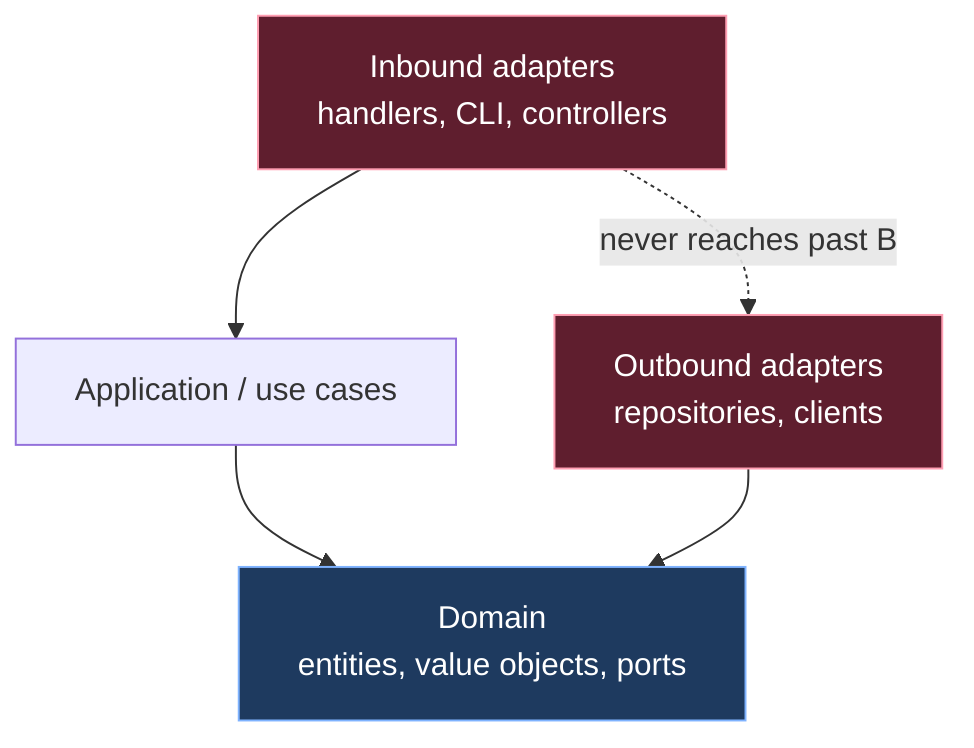
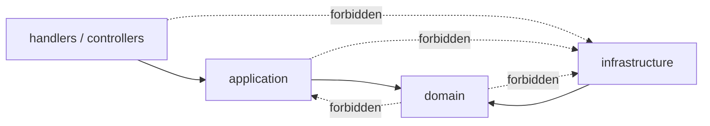

# Modules & Packages — Practice Tasks

> 12 hands-on exercises on package and module structure. Every task gives you a real directory tree or import graph, a precise instruction, and a collapsible full solution with the reorganized layout and the reasoning behind it. Languages rotate across Go, Java, and Python so the *idea* travels, not the syntax. Easy → hard.

---

## Table of Contents

1. [Task 1 — Package-by-layer → package-by-feature (Go)](#task-1--package-by-layer--package-by-feature-go) · _easy_
2. [Task 2 — Dismantle a `utils` dumping ground (Python)](#task-2--dismantle-a-utils-dumping-ground-python) · _easy_
3. [Task 3 — Merge over-fragmented one-class packages (Java)](#task-3--merge-over-fragmented-one-class-packages-java) · _easy_
4. [Task 4 — Hide internals behind a narrow public API (Python)](#task-4--hide-internals-behind-a-narrow-public-api-python) · _medium_
5. [Task 5 — Shrink an over-broad public API with `internal/` (Go)](#task-5--shrink-an-over-broad-public-api-with-internal-go) · _medium_
6. [Task 6 — Java package-private to seal a feature (Java)](#task-6--java-package-private-to-seal-a-feature-java) · _medium_
7. [Task 7 — Break a circular dependency by extracting an interface (Go)](#task-7--break-a-circular-dependency-by-extracting-an-interface-go) · _medium_
8. [Task 8 — Break a cycle by moving a shared type (Python)](#task-8--break-a-cycle-by-moving-a-shared-type-python) · _medium_
9. [Task 9 — Fix a cross-layer reach (Java)](#task-9--fix-a-cross-layer-reach-java) · _medium_
10. [Task 10 — Stop re-exporting a third-party type (Go)](#task-10--stop-re-exporting-a-third-party-type-go) · _hard_
11. [Task 11 — Enforce a dependency rule with a tool (import-linter / ArchUnit / depguard)](#task-11--enforce-a-dependency-rule-with-a-tool-import-linter--archunit--depguard) · _hard_
12. [Task 12 — Package architecture audit (open-ended)](#task-12--package-architecture-audit-open-ended) · _hard_

---

## How to Use

- **Read the tree first.** Most of these tasks are won or lost at the directory level — the code is secondary. Sketch the target layout on paper before opening the solution.
- **Trace the arrows.** For every dependency task, draw the import graph. A package design is correct when the arrows form a DAG that points *inward* (toward stable, abstract code) and never loops.
- **Run the compiler / linter.** Go (`go build ./...` plus `depguard`), Java (`ArchUnit` tests), and Python (`import-linter`) will all *prove* a layering claim. A green build is the only acceptable evidence that a refactor preserved behavior and the rule holds.
- **One smell at a time.** Each task isolates a single structural smell. Task 12 asks you to find all of them at once — save it for last.

The dependency direction every task is driving toward:



Arrows point toward the **stable, abstract** center. Outer rings depend on inner rings, never the reverse, and inbound adapters never skip the application layer to touch an outbound adapter directly.

---

## Task 1 — Package-by-layer → package-by-feature (Go)

**Difficulty:** easy

**Scenario.** A small order-management service is organized by technical layer. Every feature is smeared across four packages, so a one-line change to "orders" touches four directories and four code reviewers.

```
internal/
├── handlers/
│   ├── order_handler.go      // package handlers
│   ├── payment_handler.go
│   └── user_handler.go
├── services/
│   ├── order_service.go      // package services
│   ├── payment_service.go
│   └── user_service.go
├── repositories/
│   ├── order_repo.go         // package repositories
│   ├── payment_repo.go
│   └── user_repo.go
└── models/
    ├── order.go              // package models
    ├── payment.go
    └── user.go
```

**Instruction.** Reorganize into package-by-feature. Keep layering *inside* each feature, but make the feature the top-level unit. State which symbols can now stop being exported.

<details><summary>Solution</summary>

```
internal/
├── order/
│   ├── handler.go    // package order
│   ├── service.go    // package order
│   ├── repository.go // package order
│   └── order.go      // package order — the Order type
├── payment/
│   ├── handler.go    // package payment
│   ├── service.go
│   ├── repository.go
│   └── payment.go
└── user/
    ├── handler.go    // package user
    ├── service.go
    ├── repository.go
    └── user.go
```

**Reasoning.**

- **Change locality.** A feature change now lives in one directory. The "shotgun surgery" of editing four sibling packages disappears.
- **Reduced exported surface.** In the layered version, `services.OrderService` had to *export* every method that `handlers` called, because they were in different packages. In `package order`, the handler, service, and repository are in the *same* package, so `orderService`, `orderRepository`, and their methods can be unexported (lowercase). The only thing the package needs to export is what other features call — typically a constructor and the `Order` type.
- **Naming stops stuttering.** `order.Service` reads better than `services.OrderService`; the package name already carries the "order" context, so Go's `package.Symbol` convention removes the redundant prefix.
- **The trap this avoids.** Package-by-layer makes the *least* important axis (which technical layer a file belongs to) the top-level structure, and the *most* important axis (which business capability it serves) invisible. Package-by-feature inverts that.

One nuance: genuinely cross-cutting domain types (e.g. a `Money` value object used by both `order` and `payment`) move to a small, dependency-free `shared` or domain package — not to satisfy "DRY" reflexively, but because they have zero feature affinity. Resist putting *behavior* there; see Task 2.

</details>

---

## Task 2 — Dismantle a `utils` dumping ground (Python)

**Difficulty:** easy

**Scenario.** Every project grows one. `utils.py` is now 600 lines of unrelated functions that half the codebase imports, making it a magnet for circular imports and a chokepoint in code review.

```python
# app/utils.py
def slugify(text: str) -> str: ...
def parse_iso_date(s: str) -> date: ...
def retry(fn, attempts=3): ...
def deep_merge(a: dict, b: dict) -> dict: ...
def format_money(cents: int, currency: str) -> str: ...
def validate_email(addr: str) -> bool: ...
def chunk(seq, size): ...
def send_slack_alert(msg: str) -> None: ...   # imports the slack SDK
def load_feature_flags() -> dict: ...          # reads from the database
```

**Instruction.** Replace the single `utils` module with cohesive modules named after *what they do*. Identify which "utils" are not utilities at all.

<details><summary>Solution</summary>

```
app/
├── text.py            # slugify, chunk
├── dates.py           # parse_iso_date
├── money.py           # format_money  (better: a Money value object)
├── validation.py      # validate_email
├── resilience.py      # retry
├── collections.py     # deep_merge, chunk
├── notifications/
│   └── slack.py       # send_slack_alert  — NOT a utility; it has a dependency + I/O
└── feature_flags.py   # load_feature_flags — NOT a utility; it owns DB state
```

**Reasoning.**

- **`utils` is named after nothing.** A package name should answer "what lives here?" `utils` answers "stuff." Cohesive names (`text`, `dates`, `money`) let a reader predict the contents and let the import graph stay shallow.
- **Two of these were never utilities.** `send_slack_alert` carries an external dependency (the Slack SDK) and performs I/O; `load_feature_flags` owns database access and stateful configuration. Leaving them in `utils` is what *makes* `utils` a circular-import magnet: a leaf module that everyone imports must not, in turn, import heavy infrastructure. Move them to modules that name their real responsibility (`notifications`, `feature_flags`).
- **The remaining functions are genuinely leaf-level.** `slugify`, `parse_iso_date`, `retry`, `deep_merge`, `chunk` have no project dependencies. Grouped by topic they form small, stable, side-effect-free modules — the only kind of "helper" code that earns its keep.
- **The trap this avoids.** A `utils` package violates cohesion (unrelated things together) and becomes a hub in the import graph. Every hub is a future cycle and a merge-conflict hotspot.

Rule of thumb: if a function would feel at home as a *method* on a domain type, it is not a utility — `format_money` wants to be `Money.format()`.

</details>

---

## Task 3 — Merge over-fragmented one-class packages (Java)

**Difficulty:** easy

**Scenario.** A well-meaning team applied "one class per package" literally. The `pricing` feature is shredded into five packages, none of which has any reason to exist independently.

```
com/acme/pricing/
├── discount/
│   └── Discount.java            // package com.acme.pricing.discount
├── discountcalculator/
│   └── DiscountCalculator.java  // package com.acme.pricing.discountcalculator
├── pricerule/
│   └── PriceRule.java
├── priceruleengine/
│   └── PriceRuleEngine.java
└── taxrate/
    └── TaxRate.java
```

Every class is `public` and every cross-reference needs an `import`.

**Instruction.** Merge into a cohesive package structure. Decide what should stop being `public`.

<details><summary>Solution</summary>

```
com/acme/pricing/
├── Discount.java          // public — part of the API
├── DiscountCalculator.java// public — the entry point
├── PriceRule.java         //          package-private (no modifier)
├── PriceRuleEngine.java   //          package-private — internal mechanism
└── TaxRate.java           // public — a shared value object
```

```java
package com.acme.pricing;

public final class DiscountCalculator {
    private final PriceRuleEngine engine;   // collaborator is package-private
    public DiscountCalculator() {
        this.engine = new PriceRuleEngine(); // no import needed; same package
    }
    public Discount calculate(Cart cart) { ... }
}

// Note: no `public` keyword — visible only within com.acme.pricing
final class PriceRuleEngine {
    Discount apply(List<PriceRule> rules, Cart cart) { ... }
}

final class PriceRule { ... }  // also package-private
```

**Reasoning.**

- **A package is a cohesion boundary, not a per-class folder.** One class per package gives you the worst of both worlds: the ceremony of cross-package imports with none of the encapsulation benefit (because everything is forced `public` to be reachable).
- **Merging *unlocks* encapsulation.** Once `PriceRuleEngine` and `PriceRule` share a package with their only caller, they can drop `public`. Now the compiler guarantees no outside code depends on them, so they are free to refactor. Fragmentation had forced them public and frozen their signatures.
- **The public surface shrinks to intent.** Only `DiscountCalculator`, `Discount`, and `TaxRate` are public — the genuine API. The engine and rules are implementation detail and say so.
- **The trap this avoids.** Over-fragmentation inflates the import graph, multiplies `public` declarations (defeating encapsulation), and buries the real grouping. The package count should track *cohesive concepts*, not class count.

</details>

---

## Task 4 — Hide internals behind a narrow public API (Python)

**Difficulty:** medium

**Scenario.** A `payments` package exposes everything by accident. Because Python has no `private`, consumers have started importing internal helpers, and now any rename to an internal function breaks downstream code.

```
payments/
├── __init__.py        # empty — so `from payments import *` grabs everything
├── gateway.py         # class StripeGateway, class PaypalGateway
├── api.py             # def charge(...), def refund(...)   <- the intended API
├── _http.py           # low-level HTTP retry/signing helpers
└── validation.py      # def _normalize_card(...), def luhn_check(...)
```

Downstream code is doing `from payments.validation import luhn_check` and `from payments._http import signed_post`.

**Instruction.** Define a deliberate public API. Use `__all__` and the `_name` convention so the intended surface is `charge`, `refund`, and a `PaymentError`, and nothing else.

<details><summary>Solution</summary>

```
payments/
├── __init__.py        # the public facade — re-exports only the API
├── _gateway.py        # renamed: leading underscore marks it internal
├── _api.py            # charge / refund implementation
├── _http.py
├── _validation.py     # renamed from validation.py
└── errors.py          # PaymentError  (public — consumers must catch it)
```

```python
# payments/__init__.py
"""Public payments API. Anything not listed here is an implementation detail
and may change without notice."""
from ._api import charge, refund
from .errors import PaymentError

__all__ = ["charge", "refund", "PaymentError"]
```

```python
# payments/_api.py
from ._gateway import StripeGateway      # internal import, lowercase-underscore module
from ._validation import normalize_card  # module is private; functions need not be

def charge(amount, card, *, currency="USD") -> "Receipt": ...
def refund(receipt_id: str) -> None: ...
```

**Reasoning.**

- **`__all__` is the contract.** It defines what `from payments import *` exposes and signals intent to readers and IDEs. It does not *enforce* privacy (Python can't), but combined with the underscore convention it makes accidental coupling loud and deliberate coupling rare.
- **Module-level underscore is the real lever.** Renaming `_http.py`, `_gateway.py`, `_validation.py` declares "internal" at the module boundary. `from payments._http import signed_post` now visibly reaches into a private module — code review and linters (e.g. `flake8`'s import plugins) can flag it.
- **Errors stay public.** `PaymentError` *must* be importable — consumers have to catch it. Privacy is about hiding *mechanism*, not hiding everything; the things callers genuinely need (the verbs `charge`/`refund` and the exception they handle) are exactly the public surface.
- **The trap this avoids.** An empty `__init__.py` plus all-public modules means your *entire file structure* is your public API. Every internal rename becomes a breaking change. A curated `__init__.py` decouples the API from the layout.

</details>

---

## Task 5 — Shrink an over-broad public API with `internal/` (Go)

**Difficulty:** medium

**Scenario.** A reusable `ratelimit` module exports its entire implementation. External modules now import its internal `tokenBucket` and `clock` types, so the maintainer can't change them without breaking the ecosystem.

```
github.com/acme/ratelimit/
├── ratelimit.go      // package ratelimit — Limiter, NewLimiter  (the API)
├── bucket.go         // package ratelimit — TokenBucket          (leaked detail)
├── clock.go          // package ratelimit — Clock, RealClock     (leaked detail)
└── store.go          // package ratelimit — RedisStore           (leaked detail)
```

**Instruction.** Use Go's `internal/` mechanism to make `TokenBucket`, `Clock`, and `RedisStore` unimportable from outside this module, while keeping `Limiter` and `NewLimiter` public.

<details><summary>Solution</summary>

```
github.com/acme/ratelimit/
├── ratelimit.go              // package ratelimit — Limiter, NewLimiter (public API)
└── internal/
    ├── bucket/
    │   └── bucket.go         // package bucket — TokenBucket
    ├── clock/
    │   └── clock.go          // package clock — Clock, RealClock
    └── store/
        └── store.go          // package store — RedisStore
```

```go
// ratelimit.go
package ratelimit

import (
    "github.com/acme/ratelimit/internal/bucket"
    "github.com/acme/ratelimit/internal/clock"
)

type Limiter struct {
    bucket *bucket.TokenBucket // internal types used freely *inside* the module
    clock  clock.Clock
}

func NewLimiter(rate int, per time.Duration) *Limiter {
    return &Limiter{
        bucket: bucket.New(rate, per),
        clock:  clock.Real{},
    }
}

func (l *Limiter) Allow() bool { ... }
```

**Reasoning.**

- **`internal/` is compiler-enforced privacy.** Any package under an `internal/` directory may only be imported by code rooted at `internal/`'s parent. `github.com/acme/ratelimit/internal/bucket` is importable by `github.com/acme/ratelimit` and its subpackages, but a `go build` in *anyone else's* module that imports it fails. This is stronger than a naming convention — it cannot be bypassed.
- **The public surface is now exactly the two symbols that matter.** Outside code can only see `ratelimit.Limiter` and `ratelimit.NewLimiter`. The maintainer is free to rewrite the bucket algorithm, swap the clock, or replace the store, because nothing external can name those types.
- **Inside the module, nothing is lost.** `ratelimit.go` imports its own `internal/*` packages normally. Privacy is at the *module* boundary, not the package boundary.
- **The trap this avoids.** A flat public package turns every implementation type into a permanent API commitment — "Hyrum's Law" guarantees someone will depend on `TokenBucket` the moment it's exported. `internal/` removes the possibility.

</details>

---

## Task 6 — Java package-private to seal a feature (Java)

**Difficulty:** medium

**Scenario.** An `inventory` feature exposes a `public` reservation engine and its `public` mutable state object. Other teams have started constructing `Reservation` directly and calling engine internals, bypassing the invariants enforced by the entry point.

```
com/acme/inventory/
├── InventoryService.java   // public — intended entry point
├── ReservationEngine.java  // public — should be internal
├── Reservation.java        // public, mutable, public setters — dangerous
└── StockLevel.java         // public value object — legitimately shared
```

**Instruction.** Use Java visibility (package-private + sealed construction) so that only `InventoryService` can drive `ReservationEngine`, and `Reservation` cannot be mutated or constructed from outside the package.

<details><summary>Solution</summary>

```
com/acme/inventory/
├── InventoryService.java   // public  — the only entry point
├── ReservationEngine.java  //          package-private
├── Reservation.java        //          public type, package-private constructor, immutable
└── StockLevel.java         // public  — shared value object
```

```java
package com.acme.inventory;

public final class InventoryService {
    private final ReservationEngine engine = new ReservationEngine();

    public Reservation reserve(SkuId sku, int qty) {
        return engine.reserve(sku, qty); // only this class can reach the engine
    }
}

// package-private: no `public`. Invisible and uninstantiable outside the package.
final class ReservationEngine {
    Reservation reserve(SkuId sku, int qty) {
        // enforce invariants here
        return new Reservation(sku, qty, Instant.now()); // package-private ctor, OK here
    }
}

// The TYPE is public so callers can hold and read it,
// but it cannot be constructed or mutated from outside.
public final class Reservation {
    private final SkuId sku;
    private final int quantity;
    private final Instant at;

    Reservation(SkuId sku, int quantity, Instant at) { // package-private ctor
        this.sku = sku; this.quantity = quantity; this.at = at;
    }
    public SkuId sku() { return sku; }      // read-only accessors
    public int quantity() { return quantity; }
    public Instant at() { return at; }
}
```

**Reasoning.**

- **Three levels of visibility, used deliberately.** `ReservationEngine` is fully package-private — outsiders cannot even name it. `Reservation` is a *public type* (callers must read it) with a *package-private constructor* (only the engine may mint one), so the only path to a `Reservation` is through `InventoryService.reserve`, which enforces the invariants.
- **Immutability closes the back door.** Public setters would let any holder corrupt a reservation after creation. Final fields plus read-only accessors make `Reservation` safe to share.
- **The shared value object stays public.** `StockLevel` is genuinely part of the vocabulary other features speak, so it remains `public`. Sealing a feature does not mean hiding *everything*.
- **The trap this avoids.** When every class is `public` with public setters, the package has no enforceable invariants — any rule the engine enforces can be circumvented by constructing the object directly. Visibility modifiers are how Java expresses an API boundary; not using them throws that boundary away.

</details>

---

## Task 7 — Break a circular dependency by extracting an interface (Go)

**Difficulty:** medium

**Scenario.** `order` and `notification` import each other. `order` calls the notifier when an order is placed; `notification` reads order details to build the message. Go *refuses to compile* an import cycle, so the build is currently broken.

```
order        ──imports──►  notification   (order.Place calls notification.SendOrderEmail)
notification ──imports──►  order          (SendOrderEmail takes an order.Order)
```

```go
// package order
import "app/notification"
func Place(o Order) error {
    // ... persist ...
    return notification.SendOrderEmail(o) // needs notification
}

// package notification
import "app/order"
func SendOrderEmail(o order.Order) error { ... } // needs order.Order
```

**Instruction.** Break the cycle by having `order` depend on an *interface it owns*, with `notification` implementing it. Apply the Dependency Inversion Principle.

<details><summary>Solution</summary>

```
order ──defines & depends on──► Notifier (interface, declared in package order)
notification ──implements──────► order.Notifier
main ───wires────► injects a notification.EmailNotifier into order.Place
```

```go
// package order — owns the interface it needs, in terms of its OWN types
package order

type Notifier interface {
    NotifyOrderPlaced(o Order) error
}

func Place(o Order, notifier Notifier) error {
    // ... persist ...
    return notifier.NotifyOrderPlaced(o) // depends on the abstraction, not notification
}
```

```go
// package notification — depends on order, implements order's interface
package notification

import "app/order"

type EmailNotifier struct { /* smtp client, templates */ }

func (n EmailNotifier) NotifyOrderPlaced(o order.Order) error { ... }
```

```go
// package main — the only place that knows both
package main

func main() {
    notifier := notification.EmailNotifier{...}
    order.Place(someOrder, notifier) // dependency injected
}
```

**Reasoning.**

- **The cycle existed because both packages depended on concretions.** `order` named `notification.SendOrderEmail`; `notification` named `order.Order`. Two-way concrete dependency = cycle.
- **Invert one arrow.** `order` declares the `Notifier` interface *in terms of its own types* and depends only on that interface. Now `notification` depends on `order` (one direction), and `order` depends on nobody. The arrow from `order` to `notification` is gone.
- **Where the interface lives is the whole point.** It belongs in `order`, the *consumer* — "define interfaces where they are used, not where they are implemented" is idiomatic Go. If you put the interface in `notification`, you'd recreate the cycle.
- **`main` is the composition root.** Only the top-level wiring package imports both concrete packages and injects the implementation. This keeps the cycle out of the domain.
- **The trap this avoids.** Reaching for a shared package to dump both types into "fixes" the cycle by merging two features — that just hides the coupling. Inverting the dependency keeps the features separate and the graph acyclic.

</details>

---

## Task 8 — Break a cycle by moving a shared type (Python)

**Difficulty:** medium

**Scenario.** Python *allows* the cycle to exist at import time and then explodes with `ImportError: cannot import name ... (most likely due to a circular import)` depending on import order. `user` and `account` each define a class that references the other.

```python
# user.py
from account import Account          # circular
class User:
    def __init__(self, account: Account): ...

# account.py
from user import User                # circular
class Account:
    def __init__(self, owner: User): ...
```

**Instruction.** Identify *why* the cycle exists, then break it by moving the genuinely shared abstraction. Do not paper over it with a deferred/inline import.

<details><summary>Solution</summary>

The cycle exists because the two classes are *mutually* referential as concrete types. There are two clean fixes; pick based on the real relationship.

**Fix A — extract the shared type (when there's a genuine third concept).** The `User`↔`Account` link is really an *ownership* relationship; model it explicitly.

```
identity/
├── owner.py      # the shared abstraction both sides reference
├── user.py       # imports owner — one direction
└── account.py    # imports owner — one direction
```

```python
# owner.py — no imports from user/account; it is the leaf
from typing import Protocol
class Owner(Protocol):
    @property
    def display_name(self) -> str: ...
```

```python
# user.py
from .owner import Owner
class User:
    def __init__(self, account_id: str): ...   # reference by ID, not object
    @property
    def display_name(self) -> str: ...          # satisfies Owner structurally

# account.py
from .owner import Owner
class Account:
    def __init__(self, owner: Owner): ...        # depends on the abstraction
```

**Fix B — reference by identifier, not by object (often the right call).** Two aggregates referencing each other by full object is itself a design smell; store the *ID* and look the other up through a repository when needed. Then `user.py` and `account.py` need not import each other at all.

```python
# user.py — no import of account
class User:
    def __init__(self, user_id: str, account_id: str): ...

# account.py — no import of user
class Account:
    def __init__(self, account_id: str, owner_id: str): ...
```

**Reasoning.**

- **A cycle means the two modules are really one concept, or share a third.** Fix A names the shared concept (`Owner`) and parks it in a leaf module that imports neither side. Both modules now point *down* at `owner`; the loop is gone.
- **`Protocol` keeps it duck-typed.** `User` satisfies `Owner` structurally without importing it for inheritance, so there's no upward dependency.
- **Fix B attacks the root cause.** Mutual *object* references between aggregates are usually a domain-modeling mistake. Holding an `account_id` instead of an `Account` removes the import entirely and matches how the data is actually persisted.
- **The trap this avoids.** The tempting "fix" is a function-local `import account` inside a method to dodge the import-time error. That leaves the cyclic *design* intact, hides the dependency from tooling, and merely delays the failure. Move the shared type or reference by ID instead.

</details>

---

## Task 9 — Fix a cross-layer reach (Java)

**Difficulty:** medium

**Scenario.** A controller reaches straight into the repository, skipping the service layer. The "thin" read path looked harmless, but now caching, authorization, and audit logging — all enforced in the service — are silently bypassed for this one endpoint.

```
com/acme/billing/
├── api/      InvoiceController     ── imports ──► persistence.InvoiceRepository   ❌ skips service
├── app/      InvoiceService        ── imports ──► persistence.InvoiceRepository
└── persistence/ InvoiceRepository
```

```java
package com.acme.billing.api;

import com.acme.billing.persistence.InvoiceRepository; // ❌ controller → repository

@RestController
public class InvoiceController {
    private final InvoiceRepository repo;          // reaches past the service
    @GetMapping("/invoices/{id}")
    public InvoiceDto get(@PathVariable String id) {
        return toDto(repo.findById(id));           // no auth, no cache, no audit
    }
}
```

**Instruction.** Restore the layering so the controller depends only on the application layer. State the enforceable rule.

<details><summary>Solution</summary>

```
api ──► app ──► persistence          (allowed)
api ──► persistence                   FORBIDDEN
```

```java
package com.acme.billing.app;

@Service
public class InvoiceService {
    private final InvoiceRepository repo;
    public InvoiceDto getInvoice(String id, Principal caller) {
        authorize(caller, id);                 // the cross-cutting rules the
        return cache.get(id, () ->             // controller was bypassing now
            toDto(repo.findById(id)));         // run on every read path
    }
}
```

```java
package com.acme.billing.api;

import com.acme.billing.app.InvoiceService;   // ✅ controller → service only

@RestController
public class InvoiceController {
    private final InvoiceService service;
    @GetMapping("/invoices/{id}")
    public InvoiceDto get(@PathVariable String id, Principal caller) {
        return service.getInvoice(id, caller);
    }
}
```

**Reasoning.**

- **Layers exist to centralize cross-cutting policy.** Authorization, caching, and audit live in the service so they apply uniformly. A controller that reaches into the repository doesn't just skip a layer — it skips the *policy* the layer enforces, creating a silent security and correctness hole.
- **The fix is to delete the forbidden import.** The controller's only inbound-adapter job is to translate HTTP ↔ application calls. It depends on `app`; `app` depends on `persistence`. The dependency graph becomes a clean line.
- **Make it un-reintroducible.** This rule should be enforced mechanically (see Task 11): an ArchUnit test asserting `api` may not access `persistence`. Layering you can't enforce will erode at the next deadline.
- **The trap this avoids.** "It's just a read, the service adds nothing here" is how every cross-layer reach is justified — and it's true right up until the service grows a rule that the bypassed endpoint now violates.

</details>

---

## Task 10 — Stop re-exporting a third-party type (Go)

**Difficulty:** hard

**Scenario.** A `cache` package wraps Redis but leaks the driver type through its API. Every caller now imports `go-redis` transitively and is coupled to it — swapping the cache backend, or even upgrading the driver across a breaking change, would ripple through the entire codebase.

```go
// package cache
import "github.com/redis/go-redis/v9"

type Client struct { rdb *redis.Client }

// ❌ Returns and accepts the third-party type directly:
func (c *Client) Raw() *redis.Client { return c.rdb }
func (c *Client) SetCmd(ctx context.Context, k string, v any) *redis.StatusCmd {
    return c.rdb.Set(ctx, k, v, 0)
}
```

Callers do `cache.New().SetCmd(...).Result()` and `import "github.com/redis/go-redis/v9"` to read the result — the dependency has leaked everywhere.

**Instruction.** Redesign the API so `go-redis` is an *internal* dependency. No `redis.*` type appears in any exported signature. Define your own error and option types where needed.

<details><summary>Solution</summary>

```go
// package cache — go-redis is now entirely hidden behind this boundary
package cache

import (
    "context"
    "errors"
    "time"

    "github.com/redis/go-redis/v9" // imported, but never appears in the API
)

var ErrMiss = errors.New("cache: key not found") // OUR error, not redis.Nil

type Client struct{ rdb *redis.Client }

func New(addr string) *Client {
    return &Client{rdb: redis.NewClient(&redis.Options{Addr: addr})}
}

// Signatures use only stdlib + our own types:
func (c *Client) Set(ctx context.Context, key string, value []byte, ttl time.Duration) error {
    return c.rdb.Set(ctx, key, value, ttl).Err()
}

func (c *Client) Get(ctx context.Context, key string) ([]byte, error) {
    v, err := c.rdb.Get(ctx, key).Bytes()
    if errors.Is(err, redis.Nil) {
        return nil, ErrMiss            // translate redis.Nil at the boundary
    }
    return v, err
}
```

```go
// caller — no redis import anywhere
import "app/cache"

v, err := c.Get(ctx, "k")
if errors.Is(err, cache.ErrMiss) { ... }   // depends only on cache's vocabulary
```

**Reasoning.**

- **A re-exported third-party type is a hidden public dependency.** When `Raw() *redis.Client` and `*redis.StatusCmd` appear in the API, every caller transitively depends on `go-redis`. The `cache` package's abstraction is a lie — it doesn't actually encapsulate anything.
- **Translate at the boundary.** The sentinel `redis.Nil` becomes the package's own `ErrMiss`. Returning `[]byte` instead of `*redis.StringCmd` means callers never touch a driver type. Now the driver can be upgraded, or replaced with Memcached/in-memory, behind a stable interface.
- **Options and errors are part of "your types."** If callers need to configure TTLs or eviction, expose your own option type — never the driver's `redis.Options`.
- **The trap this avoids.** Re-exporting third-party types couples your *consumers* to *your* dependency's release cadence and breaking changes. The entire reason to wrap a library is to own the seam; leaking its types throws that away while paying the wrapper's cost.

</details>

---

## Task 11 — Enforce a dependency rule with a tool (import-linter / ArchUnit / depguard)

**Difficulty:** hard

**Scenario.** The team agreed on a layering rule — `domain` must not depend on `infrastructure`, and inbound adapters must not skip the application layer — but it keeps regressing because nothing checks it in CI. Convention without enforcement is a suggestion.



**Instruction.** Pick one language and write the configuration that fails the build when a forbidden import appears. Provide the rule, the config, and what the failure looks like.

<details><summary>Solution</summary>

**Python — `import-linter` (`.importlinter` / `setup.cfg`).**

```ini
[importlinter]
root_package = shop

[importlinter:contract:layers]
name = Layered architecture
type = layers
layers =
    shop.handlers
    shop.application
    shop.domain
# A layer may import lower layers but never higher ones.

[importlinter:contract:domain-purity]
name = Domain must not touch infrastructure
type = forbidden
source_modules =
    shop.domain
forbidden_modules =
    shop.infrastructure
```

Run `lint-imports`; a violation fails CI with:

```
Broken contracts
----------------
Domain must not touch infrastructure
  shop.domain.pricing -> shop.infrastructure.db (l.4)
```

---

**Java — `ArchUnit` (a JUnit test, runs in the normal test phase).**

```java
@AnalyzeClasses(packages = "com.acme.shop")
class ArchitectureTest {

    @ArchTest
    static final ArchRule layered = layeredArchitecture().consideringAllDependencies()
        .layer("Handlers").definedBy("..handlers..")
        .layer("Application").definedBy("..application..")
        .layer("Domain").definedBy("..domain..")
        .layer("Infrastructure").definedBy("..infrastructure..")
        .whereLayer("Handlers").mayNotBeAccessedByAnyLayer()
        .whereLayer("Application").mayOnlyBeAccessedByLayers("Handlers")
        .whereLayer("Domain").mayOnlyBeAccessedByLayers("Application", "Infrastructure");

    @ArchTest
    static final ArchRule domainPurity = noClasses()
        .that().resideInAPackage("..domain..")
        .should().dependOnClassesThat().resideInAPackage("..infrastructure..");
}
```

A handler reaching into the repository fails the test:

```
Architecture Violation: Rule 'Handlers may not be accessed by any layer' was violated (1 times):
  Method <InvoiceController.get(String)> calls method <InvoiceRepository.findById(String)>
```

---

**Go — `depguard` (via `golangci-lint`).**

```yaml
# .golangci.yml
linters:
  enable: [depguard]
linters-settings:
  depguard:
    rules:
      domain:
        files: ["**/internal/domain/**"]
        deny:
          - pkg: "app/internal/infrastructure"
            desc: "domain must not depend on infrastructure"
      handlers:
        files: ["**/internal/handlers/**"]
        deny:
          - pkg: "app/internal/infrastructure"
            desc: "handlers must go through the application layer"
```

`golangci-lint run` fails with:

```
internal/domain/pricing.go:7:2: import 'app/internal/infrastructure/db' is not allowed
from list 'domain' (depguard): domain must not depend on infrastructure
```

**Reasoning.**

- **Architecture that isn't tested decays.** Every one of these tools turns a prose rule ("the domain is pure") into a build-breaking assertion. The rule now has teeth and is visible in code review the moment it's broken — not three months later in an audit.
- **They catch *both* smells from earlier tasks.** The layered contract forbids the cross-layer reach (Task 9); the `forbidden`/`deny` rule forbids the domain-to-infrastructure leak that re-exporting (Task 10) and god-package coupling create.
- **Cheap to add, permanent payoff.** A handful of config lines, run in CI, prevent an entire class of erosion for the life of the project.
- **The trap this avoids.** Relying on reviewer vigilance to maintain layering. Humans miss imports; `git blame` shows these rules always lose to deadlines unless a machine enforces them.

</details>

---

## Task 12 — Package architecture audit (open-ended)

**Difficulty:** hard

**Scenario.** Below is a real-looking module layout. Name **every structural smell** and give a one-line fix for each — then state the order you'd attack them in.

```
src/
├── controllers/                      # package-by-layer
│   ├── user_controller.py            #   → imports repositories.user_repo directly
│   └── order_controller.py
├── services/
│   ├── user_service.py
│   └── order_service.py              #   → imports notifications, which imports order_service
├── repositories/
│   ├── user_repo.py
│   └── order_repo.py
├── notifications/
│   └── email.py                      #   re-exports sendgrid.Mail as our "Email" type
├── models/
│   └── user.py                       #   imports services.user_service  (model → service!)
├── utils.py                          #   480 lines: dates, money, retry, db helpers, slack
├── common.py                         #   220 lines: "shared stuff", imported by everyone
└── helpers/
    └── string_helper.py              #   one function: titlecase()
```

<details><summary>Solution</summary>

| Smell | Where | One-line fix |
|---|---|---|
| Package-by-layer | `controllers/` `services/` `repositories/` | Reorganize into `user/` and `order/` feature packages (Task 1). |
| Cross-layer reach | `user_controller` → `user_repo` | Route through `user_service`; forbid `controller → repository` with import-linter (Tasks 9, 11). |
| Circular dependency | `order_service` ↔ `notifications` | Extract a `Notifier` port owned by `order`; inject the email impl (Task 7). |
| Re-exporting third-party type | `notifications/email.py` exposes `sendgrid.Mail` | Wrap it; expose your own `Email`/`EmailError`, keep `sendgrid` internal (Task 10). |
| Inverted dependency | `models/user.py` → `services.user_service` | The domain model must not import the service. Move logic into the service or invert via a port; the model is a leaf. |
| `utils` dumping ground | `utils.py` (480 lines, mixed concerns) | Split into `text`, `dates`, `money`, `resilience`; relocate the slack + db code — they aren't utilities (Task 2). |
| God / "common" package | `common.py` imported by everyone | A package every module imports is a future cycle and a build chokepoint; dissolve it into cohesive, feature-local modules. |
| Over-fragmentation | `helpers/string_helper.py` (one function) | Fold `titlecase()` into the `text` module; a package per function is noise (Task 3). |
| No enforced boundaries | whole tree | Add an `import-linter` layered + forbidden contract so none of the above can regress (Task 11). |

**Order of attack (lowest-risk first):**

1. **Add the enforcement tool first, with the rules failing.** `import-linter` immediately *documents* the target architecture and shows the full damage. Mark known violations as a baseline so the build stays green while you burn them down.
2. **Dissolve `utils` and `common`** into cohesive modules and relocate the non-utilities. This breaks the hub that feeds most cycles and is mechanical/low-risk.
3. **Break the `order_service` ↔ `notifications` cycle** by extracting the `Notifier` port — required before any feature reshuffle.
4. **Fix the inverted `model → service` dependency** so the domain becomes a clean leaf.
5. **Wrap the SendGrid leak** so `notifications` owns its seam.
6. **Reorganize package-by-layer → package-by-feature** last. It's the largest move (touches every file), and doing it *after* the cycles and hubs are gone means you're shuffling a clean graph, not a tangled one.
7. **Flip the linter rules from baseline to hard-fail.** The architecture is now enforced for good.

**Reasoning.** Structural refactors are riskiest when the graph still has cycles and hubs — you can't cleanly move a package that everything imports. So the sequence is: *measure* (tooling), *de-hub* (`utils`/`common`), *de-cycle* (ports), *re-point* (inverted deps), then *relayout* (feature packages) on a graph that's already a DAG.

</details>

---

## Self-Assessment

You've understood this chapter when you can, without notes:

- [ ] Explain why **package-by-feature** localizes change better than package-by-layer, and name the one kind of type that legitimately lives in a shared package.
- [ ] Spot a `utils`/`common`/`helpers` package and articulate *two* concrete harms it causes (low cohesion + import-graph hub).
- [ ] Reach for the right privacy lever per language: Go `internal/` (compiler-enforced), Java package-private + package-private constructors, Python `_name` + `__all__` (convention).
- [ ] Break a circular dependency **three** ways — extract an interface/port, move a shared type to a leaf, reference by ID — and say which fits a given situation.
- [ ] Recognize a cross-layer reach and explain the *policy* (auth/cache/audit) it silently bypasses.
- [ ] Justify why re-exporting a third-party type defeats the purpose of a wrapper.
- [ ] Write a working `import-linter` / ArchUnit / depguard rule that fails CI on a forbidden import.
- [ ] Audit an unfamiliar tree, list its structural smells, and sequence the fixes so you never restructure a graph that still has cycles.

---

## Related Topics

- [Chapter README](../README.md) — the positive rules these tasks invert.
- [junior.md](junior.md) — the beginner-level definitions of each anti-pattern.
- [find-bug.md](find-bug.md) — buggy layouts where a structural issue hides.
- [optimize.md](optimize.md) — taking a working-but-tangled module and improving its structure.
- [Refactoring](../../refactoring/README.md) — Move Class, Extract Interface, and the mechanics behind these reorganizations.
- [Design Patterns](../../design-patterns/README.md) — Dependency Inversion and the Facade/Adapter patterns that underpin Tasks 7, 8, and 10.
