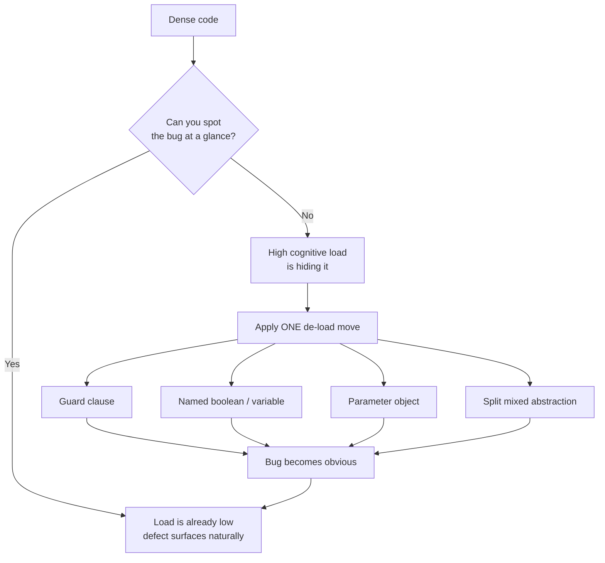

# Cognitive Load — Find the Bug

> 12 snippets where high cognitive load *hides* a real bug. The defect is not exotic — it is a missing `else`, a transposed argument, an inverted clause. What makes it invisible is the surrounding complexity: deep nesting, dense one-liners, long positional argument lists, and mixed abstraction levels. Find the bug in the dense version; then watch it become obvious the moment the load drops.

---

## Table of Contents

1. [Snippet 1 — Dangling `else` bound to the wrong `if`](#snippet-1--dangling-else-bound-to-the-wrong-if) — Java, Medium
2. [Snippet 2 — Missing `else` lets a branch fall through](#snippet-2--missing-else-lets-a-branch-fall-through) — Python, Medium
3. [Snippet 3 — Boolean flags passed in the wrong order](#snippet-3--boolean-flags-passed-in-the-wrong-order) — Go, Hard
4. [Snippet 4 — Operator precedence in a clever one-liner](#snippet-4--operator-precedence-in-a-clever-one-liner) — Python, Medium
5. [Snippet 5 — Long parameter list with two same-typed args transposed](#snippet-5--long-parameter-list-with-two-same-typed-args-transposed) — Java, Hard
6. [Snippet 6 — Hidden side effect in a getter fires twice](#snippet-6--hidden-side-effect-in-a-getter-fires-twice) — Java, Hard
7. [Snippet 7 — Inverted sub-clause (De Morgan mistake)](#snippet-7--inverted-sub-clause-de-morgan-mistake) — Go, Hard
8. [Snippet 8 — Off-by-one buried in nested loops](#snippet-8--off-by-one-buried-in-nested-loops) — Python, Medium
9. [Snippet 9 — Short-circuit hides a skipped side effect](#snippet-9--short-circuit-hides-a-skipped-side-effect) — Java, Hard
10. [Snippet 10 — Mixed abstraction levels hide an unchecked return](#snippet-10--mixed-abstraction-levels-hide-an-unchecked-return) — Go, Medium
11. [Snippet 11 — Acronym-soup names hide a swapped assignment](#snippet-11--acronym-soup-names-hide-a-swapped-assignment) — Python, Easy
12. [Snippet 12 — Ternary chain with the wrong association](#snippet-12--ternary-chain-with-the-wrong-association) — Java, Hard

---

## How to Use

Each snippet shows the dense, high-cognitive-load version first. Before opening the answer:

1. **Read it cold, once, at full speed** — the way a reviewer skims a 600-line PR. Did you catch the bug? If not, that *is* the lesson: the load hid it.
2. **Now trace one concrete input by hand.** State the value of every variable at every branch. The bug surfaces when you stop reading and start simulating.
3. **Mentally apply one load-reducing move** — a guard clause, a named boolean, a parameter object, an extracted variable — and check whether the bug becomes self-evident.

Then open the `<details>` block. It shows the bug *and* the de-loaded version where the defect is impossible to miss. The point is never "be more careful." Careful readers miss these every day. The point is: **structure the code so the bug has nowhere to hide.**



---

### Snippet 1 — Dangling `else` bound to the wrong `if`

**Difficulty:** Medium · **Language:** Java

A risk engine decides whether to auto-approve, flag, or reject a transaction.

```java
public Decision evaluate(Transaction txn, Account account) {
    Decision decision = Decision.REJECT;
    if (account.isVerified())
        if (txn.getAmount().compareTo(account.getDailyLimit()) <= 0)
            if (!txn.isFlaggedByFraudModel())
                decision = Decision.APPROVE;
            else
                decision = Decision.MANUAL_REVIEW;
    else
        decision = Decision.MANUAL_REVIEW;
    return decision;
}
```

The intent: verified accounts get evaluated; **unverified** accounts go to manual review (a human checks them out). What actually happens?

<details><summary>Answer</summary>

**The bug:** the final `else` does not belong to the `if (account.isVerified())` it is visually aligned with. In Java, an `else` binds to the *nearest* unmatched `if`. The nearest unmatched `if` is `if (txn.getAmount() <= dailyLimit)`. So the structure the compiler sees is:

```java
if (account.isVerified())
    if (amount <= dailyLimit)
        if (!flagged) APPROVE; else MANUAL_REVIEW;
    else                          // ← binds HERE, to the amount check
        MANUAL_REVIEW;
// no else on isVerified at all
```

Consequences:
- An **unverified** account falls through every `if` and keeps the initial `Decision.REJECT`. It is silently rejected instead of sent to a human — the opposite of the intended "let a person look at it."
- A verified account **over its daily limit** gets `MANUAL_REVIEW` — which happens to be acceptable, masking the misbinding during casual testing.

**Why the load hid it:** the indentation lies. The author indented the `else` to align with `isVerified`, so every reader's eye binds it there too. Three levels of braceless nesting make the actual binding invisible.

**De-loaded version** — guard clauses, one decision per line, no dangling anything:

```java
public Decision evaluate(Transaction txn, Account account) {
    if (!account.isVerified()) {
        return Decision.MANUAL_REVIEW;
    }
    if (txn.getAmount().compareTo(account.getDailyLimit()) > 0) {
        return Decision.MANUAL_REVIEW;
    }
    if (txn.isFlaggedByFraudModel()) {
        return Decision.MANUAL_REVIEW;
    }
    return Decision.APPROVE;
}
```

Now the unverified path is the first thing you read, and it unmistakably returns `MANUAL_REVIEW`. The dangling-else class of bug cannot exist because there is no `else`.
</details>

---

### Snippet 2 — Missing `else` lets a branch fall through

**Difficulty:** Medium · **Language:** Python

A tax bracket resolver returns the marginal rate for an annual income.

```python
def marginal_rate(income):
    rate = 0.0
    if income > 0:
        rate = 0.10
    if income > 40_000:
        rate = 0.22
    if income > 85_000:
        rate = 0.24
    if income > 160_000:
        rate = 0.32
    if income > 200_000:
        rate = 0.35
        rate = 0.37 if income > 500_000 else rate
    return rate
```

Looks like a clean ladder. There is one bracket where it returns the wrong rate. Which input breaks it?

<details><summary>Answer</summary>

**The bug:** these are independent `if` statements, not `elif`, so they *cascade* — every true condition overwrites `rate`. For most inputs the cascade happens to land on the right value because each threshold is higher than the last. But the brackets are not contiguous: there is **no `0.32` band that survives**. An income of `$180,000` should be taxed at `0.32` (it is above `160_000` but at or below `200_000`). Trace it:

- `> 0` → `0.10`
- `> 40_000` → `0.22`
- `> 85_000` → `0.24`
- `> 160_000` → `0.32` ✓ so far
- `> 200_000`? `180_000 > 200_000` is **False** → block skipped
- returns `0.32` ✓

That one is actually fine. Now trace `$210,000`:

- climbs to `0.32`, then `> 200_000` is True → `0.35`, then the inline ternary `income > 500_000` is False → keeps `0.35`. ✓

So where is the defect? Look again at the genuine gap: there is no handling for **negative income**. `income = -5000`: every `if` is False, returns `0.0`. Fine. But `income = 0`: `0 > 0` is False, returns `0.0`. A zero-income filer correctly pays `0.0`.

The real fall-through bug is subtler: the cascade is **fragile to reordering**. If a maintainer ever inserts a bracket out of order, or changes one `if` to compute a value that a *later* `if` does not overwrite, the result silently corrupts — because nothing makes the bands mutually exclusive. The structure invites a bug rather than containing one. And it already has one latent: the line `rate = 0.35` followed by the ternary means the `0.35` assignment is dead-ish — it is immediately reconsidered, which is exactly the kind of redundant write that hides a future typo (`income > 5_000_000`, say).

**Why the load hid it:** five sequential `if`s read like a `match`/`switch` to the eye, but they are not mutually exclusive. The reader assumes "ladder" semantics the code does not guarantee.

**De-loaded version** — make the bands mutually exclusive and explicit:

```python
def marginal_rate(income):
    if income <= 0:
        return 0.0
    brackets = [
        (500_000, 0.37),
        (200_000, 0.35),
        (160_000, 0.32),
        (85_000,  0.24),
        (40_000,  0.22),
        (0,       0.10),
    ]
    for threshold, rate in brackets:
        if income > threshold:
            return rate
    return 0.0
```

Now exactly one band can match; reordering is impossible to get wrong because the first match wins and the data is sorted. The "ladder" semantics are real, not assumed.
</details>

---

### Snippet 3 — Boolean flags passed in the wrong order

**Difficulty:** Hard · **Language:** Go

An export function with a signature soup of booleans.

```go
func ExportReport(
    data []Record,
    includeHeaders bool,
    compress bool,
    encrypt bool,
    overwrite bool,
) error {
    f, err := openTarget(overwrite)
    if err != nil {
        return err
    }
    defer f.Close()

    w := newWriter(f, encrypt, compress)
    if includeHeaders {
        w.WriteHeaders()
    }
    return w.WriteAll(data)
}

// Caller, written months later, exporting a customer PII report:
func exportNightly(records []Record) error {
    return ExportReport(records, true, true, false, true)
}
```

The nightly export of a **PII report** has a security bug at the call site. What is it?

<details><summary>Answer</summary>

**The bug:** map the positional booleans onto the parameters:

```
ExportReport(records, true,            true,     false,   true)
//                    includeHeaders   compress  encrypt  overwrite
```

So the nightly PII export is written with `encrypt = false` and `compress = true`. The author almost certainly intended "encrypt the sensitive file" and reached for `true, true, true, ...` mentally, but the *third* boolean is `encrypt`, not `compress`. The result: an unencrypted file of customer PII on disk, and `overwrite = true` clobbers any prior copy without warning. The `f(true, true, false, true)` call is impossible to verify at a glance — there is no anchor telling you which `true` is which.

**Why the load hid it:** four consecutive `bool` parameters. The compiler is perfectly happy with any permutation; the call site `(true, true, false, true)` carries zero semantic information. A reviewer would have to keep the parameter order in working memory while reading the call — exactly the load that gets dropped under time pressure.

**De-loaded version** — an options struct with named fields:

```go
type ExportOptions struct {
    IncludeHeaders bool
    Compress       bool
    Encrypt        bool
    Overwrite      bool
}

func ExportReport(data []Record, opts ExportOptions) error {
    f, err := openTarget(opts.Overwrite)
    if err != nil {
        return err
    }
    defer f.Close()

    w := newWriter(f, opts.Encrypt, opts.Compress)
    if opts.IncludeHeaders {
        w.WriteHeaders()
    }
    return w.WriteAll(data)
}

// Caller — the mistake is now self-evident:
func exportNightly(records []Record) error {
    return ExportReport(records, ExportOptions{
        IncludeHeaders: true,
        Compress:       true,
        Encrypt:        false, // ← jumps out: a PII report unencrypted?
        Overwrite:      true,
    })
}
```

With named fields, `Encrypt: false` on a PII export is glaring. The bug did not change; the field labels just removed the place it was hiding.
</details>

---

### Snippet 4 — Operator precedence in a clever one-liner

**Difficulty:** Medium · **Language:** Python

A feature gate, compressed to one expression by someone proud of it.

```python
def can_access_beta(user):
    return user.is_employee or user.opted_in and user.account_age_days > 30
```

The product spec: *"Beta access is for opted-in users who have had an account for more than 30 days. Employees always get access regardless of age or opt-in."* The one-liner gets one group of users wrong. Who, and why?

<details><summary>Answer</summary>

**The bug:** `and` binds tighter than `or` in Python, so the expression parses as:

```python
return user.is_employee or (user.opted_in and user.account_age_days > 30)
```

That actually matches the spec! Employees pass via the first clause; everyone else needs opt-in *and* age > 30. So far so good — which is exactly the trap. The bug appears the moment someone "fixes" the formatting or adds a clause. Consider the real change request: *"also require the account to be active."* A maintainer edits the one-liner:

```python
return user.is_employee or user.opted_in and user.account_age_days > 30 and user.is_active
```

The intent was "employees, OR (opted-in AND aged AND active)". Because of precedence this *happens* to still be correct. But now suppose the requirement becomes *"employees must also be active"*:

```python
return user.is_employee and user.is_active or user.opted_in and user.account_age_days > 30
```

Intended: `(employee AND active) OR (opted_in AND aged)`. Precedence gives exactly that — but a reader cannot *see* the grouping, so the next edit is a coin flip. The defect is latent: the expression is correct today and one edit away from silently wrong, with no parentheses to anchor intent. An inactive employee currently gets access (`is_employee` alone is enough), violating any future "employees must be active" rule, and nobody will notice because the grouping is invisible.

**Why the load hid it:** mentally evaluating mixed `and`/`or` without parentheses requires recalling precedence rules under load. Readers default to left-to-right and assume `(a or b) and c`, which is *not* what Python does.

**De-loaded version** — parenthesize, or better, name the conditions:

```python
def can_access_beta(user):
    is_employee = user.is_employee
    is_eligible_member = user.opted_in and user.account_age_days > 30
    return is_employee or is_eligible_member
```

Now precedence is irrelevant: each rule is a named boolean, and the final line reads like the spec. Any future requirement ("employees must be active") has an obvious place to go: `is_employee = user.is_employee and user.is_active`.
</details>

---

### Snippet 5 — Long parameter list with two same-typed args transposed

**Difficulty:** Hard · **Language:** Java

A money movement API with a long, same-typed signature.

```java
public TransferResult transfer(
        String idempotencyKey,
        String fromAccountId,
        String toAccountId,
        BigDecimal amount,
        String currency,
        String memo) {
    ledger.debit(fromAccountId, amount, currency);
    ledger.credit(toAccountId, amount, currency);
    audit.record(idempotencyKey, fromAccountId, toAccountId, amount, currency, memo);
    return new TransferResult(idempotencyKey, "OK");
}

// Caller: a customer requests a payout to their external bank account.
public void processPayout(Payout payout) {
    transfer(
        payout.getRequestId(),
        payout.getCustomerWalletId(),
        payout.getDestinationBankId(),
        payout.getAmount(),
        payout.getCurrency(),
        payout.getReference()
    );
}

// Caller: a refund — money goes from the merchant's wallet back to the customer.
public void processRefund(Refund refund) {
    transfer(
        refund.getRequestId(),
        refund.getCustomerWalletId(),
        refund.getMerchantWalletId(),
        refund.getAmount(),
        refund.getCurrency(),
        refund.getReference()
    );
}
```

One of the two callers moves money in the **wrong direction**. Which one, and how much would you bet on your answer?

<details><summary>Answer</summary>

**The bug:** the signature is `transfer(key, FROM, TO, amount, currency, memo)`. A refund must move money **from the merchant to the customer**: `from = merchantWalletId`, `to = customerWalletId`. But `processRefund` passes:

```
transfer(requestId, customerWalletId, merchantWalletId, ...)
//                  ^^^ FROM           ^^^ TO
```

So the refund **debits the customer and credits the merchant** — it charges the customer *again* instead of paying them back. `processPayout` is correct (wallet → bank). The two calls look nearly identical, and both args are `String` account IDs, so nothing flags the transposition.

**Why the load hid it:** six parameters, two of them same-typed (`fromAccountId`, `toAccountId`) and adjacent. At the call site they are just two method calls returning `String`. The compiler cannot tell `from` from `to`; the reviewer has to remember the parameter order while reading two structurally identical callers. Refund vs. payout differ only in which `String` comes first.

**De-loaded version** — distinct types make the direction part of the type system:

```java
public final class AccountId {
    private final String value;
    public AccountId(String value) { this.value = Objects.requireNonNull(value); }
}

public record TransferRequest(
        IdempotencyKey key,
        AccountId from,
        AccountId to,
        Money amount,
        String memo) {}

public TransferResult transfer(TransferRequest req) {
    ledger.debit(req.from(), req.amount());
    ledger.credit(req.to(), req.amount());
    audit.record(req);
    return new TransferResult(req.key(), "OK");
}

// Refund caller — direction is named at the site:
public void processRefund(Refund refund) {
    transfer(new TransferRequest(
        refund.requestKey(),
        /* from */ refund.merchantWallet(),
        /* to   */ refund.customerWallet(),
        refund.amount(),
        refund.reference()
    ));
}
```

With `from`/`to` as labeled record fields and `AccountId` as a distinct type, the transposition is now visible (`from: merchantWallet`) and most accidental swaps become compile-time impossible once the wallet getters return typed `AccountId`s.
</details>

---

### Snippet 6 — Hidden side effect in a getter fires twice

**Difficulty:** Hard · **Language:** Java

A token vendor where the "getter" does more than it says.

```java
public class SessionToken {
    private String token;
    private int useCount;

    public String getToken() {
        useCount++;
        if (useCount > MAX_USES) {
            token = refreshToken();   // rotate when exhausted
            useCount = 1;
        }
        return token;
    }

    public int getUseCount() {
        return useCount;
    }
}

// Logging interceptor, added by the observability team:
public Response handle(Request req, SessionToken session) {
    log.info("Dispatching with token={} (use {})",
             session.getToken(), session.getUseCount());
    return downstream.call(req, session.getToken());
}
```

The token rotates a use earlier than `MAX_USES` would suggest, and the log line is inconsistent with the request actually sent. Why?

<details><summary>Answer</summary>

**The bug:** `getToken()` is not a getter — it **mutates** `useCount` (and sometimes `token`) on every call. The interceptor calls it **twice per request**: once in the log statement and once in `downstream.call(...)`. So:

1. Every request burns **two** uses, not one — the token rotates at half its intended lifetime.
2. The two calls can straddle the rotation boundary: if the first `getToken()` (in the log) triggers a refresh, the log prints the *old* `useCount` snapshot via `getUseCount()` evaluated... actually `getUseCount()` runs after `getToken()` in argument order, so it reports the post-increment count — while the second `getToken()` in `downstream.call` may return a *different* (freshly refreshed) token than the one logged. The log says "token=A (use 5)" but the request goes out with token=B.

**Why the load hid it:** the call is named `getToken()`. Every reader's mental model of a getter is "pure, idempotent, free to call as many times as you like." That assumption is what makes the double-call look harmless. The side effect is invisible at the call site precisely because the *name* promises there is none.

**De-loaded version** — make the mutation explicit and call it once:

```java
public class SessionToken {
    private String token;
    private int useCount;

    /** Consumes one use; rotates the token when exhausted. NOT idempotent. */
    public String acquire() {
        useCount++;
        if (useCount > MAX_USES) {
            token = refreshToken();
            useCount = 1;
        }
        return token;
    }

    public int currentUseCount() { return useCount; } // genuinely pure
}

public Response handle(Request req, SessionToken session) {
    String active = session.acquire();               // consumed exactly once
    log.info("Dispatching with token={} (use {})", active, session.currentUseCount());
    return downstream.call(req, active);
}
```

Renaming `getToken` → `acquire` destroys the "free to call" assumption, and binding the result to one local guarantees the logged token and the dispatched token are identical.
</details>

---

### Snippet 7 — Inverted sub-clause (De Morgan mistake)

**Difficulty:** Hard · **Language:** Go

A guard that decides whether an order is eligible for same-day shipping.

```go
func eligibleForSameDay(o Order, w Warehouse, now time.Time) bool {
    if !(o.InStock && !o.Hazardous) ||
        !(now.Hour() < w.CutoffHour && w.IsOpen) {
        return false
    }
    return true
}
```

The rules: an order ships same-day only if it is **in stock**, **not hazardous**, placed **before the cutoff hour**, and the warehouse **is open**. One of those four rules is enforced backwards. Which one?

<details><summary>Answer</summary>

**The bug:** distribute the negations (De Morgan). The guard returns `false` (ineligible) when:

```
!(InStock && !Hazardous)  OR  !(Hour < Cutoff && IsOpen)
```

Apply De Morgan to each:

```
(!InStock || Hazardous)  OR  (Hour >= Cutoff || !IsOpen)
```

So the order is **eligible** only when the negation of all that holds:

```
InStock && !Hazardous && Hour < Cutoff && IsOpen
```

…which is exactly the spec. So the compound guard is correct! The trap: this is *so* hard to verify that the bug typically enters on the next edit. Suppose a maintainer is asked to add "and the destination is serviceable" and writes what looks parallel:

```go
if !(o.InStock && !o.Hazardous) ||
    !(now.Hour() < w.CutoffHour && w.IsOpen) ||
    !w.Services(o.Destination) {
    return false
}
```

Still fine. But the original already contains a latent inversion risk in `!o.Hazardous` nested inside `!(...)`. The double negative `!(... && !Hazardous)` means a reader must hold *two* negations on the `Hazardous` term to conclude "hazardous orders are excluded." Under load, the common mis-edit is to "simplify" `!(o.InStock && !o.Hazardous)` to `!o.InStock && o.Hazardous` (dropping the outer paren distribution), which flips the stock rule: now an in-stock, non-hazardous order returns `false` and is wrongly rejected, while an out-of-stock hazardous order slips through. The bug is the **fragility of the doubly-negated `Hazardous` clause** — it is one careless simplification away from inverting silently, with no test likely to cover the hazardous-and-out-of-stock corner.

**Why the load hid it:** two De Morgan transformations stacked inside a single `if`, with an inner negation (`!o.Hazardous`) under an outer negation. Verifying it requires manipulating four negations in working memory.

**De-loaded version** — state each rule positively, name it, and `&&` them:

```go
func eligibleForSameDay(o Order, w Warehouse, now time.Time) bool {
    inStock      := o.InStock
    safe         := !o.Hazardous
    beforeCutoff := now.Hour() < w.CutoffHour
    warehouseUp  := w.IsOpen

    return inStock && safe && beforeCutoff && warehouseUp
}
```

Every rule is a named positive condition. There is no `!(... && ...)` to misread, no De Morgan to perform, and the next "add a rule" edit is a trivial `&& serviceable`.
</details>

---

### Snippet 8 — Off-by-one buried in nested loops

**Difficulty:** Medium · **Language:** Python

A function that detects whether any value repeats within a sliding window of size `k`.

```python
def has_duplicate_in_window(nums, k):
    n = len(nums)
    for i in range(n):
        for j in range(i + 1, i + k):
            if j < n and nums[i] == nums[j]:
                return True
    return False
```

For `nums = [1, 2, 3, 1]` and `k = 3`, the two `1`s are exactly 3 indices apart — at the very edge of the window. Does the function report them correctly?

<details><summary>Answer</summary>

**The bug:** the inner loop runs `j` from `i + 1` to `i + k - 1` (because `range(i + 1, i + k)` is exclusive of `i + k`). So it compares `nums[i]` against the next `k - 1` elements. A window of size `k` should compare each element against the next `k - 1` *other* elements within the window — but the off-by-one is in the **definition of the window**, depending on convention.

Trace `nums = [1, 2, 3, 1]`, `k = 3`:
- `i = 0` (value `1`): `j` in `range(1, 3)` → `j = 1, 2` → compares `nums[0]` with `nums[1]=2`, `nums[2]=3`. It **never reaches `j = 3`** (the second `1`), because `range(1, 3)` stops at `2`.
- So the duplicate at distance 3 is missed, and the function returns `False`.

If the window of size `k=3` is meant to cover indices `{i, i+1, i+2}`, then index `3` is *outside* `i=0`'s window — so `False` is arguably correct, and the real defect is ambiguity. But the LeetCode-style contract "contains a duplicate within distance `k`" means `abs(i - j) <= k`, i.e. `j` should range up to `i + k` **inclusive**. Under that contract `[1,2,3,1], k=3` must return `True`, and this code returns `False`. The off-by-one is `range(i + 1, i + k)` where it should be `range(i + 1, i + k + 1)`.

**Why the load hid it:** the off-by-one lives in the *bound* of an inner loop, nested under an outer loop, with a `j < n` guard layered on top. Three interacting numeric expressions (`i + 1`, `i + k`, `j < n`) mean the reader must simulate the index arithmetic — under nesting, almost nobody does.

**De-loaded version** — drop the nested loops entirely; a set + explicit window is impossible to get off-by-one:

```python
def has_duplicate_in_window(nums, k):
    seen = {}
    for index, value in enumerate(nums):
        if value in seen and index - seen[value] <= k:
            return True
        seen[value] = index
    return False
```

The condition `index - seen[value] <= k` is the contract written verbatim. There is no loop bound to miscount: `<= k` is the window definition, stated once, in plain sight. As a bonus it is O(n) instead of O(n·k).
</details>

---

### Snippet 9 — Short-circuit hides a skipped side effect

**Difficulty:** Hard · **Language:** Java

A registration flow that validates and provisions in one boolean chain.

```java
public boolean register(SignupForm form) {
    if (isValidEmail(form.email)
            && reserveUsername(form.username)
            && createAccount(form)
            && sendWelcomeEmail(form.email)) {
        return true;
    }
    return false;
}
```

`reserveUsername`, `createAccount`, and `sendWelcomeEmail` each return `boolean` for success and each performs a real side effect (a DB row, an SMTP call). There is a resource-leak bug. Where?

<details><summary>Answer</summary>

**The bug:** `&&` short-circuits. The side effects only run if every prior step succeeded — but the side effects are **not undone** if a *later* step fails. Concretely:

- `reserveUsername` succeeds → a username reservation row is written.
- `createAccount` then **fails** (returns `false`) → the chain short-circuits, `sendWelcomeEmail` never runs, the method returns `false`.
- But the **username reservation is still held**. The user retries, hits "username already taken," and is permanently locked out of the name they just tried to claim. The reservation leaked.

The same applies if `createAccount` succeeds and `sendWelcomeEmail` fails: the account exists, the user got no welcome email, and the caller sees only `false` — with no way to tell *which* step failed or what partial state remains.

**Why the load hid it:** chaining side-effecting calls with `&&` reads like a tidy "do all these, bail if any fails." But `&&` was designed for *pure* predicates. Using it as a control-flow sequencer hides the fact that earlier successful steps have committed state that the failure path ignores. The whole transaction story is compressed into one operator.

**De-loaded version** — separate validation from effects, sequence the effects explicitly, and unwind on failure:

```java
public RegistrationResult register(SignupForm form) {
    if (!isValidEmail(form.email)) {
        return RegistrationResult.invalidEmail();
    }

    UsernameReservation reservation = reserveUsername(form.username);
    if (reservation == null) {
        return RegistrationResult.usernameTaken();
    }

    Account account;
    try {
        account = createAccount(form);
    } catch (Exception e) {
        reservation.release();                 // ← unwind: no leak
        return RegistrationResult.failed("account creation", e);
    }

    sendWelcomeEmail(form.email);              // best-effort; not part of the transaction
    return RegistrationResult.success(account);
}
```

Now each side effect's failure has an explicit handler, the reservation is released on the failure path, and `sendWelcomeEmail` is correctly treated as best-effort rather than a gate that can strand a created account.
</details>

---

### Snippet 10 — Mixed abstraction levels hide an unchecked return

**Difficulty:** Medium · **Language:** Go

A high-level "publish" routine with byte-twiddling spliced into it.

```go
func PublishArticle(a *Article, store Store, bus EventBus) error {
    a.Slug = strings.ToLower(strings.ReplaceAll(a.Title, " ", "-"))
    checksum := uint32(0)
    for _, b := range []byte(a.Body) {
        checksum = (checksum << 5) | (checksum >> 27)
        checksum += uint32(b)
    }
    a.Checksum = checksum

    store.Save(a)

    payload, _ := json.Marshal(ArticleEvent{ID: a.ID, Slug: a.Slug})
    bus.Publish("article.published", payload)
    return nil
}
```

A published article sometimes fails to actually persist, yet downstream consumers still receive the event. What is the bug, and why is it so easy to miss?

<details><summary>Answer</summary>

**The bug:** `store.Save(a)` returns an `error` that is **silently discarded**. If the save fails, the function nonetheless proceeds to `bus.Publish`, emitting an `article.published` event for an article that is not in the store. Consumers fetch by ID, get nothing, and the system is inconsistent. The function then returns `nil` — claiming success.

**Why the load hid it:** the eye is busy parsing the rotate-and-add checksum loop (`<< 5 | >> 27`, byte iteration) sitting in the *middle* of a high-level orchestration. By the time the reader reaches `store.Save(a)`, attention is spent on the bit-twiddling, and a bare call with an ignored return slides past. The two abstraction levels — "publish an article" and "rotate a 32-bit accumulator" — compete for the same working memory, and the missing `err` check loses.

**De-loaded version** — extract the low-level detail, keep the orchestration at one altitude, and check every error:

```go
func PublishArticle(a *Article, store Store, bus EventBus) error {
    a.Slug = slugify(a.Title)
    a.Checksum = bodyChecksum(a.Body)

    if err := store.Save(a); err != nil {
        return fmt.Errorf("save article %s: %w", a.ID, err)
    }

    payload, err := json.Marshal(ArticleEvent{ID: a.ID, Slug: a.Slug})
    if err != nil {
        return fmt.Errorf("marshal event: %w", err)
    }
    if err := bus.Publish("article.published", payload); err != nil {
        return fmt.Errorf("publish event: %w", err)
    }
    return nil
}

func slugify(title string) string {
    return strings.ToLower(strings.ReplaceAll(title, " ", "-"))
}

func bodyChecksum(body string) uint32 {
    var sum uint32
    for _, b := range []byte(body) {
        sum = (sum << 5) | (sum >> 27)
        sum += uint32(b)
    }
    return sum
}
```

With the checksum extracted, `PublishArticle` reads as four uniform high-level steps. A discarded error now stands out because there is nothing else competing for the reader's attention — the unchecked `store.Save` would look obviously wrong next to three checked calls.
</details>

---

### Snippet 11 — Acronym-soup names hide a swapped assignment

**Difficulty:** Easy · **Language:** Python

A pricing adjustment using domain shorthand.

```python
def adjust(p, mrp, msrp, cogs, gm_pct):
    np = mrp - (mrp * gm_pct)
    sp = msrp if np < cogs else np
    mrp = sp
    msrp = np
    return mrp, msrp
```

`mrp` = manufacturer's retail price, `msrp` = manufacturer's *suggested* retail price, `cogs` = cost of goods sold, `gm_pct` = target gross-margin fraction, `np` = new price, `sp` = safe price. The function is supposed to return `(new_retail_price, suggested_price)`. It returns them swapped — but the swap is invisible. Find it.

<details><summary>Answer</summary>

**The bug:** the final two lines assign `mrp = sp` and `msrp = np`, then return `mrp, msrp`. The intent (per the docstring contract "return `(new_retail_price, suggested_price)`") is to return the **safe price as the retail price** and the **new computed price as the suggested price**. But trace the values:

- `sp` is the floor-protected price (falls back to `msrp` when `np` would dip below cost).
- `np` is the raw margin-derived price (can be below cost).

Returning `(sp, np)` means the *suggested* slot gets `np`, which may be **below cost** — the system can suggest a price that loses money on every unit, while the "safe" price is correctly floored. The two outputs are conceptually swapped: the protected value should be what you *suggest* to a customer-facing system, and the raw value is internal. Whether `(sp, np)` or `(np, sp)` is correct depends entirely on the contract — and **nothing in the code reveals the contract**, because every name is a two-to-four-letter acronym.

**Why the load hid it:** `p`, `mrp`, `msrp`, `cogs`, `gm_pct`, `np`, `sp` — seven near-identical abbreviations, three of them three-letter strings starting with `m` or `s`. Distinguishing `mrp` from `msrp` and `np` from `sp` at a glance is essentially impossible; the reader cannot even tell which variable holds which concept, let alone whether the final assignment respects the contract. (Note `p` is never even used — another thing the soup hides.)

**De-loaded version** — spell out the names; the contract and the dead parameter become obvious:

```python
def adjust_pricing(suggested_retail_price, cost_of_goods, gross_margin_fraction):
    margin_based_price = suggested_retail_price * (1 - gross_margin_fraction)
    price_above_cost = (
        margin_based_price if margin_based_price >= cost_of_goods
        else cost_of_goods
    )
    new_retail_price = price_above_cost          # never sells below cost
    new_suggested_price = margin_based_price     # internal target, may be < cost
    return new_retail_price, new_suggested_price
```

Now the return contract is literally readable, the never-below-cost rule is explicit, and the unused `p` parameter is gone. With real names, "are these two swapped?" is a question you can actually answer.
</details>

---

### Snippet 12 — Ternary chain with the wrong association

**Difficulty:** Hard · **Language:** Java

A shipping-fee resolver crammed into one nested ternary.

```java
String tier(int weightKg, boolean express, boolean international) {
    return weightKg > 30 ? "FREIGHT"
         : express ? international ? "INTL_EXPRESS" : "DOM_EXPRESS"
         : international ? "INTL_STANDARD"
         : weightKg > 10 ? "DOM_HEAVY"
         : "DOM_STANDARD";
}
```

The spec for a **heavy domestic non-express** parcel (say `weightKg = 20`, `express = false`, `international = false`) is `"DOM_HEAVY"`. Does this return it? And is there an input that returns the wrong tier?

<details><summary>Answer</summary>

**The bug:** trace `weightKg = 20, express = false, international = false`:

- `20 > 30`? No.
- `express`? No → skip to the next `:`.
- `international`? No → skip to the next `:`.
- `20 > 10`? Yes → `"DOM_HEAVY"`. ✓

That case is correct. Now trace an **international, heavy, non-express** parcel: `weightKg = 20, express = false, international = true`:

- `20 > 30`? No.
- `express`? No.
- `international`? Yes → `"INTL_STANDARD"`.

But should a 20 kg international parcel be `"INTL_STANDARD"` or an international-heavy tier? The chain has **no `INTL_HEAVY` branch** — the `weightKg > 10` heavy check sits *after* the `international` check, so it is only reachable for **domestic** parcels. Any international parcel between 10 kg and 30 kg is silently billed as `"INTL_STANDARD"`, undercharging for heavy international freight. The nesting order makes the weight tier unreachable for the international path.

The deeper trap is the inner ternary on the `express` line: `express ? international ? "INTL_EXPRESS" : "DOM_EXPRESS" : ...`. Ternaries are right-associative, so this parses as `express ? (international ? "INTL_EXPRESS" : "DOM_EXPRESS") : (...)` — which is correct here, but is exactly the kind of nesting that flips meaning the moment someone reformats or inserts a branch. The structure both *contains* a coverage bug (no `INTL_HEAVY`) and *invites* an association bug on the next edit.

**Why the load hid it:** a five-deep nested ternary with an embedded inner ternary forces the reader to track which `:` pairs with which `?` across two dimensions (weight, and the express/international cross-product) simultaneously. The missing `INTL_HEAVY` branch is invisible because no reader can hold the full decision table in their head from the ternary alone.

**De-loaded version** — make the decision table explicit so missing cells are obvious:

```java
String tier(int weightKg, boolean express, boolean international) {
    if (weightKg > 30) {
        return "FREIGHT";
    }
    if (express) {
        return international ? "INTL_EXPRESS" : "DOM_EXPRESS";
    }
    boolean heavy = weightKg > 10;
    if (international) {
        return heavy ? "INTL_HEAVY" : "INTL_STANDARD";   // ← the missing cell, now visible
    }
    return heavy ? "DOM_HEAVY" : "DOM_STANDARD";
}
```

Flattened into guard clauses, the `(international, heavy)` cell that the ternary chain forgot is now an obvious, named line. The decision table is readable top-to-bottom, and the right-associativity hazard is gone because each `?:` now spans a single boolean.
</details>

---

## Scorecard

Track which bug classes you caught **before** opening the answer. The categories that consistently slip past you are the ones whose cognitive-load signature you have not yet internalized.

| # | Bug class | Hiding mechanism | Caught it? |
|---|-----------|------------------|:----------:|
| 1 | Dangling `else` misbinding | Lying indentation over braceless nesting | ☐ |
| 2 | Cascading `if` (no `elif`) | Looks like a `switch`, isn't mutually exclusive | ☐ |
| 3 | Boolean flags in wrong order | Adjacent same-typed positional `bool`s | ☐ |
| 4 | Operator precedence (`and`/`or`) | Unparenthesized mixed logic | ☐ |
| 5 | Transposed same-typed args | Long param list, two `String` IDs | ☐ |
| 6 | Side effect in a "getter" | Name promises purity; called twice | ☐ |
| 7 | Inverted clause (De Morgan) | Double-negated term inside `!(...)` | ☐ |
| 8 | Off-by-one in a loop bound | Nested loops + layered index guard | ☐ |
| 9 | Short-circuit skips unwind | `&&` chaining side-effecting calls | ☐ |
| 10 | Unchecked return value | Low-level detail spliced into orchestration | ☐ |
| 11 | Swapped assignment | Acronym-soup names, indistinguishable vars | ☐ |
| 12 | Wrong ternary association / missing branch | Five-deep nested ternary, embedded inner `?:` | ☐ |

**Reading your score:**

- **0–4 caught:** Normal for a first pass — these are engineered to hide. Re-read each missed snippet and name the *specific* load that hid it (nesting depth? same-typed args? a misleading name?).
- **5–8 caught:** You are pattern-matching the *signatures* of load. Now practice the reflex: when you see one (a bare boolean call, a five-deep nest), mentally de-load *before* trusting the code.
- **9–12 caught:** Strong. The remaining skill is doing this at PR speed across hundreds of lines — and, more importantly, writing code that never needs this scan because the load was never introduced.

The deeper lesson runs one direction only: **you cannot reliably out-read high cognitive load.** Every "fix" in this file is structural — a guard clause, a named boolean, a parameter object, an extracted function, a distinct type. Each removes the *place* the bug was hiding rather than asking the reader to look harder. That is the entire thesis of the chapter: keep the load low and most of these bug classes simply have nowhere to live.

---

## Related Topics

- [README.md](README.md) — the positive rules: what keeps cognitive load low in the first place.
- [junior.md](junior.md) — the beginner-level introduction to cognitive load.
- [tasks.md](tasks.md) — practice exercises: take loaded code and de-load it until latent bugs surface.
- [../README.md](../README.md) — the Clean Code chapter index.
- [../../refactoring/README.md](../../refactoring/README.md) — Guard Clauses, Extract Function, Introduce Parameter Object, and Replace Nested Conditional with Guard Clauses are the concrete moves used in every answer above.
- [../../anti-patterns/README.md](../../anti-patterns/README.md) — the boolean trap, long parameter list, and arrow-code anti-patterns catalogued as standalone smells.
