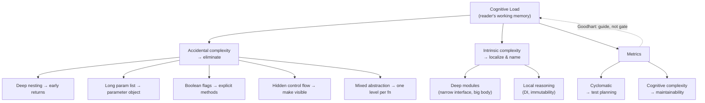

# Cognitive Load — Interview Questions

> 55+ questions across all tiers (junior → staff). Each answer is crisp; harder questions also state **what the interviewer is really checking**. Use as self-review or interview prep.

---

## Table of Contents

- [Junior (15)](#junior-15)
- [Mid (15)](#mid-15)
- [Senior (15)](#senior-15)
- [Staff (10)](#staff-10)
- [Rapid-Fire](#rapid-fire)
- [Summary](#summary)
- [Further Reading](#further-reading)
- [Related Topics](#related-topics)

---

## Junior (15)

### J1. What is cognitive load in code?

<details><summary>Answer</summary>

The amount of working memory a reader must hold to understand a piece of code. Every variable in scope, every branch they must mentally simulate, every indirection they must follow competes for the same small budget. Low-cognitive-load code lets you understand a function by reading it top-to-bottom without paging anything in.
</details>

### J2. Why does cognitive load matter if the code already works?

<details><summary>Answer</summary>

Code is read far more often than written — typically 10× or more. Working code with high cognitive load is a liability: every future change costs more, every reader is more likely to introduce a bug, and onboarding slows. Correctness today says nothing about maintainability tomorrow.
</details>

### J3. What is the 7±2 rule, and how does ~4 chunks relate to it?

<details><summary>Answer</summary>

Miller's 1956 finding: humans hold roughly 7±2 items in short-term memory. Later research (Cowan, 2001) tightened the practical limit for active reasoning to about **4 chunks**. The takeaway for code: a function that forces a reader to track more than ~4 moving parts at once overflows that budget. Keep live variables, nested conditions, and concurrent concerns small.
</details>

### J4. What is a "chunk"?

<details><summary>Answer</summary>

A unit of meaning the brain treats as one thing. `userId` is one chunk; a well-named call like `validateAndSave(order)` is one chunk even though it does a lot. Chunking is *why* abstraction reduces load: a good name lets the reader collapse many lines into a single concept.
</details>

### J5. How do early returns reduce cognitive load?

<details><summary>Answer</summary>

They flatten nesting. Instead of wrapping the happy path inside layers of `if`, you handle each failure case up front and `return`, so the main logic stays at the leftmost indentation. The reader discards each guarded condition the moment it passes, freeing working memory.

```python
# Nested — reader holds 3 conditions at once
def charge(user):
    if user is not None:
        if user.active:
            if user.has_card:
                return do_charge(user)

# Early returns — each condition discarded once passed
def charge(user):
    if user is None:      return error("no user")
    if not user.active:   return error("inactive")
    if not user.has_card: return error("no card")
    return do_charge(user)
```
</details>

### J6. What's wrong with deep nesting?

<details><summary>Answer</summary>

Each level of nesting adds a condition the reader must keep "active" to know how they got to the inner code. Five levels of `if`/`for` mean five simultaneous conditions in working memory just to read line one of the body. It also makes the happy path hard to find — it's buried at the deepest indent.
</details>

### J7. When is a parameter list too long?

<details><summary>Answer</summary>

Classic threshold: more than 3–4 positional parameters. The deeper signal is whether the reader can keep them straight at the call site. `move(x, y, dx, dy, dt, true, false)` is unreadable not because of the count alone but because the reader can't decode each slot without checking the signature.
</details>

### J8. What is a parameter object, and how does it lower load?

<details><summary>Answer</summary>

A small type that groups parameters that travel together. Instead of `drawRect(x, y, w, h, color, filled)`, you pass `drawRect(rect, style)`. It reduces the number of chunks at the call site and gives the cluster a name, so the reader thinks "a rect and a style" rather than six loose values.
</details>

### J9. What's the problem with a boolean (flag) parameter?

<details><summary>Answer</summary>

At the call site, `f(true)` carries no meaning — the reader must open the signature to learn what `true` selects. A flag that *switches behavior* usually means the function does two things. Cure: split into two named functions (`save()` / `saveDraft()`), or pass a named enum/options object so the call reads `save(Mode.DRAFT)`.
</details>

### J10. Why are "clever" one-liners often a cognitive-load problem?

<details><summary>Answer</summary>

A dense one-liner trades vertical space for mental decoding. Three clear lines can be skimmed; one line packing a ternary inside a comprehension inside a lambda must be parsed token-by-token. The reader's time, not the line count, is the scarce resource. Clever code optimizes for the writer's ego, not the reader's comprehension.
</details>

### J11. What is hidden control flow? Give an example.

<details><summary>Answer</summary>

Control flow that isn't visible where it happens. Examples: a getter that mutates state or fires a network call; an exception thrown for an ordinary, expected case; an operator overload that does I/O. The reader sees `user.name` and assumes it's a field read — they can't see that it lazily loads from the database and may throw.
</details>

### J12. What does "mixed abstraction levels" mean?

<details><summary>Answer</summary>

A function that combines high-level orchestration with low-level detail. `processOrder()` that calls `validate()` and `charge()` (high level) but also does raw bit-shifting on a flags integer (low level) forces the reader to zoom between altitudes mid-function. Keep one function at one level of abstraction.
</details>

### J13. Is a shorter function always lower cognitive load?

<details><summary>Answer</summary>

No — and this is a common trap. Splitting one readable 30-line function into eight 4-line functions can *raise* load: the reader now jumps across eight definitions and must reassemble the story. Shortness helps only when each piece is a meaningful, well-named chunk. Fragmentation without abstraction just moves the load around.

**What the interviewer is really checking:** that you don't worship metrics. The goal is comprehension, not a low line count.
</details>

### J14. What are intrinsic and accidental complexity?

<details><summary>Answer</summary>

**Intrinsic** complexity is inherent to the problem — pricing rules, tax law, concurrency requirements. You can't delete it, only relocate it. **Accidental** complexity is added by our choices — clumsy abstractions, tangled control flow, bad names. Cognitive-load work targets accidental complexity; intrinsic complexity must be *organized*, not removed.
</details>

### J15. What's the simplest first move to cut load in a messy function?

<details><summary>Answer</summary>

Replace nesting with guard clauses (early returns), then name the magic values and extract the obviously-coherent fragments. These three moves usually drop perceived complexity sharply before you touch the actual algorithm.
</details>

---

## Mid (15)

### M1. Define cyclomatic complexity precisely.

<details><summary>Answer</summary>

McCabe's metric (1976): the number of linearly independent paths through a function. Practically, count 1 + the number of decision points (`if`, `for`, `while`, `case`, `&&`, `||`, `?:`, `catch`). It equals the minimum number of test cases needed for full branch coverage. It is structural and language-agnostic.
</details>

### M2. Define cognitive complexity, and how it differs from cyclomatic.

<details><summary>Answer</summary>

Cognitive complexity (SonarSource, 2017) measures how hard code is *for a human to read*. Key differences:

- **Nesting is penalized.** A condition nested 3 deep costs more than one at top level; cyclomatic treats them equally.
- **Linear sequences are cheap.** A `switch` with 10 cases is one decision to a human; cyclomatic charges 10.
- **Shorthand isn't free.** Each break in linear flow (`break`, `continue`, `goto`, recursion) adds cost.

Cyclomatic answers "how many tests do I need?"; cognitive answers "how hard is this to understand?"
</details>

### M3. Which metric should gate maintainability, and which should drive testing?

<details><summary>Answer</summary>

Use **cognitive complexity** as a maintainability signal — it tracks reader effort. Use **cyclomatic complexity** for test-coverage planning — it tells you the number of independent paths to exercise. They answer different questions; conflating them is a classic mistake.
</details>

### M4. Give a case where cyclomatic is high but cognitive is low.

<details><summary>Answer</summary>

A flat `switch` mapping HTTP status codes to messages: 15 cases, cyclomatic ~16, but trivially readable — there's no nesting and the pattern repeats. Cognitive complexity stays low. Gating purely on cyclomatic would flag this harmless dispatch table.
</details>

### M5. Give a case where cyclomatic is low but cognitive is high.

<details><summary>Answer</summary>

A function with cyclomatic 4 but three of those branches nested four levels deep inside a loop, sharing mutable state. Few independent paths, but a reader must hold the loop variable, the accumulator, and three conditions at once. Cognitive complexity is high; cyclomatic understates the pain.
</details>

### M6. Local vs global reasoning — what's the distinction and why does it matter?

<details><summary>Answer</summary>

**Local reasoning** means you can understand a function by reading only that function. **Global reasoning** means correctness depends on facts scattered across the codebase — a flag set three modules away, an init-order assumption, a shared mutable singleton. Local reasoning is far cheaper because it fits in working memory. Most cognitive-load techniques (pure functions, immutability, dependency injection over globals) exist to preserve local reasoning.
</details>

### M7. How does immutability lower cognitive load?

<details><summary>Answer</summary>

If a value never changes after construction, the reader never has to track "what is it *now*?" They read its definition once and trust it everywhere. Mutable state forces the reader to mentally replay every mutation between definition and use — that replay is the load.
</details>

### M8. The boolean-parameter trap — how do you cure it cleanly?

<details><summary>Answer</summary>

Two cures depending on intent:
- If the boolean **switches behavior** → split into explicit methods (`enable()` / `disable()`).
- If it's **configuration** → move it into a named options object or enum so the call site reads `connect(Retry.YES)` not `connect(true)`.

Avoid the temptation to "just add another boolean" — `f(true, false, true)` is the end state of that road.
</details>

### M9. How do exceptions become hidden control flow, and when is that acceptable?

<details><summary>Answer</summary>

Using exceptions for *expected* outcomes (e.g., "item not found" in a cache lookup) hides a branch: the reader of the calling code sees a straight-line call but execution may jump away. Acceptable when the case is genuinely *exceptional* (truly rare, unrecoverable locally). For expected alternatives, return a result type / Optional / error value so the branch is visible in the signature.
</details>

### M10. Does refactoring to many small functions always help readability?

<details><summary>Answer</summary>

No. Over-extraction creates "ravioli code" — dozens of tiny functions where following the logic means a scavenger hunt across files. Extract when a fragment is a *coherent, nameable concept* and the name adds information. If the extracted name just restates the body (`incrementCounterByOne`), you've added a jump without adding a chunk.

**What the interviewer is really checking:** judgment about *when* abstraction pays off, not dogmatic application of "small is good."
</details>

### M11. How does naming affect cognitive load specifically?

<details><summary>Answer</summary>

A good name is a pre-computed chunk: it lets the reader skip the body. A bad name (`data`, `tmp`, `mgr`, acronym soup like `prcOrdSvcImpl`) forces them to read the implementation to recover intent — the abstraction leaks. Names are the cheapest, highest-leverage lever on cognitive load.
</details>

### M12. What is a "deep module" and how does it reduce load?

<details><summary>Answer</summary>

Ousterhout's term (*A Philosophy of Software Design*): a module with a **simple interface hiding substantial functionality**. The cost a caller pays is the interface they must learn; the value is the work hidden behind it. Deep modules give high value per unit of interface, so callers carry little load. Shallow modules (thin wrappers, getters/setters over everything) expose almost as much surface as they hide — pure overhead.
</details>

### M13. Deep vs shallow module — give a concrete contrast.

<details><summary>Answer</summary>

Deep: `garbageCollector.run()` — one call, hides a vast algorithm. Shallow: a `PrivateAddress` class with six getters/setters and no behavior — the interface is as wide as the data it holds, so it adds indirection without hiding complexity. Prefer interfaces much smaller than the implementation behind them.
</details>

### M14. How does a long function (no chunking) overload the reader?

<details><summary>Answer</summary>

A function spanning multiple screens has multiple unrelated phases the reader must segment mentally and hold in parallel. If you can write a one-line comment for each phase, each phase wants to be a named function — converting an exhausting linear scan into a handful of chunks. The screen-height heuristic is a proxy for "too many phases to chunk."
</details>

### M15. What is Goodhart's Law and why does it matter for complexity metrics?

<details><summary>Answer</summary>

"When a measure becomes a target, it ceases to be a good measure." If you hard-gate CI on a complexity number, engineers will game it — splitting functions arbitrarily, hiding branches in helpers, suppressing warnings — to pass the gate without improving readability. The metric goes green while the code gets worse. Metrics are a *guide*, not a *gate*.
</details>

---

## Senior (15)

### S1. Should you gate CI on a cognitive/cyclomatic complexity threshold?

<details><summary>Answer</summary>

Generally no as a *hard* gate; yes as a *guide*. Hard gates trigger Goodhart's Law (gaming) and block legitimate code (a readable 16-case dispatch). Better pattern: warn on new violations, use SonarQube-style **baseline mode** so legacy code doesn't flood the build, and make the metric a discussion prompt in code review rather than a build-breaker. Reserve hard limits for egregious thresholds nobody legitimately needs to cross.

**What the interviewer is really checking:** that you understand metrics as social tools with second-order effects, not just numbers.
</details>

### S2. Is high cyclomatic complexity always bad?

<details><summary>Answer</summary>

No. A pure dispatch table or parser with many flat cases has high cyclomatic complexity but low cognitive load and is perfectly maintainable. High cyclomatic complexity is a *prompt to look*, not a verdict. What matters is whether the paths are independent-and-nested (bad) or independent-and-flat (often fine). It also legitimately means "write more tests."
</details>

### S3. How do you measure cognitive load if metrics are imperfect?

<details><summary>Answer</summary>

Triangulate. Use cognitive-complexity tooling as a screen, then add human signals: time-to-first-meaningful-change for new joiners, code-review comments asking "what does this do?", defect density per file (hotspots = large × frequently-changed), and the "explain it back" test — can a peer restate the function after one read? No single number captures load; the metric narrows where to look.
</details>

### S4. Walk through reducing cognitive load in a 200-line function.

<details><summary>Answer</summary>

1. **Characterization tests first** so refactoring is safe.
2. **Guard clauses** to flatten nesting and surface the happy path.
3. **Name magic values** (numbers, strings) — each becomes a chunk.
4. **Extract coherent phases** into well-named functions (only where the name adds meaning).
5. **Separate abstraction levels** — push low-level detail down a layer.
6. **Remove hidden control flow** — make exceptional vs expected explicit.

Each step is individually testable; never do all at once.
</details>

### S5. How does dependency injection relate to cognitive load?

<details><summary>Answer</summary>

DI turns global reasoning into local reasoning. A function reaching for a global singleton requires the reader to know that singleton's state and lifecycle (global). A function receiving its dependency as a parameter declares everything it needs in its signature (local). The cost: a wider signature. The benefit: the reader and the test both see the full dependency set.
</details>

### S6. Trade-off: a parameter object reduces call-site load but adds a type. When is it not worth it?

<details><summary>Answer</summary>

When the parameters don't form a *cohesive concept* — bundling unrelated args into a `Context` bag just to shorten the signature creates a shallow grab-bag that hides what's actually used. The reader now must inspect the object to know which fields matter. Parameter objects pay off when the cluster has a real name (a `Rect`, a `DateRange`), not when they're a junk drawer.
</details>

### S7. How do you balance DRY against cognitive load?

<details><summary>Answer</summary>

Aggressive de-duplication can raise load: a single abstraction forced to serve three slightly different callers grows parameters and branches until it's harder to read than three honest copies. The rule: duplication is cheaper than the *wrong* abstraction. Extract shared code only when the duplicated logic is the *same concept*, not merely the same characters.
</details>

### S8. How does async / concurrency interact with cognitive load?

<details><summary>Answer</summary>

It multiplies it. Concurrent code forces the reader to consider interleavings, not just one execution path — a combinatorial explosion of states. Cures that reduce load: confine mutable state, prefer message-passing over shared memory, use higher-level constructs (structured concurrency, async/await over raw callbacks) that keep the control flow linear-looking. Callback pyramids are deep nesting in disguise.
</details>

### S9. What makes a good code-review comment about cognitive load?

<details><summary>Answer</summary>

Specific and reader-centric: "I had to scroll back twice to track what `flag` controls — can we split this into two methods?" rather than "cyclomatic complexity is 14." Anchor the comment to *your actual experience reading it*, since that's the real signal the metric only approximates.
</details>

### S10. How do deep modules and microservices interact?

<details><summary>Answer</summary>

A service boundary should be a deep module: a narrow, stable API hiding substantial internal complexity. Shallow services (thin pass-throughs, one-endpoint CRUD wrappers that just forward to a DB) add network hops and operational load without hiding complexity — they *raise* whole-system cognitive load. The same depth principle scales from functions to services.
</details>

### S11. A teammate insists every function must be under 10 lines. Respond.

<details><summary>Answer</summary>

Push back with the chunking argument: line count is a proxy, not the goal. A 25-line function that reads as one coherent operation is lower load than the same logic shredded into seven cross-referencing 4-liners. Agree on the *intent* (small, focused, nameable units) and reject the *literal rule*. Offer cognitive complexity as a better-aligned signal than raw line count.
</details>

### S12. How do you reduce load from intrinsic complexity you can't remove?

<details><summary>Answer</summary>

You can't delete it, so *localize and name* it. Concentrate the gnarly tax/pricing/state logic in one well-tested, well-documented module with a clean interface (a deep module). Keep the rest of the system reasoning against the simple interface. The complexity still exists, but most readers never have to load it.
</details>

### S13. What's the cognitive-load case against premature abstraction?

<details><summary>Answer</summary>

A speculative abstraction (a plugin system for a single implementation, a generic factory for one type) forces every reader to learn the abstraction machinery to follow a simple flow. Indirection has a fixed comprehension cost paid by everyone, while the flexibility benefit is hypothetical. Add the abstraction when the second real case arrives.
</details>

### S14. How does error-handling style affect load?

<details><summary>Answer</summary>

Errors-as-values (Go's explicit `if err != nil`, Result types) keep the failure path visible and local — verbose but readable linearly. Exceptions remove the visible branch (lower noise) but introduce hidden control flow (the jump isn't local). The right choice depends on whether the failure is expected (make it visible) or truly exceptional (let it propagate). The load question is: *can the reader see where control can leave?*
</details>

### S15. How do you decide between Extract Method and Replace Method with Method Object?

<details><summary>Answer</summary>

Extract Method when fragments are simple and share little state. When many interrelated local variables would have to be threaded through every extracted call, Replace Method with Method Object: promote the whole method to a class so the locals become fields. This cuts parameter-passing load at the cost of one new type — worth it when the temp-variable web is the source of the complexity.
</details>

---

## Staff (10)

### St1. How do you set an org-wide policy on complexity metrics without triggering Goodhart's Law?

<details><summary>Answer</summary>

Make metrics *informational by default, blocking only at extremes*. Concretely: baseline existing violations so legacy code doesn't block work; surface cognitive complexity as review annotations (not build failures) for normal ranges; reserve a hard fail for an extreme threshold that signals genuine emergencies. Pair the number with a culture norm — "this is a prompt to discuss, not a rule to satisfy." Track a *leading* human metric (review friction, onboarding time) alongside the *lagging* tool metric so you notice when people game the number.
</details>

### St2. How does cognitive load shape an org's architecture and team boundaries?

<details><summary>Answer</summary>

Conway's Law and Team Topologies frame it: a team can only hold so much system in its collective head. Service and module boundaries should align with what one team can reason about locally. Deep modules with narrow interfaces minimize the cross-team coordination cost (everyone learns small interfaces, not internals). When a single team owns a system too large to reason about, defects and lead time rise — that's organizational cognitive overload.
</details>

### St3. How do you quantify the business cost of high cognitive load?

<details><summary>Answer</summary>

Proxy it through lead time for changes and change-failure rate (DORA metrics), defect density in hotspots (size × churn), and onboarding ramp time. High-load code shows up as long PR cycle times, repeated "I don't understand this" review threads, and a few files dominating bug reports. You won't get a clean dollar figure, but the trend across these is defensible enough to justify refactoring investment to leadership.
</details>

### St4. Cognitive complexity is green across the codebase but velocity is dropping. Diagnose.

<details><summary>Answer</summary>

The metric is being satisfied without comprehension improving — classic Goodhart. Likely causes: load has migrated to *between* functions (excessive fragmentation, deep call chains), to global state and hidden coupling the per-function metric can't see, or to the architecture (too many shallow services). Per-function metrics miss whole-system load. Investigate call-graph depth, coupling, and cross-module reasoning, not the per-unit number.
</details>

### St5. How do you teach cognitive-load thinking across a large engineering org?

<details><summary>Answer</summary>

Make it concrete and reviewable, not abstract. Provide a shared vocabulary (deep/shallow module, local/global reasoning, hidden control flow), wire cognitive complexity into the review tool as a *conversation starter*, run "readability" review rounds where the only question is "could a new joiner follow this?", and capture exemplars (before/after) in internal docs. The goal is a shared instinct, not a checklist.
</details>

### St6. When does adding a layer (more indirection) actually reduce total cognitive load?

<details><summary>Answer</summary>

When the layer is a *deep module* that lets most readers stop reasoning at its interface. An anti-corruption layer, for example, adds one boundary but spares every downstream reader from the legacy model's quirks. The test: does the layer let more readers reason locally (net win) or does it just add a hop everyone must trace through (net loss)? Depth, not the mere existence of the layer, decides.
</details>

### St7. How do you weigh consistency against locally-optimal readability in a large codebase?

<details><summary>Answer</summary>

Consistency itself reduces cognitive load — a reader who knows the house style predicts structure and spends budget on logic, not on decoding novel idioms. So a slightly less locally-optimal pattern that matches the rest of the codebase is often the lower-load choice org-wide. Reserve deviation for cases where the standard pattern is genuinely much worse here, and document why.
</details>

### St8. Legacy service: cyclomatic 50+ functions everywhere. What's your rollout plan?

<details><summary>Answer</summary>

Don't mass-refactor. Baseline current violations (fail only on new/changed lines), rank files by hotspot score (complexity × churn), and refactor opportunistically as you touch those files (boy-scout rule) with characterization tests first. Use a Strangler/Branch-by-Abstraction approach for the worst modules. The metric becomes a ratchet that prevents regression while the team improves the high-traffic code incrementally.
</details>

### St9. How does cognitive load inform build-vs-buy and dependency decisions?

<details><summary>Answer</summary>

Every dependency is intrinsic complexity you import plus an interface your team must learn and operate. A deep, well-documented dependency with a narrow API can *reduce* net load (you delegate hard work behind a simple surface). A shallow or leaky dependency *raises* it (you must understand its internals to use it safely). Evaluate dependencies the same way you evaluate internal modules: depth and interface clarity, not just feature lists.
</details>

### St10. What's the ultimate goal — minimize load, or something else?

<details><summary>Answer</summary>

Not raw minimization — *appropriate placement*. Intrinsic complexity must live somewhere; the staff-level skill is concentrating it where few readers pay for it (deep modules, well-bounded contexts) and ruthlessly eliminating accidental complexity everywhere else. The objective is that the *common* reading path is cheap, even if a few specialist modules are dense by necessity. Optimize the distribution of load, not a single global number.
</details>

---

## Rapid-Fire

| Question | Answer |
|---|---|
| Cyclomatic counts what? | Independent paths (decision points + 1) |
| Cognitive complexity penalizes what cyclomatic ignores? | Nesting depth |
| Practical working-memory limit? | ~4 chunks (7±2 classic) |
| Cure for deep nesting? | Guard clauses / early returns |
| Cure for boolean flag param? | Explicit methods or named enum/options |
| Hidden control flow example? | Exception for an expected case; side-effecting getter |
| Local vs global reasoning — which is cheaper? | Local |
| Deep module = ? | Narrow interface, large hidden implementation |
| Intrinsic vs accidental — which can you delete? | Accidental |
| Is shorter always lower load? | No — fragmentation can raise it |
| Is high cyclomatic always bad? | No — flat dispatch tables are fine |
| Goodhart's Law in one line? | A measure made a target stops measuring well |
| Metric role in CI? | Guide, not hard gate |
| DRY vs load? | Wrong abstraction costs more than duplication |
| Naming's role? | A good name is a pre-computed chunk |

---

## Summary



Cognitive load is the true cost of code: how much a reader must hold in their head. **Cyclomatic complexity** counts independent paths (good for test planning); **cognitive complexity** weights nesting and flow breaks (good for maintainability). Reduce *accidental* complexity with early returns, parameter objects, explicit methods, visible control flow, and single-level functions. Organize *intrinsic* complexity into **deep modules** that preserve **local reasoning**. Respect the ~4-chunk working-memory limit. And treat all metrics as guides, not gates — under Goodhart's Law, a hard-gated metric gets gamed while the code quietly gets worse.

---

## Further Reading

- John Ousterhout, *A Philosophy of Software Design* — deep vs shallow modules, complexity.
- G. Ann Campbell, *Cognitive Complexity* (SonarSource white paper, 2017).
- Thomas McCabe, *A Complexity Measure* (1976) — cyclomatic complexity.
- George Miller, *The Magical Number Seven, Plus or Minus Two* (1956).
- Nelson Cowan, *The Magical Number 4 in Short-Term Memory* (2001).
- Fred Brooks, *No Silver Bullet* — intrinsic vs accidental complexity.

---

## Related Topics

- [Cognitive Load — README](README.md) · [Junior](junior.md) · [Professional](professional.md)
- [Clean Code — chapter index](../README.md)
- [Functions](../02-functions/README.md) — single-level functions, small parameter lists.
- [Refactoring](../../refactoring/README.md) — guard clauses, extract method, parameter object.
- [Design Patterns](../../design-patterns/README.md) — when abstraction earns its indirection cost.
