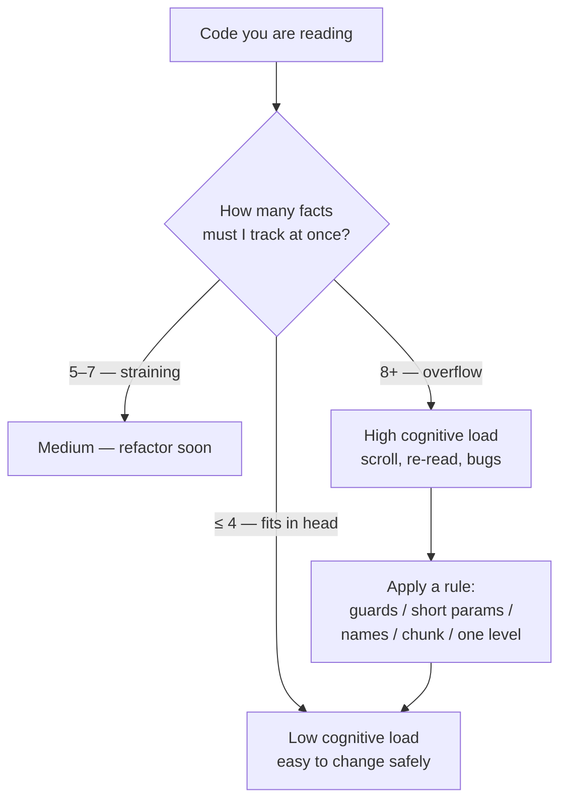
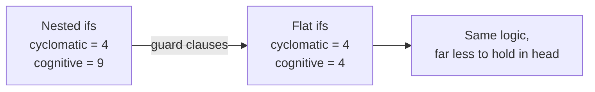

# Cognitive Load — Junior Level

> **Level:** Junior — "What's the rule? Show me a clean example."
> You will learn what cognitive load *is*, why it is the real cost of bad code, and a handful of concrete moves to lower it: guard clauses, short parameter lists, clear names, explicit control flow, and chunking long functions into named steps.

---

## Table of Contents

1. [What is cognitive load?](#what-is-cognitive-load)
2. [Real-world analogy](#real-world-analogy)
3. [The 7±2 rule (working-memory limit)](#the-72-rule-working-memory-limit)
4. [Rule 1 — Flatten nesting with guard clauses](#rule-1--flatten-nesting-with-guard-clauses)
5. [Rule 2 — Keep parameter lists short](#rule-2--keep-parameter-lists-short)
6. [Rule 3 — Clear names beat clever one-liners](#rule-3--clear-names-beat-clever-one-liners)
7. [Rule 4 — Make control flow explicit (no hidden side effects)](#rule-4--make-control-flow-explicit-no-hidden-side-effects)
8. [Rule 5 — Chunk a long function into named steps](#rule-5--chunk-a-long-function-into-named-steps)
9. [Rule 6 — One abstraction level per function](#rule-6--one-abstraction-level-per-function)
10. [Measuring "clean": complexity numbers](#measuring-clean-complexity-numbers)
11. [Common Mistakes](#common-mistakes)
12. [Test Yourself](#test-yourself)
13. [Cheat Sheet](#cheat-sheet)
14. [Summary](#summary)
15. [Further Reading](#further-reading)
16. [Related Topics](#related-topics)

---

## What is cognitive load?

**Cognitive load** is the amount of information you must hold in your head *at the same time* to understand a piece of code. It is the true cost of reading code — more than line count, more than file size.

When you trace a function, your brain is juggling things: the value of a variable, which branch you are inside, what the last `if` already ruled out, whether that helper has a side effect, what those three boolean arguments mean. Each item costs a "slot." Run out of slots and you lose track — you scroll back, re-read, take notes, or just give up and hope it works.

> **Key idea:** Code is read far more often than it is written. Every minute you spend lowering the reader's cognitive load is repaid every time someone (including future-you) opens the file. Cleanliness is not decoration — it is the difference between code you can change safely and code you are afraid to touch.

Cognitive load comes in two flavors that matter to you:

| Kind | What it is | Example |
|---|---|---|
| **Intrinsic** | Difficulty inherent to the problem | Tax law genuinely has many rules |
| **Extraneous** | Difficulty *you* added by how you wrote it | 5 levels of nesting, cryptic names, hidden side effects |

You cannot remove intrinsic load — the domain is as hard as it is. **Your whole job is to drive extraneous load toward zero.** Every rule in this file is one move that removes extraneous load.

---

## Real-world analogy

### The cluttered kitchen counter

Imagine cooking on a counter where every ingredient, pan, and utensil is out at once. To make one dish you must scan a sea of clutter, remember which bowl holds the salt versus the sugar, and step around the blender you are not using. You *can* cook — but you are slow, and you make mistakes.

Now imagine the same kitchen with one cutting board, the three ingredients for the current step, and everything else put away in labeled drawers. You glance, you grab, you cook. The dish is no easier (the recipe is the same — that's intrinsic load), but everything *around* the recipe got out of your way (the extraneous load is gone).

Clean code is the second kitchen. At each moment, only what you need to understand the current line is in front of you. The rest is named, grouped, and tucked away until you ask for it.

### The phone number you can't remember

Try to hold this in your head for ten seconds: `8 3 1 7 2 9 4 0 6 5 2`. Hard, right? Now try it chunked: `831 729 4065 2`. Suddenly it's four things, not eleven. You didn't get smarter — you regrouped eleven items into four. That regrouping is exactly what extracting named functions does to a long block of code: it turns "eleven loose statements" into "four named steps."

---

## The 7±2 rule (working-memory limit)

In 1956, psychologist George Miller observed that human working memory holds roughly **seven items, give or take two** — the famous "7±2." Later research suggests the practical number is even smaller, closer to 4. Either way, the headline is the same:

> **You can only juggle a handful of things at once. Code that forces you to track more than that overflows your mind.**

This single fact is *why* every rule below works. Watch how each move reduces the number of things in flight:

- A function with **3 parameters** uses ~3 slots; one with **9** overflows.
- A block nested **5 ifs deep** asks you to remember 5 conditions at once; flattening to guard clauses asks you to remember **zero** (each rejected case is gone).
- A 200-line function makes you track dozens of locals; **four named helpers** make you track one name per step.

A useful working budget for a junior: aim for **a function you can fully understand without scrolling and without holding more than ~4 facts in your head.** If you can't, that's the signal to apply one of the rules.



---

## Rule 1 — Flatten nesting with guard clauses

**The rule:** handle invalid or edge cases *first* and return early. Don't wrap the real logic in a pyramid of `if` blocks.

Each level of nesting is a condition you must keep in your head while reading the inside. Five levels deep means five conditions are simultaneously "true" in your mind. A **guard clause** — an early `return` for a case you can reject immediately — removes that case from your mind entirely. You never have to think about it again on the lines below.

### Go — before (deep nesting)

```go
func GetDiscount(user *User) float64 {
    if user != nil {
        if user.IsActive {
            if user.Membership != nil {
                if user.Membership.Tier == "GOLD" {
                    return 0.20
                } else {
                    return 0.05
                }
            }
        }
    }
    return 0.0
}
```

To understand the `0.20` line you must hold four facts at once: user not nil, active, has membership, tier is GOLD. The arrow-shaped indentation ("the arrow anti-pattern") is the visual symptom.

### Go — after (guard clauses)

```go
func GetDiscount(user *User) float64 {
    if user == nil || !user.IsActive {
        return 0.0
    }
    if user.Membership == nil {
        return 0.0
    }
    if user.Membership.Tier == "GOLD" {
        return 0.20
    }
    return 0.05
}
```

Now each line is read with a clean mind: by the time you reach the GOLD check, all the "bad" cases are *gone* — you no longer track them. The happy path is flat and at the bottom where you expect it.

### Java — after (guard clauses)

```java
double getDiscount(User user) {
    if (user == null || !user.isActive()) return 0.0;
    if (user.getMembership() == null)     return 0.0;
    if (user.getMembership().getTier() == Tier.GOLD) return 0.20;
    return 0.05;
}
```

### Python — after (guard clauses)

```python
def get_discount(user):
    if user is None or not user.is_active:
        return 0.0
    if user.membership is None:
        return 0.0
    if user.membership.tier == "GOLD":
        return 0.20
    return 0.05
```

> **Rule of thumb:** if you are more than **2–3 levels deep**, look for a case you can reject early with a guard clause. Invert the condition (`if not valid: return`) instead of nesting the whole rest of the function inside `if valid:`.

---

## Rule 2 — Keep parameter lists short

**The rule:** a function should take a small number of parameters — ideally 0–3. When several values always travel together, group them into a struct/object.

Every parameter is a slot in the reader's head *and* a chance for the caller to make a mistake. A nine-argument call is unreadable at the call site (which `true` was "compress"?) and easy to get wrong (swap two same-typed args and nothing complains).

### Go — before

```go
func CreateUser(firstName, lastName, email, street, city, state, zip string, age int) error {
    // ...
}

// Call site — what is each string? Is the order right?
CreateUser("Ada", "Lovelace", "ada@x.com", "12 Main", "Austin", "TX", "78701", 36)
```

### Go — after (group into structs)

```go
type Name struct {
    First, Last string
}

type Address struct {
    Street, City, State, Zip string
}

func CreateUser(name Name, email string, addr Address, age int) error {
    // ...
}

// Call site — self-documenting, hard to misorder
CreateUser(
    Name{First: "Ada", Last: "Lovelace"},
    "ada@x.com",
    Address{Street: "12 Main", City: "Austin", State: "TX", Zip: "78701"},
    36,
)
```

Eight loose arguments became three meaningful ones, and the field names at the call site make each value obvious.

### Java — after

```java
record Name(String first, String last) {}
record Address(String street, String city, String state, String zip) {}

void createUser(Name name, String email, Address address, int age) { /* ... */ }
```

### Python — after

```python
from dataclasses import dataclass

@dataclass
class Name:
    first: str
    last: str

@dataclass
class Address:
    street: str
    city: str
    state: str
    zip: str

def create_user(name: Name, email: str, address: Address, age: int) -> None:
    ...
```

> **Related smell:** a long parameter list is one of the classic *Bloaters*. The deeper treatment lives in the refactoring catalog — see [Related Topics](#related-topics).

---

## Rule 3 — Clear names beat clever one-liners

**The rule:** prefer a clearly named variable or two readable lines over a dense one-liner that the reader has to mentally execute. A "clever" line is one where the *how* hides the *what*.

A good name is a free comment that never goes stale. When you name a magic expression, you let the reader accept it as a black box and move on — that is one fewer thing to keep in working memory.

### Python — before (clever, cryptic)

```python
def eligible(u):
    return u.a > 18 and (u.s == 1 or u.s == 2) and not u.b and (dt.now() - u.r).days < 30
```

What does this even check? You have to decode `a`, `s`, `b`, `r`, the magic numbers `1`/`2`, and `30`.

### Python — after (named intermediate values)

```python
def is_eligible(user):
    is_adult = user.age > 18
    has_active_status = user.status in (Status.ACTIVE, Status.TRIAL)
    is_not_banned = not user.is_banned
    registered_recently = (datetime.now() - user.registered_at).days < 30

    return is_adult and has_active_status and is_not_banned and registered_recently
```

The function now reads like a sentence. Each named boolean is one accepted fact. The magic numbers got names (`Status.ACTIVE`, `> 18`).

### Java — after

```java
boolean isEligible(User user) {
    boolean isAdult           = user.getAge() > 18;
    boolean hasActiveStatus   = user.getStatus() == Status.ACTIVE
                              || user.getStatus() == Status.TRIAL;
    boolean isNotBanned       = !user.isBanned();
    boolean registeredRecently = DAYS.between(user.getRegisteredAt(), now()) < 30;

    return isAdult && hasActiveStatus && isNotBanned && registeredRecently;
}
```

### Go — after

```go
func IsEligible(u User) bool {
    isAdult := u.Age > 18
    hasActiveStatus := u.Status == StatusActive || u.Status == StatusTrial
    isNotBanned := !u.Banned
    registeredRecently := time.Since(u.RegisteredAt) < 30*24*time.Hour

    return isAdult && hasActiveStatus && isNotBanned && registeredRecently
}
```

> **Acronym-soup warning:** names like `usrMgrSvcCfg` or `procDataFlgB` force the reader to decode each abbreviation before they can think about the logic. Spell words out. The few extra keystrokes save every future reader a translation step. Naming has its own chapter — see [Related Topics](#related-topics).

---

## Rule 4 — Make control flow explicit (no hidden side effects)

**The rule:** what a function does should be visible from how it is called. A getter should *get*. Don't throw exceptions for normal, expected outcomes. Don't mutate state in a function whose name promises a pure read.

Hidden control flow is the worst kind of cognitive load because you can't *see* it — you have to *know* it. If `user.getName()` secretly logs in the user, the reader who didn't write it has no chance.

### Java — before (side effect hidden in a getter)

```java
class Cart {
    private List<Item> items;

    // Looks like a read. Actually mutates and saves. Surprise!
    public double getTotal() {
        double total = items.stream().mapToDouble(Item::price).sum();
        this.lastTotal = total;        // hidden mutation
        database.save(this);           // hidden I/O
        return total;
    }
}
```

A reader assumes `getTotal()` is cheap and safe to call twice. It isn't. Calling it in a loop silently hammers the database.

### Java — after (read is a read; effects are explicit)

```java
class Cart {
    private List<Item> items;

    public double total() {                 // pure: just computes
        return items.stream().mapToDouble(Item::price).sum();
    }

    public void persist() {                 // effect is named and visible
        database.save(this);
    }
}
```

### Python — before (exception for a normal case)

```python
def find_user(user_id):
    user = db.get(user_id)
    if user is None:
        raise UserNotFoundError(user_id)   # "not found" is normal, not exceptional
    return user

# Every caller must wrap in try/except just to handle the everyday "no match"
```

### Python — after (return the absence explicitly)

```python
from typing import Optional

def find_user(user_id) -> Optional[User]:
    return db.get(user_id)   # returns None when absent — caller sees it in the type

user = find_user(uid)
if user is None:
    show_signup_prompt()     # ordinary control flow, no try/except gymnastics
```

### Go — the idiom makes it explicit by design

```go
// Go forces the "might not exist" outcome into the signature.
func FindUser(id string) (User, error) {
    u, ok := store[id]
    if !ok {
        return User{}, ErrNotFound   // expected outcome, returned as a value
    }
    return u, nil
}

// The caller cannot ignore it — control flow is right there.
u, err := FindUser(id)
if err != nil {
    // handle the missing user
}
```

> **Rule of thumb:** name functions for what they do. If a function does *two* things (e.g., reads and saves), that surprise is a signal to split it into two named functions — which is also Rule 5 and Rule 6.

---

## Rule 5 — Chunk a long function into named steps

**The rule:** if a function is longer than a screen, or has comment-separated "sections," extract each section into a well-named helper. The top-level function should read like a table of contents.

This is the 7±2 rule applied directly: a 60-line function makes you track every local across all 60 lines. Five named helpers turn it into "five steps," and you only open the one step you currently care about.

### Python — before (screen-long, sectioned by comments)

```python
def process_order(order):
    # --- validate ---
    if not order.items:
        raise ValueError("empty order")
    for item in order.items:
        if item.qty <= 0:
            raise ValueError("bad qty")

    # --- price ---
    subtotal = 0
    for item in order.items:
        subtotal += item.price * item.qty

    # --- discount ---
    discount = 0
    if order.coupon == "SAVE10":
        discount = subtotal * 0.10
    if order.customer.tier == "GOLD":
        discount += subtotal * 0.05

    # --- tax ---
    rate = {"CA": 0.0875, "NY": 0.08}.get(order.customer.state, 0.06)
    tax = (subtotal - discount) * rate

    # --- finalize ---
    total = subtotal - discount + tax
    order.total = total
    email.send_confirmation(order)
    return total
```

The `# --- xxx ---` comments are a confession: each section wants to be its own function.

### Python — after (each section is a named step)

```python
def process_order(order):
    validate(order)
    subtotal = compute_subtotal(order)
    discount = compute_discount(subtotal, order)
    tax      = compute_tax(subtotal - discount, order.customer)
    total    = subtotal - discount + tax
    finalize(order, total)
    return total

def validate(order): ...
def compute_subtotal(order): ...
def compute_discount(subtotal, order): ...
def compute_tax(taxable, customer): ...
def finalize(order, total): ...
```

The top function is now five readable lines. The comments became function names — and names don't drift out of date the way comments do.

### Java — after

```java
double processOrder(Order order) {
    validate(order);
    double subtotal = computeSubtotal(order);
    double discount = computeDiscount(subtotal, order);
    double tax      = computeTax(subtotal - discount, order.customer());
    double total    = subtotal - discount + tax;
    finalize(order, total);
    return total;
}
```

### Go — after

```go
func ProcessOrder(order *Order) (float64, error) {
    if err := validate(order); err != nil {
        return 0, err
    }
    subtotal := computeSubtotal(order)
    discount := computeDiscount(subtotal, order)
    tax := computeTax(subtotal-discount, order.Customer)
    total := subtotal - discount + tax
    finalize(order, total)
    return total, nil
}
```

---

## Rule 6 — One abstraction level per function

**The rule:** all the statements in a function should sit at roughly the same level of detail. Don't mix high-level orchestration ("charge the card") with low-level bit-twiddling ("shift the flag byte left by 3") in the same function.

Mixing levels forces the reader's mind to zoom in and out repeatedly — from "what is the business doing?" to "what does this byte mean?" and back. Each zoom is a context switch, and context switches are expensive.

### Go — before (mixed levels)

```go
func Checkout(cart *Cart) error {
    // high level
    if len(cart.Items) == 0 {
        return errors.New("empty cart")
    }

    // suddenly very low level: hand-rolled total + bit-packed flags
    var cents int64
    for _, it := range cart.Items {
        cents += int64(it.PriceCents) * int64(it.Qty)
    }
    flags := byte(0)
    if cart.GiftWrap {
        flags |= 1 << 0
    }
    if cart.Express {
        flags |= 1 << 1
    }

    // back to high level
    return paymentGateway.Charge(cart.UserID, cents, flags)
}
```

The reader trying to understand "what does checkout do?" gets dragged into bit math they didn't ask about.

### Go — after (each level in its own function)

```go
func Checkout(cart *Cart) error {
    if len(cart.Items) == 0 {
        return errors.New("empty cart")
    }
    total := cart.TotalCents()
    flags := cart.ShippingFlags()
    return paymentGateway.Charge(cart.UserID, total, flags)
}

func (c *Cart) TotalCents() int64 {
    var cents int64
    for _, it := range c.Items {
        cents += int64(it.PriceCents) * int64(it.Qty)
    }
    return cents
}

func (c *Cart) ShippingFlags() byte {
    var flags byte
    if c.GiftWrap {
        flags |= 1 << 0
    }
    if c.Express {
        flags |= 1 << 1
    }
    return flags
}
```

Now `Checkout` reads as pure business intent. The bit math is still there — but only the reader who cares about shipping flags ever has to look at it.

### Java — after (the orchestration reads as a story)

```java
void checkout(Cart cart) {
    requireNonEmpty(cart);
    long total = cart.totalCents();
    byte flags = cart.shippingFlags();
    paymentGateway.charge(cart.userId(), total, flags);
}
```

### Python — after

```python
def checkout(cart):
    require_non_empty(cart)
    total = cart.total_cents()
    flags = cart.shipping_flags()
    payment_gateway.charge(cart.user_id, total, flags)
```

> **The "newspaper" test:** a good function reads like a newspaper — the headline (function name) and lead paragraph (top-level body) give the gist; details live in deeper sections you read only if you want them.

---

## Measuring "clean": complexity numbers

"Clean" feels subjective, but two metrics put numbers on cognitive load. You don't have to compute them by hand — linters do — but knowing what they mean tells you *which* code to fix first.

### Cyclomatic complexity

**Cyclomatic complexity** counts the number of independent paths through a function — essentially **1 + the number of decision points** (`if`, `for`, `while`, `case`, `&&`, `||`, `?:`). It is also (roughly) the minimum number of test cases needed to cover every branch.

| Cyclomatic complexity | Reading |
|---|---|
| 1–5 | Simple — easy to test and read |
| 6–10 | Moderate — keep an eye on it |
| 11–20 | Complex — refactor candidate |
| 20+ | Hard to test; high bug risk |

A function with complexity 15 has 15 paths — you cannot hold all of them in your head, which is exactly why it's hard to get right.

### Cognitive complexity

**Cognitive complexity** (popularized by SonarSource) is a refinement that better matches how *hard code feels to read*. Two key differences from cyclomatic:

- **Nesting is penalized extra.** An `if` inside an `if` inside a `for` costs more than three flat `if`s — because nesting is what actually overflows working memory.
- **Linear sequences are cheap.** A long-but-flat switch with no nesting reads easily, so it scores low.

This is why Rule 1 (flatten nesting) lowers cognitive complexity dramatically even when the number of branches is unchanged: the *paths* are the same, but the *nesting* — the thing your brain struggles with — is gone.



> **Practical advice for a junior:** turn on a complexity linter (`gocyclo`/`gocognit` for Go, Checkstyle/PMD or SonarLint for Java, `radon`/`ruff`/`flake8-cognitive-complexity` for Python). Treat a high score as a *prompt to apply the rules above* — not as a number to game.

---

## Common Mistakes

| # | Anti-pattern | Why it overloads the reader | Fix |
|---|---|---|---|
| 1 | **Deep nesting** (5+ levels of `if`/`for`) | Every level is a condition held in mind at once | Guard clauses / early return (Rule 1) |
| 2 | **Long parameter lists** (8+ positional args) | Each arg is a slot; order is invisible and easy to swap | Group into a struct/object (Rule 2) |
| 3 | **"Clever" one-liners** replacing 3 clear lines | Reader must mentally *execute* the line to learn its intent | Name intermediate values (Rule 3) |
| 4 | **Acronym-soup names** (`usrMgrCfgB`) | Each abbreviation needs decoding before thinking begins | Spell words out (Rule 3) |
| 5 | **Hidden control flow** — side effects in getters, exceptions for normal cases | Effects you can't see but must know about | Pure reads + explicit effects; return absence as a value (Rule 4) |
| 6 | **Functions exceeding a screen** | Forces tracking dozens of locals; no chunking | Extract named steps (Rule 5) |
| 7 | **Boolean params that flip behavior** — `process(data, true, false, true)` | The booleans are meaningless at the call site | Split into named methods, or pass a named enum/options object |
| 8 | **Mixed abstraction levels** — orchestration next to bit-shifting | Forces constant zoom in/out | One level per function (Rule 6) |

### The boolean-parameter trap (mistake #7), spelled out

```go
// Before — what do these booleans mean at the call site?
func Process(data []byte, validate bool, compress bool, async bool) { ... }
Process(payload, true, false, true)   // ??? you must open the signature to know

// After — split by behavior
func ProcessSync(data []byte, opts Options) { ... }
func ProcessAsync(data []byte, opts Options) { ... }

type Options struct {
    Validate bool
    Compress bool
}
ProcessAsync(payload, Options{Validate: true})   // self-documenting
```

A boolean argument is almost always a sign that the function does *two* things. Each boolean doubles the behaviors hidden behind one name.

---

## Test Yourself

**1. Rewrite this with guard clauses. How many facts does the reader track on the final `return` before and after?**

```python
def can_withdraw(account, amount):
    if account is not None:
        if account.is_open:
            if amount > 0:
                if account.balance >= amount:
                    return True
    return False
```

<details><summary>Answer</summary>

```python
def can_withdraw(account, amount):
    if account is None:        return False
    if not account.is_open:    return False
    if amount <= 0:            return False
    return account.balance >= amount
```

Before: to reach `return True` the reader holds **four** simultaneous facts (not None, open, positive amount, sufficient balance). After: each guard removes a case for good, so the final line is read with a clear mind — **zero** carried facts. Same logic, far less load.
</details>

**2. Why is `getInvoiceTotal()` that also writes to the database a cognitive-load problem, even if it returns the correct number?**

<details><summary>Answer</summary>

Because the name promises a *read* but performs a hidden *write*. A reader will assume it is cheap and safe to call repeatedly (e.g., inside a loop or a log statement) and will be wrong — it triggers I/O and mutation every time. The danger isn't visible in the code; you have to *already know* the secret. Fix: keep `total()` pure and expose the write as a separate, named `persist()` (Rule 4).
</details>

**3. This call appears in code review: `sendEmail(user, true, false, true)`. What's wrong, and how do you fix it?**

<details><summary>Answer</summary>

The three booleans are meaningless at the call site — nobody can tell what `true, false, true` configure without opening the function signature. Worse, two same-typed booleans are trivial to swap. Fix options: (a) split into behavior-named functions; (b) replace the booleans with a small `EmailOptions` object whose fields name themselves: `sendEmail(user, EmailOptions{HTML: true, CC: false, Urgent: true})`. Now the call documents itself.
</details>

**4. A teammate says "my function is 120 lines but it's all one feature, so it's fine." How do you respond using the 7±2 rule?**

<details><summary>Answer</summary>

"All one feature" describes *cohesion*, which is good — but it doesn't address *working-memory load*. If the 120 lines have distinct phases (validate, compute, format, persist), the reader still has to track every local across all phases at once, which overflows the ~4–7 slot limit. Extracting each phase into a named helper keeps the cohesion (they're still one feature, called from one orchestrator) while letting the reader load just one step at a time. The test: if you can write a one-line comment for each section, those sections want to be functions (Rule 5).
</details>

**5. Cyclomatic complexity counts branches; cognitive complexity penalizes nesting. Why does flattening nested `if`s into guard clauses help the second number much more than the first?**

<details><summary>Answer</summary>

Flattening doesn't remove any decision points — the same conditions are still checked — so **cyclomatic complexity is roughly unchanged** (same number of paths). But cognitive complexity adds a penalty for *each level of nesting*, and guard clauses collapse a deep pyramid into a flat list. Since nesting is precisely what overflows human working memory, cognitive complexity drops sharply. This is exactly why the code *feels* much easier after the refactor even though the branch count is identical.
</details>

---

## Cheat Sheet

| Move | Do this | Instead of |
|---|---|---|
| **Reject early** | `if invalid { return }` then flat happy path | 5-level `if` pyramid |
| **Group params** | `f(name, addr Address)` | `f(street, city, state, zip, ...)` |
| **Name the magic** | `isAdult := age > 18` | inlined `age > 18 && ...` soup |
| **Spell it out** | `userManagerConfig` | `usrMgrCfgB` |
| **Pure reads** | `total()` reads; `persist()` writes | getter that secretly saves |
| **Expected absence** | return `nil`/`None`/`Optional` | throw an exception for "not found" |
| **Chunk it** | top function = list of named steps | 200-line wall of code |
| **One level** | orchestration calls named helpers | business logic next to bit-shifting |
| **No flag args** | split functions or pass an options object | `process(data, true, false, true)` |

**The one-sentence test before you commit:** *"Can a teammate understand this function without scrolling and without holding more than ~4 facts in their head?"* If not, apply a move above.

---

## Summary

- **Cognitive load** is how much you must hold in your head to understand code. It is the real cost of reading, and reading dominates a programmer's day.
- Load splits into **intrinsic** (the problem is genuinely hard — unavoidable) and **extraneous** (you made it hard — your job is to remove this).
- The **7±2 rule** explains why: human working memory holds only a handful of items, so any code that demands more overflows the mind and produces re-reads, scrolling, and bugs.
- Six concrete moves lower extraneous load:
  1. **Guard clauses** flatten nesting so rejected cases leave your mind.
  2. **Short parameter lists** (group into structs) cut slots and prevent argument mix-ups.
  3. **Clear names** turn a clever expression into one accepted fact.
  4. **Explicit control flow** removes invisible side effects and exceptions-for-normal-cases.
  5. **Chunking** turns a screen-long function into a few named steps.
  6. **One abstraction level per function** stops the constant zoom in/out.
- **Cyclomatic complexity** (path count) and **cognitive complexity** (nesting-weighted) put numbers on "clean." Use a linter; treat a high score as a prompt to apply the rules, not a number to game.
- Watch for the eight anti-patterns — deep nesting, long parameter lists, clever one-liners, acronym soup, hidden control flow, oversized functions, boolean flag parameters, and mixed abstraction levels.

> **Next:** [middle.md](middle.md) — applying these rules to real, tangled code, the trade-offs between them, and when *not* to extract.

---

## Further Reading

- Robert C. Martin, *Clean Code* — Chapter 3 (Functions) and Chapter 17 (Smells and Heuristics).
- George A. Miller, "The Magical Number Seven, Plus or Minus Two" (1956) — the original working-memory paper.
- Thomas J. McCabe, "A Complexity Measure" (1976) — the origin of cyclomatic complexity.
- G. Ann Campbell (SonarSource), "Cognitive Complexity: A new way of measuring understandability" — the metric behind SonarLint.
- Martin Fowler, *Refactoring* (2nd ed.) — Extract Function, Replace Nested Conditional with Guard Clauses, Introduce Parameter Object.

---

## Related Topics

- [middle.md](middle.md) — intermediate treatment: real tangled code and trade-offs.
- [senior.md](senior.md) — senior treatment: measuring, enforcing, and budgeting cognitive load at scale.
- [Chapter README](../README.md) — the positive rules of this chapter and the full anti-pattern list.
- [Functions](../02-functions/README.md) — small functions, one thing per function, argument count.
- [Meaningful Names](../01-meaningful-names/README.md) — names as the cheapest tool for lowering load.
- [Abstraction and Information Hiding](../22-abstraction-and-information-hiding/README.md) — why one level per function matters.
- [Refactoring](../../refactoring/README.md) — Extract Function, Guard Clauses, Introduce Parameter Object as catalog moves.
- [Anti-Patterns](../../anti-patterns/README.md) — the harm side of the practices flagged here.
