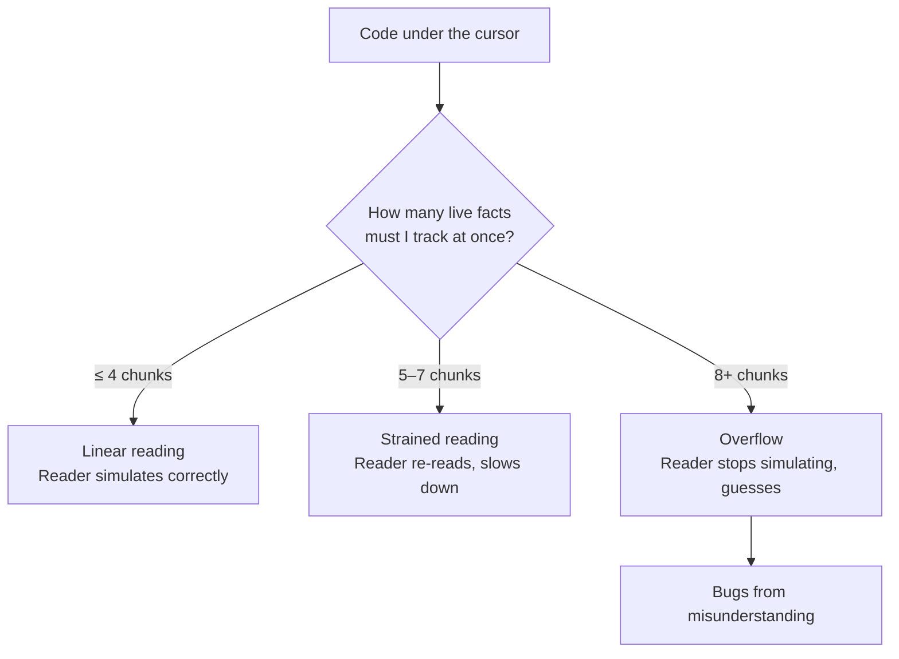
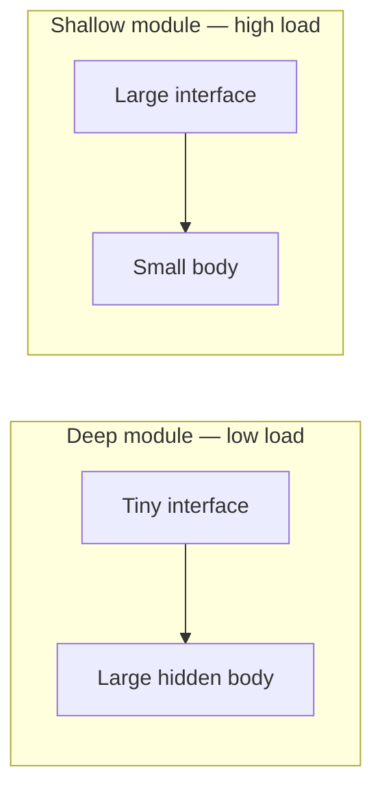

# Cognitive Load — Middle Level

> Focus: "Why?" and "When does it bend?" — the science behind what makes code hard to read, the competing metrics that try to measure it, and the trade-offs where the usual advice reverses.

---

## Table of Contents

1. [The real definition of cognitive load](#the-real-definition-of-cognitive-load)
2. [Intrinsic vs. extraneous vs. germane load](#intrinsic-vs-extraneous-vs-germane-load)
3. [Cyclomatic vs. cognitive complexity](#cyclomatic-vs-cognitive-complexity)
4. [Local vs. global reasoning — the load that actually hurts](#local-vs-global-reasoning--the-load-that-actually-hurts)
5. [When early returns make things worse](#when-early-returns-make-things-worse)
6. [When the "clever" expression is the clearest](#when-the-clever-expression-is-the-clearest)
7. [Naming as load reduction](#naming-as-load-reduction)
8. [The screen-height heuristic and its limits](#the-screen-height-heuristic-and-its-limits)
9. [Deep modules: a longer function can mean less load](#deep-modules-a-longer-function-can-mean-less-load)
10. [Common Mistakes](#common-mistakes)
11. [Test Yourself](#test-yourself)
12. [Cheat Sheet](#cheat-sheet)
13. [Summary](#summary)
14. [Further Reading](#further-reading)
15. [Related Topics](#related-topics)

---

## The real definition of cognitive load

Cognitive load is not "how much code there is." It is **how many things you must hold in working memory at once to understand a piece of code**. Working memory holds roughly four to seven independent "chunks" before it overflows; past that, the reader stops simulating the code and starts guessing.

This reframing matters because it explains why two pieces of code with identical line counts, identical branch counts, and identical test coverage can differ wildly in difficulty. The hard one forces you to track more *simultaneously live* facts: a flag set 40 lines up, a mutable field three methods away, an exception thrown from a getter you didn't expect to throw.



The whole chapter reduces to one engineering goal: **keep the number of simultaneously live facts below working-memory capacity.** Every rule — early returns, short parameter lists, good names — is a tactic in service of that one goal. When a rule stops serving it, drop the rule.

---

## Intrinsic vs. extraneous vs. germane load

Cognitive Load Theory (John Sweller, 1988) splits load into three kinds. Applied to code, the distinction is the single most useful mental model in this chapter.

| Type | What it is | In code | Can you reduce it? |
|---|---|---|---|
| **Intrinsic** | Difficulty inherent to the problem | A B-tree rebalance, a CRDT merge, an FFT | No — only the algorithm choice changes it |
| **Extraneous** | Difficulty added by *how it's presented* | Bad names, deep nesting, hidden side effects, mixed abstraction levels | **Yes — this is your job** |
| **Germane** | Effort spent building a reusable mental model | Learning the domain's vocabulary, an idiom you'll reuse | You *want* this — invest it once, reuse forever |

The mistake juniors make is fighting intrinsic load (trying to make a genuinely hard algorithm "simple") and ignoring extraneous load (the part they can actually fix). The mistake seniors sometimes make is suppressing germane load — refusing to let readers learn a powerful domain abstraction because it "looks unfamiliar."

```python
# Extraneous load: the difficulty is entirely artificial.
def p(d, f1, f2):
    r = []
    for x in d:
        if f1:
            if x.s == 1:
                if not f2 or x.v > 0:
                    r.append(x)
    return r

# Same logic, extraneous load removed. Intrinsic load was near zero all along.
def active_positive_items(items, *, only_active, require_positive_value):
    return [
        item for item in items
        if only_active and item.status == Status.ACTIVE
        and (not require_positive_value or item.value > 0)
    ]
```

Nothing about the second version is "smarter." It just stopped charging the reader rent on decoding `p`, `d`, `f1`, `s == 1`, and three layers of nesting.

---

## Cyclomatic vs. cognitive complexity

Two metrics claim to measure how hard code is. They disagree, and the disagreement is instructive.

**Cyclomatic complexity** (Thomas McCabe, 1976) counts the number of linearly independent paths through a function — essentially `1 + (number of decision points)`. Each `if`, `for`, `while`, `case`, `&&`, `||` adds one. It was designed to estimate the *number of test cases needed for full branch coverage*, and for that it is excellent.

It is a poor proxy for human readability, because it treats all branches as equal. A flat `switch` with twenty cases scores 20. A function with three `if`s nested four deep scores 4. McCabe says the switch is five times harder. Any human says the opposite.

**Cognitive complexity** (G. Ann Campbell / SonarSource, 2017) was built specifically to model reading difficulty. Its rules:

1. **Nesting is multiplied, not added.** An `if` at depth 3 costs more than an `if` at depth 0, because the reader must hold all the enclosing conditions in mind.
2. **Breaks in linear flow cost extra.** `goto`, `break` to a label, `continue`, early `return` inside a loop, recursion — each forces the reader to jump.
3. **Shorthand that reads linearly is free.** A flat `switch` adds 1 total (the reader scans cases top to bottom, holding nothing).

```java
// Cyclomatic: 4.  Cognitive: 1+2+3 = 6 (nesting penalties stack).
int score(List<Order> orders) {
    int total = 0;
    for (Order o : orders) {          // +1
        if (o.isPaid()) {             // +2  (nested in for)
            for (Item i : o.items()) {// +2  (nested deeper)
                if (i.isTaxable()) {  // +3  (nested deeper still)
                    total += i.tax();
                }
            }
        }
    }
    return total;
}

// Cyclomatic: 20.  Cognitive: ~1 (one flat switch, reader holds nothing).
String dayName(int n) {
    switch (n) {
        case 0: return "Sunday";
        case 1: return "Monday";
        // ... 5 more flat cases ...
        default: return "Unknown";
    }
}
```

**Why this matters for a 1–3 year engineer:** when a linter flags "high complexity," check *which* complexity. If it's cyclomatic, the fix might be unnecessary (a flat switch is fine). If it's cognitive, the number is pointing at real reader pain — usually nesting — and is worth fixing. **Prefer cognitive complexity as the gate; keep cyclomatic only as a test-count estimate.**

---

## Local vs. global reasoning — the load that actually hurts

Here is the trade-off that overturns the most naïve advice. A long, linear function that touches only its own arguments and locals is **easier** to understand than a short function that reads and mutates ten pieces of global or instance state.

The reason follows directly from the working-memory model. To understand local code, you hold only what's on screen. To understand code that touches non-local state, you must also hold: *who else writes this field, in what order, under what conditions, on which thread.* That set is unbounded and invisible. It does not fit on screen, and it does not fit in your head.

```go
// SHORT but high load: every method reads/writes shared mutable state.
// To trust step(), you must audit every other method that touches these fields.
type Engine struct {
    phase   int
    buffer  []byte
    dirty   bool
    lastErr error
}

func (e *Engine) step() {
    if e.dirty {              // who set dirty? when? on which goroutine?
        e.flush()             // flush mutates buffer AND phase
    }
    e.phase++                 // does anyone read phase concurrently?
    e.lastErr = e.process()   // process reads buffer set somewhere else
}
```

```go
// LONGER but low load: state flows through arguments and return values.
// Everything step needs is visible in its signature. Nothing hidden.
func step(in State) (State, error) {
    flushed := in
    if in.dirty {
        flushed = flush(in)   // pure: returns a new State, mutates nothing
    }
    processed, err := process(flushed.buffer)
    if err != nil {
        return flushed, err
    }
    return State{
        phase:  flushed.phase + 1,
        buffer: processed,
        dirty:  false,
    }, nil
}
```

The second version has more lines and more explicit plumbing. It is dramatically lower load, because **the only facts you must track are the ones in the signature.** This is why functional and immutable styles reduce cognitive load even when they're more verbose: they convert invisible global state into visible local data flow.

**The practical heuristic:** measure load by *how far you must look* to understand a line, not by *how many lines* there are. A 60-line function you can read top to bottom beats a 15-line function that sends you spelunking through five files.

---

## When early returns make things worse

"Replace nesting with guard clauses" is good advice — until it isn't. Early returns reduce load when each guard is an *independent, unrelated* precondition. They *increase* load when they fragment a single coherent flow into a cascade of exits the reader must mentally re-assemble.

```python
# GOOD use of early return: independent guards, flat, each says "not my problem".
def charge(account, amount):
    if account is None:
        raise ValueError("account required")
    if amount <= 0:
        raise ValueError("amount must be positive")
    if account.frozen:
        raise AccountFrozen(account.id)
    account.balance -= amount
    return account.balance
```

```python
# BAD use of early return: an exit cascade that hides one cohesive decision.
# The reader must reconstruct: "so when DO we return the discount?"
def discount(user, cart):
    if not user.is_member:
        return 0
    if cart.total < 50:
        return 0
    if user.tier == "bronze":
        if cart.total < 100:
            return 0
        return 5
    if user.tier == "silver":
        return 10
    if user.tier == "gold":
        return 15
    return 0
```

The cascade above has six exit points and forces the reader to track which conditions are still "alive" at each return. A small nested block, or a lookup table, restores the single coherent shape:

```python
TIER_DISCOUNT = {"bronze": 5, "silver": 10, "gold": 15}

def discount(user, cart):
    if not user.is_member or cart.total < 50:
        return 0
    rate = TIER_DISCOUNT.get(user.tier, 0)
    if user.tier == "bronze" and cart.total < 100:
        return 0
    return rate
```

**The rule behind the rule:** early returns are a tool for *peeling off* unrelated edge cases so the main path stands clear. When the "edge cases" *are* the logic, peeling them off just scatters the logic. Then a small nested block — or a data structure — is lower load than a six-deep return cascade.

---

## When the "clever" expression is the clearest

Juniors are taught "clever code is bad; spell it out." That is right for *novel* cleverness the reader must decode from scratch. It is wrong for **idioms the reader already knows**, because an idiom is a pre-built chunk — it costs the reader *one* unit of working memory, not five.

```python
# "Spelled out" — but the reader must trace four lines to confirm it's a swap.
tmp = a
a = b
b = tmp
# vs. the idiom every Python reader recognizes instantly:
a, b = b, a
```

```go
// "Clever" but idiomatic: the comma-ok pattern is a single chunk to any Go reader.
if val, ok := cache[key]; ok {
    return val
}
// Spelling it out adds lines without adding clarity for the intended audience.
```

The decision rule is **audience-relative**: an expression is "clear" if its intended readers parse it as one chunk. `arr[::-1]` is clear to Python developers and opaque to newcomers. A bit-twiddling `x & (x - 1)` is one chunk to systems programmers and a puzzle to web developers. The same line can be the clearest *or* the highest-load choice depending entirely on who maintains the file.

This is why blanket "no clever code" rules misfire: they optimize for the least-experienced possible reader and tax everyone else with verbosity. Calibrate to your actual team. When you must use a non-obvious expression, **name the intent** rather than expanding the mechanism:

```python
is_power_of_two = n > 0 and (n & (n - 1)) == 0   # name carries the idiom
```

---

## Naming as load reduction

A good name is a **chunk you don't have to compute.** When a variable is called `eligibleCustomers`, the reader holds one fact: "these are eligible." When it's called `list2`, the reader must reconstruct *why* it exists from the surrounding code — every single time they encounter it.

Naming trades against the other tools. Often the cheapest way to cut a function's load is not to extract a helper or flatten a branch, but to **name an intermediate result**:

```java
// High load: the condition is a puzzle the reader re-solves on every read.
if (user.getAge() >= 18 && user.getCountry().equals("US")
        && !user.isBanned() && user.getCreatedAt().isBefore(cutoff)) {
    enroll(user);
}

// Low load: the name IS the documentation; the condition reads like a sentence.
boolean isEligibleLegacyUSAdult =
        user.getAge() >= 18
        && user.getCountry().equals("US")
        && !user.isBanned()
        && user.getCreatedAt().isBefore(cutoff);
if (isEligibleLegacyUSAdult) {
    enroll(user);
}
```

The second version isn't shorter. It's lower load, because the four-fact predicate collapses into one named chunk the reader can carry forward without re-deriving it. **Naming is the highest leverage, lowest-risk load reduction available** — it changes no behavior and needs no new tests.

---

## The screen-height heuristic and its limits

"A function should fit on one screen" is a useful smoke alarm: if you must scroll, you probably can't hold the whole thing in working memory, and you're tracking state across the fold. But it is a heuristic, not a law, and it bends in three directions.

**It under-warns.** A function can fit on one screen and still be unreadable — fifteen lines that each mutate shared state, or fifteen lines at five abstraction levels. Fitting on screen is necessary, not sufficient.

**It over-warns.** A 60-line function that is a single linear pipeline — read input, transform, transform, transform, write output, with no branches and no shared state — is perfectly readable past one screen. Chopping it into `step1`, `step2`, `step3` purely to satisfy the heuristic produces helpers that are only ever called once, scattering a linear story across the file and *raising* load (now the reader jumps to follow it).

**It depends on the screen.** "One screen" was ~24 lines on a 1990s terminal and is ~70 on a modern monitor. A heuristic tied to physical hardware can't be a real metric. The underlying principle — *can the reader hold this whole unit at once?* — is what matters; line count is a crude proxy for it.

Treat screen-height like the 30-line rule discussed in [refactoring code smells](../../refactoring/README.md): a prompt to *look*, never a mandate to *cut*.

---

## Deep modules: a longer function can mean less load

John Ousterhout (*A Philosophy of Software Design*) reframes the whole topic with one idea: judge a module by its **depth** — the ratio of the functionality it provides to the size of the interface you must understand to use it.

A **deep** module has a small interface hiding substantial implementation. `read(buffer, length)` is three words; behind it sits scheduling, caching, retries, device drivers. Enormous functionality, tiny cognitive footprint at the call site.

A **shallow** module has an interface nearly as complex as its implementation — it adds API surface without hiding much. A wrapper that forwards five parameters to another five-parameter function is shallow: the caller now has *two* things to understand instead of one.



This is the surprising consequence: **a longer function body behind a clean interface can lower total cognitive load**, because callers pay only for the interface, never the body. Splitting that body into six shallow helpers — each exposed, each called once — *raises* load, because now the reader must understand six interfaces to follow one operation.

The lesson chains back to local-vs-global reasoning: extraction reduces load only when the extracted piece is *deep* (hides real complexity behind a name you can trust) and *cohesive* (someone might reuse it, or it stands alone conceptually). Extraction purely to shorten the parent function is shallow and usually backfires. See [abstraction and information hiding](../22-abstraction-and-information-hiding/README.md) for the architectural treatment (and the dedicated "deep modules and complexity" chapter for depth as a first-class design unit).

---

## Common Mistakes

1. **Equating "short" with "simple."** A 15-line function touching ten globals is harder than a 60-line pure pipeline. Measure live facts, not line count.

2. **Trusting cyclomatic complexity as a readability gate.** It penalizes flat switches (easy to read) and under-penalizes deep nesting (hard to read). Use cognitive complexity for the readability question.

3. **Extracting helpers to satisfy a line limit.** Single-use helpers named `processStep2` scatter a linear story and raise load. Extract only when the piece is deep and cohesive.

4. **Guard-clause cascades for cohesive logic.** Early returns peel off *unrelated* edge cases. When the edge cases *are* the logic, a six-deep return cascade is worse than a small nested block or a lookup table.

5. **Banning all "clever" code.** Idioms the team knows are single chunks. Spelling them out taxes every reader to protect a hypothetical novice. Calibrate to the actual audience.

6. **Fixing intrinsic load.** You can't make a CRDT merge "simple." Stop trying; spend the effort removing extraneous load (names, nesting, hidden state) where you actually have leverage.

7. **Hidden control flow.** Exceptions for normal cases and side effects in getters add invisible live facts. A `getUser()` that lazily inserts a row is a trap — the reader has no reason to expect a write.

8. **Mixed abstraction levels.** High-level orchestration next to bit-shifting forces the reader to switch gears mid-function. Keep each function at one altitude.

---

## Test Yourself

**1. Two functions implement the same feature. A is 12 lines and reads/writes 6 instance fields. B is 45 lines, fully linear, touches only its arguments. Which has lower cognitive load, and why?**

<details><summary>Answer</summary>

B, almost always. Cognitive load is the number of facts you must hold at once, plus how far you must look to find them. A forces you to audit every other method that touches those 6 fields — an unbounded, invisible set. B's entire context is its signature and its 45 visible lines. Line count is a weak proxy; *locality of reasoning* is the real driver. The only case where A wins is if those 6 fields are immutable and set once — then the "audit every writer" cost disappears.

</details>

**2. A linter reports cyclomatic complexity 18 on a function that is one flat `switch` with 17 cases. Is this a real readability problem?**

<details><summary>Answer</summary>

No. A flat switch is read top to bottom with nothing held in working memory — its cognitive complexity is about 1. Cyclomatic complexity counts test paths, not reading difficulty, and it treats every branch as equally costly. The number is telling you "you need ~18 test cases for full branch coverage," which is true and useful, but it is *not* telling you the function is hard to read. Don't refactor a clean switch to satisfy a cyclomatic gate.

</details>

**3. You replace a nested `if/else` discount calculator with guard clauses, and it now has 7 early returns. A reviewer says it got harder to read. Were they right?**

<details><summary>Answer</summary>

Likely yes. Early returns reduce load when they peel off *independent, unrelated* preconditions ("null? bail. negative? bail."). When the branches *are* the core decision logic, splitting them into 7 exits forces the reader to mentally reconstruct "under what surviving conditions do we reach each return?" A small nested block, or a data-driven lookup table, keeps the single coherent decision visible. Early return is a tool for clearing the runway, not for expressing the flight.

</details>

**4. A teammate writes `n > 0 && (n & (n - 1)) == 0`. Is this too clever?**

<details><summary>Answer</summary>

It depends entirely on the audience, and that *is* the principle. To a systems programmer, `x & (x - 1)` clearing the lowest set bit is a recognized idiom — one chunk. To a web team that never touches bit manipulation, it's a puzzle that costs five units to decode and risks a wrong "fix" later. The robust move regardless of audience: name it. `isPowerOfTwo = n > 0 && (n & (n - 1)) == 0` lets the idiom-fluent read the mechanism and everyone else read the intent.

</details>

**5. Your team rule is "every function fits on one screen." A genuinely linear 55-line data pipeline violates it. Split it?**

<details><summary>Answer</summary>

Probably not. Screen-height is a smoke alarm for "you can't hold this at once," which is usually caused by branching and shared state — neither of which a linear pipeline has. Splitting it into single-use `step1/step2/step3` helpers scatters one readable story across the file and forces the reader to jump, raising load. The heuristic is also hardware-relative (24 lines once, 70 now), so it can't be a hard metric. Check the real question — *can a reader hold this whole unit at once?* — and here the answer is yes.

</details>

**6. Where should you spend effort: a hard graph algorithm that's intrinsically complex, or a CRUD handler buried in nesting and bad names?**

<details><summary>Answer</summary>

The CRUD handler. The graph algorithm's difficulty is *intrinsic* — inherent to the problem — and no amount of formatting makes it trivially simple. The CRUD handler's difficulty is *extraneous* — added entirely by presentation (nesting, names, hidden state) — and that is exactly the load you have leverage over. Spend your effort where removing load is possible. For the algorithm, the only real lever is a clearer abstraction boundary and a name that lets callers ignore the internals (a deep module).

</details>

**7. A `getCustomer(id)` method silently creates and persists a new row if the customer doesn't exist. Why is this a cognitive-load problem, not just a naming problem?**

<details><summary>Answer</summary>

Because it adds an invisible live fact: "calling this getter performs a write." Readers chunk getters as side-effect-free reads; this one violates the chunk, so every call site now secretly carries an extra obligation the reader has no reason to look for. Hidden control flow — side effects in getters, exceptions for normal cases — inflates load precisely because it's *not on screen*. Renaming to `getOrCreateCustomer` helps, but the deeper fix is to make the surprising behavior explicit at the call site, not hidden behind a read-shaped name.

</details>

---

## Cheat Sheet

| Situation | Lower-load choice | Why |
|---|---|---|
| Long linear function vs. many globals | Long linear function | Local reasoning; all facts on screen |
| Linter flags cyclomatic complexity | Check if it's a flat switch | Cyclomatic ≠ readability; switch is fine |
| Linter flags cognitive complexity | Usually worth fixing | It models nesting + flow breaks (real pain) |
| Deep nesting of unrelated guards | Early returns | Peels off independent edge cases |
| Cohesive logic split into return cascade | Small nested block or lookup table | Keeps one decision visible |
| Idiom the team knows | Use it, optionally name the intent | Idiom = one chunk |
| Novel trick the team doesn't know | Spell out or name | Decoding cost > line savings |
| Repeated multi-fact predicate | Name the intermediate | Collapses N facts into 1 chunk |
| Function exceeds one screen | Look, don't auto-cut | Heuristic, not a metric |
| "Should I extract this helper?" | Only if it's deep + cohesive | Shallow single-use helpers raise load |
| Genuinely hard algorithm | Hide behind a clean interface | Can't cut intrinsic load; can cut its reach |

**Load triage order (cheapest first):** rename → name an intermediate → flatten unrelated guards → extract a *deep* cohesive unit → restructure data flow to be local. Reach for the expensive moves only when the cheap ones don't clear the working-memory budget.

---

## Summary

- Cognitive load is the count of **simultaneously live facts** a reader must hold, not the line count. Keep it under working-memory capacity (~4–7 chunks).
- Sweller's three loads: **intrinsic** (inherent, fixed), **extraneous** (presentation, your job to remove), **germane** (model-building, worth investing). Fight extraneous, not intrinsic.
- **Cyclomatic complexity** counts test paths and over-weights flat switches; **cognitive complexity** models reading difficulty by penalizing nesting and flow breaks. Gate on the latter.
- **Local beats global.** A long pure function is lower load than a short one touching shared mutable state, because the second forces an unbounded, invisible audit.
- **Early returns** clear unrelated edge cases; they backfire when the branches *are* the logic. **Idioms** are single chunks — clarity is audience-relative.
- **Naming** is the highest-leverage, zero-risk load reduction. **Screen-height** is a smoke alarm, not a metric.
- **Deep modules** lower total load even with longer bodies: callers pay only for the interface. Extract only what's deep and cohesive.

---

## Further Reading

- John Sweller, *Cognitive Load During Problem Solving* (1988) — the original theory.
- G. Ann Campbell, *Cognitive Complexity: A New Way of Measuring Understandability* (SonarSource, 2017) — the metric and its rationale.
- Thomas McCabe, *A Complexity Measure* (1976) — cyclomatic complexity and what it was actually for.
- John Ousterhout, *A Philosophy of Software Design* — deep vs. shallow modules, complexity as the enemy.
- Robert C. Martin, *Clean Code* — chapters on functions and naming (the positive rules this chapter inverts).

---

## Related Topics

- [junior.md](junior.md) — the eight load-creating anti-patterns and their clean alternatives.
- [senior.md](senior.md) — measuring load across a codebase, CI gates, and team-scale calibration.
- [Chapter README](../README.md) — the positive rules for managing cognitive load.
- [Functions](../02-functions/README.md) — function size, single responsibility, one level of abstraction.
- [Abstraction and Information Hiding](../22-abstraction-and-information-hiding/README.md) — what an interface should and shouldn't reveal.
- Deep Modules and Complexity (sibling chapter `27-deep-modules-and-complexity`) — depth as the unit of good design.
- [Refactoring](../../refactoring/README.md) — mechanics for safely reducing extraneous load.
- [Anti-Patterns](../../anti-patterns/README.md) — the recurring structures that inflate cognitive load.
