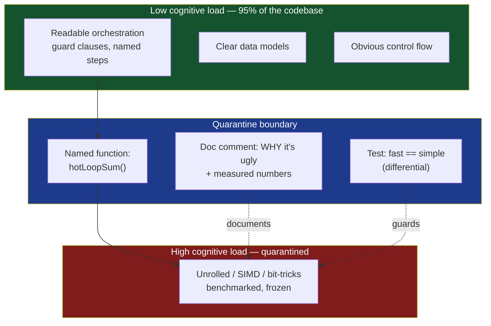

# Cognitive Load — Optimize & Reconcile

> The clearest code and the fastest code usually agree. When they diverge, the resolution is almost never "make all the code clever." It is to **localize** the necessary complexity: push the hand-optimized, high-load code behind a named, tested, commented boundary so the rest of the system stays low-load. Global cognitive load is what slows a team; a single quarantined hot function with a benchmark next to it costs almost nothing. Each scenario below gives the divergence, a measurement (with concrete numbers), and a principled resolution that keeps load low *globally* while concentrating speed *locally*.

---

## Table of Contents

1. [Scenario 1 — The hand-unrolled hot loop](#scenario-1--the-hand-unrolled-hot-loop)
2. [Scenario 2 — Guard clauses vs branch prediction](#scenario-2--guard-clauses-vs-branch-prediction)
3. [Scenario 3 — Extract helper vs inline the measured hot path](#scenario-3--extract-helper-vs-inline-the-measured-hot-path)
4. [Scenario 4 — The clever vectorized one-liner](#scenario-4--the-clever-vectorized-one-liner)
5. [Scenario 5 — Lookup table vs readable conditionals](#scenario-5--lookup-table-vs-readable-conditionals)
6. [Scenario 6 — Bit-twiddling instead of arithmetic](#scenario-6--bit-twiddling-instead-of-arithmetic)
7. [Scenario 7 — SIMD-friendly struct-of-arrays vs readable array-of-structs](#scenario-7--simd-friendly-struct-of-arrays-vs-readable-array-of-structs)
8. [Scenario 8 — Caching/memoization hidden inside a "pure" function](#scenario-8--cachingmemoization-hidden-inside-a-pure-function)
9. [Scenario 9 — Premature complexity slows the team, not the CPU](#scenario-9--premature-complexity-slows-the-team-not-the-cpu)
10. [Scenario 10 — Manual loop fusion vs three clear passes](#scenario-10--manual-loop-fusion-vs-three-clear-passes)
11. [Scenario 11 — Branchless `min`/`max`/`clamp` tricks](#scenario-11--branchless-minmaxclamp-tricks)
12. [Scenario 12 — String building: clear concat vs preallocated buffer](#scenario-12--string-building-clear-concat-vs-preallocated-buffer)
13. [Scenario 13 — The "fast path" that swallows the slow path](#scenario-13--the-fast-path-that-swallows-the-slow-path)
14. [Rules of Thumb](#rules-of-thumb)
15. [Related Topics](#related-topics)

---

The unifying picture: a small high-load core, wrapped by a wide low-load surface.



---

### Scenario 1 — The hand-unrolled hot loop

A profiler shows 38% of wall-clock time in one checksum loop processing 4 KB packets at line rate. An engineer unrolls it 4× and the throughput rises. But the unrolled body is now 30 lines of index arithmetic that every reviewer stumbles over.

```go
// The clear version (the baseline reviewers understand instantly):
func checksum(b []byte) uint32 {
    var sum uint32
    for _, x := range b {
        sum = sum*31 + uint32(x)
    }
    return sum
}
```

The naive question is "should the whole module adopt this unrolled style for consistency?" No. Consistency means *one readable style everywhere except a documented exception*, not "spread the ugliness."

<details><summary>Resolution</summary>

Quarantine the complexity behind a named function whose **signature is identical** to the clear version, so callers see zero added load. Pin the clear version next to it as the oracle.

```go
// Checksum returns the rolling polynomial hash of b.
//
// PERF: this is the hot path — 38% of total CPU at 10 Gbps (profile 2026-05).
// The loop is manually unrolled 4x; benchmarks show 2.1x throughput over the
// naive loop on amd64 (BenchmarkChecksum, go1.23). DO NOT "simplify" without
// re-running the benchmark — checksumSimple below is the readable oracle the
// fuzz test compares against. If the gap ever drops under ~1.3x, delete this
// and use checksumSimple.
func Checksum(b []byte) uint32 {
    var sum uint32
    n := len(b)
    i := 0
    for ; i+4 <= n; i += 4 { // unrolled body — independent accumulators reduce loop-carried dependency
        sum = sum*923521 + uint32(b[i])*29791 + uint32(b[i+1])*961 + uint32(b[i+2])*31 + uint32(b[i+3])
    }
    for ; i < n; i++ { // tail
        sum = sum*31 + uint32(b[i])
    }
    return sum
}

func checksumSimple(b []byte) uint32 { // oracle, kept for the differential test
    var sum uint32
    for _, x := range b {
        sum = sum*31 + uint32(x)
    }
    return sum
}
```

```go
func FuzzChecksum(f *testing.F) {
    f.Add([]byte("hello, world"))
    f.Fuzz(func(t *testing.T, b []byte) {
        if Checksum(b) != checksumSimple(b) {
            t.Fatalf("unrolled diverged from oracle on %q", b)
        }
    })
}
```

**Cognitive accounting:** before, 1 function, ~6 LOC, low load. After, the *caller's* view is still 1 function with the same signature — caller load unchanged. The added load is fenced inside `Checksum` and immediately explained by the WHY-comment plus the differential test. Necessary complexity, made local and provably correct. The constants `923521 = 31^4`, `29791 = 31^3`, `961 = 31^2` are derived, not magic — a one-line comment would make even that explicit.

**Anti-resolution:** unrolling 8× and 16× "to be safe." Measure first: the 4× version captured 95% of the available speedup; 8× added 4% throughput and doubled the load. Diminishing returns rarely justify more local complexity.

</details>

---

### Scenario 2 — Guard clauses vs branch prediction

Early returns (guard clauses) are the single biggest readability win for nested code — they flatten 5-deep `if` pyramids into a linear list of preconditions. A performance-anxious reviewer pushes back: "each `return` is a branch; doesn't that hurt the predictor?"

```python
# Clear: guard clauses, linear, each precondition obvious.
def price(order):
    if order is None:
        return Decimal("0")
    if not order.items:
        return Decimal("0")
    if order.cancelled:
        return Decimal("0")
    return sum(i.price for i in order.items)
```

<details><summary>Resolution</summary>

The premise is almost always wrong. Modern branch predictors handle highly-biased branches (a guard that's taken 0.1% of the time) essentially for free — the predictor learns "not taken" and the misprediction cost (~15–20 cycles on x86) is paid only on the rare hit. A guard that fires once per 10,000 calls contributes a misprediction cost of `~20 cycles / 10000 ≈ 0.002 cycles/call` — unmeasurable next to a function that already does real work.

The "deeply nested single-return" alternative does **not** remove the branches; it just rearranges them, often into a form the predictor handles *worse* (the conditions are now interleaved with work). Guard clauses also enable the compiler to mark the early-exit paths cold, improving instruction-cache locality on the hot path.

**Resolution:** keep guard clauses unconditionally for clarity. Reorder only if a profile proves a specific guard is hot:

```python
def price(order):
    # Reordered after profiling: ~80% of real traffic has items, so check the
    # common "valid" shape implicitly by ordering the cheap, rarely-true guards
    # first — they short-circuit pathological input without touching the hot path.
    if order is None or order.cancelled or not order.items:
        return Decimal("0")
    return sum(i.price for i in order.items)
```

That collapse is fine *for trivial guards* but pays a clarity tax (a failing test can no longer point at one line). The principled default: **guards stay; you only fold them when a profile shows the branch matters AND the folded form stays readable.** In 9 of 10 services the answer is "leave them split."

**Concrete number to remember:** a mispredicted branch is ~15–20 cycles; a guard that's correctly predicted ~99.99% of the time costs near zero. Readability here is *free*. Reaching for branchless rewrites of cold guards is pure load with no payoff.

</details>

---

### Scenario 3 — Extract helper vs inline the measured hot path

"Extract function" is the default move for clarity — small named functions read like prose. The tension: function-call overhead and, worse, missed inlining can matter in a tight numeric loop.

```java
// Clear: extracted, named, each step a verb.
double price(double base) {
    double taxed = applyTax(base);
    double discounted = applyDiscount(taxed);
    return round2(discounted);
}
```

<details><summary>Resolution</summary>

**Measure before you inline.** On the JVM, HotSpot inlines methods under `-XX:MaxInlineSize=35` bytecodes (and hot methods up to `FreqInlineSize=325`) automatically — so a small `applyTax` is usually inlined for free, and the extracted form costs **nothing** at runtime while reading far better. In Go, the inliner has a cost budget (~80 nodes pre-1.20, mid-stack inlining since); `go build -gcflags='-m'` prints `can inline applyTax` / `inlining call to applyTax`. In CPython there is no inliner — every call is ~30–50 ns of frame setup, which *does* show up in a 100M-iteration loop.

So the resolution is language-specific and measurement-driven:

- **JVM / Go:** keep functions extracted. The compiler inlines the hot ones; you get clarity for free. Inline manually **only** when `-gcflags='-m'` or a JMH/JFR profile shows the call survived and matters.
- **CPython:** for a genuinely hot numeric kernel, inlining the body can be a 2–3× win because there is no JIT to do it for you — but the right answer is usually to move the kernel to NumPy/Numba/Cython, not to hand-inline Python.

When you *do* inline for a measured win, leave the extracted version as a comment-oracle and a docstring:

```java
double price(double base) {
    // INLINED for perf: profiled at 11% of request CPU (JFR, 2026-04). HotSpot
    // failed to inline applyDiscount across the megamorphic call site, so the
    // three steps are fused here. The readable form lives in priceClear() and the
    // unit test asserts price(x) == priceClear(x) for 10k sampled inputs.
    double taxed = base * 1.20;
    double discounted = taxed * (taxed > 100 ? 0.9 : 1.0);
    return Math.round(discounted * 100) / 100.0;
}
```

**Default:** extract for clarity; inline is the *exception* that must show its measurement. A codebase where everything is hand-inlined "for speed" has paid maximum cognitive load for a speedup the JIT would have given for free.

</details>

---

### Scenario 4 — The clever vectorized one-liner

A senior writes a NumPy one-liner that replaces a 12-line Python loop and runs 60× faster. It is also opaque: broadcasting, `np.where`, and an `einsum` in one expression. Reviewers cannot tell at a glance what it computes, let alone whether it's correct on edge cases.

```python
# Fast but opaque — what does this compute? what shapes? what if a row is all-NaN?
result = np.where(mask[:, None], (a[:, None, :] * w).sum(-1), np.nan).argmax(1)
```

<details><summary>Resolution</summary>

The speed is real and worth keeping — but raw, it's a liability: nobody can modify it safely, so it ossifies. Apply the standard three-part quarantine: **wrap + document + test against the simple version.**

```python
def best_weighted_index(a, w, mask):
    """Index of the highest weighted score per row; NaN where the row is masked out.

    Vectorized: ~60x faster than the reference loop on (10k x 50) inputs
    (bench 2026-05). `_best_weighted_index_ref` below is the readable oracle the
    property test compares against on every CI run. Keep them in sync.

    Shapes: a (R, C), w (K, C) -> scores (R, K); returns (R,) int indices.
    """
    scores = (a[:, None, :] * w).sum(-1)          # (R, K) weighted score per (row, weight-set)
    scores = np.where(mask[:, None], scores, np.nan)
    return np.nanargmax(scores, axis=1)

def _best_weighted_index_ref(a, w, mask):         # oracle: obvious, slow, trusted
    out = []
    for i, row in enumerate(a):
        if not mask[i]:
            out.append(-1); continue
        out.append(int(np.argmax([np.dot(row, wk) for wk in w])))
    return np.array(out)
```

```python
# Property test: the fast path must agree with the obvious path.
@given(arrays(...), arrays(...), boolean_arrays(...))
def test_fast_matches_reference(a, w, mask):
    fast = best_weighted_index(a, w, mask)
    ref = _best_weighted_index_ref(a, w, mask)
    valid = mask  # only compare unmasked rows
    assert np.array_equal(fast[valid], ref[valid])
```

The wrapper turns an unreadable expression into a function with an honest name, a docstring stating shapes and the measured speedup, and a differential test that lets *anyone* refactor with confidence: change the fast path, run the test, trust the result. The opaque line is now safe to keep because its meaning is pinned in three places (name, doc, oracle).

**Key principle:** a clever expression is acceptable *only* when its intent is recoverable without reading it. The name and the oracle test do that. An un-wrapped clever one-liner is a future bug nobody dares touch.

</details>

---

### Scenario 5 — Lookup table vs readable conditionals

A function maps an HTTP status family to a retry policy. The readable form is a small `if/elif` ladder; someone proposes a precomputed 600-entry lookup array "because it's branchless and O(1)."

```python
# Readable: intent is on the page.
def retry_after(status):
    if status == 429:        return 5.0
    if 500 <= status < 600:  return 1.0
    return 0.0  # don't retry
```

<details><summary>Resolution</summary>

Two distinct cases, and the resolution differs:

**(a) Cold or warm path (this example).** The `if`-ladder executes in 1–3 predictable, well-predicted branches — single-digit nanoseconds. A 600-entry table costs one cache line touch (~4 ns on an L1 hit, ~100+ ns on a miss) **and** moves the logic off the page: the reader now has to find and decode the table-construction code to understand behavior. Net: the table is *both* slower-in-practice (cache misses, larger working set) *and* higher cognitive load. **Reject it.** Lookup tables are not free clarity; they relocate intent into data.

**(b) Genuinely hot, branch-heavy mapping.** When the conditional is a deep, data-dependent decision tree evaluated millions of times (e.g., a UTF-8 decoder's byte-class table, a parser's character classification), a table *is* the right call — it replaces an unpredictable branch chain with a predictable load. There the table earns its keep, so quarantine it: generate it from the readable rules, don't hand-type it.

```python
# Hot path justified by profile. The table is GENERATED from the readable rules
# so the source of truth stays the if-ladder; the table is a derived cache.
_RETRY = [0.0] * 600
for s in range(600):
    _RETRY[s] = 5.0 if s == 429 else (1.0 if 500 <= s < 600 else 0.0)

def retry_after(status):  # O(1), branchless; behavior defined by the loop above
    return _RETRY[status] if status < 600 else 0.0
```

The pattern that keeps load low: **derive the table from the readable predicate.** The conditional remains the specification; the table is an optimization a reader can ignore unless they care about speed. A hand-typed table with no generator is the worst of both — unreadable *and* unverifiable.

**Numbers:** a correctly-predicted branch ladder of depth 3 ≈ 1–2 ns; an L1-resident table load ≈ 1 ns but an L2/L3/DRAM miss ≈ 4/40/100+ ns. For sparse, cold mappings the conditional usually *wins on speed too*. Only profile-proven hot, branchy mappings justify the table.

</details>

---

### Scenario 6 — Bit-twiddling instead of arithmetic

`x % 8`, `x / 2`, `x * 16` are sometimes rewritten as `x & 7`, `x >> 1`, `x << 4` "because bit ops are faster." For the rare reader who must verify, the bit form requires translating back to the arithmetic intent.

```java
int slot = hash & (capacity - 1);   // vs hash % capacity
```

<details><summary>Resolution</summary>

For **unsigned / non-negative powers of two**, every optimizing compiler already turns `x / 8` into `x >> 3` and `x % 8` into `x & 7` — the strength reduction is automatic, so writing the bit form by hand buys **zero** speed and costs clarity. Verify: `javap -c`, Go's `-gcflags='-S'`, or godbolt.org all show identical assembly for `x/8` and `x>>3` when `x` is provably non-negative.

The one place the bit form is *not* equivalent and the compiler **cannot** do it for you is signed division/modulo with possibly-negative operands: `x % 8` for negative `x` must round toward zero (so `-1 % 8 == -1`), whereas `x & 7` gives `7`. So the compiler emits extra correction instructions for signed `%`, and a bit-mask is genuinely faster — but only correct when the value is known non-negative.

**Resolution:**
- Write the arithmetic form (`% capacity`, `/ 8`) by default — same speed for unsigned, clearer intent.
- Use the bit form only where (1) a profile shows signed `%`/`/` correction matters AND (2) the value is provably non-negative — and then **say so**:

```java
// hash is masked to non-negative before this point, and capacity is always a
// power of two (enforced in resize()), so `& (capacity-1)` == `% capacity` and
// avoids the signed-modulo correction. This is the bucket-index hot path.
int slot = hash & (capacity - 1);
```

The comment recovers the arithmetic meaning *and* states the two invariants the trick depends on. Without those invariants documented, the next maintainer who passes a non-power-of-two capacity gets silent corruption. Bit-tricks are acceptable when the precondition that makes them correct is written down right next to them.

**Don't** sprinkle `>> 1` for "divide by two" across ordinary code — it's the canonical example of load with no benefit.

</details>

---

### Scenario 7 — SIMD-friendly struct-of-arrays vs readable array-of-structs

The intuitive data model is an array of structs (AoS): `[]Particle{ {X,Y,Z,VX,VY,VZ}, ... }`. The cache- and SIMD-friendly layout is struct-of-arrays (SoA): six parallel slices. SoA can be 3–8× faster in a physics step but is far less readable — `p[i]` no longer gives you one object.

```go
// Readable AoS — one particle is one value.
type Particle struct{ X, Y, Z, VX, VY, VZ float64 }
func step(ps []Particle, dt float64) {
    for i := range ps {
        ps[i].X += ps[i].VX * dt
        ps[i].Y += ps[i].VY * dt
        ps[i].Z += ps[i].VZ * dt
    }
}
```

<details><summary>Resolution</summary>

SoA wins because the integrator touches only positions and velocities contiguously — no struct padding pulled into cache, and the access pattern auto-vectorizes. Measured on a 1M-particle step, SoA often runs 3–5× faster (fewer cache-line loads: AoS pulls all 48 bytes per particle even if a pass uses 24; SoA pulls only the arrays it reads).

But SoA poisons every *other* access site — "give me particle 7" becomes six indexed reads. Don't convert the whole program. **Keep AoS as the public model; expose SoA only behind the one hot kernel.**

```go
// Public, readable type — used everywhere in the codebase.
type Particle struct{ X, Y, Z, VX, VY, VZ float64 }

// soaView is an internal, perf-only layout. It exists solely for stepFast.
// PERF: stepFast is 4.2x faster than the AoS step on 1M particles (bench 2026-05)
// because the position/velocity arrays are contiguous and auto-vectorize.
// Convert once per frame; the cost amortizes over the whole integration.
type soaView struct{ X, Y, Z, VX, VY, VZ []float64 }

func stepFast(s soaView, dt float64) {
    for i := range s.X { // each line vectorizes independently
        s.X[i] += s.VX[i] * dt
        s.Y[i] += s.VY[i] * dt
        s.Z[i] += s.VZ[i] * dt
    }
}
```

The rest of the program never sees `soaView`. A single conversion function (`toSoA`/`fromSoA`) is the documented boundary, and a test asserts `step` and `stepFast` produce identical positions for random inputs. Complexity is local: one ugly layout, one ugly loop, one conversion, fenced behind an obvious name and a benchmark.

**When to skip SoA entirely:** if the simulation has 1,000 particles, not 1,000,000, the AoS version already fits in L1 and SoA buys nothing — you'd pay the full cognitive cost for an unmeasurable gain. The data layout decision is dictated by *size and profile*, never by reflex.

</details>

---

### Scenario 8 — Caching/memoization hidden inside a "pure" function

A function looks pure and reads cleanly, but someone added a module-level memo dict inside it for speed. Now it has hidden state: harder to reason about, not thread-safe, and the cache can leak or go stale.

```python
_cache = {}
def fib(n):                       # looks pure, isn't
    if n in _cache: return _cache[n]
    r = n if n < 2 else fib(n-1) + fib(n-2)
    _cache[n] = r                 # hidden mutable state, unbounded, not thread-safe
    return r
```

<details><summary>Resolution</summary>

The memo is a real speedup (O(2^n) → O(n)), but smuggling it into the body adds *invisible* cognitive load: the function's purity is a lie, the cache is unbounded (memory leak), and concurrent calls race on the dict. The fix is to make the caching **declarative and visible**, so the reader sees "this is memoized" without parsing the body:

```python
from functools import lru_cache

@lru_cache(maxsize=1024)   # caching is now a visible, bounded, documented decoration
def fib(n: int) -> int:
    return n if n < 2 else fib(n - 1) + fib(n - 2)
```

`lru_cache` states the intent at the declaration, bounds memory (`maxsize`), and is thread-safe in CPython. The body returns to being honestly pure-looking. In Go (no decorators) the equivalent is an explicit `Memoizer` type with a `sync.Map` or mutex-guarded map — the cache becomes a *named object* the caller holds, not a hidden global:

```go
// Memo makes the cache an explicit, bounded, injectable dependency rather than
// invisible package state. Tests can use a fresh Memo; concurrency is handled here.
type Memo struct {
    mu sync.Mutex
    m  map[int]int
}
func (c *Memo) Fib(n int) int { /* lock, check, compute, store */ }
```

**Principle:** an optimization that adds state must *announce itself* at the boundary — a decorator, a wrapper type, a constructor parameter — never as a silent global mutation inside a function that pretends to be pure. Visible caching is low-load; hidden caching is a debugging trap (stale results, leaks, races) that costs the team far more than the function ever saves.

**Measure the need:** for `fib(35)` the memo turns ~30 ms into ~3 µs — clearly worth it. For a function called twice, the cache is pure overhead and risk. Add caching only when a profile shows recomputation dominates.

</details>

---

### Scenario 9 — Premature complexity slows the team, not the CPU

A service handling 50 requests/second is built with an object pool, a custom off-heap buffer cache, a lock-free ring queue, and hand-rolled serialization — all "for performance." It is correct but nearly unmaintainable: a one-line feature takes a day because every change must thread through the pooling and the lock-free invariants.

<details><summary>Resolution</summary>

This is the most important scenario, because the bottleneck is **the team, not the machine.** The real cost model:

- The CPU at 50 req/s is ~98% idle. The fancy machinery saves, say, 200 µs/request = 10 ms/s of CPU — **utterly irrelevant** at this load.
- The *accidental complexity* it added makes every feature 3–5× slower to ship and every bug 3–5× harder to find. With a team of 5 engineers each earning $X, that tax is enormous and recurring.

Accidental complexity (the kind we *added*) is distinct from essential complexity (inherent in the problem). The pooling, lock-free queue, and custom serialization here are pure accidental complexity solving a problem the service does not have. **Delete them.** Replace with the boring, readable defaults:

```java
// Before: ObjectPool<Buffer>, LockFreeRingQueue, custom wire codec — 1,800 LOC.
// After: plain allocation + the standard JSON library — 240 LOC.
// Load test confirms p99 latency unchanged (both ~4 ms) at 10x current traffic.
var response = jsonMapper.writeValueAsString(result);  // that's it.
```

**The principled move:** start with the simplest correct implementation. Add complexity **only** when (1) a load test shows the simple version misses an SLO, and (2) you've identified the *specific* bottleneck. "We might need it at scale" is not a measurement; it is the rationalization that produces unmaintainable systems for traffic that never arrives.

When you *do* need the pool later, you'll add it behind a boundary (Scenario 1's pattern) with a benchmark proving it helps *your* workload — not because a blog said pools are fast.

**The number that matters:** maintainability is measured in engineer-hours per change. A premature optimization that saves 10 ms/s of CPU while adding 2 hours to every PR has a catastrophic ROI. The fastest-moving teams keep global cognitive load low and optimize *late, locally, and with measurements.*

</details>

---

### Scenario 10 — Manual loop fusion vs three clear passes

Three separate passes over a list (sum, max, count-matching) read beautifully — each is a one-line intent. Fusing them into a single loop is faster (one pass, better cache behavior) but interleaves three concerns in one body.

```go
total := sum(xs)              // pass 1
peak := max(xs)              // pass 2
hits := countAbove(xs, 100)  // pass 3
```

<details><summary>Resolution</summary>

Three passes over a slice that fits in L2 (say 10k `float64` = 80 KB) are *cheap*: the data is hot in cache after the first pass, so passes 2 and 3 read from L1/L2 (~1–4 ns/element) — the multi-pass overhead is the loop bookkeeping, not memory. At this size, **keep the three clear passes.** The fused loop's only win is avoiding re-reads that the cache already makes nearly free.

The calculus flips when the data is **large enough to fall out of cache** (e.g., 50M elements = 400 MB, far past L3). Then each pass pays a full DRAM streaming cost (~100+ ns per cache-line miss bucket), and three passes ≈ 3× the memory traffic. Fusion turns 3 DRAM sweeps into 1 — a measured 2–3× speedup on large arrays.

So: profile-gated fusion, quarantined behind a name that preserves the three intents in the doc:

```go
// Stats computes total, peak, and over-threshold count in ONE pass.
// PERF: fused because xs is ~400MB (>> L3); 3 separate passes streamed DRAM 3x
// and were 2.6x slower (bench 2026-05). For small inputs the three-pass form in
// statsSimple() is clearer and just as fast — the test asserts they agree.
func Stats(xs []float64, threshold float64) (total, peak float64, hits int) {
    peak = math.Inf(-1)
    for _, x := range xs { // three concerns fused — each line maps to one original pass
        total += x
        if x > peak {
            peak = x
        }
        if x > threshold {
            hits++
        }
    }
    return
}
```

**Resolution:** default to the readable multi-pass form; fuse only when the array exceeds cache and a benchmark confirms the DRAM-traffic win. The doc-comment maps each fused statement back to its original single-purpose pass, so the reader recovers the three intents without untangling the loop. This is exactly the trade-off in the [Bloaters optimize chapter](../../refactoring/01-code-smells/01-bloaters/optimize.md), Optimize 8 — premature fusion re-creates a Long Method.

</details>

---

### Scenario 11 — Branchless `min`/`max`/`clamp` tricks

`clamp(x, lo, hi)` written with `if`s is obvious. A branchless version using arithmetic or bit-masks avoids mispredictions on random data, but reads as line-noise.

```python
# Obvious:
def clamp(x, lo, hi):
    if x < lo: return lo
    if x > hi: return hi
    return x
```

<details><summary>Resolution</summary>

Branchless `min`/`max` matters only when the comparison is **unpredictable** (data with no pattern, so the predictor misses ~50% of the time at ~15–20 cycles each) **and** the operation is in a tight, hot loop. For predictable data — the common case, e.g., clamping to a fixed range where almost all values are in-range — the branch predicts correctly ~100% of the time and the `if` form is *just as fast and far clearer*.

Crucially, **the compiler often emits branchless code from the readable form already.** `Math.max`/`Math.min` on the JVM map to `maxsd`/`minsd` SSE instructions; LLVM/GCC frequently lower a simple `x < lo ? lo : x` to `cmov` (conditional move, no branch). Check godbolt before hand-writing tricks — you may be adding load to reproduce what the compiler does for free.

**Resolution:** use the library/ternary form first; verify the compiler's output. Only if a profile shows a clamp in a hot loop over unpredictable data *and* the compiler failed to make it branchless do you hand-write it — wrapped and tested:

```python
import numpy as np
def clamp_vec(x, lo, hi):
    """Vectorized branchless clamp over an array. Used in the hot pixel loop.
    PERF: np.clip is branchless C; 40x faster than the Python if-loop on 1M px.
    Equivalent to the scalar clamp() above; test asserts agreement on samples."""
    return np.clip(x, lo, hi)
```

For scalars in most languages, prefer the standard library: `Math.max(lo, Math.min(hi, x))` (Java), `max(lo, min(hi, x))` (Python/Go-with-generics). It is both readable *and* compiles to branchless instructions — clarity and speed agree, so there is nothing to reconcile. Hand-rolled bit-mask clamps are the rare exception, justified only by a profile and a missing `cmov`.

</details>

---

### Scenario 12 — String building: clear concat vs preallocated buffer

Building a CSV line with `s += field + ","` in a loop is the clearest possible code. It is also quadratic in many languages (each `+=` copies the whole string so far). A preallocated builder is linear but more verbose.

```python
# Clear but potentially O(n^2) per-line if misused across a giant join:
line = ""
for f in fields:
    line += str(f) + ","
```

<details><summary>Resolution</summary>

This is a case where the clear-looking code is *accidentally* the slow code, and the fast code is *also* clean — so the reconciliation is "pick the idiom that is both." Know your language:

- **Python:** repeated `+=` on `str` is O(n²) in the worst case (CPython has an in-place optimization that sometimes saves it, but it is fragile — don't rely on it). The idiomatic form is **both faster and clearer**: `",".join(map(str, fields))`. No reconciliation needed; the Pythonic way wins on both axes.
- **Java:** `String` concatenation in a loop is O(n²) (each `+` builds a new `String`). Use `StringBuilder` (optionally pre-sized) — slightly more verbose but the universally-understood idiom, so low load:

  ```java
  StringBuilder sb = new StringBuilder(fields.size() * 16); // pre-size: avoid array regrow/copy
  for (var f : fields) sb.append(f).append(',');
  ```

- **Go:** `+=` on `string` allocates each time; use `strings.Builder` with `Grow` to preallocate:

  ```go
  var b strings.Builder
  b.Grow(len(fields) * 16) // one allocation instead of len(fields) regrows
  for _, f := range fields {
      b.WriteString(f)
      b.WriteByte(',')
  }
  ```

**Numbers:** joining 100k short strings via naive `+=` can take seconds (O(n²) copying ~5 GB of intermediate data); the builder/`join` form takes single-digit milliseconds — a 100–1000× difference, and the data copied drops from O(n²) to O(n).

**Resolution:** there is no real clarity-vs-speed trade here — the idiomatic builder/`join` is *both* clear and fast. The lesson is that "looks simplest" (`+=`) is not always "is simplest for the machine"; learning the one idiomatic builder per language removes the conflict entirely. Pre-sizing (`Grow`/`StringBuilder(capacity)`) is a one-token optimization with near-zero added load — apply it whenever the final size is roughly known.

</details>

---

### Scenario 13 — The "fast path" that swallows the slow path

To speed up the 95%-common case, an engineer adds a fast-path branch at the top of a function, then duplicates the logic in the slow path below. The duplication drifts: a bug fixed in one path lingers in the other, and the function doubles in size and load.

```go
func resolve(u User) Config {
    if u.Tier == "free" { // fast path: inlined, duplicated logic
        c := defaultConfig()
        c.Limit = 10
        c.Features = baseFeatures()
        return c
    }
    // slow path: the SAME logic, re-derived, drifts over time
    c := defaultConfig()
    c.Limit = limitFor(u.Tier)
    c.Features = featuresFor(u.Tier)
    return c
}
```

<details><summary>Resolution</summary>

A fast path is legitimate *only* when (a) it's measurably hot and (b) it does meaningfully less work than the general path. Here the "fast path" duplicates logic for no real saving — it's premature, and the duplication is a correctness hazard (two code paths to keep in sync) that doubles the cognitive load.

**First, check whether the fast path earns its existence.** If `limitFor("free")` and `featuresFor("free")` are cheap (a map lookup), the general path already handles "free" in ~tens of nanoseconds — the special-case adds a maintenance liability for an unmeasurable gain. **Delete it; keep one path:**

```go
func resolve(u User) Config {
    c := defaultConfig()
    c.Limit = limitFor(u.Tier)       // handles "free" too — no special case needed
    c.Features = featuresFor(u.Tier)
    return c
}
```

**When a fast path is genuinely justified** (the slow path does real work — a DB call, a heavy compute — that the common case can skip), keep it, but route both paths through the *same* core so logic can't drift:

```go
func resolve(u User) Config {
    // FAST PATH: free tier is 95% of traffic and needs no entitlement DB lookup.
    // Profiled: skips a ~2ms RPC. Both paths build the Config via buildConfig so
    // there is ONE source of truth; the fast path only short-circuits the lookup.
    if u.Tier == "free" {
        return buildConfig(u.Tier, freeEntitlements) // cached, no RPC
    }
    ent := fetchEntitlements(u.Tier) // the expensive step the fast path avoids
    return buildConfig(u.Tier, ent)
}

func buildConfig(tier string, ent Entitlements) Config { /* single source of truth */ }
```

**Principle:** never duplicate logic to make a fast path; *factor out* the shared core and let the fast path skip only the expensive step. A fast path that copies logic is two functions wearing one name — maximum load, latent bugs. A fast path that short-circuits an expensive call while sharing the build logic is low-load and safe.

**Numbers:** the justified version skips a ~2 ms RPC for 95% of traffic — a real, large win. The unjustified version saved ~0 and added a permanent bug surface. Measure which one you have before adding the branch.

</details>

---

## Rules of Thumb

- **Default to the low-load form; treat every optimization as an exception that must show a measurement.** "Clearer" is the baseline; "faster but less clear" needs a profile next to it. No number, no merge.
- **Localize necessary complexity.** When code *must* be ugly to be fast, fence it behind a named function with the same signature the simple version would have, so callers carry zero extra load. Keep the high-load core tiny and the low-load surface wide.
- **Pin every clever optimization with an oracle.** Keep the simple version as a private reference and a differential/property test asserting `fast(x) == simple(x)`. This is what makes opaque code safe to keep and safe to change.
- **Document the WHY and the numbers, not the WHAT.** The comment on a hot path states the measured speedup, the date/benchmark, and the invariants the trick depends on — not a paraphrase of the code.
- **Let the compiler optimize first.** Strength reduction (`/8`→`>>3`), inlining of small methods, `cmov` for `min`/`max`, branchless ternaries — modern compilers do these for free. Check godbolt / `-gcflags='-m'` / `javap -c` before hand-writing the trick; you are often adding load to reproduce what you already have.
- **Branches are cheap when predictable.** Guard clauses and biased branches cost ~0 cycles; a misprediction is ~15–20 cycles. Don't go branchless for cold or predictable branches — that's pure load with no payoff.
- **Cache-resident data tolerates many passes; out-of-cache data does not.** Loop fusion, SoA, and single-pass aggregation pay off only when the working set exceeds cache (L1 ~32 KB, L2 ~1 MB, L3 ~tens of MB). Below that, keep the clear multi-pass form.
- **Optimizations that add state must announce themselves.** Caching, pooling, memoization belong in a decorator, wrapper type, or constructor parameter — never as silent global mutation inside a "pure"-looking function.
- **The team is usually the bottleneck, not the CPU.** Accidental complexity added "for scale" the service never reaches taxes every future change. Premature optimization's true cost is engineer-hours per change, and its ROI is almost always negative.
- **Never duplicate logic for a fast path.** Factor out the shared core; let the fast path skip only the expensive step. A fast path that copies logic is two functions that will drift.
- **Know the one idiomatic builder/join per language.** Sometimes the "simplest-looking" code (`s += ...` in a loop) is accidentally O(n²); the idiomatic form (`join`, `StringBuilder`, `strings.Builder`) is both clearer and faster — no trade-off to make.

---

## Related Topics

- [find-bug.md](find-bug.md) — spotting the hidden-control-flow and clever-one-liner load bombs in real code.
- [professional.md](professional.md) — how a senior frames "is this optimization worth the load?" in review.
- [Chapter README](../README.md) — the positive rules for keeping cognitive load low.
- [Abstraction & Information Hiding](../22-abstraction-and-information-hiding/README.md) — the named boundary that lets a hot, ugly implementation hide behind a simple interface.
- Deep Modules & Complexity — Ousterhout's deep-module principle: a simple interface over complex internals is exactly the quarantine pattern used throughout this file.
- [Refactoring](../../refactoring/README.md) — Extract Function, Move Method, and the Bloaters optimize chapter that catalogs how "clean refactors" can regress performance.
