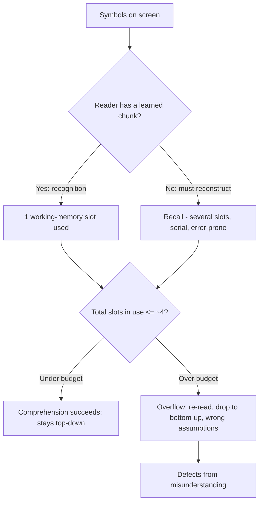

# Cognitive Load — Professional Level

> Focus: the science under the practice. Cognitive Load Theory applied to program comprehension; the working-memory limits (Miller's 7±2 vs Cowan's ~4); the empirical comprehension studies (Letovsky, von Mayrhauser, Siegmund's fMRI work); cyclomatic vs cognitive complexity — what each *actually* measures and whether either predicts defects; essential vs accidental complexity (Brooks; Out of the Tar Pit); local reasoning and the deep-module argument (Ousterhout); and why metrics fail under Goodhart's law.

---

## Table of Contents

1. [Cognitive Load Theory, properly stated](#cognitive-load-theory-properly-stated)
2. [Working memory: 7±2 is wrong; ~4 is closer](#working-memory-72-is-wrong-4-is-closer)
3. [What program-comprehension research actually found](#what-program-comprehension-research-actually-found)
4. [Chunking, notation, and the cost of recall](#chunking-notation-and-the-cost-of-recall)
5. [Cyclomatic vs cognitive complexity: what each measures](#cyclomatic-vs-cognitive-complexity-what-each-measures)
6. [Do complexity metrics predict bugs? The mixed evidence](#do-complexity-metrics-predict-bugs-the-mixed-evidence)
7. [Essential vs accidental complexity; state as the prime offender](#essential-vs-accidental-complexity-state-as-the-prime-offender)
8. [Local reasoning and the deep-module argument](#local-reasoning-and-the-deep-module-argument)
9. [The limits of metrics: Goodhart and gaming gocyclo](#the-limits-of-metrics-goodhart-and-gaming-gocyclo)
10. [The cost of context-switching](#the-cost-of-context-switching)
11. [Worked refactor: load accounting across Go, Java, Python](#worked-refactor-load-accounting-across-go-java-python)
12. [Common Mistakes](#common-mistakes)
13. [Test Yourself](#test-yourself)
14. [Cheat Sheet](#cheat-sheet)
15. [Summary](#summary)
16. [Further Reading](#further-reading)
17. [Related Topics](#related-topics)

---

## Cognitive Load Theory, properly stated

Cognitive Load Theory (CLT) comes from John Sweller's instructional-design research in the late 1980s (Sweller, *Cognitive Load During Problem Solving*, *Cognitive Science*, 1988). It partitions the mental effort of a task into three components. The clean-code instinct — "make code easy to read" — is, stated precisely, an exercise in minimizing one of these three.

| Load type | In learning | In code comprehension | Lever you control |
|---|---|---|---|
| **Intrinsic** | Inherent difficulty of the material | The essential complexity of the problem the code solves | Almost none — it is what it is |
| **Extraneous** | Effort wasted on poor presentation | Effort wasted decoding bad names, deep nesting, hidden control flow, clever one-liners | **All of it.** This is the entire target of clean code |
| **Germane** | Effort that builds durable schemas | Effort that builds an accurate mental model of the system | Maximized indirectly by minimizing extraneous load |

The single most useful framing for a senior engineer: **clean code is extraneous-load reduction.** You cannot make a distributed-consensus algorithm intrinsically simple — that is intrinsic load, bounded below by the problem. What you *can* do is stop spending the reader's finite working memory on `if (!(!a || b))`, on a function that mixes orchestration with bit-shifting, or on a boolean parameter whose meaning is invisible at the call site.

The total load is additive and bounded:

```
intrinsic + extraneous + germane  ≤  working-memory capacity
```

When the sum exceeds capacity, comprehension fails — the reader loses the thread, re-reads, and (the expensive part) makes incorrect assumptions. Every extraneous unit you remove is a unit the reader can spend on the actual problem (germane) or simply *not run out of capacity on*.

A consequence that surprises people: **adding code can reduce cognitive load.** Splitting a dense one-liner into three named lines increases line count but decreases extraneous load, because each named intermediate becomes a chunk the reader can hold as a single unit. Line count is not the metric; chunks-in-flight is.

---

## Working memory: 7±2 is wrong; ~4 is closer

George Miller's 1956 paper, *The Magical Number Seven, Plus or Minus Two*, is the most-cited and most-misquoted result in this area. Miller himself was careful: the "seven" referred to the span of *absolute judgment* and *immediate memory* across various stimuli, and he explicitly noted that the number depends heavily on chunking. The pop-science distillation — "humans hold 7 things in mind" — drops every caveat.

The more defensible modern figure comes from Nelson Cowan (*The Magical Number 4 in Short-Term Memory*, *Behavioral and Brain Sciences*, 2001). When you control for rehearsal and chunking — when subjects cannot silently rehearse the list — the capacity of the focus of attention is about **3 to 5 chunks, centered on 4.** For code review, where you are tracking live variable states, open branches, and invariants while reading, the rehearsal-free condition is the realistic one. **Budget for 4, not 7.**

The unit is the *chunk*, not the *symbol*. A chunk is a unit of meaning the reader has already learned to treat as one item. An expert reading `for i := range xs` consumes one chunk ("iterate"). A novice consumes four (`for`, `i`, `range`, `xs`) and still has to assemble them. This is exactly why the same code imposes different loads on different readers, and why "write for the least-experienced maintainer who will plausibly touch this" is sound advice — it accounts for their smaller chunk vocabulary.

Practical thresholds that fall out of the ~4 budget:
- A function that requires tracking **5+ live local variables** simultaneously is over budget for most readers. Extract a sub-computation to collapse several into one named result.
- **3+ levels of nesting** force the reader to hold 3+ active conditions; each `if` is a chunk that stays open until its block closes. Early returns close chunks immediately, freeing the slot.
- A boolean parameter list `process(data, true, false, true)` asks the reader to recall four positional meanings that are nowhere on screen — a pure working-memory tax with zero germane payoff.

---

## What program-comprehension research actually found

Program comprehension is a studied empirical field, not folklore. Three strands matter for a professional.

**Mental-model theories (1980s–90s).** Stanley Letovsky (*Cognitive Processes in Program Comprehension*, 1987) modeled programmers as opportunistic theorem-provers building a "knowledge base" of the program through a mix of bottom-up (reading code) and top-down (hypothesis-driven) inquiry. Anneliese von Mayrhauser and A. Marie Vans (*Program Comprehension During Software Maintenance and Evolution*, *IEEE Computer*, 1995) synthesized this into the **Integrated Metamodel**: experts fluidly switch between a *top-down* model (driven by domain hypotheses, used on familiar code), a *bottom-up* model (line-by-line, used on unfamiliar code), and a *program/situation* model linking the two. The actionable insight: **good code lets the reader stay top-down.** Clear names and consistent structure let an expert confirm a hypothesis ("this is the retry loop") without dropping into expensive line-by-line bottom-up reading. Extraneous load forces the costly mode.

**Eye-tracking studies.** Controlled eye-tracking (e.g., Busjahn, Bednarik, Begel et al., *Eye Movements in Code Reading*, ICPC 2015) showed that experienced developers do *not* read code like prose (left-to-right, top-to-bottom). They follow data and control flow, jump to definitions, and revisit. Linear "natural reading order" is a novice trait. This validates structuring code so that following the *flow* is cheap — order functions in call order, keep the happy path on the left margin — because that is the path expert eyes actually trace.

**fMRI.** Janet Siegmund et al., *Understanding Understanding Source Code with Functional Magnetic Resonance Imaging* (ICSE 2014), put programmers in an fMRI scanner reading code. Program comprehension lit up regions associated with **working memory, attention, and language processing** (Brodmann areas including BA 6, 21, 40, 44, 47) — not regions for raw mathematical/logical computation. Follow-up work (Siegmund et al., 2017; Peitek et al., 2020) tied measured comprehension difficulty to working-memory load and showed that beacons and well-structured code measurably reduce neural effort. The headline for engineers: **comprehension is bottlenecked on working memory and language, exactly the resources extraneous load consumes.** The science and the style guide agree.

---

## Chunking, notation, and the cost of recall

Chunking is the single most powerful lever because it multiplies effective capacity. If the reader can treat `applyDiscount(cart, coupon)` as one chunk, it occupies one of their ~4 slots; if they must inline-read the discount logic, it occupies several and may overflow.

Two forces make chunking work in code:

**1. Good names create chunks for free.** A name like `eligibleForFreeShipping` packs a condition into a single retrievable token. A name like `flag2` forces the reader to re-derive the meaning every encounter — defeating chunking and adding a *recall* cost on top.

**2. Recognition beats recall.** Reading a meaningful name is recognition (cheap, parallel, near-instant). Reconstructing what `process(data, true, false, true)` does is recall (slow, serial, error-prone). The booleans, the magic numbers, the abbreviations — each converts a recognition task into a recall task. This is the cognitive-science reason behind nearly every clean-code naming rule.

Notation matters too. The *density* of a notation trades against working-memory pressure. A regex `^\d{3}-\d{2}-\d{4}$` is one dense chunk to an expert and an opaque wall to a non-expert; a parser built from named combinators is more lines but more chunks-of-one. Neither is universally right — the correct choice depends on the chunk vocabulary of the maintaining team. Senior judgment is choosing notation density to match the audience, not maximizing terseness.



---

## Cyclomatic vs cognitive complexity: what each measures

Two metrics are routinely conflated. They measure different things and a senior should be able to say precisely what.

**Cyclomatic complexity (McCabe, 1976.)** Thomas McCabe defined it graph-theoretically: for a control-flow graph with `E` edges, `N` nodes, and `P` connected components,

```
M = E − N + 2P
```

Operationally, it equals **1 + the number of decision points** (`if`, `for`, `while`, `case`, `&&`, `||`, `?:`, `catch`). Its original purpose was *testability*: `M` is the number of linearly independent paths through the code, i.e., a lower bound on the test cases needed for path coverage. McCabe's paper proposed 10 as a module threshold. Crucially, **it was never designed to measure how hard code is to read** — it measures how hard code is to *test*.

This is why cyclomatic complexity badly misranks readability. A flat `switch` with 15 cases has cyclomatic complexity 15 but is trivially readable — each case is independent and the reader holds no nested state. A 3-deep nested loop with a couple of conditions has lower cyclomatic complexity but is far harder to follow. Cyclomatic complexity is **blind to nesting** and treats a flat switch and a deeply nested tangle as comparable.

**Cognitive complexity (Campbell / SonarSource, 2018.)** G. Ann Campbell's whitepaper *Cognitive Complexity: A new way of measuring understandability* was an explicit attempt to fix exactly that blindness. Its rules:

1. **No penalty for the shorthand that aids reading** (a `switch` counts as a single increment, not one-per-case; a method call is free).
2. **Increment for every break in linear flow** (`if`, `else`, `for`, `while`, `catch`, `&&`/`||` *sequences*, `goto`, recursion).
3. **Nesting multiplies.** An `if` at nesting level 3 adds `1 + 3 = 4`, not 1. This is the key correction — it encodes the working-memory cost of holding multiple open conditions.

So the flat 15-case switch scores ~1–2 cognitive (very readable), while the 3-deep nested tangle scores high (genuinely hard). Cognitive complexity is a deliberate operationalization of extraneous load: it charges for nesting and for control-flow discontinuities, which is precisely what overflows the ~4-slot budget.

| Property | Cyclomatic (McCabe '76) | Cognitive (SonarSource '18) |
|---|---|---|
| Designed to measure | Test paths / testability | Understandability |
| Flat switch (15 cases) | 15 | ~1–2 |
| Penalizes nesting | No | Yes (multiplicatively) |
| `&&`/`||` | +1 each | +1 per *sequence*, not per operator |
| Recursion | Not counted | Counted |
| Right question it answers | "How many tests for path coverage?" | "How hard is this to hold in my head?" |

For *readability* discussions, cite cognitive complexity. For *test-effort* discussions, cite cyclomatic. Conflating them is a common interview tell.

---

## Do complexity metrics predict bugs? The mixed evidence

The honest professional answer is: **weakly, and mostly because they correlate with size.** This is a field with a lot of papers and a lot of disagreement.

The most important confound is **size (SLOC).** Big modules have more bugs and more decision points; once you control for lines of code, the independent predictive power of cyclomatic complexity often collapses. The classic skeptical result is Shepperd's *A critique of cyclomatic complexity as a software metric* (1988), which argued the metric is poorly grounded and largely a proxy for size. Later large studies are mixed: some (e.g., work on NASA and industrial datasets) find correlations with defect density; others find that after normalizing for SLOC, complexity adds little. El Emam et al. (2001), *The confounding effect of class size on the validity of object-oriented metrics*, showed many OO metrics' apparent defect-prediction power vanishes once class size is held constant — a direct caution against believing a metric "predicts bugs" before you've checked it isn't just measuring size.

Cognitive complexity is newer and less validated. SonarSource's own studies report it tracks human-judged understandability better than cyclomatic; independent replications (e.g., work analyzing whether it predicts comprehension time / correctness) are encouraging but limited, and it inherits the same size confound.

The defensible stance for a senior engineer:
- Treat complexity metrics as **smoke detectors, not verdicts.** A high score flags a candidate for a human look; it does not prove the code is bad, and a low score does not prove it is good.
- **Never** put a hard build-failing gate on an absolute complexity number without a deliberate, agreed rationale — you will get gaming, not better code (next sections).
- The strongest single predictor of defects in most studies is **change frequency / churn × complexity** (hotspots), not complexity alone. Adam Tornhill's *Your Code as a Crime Scene* operationalizes this well: refactor the files that are *both* complex *and* changed often, because those are where the load actually costs you.

---

## Essential vs accidental complexity; state as the prime offender

Fred Brooks, *No Silver Bullet* (1986), drew the foundational distinction:

- **Essential complexity** is inherent in the problem — the irreducible difficulty of the thing you are modeling. You cannot refactor it away because it is the problem.
- **Accidental complexity** is introduced by our tools, languages, and choices — and is therefore *removable*.

This maps cleanly onto CLT: essential complexity is intrinsic load; accidental complexity is the source of most extraneous load. Brooks' pessimistic thesis was that we'd already eliminated most accidental complexity (high-level languages, etc.), so no future tool would yield an order-of-magnitude productivity gain. Whether or not that holds, the categorization is the durable contribution.

The sharpest follow-on is Ben Moseley and Peter Marks, *Out of the Tar Pit* (2006). Their central claim: **the largest single source of accidental complexity is mutable state**, with control flow a close second. State is hard because:

- The number of reachable states is multiplicative — `n` mutable booleans give `2ⁿ` states, and a reader (or test) must reason about the live ones.
- State introduces *temporal coupling*: behavior depends on the order operations ran, which is invisible in the static text. The reader must mentally execute to know the state, consuming working memory.

Their prescription — minimize mutable state, push it to the edges, prefer pure functions and "functional-relational" cores — is the deep reason behind the immutability and pure-function advice in clean code. Every mutable variable you eliminate is a dimension removed from the state space the reader must track.

```go
// High extraneous load: reader must mentally execute to know `status` and `total`
// at the point of the discount check — temporal coupling on two mutable vars.
func price(items []Item, coupon string) (int, string) {
    total := 0
    status := "ok"
    for _, it := range items {
        total += it.Cents
        if it.Restricted && coupon != "" {
            status = "coupon_void"   // mutation buried in a loop, far from its read
        }
    }
    if status == "ok" {
        total = applyCoupon(total, coupon)
    }
    return total, status
}

// Lower load: each value is computed once, named, and never mutated.
// The reader recognizes three chunks; no mental execution required.
func priceClean(items []Item, coupon string) (int, string) {
    subtotal := sum(items)
    if hasRestricted(items) && coupon != "" {
        return subtotal, "coupon_void"   // early return closes the branch
    }
    return applyCoupon(subtotal, coupon), "ok"
}
```

---

## Local reasoning and the deep-module argument

The property that makes code cheap to read is **local reasoning**: you can understand a piece of code by looking only at that piece plus the *interfaces* of what it calls — never their implementations. Local reasoning is the operational definition of low cognitive load. When it holds, comprehension cost is bounded by the size of the local context (which you can keep under ~4 chunks). When it fails — hidden control flow, action-at-a-distance via shared state, side effects in getters — the reader must expand context until it overflows.

John Ousterhout, *A Philosophy of Software Design* (2018), gives the complementary design principle: **deep modules.** A module's value is its functionality (the "depth") divided by the cost of its interface (the "width" the reader must learn). A deep module is a simple interface hiding substantial implementation — it lets callers reason locally because they only pay for the narrow interface. A *shallow* module (thin wrapper, leaky abstraction, or a class that just forwards calls) is a net cognitive loss: it adds interface to learn without hiding meaningful complexity. Ousterhout's blunt warning — "classitis," the cult of many tiny classes — is a direct counter to over-decomposition: splitting a function into ten one-line helpers can *increase* load by multiplying interfaces and forcing the reader to chase across files (more context-switching, below). Decompose to create *chunks with real depth*, not to hit a line-count target.

This is the resolution to the apparent tension with "small functions." Small functions help when each is a genuine chunk that hides complexity; they hurt when they are shallow pass-throughs that fragment a single thought across many shallow interfaces.

---

## The limits of metrics: Goodhart and gaming gocyclo

Goodhart's law (Marilyn Strathern's formulation, 1997): *"When a measure becomes a target, it ceases to be a good measure."* Complexity gates are a textbook case.

Put a hard `gocyclo` or SonarQube cyclomatic limit on the build, and engineers will satisfy the *number*, not the *intent*:

```go
// Original: gocyclo flags this at 11. Genuinely a bit much, but honest.
func classify(x int) string {
    if x < 0 { return "neg" }
    if x == 0 { return "zero" }
    if x < 10 { return "small" }
    if x < 100 { return "medium" }
    // ... several more
}

// "Fixed" to pass gocyclo: complexity is now hidden, not reduced.
// The reader must open a table AND a lookup helper. Local reasoning is WORSE,
// but the metric reads ~2. This is pure Goodhart gaming.
var buckets = []struct{ hi int; name string }{{0,"neg"},{1,"zero"},{10,"small"}/*...*/}
func classify(x int) string { return lookup(buckets, x) }
```

Common gaming moves, all of which *lower the metric while raising or merely relocating real load*:
- Replacing `&&`/`||` chains with nested `if`s (cyclomatic same, cognitive *worse* due to nesting — and vice versa for the other metric).
- Extracting a deeply-nested block into a shallow helper that's only called once (cyclomatic of the parent drops; total reader context unchanged or worse).
- Splitting a switch across files.
- Pushing logic into config/data tables that no metric inspects.

The senior posture: use complexity metrics as **advisory CI signals on the delta** (flag *increases* in a PR for human discussion), not as absolute hard gates. Pair them with the hotspot view (complexity × churn) so attention goes to code that is both complex *and* actively painful. And review the *direction of travel*, not the absolute number — a refactor that moves a hotspot from 40 to 25 is a win even though 25 still "fails" an arbitrary threshold.

---

## The cost of context-switching

Working memory is not just consumed by the code on screen; it is *evicted* by interruptions and by code that forces you to jump. Two distinct costs:

**External interruptions.** Empirical studies of developers (e.g., Parnin & Rugaber, *Resumption Strategies for Interrupted Programming Tasks*, 2011; and broader interruption research summarized by Tom DeMarco & Timothy Lister in *Peopleware*) find that resuming a coding task after an interruption takes on the order of **10–15+ minutes** to rebuild the working-memory context that was paged out. The cost is the *reconstruction of the mental model*, not the interruption itself. This is why open-plan-office interruptions are disproportionately expensive for programming versus many other knowledge tasks: the held state is large and fragile.

**Internal, code-induced switches.** Code that forces the reader to jump — to a definition in another file, to a base class three levels up, to a config table, to a callback registered elsewhere — triggers a *micro* context switch. Each jump partially evicts the local context the reader was building. This is the hidden cost of over-decomposition and of "spooky action at a distance": a function spread across ten files reads as ten context switches, even if each piece is individually trivial. Ousterhout's deep-module principle and the "keep related things close" heuristic exist precisely to minimize these forced jumps. The relevant design metric is not lines per function but **how many places the reader must visit to understand one behavior.**

The practical synthesis: minimize *both* — protect humans from interruptions (focus blocks, async communication) *and* write code whose happy path can be understood without leaving the screen.

---

## Worked refactor: load accounting across Go, Java, Python

Same logic, three languages, with explicit chunk accounting. The "before" overflows the ~4-slot budget; the "after" keeps each named result to one slot.

```java
// Java — BEFORE: ~6 live items (n, total, hasGold, applied, tier, the open if/for),
// nested 3 deep, a boolean param flips behavior invisibly at the call site.
double charge(List<Item> items, boolean rush, boolean member) {
    double total = 0;
    for (Item it : items) {
        if (it.inStock()) {
            if (member && it.discountable()) {
                total += it.price() * (rush ? 1.2 : 0.9);
            } else {
                total += it.price() * (rush ? 1.2 : 1.0);
            }
        }
    }
    return total;
}

// Java — AFTER: named chunks, no boolean-soup, early filtering, one nesting level.
double charge(List<Item> items, ShippingSpeed speed, Membership m) {
    double subtotal = items.stream()
        .filter(Item::inStock)
        .mapToDouble(it -> it.price() * discountFor(it, m))
        .sum();
    return subtotal * speed.multiplier();   // ShippingSpeed.RUSH = 1.2, STANDARD = 1.0
}
```

```python
# Python — AFTER. slots not relevant here; the win is chunking + named enum,
# replacing positional booleans (member, rush) that were invisible at the call site.
def charge(items: list[Item], speed: ShippingSpeed, membership: Membership) -> Decimal:
    in_stock = (it for it in items if it.in_stock)
    subtotal = sum(it.price * discount_for(it, membership) for it in in_stock)
    return subtotal * speed.multiplier   # ShippingSpeed.RUSH.multiplier == Decimal("1.2")
```

```go
// Go — AFTER. Early continue closes the branch; speed is a named type, not a bool.
func charge(items []Item, speed ShippingSpeed, m Membership) float64 {
    subtotal := 0.0
    for _, it := range items {
        if !it.InStock {
            continue                       // close the chunk immediately
        }
        subtotal += it.Price * discountFor(it, m)
    }
    return subtotal * speed.Multiplier()
}
```

The measurable readability change is not line count (roughly unchanged) but **maximum simultaneous open chunks**: from ~6 to ~2–3, comfortably inside Cowan's budget. Cognitive complexity drops sharply (nesting removed); cyclomatic barely moves (same number of decisions) — a concrete demonstration of which metric tracks readability.

---

## Common Mistakes

1. **Quoting "7±2" as a capacity limit.** Miller's number was about absolute judgment and explicitly chunking-dependent. For rehearsal-free tracking during code review, budget ~4 (Cowan). Citing 7 over-estimates how much complexity readers tolerate.
2. **Treating cyclomatic complexity as a readability metric.** It measures test paths and is blind to nesting. A flat 20-case switch (readable) outscores a 3-deep tangle (unreadable). Use cognitive complexity for understandability claims.
3. **Believing complexity "predicts bugs" unconditionally.** Most of the apparent predictive power is the size confound (Shepperd 1988; El Emam 2001). After controlling for SLOC, the independent signal is weak. Use complexity × churn (hotspots) instead.
4. **Hard build gates on absolute complexity numbers.** Pure Goodhart bait — engineers game the metric (split files, push logic to tables) and relocate load instead of removing it. Gate on the *delta* and review direction of travel.
5. **Over-decomposition ("classitis").** Splitting one thought into ten shallow one-line helpers multiplies interfaces and forces context switches, *raising* load. Decompose to create deep chunks, not to hit a size target (Ousterhout).
6. **Optimizing line count.** Fewer lines ≠ lower load. A clever one-liner is one dense chunk that often requires recall; three named lines are three recognition chunks. Minimize chunks-in-flight, not characters.
7. **Ignoring state as the dominant offender.** Naming and formatting are second-order; mutable state and temporal coupling create the multiplicative state space readers must track (Out of the Tar Pit). Reduce mutation first.
8. **Confusing intrinsic with extraneous load.** You cannot refactor a hard problem into an easy one — that's intrinsic. Don't blame the code (or the author) for irreducible difficulty; spend your effort on the extraneous part you actually control.

---

## Test Yourself

1. **A teammate says "this function fails gocyclo at 14, so it's too complex to read." Is the inference valid?**

<details><summary>Answer</summary>
No — the inference is unsound. Cyclomatic complexity (McCabe 1976) measures the number of independent control-flow paths, i.e., test effort, not readability. It is blind to nesting: a flat 14-case switch scores 14 yet is trivially readable. Reach for cognitive complexity (SonarSource 2018), which penalizes nesting multiplicatively and ignores readability-neutral shorthand like switch, to make a readability claim. Better still, look at the code: is there deep nesting, hidden control flow, or many live variables? The number is a smoke detector, not a verdict.
</details>

2. **Why is "~4 chunks" a better working-memory budget than "7±2" for code review?**

<details><summary>Answer</summary>
Miller's 7±2 (1956) described absolute-judgment/immediate-memory span and was explicitly chunking-dependent. Cowan (2001) showed that when rehearsal and chunking are controlled — the realistic condition while actively tracking variable states and open branches during review — capacity is ~3–5, centered on 4. Reviewing code is a rehearsal-free tracking task, so budget for 4. The unit is the chunk, not the symbol, which is why experts (larger chunk vocabulary) tolerate more dense code than juniors.
</details>

3. **A refactor moves a hotspot from cognitive complexity 40 to 25, but your CI gate fails anything above 15. Ship it?**

<details><summary>Answer</summary>
Yes — and treat the failing gate as evidence the gate is misconfigured, not that the refactor is bad. Absolute hard thresholds are Goodhart traps; what matters is the direction of travel on a file that is both complex and churning (a hotspot). Going 40→25 is a clear improvement in local reasoning. The right CI policy flags increases in a PR's delta for human discussion, not absolute numbers that block legitimate progress and incentivize gaming (splitting across files, pushing logic to data tables).
</details>

4. **Explain, in CLT terms, why splitting a dense one-liner into three named lines can lower cognitive load despite adding lines.**

<details><summary>Answer</summary>
Line count is not the load metric; simultaneous chunks-in-flight is. A dense one-liner is one chunk that often requires recall (mentally reconstructing what it does). Three named intermediates convert that into three recognition tasks (cheap, near-instant, parallel) and let the reader hold each named result as a single retrievable chunk in working memory. This reduces extraneous load and frees capacity for the actual problem (germane load), even though intrinsic load is unchanged.
</details>

5. **What does Siegmund's fMRI study (ICSE 2014) tell us that the style guides didn't already?**

<details><summary>Answer</summary>
It provides neural evidence that program comprehension activates working-memory, attention, and language-processing regions — not raw logic/arithmetic regions. That confirms comprehension is bottlenecked on exactly the resources extraneous load consumes (working memory, language), grounding clean-code advice in measurement rather than aesthetics. Follow-ups showed beacons and good structure measurably reduce neural effort. It turns "this is easier to read" from opinion into a falsifiable, physiological claim.
</details>

6. **A reviewer claims your domain logic is "too complex" and demands you simplify it. The complexity is irreducible business rules. How do you respond using Brooks' framework?**

<details><summary>Answer</summary>
Distinguish essential from accidental complexity (Brooks, No Silver Bullet). If the difficulty is inherent to the business rules, it is essential complexity (intrinsic load) and cannot be refactored away — the code can only present it as clearly as possible. Demonstrate that the extraneous load is already minimized (good names, shallow nesting, minimal mutable state, deep modules). If the reviewer can point to accidental complexity — unnecessary state, hidden control flow, leaky interfaces — that is fair game and you remove it. But "simplify the essence" is a category error.
</details>

7. **Why might over-decomposition into many tiny functions *increase* cognitive load?**

<details><summary>Answer</summary>
Each shallow function adds an interface the reader must learn (Ousterhout's depth/width ratio) without hiding meaningful complexity, and understanding one behavior now requires visiting many places — each jump is a micro context-switch that partially evicts the local model the reader was building. This is "classitis." Decomposition helps only when each piece is a deep chunk that genuinely encapsulates complexity; fragmenting a single thought across ten shallow pass-throughs multiplies interfaces and forced jumps, raising total load.
</details>

8. **Out of the Tar Pit names a single dominant source of accidental complexity. What is it, and why does it dominate working-memory cost?**

<details><summary>Answer</summary>
Mutable state (with control flow second). State dominates because the reachable state space grows multiplicatively (n mutable booleans → 2ⁿ states) and it introduces temporal coupling: behavior depends on the order operations ran, which is invisible in the static text, so the reader must mentally execute the code to know the current state — directly consuming working memory. Reducing mutation removes whole dimensions from the space the reader must track, which is why it outranks naming and formatting as a lever.
</details>

---

## Cheat Sheet

| Concept | One-line takeaway | Source |
|---|---|---|
| CLT three loads | Clean code = minimizing **extraneous** load | Sweller 1988 |
| Working-memory budget | Plan for **~4 chunks**, not 7 | Cowan 2001 (cf. Miller 1956) |
| Chunk, not symbol | Experts hold more because they have a bigger chunk vocabulary | — |
| Recognition > recall | Names enable recognition; booleans/magic numbers force recall | — |
| Cyclomatic complexity | Counts decision points = **test paths**; blind to nesting | McCabe 1976 |
| Cognitive complexity | Penalizes **nesting** multiplicatively; tracks understandability | SonarSource 2018 |
| Metrics vs bugs | Mostly the **size** confound; weak independent signal | Shepperd 1988; El Emam 2001 |
| Hotspots | Refactor where complexity **×** churn is high | Tornhill |
| Essential vs accidental | Only accidental complexity is removable | Brooks 1986 |
| State is the offender | Mutable state is the prime accidental complexity | Moseley & Marks 2006 |
| Local reasoning | Understand a unit from itself + callee interfaces only | — |
| Deep modules | Maximize functionality ÷ interface width; avoid classitis | Ousterhout 2018 |
| Goodhart | Hard metric gates get gamed; gate on the **delta** | Strathern 1997 |
| Context-switch cost | ~10–15 min to rebuild paged-out mental model | Parnin & Rugaber 2011 |

Quick thresholds: **5+ live locals**, **3+ nesting levels**, **boolean param soup**, or **a unit you must read across 3+ files** → over budget; refactor.

---

## Summary

Cognitive load is not a vibe — it is a measurable, theory-backed property of how code interacts with finite human working memory. Cognitive Load Theory tells us our entire lever is **extraneous load**: we cannot touch the intrinsic difficulty of the problem (essential complexity, Brooks), but we can stop wasting the reader's ~4 working-memory slots (Cowan, not Miller's misquoted 7) on bad names, deep nesting, hidden control flow, and boolean soup. Program-comprehension research — Letovsky and von Mayrhauser's mental models, eye-tracking, and Siegmund's fMRI — converges on the same conclusion: comprehension is bottlenecked on working memory and language, exactly the resources extraneous load drains.

When you reason about metrics, be precise: **cyclomatic complexity measures testability** (McCabe), **cognitive complexity measures understandability** (SonarSource), and **neither reliably predicts bugs** once you control for size (Shepperd, El Emam) — use complexity × churn hotspots instead. And never weaponize a metric into a hard gate; Goodhart guarantees you'll get gaming, not clarity. The deepest levers are structural: minimize mutable state (Out of the Tar Pit), preserve local reasoning, build deep modules rather than a swarm of shallow ones (Ousterhout), and minimize both human interruptions and code-induced context switches. Do those, and the reader's working memory is spent on the problem — which is the whole point.

---

## Further Reading

- John Sweller, *Cognitive Load During Problem Solving* (Cognitive Science, 1988) — the origin of CLT.
- George A. Miller, *The Magical Number Seven, Plus or Minus Two* (Psychological Review, 1956) — read the caveats, not the slogan.
- Nelson Cowan, *The Magical Number 4 in Short-Term Memory* (Behavioral and Brain Sciences, 2001) — the better budget.
- Janet Siegmund et al., *Understanding Understanding Source Code with Functional MRI* (ICSE 2014).
- Anneliese von Mayrhauser & A. Marie Vans, *Program Comprehension During Software Maintenance and Evolution* (IEEE Computer, 1995).
- Thomas McCabe, *A Complexity Measure* (IEEE TSE, 1976) — cyclomatic, in McCabe's own words.
- G. Ann Campbell / SonarSource, *Cognitive Complexity: A new way of measuring understandability* (2018).
- Martin Shepperd, *A critique of cyclomatic complexity as a software metric* (1988).
- Fred Brooks, *No Silver Bullet — Essence and Accident in Software Engineering* (1986).
- Ben Moseley & Peter Marks, *Out of the Tar Pit* (2006).
- John Ousterhout, *A Philosophy of Software Design* (2018) — deep modules, classitis.
- Adam Tornhill, *Your Code as a Crime Scene* — complexity × churn hotspots.

---

## Related Topics

- [senior.md](senior.md) — practitioner-level heuristics and refactors for cognitive load.
- [interview.md](interview.md) — interview Q&A across all levels.
- [Chapter README](../README.md) — the positive rules this chapter inverts.
- [Abstraction and Information Hiding](../22-abstraction-and-information-hiding/README.md) — deep modules and local reasoning in depth.
- [Formatting](../04-formatting/README.md) — visual chunking, vertical density, and the happy-path margin.
- [Refactoring](../../refactoring/README.md) — the mechanical moves (Extract Method, Replace Temp, Decompose Conditional) that reduce extraneous load.
