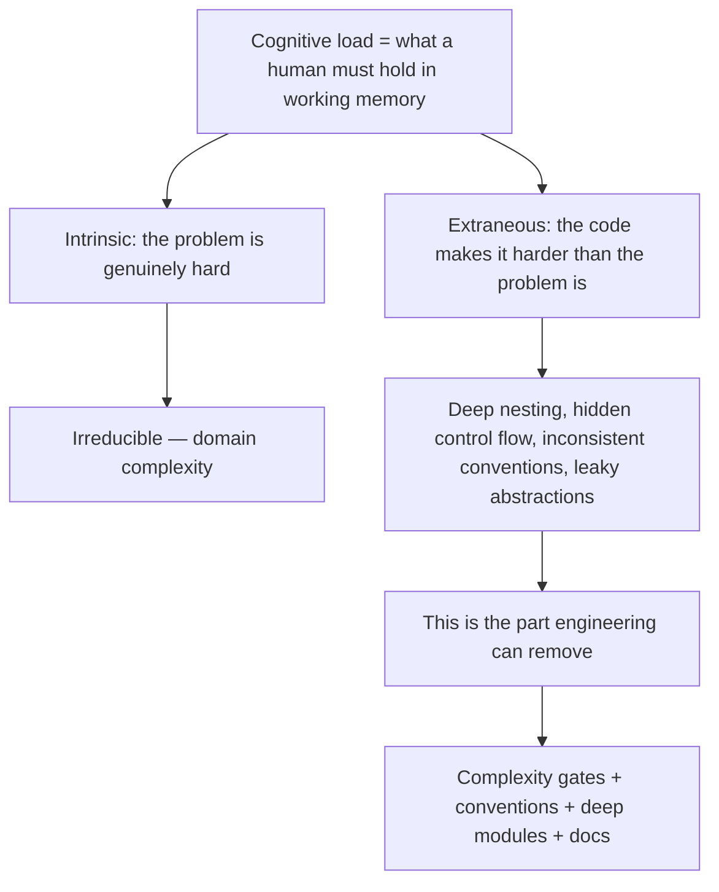

# Cognitive Load — Senior Level

> Focus: "How do I keep cognitive load low across a whole codebase and a whole team?" — complexity gates in CI, metrics as a guide (not a target), team-scale load, local-reasoning architecture, the cost of incidental complexity at scale, and offloading memory into docs and ADRs.

---

## Table of Contents

1. [Cognitive load is the real bottleneck](#cognitive-load-is-the-real-bottleneck)
2. [Measuring it: cyclomatic vs. cognitive complexity](#measuring-it-cyclomatic-vs-cognitive-complexity)
3. [Complexity gates in CI (real config)](#complexity-gates-in-ci-real-config)
4. [Metrics as a guide, not a gate (Goodhart's Law)](#metrics-as-a-guide-not-a-gate-goodharts-law)
5. [Reducing *team* cognitive load](#reducing-team-cognitive-load)
6. [Local-reasoning architecture: deep modules, isolated state](#local-reasoning-architecture-deep-modules-isolated-state)
7. [Essential vs. accidental complexity at scale](#essential-vs-accidental-complexity-at-scale)
8. [Code review for complexity](#code-review-for-complexity)
9. [Offloading memory: docs, ADRs, and onboarding as a metric](#offloading-memory-docs-adrs-and-onboarding-as-a-metric)
10. [Managing the load of a large system: bounded contexts and seams](#managing-the-load-of-a-large-system-bounded-contexts-and-seams)
11. [Common Mistakes](#common-mistakes)
12. [Test Yourself](#test-yourself)
13. [Cheat Sheet](#cheat-sheet)
14. [Summary](#summary)
15. [Further Reading](#further-reading)
16. [Related Topics](#related-topics)

---

## Cognitive load is the real bottleneck

Every other quality metric is a proxy for one thing: **how much a human must hold in their head to safely change this code.** A method that is "too long" matters only because the reader must keep more state in working memory. A clever one-liner is "bad" only because decoding it costs more than reading three plain lines.

Working memory holds roughly **4 ± 1 chunks** (Cowan's revision of Miller's "7 ± 2"). When a function forces you to track more than that — five in-flight conditions, three mutable variables, two hidden side effects — you stop reasoning and start guessing. Bugs follow.

At the senior scale the question shifts from "is *this function* readable?" to **"does the system, as a whole, let a new engineer reason locally about any one part without loading the rest into memory?"** That is the property we measure, gate, and architect for.



Borrowing from learning theory: load splits into **intrinsic** (the problem is hard) and **extraneous** (the presentation makes it harder). Engineering cannot reduce intrinsic load — payroll tax rules are complicated no matter how you write them. It can eliminate almost all extraneous load. Senior work is systematically attacking the extraneous kind across an entire codebase.

---

## Measuring it: cyclomatic vs. cognitive complexity

You can't manage what you don't measure, but you must measure the *right* thing.

**Cyclomatic complexity** (McCabe, 1976) counts linearly independent paths — essentially `1 + (number of decision points)`. It is blind to nesting: a flat 10-branch `switch` scores the same as 10 deeply nested `if`s. It is excellent for one purpose — estimating the **number of tests** needed to cover all paths — and poor as a readability proxy.

**Cognitive complexity** (SonarSource, 2018) was designed explicitly to model human reading effort. Three rules:

1. **Increment** for each break in linear flow (`if`, `for`, `catch`, `&&` chains, `goto`).
2. **Add a nesting penalty** — a branch nested 3 levels deep costs more than a top-level branch.
3. **Don't penalize** shorthand that aids reading (a `switch` counts once, not once per `case`).

```python
def classify(x):              # cognitive: 0
    if x > 0:                 # +1
        if x > 100:           # +2  (+1 base, +1 nesting)
            if x > 1000:      # +3  (+1 base, +2 nesting)
                return "huge"
    return "small"
# Cyclomatic: 4. Cognitive: 6.
# The cognitive score reflects the real cost: you hold 3 stacked conditions.
```

Rewriting with guard clauses (early returns) flattens nesting and drops the cognitive score even though the cyclomatic score barely moves — which is exactly the lesson: **the number of branches is the same, the load is not.**

| Property | Cyclomatic | Cognitive |
|---|---|---|
| Counts decision points | Yes | Yes |
| Penalizes nesting | No | Yes |
| Best for | Test-count planning | Maintainability gating |
| `switch`/`match` | Counts each case | Counts once |
| Recommended per-function threshold | ~10 | **15 warn / 25 fail** |

**Use cognitive complexity for your maintainability gate.** Keep cyclomatic around for test-coverage planning.

---

## Complexity gates in CI (real config)

The goal: catch a function that crosses the threshold *in the PR that introduced it*, when it is 30 lines, not three years later when it is 300. Below are working configs for the three target languages.

### Go — golangci-lint (`gocyclo` + `gocognit`)

```yaml
# .golangci.yml
linters:
  enable:
    - gocyclo    # cyclomatic, per function
    - gocognit   # cognitive complexity (SonarSource model)
    - nestif     # flags deeply nested if blocks specifically
    - funlen     # function length guard

linters-settings:
  gocyclo:
    min-complexity: 15
  gocognit:
    min-complexity: 20
  nestif:
    min-complexity: 4   # flag 4+ nested ifs
  funlen:
    lines: 80
    statements: 50

issues:
  # Generated and test files often have justified high complexity
  exclude-rules:
    - path: _test\.go
      linters: [funlen, gocognit]
    - path: \.pb\.go
      linters: [gocyclo, gocognit, funlen]
```

```bash
# Gate on changed code only — the practical move for a legacy repo
golangci-lint run --new-from-rev=origin/main
```

### Python — radon + xenon (or ruff)

```bash
# radon reports; ranks A (best) .. F (worst)
radon cc src/ --min C --show-complexity   # show functions ranked C or worse

# xenon turns radon into a CI gate that returns a non-zero exit code
xenon --max-absolute B --max-modules A --max-average A src/
#   --max-absolute B : no single block may exceed rank B
#   --max-modules  A : every module's average must be rank A
#   --max-average  A : whole-codebase average must be rank A
```

```toml
# pyproject.toml — ruff covers the same ground, faster, in one tool
[tool.ruff.lint]
select = ["C90", "PLR0911", "PLR0912", "PLR0915"]
# C90  -> mccabe cyclomatic
# PLR0911 too-many-return-statements
# PLR0912 too-many-branches
# PLR0915 too-many-statements

[tool.ruff.lint.mccabe]
max-complexity = 10
```

### Java — Checkstyle + PMD + SonarQube

```xml
<!-- checkstyle.xml -->
<module name="TreeWalker">
  <module name="CyclomaticComplexity">
    <property name="max" value="10"/>
  </module>
  <module name="NPathComplexity">          <!-- counts execution paths -->
    <property name="max" value="200"/>
  </module>
  <module name="JavaNCSS">                  <!-- non-comment source statements -->
    <property name="methodMaximum" value="50"/>
  </module>
</module>
```

PMD ships a dedicated `CognitiveComplexity` rule (SonarSource model), and SonarQube's `java:S3776` is the canonical cognitive-complexity gate:

```xml
<!-- pmd-ruleset.xml -->
<rule ref="category/java/design.xml/CognitiveComplexity">
  <properties>
    <property name="reportLevel" value="15"/>
  </properties>
</rule>
```

```properties
# sonar-project.properties — quality gate on NEW code, the key setting
sonar.qualitygate.wait=true
# In the Quality Gate UI: "Cognitive Complexity on New Code" condition,
# rule java:S3776 set to fail above 15.
```

> **The single most important CI setting across all three:** *gate on new/changed code, not the whole repo.* `--new-from-rev`, `xenon` on a diff, or Sonar's "New Code" period. This lets you adopt strict thresholds on a legacy codebase without a 10,000-violation wall on day one. The backlog shrinks as files are touched.

---

## Metrics as a guide, not a gate (Goodhart's Law)

> "When a measure becomes a target, it ceases to be a good measure." — Charles Goodhart

Complexity numbers are a flashlight, not a finish line. The failure modes are predictable:

- **Threshold gaming.** A 40-line function exceeding the limit gets split into `processOrderPart1` and `processOrderPart2` that share five parameters and must be read together. The metric improved; the load got *worse* — now the reader holds an extra hop and a shared mutable context. (See the temporal-coupling smell in [`../../refactoring/README.md`](../../refactoring/README.md).)
- **Optimizing the measurable, ignoring the real.** Cognitive complexity says nothing about misleading names, leaky abstractions, or surprising side effects — all of which cost more than a branch. A function can score a perfect 3 and still be unreadable because it is named `handle` and mutates a global.
- **False precision.** "15" is a convention, not physics. Treat a function at 16 as a *prompt for a human conversation in review*, not an automatic rejection.

Practical stance:

1. Use the gate to **prevent regressions** ("don't make it worse") and to **flag for review**, not to mechanically reject.
2. Allow scoped, justified suppressions (`//nolint:gocognit // state machine, splitting hurts readability`) — and require the comment to say *why*.
3. Watch **trend, not absolute**: is the codebase's complexity climbing PR over PR? That signal is more honest than any single number.
4. Remember the metric is a proxy for the goal — *local reasoning* — and when they conflict, the goal wins.

---

## Reducing *team* cognitive load

A single function lives in one head for ten minutes. A **convention** lives in twenty heads for years. At team scale, the highest-leverage cognitive-load reductions are about *consistency*, not cleverness.

### The Principle of Least Surprise

Code should behave the way a competent reader expects from its name, signature, and context. A `getUser(id)` that also writes an audit log, mutates a cache, and fires an event is a surprise tax paid by every future reader. Surprise is unbudgeted cognitive load.

| Conventional → low load | Surprising → high load |
|---|---|
| Getters are pure reads | Getter with side effects |
| Same error model everywhere (`Result`/exceptions, not both) | Half the code returns errors, half throws |
| One logging facade, one config loader | Three logging styles, four config patterns |
| Folder layout mirrors the architecture | Files placed by accident of history |
| One way to do HTTP, one way to access the DB | Each module invents its own |

### Consistency is a feature

When every service in the org uses the same project layout, the same dependency-injection style, the same test structure, an engineer who knows *one* service can navigate *all* of them. The cost of context-switching collapses. This is why org-wide **standardized scaffolding** (a `create-service` generator, a shared linter config, a golden-path template) pays for itself many times over — it amortizes a learning cost across the whole organization.

Consistency beats local optimality. A slightly suboptimal pattern used *everywhere* imposes less total load than the locally-best pattern used *here* and a different locally-best pattern used *there*. Variety is the thing that costs.

### Onboarding time as a load metric

The single best aggregate measure of a codebase's cognitive load is **time-to-first-meaningful-PR for a new hire**. It is a real, observed integral of every surprise, every undocumented assumption, every inconsistent convention. If it takes six weeks, the codebase is telling you something the complexity linter cannot. Track it; treat regressions in it as bugs.

---

## Local-reasoning architecture: deep modules, isolated state

John Ousterhout's *A Philosophy of Software Design* frames the central goal precisely: **maximize the functionality hidden behind each interface, minimize the interface itself.** A module is "deep" when it offers a small, simple interface over a large, complex implementation.

```
Deep module (low load):    [ tiny interface ]
                            [    big hidden   ]
                            [ implementation  ]

Shallow module (high load): [ wide interface  ]   <- you must learn all of it
                            [ thin impl       ]   <- and it hides nothing
```

A shallow module — one whose interface is nearly as complicated as its implementation — adds cost without removing any. The classic example is a "pass-through" method that just forwards to another method with the same signature: pure interface, zero hiding.

**Local reasoning** is the property that you can understand and safely modify a module by reading *that module*, without holding the rest of the system in your head. Three architectural levers:

1. **Small interfaces.** The fewer things a caller must know, the less they load. Information hiding (see [`../22-abstraction-and-information-hiding/README.md`](../22-abstraction-and-information-hiding/README.md)) is the mechanism.
2. **Isolated state.** Shared mutable state is the enemy of local reasoning — to understand any reader of a global, you must understand every writer of it. Push state to the edges, prefer immutability, pass dependencies explicitly. A pure function (see [`../15-pure-functions/README.md`](../15-pure-functions/README.md)) is the maximally local-reasoning unit: its output depends only on its inputs.
3. **No hidden control flow.** Exceptions used for normal cases, `goto`-like callbacks, and action-at-a-distance all force the reader to trace flow they can't see locally. Keep control flow visible at the call site.

> Ousterhout's counter-intuitive point: **more, smaller classes can *increase* load** if each is shallow. "Classes should be deep" pushes back against dogmatic over-decomposition. The metric to optimize is interface-to-implementation ratio, not class count.

---

## Essential vs. accidental complexity at scale

Fred Brooks (*No Silver Bullet*, 1986) split complexity into **essential** (inherent in the problem) and **accidental** (introduced by our tools and choices). *Out of the Tar Pit* (Moseley & Marks, 2006) sharpened this and named the largest source of accidental complexity in real systems: **state, and the control flow needed to manage it.**

The Tar Pit thesis, compressed:

- Complexity is the root cause of most software defects, because it exceeds what humans can reason about.
- **Mutable state** is the dominant source of *accidental* complexity. Every piece of mutable state multiplies the number of system configurations you must reason about — *n* booleans give you 2ⁿ states.
- The cure is to **minimize and isolate** state: derive what you can (avoid storing it), make the rest immutable where possible, and quarantine the genuinely necessary mutable state behind clear boundaries.

At scale this reframes architecture decisions as **accidental-complexity budgets**:

| Choice | Often essential | Often accidental (a load tax) |
|---|---|---|
| A queue between two services | Decoupling a genuine async boundary | "We added Kafka because it's modern" |
| A caching layer | A measured hot path | A cache nobody can invalidate correctly |
| A new microservice | A real, independent bounded context | Splitting a transaction across the network |
| A config flag | A real runtime toggle | A flag that should have been deleted two years ago |

Every accidental-complexity dollar is paid by every engineer who reads the system afterward, forever. Senior judgment is largely the discipline of *refusing* accidental complexity — the queue you didn't add, the abstraction you didn't introduce, the flag you deleted. (Premature, speculative abstraction is itself an anti-pattern — see [`../../anti-patterns/README.md`](../../anti-patterns/README.md).)

---

## Code review for complexity

Code review is the cheapest place to stop cognitive load from compounding — the surprising side effect is 5 lines in the diff now, not a 500-line debugging session in six months. Make complexity an explicit review dimension, not an afterthought.

Reviewer heuristics:

- **Nesting beyond 3 levels** in the diff → ask for guard clauses / extract method.
- **A new boolean parameter that flips behavior** (`render(data, true, false)`) → split into two functions; the call site should read like prose.
- **A getter or "query" method that mutates** → reject; it violates least surprise and command-query separation.
- **Exceptions thrown for an expected, non-exceptional case** → use a return type; exceptions are invisible control flow.
- **Mixed abstraction levels** in one function (high-level orchestration next to bit-twiddling) → extract the low-level part behind a named function.
- **A new convention that differs from the established one** → either align it, or make the case for changing it *everywhere*.
- **"Clever" one-liners** that compress three clear lines → ask "what does the next reader pay to decode this?"
- **A complexity-gate suppression** (`//nolint`, `# noqa`) → require a comment explaining why splitting would *increase* load.

The decisive review question is not "is this correct?" but **"can the next engineer change this safely by reading only what's in front of them?"**

---

## Offloading memory: docs, ADRs, and onboarding as a metric

Working memory is scarce; durable memory is cheap. Anything a reader would otherwise have to *reconstruct* is a candidate to write down — moving load out of heads and onto disk.

**Architecture Decision Records (ADRs)** are the highest-leverage form. Each ADR captures one decision: its context, the options considered, the decision, and its consequences. They answer the question that costs the most when unanswered — **"why is it this way?"** — which no amount of reading the code can recover.

```markdown
# ADR 0023: Use an outbox table instead of dual-writes to Kafka

## Status
Accepted (2026-03-10)

## Context
Order service must update Postgres AND publish an OrderPlaced event.
Writing to both directly risks the DB committing while the publish fails,
leaving systems inconsistent.

## Decision
Write the event to an `outbox` table in the same DB transaction as the
order. A relay process tails the outbox and publishes to Kafka.

## Consequences
+ Atomicity: the event is committed iff the order is.
+ At-least-once delivery; consumers must be idempotent.
- One extra moving part (the relay) to operate and monitor.
- Events are eventually published, not synchronously.
```

Guidance on offloading without creating a *new* load:

- **Document the "why," not the "what."** Code shows what; comments and ADRs should explain rationale, trade-offs, and rejected alternatives. (See [`../03-comments/README.md`](../03-comments/README.md).)
- **Put docs where they're found.** A README beside the module, a doc-comment on the interface, an ADR in `/docs/adr`. Documentation nobody finds is load, not relief.
- **Stale docs are worse than none** — they actively mislead. Prefer docs that live next to code and are reviewed in the same PR, and prefer self-documenting names over comments that restate the code.
- **A diagram offloads structure** the way an ADR offloads decisions. One accurate architecture diagram saves every reader the work of reconstructing the topology from imports.

Tie it back to the metric: **every ADR and good doc lowers time-to-first-meaningful-PR.** Onboarding speed is the integral of how well the team has externalized its memory.

---

## Managing the load of a large system: bounded contexts and seams

No engineer can hold a million-line system in working memory — nor should they need to. The architectural job is to carve the system so that any *one* part is comprehensible in isolation. This is the system-scale version of deep modules.

**Bounded contexts** (DDD) are the primary tool. Within a context, a term like `Customer` has exactly one meaning, one model, one team that owns it. Across contexts, the same word may mean different things, and that is *fine* — the boundary is precisely what lets you reason about Billing without loading Shipping into your head.

```mermaid
flowchart LR
    subgraph Ordering["Ordering context"]
        O[Order, Cart, Checkout]
    end
    subgraph Billing["Billing context"]
        B[Invoice, Payment, Refund]
    end
    subgraph Shipping["Shipping context"]
        S[Shipment, Carrier, Tracking]
    end
    O -->|OrderPlaced event| B
    O -->|OrderPlaced event| S
    B -.ACL.-> |translated model| O
    classDef ctx fill:#1f2937,stroke:#60a5fa,color:#e5e7eb;
    class Ordering,Billing,Shipping ctx;
```

What makes a seam *clear* (and therefore load-reducing):

- **A narrow, explicit contract** at the boundary — an event schema, an API DTO, a `.proto` — versioned and owned. The contract is the only thing a neighbor must learn.
- **An anti-corruption layer (ACL)** that translates a neighbor's model into your own, so their concepts never leak into your reasoning.
- **High cohesion inside, low coupling across.** If changing Billing constantly forces changes in Shipping, the seam is in the wrong place — a *distributed monolith*, which has all the local-reasoning loss of a tangle *plus* network latency.
- **One team per context.** A boundary that two teams must coordinate on for every change is not a boundary; it is a meeting.

The litmus test for a good seam: **a new engineer can be productive in one context after reading only that context and its boundary contracts.** If they must understand the whole system first, the seams have failed and cognitive load has won.

---

## Common Mistakes

1. **Treating the complexity number as the goal.** Splitting a function to satisfy a linter, producing two coupled halves that are harder to read than the original. The metric is a proxy for local reasoning; when they conflict, reasoning wins.
2. **Gating the whole legacy repo from day one.** 10,000 violations, the team disables the linter, you learn nothing. Gate on *new/changed* code instead and let the backlog drain naturally.
3. **Mistaking "more, smaller pieces" for "simpler."** Over-decomposition into shallow modules raises load — now you trace 8 hops to follow one operation. Depth, not count, is the target.
4. **Optimizing only the measurable.** Misleading names, hidden side effects, and inconsistent conventions cost more than branch count but no linter catches them. Review must cover what metrics miss.
5. **Inconsistency for the sake of local optimality.** Each module's "best" pattern, all different, costs more in aggregate than one good-enough pattern used everywhere.
6. **Letting state sprawl.** Shared mutable state destroys local reasoning — to understand one reader you must find every writer. The largest accidental-complexity source per *Out of the Tar Pit*.
7. **Documentation as a graveyard.** A `docs/` folder of stale, unfindable pages adds load (which doc do I trust?) instead of relieving it. Co-locate, review in-PR, prefer ADRs for "why."
8. **Carving the wrong seams.** Splitting along technical layers instead of business capabilities yields a distributed monolith — every feature touches every service, and no one can reason locally.

---

## Test Yourself

**1. A function fails the cognitive-complexity gate at 28. A junior splits it into `partA`/`partB` sharing three mutable variables. Did cognitive load go down?**

<details><summary>Answer</summary>

No — almost certainly up. The split created **temporal coupling** (the two halves must run in order) and a **shared mutable context** the reader must now track across a function boundary. The metric improved while the real property — local reasoning — got worse. The right fix is to extract *cohesive, independently-understandable* units (ideally pure, named for intent), or to suppress the gate with a comment explaining that this state machine is clearer whole. Goodhart in action.
</details>

**2. Why prefer cognitive complexity over cyclomatic complexity for a maintainability gate, and when is cyclomatic still the right tool?**

<details><summary>Answer</summary>

Cognitive complexity penalizes **nesting**, which is what actually loads working memory — reading nested code means holding each enclosing condition in your head as you descend. Cyclomatic is nesting-blind: a flat 10-branch `switch` scores the same as 10 stacked `if`s. Cyclomatic remains the right tool for **test-count planning** — it estimates independent paths, which roughly maps to the number of test cases needed for full path coverage.
</details>

**3. You're introducing a complexity linter to a 2M-line codebase. What's the one CI setting that makes it adoptable?**

<details><summary>Answer</summary>

**Gate on new/changed code only.** `golangci-lint --new-from-rev=origin/main`, `xenon` on the diff, or SonarQube's "New Code" period. A whole-repo gate produces thousands of violations on day one; the team disables the tool. Diff-scoped gating enforces strict thresholds on everything new while the legacy backlog shrinks organically as files are touched. Pair it with a "don't make it worse" rule for changed files.
</details>

**4. What does "deep module" mean, and why can adding more, smaller classes *increase* cognitive load?**

<details><summary>Answer</summary>

A deep module hides a large, complex implementation behind a small, simple interface — high functionality-to-interface ratio (Ousterhout). Over-decomposition produces **shallow** modules whose interface is nearly as complex as their implementation; the worst case is a pass-through method that hides nothing. Now a reader must learn many interfaces and trace many hops to follow one operation, so total load rises even though each piece is "small." Optimize interface-to-implementation ratio, not class count.
</details>

**5. *Out of the Tar Pit* names the dominant source of accidental complexity. What is it, and what's the architectural response?**

<details><summary>Answer</summary>

**Mutable state** and the control flow needed to manage it. Each piece of mutable state multiplies the configurations you must reason about (*n* booleans → 2ⁿ states), and state shared across a system destroys local reasoning. Response: **minimize** state (derive values rather than store them), **make immutable** what you can, and **isolate** the genuinely necessary mutable state behind clear boundaries. Pure functions are the maximally local-reasoning unit.
</details>

**6. Why is "time-to-first-meaningful-PR for a new hire" a better cognitive-load metric than any linter output?**

<details><summary>Answer</summary>

It is an *observed integral* of every real source of load: inconsistent conventions, undocumented decisions, surprising side effects, missing seams — none of which any complexity linter measures. A codebase can pass every gate and still take a new engineer six weeks because the "why" is locked in three people's heads. Track onboarding time, write ADRs and golden-path docs to lower it, and treat regressions in it as defects.
</details>

**7. Two teams must coordinate on every change at the Order/Billing boundary. What does this tell you about your bounded contexts?**

<details><summary>Answer</summary>

The seam is in the wrong place — it's a **distributed monolith**, not a set of bounded contexts. A good boundary lets one team change its context after reading only that context and the boundary contract; if every change requires cross-team coordination, the contexts are coupled at the wrong axis (often split by technical layer instead of business capability). Either redraw the boundary along the real cohesion lines, or introduce a narrow, versioned contract (event schema / DTO) plus an anti-corruption layer so neither team's model leaks into the other's reasoning.
</details>

**8. A reviewer wants to reject a PR purely because one function scores 16 against a threshold of 15. Good call?**

<details><summary>Answer</summary>

No — not *purely* on the number. "15" is a convention, not physics; a function at 16 should *prompt a human look*, not an automatic reject. Read it: if the 16 comes from genuine, irreducible domain logic that reads clearly, accept it (optionally with a justified suppression comment). If it comes from deep nesting or a hidden boolean flag, the real problem isn't the number — fix the structure. Goodhart: the moment the threshold becomes the target rather than a flashlight, it stops measuring what you care about (local reasoning).
</details>

---

## Cheat Sheet

| Concern | Senior move |
|---|---|
| Which metric to gate on | **Cognitive** complexity for maintainability; cyclomatic for test-count planning |
| Per-function threshold | ~15 warn / ~25 fail (a prompt, not a hard wall) |
| Go gate | `golangci-lint`: `gocognit`, `gocyclo`, `nestif`, `funlen` |
| Python gate | `radon cc` + `xenon --max-absolute B`, or `ruff` `C90`/`PLR09xx` |
| Java gate | Checkstyle `CyclomaticComplexity` + PMD/Sonar `CognitiveComplexity` (`java:S3776`) |
| Legacy adoption | Gate on **new/changed code only** (`--new-from-rev`, Sonar "New Code") |
| Avoid Goodhart | Watch trend not absolutes; allow justified suppressions; review what metrics miss |
| Team-scale load | Consistency > local optimality; Principle of Least Surprise; golden-path scaffolding |
| Aggregate load metric | Time-to-first-meaningful-PR for a new hire |
| Architecture | Deep modules (small interface, big hidden impl); isolate state; visible control flow |
| Biggest accidental complexity | Mutable, shared state — minimize, make immutable, isolate (*Out of the Tar Pit*) |
| Offload "why" | ADRs co-located in `/docs/adr`, reviewed in the same PR |
| Large-system load | Bounded contexts + narrow versioned contracts + ACL + one team per context |

---

## Summary

Cognitive load — what a human must hold in working memory to safely change code — is the property every other quality metric approximates. At senior scale the job is to drive it down across an entire codebase and team, not one function at a time.

- **Measure the right thing.** Cognitive complexity models human reading effort (it penalizes nesting); cyclomatic models path count (good for test planning). Gate on cognitive complexity.
- **Gate in CI, on changed code.** Working configs exist for Go (`gocognit`/`nestif`), Python (`radon`/`xenon`/`ruff`), and Java (Checkstyle/PMD/Sonar). Diff-scoped gating makes strict thresholds adoptable on legacy systems.
- **Respect Goodhart.** A metric that becomes a target stops measuring local reasoning. Use the number as a flashlight and a review prompt, never a mechanical verdict.
- **Reduce *team* load through consistency.** The Principle of Least Surprise, one way to do each thing, and golden-path scaffolding amortize learning across the org. Onboarding time is the truest aggregate load metric.
- **Architect for local reasoning.** Deep modules (small interface, large hidden implementation), isolated state, and visible control flow let an engineer reason about one part without loading the rest. Mutable shared state is the dominant accidental complexity (*Out of the Tar Pit*) — minimize and isolate it.
- **Offload memory.** ADRs and co-located docs externalize the "why" that code can't express. Stale, unfindable docs add load; co-located, in-PR-reviewed docs remove it.
- **Carve clear seams.** Bounded contexts with narrow versioned contracts and ACLs let teams reason locally at system scale. The test of a good seam: a new engineer is productive in one context after reading only that context.

Refusing accidental complexity — the queue you didn't add, the abstraction you didn't introduce, the flag you deleted — is as much senior work as building. Every dollar of it is paid by every future reader, forever.

---

## Further Reading

- John Ousterhout — *A Philosophy of Software Design* (deep modules, information hiding, complexity)
- Ben Moseley & Peter Marks — *Out of the Tar Pit* (2006) (essential vs. accidental complexity; state)
- Fred Brooks — *No Silver Bullet: Essence and Accidents of Software Engineering* (1986)
- G. Ann Campbell — *Cognitive Complexity: A new way of measuring understandability* (SonarSource, 2018)
- Thomas McCabe — *A Complexity Measure* (1976) (the original cyclomatic complexity paper)
- Eric Evans — *Domain-Driven Design* (bounded contexts, anti-corruption layers)
- Michael Nygard — *Documenting Architecture Decisions* (the ADR format)
- Nelson Cowan — *The magical number 4 in short-term memory* (working-memory capacity)

---

## Related Topics

- [junior.md](junior.md) — the anti-patterns themselves: deep nesting, boolean params, clever one-liners
- [middle.md](middle.md) — guard clauses, extracting functions, naming for chunking
- [professional.md](professional.md) — designing low-load APIs and module interfaces
- [Chapter README](../README.md) — the positive rules cognitive load inverts
- [Abstraction & information hiding](../22-abstraction-and-information-hiding/README.md) — the mechanism behind deep modules
- [Functions](../02-functions/README.md) — function-level load: size, single level of abstraction
- [Refactoring](../../refactoring/README.md) — the moves that lower complexity safely
- [Anti-patterns](../../anti-patterns/README.md) — speculative generality and over-engineering as load taxes
