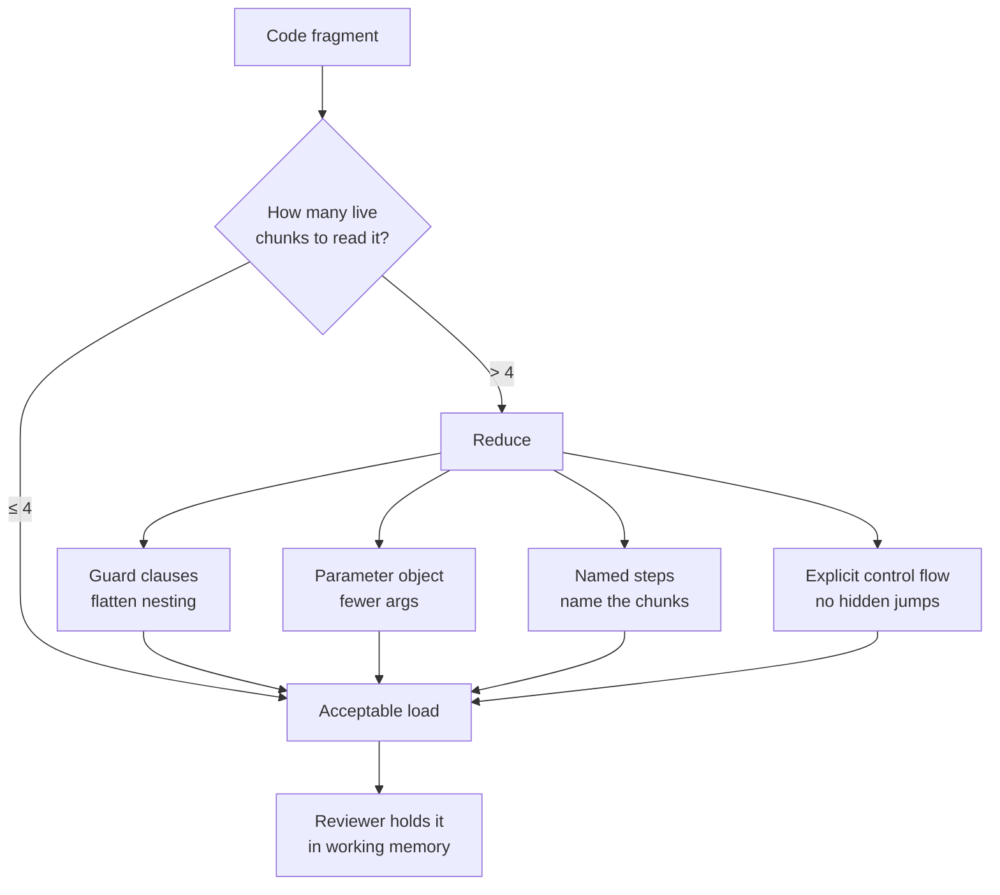
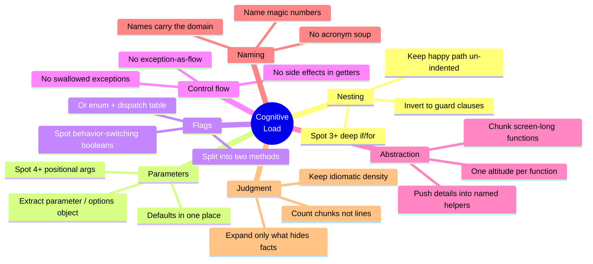

# Cognitive Load — Practice Tasks

> 12 hands-on exercises that each take a real fragment of high-cognitive-load code and reduce it to something a tired reviewer can hold in their head at 5pm on a Friday. Every task gives you a scenario, the offending code (varied across Go / Java / Python), a precise instruction, and a collapsible solution with the *reasoning* — including before/after complexity numbers where they sharpen the point.

Cognitive load is the working-memory tax a reader pays to understand code. Humans hold roughly **4 (±1) chunks** at once. Every live variable, every open `if`, every implicit side effect is a chunk. The goal of these tasks is never "fewer lines" — it is **fewer simultaneous things to track**. Sometimes that means *more* lines.

---

## Table of Contents

1. [Task 1 — Flatten deep nesting with guard clauses (Go)](#task-1--flatten-deep-nesting-with-guard-clauses-go)
2. [Task 2 — Replace a positional param list with an options object (Python)](#task-2--replace-a-positional-param-list-with-an-options-object-python)
3. [Task 3 — Unpack a clever one-liner into named steps (Python)](#task-3--unpack-a-clever-one-liner-into-named-steps-python)
4. [Task 4 — Kill the boolean flag parameter (Java)](#task-4--kill-the-boolean-flag-parameter-java)
5. [Task 5 — Make hidden control flow explicit: no exception-as-flow (Python)](#task-5--make-hidden-control-flow-explicit-no-exception-as-flow-python)
6. [Task 6 — A getter that lies: remove side effects from reads (Java)](#task-6--a-getter-that-lies-remove-side-effects-from-reads-java)
7. [Task 7 — Chunk a screen-long function into named steps (Go)](#task-7--chunk-a-screen-long-function-into-named-steps-go)
8. [Task 8 — Lift mixed abstraction levels (Python)](#task-8--lift-mixed-abstraction-levels-python)
9. [Task 9 — Rename acronym soup (Java)](#task-9--rename-acronym-soup-java)
10. [Task 10 — Two boolean flags, four behaviors → an enum + dispatch (Go)](#task-10--two-boolean-flags-four-behaviors--an-enum--dispatch-go)
11. [Task 11 — When the clever one-liner should *stay* (Python)](#task-11--when-the-clever-one-liner-should-stay-python)
12. [Task 12 — Full cognitive-load audit (Java — open-ended)](#task-12--full-cognitive-load-audit-java--open-ended)
13. [Self-Assessment](#self-assessment)
14. [Related Topics](#related-topics)

---

## How to Use

1. **Read the scenario first, then the code.** Cognitive load is contextual — the same code can be fine in a throwaway script and toxic in a hot path that ten engineers touch.
2. **Cover the solution.** Open `<details>` only after you have written your own version. The act of re-deriving the fix is where the learning happens.
3. **Count chunks, not lines.** Before and after each rewrite, ask: *how many things must I hold in my head to be sure this is correct?* That number — not the diff size — is the score.
4. **Run it.** Every snippet is intended to compile/run with trivial stubs filled in. Paste it into a scratch file and execute the "before" and "after" to confirm behavior is preserved.
5. **Order is deliberate.** Tasks run easy → hard. The last two ask you to *judge* (when a one-liner earns its keep) and to *audit* (find every smell yourself).

The mental model used throughout:



---

## Task 1 — Flatten deep nesting with guard clauses (Go)

**Difficulty:** Easy

**Scenario:** This validation+save function for a checkout service sits four `if` levels deep. To read line 9 a reviewer must remember three conditions are simultaneously true. The "happy path" — the thing the function is actually *for* — is buried at the bottom, indented off the screen.

```go
func PlaceOrder(cart *Cart, user *User) (*Order, error) {
    if user != nil {
        if user.Verified {
            if len(cart.Items) > 0 {
                if cart.Total() <= user.CreditLimit {
                    order := newOrder(cart, user)
                    if err := save(order); err == nil {
                        return order, nil
                    } else {
                        return nil, err
                    }
                } else {
                    return nil, errors.New("over credit limit")
                }
            } else {
                return nil, errors.New("empty cart")
            }
        } else {
            return nil, errors.New("user not verified")
        }
    } else {
        return nil, errors.New("no user")
    }
}
```

**Instruction:** Invert each condition into a guard clause that returns early, so the happy path is un-indented and reads top-to-bottom. Behavior must be identical.

<details>
<summary>Solution</summary>

```go
func PlaceOrder(cart *Cart, user *User) (*Order, error) {
    if user == nil {
        return nil, errors.New("no user")
    }
    if !user.Verified {
        return nil, errors.New("user not verified")
    }
    if len(cart.Items) == 0 {
        return nil, errors.New("empty cart")
    }
    if cart.Total() > user.CreditLimit {
        return nil, errors.New("over credit limit")
    }

    order := newOrder(cart, user)
    if err := save(order); err != nil {
        return nil, err
    }
    return order, nil
}
```

**Reasoning.** The two versions have the same cyclomatic complexity (5 — one per branch). Cyclomatic complexity is *not* the metric that moved; **cognitive complexity** is. SonarSource's cognitive-complexity model adds a penalty for *nesting depth*: the original `if cart.Total() <= ...` at depth 4 scores `1 + 3` nesting penalty. The original lands around a cognitive complexity of **10**; the guard-clause version around **4**, because every guard sits at depth 0 (no nesting increment).

Concretely: in the original, when you reach the `save(order)` call you are mentally holding four still-open `if` conditions. In the rewrite, each failed precondition has already exited — by the time you read `newOrder`, the stack of conditions you must remember is **empty**. The happy path is the un-indented spine of the function, which is exactly what you want to see first.

</details>

---

## Task 2 — Replace a positional param list with an options object (Python)

**Difficulty:** Easy

**Scenario:** A call site reads `connect("db.internal", 5432, 30, 10, True, False, True, 3)`. No human can verify that argument list is correct without scrolling to the signature and counting on their fingers. Booleans in particular are unreadable positionally.

```python
def connect(
    host: str,
    port: int,
    connect_timeout: int,
    pool_size: int,
    use_tls: bool,
    verify_cert: bool,
    keepalive: bool,
    max_retries: int,
) -> Connection:
    ...

# call site:
conn = connect("db.internal", 5432, 30, 10, True, False, True, 3)
```

**Instruction:** Introduce a frozen dataclass config object with sensible defaults so only `host`/`port` are required and every optional knob is named at the call site.

<details>
<summary>Solution</summary>

```python
from dataclasses import dataclass


@dataclass(frozen=True)
class ConnectionConfig:
    host: str
    port: int = 5432
    connect_timeout: int = 30
    pool_size: int = 10
    use_tls: bool = True
    verify_cert: bool = True
    keepalive: bool = True
    max_retries: int = 3


def connect(config: ConnectionConfig) -> Connection:
    ...


# call site — every value is self-documenting, order no longer matters:
conn = connect(ConnectionConfig(
    host="db.internal",
    use_tls=True,
    verify_cert=False,
))
```

**Reasoning.** The unreadable part of `connect(..., True, False, True, ...)` is that three identical-looking `bool`s carry three different meanings, and a single swapped pair silently changes security posture (`verify_cert` off!) with no error. The parameter object converts **positional memory** (remember that the 6th arg is `verify_cert`) into **named lookup** (the reader sees `verify_cert=False` inline).

Two further wins:
- **Defaults move into one place.** Callers that want the standard config write almost nothing; they no longer copy-paste `30, 10, True, ...` and drift out of sync.
- **`frozen=True` makes the config a value.** It can be shared, hashed, and reused without fear of a downstream mutation. (See [immutability](../../design-patterns/README.md) for why a frozen config beats a mutable one passed by reference.)

A reviewer's working memory goes from "8 positional slots + the signature" to "the 2-3 fields that differ from default." That is the whole game.

</details>

---

## Task 3 — Unpack a clever one-liner into named steps (Python)

**Difficulty:** Easy

**Scenario:** A teammate is proud of this one-liner that "computes the report." You have stared at it for ninety seconds and still cannot say what it returns when a department has no employees.

```python
result = {d: round(sum(e.salary for e in emps) / len(emps), 2)
          for d, emps in groupby(sorted(employees, key=lambda x: x.dept),
                                  key=lambda x: x.dept)
          if (emps := list(emps))}
```

**Instruction:** Rewrite as a sequence of named steps that a reader can trace one line at a time. Name the intermediate concepts.

<details>
<summary>Solution</summary>

```python
from itertools import groupby
from statistics import mean


def average_salary_by_department(employees) -> dict[str, float]:
    by_dept = sorted(employees, key=lambda e: e.dept)

    averages: dict[str, float] = {}
    for dept, group in groupby(by_dept, key=lambda e: e.dept):
        salaries = [e.salary for e in group]
        averages[dept] = round(mean(salaries), 2)

    return averages
```

**Reasoning.** The original packs five distinct operations — *sort*, *group*, *materialize the lazy iterator*, *average*, *round* — into a single expression, plus a walrus (`:=`) doing double duty as both a filter and a re-binding. The killer detail: `groupby` yields a **lazy, single-pass iterator**; the one-liner consumes it once in `sum(...)` and once in `len(...)`, so the second consumption sees an empty iterator. The walrus `(emps := list(emps))` is there to *paper over that bug* by materializing the group first — but its presence is invisible to a casual reader, who will "fix" the code by removing the seemingly-redundant filter and silently reintroduce the division-by-zero / wrong-average bug.

The unpacked version gives every concept a name (`by_dept`, `group`, `salaries`) and reads as a literal recipe. The `list(...)` comprehension makes the single-pass-iterator hazard explicit and impossible to trip over. We also swap the hand-rolled `sum/len` for `statistics.mean`, which states intent directly.

This is the rule: **a one-liner is only "clever" if the reader can reconstruct it faster than they can read three plain lines.** Here they cannot, so it loses. (Task 11 shows the opposite case, where the one-liner wins.)

</details>

---

## Task 4 — Kill the boolean flag parameter (Java)

**Difficulty:** Medium

**Scenario:** Code review keeps surfacing calls like `mailer.send(message, true)`. Reviewers cannot tell what `true` means without opening the method. Worse, the method is an `if/else` that does two genuinely different jobs glued together by the flag.

```java
public void send(Message msg, boolean isUrgent) {
    if (isUrgent) {
        validateUrgent(msg);
        smsGateway.push(msg.recipient(), msg.body());
        pagerDuty.alert(msg);
        log.warn("URGENT sent to {}", msg.recipient());
    } else {
        validateStandard(msg);
        emailQueue.enqueue(msg);
        log.info("Queued mail to {}", msg.recipient());
    }
}

// call sites:
mailer.send(welcome, false);
mailer.send(outage, true);
```

**Instruction:** Split the flag into two intention-revealing methods. The shared `send` should no longer branch on a boolean.

<details>
<summary>Solution</summary>

```java
public void sendUrgent(Message msg) {
    validateUrgent(msg);
    smsGateway.push(msg.recipient(), msg.body());
    pagerDuty.alert(msg);
    log.warn("URGENT sent to {}", msg.recipient());
}

public void sendStandard(Message msg) {
    validateStandard(msg);
    emailQueue.enqueue(msg);
    log.info("Queued mail to {}", msg.recipient());
}

// call sites — the verb says what happens:
mailer.sendStandard(welcome);
mailer.sendUrgent(outage);
```

**Reasoning.** A boolean parameter that selects between two code paths is a function with **two responsibilities wearing one name** — the flag is a control coupling smell. The original method has cyclomatic complexity 2 and forces every reader to evaluate the `if` mentally for *both* branches even when they only care about one. After the split, each method is straight-line (complexity 1) and the call site `sendUrgent(outage)` is self-documenting: no reader has to remember that `true` means urgent.

The decision rule: **if the two branches share almost no code, split into two methods.** If they share substantial code with only a small behavioral tweak, prefer a small enum or strategy object over a `boolean`, because `send(msg, Priority.URGENT)` still reads at the call site while keeping the shared body in one place (see Task 10 for the enum-dispatch version). The thing you never keep is a positional `boolean`, because `send(x, true, false)` is unreadable and `send(x, false, true)` is an undetectable bug.

</details>

---

## Task 5 — Make hidden control flow explicit: no exception-as-flow (Python)

**Difficulty:** Medium

**Scenario:** A profiler flags this lookup as a hot spot. Reading it, you realize control flow leaves the function through an exception on the *common* path — a cache miss is not exceptional, it is expected. The exception jump is invisible at the call site and makes the function impossible to reason about locally.

```python
def get_user(user_id):
    try:
        user = cache[user_id]
        return user
    except KeyError:
        try:
            user = db.query("SELECT * FROM users WHERE id = ?", user_id)
            cache[user_id] = user
            return user
        except RecordNotFound:
            raise UserNotFound(user_id)
    except ConnectionError:
        return None  # silently degrade — caller has no idea
```

**Instruction:** Use explicit, value-returning control flow for the *expected* cases (cache miss, not found). Reserve exceptions for the *unexpected* case (a real infrastructure failure), and make the degraded path explicit instead of silently returning `None`.

<details>
<summary>Solution</summary>

```python
def get_user(user_id: str) -> User | None:
    cached = cache.get(user_id)          # miss is a value, not an exception
    if cached is not None:
        return cached

    user = db.find_user(user_id)         # returns None when not found
    if user is None:
        return None

    cache[user_id] = user
    return user
```

with a thin data-access layer that has already made the "not found" case a normal return value:

```python
def find_user(self, user_id: str) -> User | None:
    row = self.query_one("SELECT * FROM users WHERE id = ?", user_id)
    return User.from_row(row) if row else None
    # A real ConnectionError still propagates — it IS exceptional, and the
    # caller (or a circuit breaker) should decide, not this function silently.
```

**Reasoning.** Exceptions are a non-local `goto`: they transfer control to a handler that may be many stack frames away, and the reader of `get_user` cannot see where. Three problems in the original:

1. **Expected-as-exceptional.** A cache miss happens constantly. Using `try/except KeyError` for it means the normal path is the `except` block — the reader has to invert the structure to follow it. `cache.get(user_id)` makes "miss" a `None` value you branch on inline. (There is also a measurable cost: raising and catching exceptions is far more expensive than a dict `.get`, which matters in a hot lookup.)
2. **Nested try/except hides the real exit points.** Counting them is hard; there are *four* ways out of the original. The rewrite has three obvious `return`s on three obvious lines.
3. **Silent degradation.** `except ConnectionError: return None` makes a database outage indistinguishable from a missing user — the worst kind of hidden control flow, because the bug surfaces somewhere else entirely. The rewrite lets the genuine `ConnectionError` propagate, so the *unexpected* failure is loud and the *expected* "not found" is a quiet `None`.

Cognitive-complexity-wise, every `except` clause adds a structural increment plus a nesting penalty; collapsing two nested `try` blocks into flat guard returns drops the score from roughly **9** to **3**. The deeper win is that control flow is now entirely visible in the function body — no reader needs to know which exceptions which callee might throw.

</details>

---

## Task 6 — A getter that lies: remove side effects from reads (Java)

**Difficulty:** Medium

**Scenario:** A bug report says the session token "sometimes refreshes for no reason" during read-only reporting. The culprit: a `getToken()` accessor that mutates state. Readers reasonably assume `getX()` is free of side effects, so they call it freely in logging, in `assert`s, in loops — and every call silently does work.

```java
public class Session {
    private String token;
    private Instant expiresAt;

    public String getToken() {
        if (Instant.now().isAfter(expiresAt)) {
            this.token = authClient.refresh();   // network call inside a getter!
            this.expiresAt = Instant.now().plus(Duration.ofHours(1));
            auditLog.record("token refreshed");
        }
        return token;
    }
}
```

**Instruction:** Make reads pure. Separate the *query* (give me the current token) from the *command* (ensure a fresh token). The name of each method must advertise whether it can change state.

<details>
<summary>Solution</summary>

```java
public class Session {
    private String token;
    private Instant expiresAt;

    /** Pure query: never mutates, never does I/O. Safe to call anywhere. */
    public String currentToken() {
        return token;
    }

    public boolean isExpired() {
        return Instant.now().isAfter(expiresAt);
    }

    /** Explicit command: may perform a network refresh and mutate state. */
    public String ensureFreshToken() {
        if (isExpired()) {
            this.token = authClient.refresh();
            this.expiresAt = Instant.now().plus(Duration.ofHours(1));
            auditLog.record("token refreshed");
        }
        return token;
    }
}

// caller is now in control of when the expensive, mutating work happens:
String token = session.ensureFreshToken();   // I accept this may refresh
sendRequest(token);
```

**Reasoning.** This is **Command-Query Separation (CQS)**: a method should either *return a value* (query, no observable side effect) or *change state* (command, returns nothing or a result) — never both invisibly. The original `getToken()` violates CQS catastrophically because the side effect is a *network call*, the most expensive and most failure-prone thing a method can hide behind a name that promises a cheap field read.

The cognitive-load damage is that `getX()` is a near-universal convention for "free, repeatable, side-effect-free." When a reader sees `log.debug("token = {}", session.getToken())`, they assume it is harmless — but here it can fire a refresh inside a debug log, inside a tight loop, inside an `assert` that gets compiled out in production (so behavior differs between builds!). By renaming to `currentToken()` (pure) and `ensureFreshToken()` (explicitly mutating), the *name carries the side-effect contract*. The reader no longer has to open the method body to know whether calling it is safe — the name alone bounds the working memory needed.

</details>

---

## Task 7 — Chunk a screen-long function into named steps (Go)

**Difficulty:** Medium

**Scenario:** This request handler is 70 lines tall — it does not fit on one screen, so no reviewer ever sees it whole. It mixes parsing, authorization, business logic, persistence, and response formatting in one undifferentiated wall.

```go
func HandleCreateInvoice(w http.ResponseWriter, r *http.Request) {
    // parse
    var req CreateInvoiceRequest
    body, err := io.ReadAll(r.Body)
    if err != nil {
        http.Error(w, "cannot read body", http.StatusBadRequest)
        return
    }
    if err := json.Unmarshal(body, &req); err != nil {
        http.Error(w, "invalid json", http.StatusBadRequest)
        return
    }

    // authorize
    token := r.Header.Get("Authorization")
    claims, err := verifyJWT(token)
    if err != nil {
        http.Error(w, "unauthorized", http.StatusUnauthorized)
        return
    }
    if !claims.HasRole("billing") {
        http.Error(w, "forbidden", http.StatusForbidden)
        return
    }

    // build invoice
    inv := Invoice{CustomerID: req.CustomerID, IssuedBy: claims.Subject}
    var total int64
    for _, line := range req.Lines {
        if line.Quantity <= 0 {
            http.Error(w, "quantity must be positive", http.StatusBadRequest)
            return
        }
        total += line.UnitPriceCents * int64(line.Quantity)
        inv.Lines = append(inv.Lines, line)
    }
    inv.TotalCents = total

    // persist
    if err := db.Insert(r.Context(), &inv); err != nil {
        http.Error(w, "could not save", http.StatusInternalServerError)
        return
    }

    // respond
    w.Header().Set("Content-Type", "application/json")
    w.WriteHeader(http.StatusCreated)
    json.NewEncoder(w).Encode(CreateInvoiceResponse{ID: inv.ID, TotalCents: inv.TotalCents})
}
```

**Instruction:** Keep the handler as a short orchestrator that reads as a list of named phases. Extract each comment-block into its own function. Behavior identical.

<details>
<summary>Solution</summary>

```go
func HandleCreateInvoice(w http.ResponseWriter, r *http.Request) {
    req, err := parseCreateInvoice(r)
    if err != nil {
        writeError(w, err)
        return
    }

    claims, err := authorizeBilling(r)
    if err != nil {
        writeError(w, err)
        return
    }

    inv, err := buildInvoice(req, claims)
    if err != nil {
        writeError(w, err)
        return
    }

    if err := db.Insert(r.Context(), &inv); err != nil {
        writeError(w, apiError{http.StatusInternalServerError, "could not save"})
        return
    }

    writeJSON(w, http.StatusCreated, CreateInvoiceResponse{
        ID: inv.ID, TotalCents: inv.TotalCents,
    })
}

type apiError struct {
    status  int
    message string
}

func (e apiError) Error() string { return e.message }

func parseCreateInvoice(r *http.Request) (CreateInvoiceRequest, error) {
    var req CreateInvoiceRequest
    if err := json.NewDecoder(r.Body).Decode(&req); err != nil {
        return req, apiError{http.StatusBadRequest, "invalid json"}
    }
    return req, nil
}

func authorizeBilling(r *http.Request) (Claims, error) {
    claims, err := verifyJWT(r.Header.Get("Authorization"))
    if err != nil {
        return Claims{}, apiError{http.StatusUnauthorized, "unauthorized"}
    }
    if !claims.HasRole("billing") {
        return Claims{}, apiError{http.StatusForbidden, "forbidden"}
    }
    return claims, nil
}

func buildInvoice(req CreateInvoiceRequest, claims Claims) (Invoice, error) {
    inv := Invoice{CustomerID: req.CustomerID, IssuedBy: claims.Subject}
    for _, line := range req.Lines {
        if line.Quantity <= 0 {
            return Invoice{}, apiError{http.StatusBadRequest, "quantity must be positive"}
        }
        inv.TotalCents += line.UnitPriceCents * int64(line.Quantity)
        inv.Lines = append(inv.Lines, line)
    }
    return inv, nil
}

func writeError(w http.ResponseWriter, err error) {
    if api, ok := err.(apiError); ok {
        http.Error(w, api.message, api.status)
        return
    }
    http.Error(w, "internal error", http.StatusInternalServerError)
}

func writeJSON(w http.ResponseWriter, status int, body any) {
    w.Header().Set("Content-Type", "application/json")
    w.WriteHeader(status)
    json.NewEncoder(w).Encode(body)
}
```

**Reasoning.** The handler now fits in a glance and reads as exactly what it is: *parse → authorize → build → persist → respond*. The five comment headers (`// parse`, `// authorize`, ...) were a confession that the function had five distinct jobs; promoting each comment to a function name turns the comment into a checkable contract. A comment can lie; a function name that wraps the wrong code produces a wrong call.

Two structural improvements fell out for free:
- **The `// validate` repetition vanished.** Each extracted function returns an error; the handler funnels them all through one `writeError`, replacing six near-identical `http.Error(...) ; return` pairs with one decision.
- **The pieces became testable in isolation.** `buildInvoice` is now a pure-ish function you can table-test without spinning up an HTTP server — previously the only way to test the line-total math was through the full handler.

Cognitive complexity drops sharply: the original handler scores ~12 (every `if … return` plus the loop-with-nested-`if`), while the orchestrator scores ~4 and each helper scores 1-3. More importantly, working memory is bounded *per function* — you never hold parsing details and persistence details in your head at the same time again.

</details>

---

## Task 8 — Lift mixed abstraction levels (Python)

**Difficulty:** Hard

**Scenario:** This function jumps between altitudes mid-sentence: one line is high-level orchestration ("publish the event"), the next is low-level byte twiddling (CRC computation, bit masks). The reader's brain has to keep context-switching between "what is this trying to do" and "how does this bit math work," which is exhausting and error-prone.

```python
def publish_sensor_reading(sensor, reading):
    # high level
    if not sensor.is_active:
        return

    # suddenly very low level: pack into a 4-byte frame
    raw = (reading.value & 0x0FFF) << 4
    raw |= (reading.unit_code & 0x0F)
    frame = bytearray(4)
    frame[0] = (raw >> 8) & 0xFF
    frame[1] = raw & 0xFF
    crc = 0xFFFF
    for b in frame[:2]:
        crc ^= b << 8
        for _ in range(8):
            crc = (crc << 1) ^ 0x1021 if crc & 0x8000 else crc << 1
            crc &= 0xFFFF
    frame[2] = (crc >> 8) & 0xFF
    frame[3] = crc & 0xFF

    # back to high level
    topic = f"sensors/{sensor.zone}/{sensor.id}"
    broker.publish(topic, bytes(frame))
    metrics.increment("readings.published")
```

**Instruction:** Make `publish_sensor_reading` read entirely at one altitude — orchestration only. Push the bit-level frame encoding and CRC down into named helpers (ideally onto the protocol/encoder that owns that knowledge).

<details>
<summary>Solution</summary>

```python
def publish_sensor_reading(sensor, reading):
    if not sensor.is_active:
        return

    frame = encode_frame(reading)
    topic = f"sensors/{sensor.zone}/{sensor.id}"
    broker.publish(topic, frame)
    metrics.increment("readings.published")


# --- low-level protocol details, all at the same (low) altitude ---

def encode_frame(reading) -> bytes:
    payload = pack_payload(reading.value, reading.unit_code)
    crc = crc16_ccitt(payload)
    return bytes([*payload, crc >> 8 & 0xFF, crc & 0xFF])


def pack_payload(value: int, unit_code: int) -> bytes:
    raw = (value & 0x0FFF) << 4 | (unit_code & 0x0F)
    return bytes([(raw >> 8) & 0xFF, raw & 0xFF])


def crc16_ccitt(data: bytes) -> int:
    crc = 0xFFFF
    for byte in data:
        crc ^= byte << 8
        for _ in range(8):
            crc = ((crc << 1) ^ 0x1021) if crc & 0x8000 else (crc << 1)
            crc &= 0xFFFF
    return crc
```

**Reasoning.** This is the **Single Level of Abstraction Principle (SLAP)**: every statement in a function should be at the same conceptual altitude. The original forced the reader to descend from "should we publish?" all the way to "shift the CRC accumulator and XOR with the 0x1021 polynomial" and climb back up — three altitude changes in one function. Each switch flushes working memory.

After the rewrite, `publish_sensor_reading` reads as five plain English steps: *bail if inactive → encode → build topic → publish → record metric*. Nothing in it mentions a bit mask. A reader who only cares about *when* we publish never has to look at the CRC at all; a reader debugging the CRC goes straight to `crc16_ccitt` and finds it isolated, named after the exact algorithm (CCITT) so they can check it against the spec.

The naming also documents the protocol: `pack_payload`, `crc16_ccitt`, `encode_frame` form a vocabulary. The magic numbers (`0x0FFF`, `0x1021`) are now localized to the one tiny function that owns each, instead of being sprinkled through a function that is supposedly about *publishing*. Note we did **not** "simplify" the CRC loop into a clever one-liner — bit math is inherently dense, so the right move is to *isolate* it behind a precise name, not to compress it further (Task 11 elaborates on when density is acceptable).

</details>

---

## Task 9 — Rename acronym soup (Java)

**Difficulty:** Hard

**Scenario:** You inherit this method. Every identifier is an abbreviation, and decoding it requires tribal knowledge nobody wrote down. The author is on parental leave. You need to add a feature here this week.

```java
public BigDecimal calcAdjTxblAmt(Acct a, Txn t, int yr) {
    BigDecimal gma = a.getGmaForYr(yr);          // ?
    BigDecimal exc = t.getExc();                 // ?
    BigDecimal tdb = gma.subtract(exc);          // ?
    if (a.getCtgy() == 2 && t.getFlg()) {        // magic 2? what flag?
        tdb = tdb.multiply(new BigDecimal("0.85"));
    }
    BigDecimal mtd = tdb.compareTo(a.getStdDed(yr)) > 0
        ? tdb.subtract(a.getStdDed(yr))
        : BigDecimal.ZERO;
    return mtd;
}
```

**Instruction:** Rename every acronym to a full, domain-meaningful word. Replace magic constants with named constants/enums. Do not change the calculation — only make it legible. State any assumptions you had to make about meaning.

<details>
<summary>Solution</summary>

```java
// Assumptions, stated explicitly because the original hid them:
//   gma -> grossMonetaryAmount        exc -> exclusion
//   tdb -> taxableBase                mtd -> taxableAmountAfterDeduction
//   ctgy == 2 -> AccountCategory.NONPROFIT
//   t.getFlg() -> transaction.isReducedRate()
//   0.85 -> the nonprofit reduced-rate multiplier (15% relief)

private static final BigDecimal NONPROFIT_REDUCED_RATE = new BigDecimal("0.85");

public BigDecimal calculateAdjustedTaxableAmount(Account account, Transaction transaction, int year) {
    BigDecimal grossAmount = account.getGrossAmountForYear(year);
    BigDecimal exclusion = transaction.getExclusion();
    BigDecimal taxableBase = grossAmount.subtract(exclusion);

    boolean qualifiesForReducedRate =
        account.getCategory() == AccountCategory.NONPROFIT && transaction.isReducedRate();
    if (qualifiesForReducedRate) {
        taxableBase = taxableBase.multiply(NONPROFIT_REDUCED_RATE);
    }

    BigDecimal standardDeduction = account.getStandardDeduction(year);
    if (taxableBase.compareTo(standardDeduction) <= 0) {
        return BigDecimal.ZERO;
    }
    return taxableBase.subtract(standardDeduction);
}
```

**Reasoning.** Nothing about the *computation* changed — the diff is 100% renames, one extracted constant, one extracted boolean, and an inverted final conditional. Yet the cognitive load collapsed. The original forced the reader to hold a private decoder ring in working memory (`gma`, `exc`, `tdb`, `mtd`, `ctgy`, `flg`) *while also* tracking the arithmetic. Every abbreviation is an extra chunk; with six of them plus two magic values (`2`, `0.85`), the reader is over the ~4-chunk budget before any actual math is considered.

Specific moves and why:
- **Names that say the domain noun.** `taxableBase` instead of `tdb` means the variable carries its own documentation — the reader never has to scroll up to a declaration to remember what it holds.
- **`ctgy == 2` → `AccountCategory.NONPROFIT`.** A bare `2` is a chunk with no meaning; the enum tells the reader *why* this branch exists. The same applies to `0.85`, now `NONPROFIT_REDUCED_RATE`, which states it is a 15% relief.
- **Extracted the compound condition** into `qualifiesForReducedRate`, so the `if` reads as a sentence and the *reason* for the branch is named, not just its mechanics.
- **Inverted the ternary** into an early `return ZERO`, which removes the need to mentally evaluate both arms of a `?:` while parsing nested `subtract` calls.

The lesson: abbreviations save the *writer* keystrokes once and tax every *reader* forever. In a function touched by many people over years, that trade is always wrong. Names are the cheapest documentation that cannot go stale, because the compiler keeps them honest.

</details>

---

## Task 10 — Two boolean flags, four behaviors → an enum + dispatch (Go)

**Difficulty:** Hard

**Scenario:** This export function grew a second boolean. The call site `export(data, true, false)` now encodes one of *four* modes, and no reader can decode which. Worse, one of the four combinations (`compress && !includeHeaders` for CSV) is nonsensical but nothing prevents callers from requesting it.

```go
func Export(data []Record, asJSON bool, compress bool) ([]byte, error) {
    var out []byte
    var err error
    if asJSON {
        out, err = json.Marshal(data)
    } else {
        out, err = toCSV(data)   // CSV always includes a header row
    }
    if err != nil {
        return nil, err
    }
    if compress {
        out = gzipBytes(out)
    }
    return out, nil
}

// call site — what does this mean?
blob, _ := Export(records, true, false)
```

**Instruction:** Replace the two booleans with a single typed `Format` enum (the four *valid* combinations become four named formats), making illegal states unrepresentable and the call site self-describing. Use a dispatch table rather than nested `if`s.

<details>
<summary>Solution</summary>

```go
type Format int

const (
    FormatJSON Format = iota
    FormatJSONGzip
    FormatCSV
    FormatCSVGzip
)

// encoder describes how to serialize and whether to compress.
type encoder struct {
    marshal  func([]Record) ([]byte, error)
    compress bool
}

var encoders = map[Format]encoder{
    FormatJSON:     {marshal: json.Marshal, compress: false},
    FormatJSONGzip: {marshal: json.Marshal, compress: true},
    FormatCSV:      {marshal: toCSV, compress: false},
    FormatCSVGzip:  {marshal: toCSV, compress: true},
}

func Export(data []Record, format Format) ([]byte, error) {
    enc, ok := encoders[format]
    if !ok {
        return nil, fmt.Errorf("unknown export format: %d", format)
    }

    out, err := enc.marshal(data)
    if err != nil {
        return nil, err
    }
    if enc.compress {
        out = gzipBytes(out)
    }
    return out, nil
}

// call site — unambiguous:
blob, _ := Export(records, FormatJSON)
```

**Reasoning.** Two booleans encode `2 × 2 = 4` states, but the *type system* still lets a caller pass any of those 4 with no hint about which is intended, and `Export(records, true, false)` is a memory test. Collapsing them into a `Format` enum does three things at once:

1. **Self-documenting call sites.** `Export(records, FormatJSONGzip)` needs no comment. The reader's working memory cost drops from "decode two positional booleans against the signature" to "read one named constant."
2. **Illegal states become unrepresentable.** There is no `FormatCSVNoHeaders` because CSV-without-headers was never valid — by *not minting that constant*, we make the bad combination impossible to express, which is strictly better than validating against it at runtime. (This is the "make illegal states unrepresentable" maxim.)
3. **Dispatch table over branches.** The original's `if asJSON { } else { } … if compress { }` is 3 branch points (cyclomatic 3) that a reader must combinatorially evaluate. The map turns selection into a single lookup; the function body is now linear (cyclomatic 2, just the `ok` check and the `compress` flag) and adding a fifth format is a one-line table entry, not a new branch threaded through the logic.

If the number of formats were to explode, the next step is to move each `encoder` behind an interface — that is the [Strategy](../../design-patterns/README.md) pattern, and the enum+table here is its lightweight precursor. The boolean-elimination instinct is the same one from Task 4; the difference is that with *two* flags and shared body, an enum beats splitting into four exported functions.

</details>

---

## Task 11 — When the clever one-liner should *stay* (Python)

**Difficulty:** Hard

**Scenario:** A zealous reviewer wants you to "unpack" every comprehension in the codebase into explicit loops, citing Task 3. But not every dense expression is high cognitive load — some are *idiomatic* and reading them as a unit is *less* effort than reading the expanded form. Your job is to judge, not to mechanically expand.

Consider these two candidates flagged in the same review:

```python
# Candidate A
flat = [x for row in matrix for x in row]

# Candidate B
result = next((u for u in users if u.id == target_id and u.active
              and u.region in allowed and not u.banned), None)
```

against the "expanded" alternatives:

```python
# Expanded A
flat = []
for row in matrix:
    for x in row:
        flat.append(x)

# Expanded B
result = None
for u in users:
    if u.id == target_id:
        if u.active:
            if u.region in allowed:
                if not u.banned:
                    result = u
                    break
```

**Instruction:** Decide for each candidate whether to keep the one-liner or expand it, and justify using the cognitive-load criterion (not personal taste). If you keep a dense form, say what makes it safe; if you expand, say what tipped it over.

<details>
<summary>Solution</summary>

**Candidate A: keep the one-liner.**

```python
flat = [x for row in matrix for x in row]
```

This is the *canonical* Python idiom for flattening one level of nesting. An experienced reader recognizes the `[x for row in matrix for x in row]` shape as a single chunk — "flatten" — the same way you read the word "flatten" without spelling it. The expanded version is **four lines and two nesting levels** to express one well-known operation; it costs *more* working memory, not less, because the reader has to reconstruct that the loops merely flatten. There are no hidden side effects, no exception flow, no surprising laziness. Density here is communication, not obfuscation.

**Candidate B: expand it — but not into the nested-`if` pyramid.**

The reviewer is right that B is too much, but the proposed expansion is *worse* (a 4-deep nesting pyramid, exactly the smell from Task 1). The real problem with B is that **four distinct business predicates are crammed into one boolean expression** inside a generator inside a `next(...)` with a default. The fix is to name the predicate, not to explode the control flow:

```python
def is_eligible(user) -> bool:
    return (
        user.id == target_id
        and user.active
        and user.region in allowed
        and not user.banned
    )

result = next((u for u in users if is_eligible(u)), None)
```

Now the `next(..., None)` idiom — "first match or `None`" — stays as a recognized one-chunk pattern, and the four-part eligibility rule has a *name* that says what it means. A reader scanning the lookup sees `is_eligible`; a reader debugging the rule opens one tiny pure function. Working memory at each site is one chunk.

**The judgment criterion.** Keep a dense expression when **the reader can recognize it as a single known idiom faster than they can read the expansion** (Candidate A, and the `next(..., default)` shell of B). Break it up when it **forces the reader to simultaneously hold multiple unrelated facts** (B's four predicates) — but break it up by *naming the concept*, not by adding nesting. The metric is always "chunks the reader must hold," never "characters on the line." Cleverness that compresses a familiar idea is good; cleverness that hides an unfamiliar one is debt.

</details>

---

## Task 12 — Full cognitive-load audit (Java — open-ended)

**Difficulty:** Hard

**Scenario:** Below is a realistic method from a payments service. It exhibits *most* of the anti-patterns in this chapter at once. List **every cognitive-load smell** you can find, then write a one-line remediation for each. Finally, sketch the refactored top-level method (you may stub the helpers).

```java
public Object proc(Map<String,Object> d, boolean retry, boolean async, boolean dryRun) {
    if (d != null) {
        if (d.get("amt") != null) {
            if ((int)(Integer)d.get("amt") > 0) {
                try {
                    String c = (String)d.get("cur");
                    int a = (int)(Integer)d.get("amt");
                    long x = System.currentTimeMillis() & 0xFFFFFFFFL;  // "id"
                    Gateway g = retry ? new RetryGateway(3) : new Gateway();
                    if (!dryRun) {
                        if (async) {
                            executor.submit(() -> g.charge(c, a, x));
                            return null;
                        } else {
                            Receipt r = g.charge(c, a, x);
                            audit(r);  // side effect; also this.lastReceipt = r inside audit
                            return r;
                        }
                    } else {
                        return new Receipt(x, a, c, "DRY_RUN");
                    }
                } catch (Exception e) {
                    return null;  // swallow everything
                }
            } else { throw new RuntimeException("bad"); }
        } else { throw new RuntimeException("bad"); }
    } else { throw new RuntimeException("bad"); }
}
```

**Instruction:** Produce the audit table, then the cleaned-up orchestrator.

<details>
<summary>Solution</summary>

**Audit table.**

| Smell | Where | Remediation |
|---|---|---|
| Deep nesting (4 levels) | the `if (d != null) { if (amt != null) { if (>0) …` pyramid | Invert into guard clauses that return/throw early (Task 1). |
| Acronym / single-letter soup | `proc`, `d`, `c`, `a`, `x`, `g`, `r` | Rename to `processPayment`, `request`, `currency`, `amount`, `paymentId`, `gateway`, `receipt` (Task 9). |
| Boolean flag parameters × 3 | `retry, async, dryRun` → 8 combinations | Replace with an options object / enums; `proc(d, true, false, true)` is unreadable (Tasks 2, 4, 10). |
| Primitive-stringly typed input | `Map<String,Object> d` with casts | Replace with a typed `PaymentRequest` record so `(int)(Integer)d.get("amt")` casts vanish. |
| Hidden control flow — exception as flow + swallowing | `catch (Exception e) { return null; }` | Let real failures propagate or wrap in a typed result; never swallow everything (Task 5). |
| Hidden side effect | `audit(r)` also sets `this.lastReceipt` invisibly | Make the mutation explicit / return it; do not hide state changes inside an "audit" call (Task 6). |
| Mixed abstraction levels | `System.currentTimeMillis() & 0xFFFFFFFFL` (bit math) sits beside high-level "charge" orchestration | Push ID generation down into `newPaymentId()` (Task 8). |
| Untyped return | returns `Object` (sometimes `null`, sometimes `Receipt`) | Return a `Receipt` (or `Optional<Receipt>` / a result type); `Object` forces every caller to cast and guess. |
| Magic numbers | `3` (retries), `0xFFFFFFFFL` | Name them: `MAX_RETRIES`, and isolate the mask in `newPaymentId`. |
| Duplicated throw | three identical `throw new RuntimeException("bad")` | One validation step with a specific message per failure. |

**Refactored orchestrator** (helpers stubbed):

```java
public Receipt processPayment(PaymentRequest request, PaymentOptions options) {
    validate(request);                       // throws a specific, typed error

    PaymentId id = newPaymentId();
    Gateway gateway = options.retry()
        ? new RetryGateway(MAX_RETRIES)
        : new Gateway();

    if (options.dryRun()) {
        return Receipt.dryRun(id, request);
    }
    if (options.async()) {
        executor.submit(() -> charge(gateway, request, id));
        return Receipt.accepted(id, request);   // explicit "accepted", not null
    }
    return charge(gateway, request, id);
}

private Receipt charge(Gateway gateway, PaymentRequest request, PaymentId id) {
    Receipt receipt = gateway.charge(request.currency(), request.amountCents(), id);
    audit(receipt);                          // audit no longer mutates hidden state
    return receipt;
}

// typed inputs replace the Map and the boolean soup:
record PaymentRequest(Currency currency, int amountCents) {
    PaymentRequest {
        if (amountCents <= 0) throw new IllegalArgumentException("amount must be positive");
    }
}
record PaymentOptions(boolean retry, boolean async, boolean dryRun) {}
```

**Reasoning.** The original method asks the reader to simultaneously track: three boolean flags, a 4-deep nesting stack, seven cryptic identifiers, an untyped map whose keys you must memorize, a swallowed exception, a hidden field mutation, and one line of bit math — far past any working-memory budget. No single fix rescues it; each anti-pattern in this chapter contributes one chunk, and removing them is additive.

The cleaned-up `processPayment` reads as a short sequence of named decisions at one altitude. Validation is one early step that throws *specific* errors instead of three identical `"bad"`s. The `PaymentRequest` record erases every cast and validates its own invariant in the compact constructor, so the rest of the code can trust its inputs. The flags survive only as a *named* `PaymentOptions` (and `request.amountCents` makes the unit explicit), so a call site reads `processPayment(req, new PaymentOptions(true, false, false))` instead of an anonymous `true, false, false`. Every former `return null` is now either an explicit `Receipt` state (`accepted`, `dryRun`) or a propagated exception — the control flow is fully visible in the body. Cognitive complexity drops from roughly **18** to roughly **6**, and — the real prize — the reader never holds more than a few chunks at any point in the method.

</details>

---

## Self-Assessment

Rate yourself on each capability. You "have it" when you can do it in code review, on someone else's code, without notes.



- [ ] I can flatten a 4-deep nesting pyramid into guard clauses **without** changing behavior, and explain why cognitive complexity dropped while cyclomatic complexity did not (Task 1).
- [ ] I can convert a long positional parameter list into a parameter/options object with defaults, and articulate the call-site readability win (Task 2).
- [ ] I can spot a "clever" one-liner that hides a bug (e.g., single-pass iterator consumed twice) and unpack it into traceable steps (Task 3).
- [ ] I can eliminate a behavior-switching boolean parameter by splitting methods or introducing an enum, and choose correctly between the two based on shared-code volume (Tasks 4, 10).
- [ ] I can convert exception-as-flow into explicit value-returning control flow while still letting *genuinely* exceptional failures propagate (Task 5).
- [ ] I can identify a getter with hidden side effects and apply Command-Query Separation so the name advertises mutability (Task 6).
- [ ] I can chunk a screen-tall function into a short orchestrator of named phases, each independently testable (Task 7).
- [ ] I can detect mixed abstraction levels and restore a single level per function (SLAP) by pushing details down into precisely named helpers (Task 8).
- [ ] I can de-abbreviate acronym soup and replace magic constants with named ones, changing legibility without changing computation (Task 9).
- [ ] I can **judge** when a dense expression is an acceptable idiom versus when it hides facts, using "chunks the reader must hold" as the criterion rather than line count (Task 11).
- [ ] I can run a full audit on an unfamiliar method, enumerate every cognitive-load smell, and sketch a clean orchestrator (Task 12).

If you ticked fewer than 8 boxes, revisit the corresponding tasks and redo them on code from your own repository — the skill transfers only when you apply it to code you did not write.

---

## Related Topics

- [README.md](../README.md) — the positive rules of this chapter (the inverse of these anti-patterns).
- [junior.md](junior.md) — junior-level definitions of each cognitive-load anti-pattern with minimal examples.
- [find-bug.md](find-bug.md) — buggy snippets where the bug hides specifically *because* of high cognitive load.
- [optimize.md](optimize.md) — taking already-correct code and reducing its load further.
- [Refactoring section](../../refactoring/README.md) — the mechanical, behavior-preserving moves (Extract Method, Replace Method with Method Object, Introduce Parameter Object) that implement most of these fixes.
- [Refactoring — Code Smells](../../refactoring/01-code-smells/01-bloaters/tasks.md) — Bloater smells (Long Method, Long Parameter List, Large Class) overlap heavily with cognitive load; practice both together.
- [Design Patterns](../../design-patterns/README.md) — Strategy and the options-object idiom referenced in Tasks 2 and 10.
